# **Authentication using Cookies**

- [**Authentication using Cookies**](#authentication-using-cookies)
  - [**How authentication works using jwt + localstorage**](#how-authentication-works-using-jwt--localstorage)
  - [**Authentication using cookies**](#authentication-using-cookies-1)
    - [**About cookies**](#about-cookies)
    - [**Work flow to do authentication using cookies**](#work-flow-to-do-authentication-using-cookies)
    - [**Properties of cookies**](#properties-of-cookies)
    - [**Cross Site Request Forgery(CSRF) Attacks**](#cross-site-request-forgerycsrf-attacks)
    - [**`SameSite` types**](#samesite-types)
  - [**Coding up the cookie based authentication**](#coding-up-the-cookie-based-authentication)
    - [**Backend part**](#backend-part)
    - [**Frontend part**](#frontend-part)


Till now you might have known that how authentication works ? 

:bulb:**What is authentication ??**

Authentication is the process of letting users signup/signin into websites via `username`/ `password`
or using SSO (single sign on)

## **How authentication works using jwt + localstorage**
----------
This is just the revision so if you want to go in deep, then refer to the notes

**SIGN UP flow**

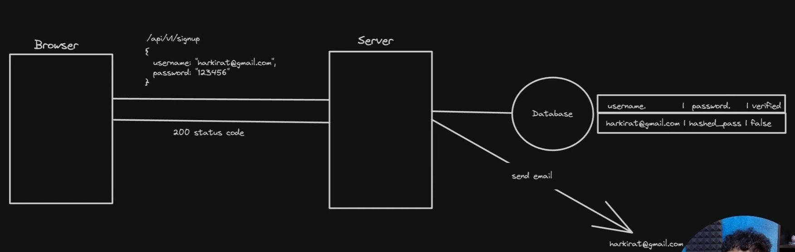

**SIGN IN flow**

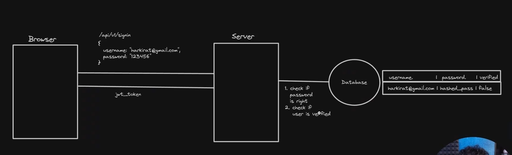

**AUTH REQUESTS flow**


The two lines which you are seeing from the `Browser` to `Server` in all the three pic above, **top line resembles the `Request` being sent from the `Browser` to `server` and the below line resembles the `response` coming from the `server` to the `Browser`**[Forgot the arrow sign to show them]

## **Authentication using cookies**
----------

### **About cookies**
----------
:bulb:**What are cookies ?**

Cookies in web development are __small pieces of data sent from a website and stored on the user's computer by the user's web browser while the user is browsing.__ They are designed to
be a reliable mechanism for websites to remember things <mark>**.(very similar to local storage).**</mark>

You can see your cookies in the `Application > Storage`,(Developers mode) just below the `local storage`.

>[!NOTE]
> Just as the **local storage is used for storing all your jwts similarly cookies folder is also used to store all your cookie**
>
> <span style="color:orange">**Difference ->**</span> **There are many out of which one difference is that `cookies` are stored automatically, you dont have to use the `localStorage.some_function` to store as you use to do for storing the `jwt`**

1. __Session Management :-__ Cookies allow websites to identify users and track their individual
session states across multiple pages or visits.
    + **For ex ->** Going on a blog reading website and then spending more time there searching for a thing now you will get the ad of reading website more than what you were getting previously, basically company have known that this user is interested in reading so show them more blog reading website.
2. __Personalization :-__ Websites use cookies to personalize content and ads. For instance,
cookies might store information about a user's preferences, allowing the site to tailor
content or advertisements to those interests.
    + **For ex ->** As you are well aware of the fact that if you are searching for the hair dryer even if you close the site, you get to see different hair dryers across various platforms such as instagram, facebook, etc.. 
3. __Tracking :-__ Cookies can track users across websites, providing insights into browsing
behavion This information can be used for analytics purposes, to improve website
functionality, or for advertising targeting.
4. __Security :-__ Secure cookies can be used to enhance the security of a website by ensuring
that the transmission of information is only done over an encrypted connection, helping to
prevent unauthorized access to user data.


<span style="color:orange">**We will be focusing on `4`(Security)**</span>

:bulb:**How things will change for doing authentication using cookies ??**

<span style="color:orange">**Nothing much, just the minimal change that initially you were sending the `jwt` once the user signs up successfully and store them inside the `local storage` and eventually this token needs to be sent from the user side in the subsequent `requests` to authorize the user further, NOW we will replace the `jwt` with the `cookies` and rest all things will remain same as that being done with `jwt`, also now `cookies` are stored inside the `cookies` folder instead of `local storage`**</span>

:bulb:**Why not LOCAL STORAGE ??**

Cookies and LocalStorage both provide ways to store data on the client-side, but they serve
different purposes and have different characteristics.
1. __Cookies are send with every request to the website (by the browser) (you don't have to explicitly add a header to the fetch call)__

This point becomes super important in `Next.js`, we'll see later why ??

<span style="color:orange">**The biggest benefit of storing the `cookie` inside the `cookies` folder and not inside the `local storage`(as we can do the same task of authentication as we were doing with `jwt` by storing the cookie in the `local storage`, then why to store in seperate `cookies` folder ) is**</span>

Ref - https://github.com/100xdevs-cohort-2/paytm/blob/complete-solution/frontend/src/pages/SendMoney.jsx#L45

you cant do something like the below in `Next.js`

```javascript
axios.post("http://localhost:3000/api/v1/account/transfer", {
    to: id,
    amount
}, {
    headers: {
        Authorization: "Bearer " + localStorage.getItem("token")
    }
})
```

2. Cookies can have an __expiry__ attached to them (and we know that you have to manually delete the `localstorage`, no such thing like **auto-expiry** exists)
3. Cookies can be be __restricted to only `https` and to certain `domains`__

**`Next.js` does not have access to `local storage`, WHY ??**

-> **The answer to the above question is -> When the BROWSER IS SENDING THE FIRST REQUEST, IT CANNOT EXPLICITLY SEND THE HEADER and that too in the first request as you know you dont have access to `local storage` in the first `request`, the reason you know, if not there is a detailed doc. present in the `Next.js` Notes folder**

In short -> `Next.js` does **server side rendering and hence this is not possible for the first request to access the `local storage`**

BUT if you are using `cookies` for authentication then one **very important property of cookies is**

>[!IMPORTANT]
> **BROWSER have the property that if a `cookie` is SET on the browser, then the browser will sent that `cookie` in every `request`**
>
> **You dont have to keep attaching it to the header and then sending it as you were doing for `jwt`, `cookie` are BY DEFAULT AUTOMATICALLY sent by the browser in the `request`**

>[!TIP]
> **If you want to get the user-specific data in the very first request, then you should use `cookies`**

> when you logout the cookies get cleared.

### **Work flow to do authentication using cookies**
----------

**SIGN UP using cookies**

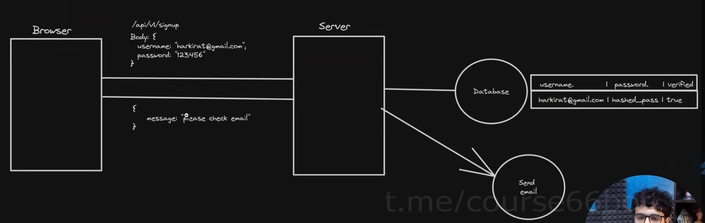

**SIGN IN using cookies**

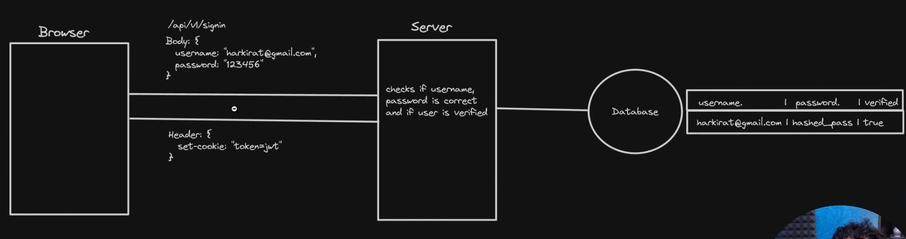

>[!IMPORTANT]
> **This is the biggest difference between what we used to do using `jwt` and what we used to do using `cookies` which is (shown above), SERVER SENDS THE HEADER THAT SAYS `Set-cookie` to the value present inside the `Set-cookie` header AND THE VALUE EVENTUALLY GETS STORED INSIDE THE `cookies` folder** 
>
> and then in the every subsequent `request`, browser will __keep sending the `cookie`__ **even if the `request` does not need the authorization or authentication**

**AUTH REQUEST OR SUBSEQUENT REQUEST using cookies**

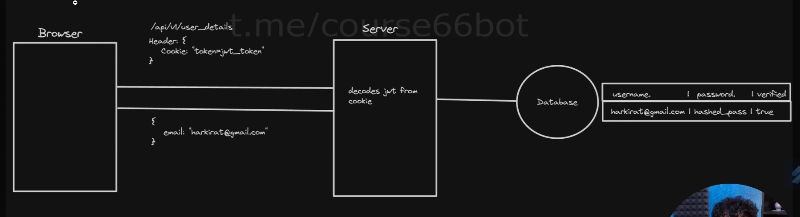

### **Properties of cookies**
----------

__Types of cookies__

1. __Persistent__ - Stay even if u close the window
    - **Your authentication cookie should probably be PERSISTENT** as even if you close the website, it should keep all your credentials as when you next time visit the website, you automatically gets logged in
2. __Session__ - Go away after the window closes
    - **You want the user for only few sessions and then logout them** like a chat room (as soon as the user has sent the credentials of one room to join, next time they will be alloted to the other room or i want to lessen the load at particular point of time so after a certain time, they will automatically get logged out). `ZOOM` in its free version used to give only **1 hour continuous duration of meeting**

__Properties of cookies__

+ __Secure__ - Sent only over secure, encrypted connections (`HTTPS`).(`jwt` me logic likhna pdta h that whether the token has came from secured site or not).
+ __HttpOnly__ - __Can NOT be accessed by client side scripts__(browser me jake koi v used koi function use krke access na kr le cookies ko ya uske content ko)
+ __SameSite__ - Ensures cookies are not send on cross origin requests(**basically 3 types listed below, will see later what does this means ??**)
  + __Strict__
  + __Lax__ - Only GET requests and on top level navigation
  + **None**
  

Reference - https://portswigger.net/web-security/csrf/bypassing-samesite-restrictions#:—:text=SameSite-is-a-browser-security,leaks%2C-and-some-CORS-exploits

+ __Domains__ - You can also specify what all domains should the cookie be sent from (**basically you can whitelist that on which of the website the cookie should go and on which it should not go**)[<span style="color:orange">**But why you dont want the cookie to go on all domains (reason given below)**</span>]

### **Cross Site Request Forgery(CSRF) Attacks**
----------
Before understanding this problem, lets first know that how this problem came,   


Lets say you `sign in` to your bank account, now you got the `cookies`(consisting of **your bank account information**) which will get stored inside the browser, Now a hacker has written some scripts and has embedded that inside the link and then sent this to you, you click on the link (as the link is genuinely the bank link but with `GET` request having some query parameters attached(like money to be transferred or just entering into the user account by signing in) to the url, hacker has not sent this to the bank as it will deny the `request` because hacker dont have authorization token) and hence clicking on the link you will execute the hacker scripts embedded inside the link and that logged in to your bank account as **if you are sending the `request` to the bank then as you have `cookie` and that will be sent AUTOMATICALLY by the browser (`cookie` property), so with the help of yours the hacker has made you logged in and hence even got the cookie with the help of scripts hacker has used**. Now as the hacker has `cookie`, it will use to login by hitting the `request` from its server and then **try to do whatever they want (like withdrawing of money, etc...) BASICALLY YOUR ACCOUNT IS HACKED NOW**

Now you can think that you will **Restrict the `request` to come from certain domains only so that even if hacker has sent `request` from its server and that too with the valid cookie, then also as it is coming from the domain which is not present in the bank domain, it will not allow it**

BUT, there are some **downsides of this approach (will come to know why ??)**, although this is partially true approach.

:bulb:**So how to avoid this ??**

-> **Basically you have to implement some MORE STRICT CHECK while sending the `cookie` from the server and this check include the `SameSite` to be `None`, `Strict` or `Lax` (if any of these is not there, then server will not authorize you)**

>[!IMPORTANT]
> **By default -> `SameSite` is set to `Lax` types**

Lets understand the type of `SameSite` 

### **`SameSite` types**
----------


+ **None ->** Allow it from anywhere (**so CSRF attack will remain present here**), so <span style="color:orange">**Never use it unless it is for some random cookie(like theme info. -> dark or light)etc..**</span>

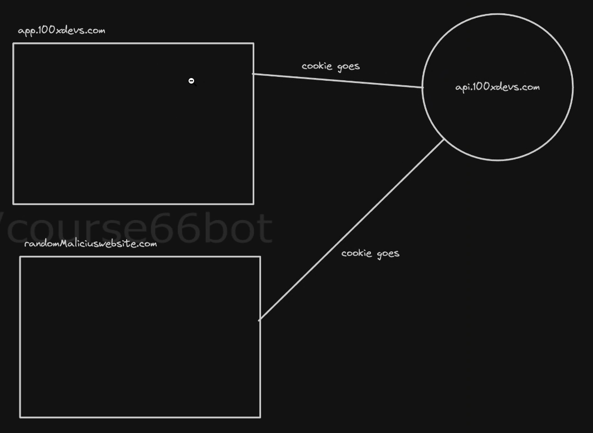

+ **Strict ->** means **Jo domains ko allow kiya h usi ko `cookie` bhejna h aur kisi ka nhi and also accept the `request` with cookie from that domains only, so any malicious website se cookie nhi bhej paoge tm**
    + you might think that `strict` is the best way to use for authentication cookies <span style="color:brown">**BUT THERE IS ONE PROBLEM with this also**</span>


**Problem of `SameSite : Strict`**

before understanding the problem, lets first know about some point 

>[!NOTE]
> `cookie` **are not just used for backend purpose, in `Next.js`, it is also sent for frontend part**

Now understanding the problem, this is how the content management system like (100xdev.com website), do the **pre-rendering of the page, you basically go to the main website with the `cookie` and then with the help of this `cookie`, `Next.js` will hit the database, renders the page according to that on itself(i.e. `Next.js` server and finally PRE-RENDERS the page) that's how you already see yourself logged in in your account with all your courses displayed (due to the `cookie` sent to the server which in turn sent to the database)**


Now lets say i have another website(see the above pic for better clarity of the problem) whose work is to just redirect the user to our main page (as the content is present on the main site) [practically this is done so that you can segregate the things (like for content one website, for introduction another website)], so now although this is your website only but as you have set the **`SameSite` to `Strict` in your main page and added only the main page as `domains` allowed** so although your helper website is trying to redirect the user to your main website but as it is coming from a site which is not inside the `domains` of main website `cookie`, the `SameSite` which is set to `Strict` will **not send the cookie from the `request` sent**

>[!IMPORTANT]
> **The above thing is also known as `TOP LEVEL NAVIGATION`**


+ **Lax ->** **Middle of `Strict` and `None`** means Don't allow it from anywhere but if a different website is doing Top level navigation then **send the cookies, its fine as they are trying to divert the sudden traffic boom on our website so that user can see the main website with already logged in**

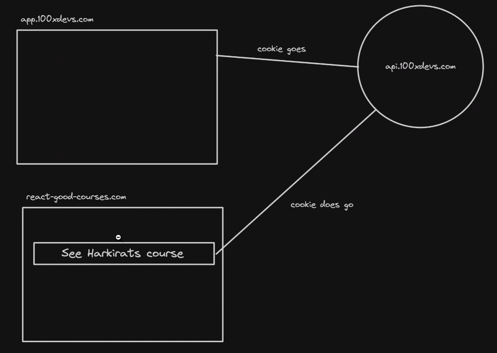

>[!IMPORTANT]
> **The `request` must be in the above case be `GET` request, it should not be other than this request (like `POST`, `DELETE` etc.. as these have the power to change the data so the CSRF attack can then be possible )**
>
> But as long as it is `GET` request and it uses top-level navigation, everything is fine even if it is malicious website

## **Coding up the cookie based authentication**
----------


### **Backend part**
----------


The process is pretty simple, rather than sending back the token and explicitly storing it on the `local storage`, you will just here send `set-cookie` header and browser will take care of sending it back 

BUT we still need `jwt` (or any verifiable token that will be sent to the server by the browser), **Remember -> only how it is being sent to the server is DIFFERENT, EARLIER -> it is being sent in the AUTHORISATION header which is set EXPLICITLY in the `request`, NOW it will come INSIDE A COOKIE but in the end, you will get a token that you need to verify and based on that you will be able to get the identity of the user**

**Step 1 ->** Initialize an empty `TS` project 

```javascript
npm init -y 
npm tsc --init 
```

**Step 2 ->** Update `rootDir` and `outDir`

```javascript
"rootDir" : "./src"
"outDir" : "./dist"
```

**Step 3 ->** Add required libraries

```javascript
import express from "express"
import cookieParser from "cookie-parser" // 2
import cors from "cors"  
import jwt, {JwtPayload} from "jsonwebtoken" // "JwtPayload" is the TYPE, just given for the purpose of  typescript type safety check if you dont want give it to "any" type
import path from "path" // will see below what this is for ?? 
```
**Step 4 ->** Intialize express app, add middlewares

```javascript
const app = express()
app.use(cookieParser())
app.use(express.json())

app.use(cors({ // 3
    credentials : true,
    origin : "http://localhost:5173"
}))
```

**Explantion of `// 2` code**

**`cookieParser` as the name suggests is a MIDDLEWARE USED TO PARSE THE COOKIES into an easier and more understandable format**

:bulb:**Can't we use `req.headers["Cookie"]` to extract the cookies from the `request header` ??**

-> __Yes__ definitely we can do this and **you dont even need `cookieParser` but the `response` which you get while doing `req.headers["Cookie"]` will be a VERY LONG STRING which you have to PARSE TO get an object(consisting of token) (SUCH A TEDIOUS JOB) so instead of doing all this directly use the `cookieParser` library and this will automatically parse the `cookie` to the object**

**Explanation `// 3` code**

Till now we have used the `cors` like this -> `app.use(cors())`, but here we are using it different way reason for this??

>[!IMPORTANT]
> In `Express.js`, if you are **allowing `CORS` and you want the cookies to be set, then you must have to pass the `credentials : true` and give an origin(only from this you are able to SET the COOKIES, if from others you will try to set then `CORS` will not let you do and thats why you see that you are being re-directed to other website(which has been given in `CORS`) for signing in or signing up) while using `CORS`**

>[!CAUTION]
> __If your backend and frontend both are at different places (CORS case), then you must have to use the `CORS` in this manner only__ 
>
> app.use(cors({
> credentials : true,
> origin : "http://localhost:5173"
> })) __// Basically you have to put the url of FRONTEND in the "origin" part which is allowed to set the cookie__
>
> If the above is not the case then you do not have to do this thing

**Step 5 ->** Add a dummy `sign in` endpoint

```javascript
app.get("/signin", (req, res) => {
    const email = req.body.email
    const password = req.body.password

    // write db validations logic here, fetch id of user from db 
    const token = jwt.sign({
        id : 1
    }, JWT_SECRET)
    res.cookie("token", token) // this function will put the cookie in the set-cookie header and the user will be returned with this header, "token"(double quotes one) is just the name of the token (you can name it anything)
    // THE ABOVE IS HOW YOU SET THE COOKIE FOR THE USER
    res.send("Logged in!")
})
```

**Step 6 ->** Add a protected backend route

```javascript
app.get("/user", (req, res) => {
    // BELOW IS HOW YOU GET THE COOKIE FROM THE USER 
    const token = req.cookies.token // This is how the server will extract the cookie sent by the browser (by default)
    // if not done the above step then 
    // const cookieString = req.headers["Cookies"] // and then the cookieString will be PARSED to extract the cookie
    const decoded = jwt.verify(token, JWT_SECRET) as JwtPayload
    // Get email of the user from the database logic here 
    res.send({
        userId : decoded.id 
    })
})
```
**Step 7 ->** Add a logout route

```javascript
app.post("/logout", (req, res) => {
    res.cookie("token", "") // set the cookie named as "token" to None (empty string)
    // you can also do the below thing 
    res.clearCookie("token")
    res.send({
        message : "Logged out"
    })
})
```

**Step 8 ->** Listen on port 3000

```javascript
app.listen(3000)
```

Full code can also be accessed from here -> [Cookie based auth system](https://github.com/100xdevs-cohort-2/week-16-auth-1)


**Output ->**

running first the `npm run build` and then `npm run start` and then sending the `request` from POSTMAN, you will see the below output ->

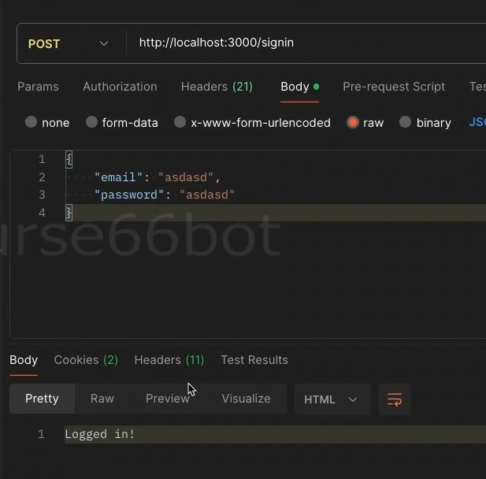 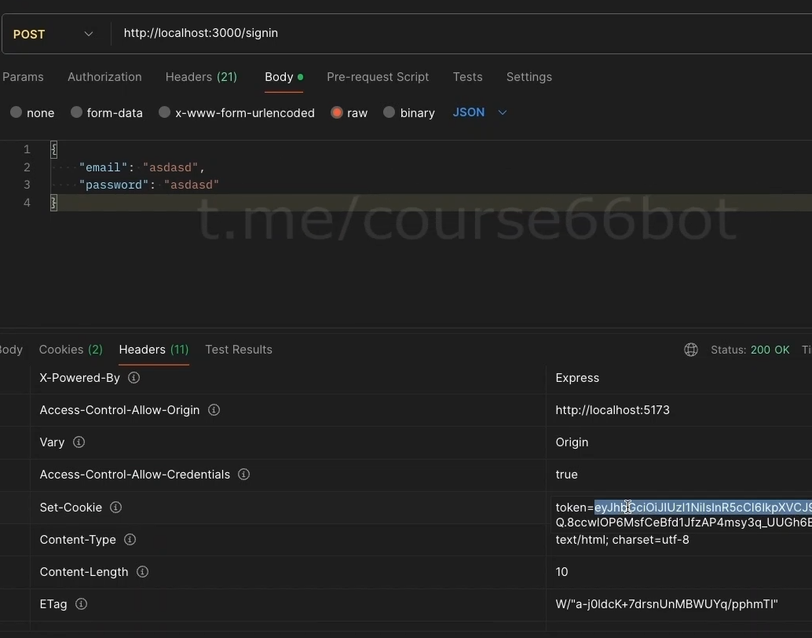

You can clearly see in the right pic that you have got the token inside the `Set-Cookie` header. 


Now **you can send and make cookie store inside the browser as many as you want like**

```javascript
app.get("/signin", (req, res) => {
    const email = req.body.email
    const password = req.body.password

    const token = jwt.sign({
        id : 1
    }, JWT_SECRET)
    res.cookie("token", token)
    res.cookie("token5", token) // just add  another cookie with another name and value as per your needs (for simplicity, here we have taken the same value as that with "token" name)
    res.send("Logged in!")
})
```

and now if you see the in the `headers` section ->

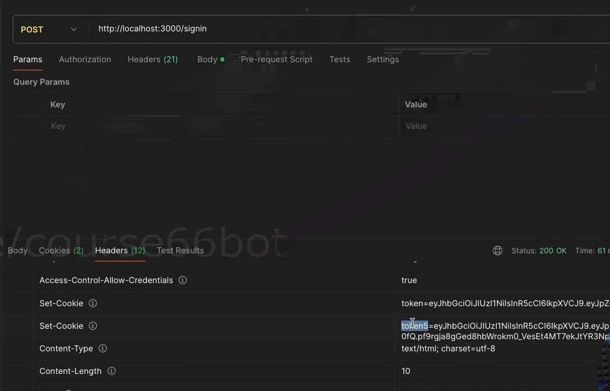

you will see that there are 2 token coming with the name being `token` and `token5` storing the same value.

Also if you now send a `request` to the `logout` route then you will see the output as 

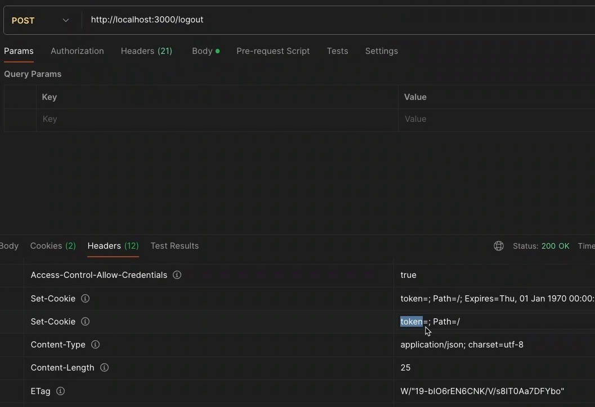

you will now see that the `token` is **now empty**

### **Frontend part**
----------
Coding up the `signin` frontend page 


```javascript
import { useState } from "react"
import { BACKEND_URL } from "../config"
import axios from "axios"

export const Signin = () => {
    const [username, setUsername] = useState("")
    const [password, setPassword] = useState("")

    return <div>
        <input onChange={(e) => {
            setUsername(e.target.value);
        }} type="text" placeholder="username" />
        <input onChange={(e) => {
            setPassword(e.target.value);
        }} type="password" placeholder="password" />
        <button onClick={async () => {
            await axios.post(`${BACKEND_URL}/signin`, {
                username,
                password
            }, {
                withCredentials: true, // as our frontend and backend are on different website, so we must have to use CORS key knwon as "withCredentials" and set its value to "true" 
                // You must be also thinking that the second parameter is used to send the headers, body, while using app.post and you are doing the same thing here(but at the start only we have learnt that no need to attch it in header, browser automatically attaches it(cookie)), see if CORS exists on the project, then only you do this otherwise NO NEED TO DO THIS(pass the second parameter "withCredentials")
            });
            alert("you are logged in")
        }}>Submit</button>
    </div>
}
```

Now making the frontend for `user.tsx` file 

```javascript
import axios from "axios";
import { useEffect, useState } from "react"
import { BACKEND_URL } from "../config";

export const User = () => {
    const [userData, setUserData] = useState();

    useEffect(() => { // When the component mounts for the first time 
        axios.get(`${BACKEND_URL}/user`, { // Send a request to the backend
            withCredentials: true,
          })
            .then(res => {
                setUserData(res.data); // Get all the data from the backend 
            })
    }, []);

    return <div>
        You're id is {userData?.userId}
        <br /><br />
        <button onClick={() => {
            axios.post(`${BACKEND_URL}/logout`, {}, {
                withCredentials: true,
            })
        }}>Logout</button>
    </div>
}
```
Running the frontend, 

**Output**

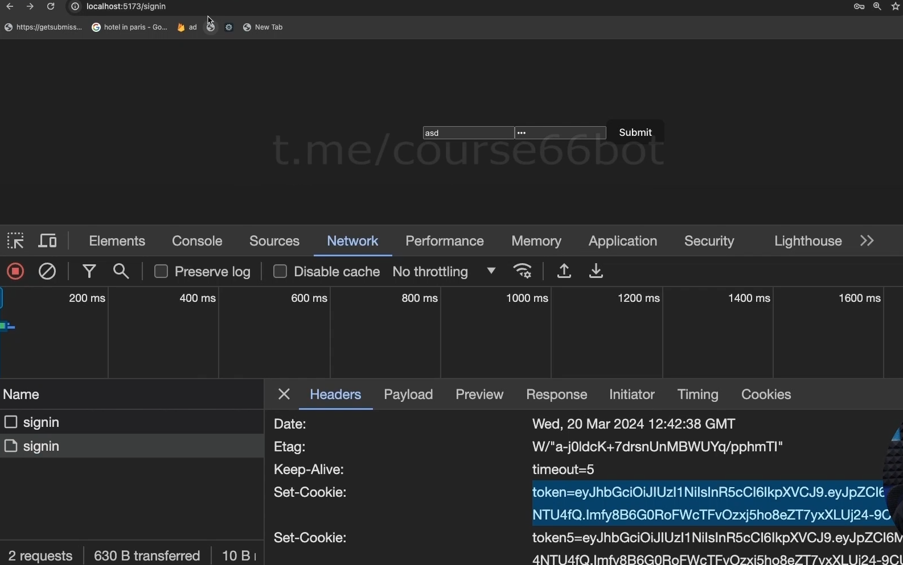 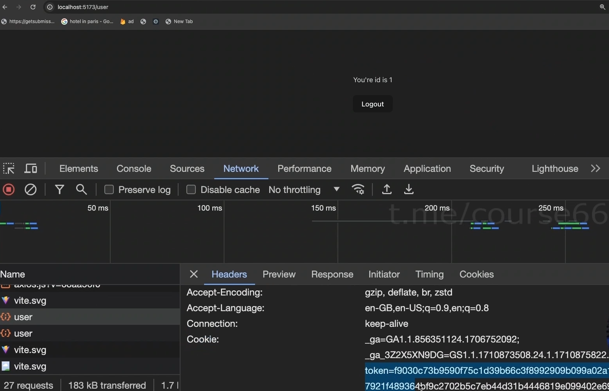

left part -> `sign in` endpoint (Notice the cookie came back and stored inside the browser) and right part -> `user` endpoint (Notice the cookie is also sent on this route), even if you go to the random route of the same website then also the cookie will go with it 

Now in this you will also see that **It also consists of the code on how to serve the frontend inside the backend (this was how the things used to happen in previous days (exmaple -> `EJS`)**`**. Go to the `backend` folder and you will see that `index.html` file is present there now if you see the content of it you will notice that you have made frontend on the backend route only and even if you go to `http://localhost:3000`, you will also see almost similar page like that you will see when running the frontend folder code

The things to learn from the above para is that you do not have to send `"withCredentials" : true` as here `CORS` issue will not occur as **Frontend to backend me he likha h using `index.html` file and also ALL THE REQUEST ARE HAPPENING ON THE SAME REQUEST AS THAT OF BACKEND** [<span style="color:orange">**backend and frontend on the same endpoint JUST LIKE `Next.js`**</span>]

:bulb:**If the frontend and backend can be hosted on the same endpoint by just using `express` then why to use `Next.js` ??**

-> Because `Next.js` is **REACT + BACKEND** but the above approach is **NON-REACT (just by using the `html` and `js` you can do some task) + BACKEND**

so if you now run the command `npm run build` and then `npm run start` inside the backend folder, then you will see output similar to this ->

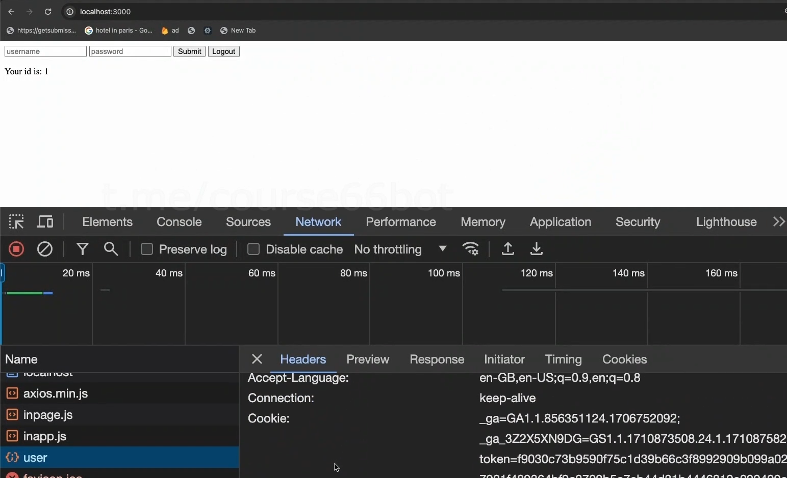

Notice even in the backend you can see the basic `sign in` and `logout` button and it works the same way as that in frontend (cookie is generated and stored here also in the browser)

`Logout` also works in the same way as that in frontend.