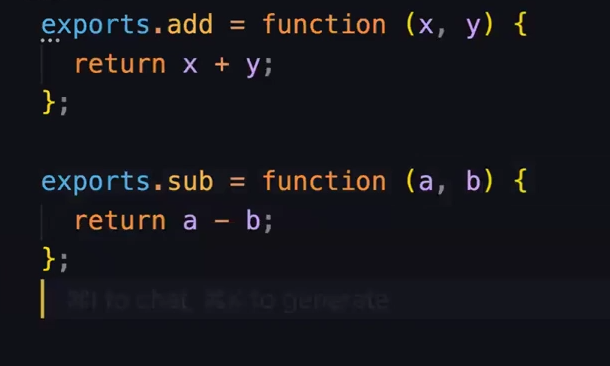
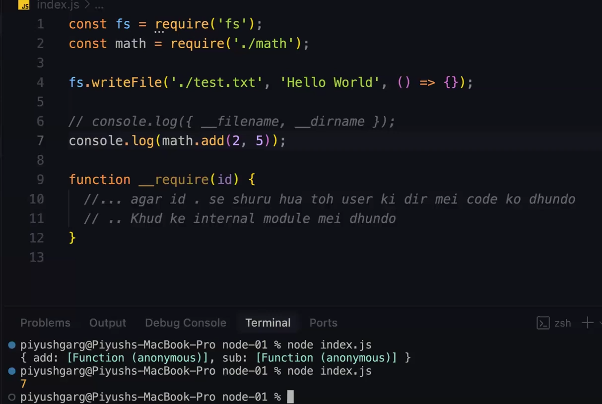

# __Backend Internals__

- [__Backend Internals__](#backend-internals)
  - [__Insights to JS__](#insights-to-js)
  - [__Semantic Versioning__](#semantic-versioning)
  - [__Creating your `http` server__](#creating-your-http-server)
  - [__How to make Routes in `http` server__](#how-to-make-routes-in-http-server)

:bulb: **What is NodeJS ??**

Ans -> Node JS is **Runtime environment** made to run javascript locally on your machine.It is neither a framework nor a langauge. It is based on **V8 Engine** which is owned by chorme similar to **Spider Monkey -> Firefox** and **Apple Webkit -> safari** 


similar to NodeJs came another player known as **Deno** and then **Bun (Latest) It is very fast** but bun sometimes crashes as it takes time to get stable over time.

:large_blue_diamond: **Bun has a fetaure to make it used as DropIn Replacement**

**DropIn Replacement**

-> Internally their whole architecture has changed but the to use it is same as that used in **node.js** 

so agar koi code maine `node.js` mein likha h to as it is me `bun` me **DropIn** kr skta hu same to same chlega with faster speed.

> :sparkle: Deno is **Not** a dropin Replacement

## __Insights to JS__
----------

```javascript
const fs = require('fs');

fs.writeFile('./test.txt', "hello world", () => {});
```

:bulb: **Have you ever thought although i have not imported any package or installed any of it how `.writeFile()` is able to execute ??**

-> If you will run the above code in browser you will get an error saying `require is not defined`

**How NodeJs handles it ??**

-> basically `node.js` internally **make a function internally and globally** which act as a wrapper class to these function 

```javascript
function execute(exports, require, modules, __filename, __dirname){
    const fs = require('fs');

    fs.writeFile('./test.txt', "hello world", () => {});
    
    // wraps your code inside the execute function
}
```

now when you execute the `execute()` function then through `execute()` function you are given access to these things :-

- **exports** -> interusuablity of logic from one file to other
- **require** -> kisi v module(here `fs`) ko use krne ke liye 
- **modules** -> `node` ke andar different modules where various functionalities are there used to ease task
- **__filename** -> name of file(whose code you are trying to run)
- **__dirname** -> directory path of the file (where is that present ??)

interanlly they have made / implemented these function inside `execute()` and hence you can also call them callback function.

```javascript
const fs = require('fs');

fs.writeFile('./test.txt', "hello world", () => {});

console.log({__filename, __dirname});

// will give the output  -> filename and foldername in which it is written
```

although you have not made these variables ( `__filename` or `__dirname`) then also you are able to access

**Reason ->** as internally `node` has made these variable, and at runtime i will have these two variables

:bulb: **Why is this needed ??**
 
- `require` ki jarurat h kyunki file kaise laoge ??
- Mujhe pta to hona chahiye kaun se file kaun se folder me kaam kr rha hu me
- **File system** ke bare me knowledge hona chahiye

**Use of `exports`**

```javascript
const fs = require('fs');
const math = require('./math'); // as we want to use the code written in './math' we used require (Remeber import, export use krna not allowed without it, dimag lgao)  // 2

fs.writeFile('./test.txt', "hello world", () => {});

function require(id){
    // a -> agar require ki id "." se shuru hoti h toh user ki  directory me code ko dhundho
    // WARNA
    // b -> node ki internal modules me dhundho
    // FIR v nhi mila to
    // c -> node modules (npm install) me dhundho
    // NOW also nhi mila
    // d -> ERROR throw kr do
}
```
**`// 2` code**

import to kr liya but `math.js` se code ko export v to krna pdega how will you do that ?? it was a problem needs to be handled 

so `node.js` made a **Object** known as `exports` (<mark>**.Remember exports h export nhi.**</mark>) (kept inside the wrapper you can see it above (where __filename, require is written)) and with this you can export it and with help of `require` you can use that 

> :sparkle: `require` ne `export` naam ke variable me jo v aaya usko file jisme `require` use hua h wahan le aaya


in `math.js`

 

and in `index.js`



you can see i was able to use without `export` and `import`


> :sparkle: __Simply saying__ `exports.kuch_v` jaise he kiya now you can you use `kuch_v` on any file by just using as object ( `file_name.kuch_v`). Thats what exactly is shown above

> :warning: **Remember** there can be multiple `exports.`(named export) but for a file there will only be **one `module.exports` (this is default export)**

## __Semantic Versioning__
----------


whenever you see any version in something you will see it particular version like

```javascript
"express": "^4.21.2"
```

taking the above example 

`^` known as **Symbolic Version change**
`4` known as **Major Version**
`21` known as **Minor Version**
`2` known as **Patch**

**Difference between them**

- **Symbolic Version Change ->** used to **automatically update the version**
    + `^`**Caret** -> means tm __major version__ ko kuch mt krna but __minor and patch__ ko apne aap change krte rhna (Best yhi hota h)
    + no symbol -> like `4.21.2` means it will stick to this version only no matter what
    + `~`**Tilde** -> sirf __patch version__ change hoga apne aap rest sb same  
- **Major Version ->** aisa change jisme functionalities change ho jaye (iss case me code break krega) also known as **Breaking changes** then this code is increased
- **Minor Version ->** aisa change jo functionalites me koi change to nhi krega but nayi functionalites aur add kr dega like -> phle add ka function tha bs ab sub ka v h ( isse v tmhara code nhi break krega) then this bit is increased.
- **Patch Version ->** aisa change jo functionalities me koi change nhi krte ho kuch v change nhi hota bas kuch small features add ho jata h like -> bug solve, securites added, documentaion added (which will not break your code) then this bit is increased

just type `change log` on `google` of any thing to know about all the version change done on that

## __Creating your `http` server__
----------


```javascript
const http = require('http'); // 1

const server = http.createServer(function (req, res){
    console.log('Incoming request aaya')
    res.send('Ye lo ji response')
}); // 2

server.listen(8000, function () {
    console.log(`server started`)
}) // 3
```

**Explanation `// 1` code**

we can create our own http server using `http` module thats why `require` that

**Explanation `// 2` code**

we can create a new server using inbuilt `.createServer()` function which takes a **callback function** to handle the **request** and **response**

**Explanation of `// 3` code**

To listen to the server we use `.listen()` which take two arguments :-
- **Port**
- **Callback function**


## __How to make Routes in `http` server__
----------


by using `req.method()` and `req.end()` we can make **our own Routes** [No need to use `Express`]

```javascript
const http = require('http');

const server = http.createServer(function (req, res){
    console.log('Incoming request aaya')
    switch (req.method) { // *
        case 'GET':
        {
            if(req.url === '/')return res.send('HomePage');
            if(req.url === '/contact-us')return res.send('Contact Us page');
            if(req.url === '/about-us')return res.send('About us Page');
        }
        break;
        case 'POST':
        {
            // Post ka kuch kuch kaam
        }   // #

    }
    res.send('Ye lo ji response')
});

server.listen(8000, function () {
    console.log(`server started`)
}) 
```

this is how you make routes -> from `// *` to `// #` but dont you think this is a overwhelming code <span style="text-decoration: underline; text-decoration-color: orange; text-decoration-thickness: 2px;"> to solve this only we use `Express` package</span>

using `express` to simplify the above code 

```javascript
const http = require('http');
const express = require('express');


const app = express();

app.get('/', (req, res) => res.send('HomePage'));
app.get('/contact-us', (req, res) => res.send('Contact Us Page'));
app.get('/about-us', (req, res) => res.send('About Us Page'));

const server = http.createServer(app); // http server khud handle kr lega kahan jana h 

app.listen(8000, function () {
    console.log(`server started`)
})  // as jb sara cheez express ko de he diya h to listen v de he do wo apne aap handle kr lega
```
kaam is same as above code but `express` made it more cleaner and better to understand 

and now you can see the code is same as that you write when using `express` 

> :sparkle: so simply saying `express` is simply a **Wrapper** similarly `koa`, `fastify` are also there, they work similar to `Express`


