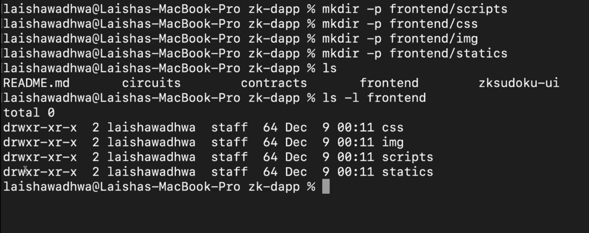

# Bash and Terminals ( Advanced )

## Handling with Files and Folders
----------


### `pwd`
----------

> :pushpin: `pwd` is the command to **which directory you are currently at ?? or prints the path of the directory where you are currently at**

```console
C:\Users\rajsa>pwd
/c/Users/rajsa
```

### `ls`
----------


> :pushpin: `ls` is the command to **know about the subdirectories, files, and other thing present inside the current directory**

```console
C:\Users\rajsa\Desktop>ls
 Desktop  'Developement View.lnk'   Prep   desktop.ini
```

:large_orange_diamond: `ls` comes with a large number of functions lets see them one by one 

#### `ls -l`
----------


> :pushpin: **to gain more information about the file and directories present inside it** we use `ls -l`

```json
C:\Users\rajsa\Desktop> ls -l
total 9
drwxr-xr-x 1 rajsa 197609    0 Apr 16 19:32  Desktop  // 1
-rwxr-xr-x 1 rajsa 197609 2388 Mar  9 13:28 'Developement View.lnk' // 2
drwxr-xr-x 1 rajsa 197609    0 May 17 15:45  Prep
-rw-r--r-- 1 rajsa 197609  282 Dec 28  2023  desktop.ini
```
**Explanation of `// 1` and `// 2` code**

- `drwxr-xr-x` -> as it starts with `d` means it is a **directory**
- `-rwxr-xr-x` -> as it starts with `-r` means this is **file**

- `1` -> **no. of References** for this directory or file

- `rajsa` -> **owner of directory**

- `197609` -> **Group Owner**

- `2388` -> **size in BYTES**
- `Mar 9 13:28` -> **Last modified date and time stamp**
- `Desktop` -> **link to this directory**

#### `ls -l Prep` 
----------

>:pushpin:**directly see the sub content of a particular directory**

```json
C:\Users\rajsa\Desktop>ls -l Prep
total 101020
-rw-r--r-- 1 rajsa 197609     4018 May 17 15:42  Backend_Developer_Interview_Preparation.pdf
-rw-r--r-- 1 rajsa 197609  1712374 May 17 15:43 'DBMS Interview Q&A.pdf'
-rw-r--r-- 1 rajsa 197609 57896039 May 17 15:43 'JS Interview Question Answers NEW.pdf'
-rw-r--r-- 1 rajsa 197609   978312 May 17 15:44 'Java Basics Interview Q&A.pdf'
-rw-r--r-- 1 rajsa 197609  2421278 May 17 15:45 'MongoDB Interview Q&A.pdf'
-rw-r--r-- 1 rajsa 197609  2401410 May 17 15:44 'MySQL Interview Q&A New.pdf'
-rw-r--r-- 1 rajsa 197609 35682149 May 17 15:44 'NodeJS & ExpressJS Interview Q&A.pdf'
-rw-r--r-- 1 rajsa 197609  2333196 May 17 15:43 'OS Interview Q&A (1).pdf'
```

Instead of going inside the `Prep` directory and then using the `ls -l` diredtly do that by **chaining**

#### `ls -R`
----------


> :pushpin: <mark>**.Most adavanced command.**</mark> lets you **see all the files and folder(and if a folder is present inside folder and so on it will show till it get the last file or folder) inside this directory**
>
> <span style="color:orange">BUT</span> It does not provide more **insights** to all the files and folder chain present which was possible with `ls -l` **use Chaining(see below) with `ls -l`** to get it done


```json
C:\Users\rajsa\Desktop>ls -R Prep
Prep:
 Backend_Developer_Interview_Preparation.pdf  'Java Basics Interview Q&A.pdf'  'New folder'
'DBMS Interview Q&A.pdf'                      'MongoDB Interview Q&A.pdf'      'NodeJS & ExpressJS Interview Q&A.pdf'
'JS Interview Question Answers NEW.pdf'       'MySQL Interview Q&A New.pdf'    'OS Interview Q&A (1).pdf'

'Prep/New folder': // Prep ke andar ek aur folder h named "New folder" and inside it
'End sem admit card.pdf' // exists this another file
```

#### `ls -t`
----------


> :pushpin: helps to **get the last modified file or folder (oldest are at last and new are at begining)**

```json
C:\Users\rajsa\Desktop>  ls -lt Prep // You can club also two or more commands to get the functionality of both the command (here ls -l + ls -t) = ls -lt used
total 101020
drwxr-xr-x 1 rajsa 197609        0 May 22 00:30 'New folder' // recently modified folder
-rw-r--r-- 1 rajsa 197609  2421278 May 17 15:45 'MongoDB Interview Q&A.pdf' // 2nd most recently modified file and so on
-rw-r--r-- 1 rajsa 197609 35682149 May 17 15:44 'NodeJS & ExpressJS Interview Q&A.pdf'
-rw-r--r-- 1 rajsa 197609  2401410 May 17 15:44 'MySQL Interview Q&A New.pdf'
-rw-r--r-- 1 rajsa 197609   978312 May 17 15:44 'Java Basics Interview Q&A.pdf'
-rw-r--r-- 1 rajsa 197609  1712374 May 17 15:43 'DBMS Interview Q&A.pdf'
-rw-r--r-- 1 rajsa 197609  2333196 May 17 15:43 'OS Interview Q&A (1).pdf'
-rw-r--r-- 1 rajsa 197609 57896039 May 17 15:43 'JS Interview Question Answers NEW.pdf'
-rw-r--r-- 1 rajsa 197609     4018 May 17 15:42  Backend_Developer_Interview_Preparation.pdf
```

#### `ls -a`
----------


> :pushpin: `ls -a` primarily helps to **see the Hidden file**
>
> club with `ls -la` to get more insights on these file


```json
drwxr-xr-x 1 rajsa 197609    0 May 17 15:42  .  // hidden folder not came initially with ls -l or ls
drwxr-xr-x 1 rajsa 197609    0 May 18 14:39  .. // same with this you can also verify it by seeing above code
drwxr-xr-x 1 rajsa 197609    0 Apr 16 19:32  Desktop
-rwxr-xr-x 1 rajsa 197609 2388 Mar  9 13:28 'Developement View.lnk'
drwxr-xr-x 1 rajsa 197609    0 May 22 00:29  Prep
-rw-r--r-- 1 rajsa 197609  282 Dec 28  2023  desktop.ini
```

#### `ls -r`
----------


> :pushpin: similar as `ls -R` but this will **reverse the order in which it was modified (last one will be recently modified) DESCENDING ORDER (jo sbse purana h wo sbse phle aayega)**

### Finding a particular type of file

#### `ls -lR | grep file_type` or `ls *.file_type`
----------


> :pushpin: **This will recursively GO TO ALL FOLDERS present inside this directory and will list out all the file of the given file type**
>
> **It RECURSIVELY searches for all the file**

```json
C:\Users\rajsa\Desktop>ls -lR | grep .pdf
-rw-r--r-- 1 rajsa 197609     4018 May 17 15:42 Backend_Developer_Interview_Preparation.pdf
-rw-r--r-- 1 rajsa 197609  1712374 May 17 15:43 DBMS Interview Q&A.pdf
-rw-r--r-- 1 rajsa 197609 57896039 May 17 15:43 JS Interview Question Answers NEW.pdf
-rw-r--r-- 1 rajsa 197609   978312 May 17 15:44 Java Basics Interview Q&A.pdf
-rw-r--r-- 1 rajsa 197609  2421278 May 17 15:45 MongoDB Interview Q&A.pdf
-rw-r--r-- 1 rajsa 197609  2401410 May 17 15:44 MySQL Interview Q&A New.pdf
-rw-r--r-- 1 rajsa 197609 35682149 May 17 15:44 NodeJS & ExpressJS Interview Q&A.pdf
-rw-r--r-- 1 rajsa 197609  2333196 May 17 15:43 OS Interview Q&A (1).pdf
-rw-r--r-- 1 rajsa 197609 88272 May  7 10:18 End sem admit card.pdf // although ye new folder(a folder which is inside Desktop) ke andar tha then also it got listed so it go to every folder (if sub folder present then also go till last and list down the file with given file type)
```

Similarly `ls *.file_type` works but the difference is **It does not find the file Recursively (It searches for that file type only in that directory)**

```json
C:\Users\rajsa\Desktop\Prep>ls -lR *.pdf
-rw-r--r-- 1 rajsa 197609     4018 May 17 15:42  Backend_Developer_Interview_Preparation.pdf
-rw-r--r-- 1 rajsa 197609  1712374 May 17 15:43 'DBMS Interview Q&A.pdf'
-rw-r--r-- 1 rajsa 197609 57896039 May 17 15:43 'JS Interview Question Answers NEW.pdf'
-rw-r--r-- 1 rajsa 197609   978312 May 17 15:44 'Java Basics Interview Q&A.pdf'
-rw-r--r-- 1 rajsa 197609  2421278 May 17 15:45 'MongoDB Interview Q&A.pdf'
-rw-r--r-- 1 rajsa 197609  2401410 May 17 15:44 'MySQL Interview Q&A New.pdf'
-rw-r--r-- 1 rajsa 197609 35682149 May 17 15:44 'NodeJS & ExpressJS Interview Q&A.pdf'
-rw-r--r-- 1 rajsa 197609  2333196 May 17 15:43 'OS Interview Q&A (1).pdf'
```

### Finding a particular file or folder
----------


#### `ls wild_card_match*`
----------


> :pushpin: This will let **you to find a paticular file or folder with name -> wild_card-match (close or exact name of what you want to find) within that directory**

```json
C:\Users\rajsa\Desktop\Prep>ls Backend*
Backend_Developer_Interview_Preparation.pdf

C:\Users\rajsa\Desktop\Prep>ls Interview*
ls: cannot access 'Interview*': No such file or directory  // It will not find any middle name only first name will be found and matched for file or folder
```

#### `cd ../../ and so on` (multiple hops)
----------


> :pushpin: The number of times you will use `../` with `cd` **It will go previous these many times**

```json
C:\Users\rajsa\Desktop\Prep> cd ../.. // 2 folder peeche (Prep and then Desktop)

C:\Users\rajsa>pwd
/c/Users/rajsa

C:\Users\rajsa>
```

### **Viewing the file**
----------


#### `cat`
----------

> :pushpin: helps to **see or view the content inside the file**
>
> BUT :warning: Remember this will open **Only file which are in text or code format (ex -> .cpp, .txt, etc...)**

```json
C:\Users\rajsa\Desktop\Prep\New folder>ls
'End sem admit card.pdf'   gpt.cpp

C:\Users\rajsa\Desktop\Prep\New folder>cat gpt.cpp
#include <bits/stdc++.h>

using namespace std;

void transpose(int arr[][3], int row, int col){
    for (int i = 0; i < row; i++){
        for (int j = i + 1; j < col; j++){
            swap(arr[i][j], arr[j][i]);
        }
    }
}

void printArray(int arr[][3], int row, int col){
    for (int i = 0; i < row; i++) {
        for (int j = 0; j < col; j++){
            cout << arr[i][j] << " ";
        }
        cout << endl;
    }
}

int main(){
    int col = 3;
    int row = 3;
    int arr[3][3] = {{1, 2, 3}, {-1, 6, 1}, {2, 4, 8}};

    cout << "Printing the initial array" << endl;
    printArray(arr, row, col);
    cout << "Transpose in action" << endl;
    transpose(arr, row, col);
    cout << "Printing the transposed array" << endl;
    printArray(arr, row, col);
    return 0;
}
```
### **Adding a file**
----------
#### `touch`
----------
>:pushpin:**Lets you create new file**

```json
C:\Users\rajsa\Desktop>touch newfile.txt

C:\Users\rajsa\Desktop>ls
 Desktop                          Postman.lnk  'Screenshot 2025-07-06 135620.png'   newfile.txt
'JusPay Online Assessment.docx'   Prep          desktop.ini
```
__You can see `newfile.txt` has been made__

### **Modifying the data**
----------
#### `cat > file_name_in_which_you_want_to_add_something_first_time`
----------

>:pushpin:**This will add the lines which you will write in the command**

```json
C:\Users\rajsa\Desktop>cat > newfile.txt
Hello Satyam
How are you ??
C:\Users\rajsa\Desktop>cat newfile.txt // you can see the file has got the data we added
Hello Satyam
How are you ??
```
:large_blue_diamond: **Just press `ctrl + D` to save the text which has been added**

#### `cat >> file_name_in_which_you_want_to_add_something`

>:pushpin:**This will add the lines which you will add or write in the command and inside that file already some contents are present**

```json
C:\Users\rajsa\Desktop>cat >> newfile.txt
I am fine
How about you ??
C:\Users\rajsa\Desktop>cat newfile.txt
Hello Satyam
How are you ?? I am fine
How about you ??
```

**By default it appends to the bottom**

### **Adding a folder or directory**
----------
#### `mkdir`
----------

>:pushpin:**This helps to create folder or directory inside the present directory**

```json
C:\Users\rajsa\Desktop>mkdir newFolder && cd newFolder

C:\Users\rajsa\Desktop\newFolder>
```
**You can use `&&` operator to make the folder as well as navigate to it in the same line of command**

##### `mkdir directory_structure(but with not "/" instead this "\")`
----------

> :pushpin: **This helps to recursively create multiple directory**

Lets say you want to make a folder inside the newly made above folder(`newFolder`) named as `Frontend` and inside that multiple directories to store multiple things, then to do this we use this command

```json
C:\Users\rajsa\Desktop\newFolder>mkdir Frontend\css

C:\Users\rajsa\Desktop\newFolder>mkdir Frontend\scripts

C:\Users\rajsa\Desktop\newFolder>mkdir Frontend\images

C:\Users\rajsa\Desktop\newFolder>ls
Frontend

C:\Users\rajsa\Desktop\newFolder>ls -l Frontend
total 0
drwxr-xr-x 1 rajsa 197609 0 Jul 29 00:44 css
drwxr-xr-x 1 rajsa 197609 0 Jul 29 00:44 images
drwxr-xr-x 1 rajsa 197609 0 Jul 29 00:44 scripts
```
if you are working on `linux` then this same command will be 




### **Editing and Movement related commands**
----------


#### **Editing the file or folder**
----------


##### `mv file_name file_name_you_want_to_replace_with`
----------
>:pushpin:**Helps to RENAME the file or folder you want to change its name**

```json
C:\Users\rajsa\Desktop>ls
 Desktop                          Postman.lnk  'Screenshot 2025-07-06 135620.png'   newFolder
'JusPay Online Assessment.docx'   Prep          desktop.ini                         newfile.txt

C:\Users\rajsa\Desktop>mv newFile.txt newChangedName.txt

C:\Users\rajsa\Desktop>ls
 Desktop                          Postman.lnk  'Screenshot 2025-07-06 135620.png'   newChangedName.txt
'JusPay Online Assessment.docx'   Prep          desktop.ini                         newFolder
```

**This applies to Folder or directories as well**

#### **Moving the file or folder**

----------
##### `mv file_name_to_move path_to_move_there`
----------
>:pushpin:**Helps to move the file or folder from one path location to other**

```json
C:\Users\rajsa\Desktop>mv newChangedName.txt newChangedFolder/Frontend/scripts

C:\Users\rajsa\Desktop>cd newChangedFolder/Frontend/scripts

C:\Users\rajsa\Desktop\newChangedFolder\Frontend\scripts>ls
newChangedName.txt
```


