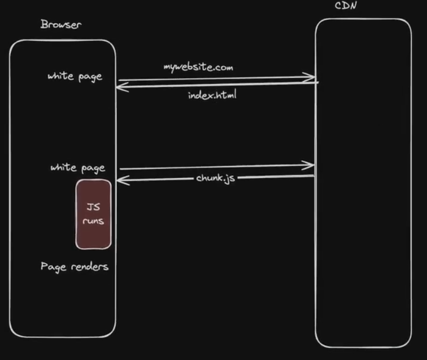
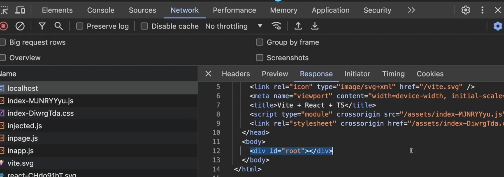
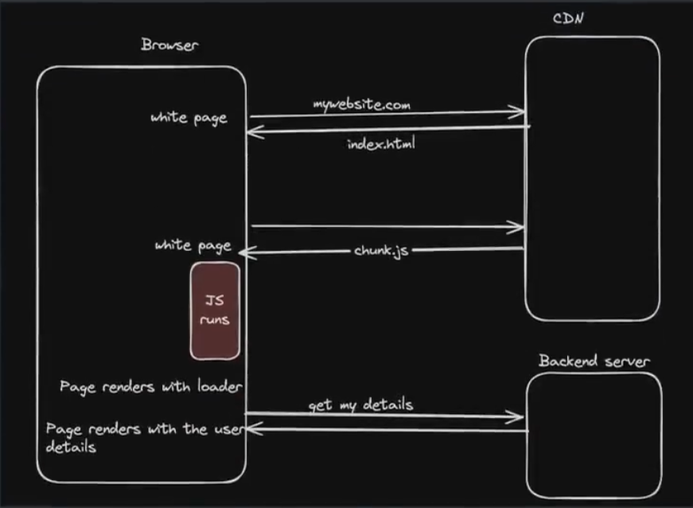
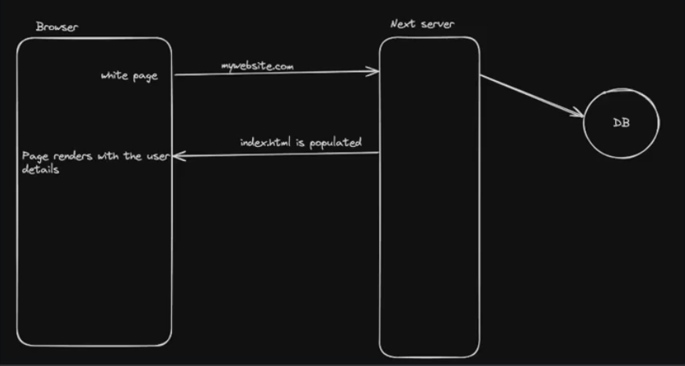
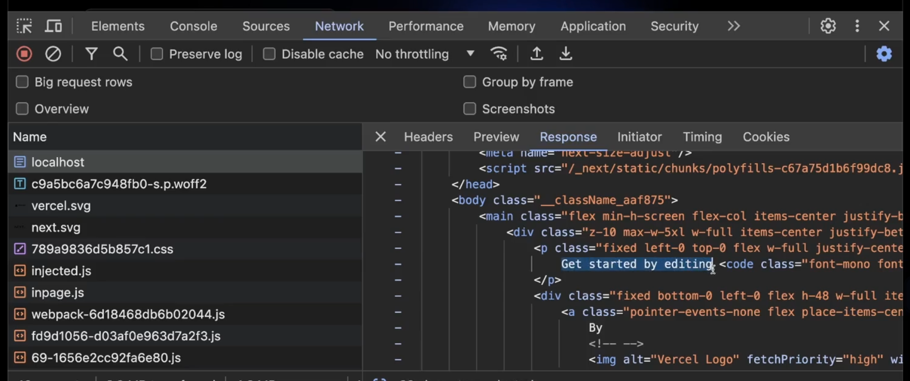
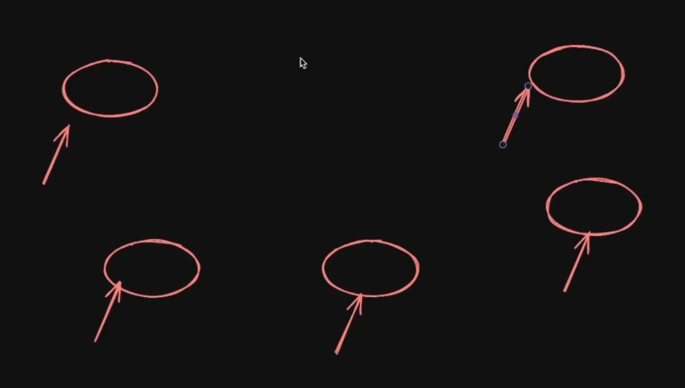
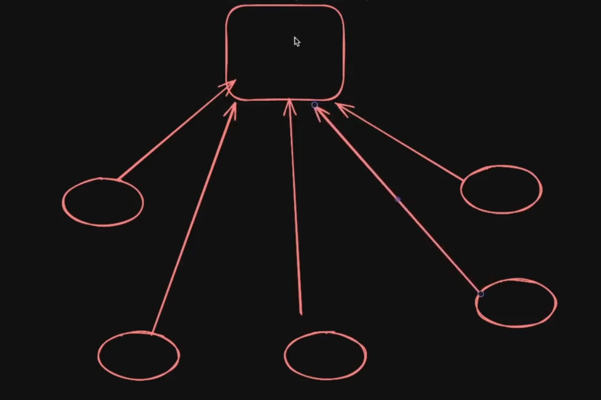
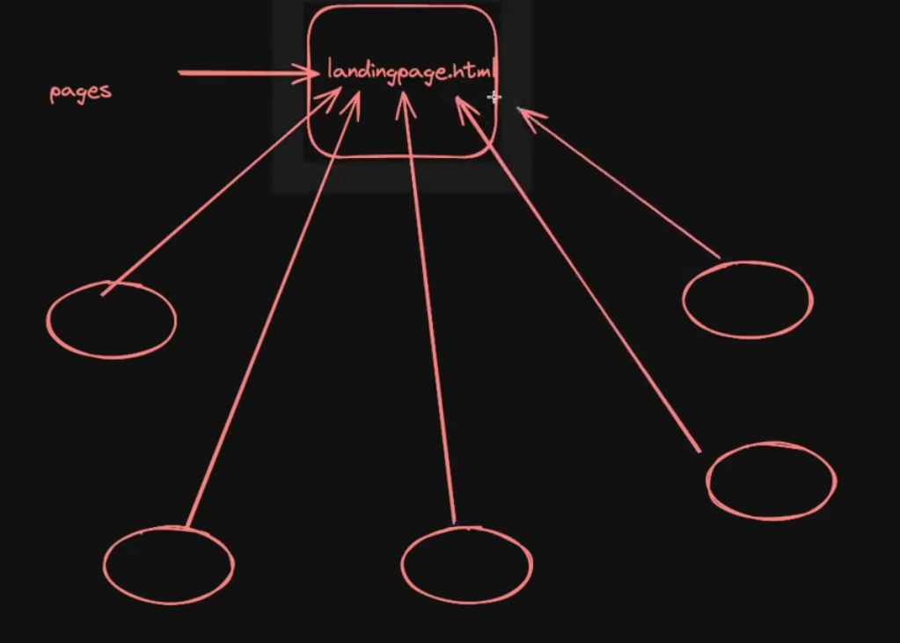

# **Important Topics to understand in `Next.js`**


## **Client side rendering (CSR)**
----------
Client-side rendering (CSR) is a modern technique used in web development where the __rendering of a webpage is performed in the browser__ using `JavaScript`. Instead of the server sending a fully rendered `HTML` page to the client

Good Example of CSR - `React` :-



### **Code flow for client side rendering**
----------
**Step 1 ->** You send a `request` to the website you want to visit

**Step 2 ->** in `response`, you get an **EMTPY `HTML` page**[which has just `<script></script>` tag(consisting of the `JS` code file) and a `CSS` link tag generally]

**Step 3 ->** Now you give another `request` to get the `JS` related code and now this `JS` code has its own `react` codebase and your own logic that you have written and this is what **runs on the page**

**Step 4 ->** when the logic runs is **finally the page renders** which simply means that there is a slight time interval of **EMPTY page and after the `js` file runs then only you are able to see the contents of the website**

and hence this is why they are called as **Client side rendering** as <span style="color:orange">**The `HTML` being injected into the DOM on the client**</span>[Initially you were getting empty `HTML` and then you are filling it with the `JS` logic being run at later point of time]

Lets see a `react` project in action 

+ **Initialise a `react` project**

```javascript
npm create vite@latest 
```

+ **Add dependencies**

```javascript
npm i 
```

+ **Start the project**

```javascript
npm run build
```

+ **Server the project**

```javascript
cd dist/
server
```

Open the network tab and notice how the initial `HTML` file didnt have any content(highlighted one) [you can also see the `script` tag and `css` `link` tag]



Evnetually the `js` file which you see just below the `localhost` will come and hence populate the frontend (i.e. -> **Load the frontend**)<span style="color:orange">**`JS` has the responsiblity of rendering the things on the frontend**</span>

__`React` (or CSR) makes your life as a developer easy. You write components, `JS` renders them to the DOM.__

### **Downsides**
----------

1. **Not SEO optimised**(google or any search engine __web crawlers__ dont understand what your website does(as they only see at `HTMl` file content) and hence your website does not able to display in the first search while searching for them in the search engine)
2. **User sees a `flash` before the page reloads**
3. **Waterfalling problem**



The above is the pic of Waterfalling problem

## **Server side rendering (SSR)**
----------

When the `rendering` process (converting `JS` components to `HTML`) happens on the server, its called SSR.



### **Code flow for server side rendering**
----------
**Step 1 ->** In a `Next.js` application, you send the `request` to the backend(`Next.js` server).

**Step 2 ->** Now `Next.js` server computes and then 

**Step 3 ->** **gets all the data from the database(if required)** 

**Step 4 ->** after getting all the data, **Server side renders all the things or basically page** and this **Readymade page is finally**

**Step 5 ->** sent to the **frontend and hence you see the website content**

<span style="color:orange">**So in the first `request` you were able to get most of the content of the website as `response`**</span>

**The very first `index.html` file you get as `response` will have rendering done because of the server side rendering**

<span style="color:orange">**Basically you get a PRE-RENDERED page**</span>

Lets see `Next.js` project in action 

+ **Create `Next` app**

```javascript
npx create-next-app
```

+ **Build the project**

```javascript
npm run build 
```

+ **Start the `NEXT` server**

```javascript
npm run start
```

+ **Opening the Developer's tool**



Notice how you have recieved **in the FIRST `request` only** the `HTML` page with all the things **being rendered(it is now NO MORE EMPTY FILE)** and hence this was **only possible due to SERVER-SIDE RENDERING**

<span style="color:orange">**The backend itself populated the page, rendering happened over here and finally sent to the frontend**</span>

### **Why SSR ??**

1. __SEO Optimisations__
2. __Gets rid of the waterfalling problem__(single `request` going on to get the desired output)
3. __No white flash before you see content__

### **Downsides of SSR**

1. __Expensive__ since every request needs to render on the server
2. __Harder to scale, you can't cache to CDNs__

**Explanation of above written 1st point**

When you were using `react.js`, then in all the machines, **rendering logic was running independently something like the below :-**



Circle reprents the machine 

But when using `Next.js`, then all the machines got **dependent on the `Next.js` server for rendering**



and the `Next.js` server is **doing the heavy operations or rendering FOR ALL THE MACHINES**

and <span style="color:orange">**Rendering is an expensive operation(figuring out what to put on the DOM etc..) and hence COMPUTE INTENSIVE as well as EXPENSIVE**</span>

**You can make it LESS EXPENSIVE by using the Static site generation (SSG)**

## **Static site generation (SSG)**
----------

**Refernce to this topic ->** [SSG in Next.js](https://nextjs.org/docs/app/building-your-application/data-fetching/fetching-caching-and-revalidating)

If a page uses __Static Generation__, the page HTML is generated at __build time.__ That means in production, the page HTML is generated when you run `next build`. This `HTML` will then be reused on each request. It can be cached by a CDN.

**Explantion of the above para**

You have your very expensive page(lets say your landing page) and right now you are using `Next.js`, as **many people ask you for the landing page the rendering happens on all of these pages and on the server you are able to do some of them** BUT What if i create a **landing page on the server and now anytime if someone asks for landing page i dont render them again i dont return them `HTMl` again i just return them this premade landing page which is made on the server**

The above is what **making of static page means**

as the name suggest, **Dynamic page means every user is sending the `request` and corresponding to it, Server is generating or rendering the page for each `request` WHEREAS Static page means you create it once and every one is just going to fetch the same page**

Picture of Static site generation 



<span style="color:orange">**If you know a certain page is going to be the same for everyone, it will look exact same for every one **</span>


