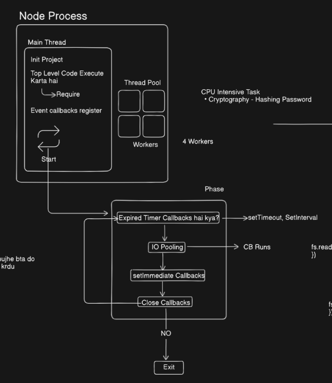
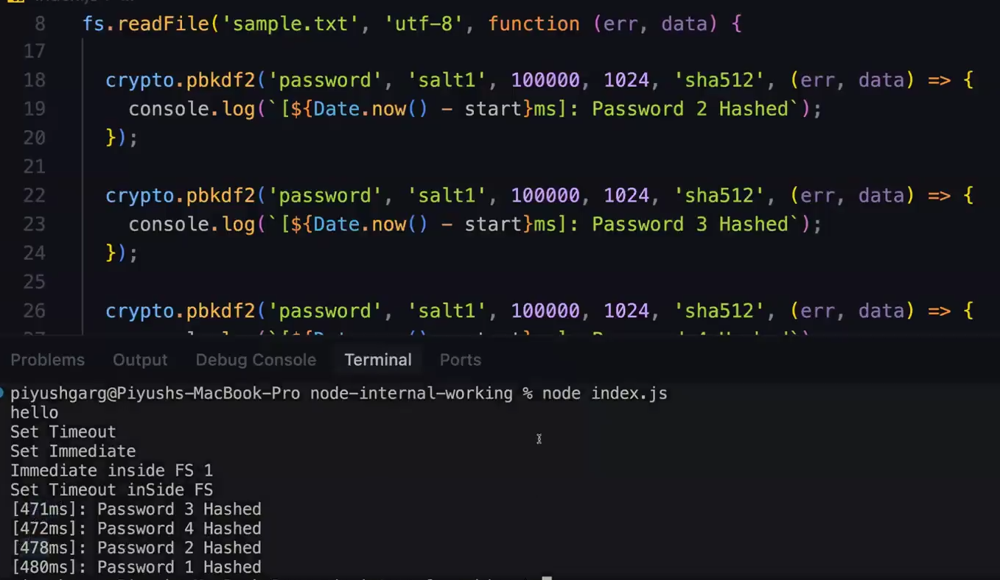
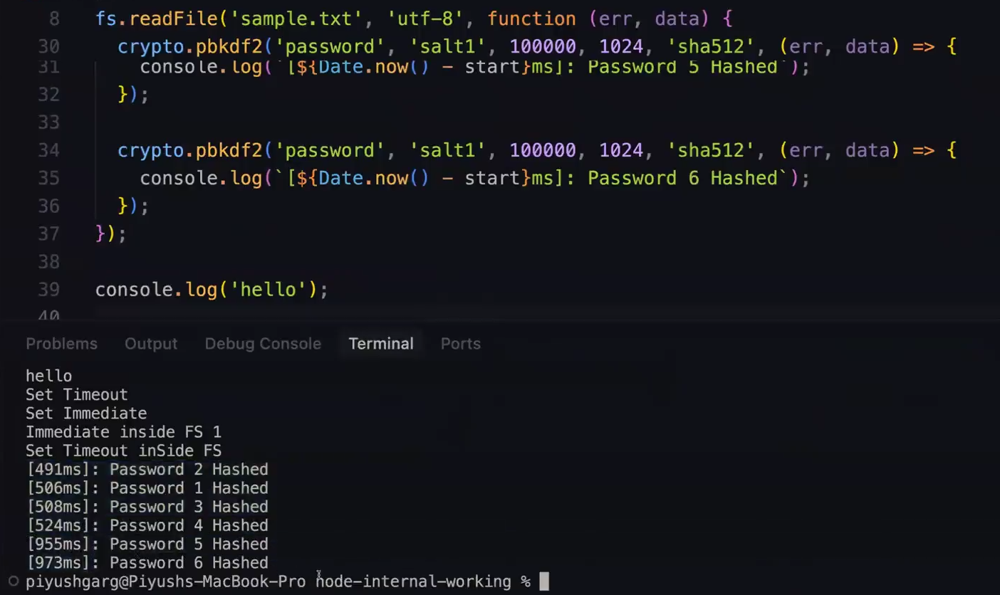
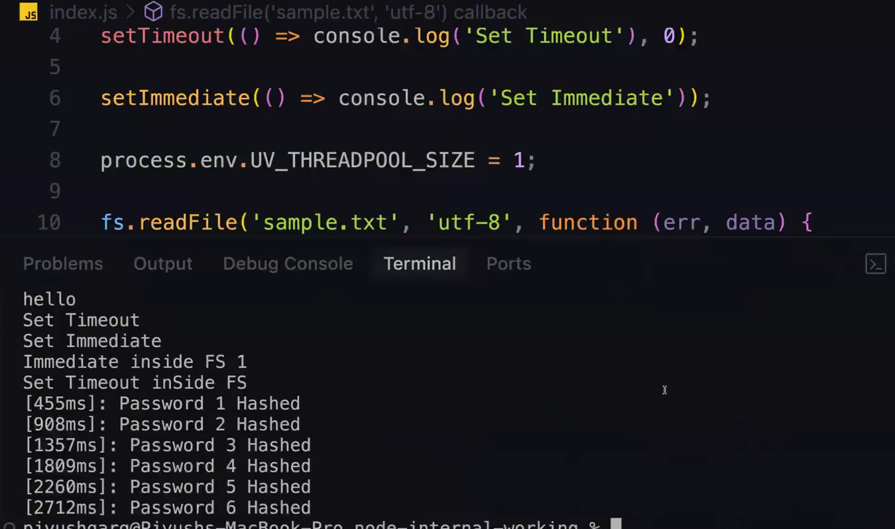

# __Node Internals__

- [__Node Internals__](#node-internals)
  - [__Inside `Node.js` Architecture (how `node.js` works)__](#inside-nodejs-architecture-how-nodejs-works)
    - [**What happens when you run `node index.js`**](#what-happens-when-you-run-node-indexjs)
    - [__About Thread Pool__](#about-thread-pool)


Before proceeding further first guess the output of the below written two code 

```javascript
const fs = require('fs'); // 1

setTimeout(() => {
    console.log("SetTimout done")
}, 0); // 2
setImmediate(() => {
    console.log("SetImmediate done")
}); // 3

console.log("Main work done"); // 4


// output ->
Main work done
SetTimout done
SetImmediate done
```

But if i see the below code output

```javascript
const fs = require('fs');

setTimeout(() => {
    console.log("SetTimout done")
}, 0);
setImmediate(() => {
    console.log("SetImmediate done")
});


// output ->
SetImmediate done
SetTimout done
```

can you see the difference just by using `console` the way code is running gets changed

**Lets understand how this is working ??**

Internally `node.js` **to get async input or output (I/O) it uses `LIBUV`**

read about `libUV` -> [libUV](https://search.brave.com/search?q=libuv&source=desktop) and one more thing which `libUV` provides is **Thread Pool** 

## __Inside `Node.js` Architecture (how `node.js` works)__
----------


> :pushpin: `node.js` is a **single-threaded langauge**

now that does not means ki ye efficient nhi h understand by this example

say you have a restraunt and you have some situation like this
- **Case 1 ->** you have 5 waiters who can take orders but there is a twist while taking the order they cannot do anything else once they will complete their order then only they will give it to chef
- **Case 2 ->** In this you have only 1 waiter but he has the flexiblity to take order and do some other task while taking it like giving it to chef

:bulb: What do you think which is more good ??

**Ans ->** depends on the situation (if the cpu intensive task is going on then definitely **case 1** is good but when it comes to Rest APIs aur web APIs then **case 2** is good(`Node.js` belongs to this category) )

<mark>**.Bottleneck.**</mark> -> a term widely used in software engineering referring to **Congestion** or simply saying **lot of traffic is being handled slowly** Term got its name from architecture of bottle (neeche se bda hota h but upar jake chota ho jata h to control the flow of liquid)

Ex -> `node.js` can act as **Bottlneck** for CPU intensive task.

### **What happens when you run `node index.js`**
----------




> :pushpin: <mark>**.The only diagram you need to understand about the node.js architecture.**</mark>


**Thread Pool ->** these are some of the waiters which are not doing anything

**Main Thread ->** This the main waiter that does most of the thing

**Steps ->**

__1.__  **Init Project** -> Initialise the project (means now the project is ready to run)

__2.__  **Top Level code Execute** -> Top level code wo code hota h jo **Global scope** me pda h kisi ka callback nhi h, module ke andar nhi h (main file ke andar global pe pda h)
    + Once **Top level code chlta h** tb sbse phle **Require** statement chlta h(take it as subpart of Top level code execute) as we have to use **Topological sort(agar 'b' is dependent on 'a' to 'a' phle run krenge na) jitni v aur modules h wo chlenge**

__3.__ **Event callbacks register** -> jitne v events h unke andar pde **callbacks** register hote h taki jb ye events ho to ye callback chal jae

__4.__ **Event Loop** -> what is event loop its something like while true loop only
```javascript
while(true){ // yahan se aapka code execution start hoga

pehle mai ye krunga 
then ye krunga

}
```
Inside Event loop (**Phases of Event Loop**)

__1.__ **Expired timer callbacks** -> inside Event loop it first searches for **Expired timer callbacks** also known as **Task Queue** (koi aise callbacks h jo khatam ho gye h(means unka time khatam ho gya h) but their callback stll watiting to be executed) agar h then these are `run` first
    - for **Expired timer callbacks** there are __only__ two types of it  
        + __setTimeout()__
        + __setInterval()__

__2.__ **I / O Pooling** -> agar aapka code koi v **Input Output resource of mechanism** pe depend krta h to uske callback ko chlaya jata h (**"Fs" module**) now multiple Input output file operation are going on you know the syntax of `fs.readFile()` it takes a `callback function` when it reaches I / O polling it asks **"Kisi ka file wala circus complete ho gya ho to bta do"** jiska v ho jata h uska **callback** ko run kr do

__3.__ **setImmediate** -> after this jitne v `setImmediate()` h unke callback ko run krega (if exists in the code)

__4.__ **Close Callbacks** -> at last it run the **close callback** (means server ke run hone ke baad tm kuch krna chahte ho. Ex -> res.send type thing)

__5.__ Finally it sees whether something is left if **yes** then chlo vapis upar if **No** to break kr jao (**EXIT**)
    - jb v `app.listen()` krte ho you will see terminal kbhi v band nhi hoga as the pending callbacks are still there (jitne v `Get`, `Post` register kiye h unke liye wait to krna pdega na **event Loop rok ke rkhta h**)

Now Talking about  **Thread Pool**

all the above process were done on **main Thread** only then what is the use of **Thread Pool ??** -> helps to cater **CPU Internsive Task** (Ex -> cryptography (hashing, encoding, generating the password)) as these task if done in **Event Loop** will take time because of which there is a delay in the response so to handle these things,<span style="color:orange">**Automatically**</span> the main thread assign these task to available **Thread** from **Thread pool** if not available then **waits for it**

```javascript
const fs = require('fs'); // 1

setTimeout(() => {
    console.log("SetTimout done")
}, 0); // 2
setImmediate(() => {
    console.log("SetImmediate done")
}); // 3

console.log("Main work done"); // 4


// output ->
Main work done
SetTimout done
SetImmediate done
```


Now decoding the sequence of code execution written at the starting 

**Step 1 ->** sbse phle `require` chlega (`// 1`) as that is the top level (more priority code)

**Step 2 ->** then `// 4` chlega as that is the top level code now after this there are no more top level code in the file so 

> as there are no callback so skip the Events callback register step

**Step 3 ->** start **Event Loop** now first thing it searches for **koi v expired callback h or simply saying koi v type of expired timer callback h??** for us we have as `setTimeout()` to wo isko run krega

**Step 4 ->** at last if `setImmediate()` exists in code then uske `callback` ko run kr diya jayega


:bulb: **Based on the above concepts give the output to the below code ??**

```javascript
cosnt fs = require('fs'); // step 1

setTimeout(() => console.log('setTimeout chla', 0)); // Step 4 -> as no more top level code left so Event loop me chla gya ab aur sbse phle event callback register hoke chla

setImmediate(() => console.log('setImmediate chla', 0)); // Step 6 -> IO Polling ka pas response tha nhi to ye jo uska next step h(wo run kr gya) now after this the next step is close callback but still IO Polling ka kaam bacha h to EXIT nhi kr skte to wait for this (vapis upar se shuru kro phases of Event Loop)

// Step 2 -> 'fs' apna kaam krna start kr diya hoga
fs.readFile('sample.txt', 'utf-8', function(err, data){  // Step 5 -> Event callback ke baad IO polling hona chahiye tha in our case 'fs' ne av tk complete nhi kiya tha file read krna iske liye iska callback nhi chla jiska fayda iska next step setImmediate callback utha liya aur wo chal gya ( Remember this is purely subjective maybe kisi aur me chal gya ho av tk )
    setTimeout(() => console.log('file wala setTimeout chla'), 0);
    setImmediate(() => console.log('file wala setImmediate chla')); // Step 7 ->dono setTimeout and setImmediate chlenge immediately but as you are standing on IO Polling ans iske baad setImmediate callback next step / phase h to setImmediate phle run hua then jb wapas se start of phase of Event Loop pe gya to setTimeout chla
})

console.log('hello'); // Step 3 -> as top level code to chlega he sbse phle

// Output

hello
setTimeout chla
setImmediate chla
file wala setImmediate chla
file wala setTimeout chla

```
> :warning: **Remember the above thing is <mark>.Very Very Important.</mark>**

### __About Thread Pool__ 
----------

> :pushpin: <mark>**.Remember by default there are 4 threads in thread pool and they run parallely(takes almost same time to complete any task).**</mark> But you can change it according to your needs by using <mark>**.process.env.UV_THREADPOOL_SIZE = your_desired_no.**</mark>(this functionality is by libUV)

see below to get better picture

 

in left part of image as by default 4 threads are there so they run parallely and hence they are taking almost same time but in right part of image as we have added two more task so once all 4 completed their task (as they are running parallely) the two wait and then after they(4) got completed the 2 gets runned in parallel.(so they have similar time)

Now after writing `process.env.UV_THREADPOOL_SIZE = 1` see the result one is waiting to get completed as it is the only one to do this task



> :pushpin: **The use of Thread Pool in node.js made it a very powerful run time environment**


