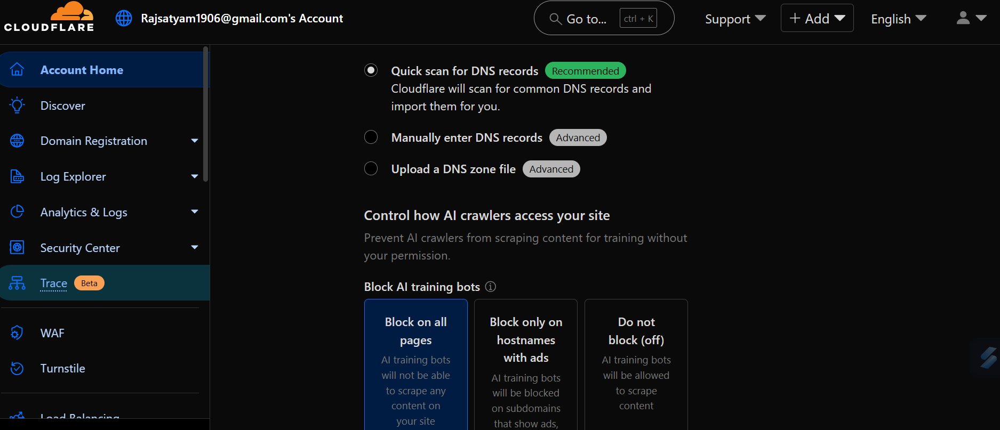
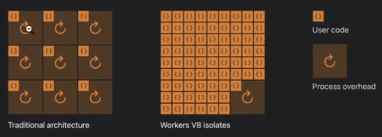
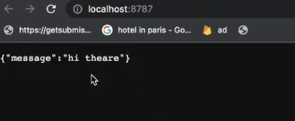
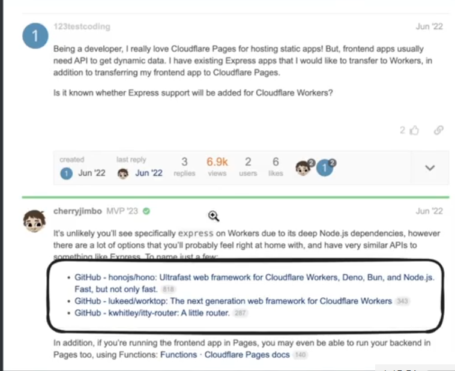
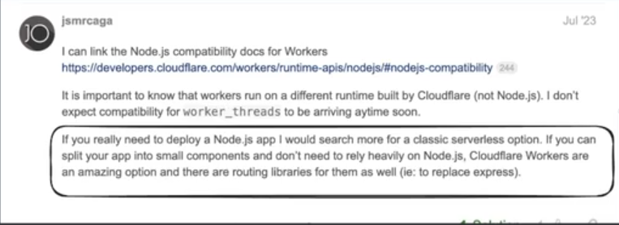
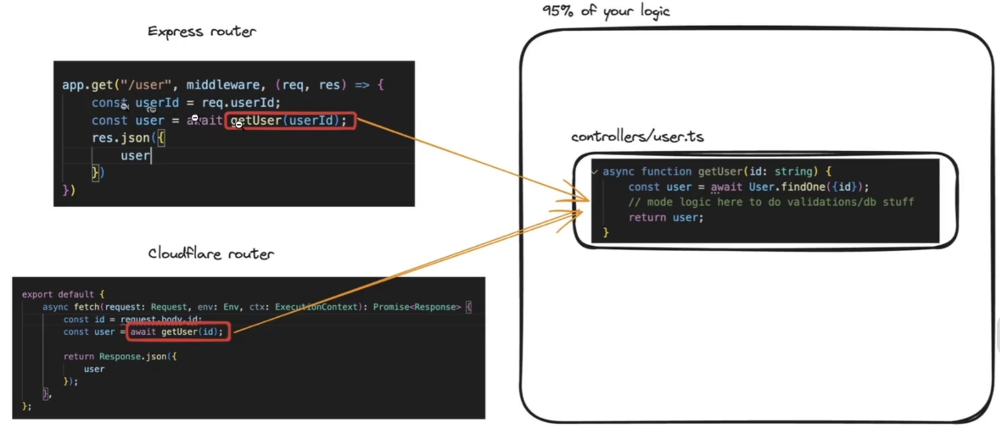
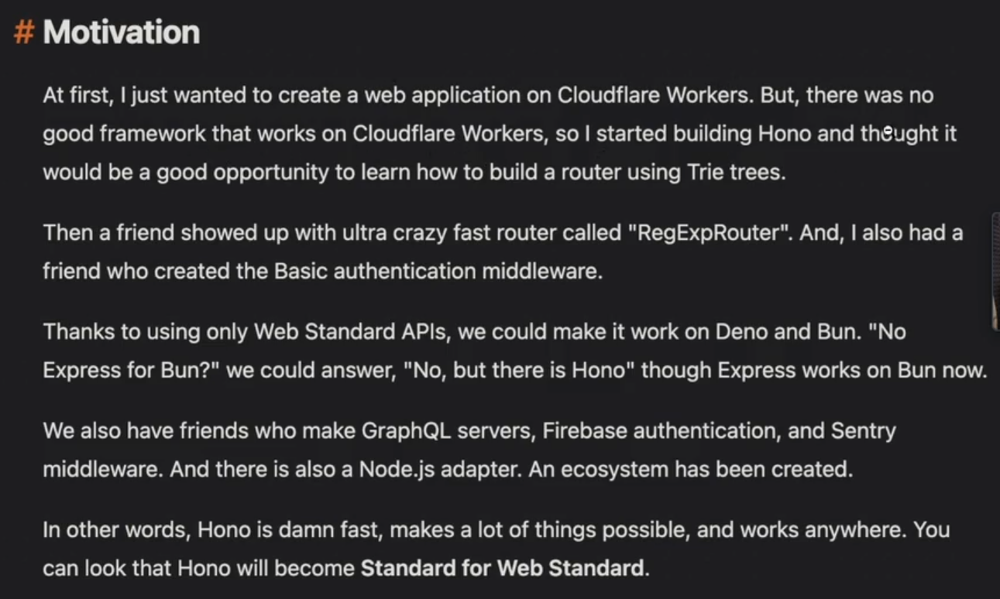
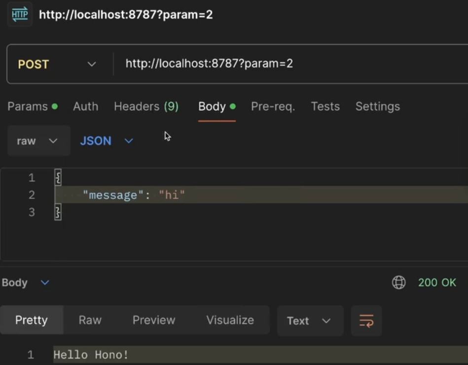
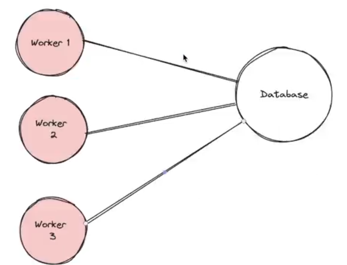

# **Serverless Backends / Architecture**

This whole section basically deals with deployment of your project on the serverless backend.

## **Backend servers**

When we were discussing the `Express.js`, we were seeing the below pic 


and have learnt that the above is the arhitecture which is generally followed when you are hitting the backend. as we have till now not deployed our app (i.e. till now we have run it locally) so thats why you have not come up with the above architecture.

But eventually, you will host your application to a particular servers and this is **where CLOUD PROVIDERs come into the picture**

Big giants came to know that it is very hard to buy these servers and hence came up with the solution that they will **rent these servers and instead of course will charge you some money to run and maintain these servers**

Example include -> **AWS (Amazon Web Services) or Azure or GCP (Google cloud platform), they are what called as CLOUD PROVIDERs**

:bulb:**What is cloud ??**

-> Its basically a term used to describe the condition that, you **dont have a PHYSICAL server over somewhere, you can host them on the cloud (i.e. -> Amazon has a very big DATA CENTER in some places and in these you can RENT a very SMALL SERVER here and this is where you will deploy your backend)**

:large_blue_diamond:`AWS` was the first to discover this problem and came up with this solution 

You might've used `express` to create a Backend server.

The way to run it usually is node index. js which starts a process on a certain port (`3000` for example)

When you have to deploy it on the intemet, there are a few ways -

1. Go to __aws, GCP, Aure, Cloudflare__
   1. Rent a VM (Virtual Machine) and deploy your app
   2. Put it in an Auto scaling group
   3. Deploy it in a Kubernetes cluster


__There are a few downsides to doing this -__
1. Taking __care of how / when to scale ??__
2. __Base cost is to be paid even if no one is visiting your website__
3. __Monitoring__ various servers to make sure __no server is down__[although this can be taken care of using various things such as prometheus, kubernetes etc..]

**What if, you could just write the code and someone else could take care of all of these problems / downsides?**

or simply saying what if i can be charged for the **Number of request which comes to my website instead of renting a server that is always running and also charging me hefty. also what if a huge request comes to my app, someone else autoscale it and make multiple servers to fulfill the request**

The above problem is solved by **SERVERLESS BACKENDs**

## **Serverless Backends**
----------
`"Serverless"` is a __backend deployment__ in which the __cloud provider dynamically manages the allocation and provisioning of servers.__

> :pushpin: __The term "serverless" doesn't mean there are NO SERVERS involved.__
>
> >__Instead, it means that developers and operators DO NOT HAVE TO WORRY ABOUT THE SERVERs.(it will be maintained by the cloud providers)__

**EASIER DEFINITION**
----------
What if you could just write your `express routes` and run a command. The app would automatically
1. Deploy
2. Autoscale
3. Charge you on a `per request basis` (rather than you paying for VMs)

### **Problems with this approach**
----------


1. **More expensive at scale**
2. **Cold start problem**

#### **Cold start problem**

Since `aws` is charging you on the **pre request basis (means if 0 request then you will not be charged)**. Now as they are not charging you, so **they are also not running server for your application backend as it is compute intensive and you have not paid also** so Now if suddenly someone comes to your application, `aws` have to **start a server really fast (basically they try to start a small CONTATINER so that they can handle this request) if no one has been visiting the website for very long time**

The above problem is known as **COLD START problem (the name is self explanatory -> start hone me time lgta h if boht din tk website kisi ne nhi visit kiya h to), only in the FIRST REQUEST this occurs as after that server is continuously running till a particular time (when no request is coming to the website)**

There are ways to solve the above problem though ->

1. **Keep pinging your application** after some seconds so that server does not gets cool down (i.e. running always)
2. **Warm pool Implementation** -> means **minimum one server(you can set it also) will always be running or (up always) and after this, it can AUTOSCALE depends on the number of request which comes to application**

## **Famous Serverless providers**
----------
There are many famous serverless providers :-

+ **AWS Lambda**

Link to their page -> [AWS Lambda](https://aws.amazon.com/pm/lambda/?trk=5cc83e4b-8a6e-4976-92ff-7a6198f2fe76&sc_channel=ps&ef_id=CjwKCAiAt5euBhB9EiwAdkXWO-i-th4J3onX9ji-tPt_JmsBAQJLWYN4hzTF0Zxb084EKUBxSCK5vhoC-1wQAvD_BwE:G:s&s_kwcid=AL!4422!3!651612776783!e!!g!!awslambda!19828229697!143940519541)

+ **Google cloud functions**

Link to their page -> [Google cloud functions](https://firebase.google.com/docs/functions)

+ **Cloudflare workers**
  
Link to their page -> [Cloudflare workers](https://workers.cloudflare.com/)

We will be using **Cloudflare workers in this module**[<span style="color:orange">**without using you credit card, you can deploy some of  your backend to the internet**</span>]

### **When should you use serverless architecture ?**

1. When you have to __get off the ground fast__ and __don't want to worry about deployments__
2. When you __can't anticipate the traffic and don't want to worry about autoscaling__
3. If you have __very low traffic__ and want to __optimise for costs__

simply saying <span style="color:orange">**Project kaise maintain hoga you dont even want to care about it**</span>

## **Cloudflare workers**
----------

### **Setting up Cloudflare workers**
----------
Link to sign up -> [Sign up Cloudflare](https://cloudflare.com) 

Just go to the website and do sign up (its as simple as that)

**Biggest advantage of using cloudflare is that they have DDoS(Distributed Denial of Service) attack prevention so whenever your website face DDoS attack, you can come to cloudflare and the team can solve it as fast as they can**

After signining up, you will see page like this ->



What we are interested is, the option present in the left navigation bar is under the `Compute(workers)` section named as `Workers & Pages`

**`Workers` are the serverless offerings of the cloudflare. They lets you deploy or serve some backend and even frontend code SERVERLESSLY.(means these are behind where it should be deployed, what countries it is deployed and so on..)**

To start with **lets try to create a worker**. coming inside the `Compute(workers) > Workers & Pages` and then selecting `Start with Hello World` by clicking on the `Get Started` button

### **How cloudflare workers work ??**
----------

Detailed blog post - [Cloudflare workers working](https://developers.cloudflare.com/workers/reference/how-workers-works/)

But the main part of it has been discussed below 

> :pushpin:<span style="color:orange">**Important point to note here ->**</span> __Cloudflare workers DONT use the Node.js runtime. They have created their own runtime. There are a lot of things that Node.js has__

Whenever you are writing the code in `JS`, you will be running that in `Node.js` runtime or **BUN.js**

Now we have already learnt that how **Node.js** came into existence which was already `V8 Engine` was present on the **Chrome or precisely saying browser** and then it was pulled out which eventually lead to the development of `Node.js`

Now coming to How the cloudflare work or how this is able to run your code, there are two possiblities only to this ->

**1. Either they are using the `Node.js` runtime** means that everytime to run the code cloudflare workers has to run the command -> `node index.js` 

Now the above way is not optimal due to :-

1. **You are every time starting a new `Node` process**
2. **Node modules is a big library when it comes to running it on the server**
3. **Latency increases**

due to the above reasons, cloudflare came up with 2nd approach ->

**2. Take out the `V8` Engine** and then **enhance the previous architecture**. <span style="color:orange">**Basically they start a single `Node.js` process inside which they run Small group workers which will handle multiple `node index.js` command of different projects assigned to the number of workers**</span>

Something like the below pic ->


### **Working of Workers**
----------

Though Cloudflare Workers behave similarly to `JavaScript` in the browser or in `Node.js`,(**The code which you will use to run your code on the cloudflare the same code can be used to run it in your local browser**) there are a few differences in how you have to think about your code. Under the hood, the Workers runtime uses the V8 engine — the same engine used by Chromium and `Node.js`. The Workers runtime also implements many of the standard `APIs` available in most modern browsers.

The __differences between `JavaScript` written for the browser or `Node.js` happen at runtime.__ Rather than running on an individual's machine (for example, a browser application or on a centralized server), Workers functions run on `Cloudflare's Edge Network` - __a growing global network of thousands of machines distributed across hundreds of locations.__


Basically they have **Bunch of server running on many parts of the world as shown above and whenever you start your project, it runs on one of these servers depending on the place from where the `request` has came from**

__Each of these machines hosts an instance of the Workers runtime, and each of those runtimes is capable of running thousands of user-defined applications. This guide will review some of those difference.__

### **Isolates V/S containers**(if not understand, then also good)
----------

Basically this was the **approach they took to be the fastest or in short faster than `aws` (they claim at least).**

`V8` uses something called as `isolates` which is lightweight contexts that provide your code with variables it can access and a safe environrnent to be executed within. You could even consider an `isolate` __a sandbox for your function to run in.__



The refersh type symbol is the `node index.js` command and the `{}` (__curly braces__),  in the left pic, you can clearly see that for every `codebase`, you have to __start a new `node` process by running the command `node index.js`__ whereas when it comes to the second pic you are just running one **single `node index.js` process and all of the `codebase` are running using that and even ISOLATING from each other** 

This is why it is called `Isolate` as although all project are running with the help of **single node process** still they are **ISOLATED from each other, which is the functionality provided by the `isolate` present inside the `V8`**

### **Intializing a worker**

----------

To create and deploy your application, you can take the following steps inside the `Terminal` ->

**Step 1 ->** Initialize a worker 

```javascript
npm create cloudflare -- my-app 
```
+ select `No` if asked for if you want to deploy your application
+ `my-app` is the name of folder you have given to your project(you can give anything)

**Step 2 ->** Explore `package.json` dependencies

```javascript
"wrangler" : "^3.0.0"
```
**Notice `express` is not present here** as we have not written any `app.get` type of thing inside our codebase. (see the code below for reference)

:bulb:**What is Wrangler ??**

-> In simple words, `Wrangler` is the **CLI (command line interface) of the cloudflare cloud provider means it is what lets you deploy your application to cloudflare, runs your code locally**

**Step 3 ->** go inside the `index.ts` file and try to exolore the code written inside it which looks something like this ->

```javascript
export interface Env {

}

export default {
  async fetch(request: Request, env: Env, ctx: ExecutionContext): Promise<Response> {
      return new Response('Hello World!');
   },
};
```

:bulb:**What is the role of the `Promise<Response>` part and explain it ??**

-> This is basically the **Data type which the function `fetch` is returning** Now you may ask that as the function `fetch` is returning a `Response` object (see the codeline `return new Response`), so you should be writing `Response` in place of `Promise<Response>` and now the reason for this is 

as **function `fetch` is `async` so it will return `Promise` also**[Reason for making them `async` function is that eventually you will do some logic to hit the database which will take time and hence `async` & `await` will be used]

So combining the above two statement, you can say that the function `fetch` will return **`Promise` which is of type `Response` and hence the GENERICS has been used to interwine two thing and make a custom data types** combining both the above statement will give me `Promise<Response>`

**If you do not give this, then also the code will work fine as `Typescript` has the ability to INFER according to the data the function is returning**

**Step 4 ->** Run / Start your worker locally

```javascript
npm run dev
```

Now if you write `npm run dev` to run the code and will go to the given url, then you will see "Hello World!" on the screen.

if you slightly change the code something like this ->

```javascript
export interface Env {

}

// Below codeblock is also the answer  of How to return json ??
export default {
  async fetch(request: Request, env: Env, ctx: ExecutionContext): Promise<Response> {
      return Response.json({
         message : "hi there" 
      });
   },
};
```
you will see something like the below as output -> 



**It automatically RELOADS for you**

:bulb: __Where is the express code? HTTP Server?__

Cloudflare expects you to just write the logic to handle a request. __Creating an HTTP server on top is handled by cloudflare__

### **Routing in cloudflare**
----------

In express, routing is done as follows 

```javascript
import express from "express"
const app = express()

app.get("/route", (req, res) => {
   // handles a request to get route
})
```

Now although you have studied above that the normal `js` code also works and even the above code of using the `Express` will also works but you will soon come to knwo that **why you should not write in the above manner ??**

Doing the same in the cloudflare environment will look something like the below ->

```javascript
export interface Env {

}

export default {
  async fetch(request: Request, env: Env, ctx: ExecutionContext): Promise<Response> {
    console.log(request.body);
    console.log(request.headers);
    console.log(request.method);

    if (request.method === "GET") { // similar for other Request method 
      return Response.json({
        message: "you sent a get request"
      });
    } else {
      return Response.json({
        message: "you did not send a get request"
      });
    }
  },
};
```

**Basically you have access to all the things which you can do using `Express` (like getting the `body`, `query parameters`, `headers`, `method` etc..) inside the `request` object or more precisely `Request` object**

Now can you see **How difficult it will be for the developers to write like the above way, it will clearly be very hard to maintain and hence will be very long as for each Request method, you are trying to write the `if-else` condition**

So eventually we will be using a library to make the job easier for us. 

>:round_pushpin:**How to get query params** -> "https://community.cloudflare.com/t/parse-url-query-strings-with-cloudflare-workers/90286" [see it as it is important]

### **Deploying your codebase to the Internet through the cloudflare**
----------

**Step 1 ->** You have to first `login` to your cloudflare account and for this again `wrangler` will be used(as that is the main element to do all the task of cloudflare), inside the terminal, run the command :-

```javascript
npx wrangler login
```
running this will give you an url (OAuth) through which you can directly give the access to the cloudflare to do necessary actions to your project[**You have given authorisation to deploy your project using cloudflare**]

> :pushpin:running the command **`npx wrangler whoami` will give you all the information about your account, you can see them**

**Step 2 ->** Now that you have given access to your account, **to deploy your code to the internet just do**

```javascript
npm run deploy
```

Now the `wrangler` will have the responsiblity to **deploy your code as under the hood the above command is running `wrangler deploy` command whose work is to do the above task**

Soon, you will get a **url to your project / code which is hosted on the internet and that too for FREE! FREE! FREEEEE!**

> :pushpin:**The syntax looks very similar to that which you used to write the NATIVE http in `node.js`(i.e. without using any library like `Express.js`)**

Now if see the url it gave to where my code was deployed you will see that 

https://my-app.Rajsatyam1906.workers.dev

Notice the nomenclature of the above url :-

+ `my-app` -> the **Name of the project (so try to name it wisely (basically name this the same name which you have given to your website))**
+ `Rajsatyam1906` -> the cloudflare account unique id which was used to deploy the app

You can also later **change the name of the project by going to the `wrangler.toml` file made** and inside that you will see the `name` key whose value will be the current name of the project, just write here the new `name` as its values and then just do `npm run deploy` again to change the name of the project and deploy the project with **updated name** and THAT's IT.

Cloudflare __does not expect a routing library/http server out of the box.__ You can write a full application with just the constructs available above.

We will eventually see how you can use other HTTP frameworks (like express) in cloudflare workers.

### **Adding `Express` to it**
----------
:bulb:**Why cant we use Express ?? why does it (cloudflare) doesn't start off with a simple express boiler plate ??**

-> **Reason 1 -> Heavily relies on the `Node.js`**(and hence it is not compatible with cloudflare runtime)

see the documentation -> [Rely on Node.js](https://community.cloudflare.com/t/express-support-for-workers/390844)

**Crux of the above documentation is ->**



so the block which you see above are **some of the library which can be used to easify things**

you can also find them here -> [Library for cloudflare workers](https://github.com/honojs/hono)

### **Moving of `Express` dependent project to cloudflare project**

:bulb:**Lets say now i have made a project which heavily relies on `Express`, so how to move it to cloudflare wokers ??**

-> <span style="color:orange">**Create a generic `handler` that you can forward requests to from either `express` or `hono` or `native cloudflare handler`**</span>

Basically, try to code in such a manner that it runs on all the above things (i.e. **GENERALISED WAY**)



A demo of writing the **generic way(PULL OUT AS MUCH AS YOU CAN INTO A FILE WHICH DOES NOT HEAVILY RELIES ON THE `Node.js` (things like -> database calls, etc..)) is given below** and the rest which cant be pulled out for them, **you have to write the seperate logic for both `express.js` and cloudflare [NO OTHER OPTION] but these part of code exists only `5%` rest `95%` of your code can be made GENERIC (as shown below)**



>:warning: <span style="color:orange">**Remember ->**</span>**You CANNOT USE WEBSOCKETs inside the cloudflare, IT IS ONLY MEANT FOR `http` server**

## **Introduction to Hono**

----------

As we have now seen that **`Express` does not work on cloudflare and hence to gain the capiblities of it, a library is used known as `hono` which makes our life even easier also**

:bulb:**What is Hono ??**

see the documentation -> [Hono.js](https://hono.dev/concepts/motivation)

Crux of the above documentation is **what leads to develop `hono.js`** and that is attached below 



:bulb:**What are the runtime which supports it ??**

-> This is quite a big library and supports almost all the possible runtime for known cloud providers. List includes ->

|           |            |                 |
|-----------|------------|-----------------|
| Cloudflare Workers | Cloudflare Pages | Deno         |
| Bun      | Fastly Compute | Vercel         |
| Netlify  | AWS Lambda | Lambda@Edge      |
| Supabase Functions  | Node.js | Others      |

>:pushpin:<span style="color:orange">**Remember ->**</span>**Cloudflare Pages is used to deploy the FRONTEND and Cloudflare Workers is used to deploy the BACKEND (This is the main differenc between the cloudflare pages and workers)**

### **Setting up Hono**
----------
**Step 1 ->** Initialize a new app with hono by running the command 

```javascript
npm create hono@latest my-app
```
`my-app` is the name of the project 

**Step 2 ->** Move to `my-app` and install the dependencies

```javascript
cd my-app 

npm install // OR  npm i 
```
**Step 3 ->** Writing the first code inside the `src > index.ts`

```javascript
import {Hono} from "hono"

const app = new Hono()

app.get('/', (c) => c.text("Hello cloudflare workers!"))

export default app 
```
**Notice to the level of similarity between the above code and that you used to write while using `Express.js`**, This is the advantage that this library gives

### **Returning `response` in Hono**
----------
> :pushpin: Just use **`.text` or `.json` to return something similar to how you used to return in `express`**

Example ->

```javascript
import {Hono} from "hono"

const app = new Hono()

app.get('/', (c) => {
   return c.json({  // .text example is already present in the above code 
      message : "Hi how are you"
   })
})

export default app 
```

Now what are the big things which `express` gives you -> `body`, `headers`, `query parameters`, `middlewares`, `connecting a database`

If you know how to do these things in `hono`, you are good to go for `99%` usecase. Lets discuss them one by one 

### **Getting input from user (`body`, `headers` and `query parameters`) in Hono**

To see how the above thing are achieved see the example ->

```javascript
import {Hono} from 'hono'

const app = new Hono()

app.get('/', async (c) => { // Reason for making this async is because in this if you are CONVERTING something to json, then you must have to "await" it and hence make the function "async" eventually[as you are using here conversion to json hence awaited it and made the function async], so dont get confused that although no database call is being used here then also why async, await
   const body = await c.req.json() // This is how you get the BODY
   console.log(body)
   console.log(c.req.header("Authorization")) // This is how you get the HEADERs value corresponding to the "Authorization" key 
   console.log(c.req.query("param")) // This is how you get the QUERY PARAMETERs

   return c.text('Hello Hono!')
})

export default app 
```
Seeing the output(backend request sent from `postman`) ->



More detail can be seen here -> [Getting started with hono](https://hono.dev/getting-started/cloudflare-workers)

**Deploying part is simple you know this already just use**

```javascript
npm run deploy
```
the same which you used to deploy your cloudflare project, as only library has been added not the command. 

### **Creating Middlewares in Hono**
----------

See the documentation -> [Middlewares in Hono](https://hono.dev/guides/middleware)

<span style="color:orange">**Again it is very -very similar to what we used to do inside the `Express.js`**</span>

#### **Creating a simple auth middleware**
----------

```javascript
import { Hono, Next } from 'hono'
import { Context } from 'hono/jsx'

const app = new Hono()

// This is very similar to How we used to declare Middlewares inside the Express.js
async function authMiddleware(c, next){
   if (c.req.header("Authorization")) {
    // Do Validation logic here 
    await next()
  } else {
    return c.text("You dont have acces");
  }
}

// And then to implement Middleware you can either use 
// 1ST WAY
app.use(authMiddleware) // This will be passed to all the routes present 

// OR
// You can manually pass this middleware to your specified route something which you used to do inside the Express.js (something used below)
// This is BETTER APPORACH as it does not implement it to all the routes 
// 2ND WAY
app.get('/', authMiddleware, async (c) => {
  const body = await c.req.parseBody()
  console.log(body);
  console.log(c.req.header("Authorization"));
  console.log(c.req.query("param"));

  return c.json({msg: "Hello"})
})

export default app
```

### **Connecting to DB in Hono**
----------

See the documentation -> [DB connection in Hono](https://www.prisma.io/docs/orm/prisma-client/deployment/edge/deploy-to-cloudflare-workers)

Serverless environments have one big problem when dealing with databases.

There can be many connections open to the DB since there can be multiple workers open in various regions.



**Connection pooling in prisma for serverless env**

See the documentation -> [Connection pooling in Prisma](https://www.prisma.io/docs/accelerate)

for cloudflare workers part -> [Connection pooling cloudflare](https:/www.prisma.io/docs/orm/prisma-client/deployment/edge/deploy-to-cloudflare-workers)

**Step 1 ->** Install Prisma in your project 

```javascript
npm install --save-dev prisma
```

**Step 2 ->** Init Prisma 

```javascript
npm prisma init
```
**Step 3 ->** Create a basic schema 

```javascript
generator client{
   provider = "prisma-client-js"
}

datasource db{
   provider = "postgresql"
   url = env("DATABASE_URL")
}

model User {
   id Int @id @default(autoincrement())
   name String 
   email String 
   password String
}
```

**Step 4 ->** Create Migrations 

```javascript
npx prisma migrate dev --name init
```

**Step 5 ->** Signup to Prisma accelerate 

```javascript
"https://console.prisma.io/login"
```
Enable Accelerate


Generate an API key 


