# **Recoil**

- [**Recoil**](#recoil)
  - [**Introducing Recoil**](#introducing-recoil)
  - [__Key concepts in recoil__](#key-concepts-in-recoil)
  - [**Recoil V/S Context API**](#recoil-vs-context-api)
    - [**Comparison between CONTEXT API code and RECOIL code**](#comparison-between-context-api-code-and-recoil-code)
  - [**Atom**](#atom)
    - [**Difference between `useRecoilValue`, `useSetRecoilState` and `useRecoilState` hooks with their USE**](#difference-between-userecoilvalue-usesetrecoilstate-and-userecoilstate-hooks-with-their-use)
  - [**`memo` api in `React`**](#memo-api-in-react)
    - [**using `memo`**](#using-memo)
  - [**Selector in Recoil**](#selector-in-recoil)
- [**Recoil deep dive (revision and some advance concepts by Assignment)**](#recoil-deep-dive-revision-and-some-advance-concepts-by-assignment)
    - [**Asynchronus data queries in `Recoil`**](#asynchronus-data-queries-in-recoil)
  - [**Advance Recoil**](#advance-recoil)
    - [**about `atomFamily`**](#about-atomfamily)
    - [**about `selectorFamily`**](#about-selectorfamily)
  - [**Making a Loader for websit**](#making-a-loader-for-websit)
    - [**about `useRecoilStateLoadable` hook in `recoil`**](#about-userecoilstateloadable-hook-in-recoil)
    - [**about `useRecoilValueLoadable` hook**](#about-userecoilvalueloadable-hook)
    - [**about `<Suspense></Suspense>` component API in `React`**](#about-suspensesuspense-component-api-in-react)


In this section, we are going to learn about the state management libraray known as `Recoil` there are many like this (like `Redux`, `mobX` etc.. ) even `useState` is also used for **state management**

:bulb: **Why you have to use an external library athough it will make your code slower to load `useState` will provide more faster output in many case ??**

-> **Reason ->** the purpose of using library in any of the langauge is to extend the functionality and features of the langauge so that our task becomes easier to operate

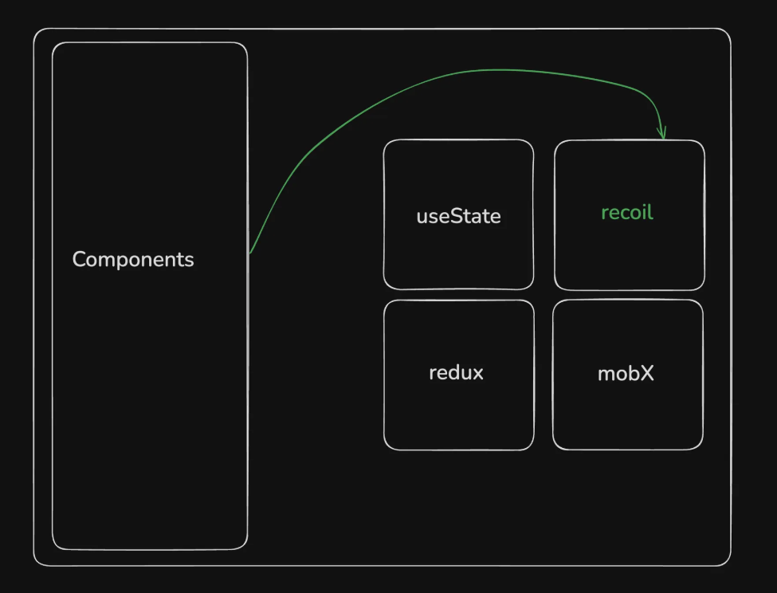

## **Introducing Recoil**

A __state management library__ for react that provides a way to __manage global state__
with fine-grained control. 

Recoil minimizes unnecessary renders by only re-rendering components that depend on changed atoms.

__The performance of a React app is measured by the number of re-renders.__ Each re-render is expensive and you should try to minimise it.

Here is the link to a very good video that will help you to understand the story behind the Recoil (How it works ??), and how it is different and better from other state management libraries like `Redux` ?

[Understading Recoil in depth](https://www.youtube.com/watch?v=_ISAA_Jt9kI)

see the problem with this -> take the example of **LinkedIN**

there is a **state variable `notificationCount`** although it is present in **Topbar of linkedin** still, as it **Global state**, it will **make re-render the whole linkedIn although only Topbar should re-render, and why even topbar, only notification count symbol should re-render**, this what the problem is, we should try to minimise the **re-render as much as possible** to enhance the performance of the React.

**Recoil lets you do that**

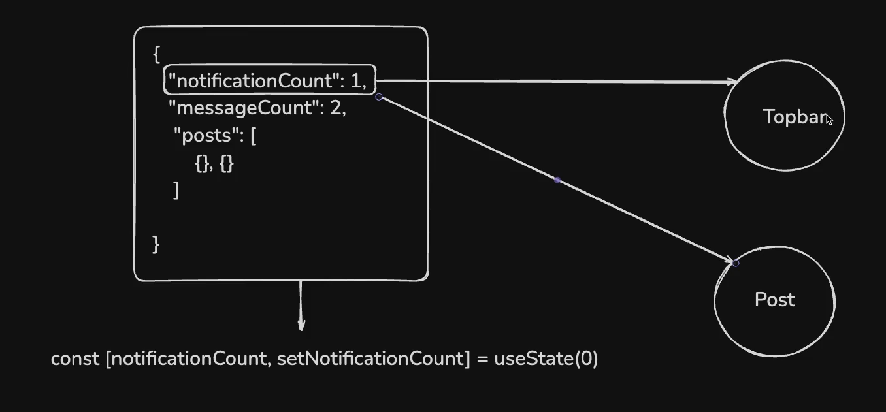

to use it first you have to add it as dependency as it is external library so do this

```console
npm install recoil
```


## __Key concepts in recoil__

- **Atoms:** Units of state that can be read from and written to from any component.
- **Selectors:** Functions that derive state from atoms or other selectors, allowing for computed state.

**If you learn the above two, then you dont even require to use `useState`, you can replace it with the above two things**

## **Recoil V/S Context API**

lets make a simple **counter** that has the functionality to **Increase or Decrease** and display the current value of the counter. we can solve it by taking the **1. normal `useState` varible and 2. using the context API**

<mark>**.ASSIGNMENT.**</mark> trying to solve using the `useState` 

```javascript
import React, {useState, useEffect, useRef} from 'react'

function App(){
    return (
        <div>
            <Counter/>
        </div>
    )
}
function Counter(){
    const [count, setCount] = useState(0)
    return(
        <>
            <CurrentCount count = {count} />
            <Increase setCount = {setCount}/>
            <Decrease setCount = {setCount}/>
        </>
    )
}
function CurrentCount({count}){
    return( 
        <>
            {count}
        </>
    )
}
function Increase({setCount}){
    function increaseHandler(){
        setCount((c) => c + 1);
    }
    return (
        <>
            <button onClick={increaseHandler}>Increase</button>
        </>
    )    
}
function Decrease({setCount}){
    function decreaseHandler(){
        setCount((c) => c - 1);
    }
    return (
        <>
            <button onClick={decreaseHandler}>Decrease</button>
        </>
    )   
}

export default App
```

Now the problem with the above code is that although **only `CurrentCount` is changing on the UI but still all these compnents are re-rendering -> `Increase`, `Decrease`, `Counter`** (as **state variable is defined in the `Counter` component so that's why wherever it is being used, that component is getting rendered**)

-> Hence the above code is **UNOPTIMAL**

you can see this -> 

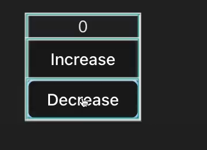

Notice the **Blue Box (which denotes re-render occured in which component)** is present in all three `CurrentCount`, `Increase` and `Decrease` as will as their parent `Counter`

The same thing will occur when you will use **Context API** but as it **solves atleast the problem of PROP DRILLING** so it is to some extent better than **CONTEXT API**

### **Comparison between CONTEXT API code and RECOIL code**

+ **Left Image ->** shows the `counter` function by **Context API**
+ **Right Image ->** shows the `counter` function by **Recoil**

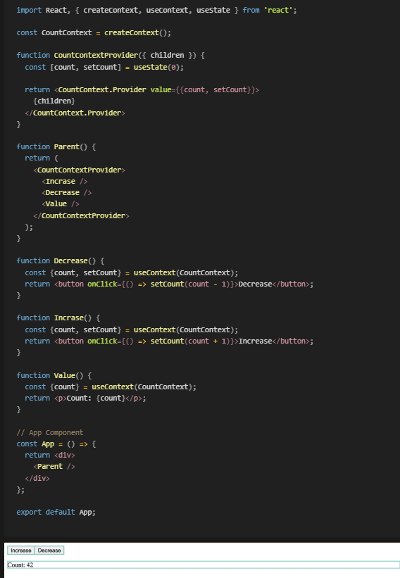 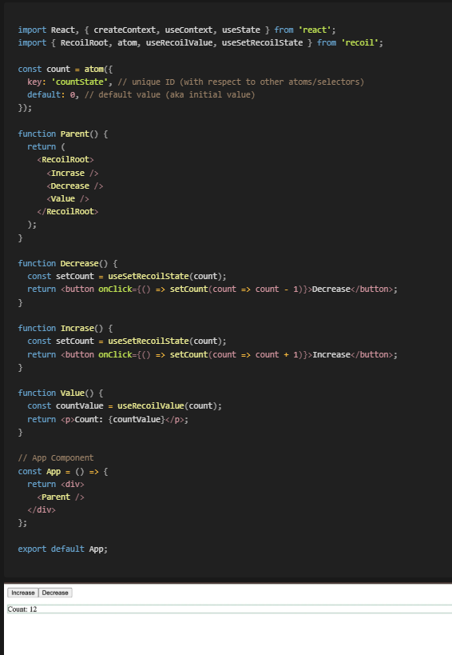

Notice the output of both the above code 

**In left pic ->** all the component is surrounded by the **blue box** which means `Increase`, `Decrease` and `Value` are **re-rendering although only `Value` is changing(change which is reflected on the UI), still all other two components are getting re-rendered**

BUT 

**In right pic ->** only the `Value` component has **Blue box** which means that only this is being re-rendered and rest all are not getting re-rendered which we actually need to improve the preformance of react 

## **Atom**

Atoms are units of state that can be read from and written to from any component.(**lets you read and write anything on the component**) __When an atom's state changes, all components that subscribe to that aton will re-render__ (sounds very similar to `useState`)

**So we are going to replace `useState` with `Atom`**

Now lets convert the <mark>**.ASSIGNMENT.**</mark> code written above to **recoil compatible code**

```javascript
import React, {useState, useEffect, useRef} from 'react'
import {RecoilRoot, atom} from 'recoil' // importing all the necessary thing to use while dealing with Recoil

function App(){
    return (
        <div>
            <RecoilRoot> // STEP 1 -> wrap your application into the <RecoilRoot> component 
                <Counter/>
            </RecoilRoot>
        </div>
    )
}
function Counter(){
    const [count, setCount] = useState(0) // Step 2 -> as we are no more going to use state variable so REPLACE them with 'atom'
    // Now Always define 'atom'variable outside all the component, If possible make a seperate file for defining the atom 
    return(
        <>
            <CurrentCount count = {count} />
            <Increase setCount = {setCount}/>
            <Decrease setCount = {setCount}/>
        </>
    )
}
function CurrentCount({count}){
    return( 
        <>
            {count}
        </>
    )
}
function Increase({setCount}){
    function increaseHandler(){
        setCount((c) => c + 1);
    }
    return (
        <>
            <button onClick={increaseHandler}>Increase</button>
        </>
    )    
}
function Decrease({setCount}){
    function decreaseHandler(){
        setCount((c) => c - 1);
    }
    return (
        <>
            <button onClick={decreaseHandler}>Decrease</button>
        </>
    )   
}

export default App
```

**Step 2 ->** making the `atom` variable outside the file (i.e. making a seperate file for it) named as but first do some thing before this to better organise your project

create a folder named as `Store` (usually all the state management things are **stored**), you can name anything and inside it making a seperate folder named as `atoms` and inside which make your first file for your first `atom` variable named as `counter.js`

now writing the code inside `counter.js`

```javascript
import {atom} from 'recoil'

export const counterAtom = atom({ // This is how you should decalre 'atom' variable 
    key : "counter",
    default : 0
})
```

> :warning: <span style="color:orange">**Remember ->**</span> while declaring an `atom` variable you should always give **UNIQUE `key` (as that will be used to identify)**
>
> > **If you will give duplicate `key`, then you will face RUNTIME ERROR**

Now compare this with how you used to declare the state variable


using state variable 
```javascript
const [count, setCount] = useState(0)
```
using atom
```javascript
const counterAtom = atom({ // this also takes two things 
    key : "counter",
    default : 0 // here also default value is present as that in useState
})
```

**Step 3 ->** remove all the `props` which you passed while writing using `useState` from `App.jsx`

**Step 4 ->** now use **`useRecoilValue(variable_name_given_to_atom_variable)` hook** where you want **use the value** 
+ for ex -> here `CurrentCount` eventually needs the value of `count` so use `useRecoilValue` inside this component 

> :pushpin: <mark>**.Jis v component me `useRecoilValue` hook use kroge, that component will get SUBSCRIBED to its VALUE in the terms of RECOIL(in simpler words, that component will re-render when ever atom's value changes).**</mark>

**Step 5 ->** now use **`useSetRecoilState(variable_name_given_to_atom_variable)` hook** where you want to **use the function**
+ for ex -> here `Increase`, `Decrease` dont need the value of `count`, they just need the `setCount` so in these use `useSetRecoilState`

> :pushpin: <mark>**.when you use `useSetRecoilState` hook that will be SUBSCRIBED TO ITS SETTER (means this component does not need access to the VALUE) ["isko bas SETTER function chahiye"].**</mark>

apart from **`useRecoilValue` and `useSetRecoilState`, there exists `useRecoilState` also**

### **Difference between `useRecoilValue`, `useSetRecoilState` and `useRecoilState` hooks with their USE**

to understand the difference only the below code is enough :-

```javascript
const count = useRecoilValue(counterAtom) // used when you only want to get the VALUE

const setCount = useSetRecoilState(counterAtom) // used when you only want to get the SETTER

const [count, setCount] = useRecoilState(counterAtom) // used when you want both the VALUE and SETTERs
```

your code looks like this 

```javascript
import React, {useState, useEffect, useRef} from 'react'
import {RecoilRoot, atom} from 'recoil'
import {counterAtom} from './store/atom/counter' // Step 2 -> made 'atom' variable and then import the atom variable made from the resepective file and folder 

function App(){
    // Step 1 -> wrapping app inside the <RecoilRoot>
    return (
        <div>
            <RecoilRoot> 
                <Counter/>
            </RecoilRoot>
        </div>
    )
}
// Step 3 -> removed all the PROPS wherever passed or trying to pass through other component
function Counter(){
    const [count, setCount] = useState(0)
    return(
        <>
            <CurrentCount  />
            <Increase  />
            <Decrease  />
        </>
    )
}
function CurrentCount(){

    const count = useRecoilValue(counterAtom) // Step 4 used 'useRecoilValue' with providing the 'counterAtom' and store the output in the 'count' variable 
    // when you use 'useRecoilValue' hook that will be SUBSCRIBED TO ITS VALUE (means this component will re-render when an atom's state changes)
    // This component is subscribed to the VALUE
    return( 
        <>
            {count}
        </>
    )
}
function Increase(){ 
    const setCount = useSetRecoilState(counterAtom) // Step 5 -> used 'useSetRecoilState' with providing the 'counterAtom' and store the output in the 'setCount' variable 
    // when you use 'useRecoilValue' hook that will be SUBSCRIBED TO ITS SETTER (means this component does not need access to the VALUE) ["isko bas SETTER chahiye"]

    function increaseHandler(){
        setCount((c) => c + 1);
    }
    return (
        <>
            <button onClick={increaseHandler}>Increase</button>
        </>
    )    
}
function Decrease(){

    const setCount = useSetRecoilState(counterAtom) // same thing done for 'Decrease' component
    function decreaseHandler(){
        setCount((c) => c - 1);
    }
    return (
        <>
            <button onClick={decreaseHandler}>Decrease</button>
        </>
    )   
}

export default App
```
and that's all you have **transformed your `state` variable code to `atom` variable code using `recoil`**

you can see this in action and you will come to know that only `CurrentCount` component will **re-render**, other than this **nothing else component will re-render**

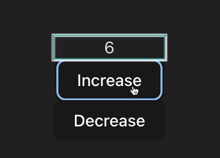

Notice the **Blue box (symbol for re-rendering occured in which component)**, it is present only on the `6` or more precise `CurrentCount` component, nothing elsewhere. [the box you see at `Increase` is not that **blue box** it is for the sake that you have clicked this component]

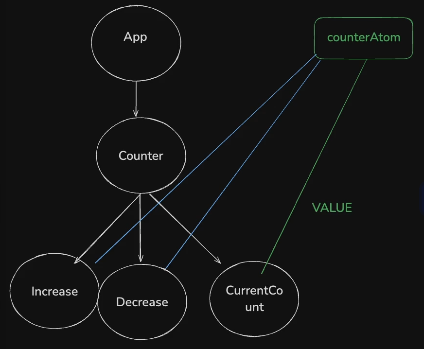

The above picture is the summary

## **`memo` api in `React`**

before proceeding to the memo section first read this **blog post**

[memo blog](https://whereisthemouse.com/react-components-when-do-children-re-render)

`memo` as the name suggest **Memoizing a component and only changing if the props changes**

> <mark>**.`memo` lets you skip re-rendering a component when its props are unchanged.
.**</mark>

> :pushpin: **One very important thing which was not being told till now is that ->** <mark>**.If the Parent component re-renders, then ALL its children component also re-renders (even though you have not passed any PROPS or state variable inside them).**</mark>
>
> > keep in mind that if the component contains the PROPS or state variable and if that changes, then the component will re-render (i mean that is obvious also)

to solve the above problem, `memo` is used

current situtation when using `useState` 

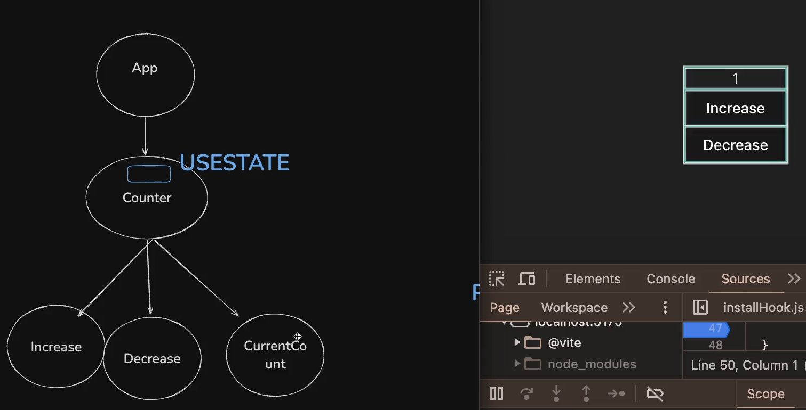

Notice that although `useState` is defined inside the `Counter` component, still the **blue box (for re-render)** is happening on all its children (`Increase`, `Decrease` and `CurrentCount`) also and even though no PROPS has been passed to them from the parent `Counter`, still the re-rendering is taking place

to use `memo` just add `memo` at the front of the function which you want **ONLY to re-render**

### **using `memo`**

to use `memo` first of all know that **it accepts Component / function as Input**

Firstly, **Import it from `react`**

> :warning: <span style="color:orange">**Remember ->**</span> to use `memo`, **Import it from `react` NOT `recoil`**

now using in the code two ways to use it  

```javascript
import React, {useState, useEffect, useRef, memo} from 'react' // Importing 'memo' from 'react'
import {RecoilRoot, atom} from 'recoil'
import {counterAtom} from './store/atom/counter' 

function App(){

    return (
        <div>
            <RecoilRoot> 
                <Counter/>
            </RecoilRoot>
        </div>
    )
}
function Counter(){
    const [set, setCount] = useState(0)

    useEffect(() => { // 3 second me ye chlega, although you can see that there is nothing that is being passed on as PROPS and also its children are not using or have their own state variable, still along with this, all its children component will also re-render 
      setInterval(() => {
        setCount(c => c + 1)
      }, 3000);
    }, [])
    

    return(
        <>
        // these are the children of Counter component 
        // They will also re-render 
            <CurrentCount  />
            <MemoCurrentCount /> // If you are using 1st way to implement memo, then instead of CurrentCount, MemoCurrentCount will be sent as now the component has became MemoCurrentCount.
            <Increase  />
            <Decrease  />
        </>
    )
}
// using 'memo' to avoid the children from re-rendering 
// jis jis ko re-render se koi mtlb tha nhi, means unnecessary re-render ho rha tha un sbko 'memo' use krwake re-render se bachao

// as here we wanted ki children re-render na ho, and hence teeno (Increase, Decrease and CurrentCount) ko memo use krke safe kro 

// 1st way to implement it 
// Either make a seperate component 
const MemoCurrentCount = memo(CurrentCount) // made another component 'MemoCurrentCount' which has memoised version of 'CurrentCount' component 

// Remember that now MemoCurrentCount will be returned from its parent component

function CurrentCount(){     
    return( 
        <>
        </>
    )
}

// OR 2nd way to implement it 
// make a memo function and store its ouput inside varible named here as CurrentCount (as 'memo' take another function as Argument so it will be a CALLBACK function)

const CurrentCount = memo(function(){    
    return( 
        <>
        </>
    )
})

// similarly using 'memo' for all the other children (so that they dont re-render unnecessarily) using the 2nd way to implement memo

const Increase = memo(function(){ 

    function increaseHandler(){

    }
    return (
        <>
            <button onClick={increaseHandler}>Increase</button>
        </>
    )    
})

const Decrease = memo(function(){

    function decreaseHandler(){

    }
    return (
        <>
            <button onClick={decreaseHandler}>Decrease</button>
        </>
    )   
})


export default App
```

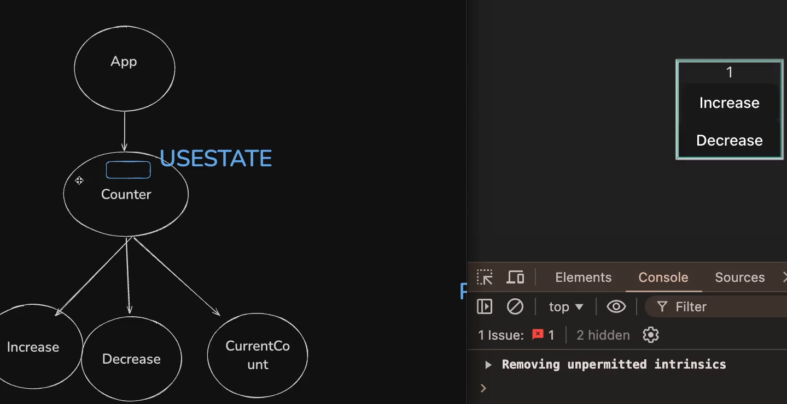

Notice the difference from the above pic used for this

Now if you will notice only the outercomponent `Counter` (which really needs to be re-rendered) is actually having a **blue box around it (means this is only re-rendering)** (`Increase`, `Decrease` and `CurrentCount` does not re-render as the **Props present here or state varibable if any have not changed**)

**This solved the problem of `recoil` also**

Now if you **pass the prop inside the children component(lets say `CurrentCount`), then it will get re-rendered even though it is inside the `memo` function** 

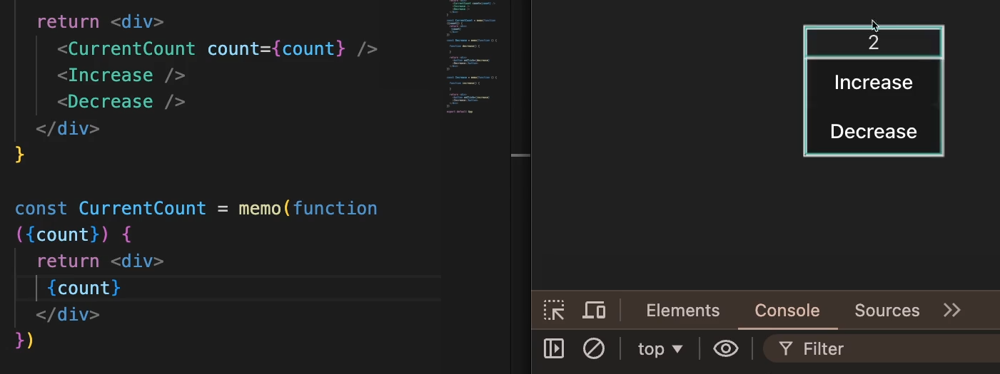

Blue box is appearing over the `CurrentCount` and parent component `Counter` not on the `Increase` or `Decrease` as **now the `CurrentCount` is holding the PROP of `Counter` and as its(prop passed) value is changing, although it is inside the `memo` function will lead to re-rendering of the component**

## **Selector in Recoil**

to understand this lets take an example of linkedIn ->

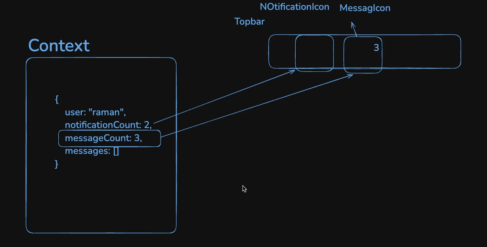

What we actually want ki agar `user` changes to `raman` in linkedin (lets say i am exploring the other account and want to visit the `raman's` account), then only the `user` should change or **re-render not the whole context** as i want ki `baki` sb ka value to whi h (as mera account h to why to **re-render them unnecessarily**)

Now see how `Recoil` is going to handle the above situation (makes it very easy)

`Recoil` says that **Make a global Atom variable which consists of the CONTEXT and for each item in the CONTEXT, make a `SELECTOR` which will work as intermediate for component re-rendering** <span style="color:orange">**Through these SELECTORs, you can select ONLY those elements to re-render jisme shi me change hua h**</span>

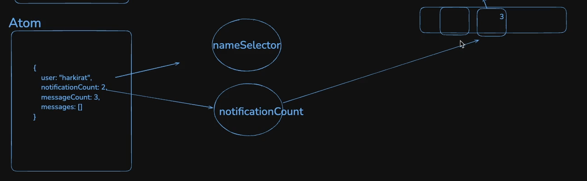

see the above thing if there is a change in `user`, then **nameSelector** will **SELECTIVELY only re-render the `user` with the updated one (Rest all will remains unchanged as UNKE SELECTOR me koi change nhi hua h)**

A **selector** represents a piece of **derived state**.( For ex -> in the above pic, Given a state `user` you have derived another state `nameSelector`, agar isme change hoga to khali `user` **re-render** krega not the other state variables made) You can think of derived state as the output of passing state to a pure function that derives a new value from the said state.

:bulb: **What is pure function ??**

-> Any function whose work is to __only accept the value came from one function and send it to other without making changes in it__(someone else also cannot manipulate it), are known as PURE FUNCTION.

> :pushpin: **Given an input, output will ALWAYS the same** this is what PURE function means.

**Original function me agar change hoga to bhale Derived state / selector automatically UPDATE hoga(means it is DYNAMIC in nature)**

> simply saying **Derived state** kisi state se Derived hua dusra `State` h  

Derived state is a powerful concept because it lets us build dynamic data that depends on other data.

Another example of Derived state can be 

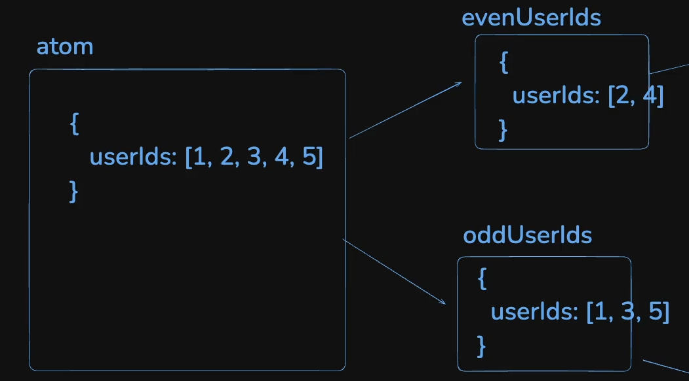

Lets say you were making a system where you wanted to give even numbers to VIP peoples and odd numbers to Normal people, now as normal people use the app a lot, so you have **seperated out or made a DERIVED state from the pre-existing state made as atom called as `oddUserIds`** (so that as ye jyada use hoga hence, isko alg kr lo and **isi ko baar-baar re-render kro**) and as `evenUserIds` will not be used much so usme **re-render apne aap km hoga** and hence you have used **Derived state or SELECTOR** as way to **reduce the re-renders occuring on the website**

Lets understand it by coding up the below figure

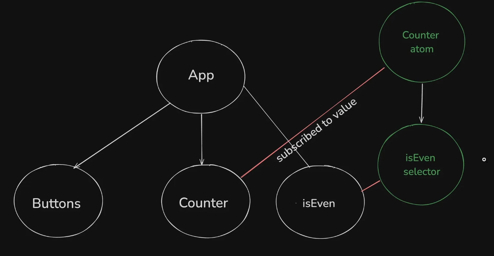

we have already made the `Counter` atom inside the folder named as `Store` with file named as `counter.js` 

```javascript
import {atom, selector} from 'recoil' // first importing the Selector from 'recoil'

export const counterAtom = atom({
    key : "counter",
    default : 0
})
```

coding up `isEvenSelector` , Now generally  make a seperate **folder for all the selectors** and inside it make a seperate file named after the Selector

but here keeping things simple, lets code it up in `counter.js` only

```javascript
import {atom} from 'recoil'

export const counterAtom = atom({  
    key : "counter",
    default : 0
})

// Creating the selector 
// very similar to making 'atom' as this also takes TWO Things -> key and function jispe wo derived h
// This is how you should memorise it

export const evenSelector = selector({
    key : "isEvenSelector", // to uniquely identify the selector
    get : function({get}){ // isko value de to skte h nhi so 'default' is of no use here, as ye kisi se leta h to 'get' key will be used here to know value kahan se lega ye ??
        // 'get' is KEY not a function and its corresponding value is CALLBACK FUNCTION 
        const currentCount = get(counterAtom) // means Mujhe value counterAtom se lena h ya 'get' krna h or simply saying this selector depends on 'counterAtom'
        const isEven = (currentCount % 2 == 0)
        return isEven
    }
    // V. V. Important point 
    // 'get' jo callback function ke argument me passed h usme 'atom' variable ka 'default' key ka jo value h wo aata h as Argument. (Ex -> here CounterAtom ek 'atom' variable h and iske 'default' key me 0 pda h so 'get' me 0 pass hua h and jo v tm logic likhe ho wo ye value lekar kiya jayega)
    
})
```

> :pushpin: The **purpose of giving key is that `recoil` identify kr paye and usi hisab se kaam kr paye**

> :pushpin: <span style="color:orange">**Remember ->**</span> **`get` has the logic that how can you derive some state from another atom**

now lets the usecase of this in action 

inside the `App.js` coding it as per the image 

```javascript
import {useEffect, useState, memo} from 'react'
import {counterAtom, evenSelector} from './store/atom/counter'
import {useRecoilValue, useSetRecoilState} from 'recoil'


function App(){
    return (
        <div>
            <RecoilRoot> // as we are using 'recoil' so wrap App inside the RecoilRoot
                <Buttons />
                <Counter />
                <IsEven />
            </RecoilRoot>           
        </div>
    )

}

function Buttons(){// as buttons only need the setter so useSetRecoilState

    const setCount = useSetRecoilState(counterAtom) // I want to set the counterAtom
    function increase(){
        setCount(c => c + 1)
    }

    function decrease(){
        setCount(c => c - 1)

    }
    return (
        <div>
            <button onClick = "increase">Increase</button>
            <button onClick = "decrease">Decrease</button>
        </div>
    )
}

function Counter(){ // as here we want the value of the counter so used useRecoilValue

    const count = useRecoilValue(counterAtom)
    return (
        <div>
            {count}
        </div>
    )
}

function isEven(){ // as ye to isEvenSelector se subscribe h na ki counterAtom se so if not understood then see the pic 
    const even = useRecoilValue(evenSelector)
    return (
        <div>
            {even ? "Even" : "Odd"} // will conditionally render 
        </div>
    )

}
```
output of the above code 

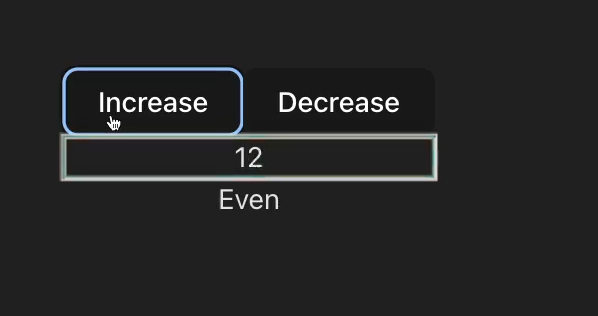

now try to compare it with the image of the given task ->  [Image 13](./image-13.png)

Notice the **white box only over the `12` i.e `Counter` component** although `isEven` was also attached to the `CounterAtom` but **It was actually subscribed to the `isEvenSelector` due to which it does not re-render** (as `CounterAtom` me to change ho rha h but `isEvenSelector` me kuch change he nhi ho rha h and as `isEven` is connected to `isEvenSelector`, to re-rendering of `isEven` ho he nhi rha) as (`CounterAtom` me change ho rha and `Counter` directly juda h with it to `Counter` v re-render ho rha h) [**see the pic Image 13 to better understand**]

For example if you now click **decrease** then 

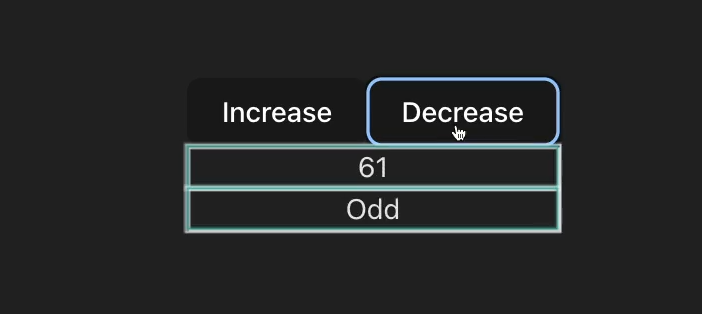

both `Counter` and `isEven` has white box coming up __(re-rendering)__ as **Both the global state `CounterAtom` and derived state `isEvenSelctor` changed which ultimately leads to re-render of `isEven` also**

**Notice how based on some Selection or condition we are trying to avoid extra re-render or more precisely (re-rendering only those which are really changing)**. This is what is the advantage of using `Selector`.

**Summary of why to use selector ??**

Lets say we have an `Atom` variable called as `countAtom` and i want to make a component knwon as `IsEven` whcih will based on the value inside the `countAtom` will tell me whether the value is **Even or odd**


Now you can use `useRecoilValue` but in the component but the problem with writing like this is if the number goes from lets say `5(odd)` to `7(odd)`, **DOM badla kya "NHI" -> as ODD to ye av v show krega** but still **re-rendering took place**. what we want ki jb **odd** se **even** (mtlb `5` se `6(even)` ho jaye) ya vice versa ho to **re-rendering kro `isEven` component ka warna mt kro**

to **avoid this extra re-rendering, we introduce SELECTOR**

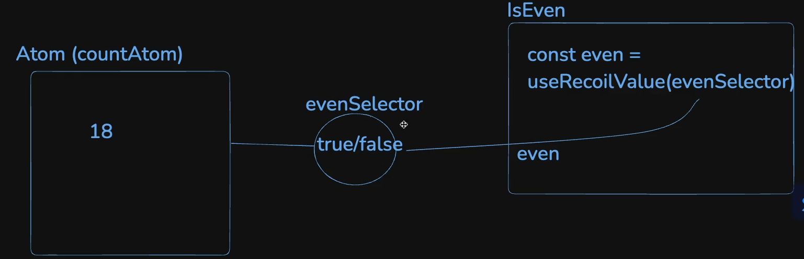

The change from the `countAtom` goes through the middle box (`evenSelector`) **if true he rha then does not propagate the change in the `isEven` component and agar false hua to phir change ko propagate kro in the `isEven` component(means re-render kro)**

So **the component is not SUBSCRIBED to the atom, it is Subscribed to Derived state of the atom**

+ **A single Selector can be connected to multiple atoms also**

# **Recoil deep dive (revision and some advance concepts by Assignment)**

Lets try to build the navbar of the linkedIn which will use `RECOIL`

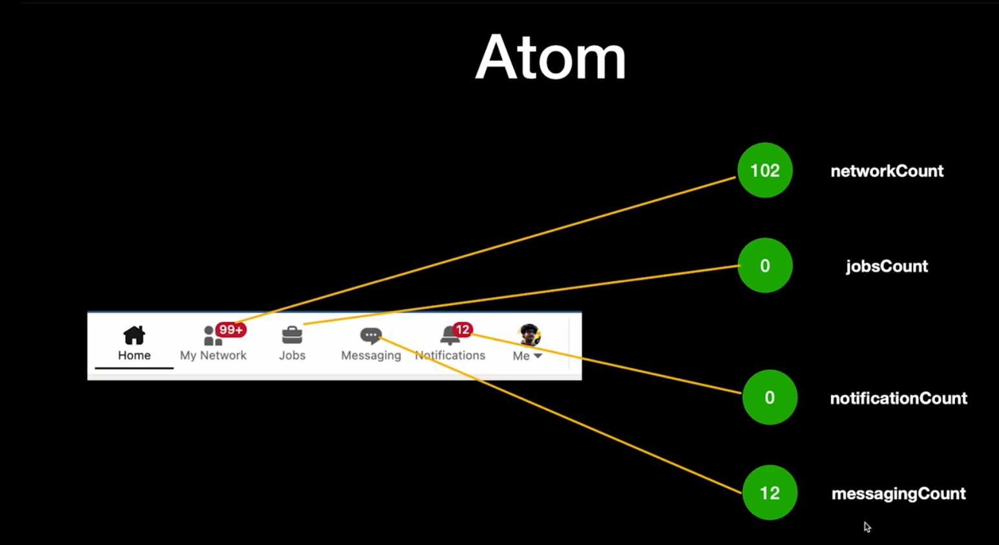

**Every dynamic part of your website can be put inside the `Atom`(similar to `useState`). an `Atom` the smallest part of website which is DYNAMIC**

making `atom` variables and including it in the `App.jsx`

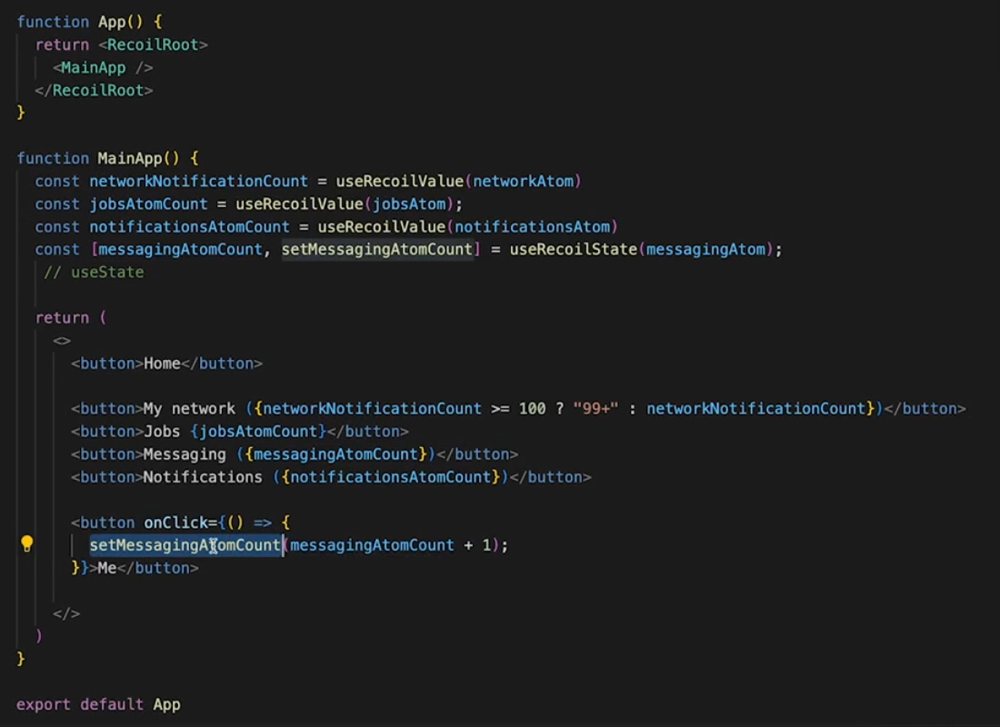 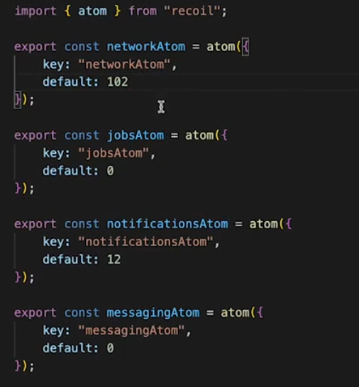 

__output__ ->  now if you click on the `Me` button then the value present inside the `Messaging` button will increase and hence you made a dynamic website.

Notice in the above, we have used `useRecoilState` in the above code so you now have example of it as well

Now lets say there is a usecase that you have to show all the popup counts (here 102(My networks) + 0(Jobs) + 0(Messaging) + 12(Notifications) = 114) that is being showed on `Me` section as shown below

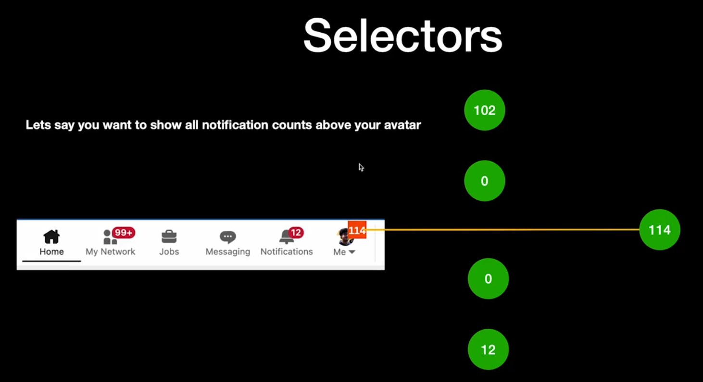

:bulb:**How to do this ??**

:bulb: **Do you need to introduce the other atom ??** 

-> You know that the value which we are trying to get is **actually the sum of all the values** (This is the hint)

but doing it in UGLY way (just adding an another normal variable)

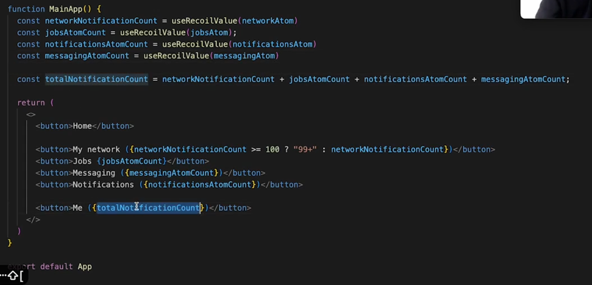

see the value of highlighted variable, we have just made use of all the values and **rendered it**

Now making it __more optimal using `useMemo` hook__ 

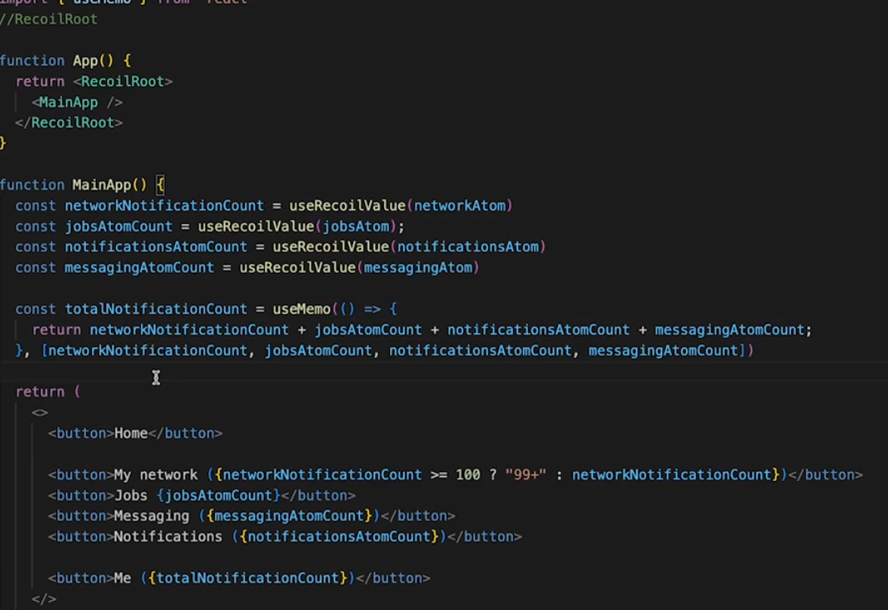

will only render when the given 4 values in dependency array changes

Finally making it **Best optimised using `Selectors`**

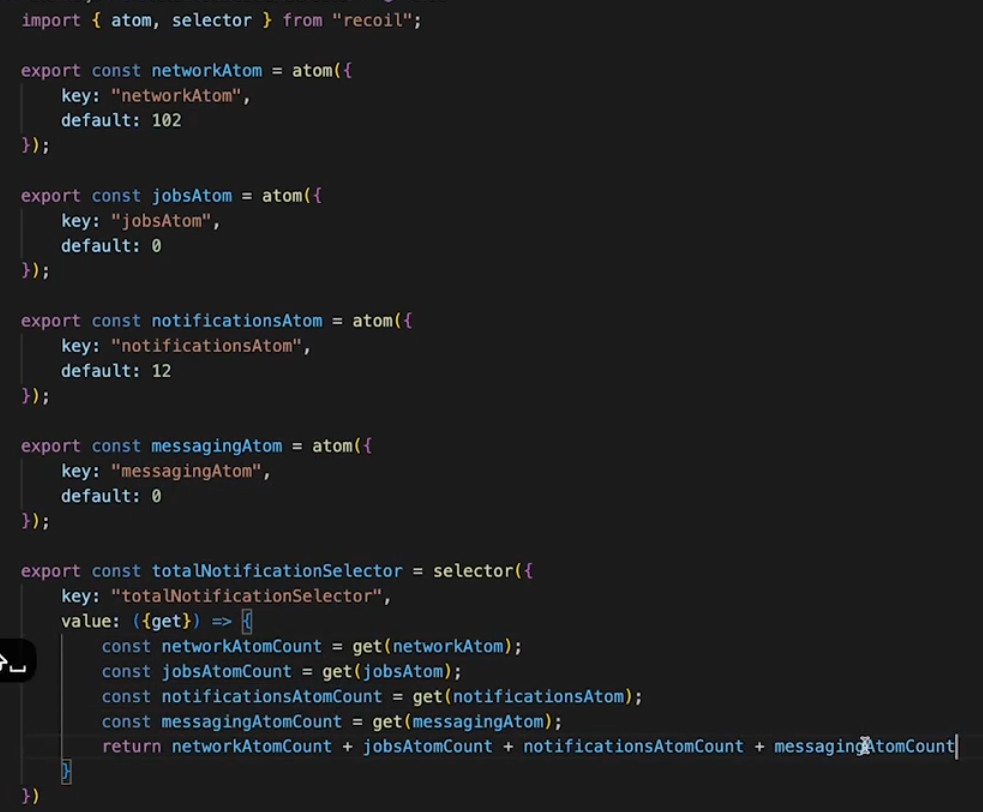 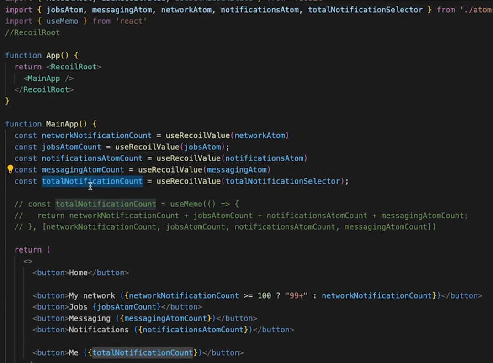

:warning: The above code has one error, in the `atoms.js` while declaring the `totalNotificationSelector` we have used **Key** as `value` write their `get` instead and will work fine

> :pushpin: <span style="color:orange">**Remember ->**</span> **Whenever you know that something depends clearly on other `ATOMs` create a `SELECTOR` rather than using `useMemo`(although this is good approach but when using `recoil` creating `selector` is better approach)**

### **Asynchronus data queries in `Recoil`**
----------


Now lets build the same navbar present on the linkedIn **But now the data will come from BACKEND**

lets say you have backend server at -> "https://sum-server.100xdev.com/notifications" where the data present is something like this :-

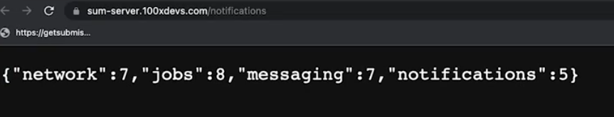

Now you have to get the data and reflect it on the navbar of linkedIn through `Recoil`

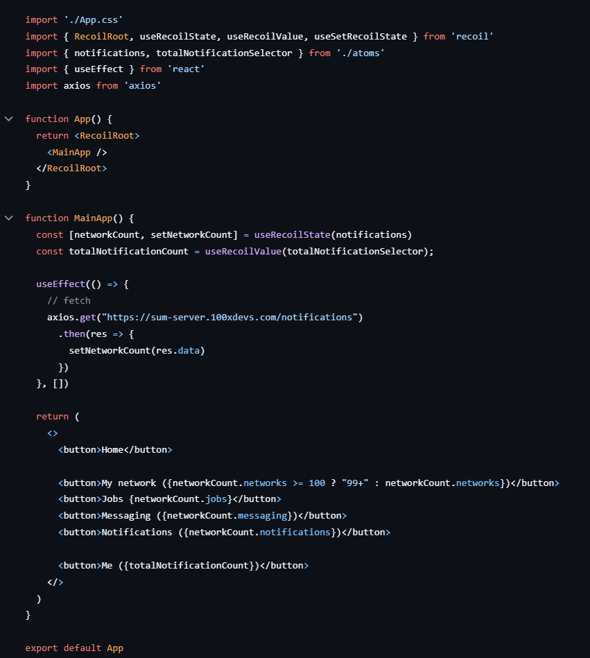 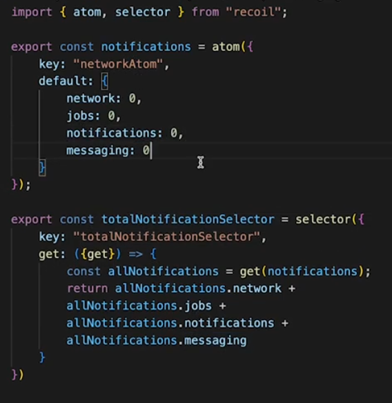

You can see in the right pic that now i have consolidated all `Atom` variables inside one single `Atom` variable. (**This is a better way to do this when it comes to ASYNC data queries, you will eventually come to know about this**)

output -> 

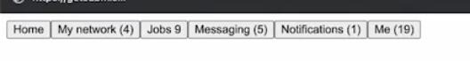

Now the problem with this approach (using `Recoil`) is that you will see that there is a flash that comes while rendering the website (it will start from `0` (default value) and go till the value fetched from the backend)

**Reason for the above ->** as you are using `useEffect`, so first the **default value will load up and then it will go to the backend, get the data and then render it on screen**

So how to solve -> rather than returning a **synchronus data (default data), it should hit the backend , get the data and store here (basically wants to transfer the `useEffect` logic to the atom itself)**

something like this ->

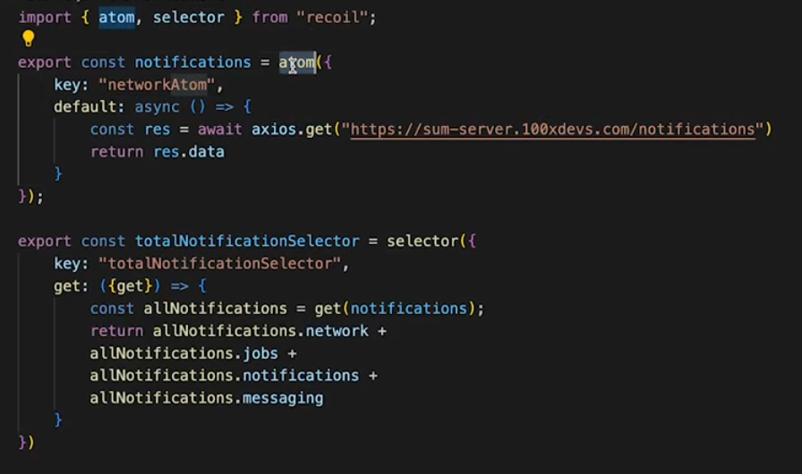

But this is not possible as 

> :warning: **`Atom` `default` key CANNOT be `async` function**
> BUT
> > **Its(`default`) `SELECTOR` can be `async`**

The above is where the __`Asynchronus data queries` comes in action__

The concept of this is highly beneficial when it comes to __problem statement where__

<mark>**.Defining an Atom which should have an ASYNC output or you are repeatedly trying to hit the backend using `recoil` concepts.**</mark>

-> **If you know that the `default` value of an `Atom` is going to come from backend or asynchronusly, then this is how you should write an `Ato`**

```javascript
const userInfoState = atom({
    key : 'UserInfo',
    default : selector({ // default is made 'Selector' and as 'Selector' can be async (as 'get' inside it is FUNCTION only and function can be async)
        key : 'UserInfo/Default',
        get : ({get}) => myFetchUserInfo(get(currentUserIdState))
    }),
})
```

Now applying the above thing and making changes according to it 

+ right one -> `App.jsx` (notice `useEffect` and its logic has been removed)
+ left one ->  `atoms.js`(`useEffect` inside logic has been shifted here inside the `Selector` `get` function)

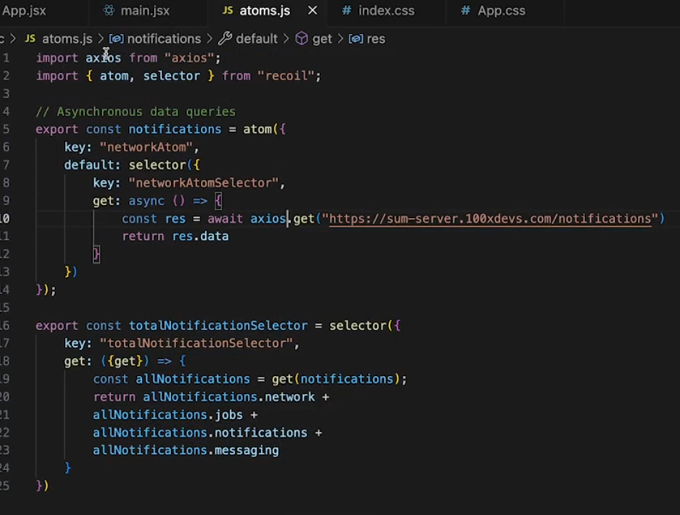 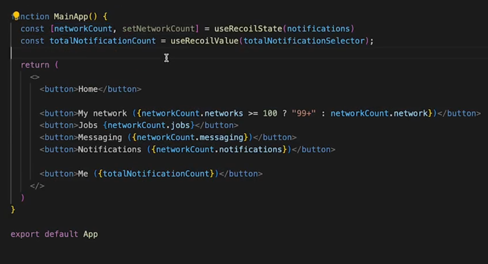

But __you should be thinking that still the data is coming from the backend which will definitely take time and hence the flash should be visible right ??__ 

-> the answer to this is **YES, it still has flash** but now not that type like that when `default` value `0` se ho rha tha, waisa nhi instead yahan par **ek white screen aa rha h**

## **Advance Recoil**

### **about `atomFamily`**
----------


**Problem ->** Sometimes you need more than one atom for your use case 

+ __For example__ -> Creating a todo application

:bulb: **Create a component that takes a todo id as input, and renders the TODO**

+ You need to store the Todo in an `atom`(cant use `useState`)
+ All the Todos can be hardcoded as a variable 

so what you will do ??

+ **Would you have a single atom ??**
+ **Would you have one atom per todo ??**
+ **How would you create (and delete) todos dynamically ??**

We actually want to **get the id which has been given in the argument** and then display the corresponding Todos **data from the `todos.js`** (see left part of below pic) and render via `App.jsx` (see right part of the pic) BUT the only **condition is that you should do this via `Atom`**(notice the `Todo` component it takes `id` as input).

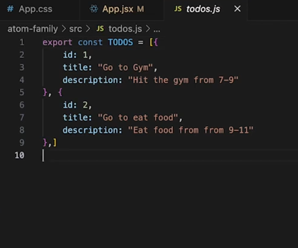 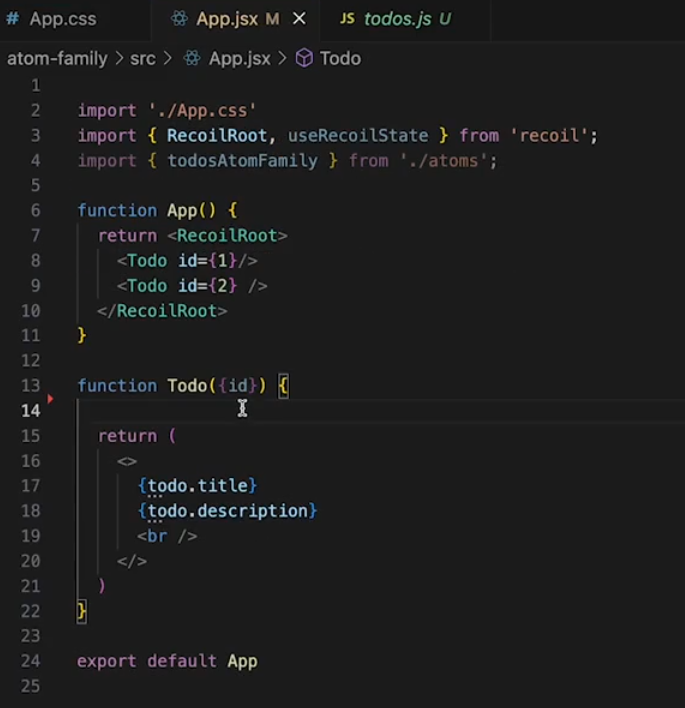

Now one approach coming to your mind is **to manually inject the data inside the `Atom` variable from `todos.js`**

somthing like this -> (you can make the **`Atom` variable in seperate folder**, although here made in that file only)

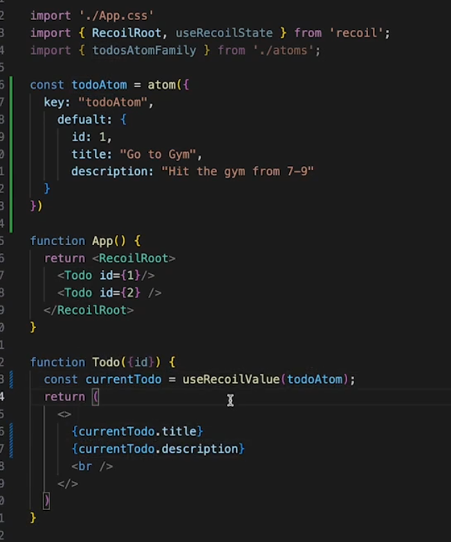

But you can easily see the problem, although you have rendered the data but
1. it is not **Dynamic (means agr kal ko naya data add hua `todos.js` me to phir manually update kro)**
2. see the `App` component although it is rendering two `todos` component (one whose id `1` and second one whose id is `2` but due to in the `Todo` component, you have pointed to `todoAtom` only, **so both will get the SAME value (i.e. value present in `todoAtom` for both these two ids))**

**You have not dynamically created two different atoms for these two different ids** (Both the component are getting value from a single `Atom` variable) <- This is the problem

**What we wanted ? ->** You have to **somehow create a new `Atom` anytime a component is created**

> :pushpin: **`atom` works only when you know something is present only ONCE on the screen**
>
> > But if you have Bunch of Todos, so each **will need to have its own todos, so you have to dynamically Create more and more atoms**

+ you can argue that **I will create a single atom which will store the list of all the todos in form of ARRAYS (but there are DOWNSIDE of using this appoach)**

so what problem you have to solve -> **If you have 5 todos then for each todo, you have to make different atom and if two or more todos have same `id` then for them it should not make another atom as they all are of same todos, so they should point to same todo atom made for it**

<span style="color:orange">**To solve the above problem, `atomFamily` comes into the picture**</span>

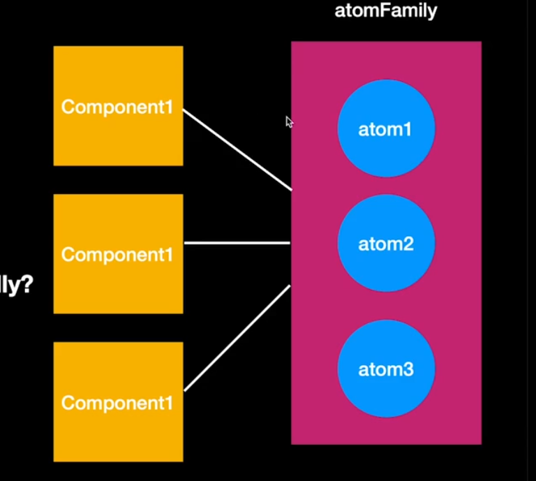

`atomFamily` will act as **Mediator**(as it has access to all the `atoms`). It will tell ask from the `component` that whoseever want to access the `atom`, give me its `id` first and corresponding to it will i give the `atom`. If the `component` give some new `id`, then `atomFamily` will **dynamically create a new `atom` corresponding to it** and hence it will create more and more `atom`

:bulb: **How to use it ??**

Just add **one Small Bracket ()** which will consists of *things which `atomFamily` will need to distuinguish the `atom`*(which is here in our case -> `id`)

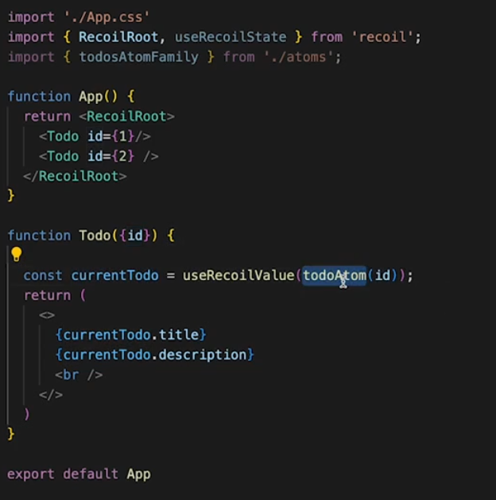

Notice in the above picture, you have just **added `id` inside the small bracket ()** [see the highlighted part in the above picture]

**Doing just the above thing will make it `atomFamily` as now it knows kaun se `id` ka todo ka `atom` chahiye**. The above thing will solve the problem described above

Now **how to find the corresponding `atom`** (this logic will written inside the `atom.js`)

**How to create `atomFamily` ??** (above you have seen How to use it ??)

now inside the `atom.js`

```javascript
import {atomFamily} from 'recoil' // Imported 'atomFamily' from recoil is the first thing to do
import {TODOs} from './todos'

export const todosAtomFamily = atomFamily({ // used 'atomFamily'
    key : 'todosAtomFamily', // Every 'atomFamily' should have UNIQUE key
    default : (id) => { // here 'id' taken as INPUT
        return TODOS.find(x =>  x.id === id) // basically the logic to find the corresponding id 
    }
})
```

> :pushpin: <span style="color:orange">**Remember ->**</span> **`atomFamily` lets you dynamically create `atoms`**
>
> > <mark>**.returns a function basically taking the abvoe example, `todosAtomFamily` will STORE a function which RETURNS a new `atom` for you.**</mark>

> :pushpin: **Just as the `atom` cannot take 'default' as `async` function, here also inside the `atomFamily` you CANNOT make the function `async`**
>
> > for this you have to use **`selectorFamily` (will be discussed later)** and then as you can meke `selectorFamily` -> `async` just like `selector` hence you can make then `atomFamily` `async`

something like this (for understanding purpose)

```javascript
const todosAtomFamily = function (){ // returns a function which returns a new atom to you 
    return atom({

    })
}
```

so finally the code looks something like this 

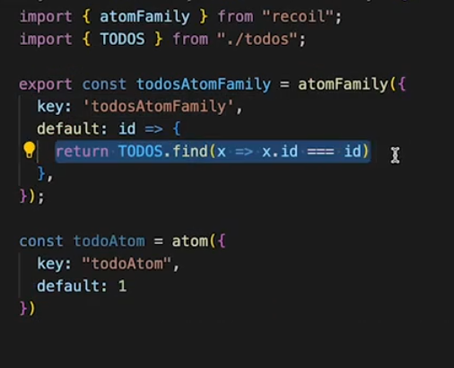 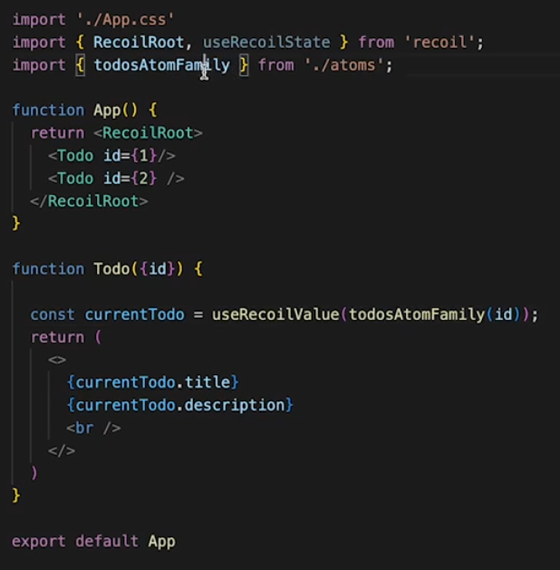

output ->


Now in the `atoms.js` you can completely do this 

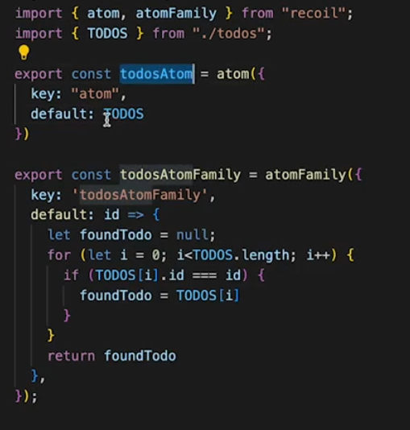

created a `todosAtom` which is returning the whole `TODOS` array, the downside of this approach is that even if the one `todo` in the `TODOS` changes, all the `Todo` component which are **present inside the `App` component will RE-RENDER**

The use of `atomFamily` will let you dynamically create the `atom` and will solve the above problem also. **As you are creating `atom` for seperate values, so as soon as you change something in one of the `atom` then the component using that specific `atom` will only RE-RENDER in the `App` component**

### **about `selectorFamily`**
----------

you already know about the `Selector` so this similar to that only 

In the ToDo application, lets say you are supposed to get a TODOs from a server whose url is

"https://sum-server.100xdevs.com/todo?id=1" (given an `id` hit the corresponding **backend**)

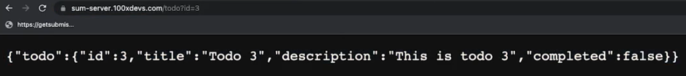

data looks something like this for `id = 3`

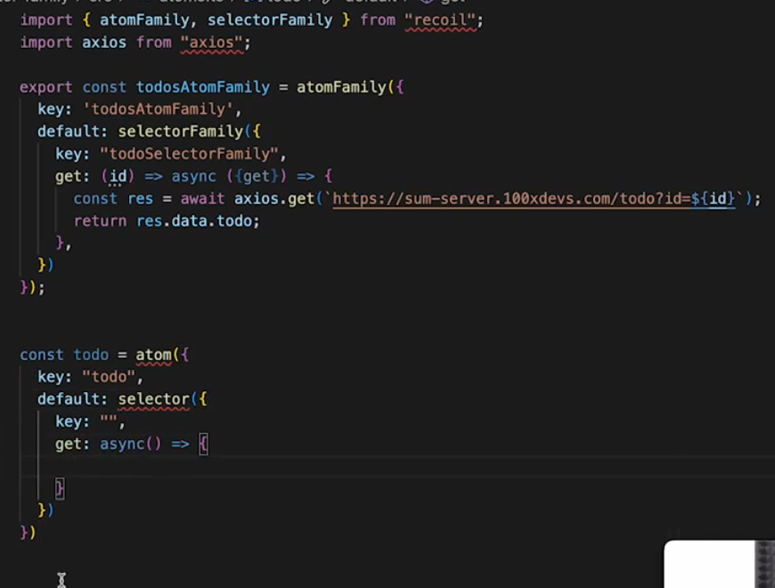 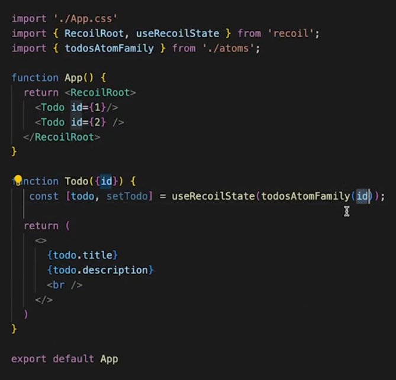

**right pic(`App.jsx`) ->** remains the **same as used above**

in the **left pic ->** Notice how we have used `selectorFamily` inside the `atomFamily` to make the `async` function work. **It also contains `todo` as `atom`(see below code) to JUST show you how we have made `atom` `default` value accepts `async` function via the `selector`(did a while ago)**

The only difficult part to understand in the above **left pic is the below code** 

```javascript
export const todosAtomFamily = atomFamily({
    key: 'todosAtomFamily',
    default: selectorFamily({
        key: "todoSeIectorFamily",
        get: (id) => async ({get}) =>  {
            const res = await axios.get(`https://sum—server.1ØØxdevs.com/todo?id=${id}`)
            return res.data.todo;
        },
    })
})
```

**Simplifying it further by writing in an understandable way ->**

```javascript
export const todosAtomFamily = atomFamily({
    key: 'todosAtomFamily',
    default: selectorFamily({
        key: "todoSeIectorFamily",
        get: function(id){
            return async function({get}){ // 1
                const res = await axios.get(`https://sum—server.1ØØxdevs.com/todo?id=${id}`)
                return res.data.todo;
            }
        },
    })
})
```

+ `get` here is not just simply a function like we have seen until now in `selector`, it is the function which has Input parameter and which returns another function

**Explanation of the code**

For the `todosAtomFamily` whenever **an `id` is given as INPUT RUN the function `// 1` , which can use this `id` and then hit the backend(`await` line) and then RETURN the data**

As it is a function which is returning an another function so yes this might feel complicated and it is.

:bulb:**Why we are doing this ??**

-> **Because** `atomFamily` has multiple `atom` so it has to take a **function which will have take `id` as INPUT to find the particular `atom` (or todo)** and then **as the DATA is present on the backend so an another `async` function will run and try to fetch the data from the given input `id`**

:bulb: **What is the role `selectorFamily` in all of these ??**

-> **as we know `atom` `default` key cannot have function mapped as value to it and especially `async` function, to achieve this we use `selector` as medium** <mark>**.This same thing applies on the 'atomFamily' also and 'selectorFamily' is used to solve that problem.**</mark>

You can see in the above problem only because the `selectorFamily` present in the code, you have been able to **contain the function as well as `async` function inside the `atomFamily` `default` key**

>:warning: <span style="color:orange">**Remember ->**</span> **whenever you are using `atomFamily`, you must use `selectorFamily` as well because we know `atomFamily` creates MULTIPLE `atom` and if  you dont use `selectorFamily` here then for each `atom`, THERE WILL BE COMMON `SELECTOR`(i.e. -> means same key means SAME VALUE)**

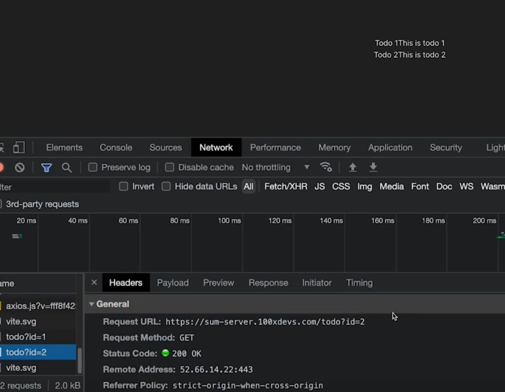

You can see the **Backend request going out on different routes as `id` changes and data is being shown according to it**

:bulb: **How it is different from previous assignment ??**

In the previous assignment, you were having the `todos` in **Memory only(`Todos.js`)** so no need for `selectorFamily`. we were just **finding the particular `todo` with given `id` as input and then using `.find()` function to find that particular `id` of the `todo` from the `Todos.js` and then returninng the value corresponding to it (all these required a function(input taking) hence WRAPPED inside the FUNCTION)**

BUT 

here the data is **not present in the Memory, it is coming from Backend and hence we need to have `selectorFamily` to insert `async` function inside the `atomFamily` and also to handle multiple `atom` data to get correctly logged from the server.(You have to hit the Backend for every `todo`)**

## **Making a Loader for websit**

### **about `useRecoilStateLoadable` hook in `recoil`**

----------

Lets understand by a practical scenario where it is widely used 

:bulb: **What happens when the values aren't loaded immmediately ??** For example -> the TODOs that are coming back from the server

-> **Which is good to do -> see the Loader or Empty state ??**

-> Definitely, **Loader Right and thats what you have seen in many websites also, till the data is coming from the backend, you will see a loader or SKELETON(better than loader)**

:bulb: **How to show Loader on the screen ??**

<span style="color:orange">**Rather than using `useRecoilState`, use `useRecoilStateLoadable`**</span>

now `useRecoilStateLoadable` returns you some things:-

+ **contents ->** this will have **all the value coming from the Backend `request`**
+ **state ->** this will return you whether the **Backend**`request` **has been resolve or not** (gives two values(**IN STRING format**) regarding the `request`)
    + **"loading" ->** means the `request` is now being processed and **takes some time**
    + **"hasValue" ->** means the `request` has been resolved and **data has been fetched**
    + **"hasError" ->** means the `request` has __not__ been resolved __due to some ERROR__

Now using it to show the demo 

making litte modification inside the `App.jsx` only to make it Loader compatible

```javascript
import {todosAtomFamily} from './atoms'
import {RecoilRoot, useRecoilStateLoadable} from 'recoil' // importing 'useRecoilStateLoadable' hook from 'recoil'
 
function App(){
    return (
        <RecoilRoot>
            <Todo id = {1}>
            <Todo id = {2}>
        </RecoilRoot>
    )
}

function Todo({id}){
    const [todo, setTodo] = useRecoilStateLoadable(todosAtomFamily(id)) // 1 just replaced the 'useRecoilState' with 'useRecoilStateLoadable'

    if(todo.state === "Loading"){ // as 'useRecoilStateLoadable' returns two values -> 'state' and 'contents' so used the 'state' with its return value to show particular DOM in particular scenario
        return(
            <div> Loading... </div>
        )
    }
    elseif(todo.state === "hasValue"){
        return(
            <div>{todo.contents.title}</div> // as 'useRecoilStateLoadable' return the data inside the 'contents' keyword so used it first and then corresponding title and description ko display kr diya
            <div>{todo.contents.description}</div>
        )
    }
    elseif(todo.state === "hasError"){
        return(
            <div>Error while loading </div>
        )
    }

}

export default App
```

### **about `useRecoilValueLoadable` hook**

:bulb:**How to Remember ??**

-> <mark>**.Below paragraph is very important from remembering point of view as it summarises the RELATION between what we have studied.**</mark>

It is same as the name is given. just as `useRecoilState` was used only when you **wanted both value and setters**, similarly was `useRecoilStateLoadable` and hence **Relating with this analogy**

as `useRecoilValue` was used only when **you wanted the value**, similar is `useRecoilValueLoadable`

`useRecoilValueLoadable` also returns two things as `useRecoilStateLoadable` and that too <span style="color:orange">**SAME TO SAME**</span>

to use it just **make some changes in the `// 1` line of code above present**

```javascript
import {todosAtomFamily} from './atoms'
import {RecoilRoot, useRecoilStateLoadable, useRecoilValueLoadable} from 'recoil' // importing 'useRecoilValueLoadable' hook from 'recoil'
 
function App(){
    return (
        <RecoilRoot>
            <Todo id = {1}>
            <Todo id = {2}>
        </RecoilRoot>
    )
}

function Todo({id}){
    const todo = useRecoilStateLoadable(todosAtomFamily(id)) // 1 just replaced the 'useRecoilStateLoadable' with 'useRecoilValueLoadable' and as it only gives VALUE so SETTER hta diya

    if(todo.state === "Loading"){ // rest all is same to same as 'useRecoilStateLoadable' (as it ('useRecoilValueLoadable') returns same thing)
        return(
            <div> Loading... </div>
        )
    }
    elseif(todo.state === "hasValue"){
        return(
            <div>{todo.contents.title}</div> 
            <div>{todo.contents.description}</div>
        )
    }
    elseif(todo.state === "hasError"){
        return(
            <div>Error while loading </div>
        )
    }

}

export default App
```
Now also the website will work as previous

see the output ->

<video width="800" height="400" controls>
  <source src="./useRecoilState,valueLoadable.mp4" type="video/mp4">
</video>

you can see that initially the `Loading..` screen is being shown and once the data is fetched then `data` gets reflected on the screen.

**The above is the CORRECT way whenever you are fetching the data from backend server**

If you will use the normal `useRecoilValue` instead of `useRecoilValueLoadable` and if an **ERROR** comes while **fetching the data from the backend**, then <mark>**.Your whole app / website will CRASH.**</mark>

Now either you can use `useRecoilValueLoadable`, `useRecoilStateLoable` (same thing) 

OR 

**use `Suspense` component API**

### **about `<Suspense></Suspense>` component API in `React`**

work is **similar to `useRecoilValueLoadable`, `useRecoilStateLoable`**

**Basically if you have `useRecoilValue` or `useRecoilState` of any value that will take time, wrap it inside the `<Suspense></Suspense>`**

converting the above code to make compatible with `Suspense`

```javascript
import {todosAtomFamily} from './atoms'
import {RecoilRoot, useRecoilStateLoadable, useRecoilValueLoadable} from 'recoil'
import {Suspense} from 'react' // REMEMBER 'Suspense' is in 'react' not in 'recoil' so make sure to import it from 'react'
 
function App(){
    return (
        <RecoilRoot>
            <Suspense fallback = {"Loading...."}> // WRAP inside the Suspense which is going to take some time, it takes 'fallback' means -> kya dikhan jbtk data fetch ho rha h
                <Todo id = {1}>
                <Todo id = {2}>
            </Suspense> 
        </RecoilRoot>
    )
}

function Todo({id}){
    const todo = useRecoilValue(todosAtomFamily(id)) // 1 REMEMBER 'Suspense' 'useRecoilValue', 'useRecoilState' jb use kroge tbhi KAAM krta h

    return(
        <div>
            <div>{todo.title}</div>
            <div>{todo.description}</div>
        </div>
    )

}

export default App
```
and things will work as expected but still the website will **crash if an ERROR occurs while fetching the data** hence **`<Suspense></Suspense>` is often clubbed with `ERRORBOUNDARY` concept to handle the ERROR while using the `<Suspense></Suspense>` component**

You can read more about it (`ErrorBoundary` has already been taught by the way) [see previous notes]


