# **Typescript**

- [**Typescript**](#typescript)
  - [**Setting up `tsc` for `typescript`**](#setting-up-tsc-for-typescript)
  - [**Basic Datatypes in `typescript`**](#basic-datatypes-in-typescript)
  - [**The `tsconfig` file**](#the-tsconfig-file)
    - [**target**](#target)
    - [**rootDir**](#rootdir)
    - [**outDir**](#outdir)
    - [**noImplicitAny**](#noimplicitany)
    - [**removeComments**](#removecomments)
  - [**Interfaces**](#interfaces)
    - [**defining `interface`**](#defining-interface)
    - [**Using `interface` and its advantage**](#using-interface-and-its-advantage)
    - [**Indepths about `interface`**](#indepths-about-interface)
    - [**`interface` inside `interface` (Nested `interface`)**](#interface-inside-interface-nested-interface)
    - [**Implementing `interfaces`**](#implementing-interfaces)
  - [**Abstract Classes**](#abstract-classes)
    - [**Difference between an `interface` and `abstract class`**](#difference-between-an-interface-and-abstract-class)
  - [**Types**](#types)
    - [**defining `types`**](#defining-types)
    - [**Difference between `type` and `interface`** (common interview question)](#difference-between-type-and-interface-common-interview-question)
      - [**1. Unions**](#1-unions)
      - [**2. Intersection**](#2-intersection)
    - [**Difference between `intersection` and `union` in `type`**](#difference-between-intersection-and-union-in-type)
  - [**Arrays in TS**](#arrays-in-ts)
    - [**Very difficult interview question on `UNION` and `INTERSECTION` in `type`** (Important one)](#very-difficult-interview-question-on-union-and-intersection-in-type-important-one)
  - [**To summarise -\>**](#to-summarise--)
  - [**Import and Export in `ts`**](#import-and-export-in-ts)
    - [**Constant exports (Bari-Bari se kro)**](#constant-exports-bari-bari-se-kro)
    - [**Default Exports**](#default-exports)
- [**Advance Typescript**](#advance-typescript)
  - [**Pick**](#pick)
  - [**Partial (denoted by `?`)**](#partial-denoted-by-)
  - [**Readonly**](#readonly)
  - [**`Record` and `Map`**](#record-and-map)
    - [**about `Record`**](#about-record)
    - [**about `Map`**](#about-map)
  - [**`Exclude`**](#exclude)
  - [**Type inference in zod** (Most important and widely used)](#type-inference-in-zod-most-important-and-widely-used)


One of the **Types of langauge is**

1. **Strongly typed vs Loosely types**

The terms `strongly typed` and `loosely typed` refer to how programming langauges handle **types, particularly how strict they are about TYPE conversions and TYPE safety**

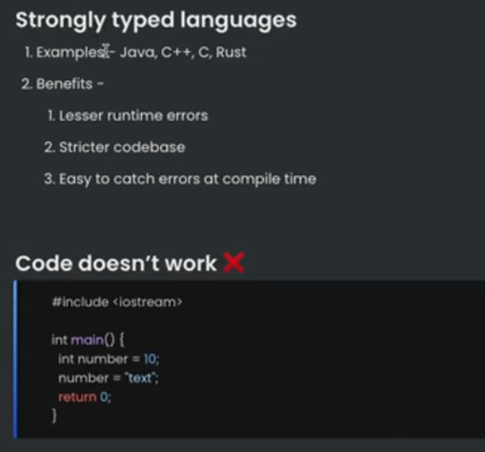 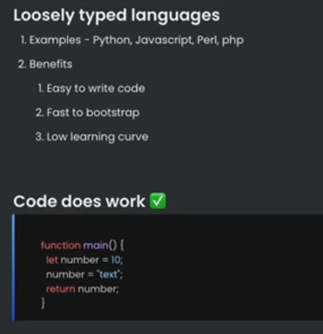 

:bulb: **Why `typescript` was needed ??**

**People realised that `javascript` is very powerful langauge, but lacks TYPES. `Typescript` was introduced as a new langauge to ADD `types` on top of `javascript`** (conversion of Loosely typed langauge to strongly typed langauge)

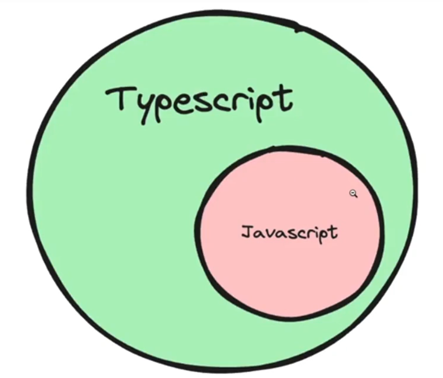

:bulb: **Where / How does typescript code run ??**

Typescript code **never runs in your browser**. <mark>**.Your browser can only understand `javascript`.**</mark>

1. Javascript is the runtime langauge (the thing that actually runs in your browser / nodejs runtime)
2. Typescript is something that compiles down to javascript.
3. When typescript is compiled down to javascript, you get `type checking` (similar to C++). If there is an error, the conversion to javascript fails

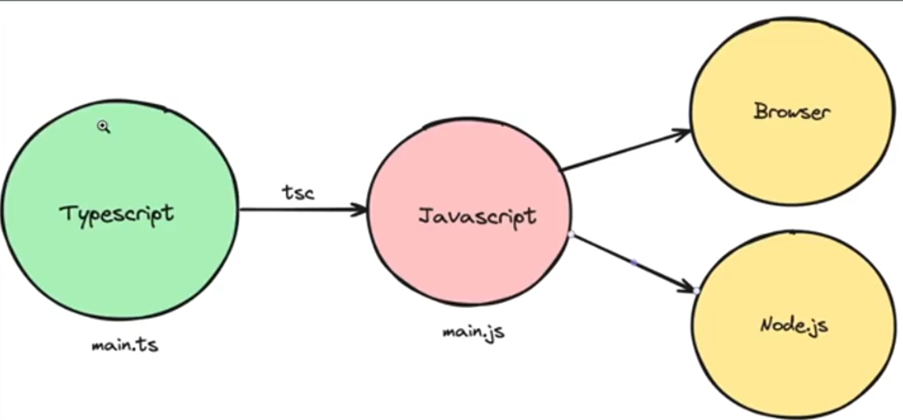

**Typescript Compiler**

**`tsc`** is the official typescript compiler that you can use to convert `Typescript` to `Javascript`

There are many other famous compilers / transpilers for converting Typescript to Javascript. Some famous ones are -

+ `esbuild`
+ `swc`

## **Setting up `tsc` for `typescript`**
----------


**Step 1 ->** Install `tsc` / `typescript` globally

```console
npm install -g typescript
```

**But usually avoid installing it globally**

**Step 2 ->** Intialize an empty `Node.js` project with `typescript`

```console
mkdir node-app
cd node-app
npm init -y // creates an empty node module file
npm install typescript // Run this only if you have not installed typescript globally
npx tsc --init
```

These commands should initalise two files in your project 


talking about the `tsconfig.json` file, **it consists of all the STRICTNESS you want to put while using `ts` (you can change it according to yourself)** [Most of the time you will tweaking some of the options here]  (**Important one will be discussed**)

**Step 3 ->** Create a `.ts` file and to **test it** just run the below code (you can write `javascript` code inside the `ts` file as `typescript` is SUPERSET of `javascript`)

```javascript
const x: number = 1;
console.log(x)
```

**Step 4 ->** **to Run the `ts` file**, you have to first change it to `js` file by using the command

```javascript
npx tsc -b  // "tsc" for the complier used to convert the ts file to js and '-b' means "build"
```

**Step 5 ->** you will notice another file with `.js` extension has been came up in your folder now to run this just use the normal code to run any `.js` file locally

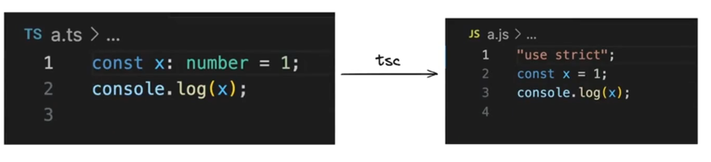

Notice how there is no `typescript` code in the `js` file. Its a plain old js file with no `types`

```javascript
node file_name.js
```

**Step 6 ->** Try assigning `x` to string 

```javascript
let x : number = 1
x = 'harkirat'

console.log(x)
```

**Step 7 ->** Try compiling the code again

You will see error given by the `tsc` compiler

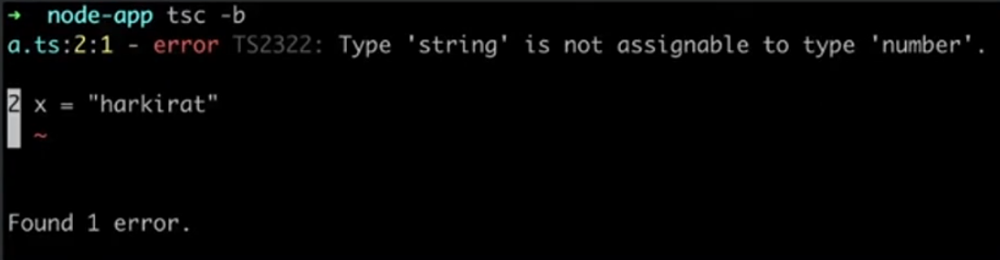

**This is the high level benefit of typescript, It lets you catch `type` errors at `compile time`**

## **Basic Datatypes in `typescript`**
----------


`Typescript` provides you some basic dataypes :-

+ **number**
+  **string**
+  **boolean**
+  **null**
+  **void**
+  **undefined**
+  **any** (MOST POWERFUL (as the name suggests, it simply means jis v variable ko ye doge that can be of any datatype), **means jaise `js` me behave krta h koi variable waise krega when you declare some variable with `any` datatype**)
    + for example -> notice no error is coming when you are using `any`
    + 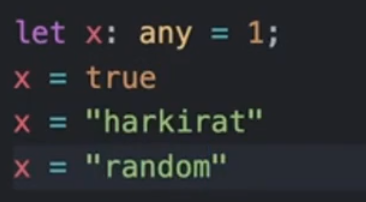

> :warning: **Try to avoid `any` as much as possible as phir `typescript` ka sense nhi bnta h (`js` me kaam kro na phir to)**

Creating some problem using these datatypes

**Problem 1 -> Hello World**

> :pushpin:__Thing to learn__ -> How to give types to argument of a function

:bulb: **Write a function that greets a user given their first name**
+ Argument - firstName
+ Logs - Hello {firstName}
+ Doesn't return anything

**Solution ->**

**1st way**

```javascript
function greet(firstName : any){
    console.log(`Hello ${firstName}`)
}

// calling the function
greet("Satyam")
// Output -> Hello Satyam

greet(1)
// Output -> Hello 1

// you should avoid giving 'any', use OR operation instead (to filter as well as expand the type support for variable)

function greet(firstName : string | number){ // now firstName can be both 'string' and 'number' type both
    console.log(`Hello ${firstName}`)
}

greet(56)

// Output -> Hello 56
```

but in our case we want to give it `string` type so

**2nd way**

```javascript
function greet(firstName : string){
    console.log(`Hello ${firstName}`)
}

// calling the function
greet("Satyam")
// Output -> Hello Satyam 
```

**Problem 2 -> Sum function**

> :pushpin:**Things to learn** -> How to assign a return type to a function

:bulb: **Write a function that calculates the sum of two numbers**

```javascript
function sum(a : number, b: number){
    return a + b;
}

let ans = sum(3, 5)

console.log(ans)

// Output -> 8
```

**Problem 3 -> Return true or false based on if a user is 18+**

> :pushpin: **Things to learn ->** Type Inference ( )

```javascript
function isLegal(age : number){
    if(age > 18){
        return true;
    }else{
        return false;
    }
}

console.log(isLegal(20))

// Output -> true
```

But here on thing has happened and that is **the return type has been INFERED by the typescript compiler**

**what do we mean by this is**

```javascript
// just like in C++ 

int sum (int a, int b){ // C++ me function KAUNSA type ka data RETURN krega that we know for ex -> here sum int type ka data he return kr skta h SIMILAR concept exist in Typescript also
    // Logic
}

function sum(a : number, b : number) : number{ // simply means 'sum' will take 'a' which should be number, 'b' which should be number and the RETURN type of this function should also be number thats what external number represents
// Many times this is not required
    return a+b
}

let ans = sum(1, 3) // now if you hover over the 'ans', you will see number type coming so now it NOW KNOWS itself

// But even if you dont give the return type of function then also if you hover, it will show number (it automatically INFERs that if tow variable of number type gets added, then obviously number type will only be their result)

let ans = number : sum(1, 3) // you can EXPLICITLY tell in this way also if you have not defined the return type of function

// Lets take another example
function sum(a : number, b : string){
    return a + b;
}

let ans = sum(1, "2") // what happens in javascript will also happen here 

// Output -> "12" (string)
// THE ABOVE IS WHAT IS KNOWN AS TYPE INFERENCING (compiler automatically infers the ouput according to the input given)
```

so modifying and making even better solution for problem 3

```javascript
function isLegal(age : number) : boolean{ // now you have given the return type 'boolean' of the function making it better solution
    if(age > 18){
        return true;
    }else{
        return false;
    }
}

console.log(isLegal(20))

// Output -> 1
```

**Problem 4 -> Callback function (function taking function as argument)**

:bulb:**Create a function that takes another function as input, and runs it after 1 second**

```javascript
function delayedCall(fn : any){  // Giving function type 'any' this is bad practice ('any' type ka he kuch dena pdega as we cant say na function kaunsa return krega as for now (lets atleast assume this), hence number, string type nhi chlega UNLESS AND UNTIL we know the function which is going to be given as INPUT has some particular return type)
    setTimeout(fn, 1000);
}

// A better version of the above code is (as we should avoid 'any')
//include the SIGNATURE OF the function also after " : "

function delayedCall(fn : () => void){ //added the SIGNATURE of the function being passed here "()" means the argument which the inner function 'fn' will take and "void" means the return type of the function which in the above case is NOTING so "void". If "fn" return something then instead of 'void' write that type there
    setTimeout(fn, 1000)
}

// calling it 
delayedCall(() => console.log("Hello"))

OR 

delayedCall(function(){
    console.log("Hello")
})

// taking example of function inside function and takes some argument
function delayedCall(fn : (a : number, b : number) => string){ // here 'fn' (inner function is taking two arguments 'a' and 'b' which are number type and the inner function 'fn' is returning 'string' type value)
    // Logic
}
```

seeing it in live

```javascript
function delayedCall(anotherFn : () => void){ // agar 'number' return diya to 
    setTimeout(anotherFn, 1000)
}

function log(){ // iss function se number type ka value RETURN KRNA HE PDEGA other wise error will come
    console.log("hi there") 
}

// calling the function
delayedCall(log)

// Ouput -> 1 second baad "hi there" print ho jayega
```

**Practice ->** Lets try to make `delayedCall` function which will take `greet` function as input

```javascript
function delayedCall(anotherFn : () => void){ // this was delayedCall function
    setTimeout(anotherFn, 1000)
}

function log(){ 
    console.log("hi there") 
}

// Now writing the greet function which was 
function greet(firstName : string){
    console.log(`Hello ${firstName}`)
}

// Now instead of 'log' as input we want greet as Input in declayedCall and hence combining it 
function delayedCall(anotherFn : (name : string) => void){
    setTimeout(anotherFn, 1000)
}

function greet(firstName : string){
    console.log(`Hello ${firstName}`) // as ye thode kuch return kr rha h hence used 'void' datatype
}

// calling it 
delayedCall(greet("Satyam"))

// Ouput -> 1 second baad Hello Satyam console pe print ho jaega
```

## **The `tsconfig` file**
----------


The `tsconfig` file has **bunch of options that you can change to change the compilation process**

Some of these include :- 

### **target**
----------


The `target` option in a `tsconfig.json` file specifies the ECMAscript target version to which the Typescript compiler will compile the typescript code. 

**Basically which version of `js` you want to use ??** (__usecase__ -> lets say kisi browser me 2016 compatible version of `js` he chlta h then in that case you can use this)

To try it out, see the below example

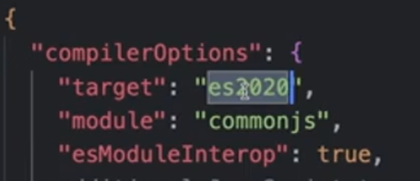 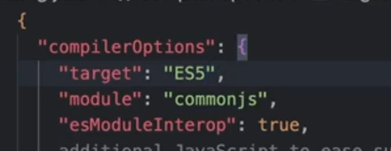

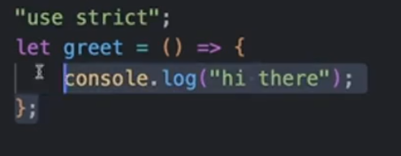 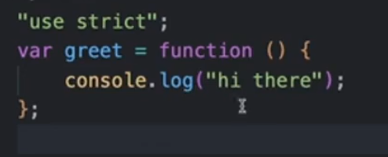
 
**In Left side ->** you can see as we are using the __newer version__ of `js` (`es2020`) **iss version me ARROW function naam ka cheez tha hence not change** 

BUT 

**In Right side ->** you can see as we have changed the value of `target` and set it to __older version__ of `js` (`ES5`) **iss version me ARROW function was not the introduced and hence you can see the code changed to normal function**

### **rootDir**
----------


Where should the compiler look for `ts` files, **Good practise is for this to be the `src` folder**

**Practical usecase ->** we all know that whenever you  run any `.ts` file, a `.js` file is also generated, but when you will push these files to `github`, eventually you should push only `.ts` file (no sense of pushing `.ts` file). so **how to ignore pushing the `.js` file**, one way is to **use `.gitignore` file** but the better way is to use this option.

**Step 1 ->** first make a `src` folder now with the help of `rootDir` and `outDir` you can seperate the `.js` and `.ts` file. `src` me `.ts` file ko move kro and then **`rootDir` me `./src` means folder path dedo** and then in the __`outDir` give the value to be `./dist`(agar `dist` naam ka folder nhi hoga to apne aap bna dega)__ and then you will see that any `.ts` file's `.js` created file will go to the `dist` folder and `.ts` file to `src` folder me he bnaoge and then `finally` put the `dist` folder to `.gitignore` file and at the time of pushing the code, it will ignore the made `.js` file

### **outDir**
----------


Where should the compiler look for spit out the `js` files

### **noImplicitAny**
----------

Try enabling it and see the compilation errors on the following code :-

```javascript
const greet = (name) => `Hello ${name}`
```
Then try disabling it 

### **removeComments**
----------

Whether or not to include comments in the final `js` file (if set to `true`, it will remove all the comments in the final `.js` file)

## **Interfaces**
----------


we have only used **primitive types** till now. what if **types somthing like OBJECT is being used**

>:pushpin:**whenever you have COMPLEX object then to define its type, we use `interface`**

:bulb: **How to take Object as Input in the function ??**

```javascript
function greet(user : {
    name : string,
    age : number
}) {
    console.log("hello" + user.name)
}

// calling the function 
greet({name : "Satyam", age : 106})

// output -> Hello Satyam 

OR 

// Seperately make an Object but in this case also, you have to PASS the signature of OBJECT you made inside the `greet` function (as that is important to pass) 
let UserName = {
    name : "Raj",
    age : 34
}

greet(UserName)

// Output -> Hello Raj

function greet(user : {
    name : string,
    age : number,
    address : { // you can also ADD nested Objects even any other types other than primitive types are allowed here
        streetName : string,
        country : string
    }
}) {
    console.log("hello" + user.name.streetName)
}

let UserName = {
    name : "Raj",
    age : 34,
    address : { 
        streetName : "34C, Vaishali Nagar",
        country : "India"    
    }
}
```

:bulb: **What are Interfaces ??**

**How can you assign types to objects ? For example, a user object that looks like this -**

```javascript
const user = {
    firstName : 'harkirat',
    lastName : 'singh',
    email : 'email@gmail.com',
    age :  21
}
```
### **defining `interface`**
----------


__To assign a type to the `user` object, you use `Interfaces`__

```javascript
interface User {
    firstName : string,
    lastName : string,
    email : string,
    age : number
}
```

> :pushpin: **Interfaces helps you to make CUSTOM data types** (other than this, there are many more things which you can do with Interface, discussed later)
>
> > **Use ->** It helped you to write the same part of code at different places(which you would have wrote) by making a custom datatypes. **Duplicacy Handled**

for example -> creating `User` interface has given you access to use this as a CUSTOM datatype 

### **Using `interface` and its advantage**
----------


```javascript
const user : User = { // now you have given 'user' the 'User' dataype so it will have to give all the values for the key present in the 'User' with its respective primitive data types
    firstName : 'harkirat',
    lastName : 'singh',
    email : 'email@gmail.com',
    age :  21
}

function greet (user : User){
    console.log(user.firstName);
}

function hello(userName : User){
    console.log(userName.firstName);
}

//USECASE of INTERFACE -> notice you have defined that 'user' and 'userName' is of type 'User' which you made

BUT just imagine you have not made interface then writing the same code would look like this 

function greet (user : { 
    firstName : string,
    lastName : string,
    email : string,
    age : number,
}){
    console.log(user.firstName);
}

// Similarly 
function hello(userName : {
    firstName : string,
    lastName : string,
    email : string,
    age : number  
}){
    console.log(userName.firstName);
}

// You can clearly see the Difference -> CODE REPEATITION is happening everytime you want to use the object which has the SIGNATURE like 'User' interface made and when you will call these function again you have to give all these parameters to run the function (chlo ye to dena pdega he, but atleast signature declaration hr baar kre, this should be replaced with some logic) 
```

### **Indepths about `interface`**
----------


**Problem statement -> You have an `interface`, called as `User` which has some keys. Now you want ki koi key OPTIONAL ho ??**

```javascript
interface User{
    name : string,
    age : number,
    address : { // I want ki address optional hona chahiye while using this interface (custom dataype of object)
        city : string,
        country : string,
        pincode : number
    }
}

// WHY IT IS REQUIRED ??

// If you will not give any of the key while declaring any variable with this datatype, it will give error 

let user2 : User = { // 2 This code will give ERROR as 'address' and its subkeys are missing and you have defined 'user2' to be of type 'User'
    name : "Raman",
    age : 24
}

// To solve the above problem statement just add "?" just after the key you want to make optional 

interface User{
    name : string,
    age : number,
    address ?: {  // added "?" in address field
        city : string,
        country : string,
        pincode : number
    }
}

// IMPORTANT -> "?" means it can EXIST or NOT EXIST 
// Now if you will write the // 2 code, it will NOT give Error as address has been made optional

// Now can i define like this ??

let user3 : User = { // 3
    name : "Satyam",
    age : 25,
    address : {
        pincode : 804408
    }
}
// The answer is NO, you have said either the WHOLE address should exist or WHOLE address should NOT exist, there should not be PARTIAL use of address subkeys 
// YA TO PURA DEFINE KRO YA KUCH V MT DEFINE KRO USSE RELATED

// Partially krna h to make that field optional also like 
interface User{
    name : string,
    age : number,
    address ?: {  
        city ?: string,
        country ?: string,
        pincode : number
    }
}
// Now // 3 code will work as we have made options other than 'pincode' optional
```

**Problem 1 -> Create a function `isLegal` that return true or false if a user is above 18. It takes a user as INPUT**

**Solution ->**

```javascript
interface User {
    firstName : string,
    lastName : string,
    email : string,
    age : number
}

function istegol(user: User) {
    if (user.age > 18) {
        return true
    } else {
        return false
    }
}   
```

### **`interface` inside `interface` (Nested `interface`)**
----------


as the heading suggest, an `interface` can consists of **Nested Interface**

lets see its usecase by taking the practical case :-

```javascript
interface User{
    name : string,
    age : number,
    address : {  
        city : string,
        country : string,
        pincode : number, 
        houseNumber : number
    }
}

interface Office{
    address : {
        city : string,
        country : string,
        pincode : number,
        houseNumber : number
    }
}

// CAN YOU SEE THE CODE REPEATITION occuring here in 'address' section 
// so make a seperate interface for 'address' and the pass on these to these interface (will remove code Duplicacy problem)

interface Address {
    address : {
        city : string,
        country : string,
        pincode : number,
        houseNumber : number
    }
}

// Now just importing it to make things work more cleaner in the 'User' and 'Office' interface made 
interface User{
    name : string,
    age : number,
    address : Address // NESTED interface 
}

interface Office{
    address : Address
}
```

+ **The above thing is also beneficial for a cleaner codebase (you just need to change (add or remove key) at one place and it will be reflected in your whole codebase)** [So its good practice to do this]

> :pushpin: <span style="color:orange">**One `interface` can USE another `interface`**</span>


**Problem 3 -> Create a React component that takes todos as an INPUT and renders them**

> :round_pushpin:  **Keep in mind ->** Select Typescript when intialising the react project using `npm create vite@latest`

```javascript
// Todo.tsx
interface TodoType {
    title: string,
    description: string,
    done: boolean
}

interface Todolnput {
    todo: TodoType // used concept of Nested interface
}

function Todo({ todo }: Todolnput) {
    return(
        <div>
            <h1>{todo.title}</h1>
            <h2>{todo.description}</h2>
        </div>
    )
}
```

### **Implementing `interfaces`**
----------


Interfaces have another special property. you can __`implement` interface as class__ 

lets say you have an person `interface`

**The `interface` is SAME AS that in `java`**

```javascript
interface person {
    name : string,
    age : number,
    greet(phrase : string) : void,
    greet2 : () => string // you can include the function like this also (other way of writing the function)
}
```
You can create a class which `implements` this interface.

```javascript
class Employee implements Person { // used 'implements' as 'interface' is being used here similar in JAVA
    name : string, 
    age : number,
    sex : string

    constructor(n : string, a : number, s : string){
        this.name = n,
        this.age = a,
        this.sex = s // you can add also but name, age and greet() function to hona he chahiye
    }

    greet(phrase : string){
        console.log(`${phrase}${this.name}`)
    }
}

// creating an OBJECT of the defined class 
let user = new Employee("John", 12, "Mail")
const name = user.name
console.log(`Your name is ${name}`) 

// Output -> Your name is John
```

> **If you know OOPs in `java`, the above concepts uses same thing**

## **Abstract Classes**
----------


as the name only suggests -> `abstract` means **there is No implementation, jo v bas upar upar se h**

<span style="color:orange">**The concept is SAME as that used in OOPs in `java`**</span>

```javascript
abstract class User {
    name : string,
    constructor(name : string){
        this.name = name
    }

    abstract greet : () => string
    hello(){
        console.log("hi there")
    }
}

// Implementation is similar as interface but the difference is same as that which used to be in JAVA
class Employee extends User {
    name : string,
    constructor(name : string){
        super(name)
        this.name = name
    }

    greet(){
        return "hi " + this.name 
    }
}
```

### **Difference between an `interface` and `abstract class`**
----------


**the difference is SAME as that present in `JAVA`** [try to clear all your doubts as well as difference from the OOPs learnt in `java`]

**Main Difference ->** **in `interface` we cannot have DEFAULT implementation of any function defined inside it BUT in `abstract class` we can implement the DEFAULT implementation of the function just as what we did above(`hello()` is already implemented)** [Rest all see it in the copy of OOPs]

The above is also the answer to one of the __most famous question asked in Interviews__

:bulb:**If a class can implement as `interface`, then what is the point of an `abstract class` ??**

## **Types**
----------


:bulb:**What are Types ??**

**very similar to `interface`, `types` let you `AGGREGATE` data together**

whatever you have done above with `interface`, the same thing can be done with using `type` also, but `type` **has some additional benefits also**

### **defining `types`**
----------

```javascript
type User = {
    firstName : string,
    lastName : string,  
    age : number
}

// this will create custom type knwon as 'User' and now you can use it 
```

### **Difference between `type` and `interface`** (common interview question)
----------

**You can implement `interface` as `Class` whereas this is not possible with `type`** (<mark>**.very important difference.**</mark>)

```javascript
interface User {
    name : string,
    age : number
}

type UserType = { // Define krne ki baat kre to BAS ek he difference h 'type' me "=" lagta h 'interface' me nhi 
    name : string,
    age : number
}

let user : UserType = { // you can also use 'User' here NOT MATTERs A LOT
    name : "Harkirat",
    age : 21
}

// But the thing which makes it different from interfaces is 
```

#### **1. Unions**

**Problem statement ->** Lets say you want to print the `id` of a user, which can be __number or string__ 

> :round_pushpin: You can not do this using `interface`

solving the problem 

```javascript
type stringOrNumber = string | number

function printId(id : stringOrNumber){
    console.log(`ID : ${id}`)   
}

printId(101) // Output -> ID : 101
printId("202") // Output -> ID : 202
```

similarly taking another example ->

```javascript
type goodUser = {
    name : string,
    gift : string 
}

type badUser = {
    name : string,
    ip : string 
}

type User = goodUser | badUser // UNION simply means YA TO 'goodUser' ka SARA le lo, YA TO 'badUser' ka SARA le lo YA PHIR dono ka he SARA le lo (name only hints that UNION means SB KUCH)

const user : User = {
    name : "harkirat",
    ip : "asddss",
    gift : "teddy bear"   
}
```


```javascript
type SumInput = string | number // made a datatype which can have value both string and number

interface Sum = string | number // you cannot do the same thing with interfaces
// or something like this 

interface Sum = {} | {} | {}

// BUT YOU CAN DO THIS 

interface Sum = {
    name : string | number, // inside the 'interface' you can use UNION 
    age : number
}

interface Sum { // interface are always defined like this only

}

function sum(a : SumInput, b : SumInput){
    return a + b // this will give ERROR as you have given options on string or numberr but how typescript will resolve this problem that 'a' is string or number as in both the case '+' reacts differently for both string and number and hence typescript will give you ERROR here 
}

// If you really want to use this thing with function, then try this approach or code like this
type k = string | number 

function sum2(a : k, b : k) : void{
    console.log((a as any) + (b as any)); // Using "any" assertion for  direct operation
}

// you can have also done like this 
function sum(a : string | number, b : string | number){ // but can you again see the same line of code being written multiple times (again Code Duplicacy) and remember this will also give the same ERROR as above
    return a + b
}
```

#### **2. Intersection**

**Problem Statement ->What if you want to create a type that has EVERY property of multiple `types / interfaces`**

> :round_pushpin: you cannot do this using `interface`

> :pushpin:**This property of `type` is very useful when you have 2 objects (lets say **

```javascript
type Employee = { 
    name: string,
    startDate: Date
}

type Manager = {
    name: string,
    department: string
}

type TeamLead = Employee & Manager; // Intersection of 'Manager' and 'Employee' agar tm 'type' ki jagah 'interface' bhi dete 'Manager' and 'Employee' ko tb bhi ye line of code chalta he chalta 
// Intersection se 2 ya isse zyada 'type' ke SARE ke SARE keys ka access aa gya (Very Very Important)

// But by using the 'interface' writing the above line will not be allowed

const teamLead: TeamLead = {
    name: "harkirat",
    startDate: new Date(),
    department: "Software developer"
}    
```

### **Difference between `intersection` and `union` in `type`**
----------


+ **In `Intersection` -> you MUST have to include all the KEYS of interfaces which have been intersected**

BUT 

+ **In `union` -> you MAY include all the KEYS of all the interfaces which have been in union, (you can also include only one of the interface or two of them, or as per your requirement(of course, jo v interface use kroge uske SARE KE SARE keys to dene he pdenge))**

> :pushpin: <span style="color:orange">**`Intersection` is the SUBSET of `Union`**</span>

Lets try to understand **`interface` v/s `type`** by taking some more example ->

**Problem statement ->**

+ Create two types called User and Admin
+ Create a function that takes either a User or an Admin as an input, and returns a string saying "Welcome, ${name}"

solving the problem step by step 

```javascript
interface Admin{
    name : string,
    permissions : string,
}

interface User{
    name : string,
    age : number
}
// EITHER do like this 

function greet(user : User | Admin){

}

// 1st PLACE TO USE UNION in type
// OR make a seperate type like the below and pass it(using this)

type UserOrAdmin = User | Admin; // using UNION in type

function greet(user : UserOrAdmin){
    console.log(user.age) // will give Error
    console.log(user.permissions) // will give error
    console.log(user.name) // you can call this as this is common in both the type made

}

// 2nd PLACE TO USE UNION in type 

interface User {
    age : number | string // Inside an Interface you can use it, You can even use Intersection operator also inside the interface 
}
```

## **Arrays in TS**
----------


If you want to access arrays in typescript, It's as simple as adding a `[]` annotation next to the type

**Problem statement -> Given an array of positive integers as input, return the maximum value in the array**

solution ->

```javascript
function getMax(nums : number[]){  // JUST ADD "[]" after the type which simply means that it is NUMBER ARRAY
 // THIS IS HOW YOU GIVE ARRAY AS TYPE 
    let maxValue = -100000000;

    for(int i = 0; i < nums.length(); i++){
        if(nums[i] > maxValue){
            maxValue = nums[i];
        }
    }
    return maxValue;
}

maxValue([1, 2, 3])

// 2nd Usecase (WIDELY USED)

interface Address{
    city : string,
    pincode : string
}

interface User{
    name : string,
    age : number,
    addresses : Address[]  // As user can have multiple addresses // THIS IS ONE WAY 
    addresses : {
        city : string,
        pincode : string
    }[] // Use this when you have not defined the Interface of Address as defined above // THIS IS ANOTHER WAY
}
```

**Problem Statement -> Given a list of users, filter out the users that are legal(greater than 18+ years of age)**

```javascript
interface User {
    firstName : string,
    lastName : string,
    age : number
}

function isLegal(user : User[]){
    let ans = [] // CREATING AN ARRAY (Empty) // Creating of array is same as that in JS
    for(let i = 0; i < user.length(); i++){
        if(user[i].age >= 18){
            ans.push(user[i]);
        }
    }
    return ans; 
    // Either use this Logic

    // OR better way to do this is by using .filter() function
    function isLega(user : User[]){ // took User array as Input 
        return user.filter((user) => user.age > 18);
    }
}
// Lets test this 

const filteredUsers = isLegal([
    {
        firstName : "Harkirat" 
        lastName : "Singh",
        age : 20
    },
    {
        firstName : "Satyam",
        lastName : "Raj",
        age : 15
    }
])

console.log(filteredUsers) 

// Output ->

[{firstName : "Harkirat", lastName : "Singh", age : 20}] // Notice "Satyam" did not get printed 
```

### **Very difficult interview question on `UNION` and `INTERSECTION` in `type`** (Important one)
----------


You can see the **Unusual behaviour of `Union` and `Intersection` while writing `types` in `ts`**

Lets understand what is the problem and **what is different from what you knew about `Union` and `Intersection`**

```javascript
type Rect {
    width : number,
    height : number
}

type Name{
    name : string
}

type Full = Rect & Name

// Now Full should be EMPTY object as INTERSECTION hua h yahan and no key seems to be common in the two BUT Actually me 'ts' ye krta h jb Intersection hota h using type 

Full {
    width : number,
    height : number,
    name : string
} // This clearly seems to be UNION (as sare key aa gye) to phir isko Intersection kyu khte h ??
```

The solution to this is **VERY HARD TO UNDERSTAND, so make sure to understand it precisely and with attention**

>:pushpin:**Types of `ts` are OPEN (and not sealed as that in other programming langauge)** (V>V>IMPORTANT point)

as types in `ts` is are open hence what you see type as is not what you understand 

> :pushpin: **Types in `ts` are SET OF VALUES** (2nd most inportant point to understand the above point)

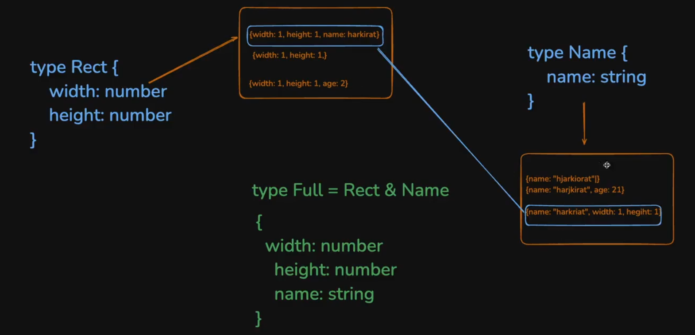

as `type` in `ts` are set of values and are **OPEN** so you can see that the type `Rect` (assume it has its own universe(__jo v orange color ke box me h that is universe in the above pic__) although reality me yhi hota h) jahan par **Not only those object are present jisme SIRF `height` and `width` h** (as in the above picture, you can see that {`width : 1, height : 1`} present in `Rect` Universe) __but it can also have some other members which have other things also despite having `height` and `width` (`height` and `width` to hoga he uske alawa v kuch exist kr skta h in `Rect` universe)__
(see the pic, {`height : 1`, `width : 1, age : 24` and `height : 1`, `width : 1, name : harkirat` })
and **Same is the case for `Name` also** so if you will combine both the Universe (set of values to be precise), you will come to know that **Intersection (means dono me COMMON) to ek he type ka object aayega that will have `height`, `width` and `name` and HENCE INTERSECTION me sare type ki key aani chahiye**

And similar is the case for **`UNION`** -> ya to `width` and `height` **hona he chahiye** ya `name` **hona he chahiye** (**extra aa jaye chlega**) ya to **teeno h**

In short, **`Union` will be everything present in `Rect` universe and `Name` universe (as `UNION` ka yhi to mtlb hota h)**

Now you can relate **why they are called as `UNION` and `Intersection`**

But to **Summarise whole thing ->**

> :pushpin: **`Intersection (&)` Requires all properties from allcombined types and can have additional properties as well.**
> :pushpin:**`Union (|)` Requires only properties from one of the types and can also have additional properties.**

you can also use like `union` and `intersection` like this 

```javascript
interface Point2D{
    x : number,
    y : number
}

interface Name{
    name : string
}

// You can write like this 
type NamedPoint = Point2D | Name
type NamedPoint = Point2D & Name
```

One more thing to keep in mind is that __`interface` can `extend` another `interface` (Just as you do in `java`)__

```javascript
interface User {
    name : string
}
 
interface Admin extends User { // isse name property v aa jayega Admin me 
    age : number
}
```

also you can have mix of both `type` and `interface`

```javascript
type A = {
    name : "harkirat"
}

type B ={
    age : number
}
type X = A & B
// the below code is same as writing (means using interface you CAN do intersection of BUT IT INVOLVES type) above one -> type X = A & B
interface X extends A, B{}

let user : X = {
    name : "harkirat",
    age : 21
}
```

**To summarise ->**
----------


+ **Union ->** <span style="color:orange">**`types` allow `unions`, while `interfaces` do not**</span> 
+ **Intersection ->** <span style="color:orange">**`types` allow intersections via `&`, but `interfaces` can achieve similar results with `extends`**</span>

## **Import and Export in `ts`**
----------


-> It occurs just the same way as that it happens in `js`, but remember that **`ts` use ES6 module system so `import` and `export` keyword are only available here**

**Two ways to do this ->**

### **Constant exports (Bari-Bari se kro)**
----------

```javascript
export function add (x : number, y : number){
    return x + y
}
export function subtract (x : number, y : number){
    return x - y
}

// If you write like above then bari - bari se import - export krna pdega 
import {add} from './math'

add(1, 3)
```

### **Default Exports**
----------

lets say the below file name is `cal.js`

```javascript
export default class Calculator{
    add(x : number, y : number) : number{
        return x + y
    }
}

export function add (x : number, y : number){
    return x + y
}

export default Cal
```

```javascript
// then you import like this 
import Cal from './cal'
```

# **Advance Typescript**
----------


Before you go through this module, make sure you've gone through basic typescript *sses.
You understand interfaces, types and how typescript is used in a simple Node.js
application

If you understand the following code, you're good to go!

```javascript
interface User {
    name: string;
    age: nunber;
}
function sumOfAge(user1: User, user2 : User){
    return a.age + b.age;
}

// Example usage 
const result = sumOfAge({
    name : "harkirat",
    age : 20
},{
    name : "raman",
    age : 21
})

console.log(result)   // Output: 41
```

## **Pick**
----------


Pick allows you to __create a new type by selecting a set of properties ( Keys ) from an existing type ( Type ) as well as Interface ( interface ).__

Imagine you have a user model with several properties, but for a user profile display, __you only need a subset of these properties.__

or lets take some practical scenario -> there is an interface `User` which consists of these things and now you want to make **a function which will be used to update the user info. by having constraints which are as follows ->**
+ you can change only `name`, `age`, and `password`

```javascript
interface User{
    id : string,
    name : string,
    age : number,
    email : string,
    password : string   
}
 
// 1st approach  -> You can do like this its perfectly fine BUT the problem with this way is that as soon as your interface will get bigger, your arguments will also start to increase and

// WE SHOULD NOT HAVE A FUNCTION WITH MORE THAN 5 ARGUMENTS (generally although not a hard and fast rule)
function updateUser(name : string, age : number, password : string){
    // hit the database to update the user or write the logic as you have the three arguments as input

}

// 2nd Approach -> making a seperate interface 
interface UpdateProps{
    name : string, 
    age : number,
    password : string
}

function updateUser(updateProps : updateProps){
    // hit the database to update the user or write the logic as you have the three arguments as input

}

// The above is also correct BUT can you see the problem -> CODE REPEATITION is happening here
// also what if you have to change the 'password' from 'string' to 'number' then you have to change it at all the places where you have declared it 'string' (ex -> here change in 'User' as well as 'UpdateProps' and then even if it being used in logic like a string, then also you have to make change there)
```

**// 3rd Approach (Best)->**

so the other way which is there is to use `pick` (means you are **picking something interface**)

let see how to use it  

```javascript
interface User {
    id : string,
    name : string,
    age : string,
    email : string,
    password : string
}

// creating the pick and then using it 
type UpdateProps = Pick<User, 'name' | 'age' | 'password'>

// Pick takes 2 arguments ->
1. KISKA SUBSET BAN JAU (ex -> here User ka subset banna h to 1st argument me whi dala)
2. KYA VALUES LENA SET ME SE TO BECOME SUBSET (ex -> as the changing fields were 'name', 'age' and 'password' hence passed in here)

// using it will give me 
function updateUser(updateProps : UpdateProps){
    // hit the database to update the user or write the logic as you have the three arguments as input

} 
```

Similar to the above we have 2nd example also :-

```javascript
interface User {
    id: nunber;
    name: string;
    email: string;
    createdAt: Date;
}
// For a profile display, only pick 'name' and 'email'
type UserProfile = Pick<User, 'name' | 'email'>;

const displayUserProfile = (user: UserProfile) => {
    console. log('Name: ${user.name}, Email: ${user.email}`);
}
```
## **Partial (denoted by `?`)**
----------


`Partial` makes __all properties of a type optional__, __creating a type with the same properties, but each marked as optional.(means DE V SKTE HO NHI V)__

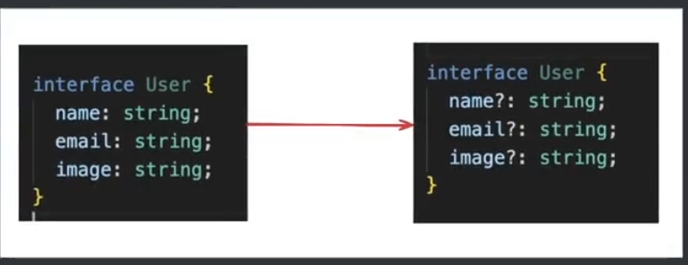

The above picture shows how we have made the options (`name`, `image` and `email`) **Optional by just using the `?` symbol**

**A real world usecase is take the example used above ->**

```javascript
interface User {
    id : string,
    name : string,
    age : number,
    email : string,
    password : string
}
// In the real world, a user might want to change only age, or only name and password or any other combination but in this case it MUST have to give all the three values in order to perform 
type UpdateProps = Pick<User, 'name' | 'age' | 'password'>

function updateUser(updateProps : UpdateProps){
    // hit the database to update the user or write the logic as you have the three arguments as input

} 

// 1ST WAY to do this -> again by either by making a seperate interface 
interface UpdatePropsPartial {
    name ?: string,
    age ?: number,
    password ?: string
}
// and then using it BUT the problem with this approach is -> SAME CODE REPEATITION
function updateUser(updateProps : UpdatePropsPartial){
    // hit the database to update the user or write the logic as you have the three arguments as input

}

// 2ND WAY to do this -> using PARTIAL

// creating PARTIAL 
// First making the PICK and picking the field which are optional 
// Then using the PARTIAL to make them really optional 

type UpdateProps = Pick<User, 'name' | 'age' | 'password'>
type UpdatePropsPartial = Partial<UpdateProps>

function updateUser(updateProps : UpdatePropsPartial){
    // hit the database to update the user or write the logic as you have the three arguments as input

}

// calling them like this will not give ERROR
updateUser({
    name : "satyam"
})
```

## **Readonly**
----------


If you ever encountered the below problem then this thing will hit you 

If you ever had written this code then you must be observing these things for sure

```javascript
const user = {
    name: "harkirat" ,
    age: 21
}
   
user. name = "asdasd";
console.log(user.name); // although you have made the user 'const' then also you are able to change ti in ts the same thing occurs for ARRAY also 

const a = [1, 2, 3]  // athough declared a const array 'a' then also you are able to update the array 
a[0] = 4

// THE REASON FOR IT -> you are not changing the 'a', you are changing the values inside 'a'
// simply saying you are not trying to do this 
a = [2, 2, 34] // this will give ERROR 

// THE ABOVE THING APPLIES TO OBJECT AND ARRAYS only  remember this
// if you do 
const userName = "harkirat"
userName = "satyam" // this will give ERROR 
```

Now what if i want to **enforce that you cannot change the values of OBJECT and ARRAYs also** -> in this case, `readonly` comes into the picture 

```javascript
// let see how to use it 
type User = {
    readonly name : string, // PREPEND(append before the word) 'readonly' keyword, whose value you dont want to change even internally also in OBJECT and ARRAYS 
    age : number
}

const user : User = {
    name : "harkirat",
    age : 24
}

user.name = "satyam" // will give ERROR as 'name' has been made readonly
user.age = 26 // this will NOT give ERROR as 'age' has not 'readonly' written before it 

// There is also a Second way to do this -> WHAT IF YOU WANT TO MAKE ALL THE KEY PRESENT INSIDE AN OBJECT readonly, then will you write 'readonly' before to EVERY KEY, i mean this is correct but the BETTER way it do somthing like this 

type User = {
    readonly name : string,
    age : number
}

const user : Readonly<User> = { // make ENTIRE 'User' object readonly
    // Notice here 'R' is capital in readonly so make sure to keep this in mind upar me Small use hua tha 
    // to remember -> as you are using over whole object (BDA kaam kr rhe to 'R' capital and key to chota kaam h to 'r' in readonly Small )
    name : "harkirat",
    age : 24
} 

user.age = 36 // will give ERROR
```

**Usecase -> if you are using chatGpt or other site, you will make sure that the developer or user DOESN't UPDATE or CHANGE the API key now by mistake also this cannot be changed**
```javascript
interface Config {
    readonly endpoint: string;
    readonly apiKey: string;
}
const config: Readonly<Config> {
    endpoint: 'https://api.example.com',
    apiKey: 'abcdef123456',
}
// config.apiKey = 'newkey';

// Error:Cannot assign to 'apiKey' because it is a readonly 
```
## **`Record` and `Map`**
----------


### **about `Record`**
----------


**These are just the cleaner way to write the objects**

```javascript
const users = {
    "ras@qdl" : {
        id: 'ras@qdl',
        username: 'harkirat'
    }

    "ras1dr@" : {
        id: 'ras1dr@',
        username: 'raman'
    }
}

// How will you make the 'type' of the above thing 
// First see what is the type overall -> overall it is of type -> object with key as string and value as ANOTHER object which consists of some more keys with their VALUES

// first making the skeleton or 'type' of inner object present

type User = {
    id : string,
    username : string
}

// and then making the 'type' for whole single User 

type Users = {
    [key : string] : User 
}

// this is what the above object looks like 
// you can also directly write this 

type User =  {
    [key : string] : {
        id : string,
        username : string
    } 
}

// Now you have very nice type for the users 

const users : Users = {
    "ras@qdl" : {
        id: 'ras@qdl',
        username: 'harkirat'
    }

    "ras1dr@" : {
        id: 'ras1dr@',
        username: 'raman'
    }
}

// BUT that dont looks cleaner which ultimately leads to creating of two things ->
// One is Javascript specific concepts -> MAPS
// another is Typescript specific concepts -> RECORDS
```

using `Record` in the above example -> again ye pure `type` pe lg rha h to (**first letter of the word is capital**)

```javascript
type User = { // 2
    id : string,
    username : string
}
// Record takes two arguments -> key ka type kya h and value ka type kya h ??

type Users = Record<string, User> // this looks much cleaner

type Users = Record<string, {id : string, username : string}> // writing like this will make you get rid of even // 2 code 

// Now just use it to define the type of any variable
const users : Users = {
    "ras@qdl" : {
        id: 'ras@qdl',
        username: 'harkirat'
    }

    "ras1dr@" : {
        id: 'ras1dr@',
        username: 'raman'
    }
}
```
another example is 

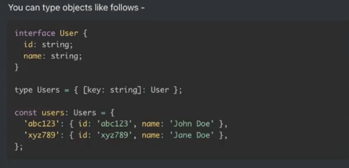 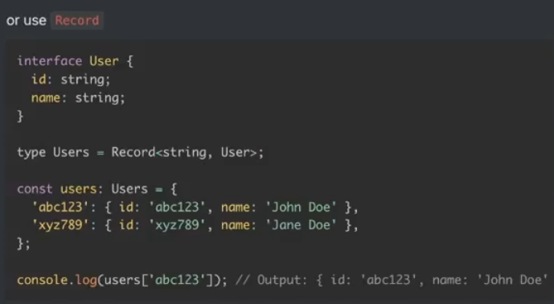

> :pushpin: `typescript` understand `Record` not the `javascript` so `js` me code ERROR dega

### **about `Map`**

----------

map gives you an even fancier way to deal with objects. __Very similar to `Maps` in `C++`__

```javascript
type Users = Record<string, {id : string, username : string}>

const users : Users = {
    "ras@qdl" : {
        id: 'ras@qdl',
        username: 'harkirat'
    }

    "ras1dr@" : {
        id: 'ras1dr@',
        username: 'raman'
    }
}

// If you want to update something or get something in the above then 
users["ras1dr@"].username = "satyam"; // This looks ugly writing like this although it works
user["ras1dr@"].username;

// TO AVOID this -> we use MAPS (fancier way)
// instead of making an object, just directly give the value inside the map 

const users = new Map() // made the MAP 

// TO INSERT THE VALUE -> use ".set()" method
users.set("ras@qdl" : {id: 'ras@qdl',username: 'harkirat'})
users.set("ras1dr@" : {id: 'ras1dr@',username: 'raman'})

// AND TO GET OR UPDATE THE VALUE -> use ".get()" method 
const userOne = users.get("ras1dr@")

// YOU CAN ALSO DELETE THE VALUE -> use ".delete()" method 
users.delete("ras1dr@")
```

> :pushpin:`Map` is `Javascript` concept so `typescript` can also use it

```javascript
// WHEN you are intialising the map then you can give the 'type' to the map also 

type User = {
    name : string,
    age : number,
    email : string
}

const users = new Map<string, User>()  // FORCED THE MAP TO INCLUDE the key as string type and value as User type 
// done this to give the ERROR when someone does not provide the whole thing (all key with values)
users.set("ras@qdl" : {id: 'ras@qdl',username: 'harkirat'})
users.set("ras1dr@" : {id: 'ras1dr@',username: 'raman'})
```

Another example is :- 

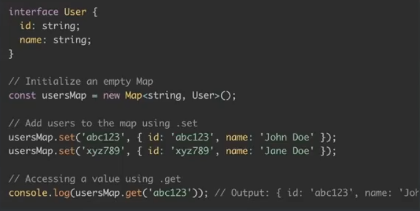

## **`Exclude`**
----------


In a function that can __accept several types of inputs but you want to exclude specific types from being passed to it.__

```javascript
type EventType = 'click' | 'scroll' | 'mousemove';

// If you want to EXCLUDE some literal from the variable the use this 
// USED WHEN YOU have bunch of LITERALs and you want to Exclude some 

type ExcludeEvent = Exclude<EventType,'scroll'> // 'click' | 'mousemove'

const handleEvent = (event: ExcludeEvent) => {
    console.log(`Handling Event : ${event}`)
}

handleEvent('click') // OK
handleEvent('scroll') // Will give ERROR 
```

## **Type inference in zod** (Most important and widely used)
----------


When using zod, we're doing runtime validation.

For example, the following code __makes sure that the user is sending the right inputs to update their profile information__

```javascript
import { z } from 'zod' ;
import express from "express"
const app = express();

// Define the schema for profile update
// user will provide three things -> name, email, age while trying to update their profile 
// BELOW IS ALSO THE WAY HOW YOU GIVE THE CHECK ALONG WITH ERROR MESSAGE IN ZOD
const userProfileSchema = z.object({
    name : z.string().min(1, {message : "Name cannot be empty"}),
    email : z.string().email(1, {message : "Invlid email format"}),
    age : z.number().min(18, {message : "You must be at least 18 years old"}).optional()
})

app.put("/user", (req, res) => {
    const {success} = userProfileSchema.safeParse(req.body) // if body follows the schema for profile update 
    const updateBody = req.body // 2 if it does then you assign to a variable 

    if(!success){ // you early return if not of the correct schema 
        res.status(411).json({})
    }
    // update database here 
    res.json({
        message : "User updated"
    })
})

app.listen(3000)

// Now problem here is if you see the type of updateBody it is 'any' you should make some more check instead of 'any' it should be of this thing 

// at // 2 code write like this 
const updateBody : { // Now you have EXPLICITLY given the type of updateBody
    name : string,
    email : string,
    age ?: number 
} = req.body 

// making it more readable by making a seperate type for it
type FinalUserSchema = {
    name : string,
    email : string,
    age ?: number // as age section is optional in zod
}

// and then using that 
const updateBody : FinalUserSchema = req.body
// But now can you see the CODE REPEATITION happening after writing this, you have written the similar check inside the zod validation(userProfileSchema) also (see above)
```
More details -> [Type inferencing in zod](https://zod.dev/?id=type-inference)

You can extract the Typescript `type` of any schema with `z.infer<typeof mySchema>`

```javascript
import z from 'zod'
const StringZodSchema =  z.string(); // 1

type StringZodType = z.infer<typeof StringZodSchema>; // String  // 2

const u : A = 12 // TypeError
const u : A = "asdf"  // Compiles 
```

**Explanation of `// 1` and `// 2`**

<span style="color:orange">**Remember ->**</span> `// 1` is **Run time**(means ye `javascript` me pahunchta h) and `// 2` is __compile time__(this never reaches `javascript`, `ts` internally he isko execute krta h while compiling)

> :pushpin: `ZOD` lets you **infer a `type` given a runtime variable**

using the above concept and applying it to the above example :-

```javascript
import { z } from 'zod' ;
import express from "express"
const app = express();

const userProfileSchema = z.object({
    name : z.string().min(1, {message : "Name cannot be empty"}),
    email : z.string().email(1, {message : "Invlid email format"}),
    age : z.number().min(18, {message : "You must be at least 18 years old"}).optional()
})

// Instead of again defining the type for zod validation like the below, you can use zod type inferencing 
type FinalUserSchema = {  // 3
    name : string,
    email : string,
    age ?: number 
} 

// using the zod type inferencing (write this line of code instead of // 3)
type FinalUserSchema = z.infer<typeof userProfileSchema>

// Benefit of this is if you change something in zod then it gets automatically highlighted over FinalUserSchema or the variable over which it has been inferred 
// For ex -> if you in userProfileSchema change the type of age from number to string then it will automatically gets reflected in FinalUserSchema

app.put("/user", (req, res) => {
    const {success} = userProfileSchema.safeParse(req.body) 
    const updateBody : FinalUserSchema = req.body 

    if(!success){ 
        res.status(411).json({})
    }
    
    res.json({
        message : "User updated"
    })
})

app.listen(3000)
```


