# **Building real time chat app**

Now if you have understood the previous class then only proceed otherwise dont try to follow along

what we are building today 

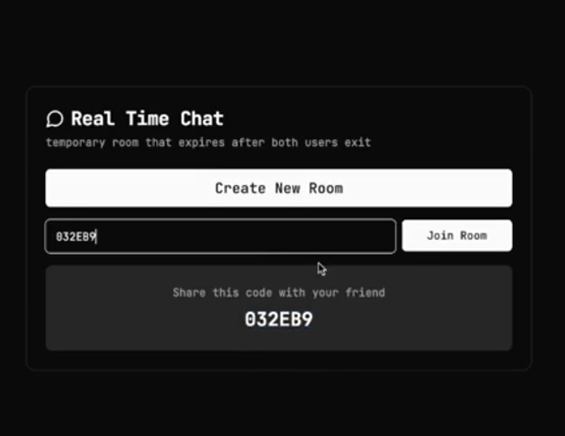 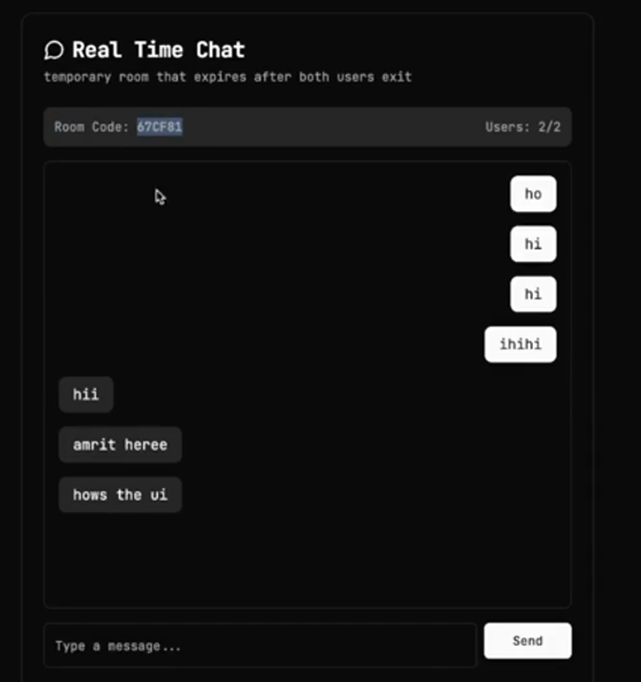 

**Whats new in this project or challenges**

The major challenge which you will face is see the below pic

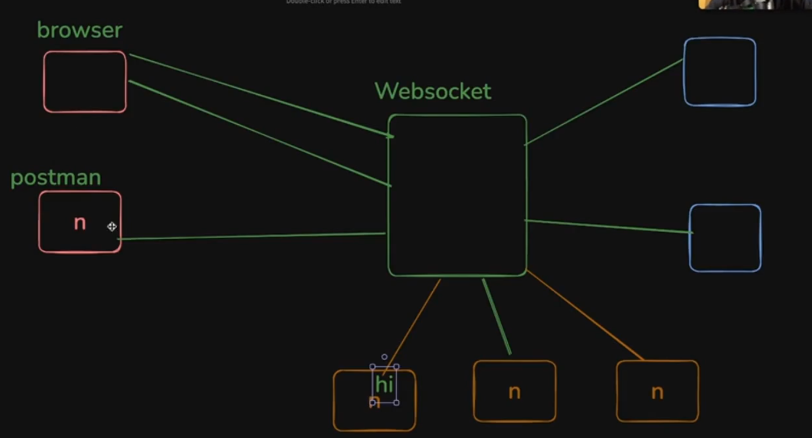

although all the ROOMS (ornage, blue, red box) are connected to the same websocket server still the message present inside one room should not go to other different room but at the same time, it also should have the capability to brodacast among all the members present inside one particular room 

-> message comes from room 1 should go to everyone in room 1 only and so on with other room

If you can do the above task then **advanced version of this assignment ->** create multiple websocket server, and try to distribute the traffic(lets say put some user of room 1 connect to this websocket server and then interact with others among the room 1) among multiple websocket server made (randomly distribute it) and connect all the websocket server to the PUB SUB(read about this how it works)

architecture looks something like this :-

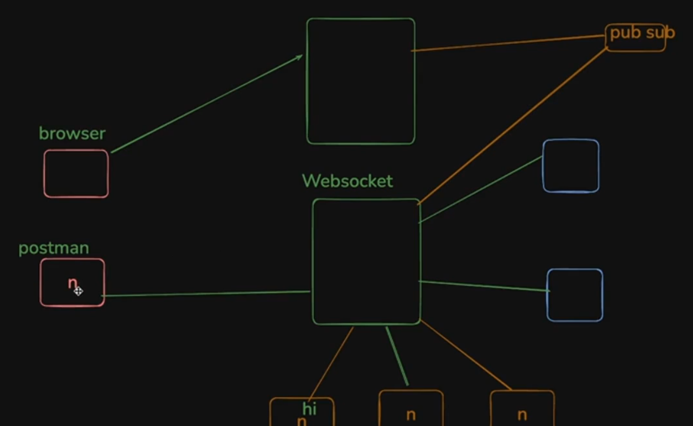

do all the steps present in the previous websocket pdf to initialise an empty project 

inside the `index.ts`

```javascript
import {WebSocketServer} from "ws"

const wss = new WebSocketServer({port : 8080}) // initialised a new WebSocketServer

// what will you do when a new connection will establish

wss.on("connection", (socket) => { // 2

})
```

**Explanation of `// 2` code**

:bulb:**What is `socket` ??**

-> **Its an OBJECT that lets you connect to the person or simply saying TALK to the person jo connect hua h**
+ **You can start recieving message from the person connected on this `socket`**
+ **You can start sending message to the person connected through this `socket`**

-> very similar to `req` and `res` OBJECT inside the EXPRESS 

>:pushpin:<span style="color:orange">**whenever someone will connect the callback function present inside it will Run and A NEW SOCKET will be created (similar to what happens for `req`, `res` in express)**</span>

Now coming back on the project -> lets slowly try to build the task 

-> first lets try to build something like how many users have connected to a particular `websocket` 

```javascript
import {WebSocketServer} from "ws"

const wss = new WebSocketServer({port : 8080})

let userCount = 0

wss.on("connection", (socket) => {
    userCount++ // whenever someone new will connect userCount will increase by 1
    console.log("user connected #" + userCount)

})
```
:bulb:**How will you start the `websocket` server??**

-> if it was `express` then using `app.listen()` you used to achieve it but for `websocket` case just do the below operation 

1. go to `package.json`
2. and inside the `"scripts"` write the below line 

```javascript
"scripts" : {
    "dev" : "tsc -b && node ./dist/index.ts" // tsc -b will build the ts file made and node ./dist/index.ts will run the code
}
```
3. now just run the command `npm run dev` inside the terminal and you are good to go 

Now send the connection request to the server via `Postman` and you will see the result something like this

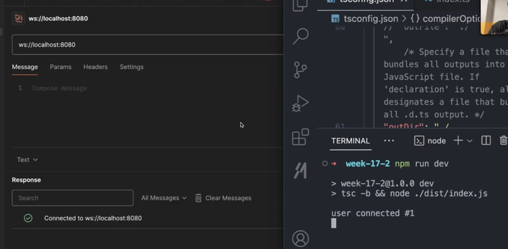

code is working fine

Now lets move towards slight tough things to build 

:bulb:**What i want ??**

-> i want these things to be handled 

1. **websocket server** pr koi message lene wala function hona chahiye as we to BROADCAST the message, message phle lena jaruri h  and then 
2. **How to broadcase the message recieved ??**

first handling the `1.` case 

```javascript
import {WebSocketServer} from "ws"

const wss = new WebSocketServer({port : 8080})

let userCount = 0

wss.on("connection", (socket) => {
    userCount++
    console.log("user connected #" + userCount)

    // making a handler for the user connected and taking and then printing the message on console sent by him/her 
    // When ever new message will come the control will reach here and that message will get logged on 
    // upar ke do line hmesa chlenge jb v koi naya user connect krega BUT 
    // neech .on() tbhi chlega jb koi user message krega 
    socket.on("message", (msg) => {
        console.log("message recieved" + msg.toString());  
    })
    // Thats how server recieve the message 
})
```

the above code output

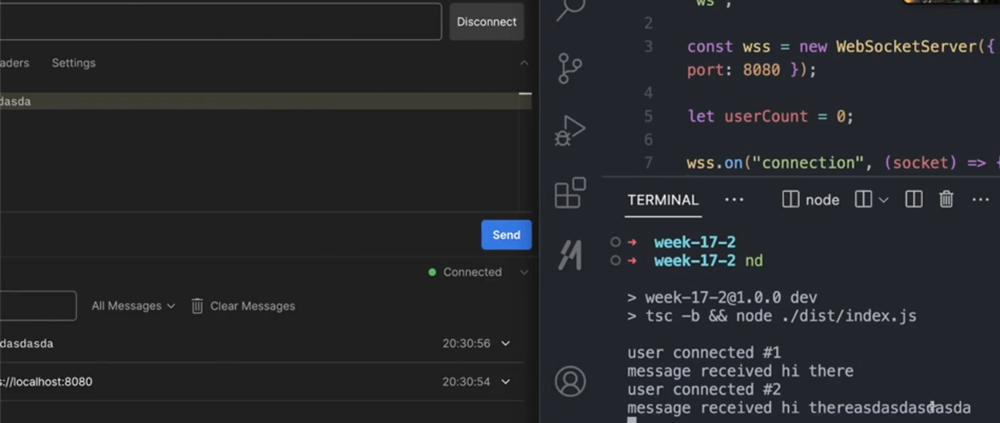

Notice random text recieved here as we have send this text only and it is getting logged on the console

**so server is able to CATCH the message jo usko aage bhejna h**

Now comes **Step 2 ->** message jo `websocket` server ne accept kiya usko aage kaise bheje to an existing client or simply saying how to send back some message to the user who sent some message to the server ??

to do this we use `socket.send()`

```javascript
import {WebSocketServer} from "ws"

const wss = new WebSocketServer({port : 8080})

let userCount = 0

wss.on("connection", (socket) => {
    userCount++
    console.log("user connected #" + userCount)

    socket.on("message", (msg) => {
        console.log("message recieved" + msg.toString()); 
        // wrote inside the .on message as msg variable (jiske andar msg aayega) isi function  ke andar defined h hence agar bahar .send() likhoge to msg variable ko kaise access kroge
        // the below line of code is just sending back the message it recieved 
        socket.send(msg.toString() + ":sent from the server") 
    })   
})
```

output ->

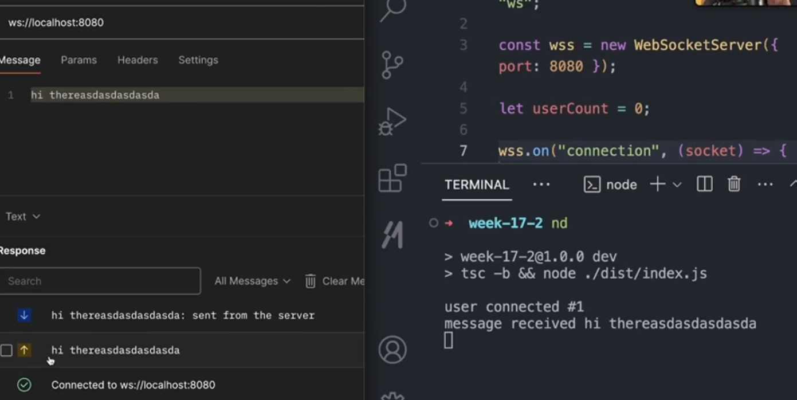

Notice the arrow up (which means user has sent this) and arrow down (which means server ne kya respond kiya)

**You have made a bidirectional communication(user can send the msg to server and vice versa)**

Now you can play around it making more fancier 

lets say after user sends the msg then after 1 second, the server will respond with same message to the user. how to do this ??

```javascript
import {WebSocketServer} from "ws"

const wss = new WebSocketServer({port : 8080})

let userCount = 0

wss.on("connection", (socket) => {
    userCount++
    console.log("user connected #" + userCount)

    socket.on("message", (msg) => {
        console.log("message recieved" + msg.toString());
        
        // done the above task using the setTimeout function
        setTimeout(() => {
            socket.send(msg.toString() + ":sent from the server")
        }, 1000);
    })   
})
```

**Now the real thing comes ->** How to broadcast the message recieved from any user to any of the user connected through the server ??

solving the above problem ->

```javascript
import {WebSocketServer, WebSocket} from "ws"

const wss = new WebSocketServer({port : 8080})

let userCount = 0
let allSockets : WebSocket[] = [] // made an array to store all the user who connect to the server 
// Type is given as typescript will then start to complain ki iska type do 
// NOTICE and remember the type of array made by us has type WebSocket as ye socket store krne ke kaam aa rha h and socket are of type WebSocket (also dont forget to import it from "ws")

wss.on("connection", (socket) => {

    allSockets.push(socket) // whenever a new connection comes (means new user connected) push it in the array made
    userCount++
    console.log("user connected #" + userCount)

    socket.on("message", (msg) => {
        console.log("message recieved" + msg.toString());

        // As msg jo recieve hua h wo sare user (i.e. socket) jo currently stored inside the allSockets array unko bhejna h so used loop to do this 
        // 1st way -> using forEach loop
        allSockets.forEach((socket) => {
            socket.send(msg.toString() + ":sent from the server")     
        });
        // 2nd way -> using simple for loop 
        for(let i = 0; i < allSockets.size; i++){
            const s = allSockets[i]
            s.send(msg.toString() + ":sent from the server")
        }
        // 3rd way -> using map 
        // BUT MAP USE KRNE SE NAYA ARRAY BAN JATA H AND USKE ANDAR value chli jati h nayi wali(although it will work the same as forEach and simple for loop) so avoid using it here  
        // ABOVE IS THE WAY TO BROADCAST THE MESSAGE TO ALL THE USER CONNECTED TO THE SERVER
    })   
})
```

> :pushpin:<span style="color:orange">**Remember ->**</span> **`WebSocket()` is a function which already exists inside the BROWSER just like the `fetch()`**

>:round_pushpin: the `websocket` we are using here is not the native one (which is present inside the browser), it is of the library `ws`

output ->

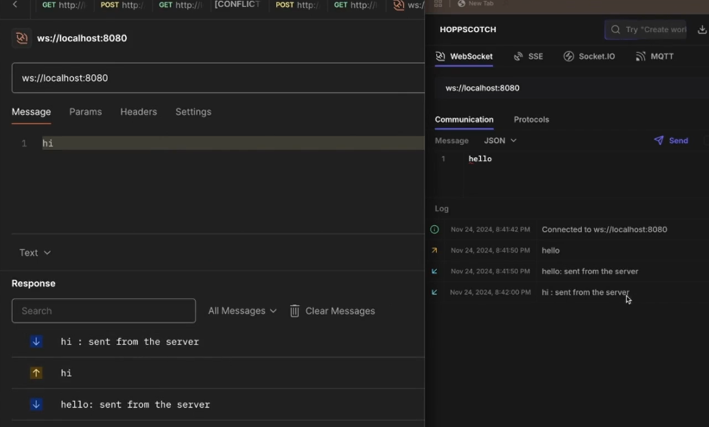

Notice you are sending "hello" and "hi" from two different users (one is `Postman` another is `Hoppscotch`, used to send the connection and message request to the server) BUT the message can be seen to both the user

Now **Here is a bug ->** If you connect to both the user (here `postman` and `hoppscotch` and then disconnect one of them lets say `postman` and  then if you try to send the message through `hoppscotch` (as that is only active). the server tries to send it to both the user `postman` as well as `hoppscotch` BUT why the server is trying to send something on the dead connection. You must have logic for it)

```javascript
import {WebSocketServer, WebSocket} from "ws"

const wss = new WebSocketServer({port : 8080})

let userCount = 0
let allSockets : WebSocket[] = [] 

wss.on("connection", (socket) => {

    allSockets.push(socket) 
    userCount++
    console.log("user connected #" + userCount)

    socket.on("message", (msg) => {
        console.log("message recieved" + msg.toString());
        
        for(let i = 0; i < allSockets.size; i++){ // 2
            const s = allSockets[i]
            s.send(msg.toString() + ":sent from the server")
        }

        // Writing the logic for allowing or sending to those which are currently active on the server, only those which has been actively connected to the connection
        // 1st way -> using .filter() method (filtering out those who are disconnected)
        socket.on("disconnect", () => {
            // you delete from allSockets array 
            allSockets = allSockets.filter(x => x != socket)
        })
        // 2nd method -> using the INBUILT method (readyState and WebSocket.OPEN)
        // if you write the below code then no need to write // 2 code then 
        for (let i = 0; i < allSockets.length; i++) {
            if (allSockets[i].readyState === WebSocket.OPEN) {
                allSockets[i].send(msg.toString() + ":sent from the server");
            }
        }
        // 3rd method -> using forEach loop to do the same thing
        allSockets.forEach((socket) => {
            if (socket.readyState === WebSocket.OPEN) {
                socket.send(msg.toString() + ":sent from the server");
            }
        });

    })   
})
```
Now the server will **not send the message to those users which are disconnected**

So you have made your **Chat app** (more precisely saying `backend` of it)

## **Writing the frontend for the project**
----------

Basically you have to write the user side code or design the code for user (**precisely saying you have to write `client` side code**)

what we were doing using the `Postman` or `Hoppscotch`, now that you have to make it by your own 

If you have seen Harkirat's Metaverse game then you can understand that how websocket works in real life.

some of the key points which can be taken from it is 
+ Every websocket must have schema that should be followed by both client and server (so that client kuch v na bhej de)
    + For ex -> in case of metaverse game, your schema will have two things (or two types of things it can send) -> **Movement** and **Interaction Message(usually sent in `json` and later converted to `string`) due to the below reason**


>:pushpin:<span style="color:orange">**Remember ->**</span> **`Websocket` ke through tm sirf `string` ya `binary` bhej skte ho, although you can change anything almost (like `json`..) to `string` via `.toString()` method**


Lets make the `Websocket` schema for our project

## **Websocket Schema for this project ??**

To design any websocket schema just ask these things :-

+ **What the user can send ??**
+ **What the server can send / recieve??**

> :pushpin:**based on the above response, make a `websocket` schema for every possible thing which client can send and server can recieve or send**

Now we are trying to build the complicated part (ek room ka user usi room ke user ke sath interact kr skta h, Dusre room me bhul ke v nhi jana chahiye)

Now for our project, `client` can send these two things to connect to the `server`
+ **Join a room**
+ **Send a message**

The first thing which you will do is to ask / send to the server **that i want to JOIN a particular room ??**

so lets start making the `websocket` schema (**always make it in `json` format as yahan pr tm data bhejne and recieve krne ka kaam kr rhe ho. Later you can change it to `string` using `.toString()` method whenever you need to use it**)


```json
{
    "type" : "join",
    "payload" : {
        "roomId" : "123",
        "name" : "satyam"
    }
}
```
Generally yhi schema follow kiya jata h from `client` side  (consisting of two keys with values)

+ **`"type"` ->** **Means `user` kya krna chahta h, you write here**
+ **`"payload"` ->** **Means `user` kya - kya bhejega to make sure he / she connects to the server**
    + For ex -> here you are sending `roomId` and `name`, if the room required more things to do then add some more things like -> `image`, `avatar` and etc..

lets keep it simple by just adding the `roomId` for now ->

The below is the `websocket` schema for **joining a room**

```json
{
    "type" : "join",
    "payload" : {
        "roomId" : "123",
    }
}
```

Similarly making `websocket` schema for **sending the message**

```json
{
    "type" : "chat",
    "payload" : {
        "message" : "hi there", // lets suppose user want to send this to the server
    }
}
```

Now coming to the second question 

**What the server will send to the user ??**

+ **Message which the server recieved**

creating `websocket` schema for this 

```json
{
    "type" : "chat",
    "payload": {
        "message" : "hi there", // Not attaching the message sent by the user yet, currently server is sending "hi there" no matter what the message has came from the user
        // you can add these along with other things alos but for sake of simplicity lets just send "message" only
        "sender" : "satyam",
        "senderId" : "12345"
    }
}
```

Remeber this is the most basic project to build the chat app, above one only you can also send **chat count (kitne log h av room me)** and design then `websocket` schema for it and so on....

Now reviewing the `index.ts` file 

```javascript
import {WebSocketServer, WebSocket} from "ws"

const wss = new WebSocketServer({port : 8080})

// let allSockets : WebSocket[] = [] // global array ka point NHI h ab i dont want an array jo sare socket ko support kre, i want something like this 

let allSockets = {// READ about MAPs and RECORDs while dealing with typescript (for the complication part, here used OBJECT instead of them)
    "3425" : [socket1, socket2],
    "122343" : [socket3, socket4, socket6]
} // Eventually ye kuch aisa dikhna chahiye jahan par to every room, user (socket) which is present inside it should be shown and combinely stored inside the array 
// THE ABOVE IS THE OPTIMAL WAY but there exist another way to do the above thing 
// 2nd way to do the above thing

interface User {
    socket : WebSocket,
    room : string
}
let allSockets : User[] = [] // It will still be ARRAY but assigned to custom made array User made above using interface
// The above one will look something like this 
[
    {socket : socket1, room : "3425"},
    {socket : socket2, room : "12343"},
    {socket : socket3, room : "3425"} // socket1 and socket3 are in the same room 
]

// Lets use the 2nd approach (interface making) and proceed 

wss.on("connection", (socket) => {
    
    // allSockets.push(socket)   // Now i dont want ki jaise he connection aaye push kr do turant global array me aise mujhe ye v to puchna h ki kaun se room ko join krna h user ko (we dont want ki wo kahin v chla jaye) so commented this line 

    socket.on("message", (msg) => {
        // console.log("message recieved" + msg.toString());
        
        // for(let i = 0; i < allSockets.size; i++){ // 2
        //     const s = allSockets[i]
        //     s.send(msg.toString() + ":sent from the server")
        // }
        // Can you tell me how "msg" will now look like (it will be string, but look like object (see section // 2 below after this code for clear understanding) as you have defined the schema for sending the message from the user end 
        {object which will have type and payload defined}
        // This makes sure ki banda "join" krna chah rha h ya "chat" krna chah rha h (according to the schema made above), ye server ko pta chle 
        // Websocket dont have CONCEPT of METHODs and ROUTEs as that in EXPRESS (you cant write something like this -> wss.on("/join", somelogic to join)), ek he jagah pe message aayega which is here inside the .on("message") and here i have to check which type it is of 
        // Now as the msg is of string-cum-object so first you will convert this string to object (see // 3) and then you will write your logic
        // using the above concept 

        const parsedMessage = JSON.parse(msg as unknown as string) // convert string to object (as wala bs typescript complain na kre usliye likha h as ts dont know ki ye binary h ya string h so made both)
        // you can also use @ts-ignore as always just above this line to remove the error 
        // if user has followed the schema then user do he kaam kr skta h either join the room or chat in the room 
        if(parsedMessage.type === "join"){ // if the user is trying to join the room then only push 
            allSockets.push({
                socket, // ye user h
                room : parsedMessage.payload.roomId // if user has followed the correct schema then he / she must have sent this, this is the room that the user wants to join 
            })
        }
        // why we are storing -> the answer for this will be given by the below code 
        // now when ever the user wants to chat, you first have to check ki iss bande ka room kaun sa h (so used .find and iterate over all sockets to do that) 
        if(parsedMessage.type === "chat"){
            const currentUserRoom = allSockets.find((x) => x.socket == socket).room 
            // other way of writing the above line 
            let currentUserRoom = null
            for(let i = 0; i < allSockets.length; i++){
                if (allSockets[i].socket == socket){ // agar yahan pr(server pr) ek entry h for this user (current socket) to uska room dhundho phir
                    currentUserRoom = allSockets[i].room // then that user belongs to the room he / she has joined with 

                }
            }
            // after you find the currentUser room, then simply iterate over all the users and jo jo uss room me h usko message bhej do 
            for (let i = 0; i < allSockets.length; i++){
                if(allSockets[i].room == currentUserRoom){ // means agar koi aur h jo isi room me h to un sbko ye message send kr do bas (handled the case where user jis room me message send krna chahta h usi room ke log dekh payenge)
                    allSockets[i].socket.send(parsedMessage.payload.message)

                }
            }
        }

        // Logic for if someone has disconnected
        socket.on("disconnect", () => {
            allSockets = allSockets.filter(x => x != socket)
        })

    })   
})
```

**// 2** -> Example of Object stored inside the String

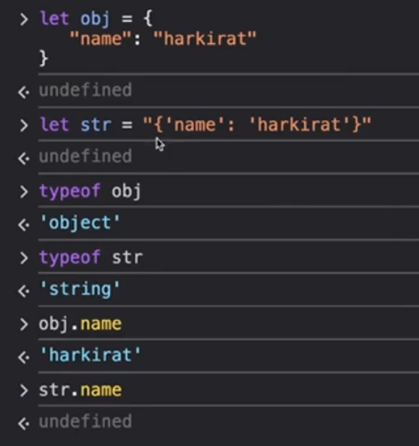

Notice `.` notation NHI kaam kr rha on `string` as it works only on `Object`

**// 3 code** <span style="color:orange">**Remember these important conversions**</span>

**to convert `Object` to `string`** use 

```javascript
JSON.stringfy(object_name)
```

**to convert `string` to `Object`** use

```javascript
JSON.parse(string_name)
```

final code looks something like this :-

```javascript
import {WebSocketServer, WebSocket} from "ws"

const wss = new WebSocketServer({port : 8080})

interface User {
    socket : WebSocket,
    room : string
}

let allSockets : User[] = []

wss.on("connection", (socket) => {

    socket.on("message", (msg) => { 

        const parsedMessage = JSON.parse(msg as unknown as string) 
        if(parsedMessage.type === "join"){ 
            allSockets.push({
                socket, 
                room : parsedMessage.payload.roomId
            })
        }
        if(parsedMessage.type === "chat"){
            // const currentUserRoom = allSockets.find((x) => x.socket == socket).room 
            // other way of writing the above line 
            let currentUserRoom = null
            for(let i = 0; i < allSockets.length; i++){
                if (allSockets[i].socket == socket){ 
                    currentUserRoom = allSockets[i].room 
                }
            }

            for (let i = 0; i < allSockets.length; i++){
                if(allSockets[i].room == currentUserRoom){
                    allSockets[i].socket.send(parsedMessage.payload.message)

                }
            }
        }
        // Logic for if someone has disconnected
        socket.on("disconnect", () => {
            allSockets = allSockets.filter(x => x != socket)
        })

    })   
})
```

output -> 

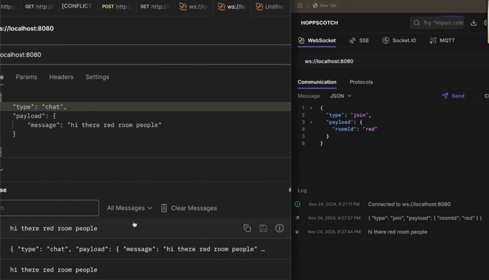

Notice message has been sent from `Postman` (left pic) as `"type" : "chat"` h and recieve ho rha h both is `Postman` as well as in `Hoppscotch` (right pic) as `Hoppscotch` wale ne `"room" : "red"` means jisme `Postman` joined h and message bheja h ("hi there red room people") usi ko join kiya h see the `"type" : "join"` now vice versa can also occur (they can now communicate between them)

if `Hoppscotch` wala user lets say `"room" : "green"` join then wo message nhi dekh paega as you can see below 

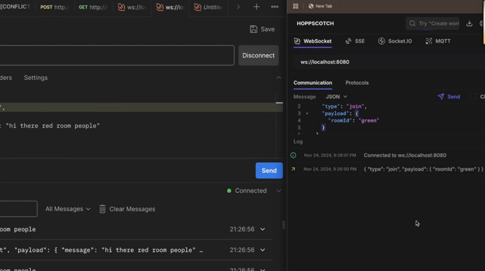

Notice message nhi aaya `Hoppscotch` wale user after connecting as he / she has joined **green room not red**

so you have made a chat app backend 

Now lets come to the **Frontend Building part which will occur using react**

for making the frontend, create a seperate folder named `frontend` (or as per your wish) and as you have initialised the empty `react` project using vite

remember to install all the dependencies by running the command 

```javascript
npm install
```

Now go to `App.tsx` and we will be using **Tailwind css** for quickly making the project

so set up the tailwind in your project by reading through the documentation 

```javascript

function App(){
    useEffect(() => {
        const [messages, setMessages] = useState(["hi there"]) // hardcoded hi there ki jb v koi site pe aayega usko hi there dikhega
        const wsRef = useRef(); // 2
        
        ws.onmessage = (event) => {
            const ws = new WebSocket("http://localhost:8080") // jb v App component mount sirf tbhi connect krna baar - baar nhi to websocket server 
            setMessages(m => [...m, event.data])// if "m" is the initial message then final messages will be array with all the previous messages (...m code is doing this) along with the new messages which came (event.data code is doing this part) from the server 
        }
        wsRef.current = ws // jo v aaya by doing the above logic usko wsRef me store kro

        // below is the logic to connect the user to a room 
        // although you could have directly use the below code and directly send the request to the server BUT THIS WILL GIVE ERROR can you guess why ??
        ws.send(JSON.stringfy({
            type : "join",
            payload : {
                roomId : "red"
            }
        }))
        // Because -> SERVER KAHIN DUR H, usko connect to hone do ache se phle turant he kyu send kr rhe ho so either wrap it in TRY-CATCH block or the library gives you built in function .onopen() -> jb connection ban jaye tb iske andar ka function chlega 
        // so the updated part of the above code 
        // ye hardcoded h as isse jo v user aayega wo sb ke sb "red" room me chle jayenge 
        ws.onopen(() => {
            ws.send(JSON.stringfy({
                type : "join",
                payload : {
                    roomId : "red"
                }
            }))
        })
    }, [])
    
    return (
        <div className='h-screen bg-black'>
            <br /><br /><br />
            <div className = 'h-[85vh]'>
                {messages.map(message  => 
                    <div className = 'm-8'>
                        <span className = 'bg-white text-black rounded p-4'>{message}
                        </span>
                    </div>)} //iterating over all the message and making or rendering all the message by making a div 
            <div className='w-full bg-white flex'>
                <input id = "messageBox" className="flex—1 p-4"></input> // 1st way is to give id and 2nd one (better and optimal way is to use useRef), here using 1st one approach 
                // if using 2nd approach then 
                <input ref = {inputRef} className="flex—1 p-4"></input>
                // and then instead of document.getElementById("messageBox") write inputRef.current
                <button onClick = {() => {
                            const msgByUser = document.getElementById("messageBox").value // Input box me jo v value h usko extract kiya
                            wsRef.current.send(JSON.stringfy({ // as you can only send string so jo v object bhejoge (websocket schema ke according he bhejoge waise to) to server usko string me convert krke bhejna
                                type : "chat",
                                payload : {
                                    message : msgByUser,
                                } 
                            })) // as "ws" iss bracket me defined nhi h to error dega if you write ws.send instead of wsRef.current.send (see it you have defined "ws" inside the useEffect so here we will use useRef hook to make its value available here see // 2 line of code above )

                        }

                    }
                    className='bg-purple-6ØØ text—white p-4'>
                    Send message
                </button>
            </div>
        </div>
    )
}
```

<span style="color:orange">**Remember ->**</span> above code will perfectly fine but do-do baar message display hoga due to **<StrictMode></StrictMode> present in `react`**

so just go to the file `main.tsx` and **remove the `<StrictMode></StrictMode>` which is currently wrapping the `<App />` and just keep the `<App />`**

>:pushpin:<span style="color:orange">**Remember ->**</span> **Whenever you have `<StrictMode></StrictMode>` on aapka `useEffect` DO BAAR RUN HOTA H**

-> here isliye 2 connection ban rha(both of them connected to the same server, dono se jb message aata h to 2 baar setMessage ye kr de rha h and hence you see 2 times the same message)

**You can also CLEANUP inside the `useEffect`**

```javascript
useEffect(() => {
        const [messages, setMessages] = useState(["hi there"]) 
        const wsRef = useRef(); 
        
        ws.onmessage = (event) => {
            const ws = new WebSocket("http://localhost:8080") 
            setMessages(m => [...m, event.data])
        }
        wsRef.current = ws 

        ws.send(JSON.stringfy({
            type : "join",
            payload : {
                roomId : "red"
            }
        }))
         
        ws.onopen(() => {
            ws.send(JSON.stringfy({
                type : "join",
                payload : {
                    roomId : "red"
                }
            }))
        })
        // Wrote the cleanup logic to avoid the <StrictMode>
        return () => {
            ws.close() // means pehle purana wala websocket clean kro and then naya wala bnao 
        }
}, [])
```

Output ->

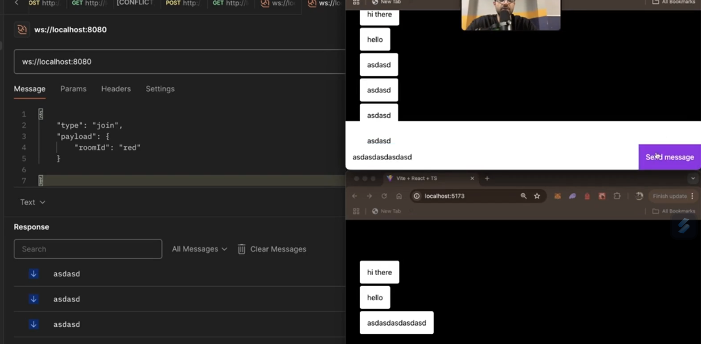

Notice you have 2 different tab on the Browser and one on Postman still all the messages are being seen to all theose who have connected to the same room ("red") and even tab has been given capability to send the message 

**Some important question ??**

:bulb:**How do you send images in the chat room ??**

-> in practical, when you click on the button to upload the image, it goes to the **AWS S3 which has the job to convert the image to url (AS WEBSOCKET ACCEPTS URL as URL is of string format) and from there everyone gets to see the image**

:bulb:**How you usually scale these type of site ??**

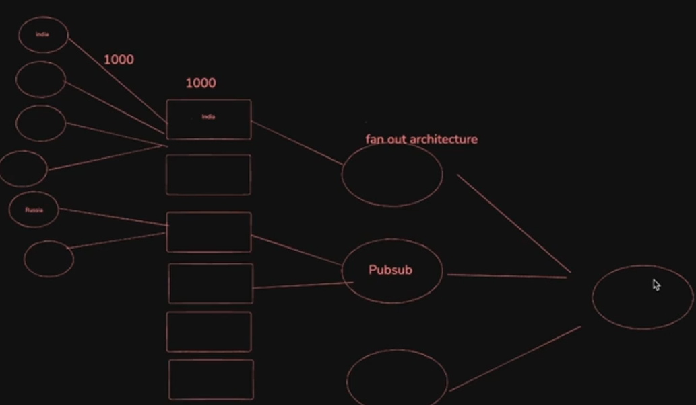

+ **Circle ->** denotes user 
+ **Rectangle ->** denotes server 
+ **Ellipse ->** denotes pub-sub
+ **Biggest Ellipse ->** denotes pub-sub

Now we can actually connect 80k - 90k user using one server and if we have three servers then 

-> approx -> 270k users now 

if 2 pubsub are connecte to these three then servers can work on full potential as if ek server pe load badha then dusre server pe transfer krne ka kaam **pub-sub** krega and **The more deeper it gets the more no. of users you can make them connect**

:bulb:**Why called as Fan out architecture ??**

Because it looks like __PANKHA (hath wala pankha used in our house)__


