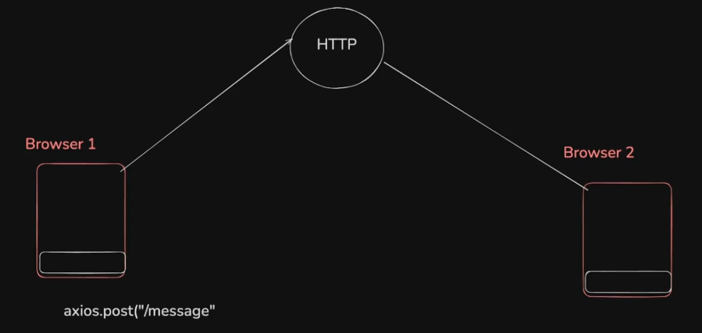
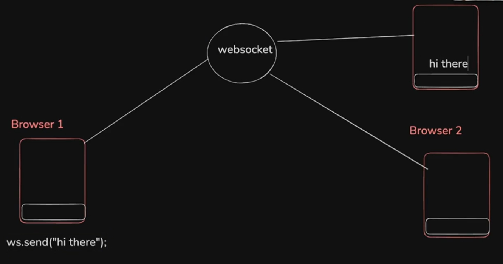
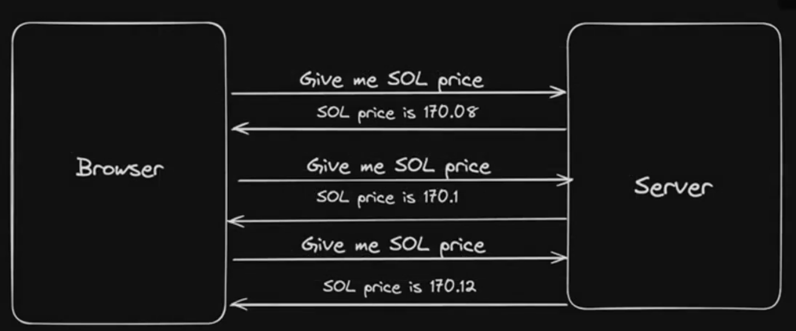
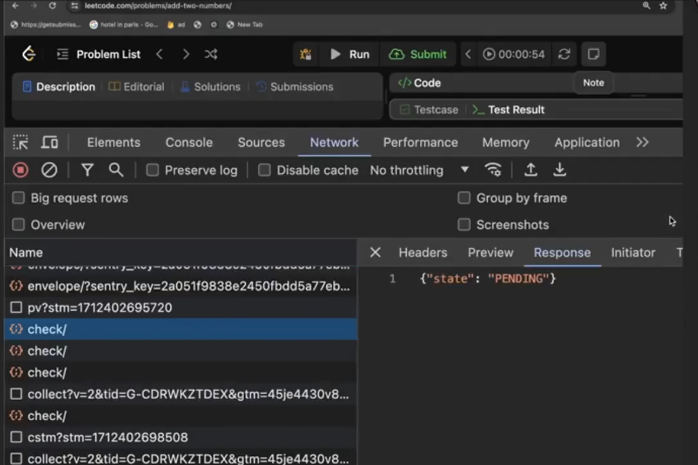
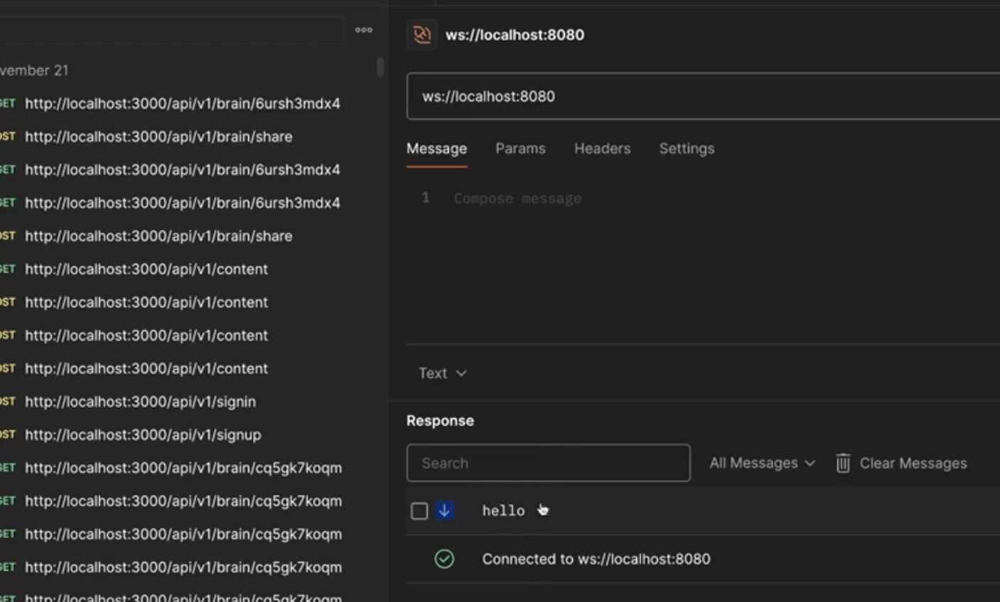
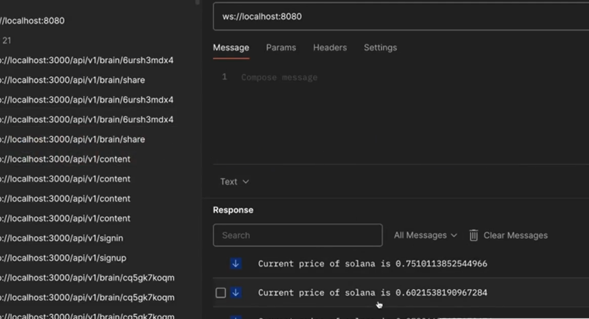
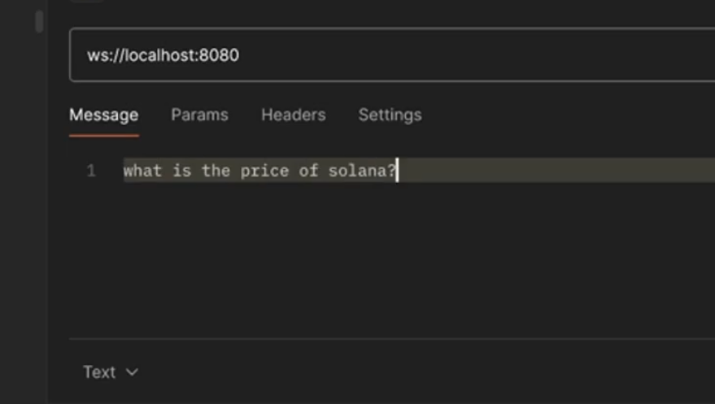
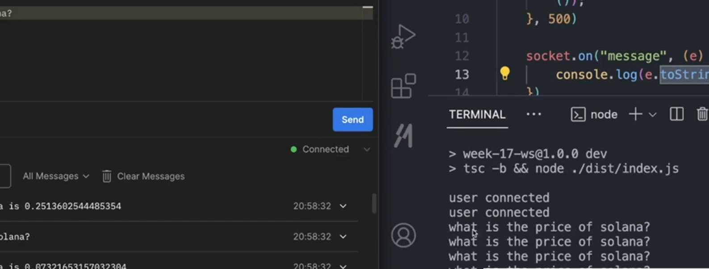
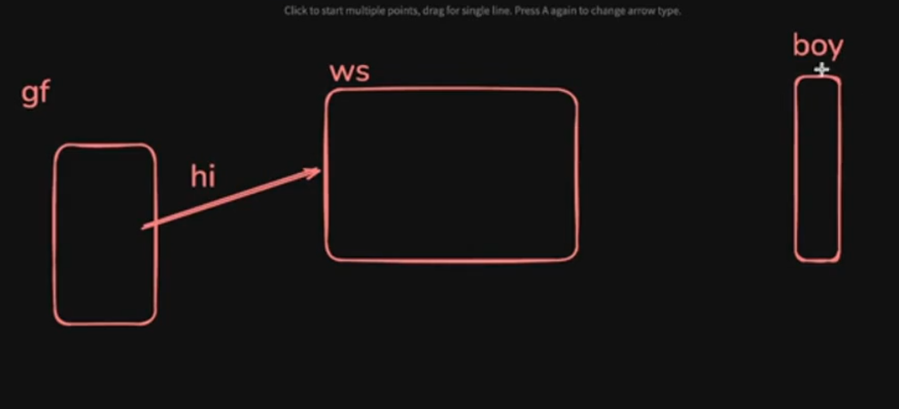
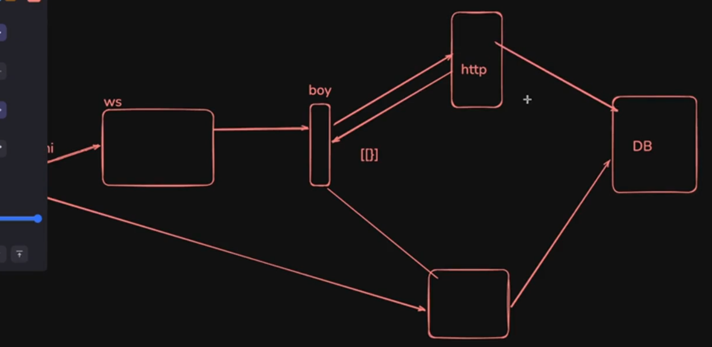

# **Websockets**

Websockets provide a way to establish a persistent, full duplex communication channel over a TCP connection between the client (typically a web browser) and the server

+ **Persistent ->** client (a term for what we know as jis jagah se **request bheji jati h to any server** usko client kehte h Ex-> postman, website, app, etc..) now the **persistent means once the connection has been made, it stays there** (You can keep sending multiple request on the same network from the client and you may or may not get back the `response` but client can send it multiple times)

+ **3 way handshake ->** the above can be said for sending the http request also as that can be sent multiple times so that means http is persistent but the reality is that **NO**, there exists something called as **3 way handshake**
    + Client asks for connection to the server, server then give permission to join and finally the client join(total steps involved = 3, that why called as **3 way handshake**)[But this is very slow] and also when the response is fulfilled, then it **CLOSES not remains as that in persistent connection** 
    + Reason for slow -> Every time you have to send `request` you have to again fulfill the 3 way handshake criteria and that will again take time **because the http protocol is written in this way**

to create persistent connection we use other protocol, **websocket is one of them**

Now in **websocket protocol also, 3 way handshake exists, but now the connection will be PERSISTENT, Unless you explicitly END it or the backend CRASHES**

+ **Full - Duplex communication ->** Server and client both can send multiple messages. [`duplex` -> means **BOTH WAYS**]

+ **TCP communction ->** `TCP` [Transmission control protocol] (`Websocket` and `http` under the hood works on `TCP` protocol and `WebRTC` works under the hood on `UDP` as well as`TCP` protocol)

:bulb:**Why you need `Websocket` ??**

-> to get persistent data across the website. go to the coinbase website, Notice how quickly the data is changing (`RTC` **Real time communication** is occuring here.) Another example can be **Metaverse (where you can see other person location, action live)** Now do you think this is possible with `http` communication protocol (asking every 5ms to give the new data and that too after 3 way handshake is fulfilled (you can do this but it is tedious and if somehow `request` gets failed, then definitely data will get lost and accuracy will be **hindered**))

:bulb:**Where to use `Websocket` ??**

-> **Whenever you have the application where BAHUT SARA DATA EK SATH AANE WALA H AND CONSISTENTLY AANE WALA H and that too at very high frequency, their it very good to use `websocket`**


## **Use case for Websockets**
----------


+ __Real-Time Applications:__ Chat applications, live sports updates, real-time gaming, and any application requiring instant updates can benefit from WebSockets.
+ __Live Feeds:__ Financial tickers, news feeds, and social media updates are examples where WebSockets can be used to push live data to users.
+ __Interactive Services:__ Collaborative editing tools, live customer support chat, and interactive webinars can use WebSockets to enhance user interaction

:bulb:**lets say there is not much traffic then why cant we use the `http` server to respond while using a chat app ??**

-> 

although Browser 1 sent the message via `axios` but the problem is that the how will now the `http` will send the message to Browser 2 (**There is not 2 way communication between them (or full duplex communication)**) [`http` khus se **kuch v nhi bhej skta h, it can just RESPOND**]

Now how `websocket` is different from the above 



Lets say Browser 1 send the message, now this will go to `Websocket` server and then and it will be reflected to all the other Browser as they are interconnected through the `Websocket` server and then the other Browser can also send on the `Websocket` server. also as it **2 way communication so it can go from one browser to `websocket` server and then to other browser also**

:bulb: **Can you do this through `http` ??**

-> You can but as explined above, `http` alone is not capable of doing this but can do it via **LONG POLLING / POLLING**

:bulb:**What is Polling ??**

It simply means that the **Browser will continuously poll (or ask(send `request` to `http` server) that whether some new message has came or not and as the `http` server has the capability to send the message so now it will `respond`)**

+ you can use it in the above case but it has many drawback out of which one is **resource intensive**
+ **Every client is asking the `http` server ki kuch naya aaya kya and son on..**



Leetcode uses **Polling while submitting your code**



## **Websockets in `Node.js`**
----------


There are various libraries that let you create a ws server (similar to how `express` lets you create `http` server.)

some of them are ->

+ [socket.io](https://socket.io/)[famous but it is another custom protocol built over websocket]
+ [Websocket github link](https://github.com/websockets/ws)
+ [Websocket NPM](https://www.npmjs.com/package/websocket)

We'll be using the `ws` library today

**Problems with `socket.io`**

Even tough `socket.io` is great (it gives you constructs like `rooms` to make the API much rooms cleaner), it's harder to support multiple platforms in it (Android, IOS, Rust)

There are implementations in most platforms but not very up to date

https://socket.io/blog/native-socket-io-and-android/

https://github.com/1c3t3a/rust-socketio

> :round_pushpin: if you know how to write the code in `express`, then you can also write in `websocket` as they are similar


## **Ws in Node.js (Code)**

**Step 1 ->** Initialize an empty `node.js` project

```console
npm init -y
```

**Step 2 ->** Install `typescript` to it  

```console
npm install typescript
```
**Step 3 ->** Add `tsconfig` to it 

```console
npx tsc --init
```

**Step 4 ->** make these changes in `tsconfig` file 

```javascript
"rootDir": "./src" and then 
"outDir" : "./dist"
```

**Step 5 ->** create a `src` folder and then inside it make `index.ts` file 

**Step 6 ->** How to run the `ts` code??
+ first go to the `package.json` file 
+ inside `scripts` code write this

```javascript
"scripts" : {
    "dev" : "tsc -b && node ./dist/index.js"
}

// and then you can just do the below inside the terminal to run the code of ts file 

npm run dev 
```

**Step 7 ->** install the websocket library 

```javascript
npm install ws @types/ws
```
:bulb: **What is `@types/ws` ??**

-> already learnt while making the project of typescript 

Now you can code and use the `websocket`

**about `socket.send()`**
----------


```javascript
import {WebSocketServer} from 'ws'

const wss = new WebSocketServer({port : 8080})

wss.on("connection", function (socket) { // 2
    socket.send("hello")  // server will respond with this to the client (whose code is not written yet)
})
```

**You have created a `websocket` server**

**Explanation of `// 2` code**

This code is similar to what we write in `express` and works similar to that only 

in `express` we write something like this 

```javascript
app.get("/users", function(req, res){
    // means jb v /users pe get request aaye to function chla dena 
})

// similarly in websocket server
wss.on("connection", function (socket) { // 2
    // jaise he connection establish ho jae function chla dena
})

// DIFFERENCE -> websocket dont have ROUTES like express, they only have connection 
```
:bulb:**What is `socket` which is passed as `Argument` in the function ??**

-> `socket` simply means the **connection to that person** (`socket` is simply `req, res` in `express`)


Now as the `websocket` server has been made, the only thing which you have to do now is to make a client which can send the connection request to the server

here client which will be used is `Postman`

:bulb:**How to do via `Postman` ??**

### **Connecting via `Postman`**
----------


**Step 1 ->** click on `new` and you will see a bunch of protocol out of which `Websocket` is also present 

**Step 2 ->** Now inside the `url` section write your **url where your websocket server is running**
+ Notice the `url` will now consists of `ws` instead of `http`
    + looks something like this -> "ws://localhost:8080" as port currently for us is 8080 
    + doing so you will see something like this in `Postman`



making it more fancier 

```javascript
import {WebSocketServer} from 'ws'

const wss = new WebSocketServer({port : 8080})

wss.on("connection", function (socket) { 
    setInterval(() => { // every 5ms it will generate a new number and send it to the client 
        socket.send("Current price of solana is " + Math.random())      
    }, 500);
    
})
```

you will see somthing like this 



messages are coming one after the other and so on 

Now we have seen **how the server can send you messages BUT how can the client send the message to the server ??**

you can directly send it from here 



BUT you have to add `messageHandler` that **jab iss socket se msg aaye then show me that**

for that we use `socket.on()`

### **about `socket.on()`**
----------

adding this line of code in the existing file will give me the desired output 

```javascript
import {WebSocketServer} from 'ws'

const wss = new WebSocketServer({port : 8080})

wss.on("connection", function (socket) { 
    setInterval(() => {
        socket.send("Current price of solana is " + Math.random())      
    }, 500);

    socket.on("message", function(e) => { // 2
        console.log(e.toString())
    })
    
})
```

**Explanation of `// 2` code**

as we are sending the message as `client` to the `server`, so we use `socket.on` now when its function **recieves an `event`** 

The code simply says that whenever the `client` is trying to send any message to the `server` side then the inside `functon` will run and provide the desired output 

if you will not do `e.toString()` then you will see the value in **WEIRD form** (to convert it to string we did this)

> :pushpin:<span style="color:orange">**JUST REMEMBER ->**</span> **use operations on `wss` variable(you can name this anything but it should have value = `new WebSocketServer`) WHEN YOU ARE DEALING SOMETHING FROM THE SERVER SIDE and do operation on `socket` variable (you know whose value it should be equal to), WHEN YOU ARE DEALING WITH CLIENT side**



Notice how message "What is the price of solana?" sent from the `client` side is also being shown to the `server` side.

**WebRTC vs Websocket**

If any data which can be missed (you dont care about) that thing can be sent via `webrtc` (ex -> in a metaverse, if my avatar takes some time to move from one place to another or jumps to one place to another(due to data loss), it will not hamper my work more so here we use `webRTC` but in the same metaverse, if there is feature to chat with those who are inside it then there message should not lost or have more delay so **there we will use `Websocket`**)

## **Client side code**

lets try to make `echo` or `ping pong`

`echo` -> you will send any message lets say "hii" and then server also has to respond the same message 

`ping pong` -> you will send message "ping" and the server will respond with "pong"

Assume only 1 browser and 1 server 

### **about `socket.send()`**

first writing the **server side code**

```javascript
import {WebSocketServer, WebSocket} from 'ws'

const wss = new WebSocketServer({port : 8080}) // making a websocket server 

// event handler
// writing the server side code as wss is used here 
wss.on("connection", (socket) => {
    socket.on("message", (e) => {
        if(e.toString() === "ping"){
            socket.send("pong") // this will send the message from server side
        }
    })

})
```

creating the frontend for it using react with typescript

lets try to create a simple chat app which has an input box to write and send message and and output box to recieve message

inside `App.tsx`

```javascript
function App(){
    function sendMessage(){


    }
    return (
        <div>
            <input type = "text" placeholder = "Message.."></input>
            <button onClick = {sendMessage}>Send</button>
        <div>
    )
}
```

Now i want to send the message to the websocket server by pressing `Send` BUT before that you have to first **connect to the `websocket` server first**

:bulb:**How to connect to the `websocket` server ??**

-> There is a better way to do this by making our custom hook called as `useSocket` hook But for now just use the dumb way 

**What we want ? ->** Whenever this `App` component mounts, then we want to **create the persistent websocket connection (I DONT WANT IT TO EVERYTIME  RENDER IT, I WANT JB YE PEHLI BAAR SCREEN PR AAYEGA THEN ONLY)** [<span style="color:orange">**so hope you know which hook to use -> `useEffect` hook**</span>] so using that 

giving it dependency array then the code will only run when the component runs 

```javascript
function App(){
    function sendMessage(){

    }
    useEffect(() => { // now here you have to write the logic to create the connection 
        const ws = new WebSocket("ws://localhost:8080") // 2   
    }, [])
    
    return (
        <div>
            <input type = "text" placeholder = "Message.."></input>
            <button onClick = {sendMessage}>Send</button>
        <div>
    )
}
```

**Explanation of `// 2` code**

The line of code is the **response the below question**

:bulb: **How to connect to the `websocket` connection ??**

-> just as you use 

```javascript
useEffect(() => {
    fetch("http://localhost:3010") // OR 
    axios.post("/users")

}, [])
```
while using `express` **SIMILARLY** 

while using `websocket` you use the below line of code to connect to any `websocket` connection

```javascript
const ws = new WebSocket("websocket_url")
```

Now this gives you **BUNCH OF CALLBACKS**

```javascript
function App(){
    function sendMessage(){

    }
    useEffect(() => {
        const ws = new WebSocket("ws://localhost:8080")
        // now the above gives bunch of callbacks important ones are noted here

        // what you will do if ERROR has occured
        ws.onerror = () => {

        }

        // what you will do if the CONNECTION has CLOSED
        ws.close = () => {

        }

        // What to do if the CONNECTION has OPENED 
        ws.onopen = () => {

        }

        // Now the important one to use here is 
        // What to do if any MESSAGE comes form the server, then ye calback chlega
        ws.onmessage = () => {

        }
    }, [])
    
    return (
        <div>
            <input type = "text" placeholder = "Message.."></input>
            <button onClick = {sendMessage}>Send</button>
        <div>
    )
}
```

Now coding with only the essential code 

final **client side code**

```javascript
import {useEffect, useRef, useState} from 'react'

function App(){
    const [ws, setWs] = useState() // STEP 4 -> used state variable as this is initialized inside the useEffect and somehow i have to pass ws variable to the sendMessage you can have also used useRef to do this
    const inputRef = useRef()

    function sendMessage(){ // STEP 5 -> agar send button pe click hua to ye function call hoga 
        if(!ws){ // if socket does not exist then return 
            return;
        }
        const message = inputRef.current.value // STEP 6 -> extracting the value from the imput box written 
        ws.send(message) // STEP 7 -> and then sending the message came from input box to the server    
    }
    useEffect(() => {
        // STEP 1 -> Creating and connecting the websocket server as ye Mount hote ke sath chlega 
        const ws = new WebSocket("ws://localhost:8080") 
        // STEP 2 -> Now i want ki ye 'ws' variable yani server ko me kuch bhej sku so i have to pass it first as sendMesage me mujhe iska access chahiye so 
        setWs(ws) // STEP 3 -> setWs will set the value of ws

        ws.onmessage = (ev) => {
            alert(ev.data)
        }
    }, [])
    
    return (
        <div>
            <input ref = {inputRef} type = "text" placeholder = "Message.."></input> // as i want to get the content inside this button in the sendMessage() function thats why used useRef to give the reference to the variable
            <button onClick = {sendMessage}>Send</button>
        <div>
    )
}
```
**Good Question**

:bulb: **If someone's girlfriend sends the message while he was busy in some live session class of his course, how do he recieve the message when he come back online and why dont the message gets deleted ??**

-> It similar to the problem that how whatsapp loads all the messages when you turn on the mobile data so answering to this question 

situation seems like the below



Notice the girlfriend is more thick than her boyfriend (🌚)

Now although the gf has sent "hi" to the boy but as the websocket connection is not established, hence immediately to boy ko message recieve nhi hoga means will the data gets lost ??

the answer to this is **NO**

actually this happens -> when the boy will first perform the mobile data turn on, then he will **send a simple `http` backend request that KAUN SE MESSAGE aaye h give me all and after this the `websocket` connection is established and now all the message will be recieved through the connection**

> :pushpin: <span style="color:orange">**Remember ->**</span> **Purani message ke liye you still have to use the `http` server, ONLY FOR REAL TIME COMMUNICATION (we use `websocket`)**

other example can be -> **Slack ->** where data gets stored in the database if there is not `websocket` connection available and eventually it load all the data from the database and resume the `websocket` connection once you gets connected to the internet

This is the summary 




