# **NextJS Intro (Frontend)**

- [**NextJS Intro (Frontend)**](#nextjs-intro-frontend)
  - [**About `Next.js` and why it was developed**](#about-nextjs-and-why-it-was-developed)
    - [**SEO Optimisation**(common interview question)](#seo-optimisationcommon-interview-question)
    - [**Waterfalling problem**](#waterfalling-problem)
  - [**`Next.js` offerings**](#nextjs-offerings)
    - [**Server side rendering**](#server-side-rendering)
  - [**Setting up `Next.js` Project**](#setting-up-nextjs-project)
  - [**Understanding routing in `Next.js`**](#understanding-routing-in-nextjs)
    - [**Preetifying signin page**\[Ready made template for sign in page\]](#preetifying-signin-pageready-made-template-for-sign-in-page)
    - [**Server side rendering in action**](#server-side-rendering-in-action)
  - [**Layouts**](#layouts)


**Pre - requisites**

+ You need to understand basic Frontend before proceeding to this track
+ You need to know what is and how you can create a simple application in it

## **About `Next.js` and why it was developed**
----------
NextJS was a framework that was introduced because of some `minor inconviniencies` in React

1. In a React project, you have to __maintain a separate Backend project for your API routes__(as `React` is NOT a backend framework but you can `Next.js` is BOTH a frontend and backend framework)

2. React does not provide __out of the box routing[remember routing in `React` class] (you have to use react- router-dom)__
3. React is __not SEO (Search Engine Optimisation) Optimised__ (**MOST IMPORTANT**)
    + not exactly true today because of React Server components
    + we'll discuss soon why ??
4. __Waterfalling problem__

:bulb:**What is SEO (Search engine optimisation) ??**

-> Whenever you are making any website, you goal is to **make appear your website on the top of the serach result, and that is what most website strive for** But if you create a raw `HTML` website, then it will be **HIGHLY OPTIMIISED**

**Ranking according to the SEO optimisation :-**

1. **`HTML, CSS, JS` -> Highly SEO optimised**
2. **`Next.Js` -> will be SEO optimised => you can convert it to highly SEO optimised**
3. **`React.js` -> Not SEO optimised**

The above is the reason most of the website have their __Landing page__ in `HTML, CSS, JS` or `Next.js` and their **Internal dashboard** in `React.js`

Lets discuss some of the problems now 

### **SEO Optimisation**(common interview question)
----------

Google/Bing has a bunch of `crawlers` that hit websites and figure out what
the website does.

It __ranks it on `Google` based on the `HTML` it gets back__ (<span style="color:orange">**Very very important point**</span>)

The `crawlers` usually __run your `JS` and render your page to see the final output__

>:pushpin:while Googlebot can run Javascript, `dynamically generated` content is harder for the scraper to index. 

You can see that in any `React` Project, the **VERY FIRST RESPONSE jo jata h that `html` file does not consists of EMPTY DIV and because of this, search engine like `google`, `bing` does not find any relevant keyword in that `html` file(as search engine looks for `html` code file only) which gives their `crawlers` description about what your website does and hence ranks it lower and hence your website does not look up in the first page of browser**


Notice in the above figure, the first `request` that went out, it has **empty DIV as it is `react` project**


Googlebot(or simply saying `crawlers`) has no idea on what the project is. It only sees in the original HTML response.

Ofcourse when the JS file loads eventually, things get rendered but `googlebot` doesn't discover this content very well.

### **Waterfalling problem**
----------

Lets say you built a **blogging website** in `react`, what steps do you think the `req-res` cycle takes ??

The cycle looks like the below :-


**Step 1 ->** going on the website, you asked for its `index.html` file and server gives you (**empty `HTML` and `script` tag(as `script` tag me he `js` ka code h)**)

**Step 2 ->** the `script` tag tells the browser that they need these `js` files get backs these `js` file 

**Step 3 ->** `Js` file **runs**

**Step 4 ->** Now you will fetch certain endpoint primarily (the user dashboard) and then [off course browser will check for `logged in or not`] this will returned by the `server`

**Step 5 ->** and finally go to **blogs** endpoint, which will show users `blogs`

1. Fetching the index.html from the CDN
2. Fetching scriptjs from CDN
3. Checking if user is logged in (if not. redirect them to /login page)
4. Fetching the actual blogs

There are 4 round trips that happen one after the other (sequentially)

Can you see the steps involved in the above and **these steps are NOT even executed PARALLELY, they run SEQUENTIALLY** which will take hell lot of time (**4 sequential `request` and waiting time for `response` is also sequential [ek `req` ka `res` jb tk nhi aayega, tb tk agla `req` nhi jayega]**)

The above is what we call **WATERFALLING PROBLEM**

>:pushpin:**The `waterfalling problem` in React, and more broadly in web development, refers to a scenario where data fetching operations are chained or dependent on each other in a way that leads to inefficient loading behavior.**
>
>> the term got its name from the fact that if you take one section of `waterfall`, then it is dependent on other while falling

>:pushpin:<span style="color:orange">**Just remember this line and you will never forget what waterfalling problem is ->**</span>
>
>>**basically phle `HTML` return hua, then the browser came to know that isme `JS` v h to uska response return hua and then the browser came to know that it also consits of `backend` or code related to `server` fetching also so now this will go to do that part and then finally the website loads up fully(No. of steps = 4)**

BUT, if you have did the same thing as above in `Next.js`, then **In First `request` i would get back the blogs**, something like this ->


## **`Next.js` offerings**
----------


`Next.js` provides you the following `upsides` over React

l. __Server side rendering__ Get's rid of SEO problems
2 API routes - __Single codebase with frontend and backend__
    + By using routes which has the capability of hitting both frontend and backend, you can achieve this
3. __File based routing__ (no need for react-router-dom) [later will come to this part]
4. __Bundle size optimisations, Static site generation__
    + optimises your final bundle (makes it really small), basically the `response` is **VERY OPTIMISED** in `next.js`, **"If you dont need it, you will NOT get it from the server"** ["JITNA CHAHIYE UTNA HE MILEGA"]
5. Maintained by the __Vercel team__

**Downsides ->**

l. __Can't be distributed via a CDN.__(there are some parts of `next.js` which can be delivered via CDN but lets not go there)
2. __always needs a server running that does `server side rendering`__ and hence is _expensive_
3. Very opinionated, very hard to move out of it(`react` to `next.js` -> EASY but `next.js` to `react` -> SLIGHTLY HARD).

### **Server side rendering**
----------


:bulb:**What is server side rendering ??**

currently, `react` is following the below steps to **render on the screen**, Notice the **render is occuring on the `Client` side (i.e. `browsers` side)**


This is what `react` does => **It does CLIENT SIDE RENDERING (CSR)** BUT `Next.js` is different, it does **SERVER SIDE RENDERING (SSR)**

for `Next.js` the same above picture or steps looks like the below ->


explaining the above pic -> the first time `request` comes, it will hit `next.js` server, and `next.js` server will hit the `backend` server (although `next.js` has its own `backend` server capibilites, but lets say there is seperate `backend` server for now), and the server will return you with the blogs and on the `next.js` server only **Rendering will occur and this rendering is DIRECTLY SENT to the browser**. Benefit of it is you achieved **SERVER SIDE RENDERING (as rendering has happened inside the `next.js` server not on the browser)** and due to this you will get an `HTML` file which have most of the important information about what your website does and as `crawlers` see for these `HTML` files only so whenver someone searches for something which matches from your website actions, it(`crawlers`) will show them your website as **the first `response` `crawler` has found has an `HTML` file which consists of most of the things that the user wants**

That why for `Next.js`, rendering happens in the **Server side**

+ **As in the first `response` only, you are getting an `HTML` file which has most of your website functionalities mentioned in it, then definitely this will be `SEO` optimised**

>:pushpin:<span style="color:orange">**Remember**</span> **One VERY BIG DIFFERENCE in `react` and `next.js` is that inside the `react`, finally a BUNDLE(`dist` folder created) is made (which has only three files (HTML, CSS and JS)). Now the BUNDLE which has been created has all the things related to frontend for your project [iske alawa if you delete all the files or folders present, IT WILL HAVE NO EFFECT on the project frontend], Now you just have to push this BUNDLE to any server and you are good to go your website will get loaded**
> >**BUT in `next.js`, this is not what happens**
> > > **there is a server running there and inside that there is some logic (`js` file) which actually runs, HITS the backend server, GETS the data, RENDERS the data and finally RETURNS it to the browser**

**Basically saying -> in `React` you just serve the `HTML, CSS and JS` file in the production and that's why `react` projects are IN-EXPENSIVE(as they can also be scaled via CDN) BUT in `Next.js`, you actually need a server running somewhere (as if any `req` comes, there should be someone listening on the port), it is a DYNAMIC file (as server is constantly listening and making changes in the server side for sending the updated renders on the browsers), NOT like `react` which has STATIC file (`HTML, CSS and JS`)**

## **Setting up `Next.js` Project**
----------

just run the command 
```javascript
npx create-next-app@latest 
```
and then select these options according to your choice (**its upto you**) but below is the **preferred options to choose ->**


Notice `next.js` has itself `router` inside it that is what is referred to as `App router` in the above picture. 

Would you like your code inside a `src/` directory ? -> 

+ if **Yes ->** then there **will be a `src` folder jiske andar source code hoga**
+ if **No ->** then there **won't be any `src` folder, top level folder me sb kuch hoga**

after selecting all the things hit `enter` and it will start to **Bootstrap the PROJECT**

after completion of the process, you can see EMPTY `next.js` project. opening it in `vs code` you will see something like this ->


The red blocks are the main folders you should know about 

+ **`app` ->** contains all your code/ components/ layouts/ routes/ apis[**95% work is done in this folder**]
+ **`tailwind.config.js` ->** Tailwind configuration file
+ **`next.config.mjs` ->** Next js configuration file

Now coming to inside the `app` folder -> 


+ **`page.tsx` ->** most important file (**Entry point of your website [this is what renders over the first page on the website]**)

## **Understanding routing in `Next.js`**
----------

Before understanding how routing is being done in the `Next.js`, lets recall how routing was being done in the `React`

in `React`, you used to do routing like this

```javascript
function App(){
    return (
        <>
            <BrowseRouter>
                <Routes>
                    <Route path = "/signup" element = {<Signup/>} />
                    <Route path = "/signin" element = {<Signin/>} />
                    <Route path = "/blog/:id" element = {<Blog/>} />
                </Routes>
            </BrowseRouter>
        </>
    )

}
```

Now lets understand how **Routing is done in `next.js`** and **why `next.js` offer file based routing**

-> go to the `app > page.tsx` and then remove all the thing and write the below code 

```javascript
export default function Home(){
    return (
        <div>
            hi there 
        </div>
    )
}
```
Now if you go to the `http://localhost:3000` , you can see 


 
"hi there" on the screen (see right side of the above pic)

Now if you go to `http://localhost:3000/users`, (route not defined till now), then it will say `404:This page could not be found`

But if you go inside the `app` folder, make a seperate folder named as `users` and inside that a file named as `page.tsx` and inside that if you write the below code 

```javascript
export default function Home(){
    return (
        <div>
            Users page
        </div>
    )
}
```

and now if you go to `http://localhost:3000/users`, then you will see this :-


Notice on the right side of the above pic, you can clearly see "Users page" being rendered on the screen and that too on the route -> `http://localhost:3000/users`

**So now can you relate WHY `Next.js` HAS FILE BASED ROUTING**, [Just by making the folders, you can do ROUTING]. go to [Next.js offerings](#nextjs-offerings) where we have said we have said that we will learn about **file based routing**. 

>:pushpin:**Jo v routes chahiye unki folder bana do and you are good to go in `next.js`, you have achieved Routing in `next.js`**

:bulb:**Is this good ??**

-> Can be easy for begineer, but from production perspective it is a problem as `next.js` will create so many folders and files to look up that if you want to **debug, manage and find something inside your codebase, it will become EXTREMELY DIFFICULT to do that**

you can also create **subroutes**, means lets say **user** can have many roles such as **admin, user, coadmin etc..**, so inside the `users` routes, i will add another routes called as `admin`, so for this just create another folder inside the `app > users` known as `admin` and then make a new file known as `page.tsx`

something like the below :-


then you can see in the `url` that you have creatd a sub route inside the `users` route and hence **You can DO AS MUCH NESTING OF ROUTES just by making folders**

Summary :-

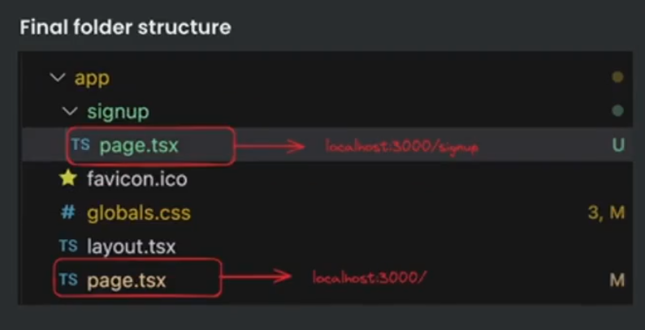 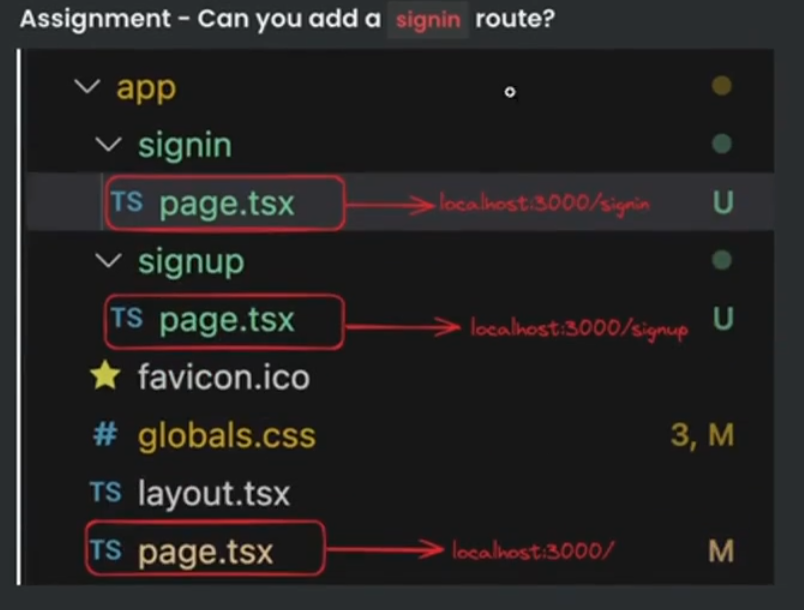

### **Preetifying signin page**[Ready made template for sign in page]

for this first make a folder named as `signin` insdie the `app` folder and then inside that create `page.tsx` inside it which consists of these lines of code

```javascript
export default function Signin() {
  return <div className="h-screen flex justify-center flex-col">
    <div className="flex justify-center">
      <a href="#" className="block max-w-sm p-6 bg-white border border-gray-200 rounded-lg shadow hover:bg-gray-100 ">
        <div>
          <div className="px-10">
            <div className="text-3xl font-extrabold">
              Sign in
            </div>
          </div>
          <div className="pt-2">
            <LabelledInput label="Username" placeholder="harkirat@gmail.com" />
            <LabelledInput label="Password" type="password" placeholder="123456" />
            <button type="button" className="mt-8 w-full text-white bg-gray-800 focus:ring-4 focus:ring-gray-300 font-medium rounded-lg text-sm px-5 py-2.5 me-2 mb-2">Sign in</button>
          </div>
        </div>
      </a>
    </div>
  </div>
}

interface LabelledInputType {
  label: string;
  placeholder: string;
  type?: string;
}

// we have made LabelledInput as GENERIC COMPONENT as it is going to be used many times (see the picture below)
function LabelledInput({ label, placeholder, type }: LabelledInputType) {
  return <div>
    <label className="block mb-2 text-sm text-black font-semibold pt-4">{label}</label>
    <input type={type || "text"} id="first_name" className="bg-gray-50 border border-gray-300 text-gray-900 text-sm rounded-lg focus:ring-blue-500 focus:border-blue-500 block w-full p-2.5" placeholder={placeholder} required />
  </div>
}
```
now if you go to "http://localhost:3000/app/signin", you will see something like this 


`Username` with `Input box` is one LabelledInput `Password` with `Input box` is another LabelledInput. [as ye type ka structure boht jagah use hota h to  ek GENERIC COMPONENT he bna diya] (you can see the code consits of 2 LabelledInput component)

To make the `sign up` page, (if basic one) just copy paste this and change wherever written `Sign in` to `Sign up`

### **Server side rendering in action**

Lets try exploring the response from the server on the `/signup` route by first running the code `npm run dev` and then going to "http://localhost:3000/signup"

Noitce the response you get back in the `HTML` file 

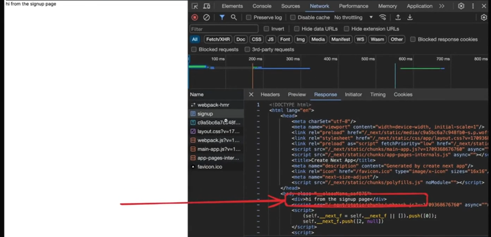

Now if `googlebot` tries to scrape your page, it'll understand that this is a
`Sign up` page without running any Javascript.

The first `index.html` file it get's back will have context about the page since it
was `server side rendered`

>:pushpin:**Isse WATERFALLING PROBLEM v chli gyi**

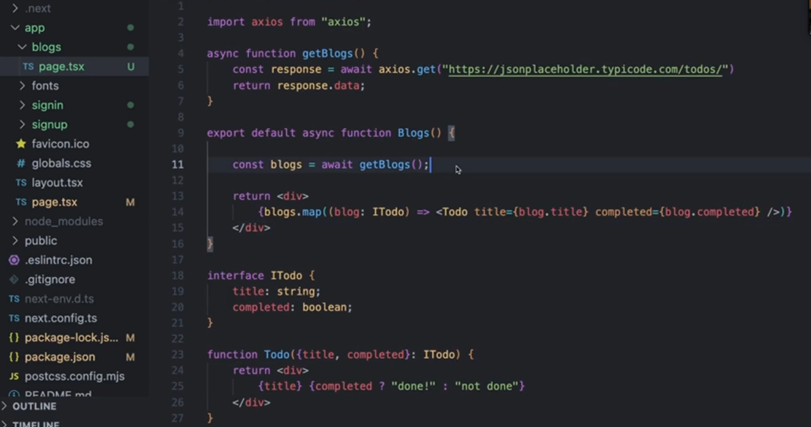

**You can make the component `async` as you have made in the above code `Blogs` as that is also a function only**

In the above code or similar code, aapka page **ban banya aayega server se**

Now if you go to "http://localhost:3000/blogs" and see the result :-

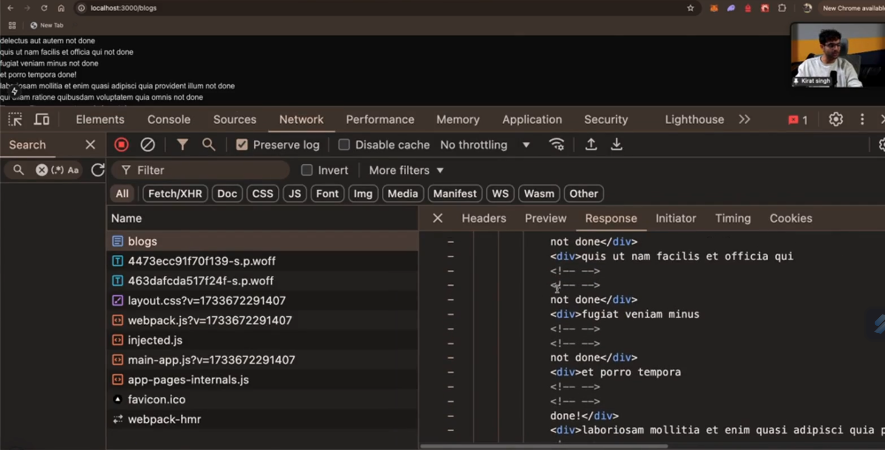

You can see all the todo (coming from API fetch (basically some backend)) with their status that whether they have been done or not and at the same time see in the developer tab, you can clearly see that the **first endpoint `blogs`, you will see all the divs coming and rendering in the VERY FIRST RESPONSE** [NO WATERFALLING problem ki phle frontend response kro, phir backend hit krke data lo, and then finally render kro]

**Backend request are still happening but now through `next.js` server (whether it be database or backend server)**

The same thing if you have used `React`, then the code would have looked like ->

```javascript
import {useState, useEffect} from "react"

async function getBlogs() {
  const [blogs, setBlogs] = useState([])

  useEffect(() => {
    const blogs = axios.get("/blogs")
    setBlogs(blogs)
  }, [])

  return <div>

  </div>

// The above code might seems to be similar to what written in Next.js code above but this will not have SERVER SIDE RENDERING 
// as "useEffect" does not run on SERVER side so this react code will be affected with WATERFALLING PROBLEM as this will run on client 
  
}
```

## **Layouts**

You have noticed there is a file named as `layout.tsx` inside the `app` folder.

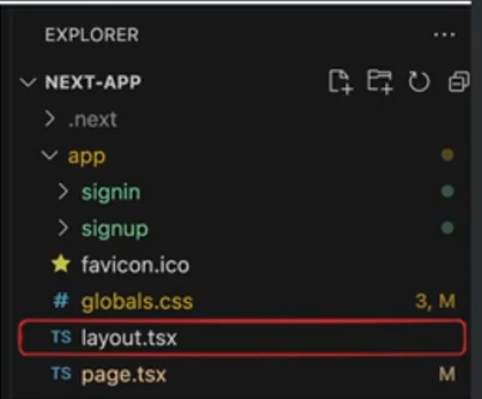

Talking about what it does -> [Layouts official documentation](https://nextjs.org/docs/app/building-your-application/routing/pages-and-layouts)

**Layouts let you `wrap` all child `pages` inside some logic**

>:pushpin:<span style="color:orange">**Remember ->**</span> **The thing which apperas on multiple pages or you want to make them appear on multiple pages (such as navbar(present on every page of the website), footer (mostly present on every page) etc.. ) is written inside the `layout.tsx` file**

>:pushpin:**`layout.tsx` file can be made inside any folder not only in the parent directory as you may want for ex -> footer to be shown on particular page rather than in all**

if you see the `layout.tsx`, you will first see some font related code (ignore them), now comes the `Metadata` part, (this is same as that in `HTML` code, jo v tm likhoge wo jake uska content show kr dega (at the top))

Now comes the complicated part 

```javascript
export default function RootLayout({ // looks like normal component
  children, // gets children as input -> the concept is same as that in REACT 
}: Readonly<{
  children: React.ReactNode;
}>) {
  return (
    <html lang="en"> // Wrapping all the children inside this HTML tag 
      <body className={`${geistSans.variable} ${geistMono.variable} antialiased`}>
        {children}
      </body>
    </html>
  );
}
```

**Explanation of the above code**

`RootLayout` is simply **Wrapping ALL THE CHILDREN which is going to come after this page** 

We know that `navbar` is present on almost all the pages of a website, now lets try to make it in a manner that it is present inside all the pages 

so inside the `layout.tsx`,

```javascript
export default function RootLayout({
  children,
}: Readonly<{
  children: React.ReactNode;
}>) {
  return (
    <html lang="en">
      <body className={`${geistSans.variable} ${geistMono.variable} antialiased`}>
        <div className = "border-b p-4">Quizzio</div> 
        {children} // Ye children (i.e. upcoming pages as well as home page) to render honge he sath sath upar ka navbar component v render kr do sbpe 
      </body>
    </html>
  );
}// Basically you have wrapped all the children inside the body tag and then also added a navbar to show it on every page
```

so  if you consider this file explorer, then :- 

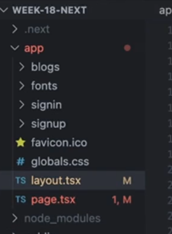

jo v `page.tsx` (main one present inside the `app` folder) to render hoga he sath sath as wo `children` h sath sath `navbar` component v render hoga, similarly, sare route (as they are also `children` unke individual page to render hoge he sath sath `navbar` v render hoga)

Lets see it in action :-

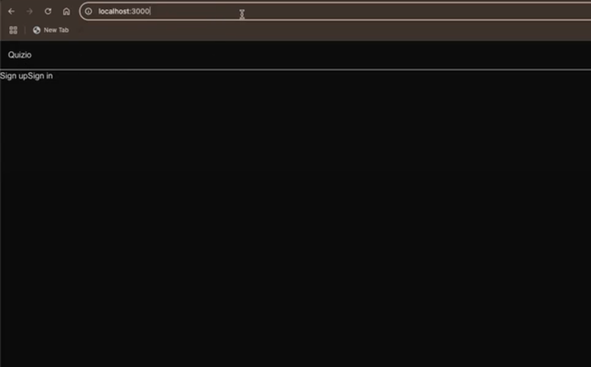 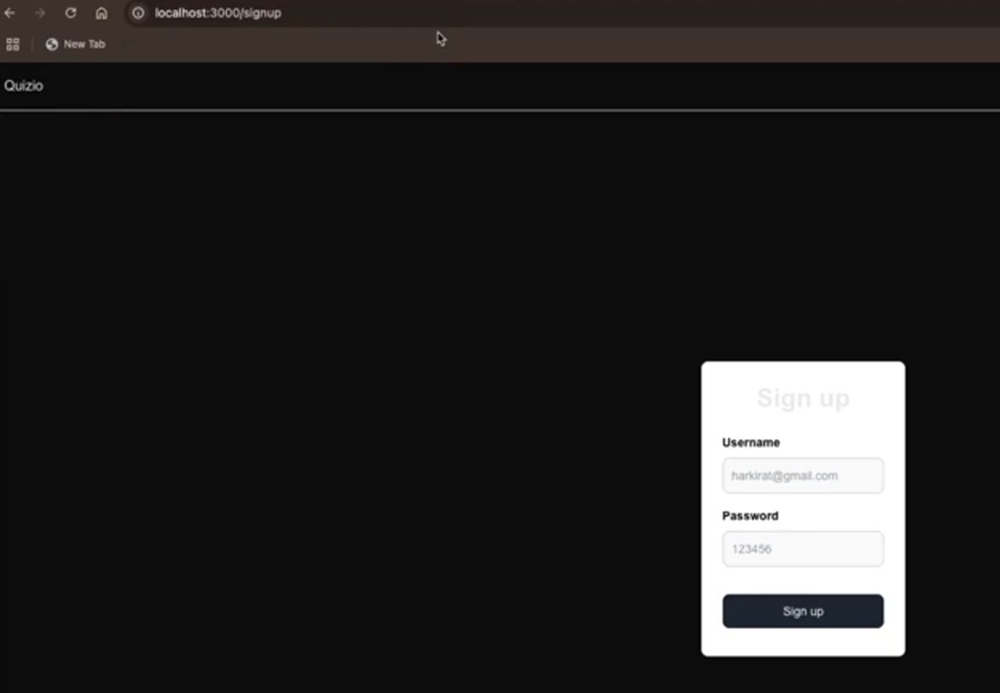

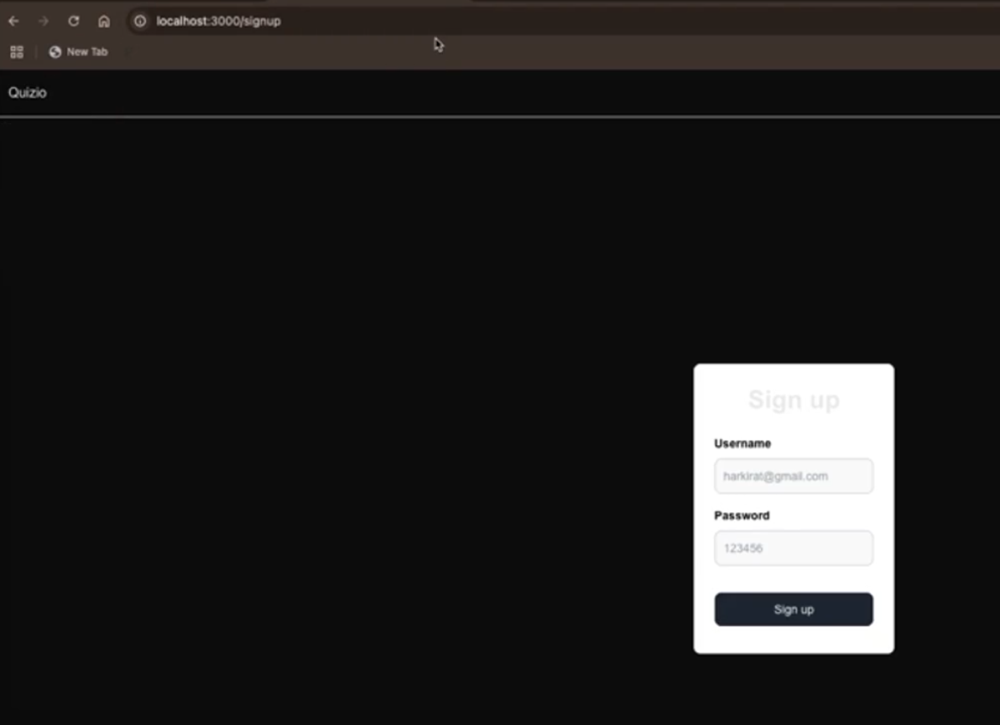  

Notice the **url** in all of the above pic, they are all the routes which you have created, but all of them are having `navbar` made in the `layout.tsx` as you have only said that in the `RootLayout` (as the name suggests, Layout of the main part(root)) along with all the `children` add another component known as `navbar` so that why this is being shown in all the pages of the website.

lets try to understand in another way :- 

lets say you have created another folder inside `app` folder named as `auth` and move the `sign in` and `sign up` folder inside there, now let say i want to make navbar appear on ONLY in `sign in` and `sign up` page (nothing other than this), then how to deal with this problem

**1st way ->** make a `navbar` component seperately by first making a seperate folder for all the component named as `components` and then making another file named as `navbar.tsx` and then write the logic for `navbar` you want to make for example :-

```javascript
export default function Navbar(){
  return (
    <div className = "border-b p-4"> Quizzio </div>
  )
}
```

Now as you want this component to be displayed only on `sign in` and `sign up` page so go to `app > auth > sign in` file path and inside the `sign in`, `page.tsx` import this component :-

```javascript
import {navbar} from "@/components/navbar"

export default function signIn(){

  // some logic
  return (
    // at the top of return statement add the component
    <Navbar />
  )

}
```

similar you will do this same thing for `sign up` -> `page.tsx` file copy this code 

```javascript
import {Navbar} from "@/components/navbar"

export default function signUp(){
  // some logic
  return (
    // At the top render this navbar component
    <Navbar />
  )

}
```

This will work and `navbar` will render only on `signin` and `sign up` page only but __this is `React` way of doing things__

**2nd way ->** using `next.js` and more particularly `layout` concepts 

so the problem with the above thing is that you are adding or importing the component __at all the place wherver it is required__, Now if the website is very big then you might not put it in some place also there are many other components present inside the complex website. so now we will use `layout` concept here to deal with this problem :-

so **Instead of writing or importing the component at multiple places, cant we import at one point (will avoid code repeatition)** and hence just go to the parent folder (or route(called in `next.js`)), here the parent folder is `auth` as it consists of both `sign in` and `sign up` page, and we want to show the `navbar` only in these pages. so make a file `layout.tsx` inside the parent folder (`auth`), **not the child folder**

>:pushpin:<span style="color:orange">**The only thing to know about the concept of `layout` :--->**</span>**The above part simply means that `auth` ke aage jitna v pages h un sb me (ex -> `/auth/signin` or `/auth/signup` etc..) In sbme `layout.tsx` ka code aayege he aayega if any component is made, then wo v sare page pe aayega which exist after `auth`**, if you understand this statement then you have understood the usecase of `layout`

```javascript
import {Navbar} from "@components/navbar"

export default function AuthLayout({children}){
  return (
    <div>
      <Navbar />
      {children} // simply means that along with all the children auth(parent folder or folder inside which layout.tsx consists of this code) have (here -> signin  and signup), render inside all of them Navbar component also 
    </div>
  )
}
```

**Benefit ->** you dont have to seperately import and then render the `Navbar` component inside `signin` and `signup` page, you have just written the logic inside one file and you are good to go. [**It will render on every page that exist in that folder**]

so **if you go inside `signin` folder inside the `page.tsx` code, before all the code which is present inside the `page.tsx` of `signin` page RENDERs first `Navbar` present inside the `layout.tsx` present inside the `auth` folder gets RENDERED and then as {children} is now needs to be rendered so now the `signin` `page.tsx` components will RENDER**

so you have basically given **Layout to all the pages which exist after `auth` that they will have `Navbar` first then their content**

Now if you add a third page(means made a new folder named as `profile`) inside the `auth` folder and then inside the `profile` folder, made a file named as `page.tsx` and then write some logic relatd to profile showing so that will also consits of `Navbar` component as **Every page that exist inside the `auth` folder will be WRAPPED inside the `layout.tsx` me jo component likha h (i.e. `AuthLayout`)**

jo global pe tha `RootLayout` (present inside the `layout.tsx` of `app` folder) wo harek page pe aayega as `app` folder **is the PARENT FOLDER of all the folders** and the above `AuthLayout` is **sublayout**

:large_blue_diamond: **You can also do CONDITIONAL RENDERING inside the `layout.tsx`**

Now if you have understood the above concept, then can you see that to make available a common component to more than 2 pages (or routes),  you have to **put them inside the parent folder and then inside that parent folder create `layout.tsx` to make them available on all the sub routes(or folders) present inside the parent folder**. Now why we are making an **extra folder (route) for this thing**

**To avoid the above problem, we do a small change inside the parent folder name <span style="color:orange">**JUST WRAP THE PARENT FOLDER NAME INSIDE THE SMALL BRACKET**</span>**

somthing like this ->

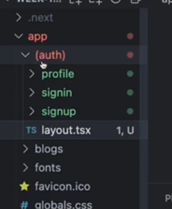

and now `next.js` will ignore the folder (or route) which has name wrapped inside the small bracket and now you can directly go to the route present inside the `auth` folder here without using `/auth/child_route`.

so now instead of going to "http://localhost:3000/auth/signin" go to "http://localhost:3000/signin" (Basically this will Small bracket me jo v folder or route h wo IGNORE ho jayega)

>**layout concept will still remain the same whi parent folder ke sare page or sub folder pe wo apne andar ka component render krwa dega, bas parent route dene ka ab jarurat nhi h**

> :pushpin:<span style="color:orange">**Remember ->**</span> **Whenever you dont want to disturb your folder structure, means force route to exist inside some parent folder, just wrap that route inside the CURLY BRACES and it will be IGNORED by `next.js`**


