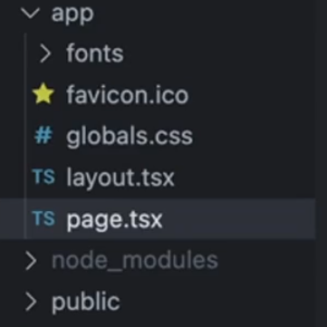

# **NextJS Intro**

**Pre - requisites**

+ You need to understand basic Frontend before proceeding to this track
+ You need to know what is and how you can create a simple application in it

## **About `Next.js` and why it was developed**
----------
NextJS was a framework that was introduced because of some `minor inconviniencies` in React

1. In a React project, you have to __maintain a separate Backend project for your API routes__(as `React` is NOT a backend framework but you can `Next.js` is BOTH a frontend and backend framework)

2. React does not provide __out of the box routing[remember routing in `React` class] (you have to use react- router-dom)__
3. React is __not SEO (Search Engine Optimisation) Optimised__ (**MOST IMPORTANT**)
    + not exactly true today because of React Server components
    + we'll discuss soon why ??
4. __Waterfalling problem__

:bulb:**What is SEO (Search engine optimisation) ??**

-> Whenever you are making any website, you goal is to **make appear your website on the top of the serach result, and that is what most website strive for** But if you create a raw `HTML` website, then it will be **HIGHLY OPTIMIISED**

**Ranking according to the SEO optimisation :-**

1. **`HTML, CSS, JS` -> Highly SEO optimised**
2. **`Next.Js` -> will be SEO optimised => you can convert it to highly SEO optimised**
3. **`React.js` -> Not SEO optimised**

The above is the reason most of the website have their __Landing page__ in `HTML, CSS, JS` or `Next.js` and their **Internal dashboard** in `React.js`

Lets discuss some of the problems now 

### **SEO Optimisation**(common interview question)
----------

Google/Bing has a bunch of `crawlers` that hit websites and figure out what
the website does.

It __ranks it on `Google` based on the `HTML` it gets back__ (<span style="color:orange">**Very very important point**</span>)

The `crawlers` usually __run your `JS` and render your page to see the final output__

>:pushpin:while Googlebot can run Javascript, `dynamically generated` content is harder for the scraper to index. 

You can see that in any `React` Project, the **VERY FIRST RESPONSE jo jata h that `html` file does not consists of EMPTY DIV and because of this, search engine like `google`, `bing` does not find any relevant keyword in that `html` file(as search engine looks for `html` code file only) which gives their `crawlers` description about what your website does and hence ranks it lower and hence your website does not look up in the first page of browser**


Notice in the above figure, the first `request` that went out, it has **empty DIV as it is `react` project**


Googlebot(or simply saying `crawlers`) has no idea on what the project is. It only sees in the original HTML response.

Ofcourse when the JS file loads eventually, things get rendered but `googlebot` doesn't discover this content very well.

### **Waterfalling problem**
----------

Lets say you built a **blogging website** in `react`, what steps do you think the `req-res` cycle takes ??

The cycle looks like the below :-


**Step 1 ->** going on the website, you asked for its `index.html` file and server gives you (**empty `HTML` and `script` tag(as `script` tag me he `js` ka code h)**)

**Step 2 ->** the `script` tag tells the browser that they need these `js` files get backs these `js` file 

**Step 3 ->** `Js` file **runs**

**Step 4 ->** Now you will fetch certain endpoint primarily (the user dashboard) and then [off course browser will check for `logged in or not`] this will returned by the `server`

**Step 5 ->** and finally go to **blogs** endpoint, which will show users `blogs`

1. Fetching the index.html from the CDN
2. Fetching scriptjs from CDN
3. Checking if user is logged in (if not. redirect them to /login page)
4. Fetching the actual blogs

There are 4 round trips that happen one after the other (sequentially)

Can you see the steps involved in the above and **these steps are NOT even executed PARALLELY, they run SEQUENTIALLY** which will take hell lot of time (**4 sequential `request` and waiting time for `response` is also sequential [ek `req` ka `res` jb tk nhi aayega, tb tk agla `req` nhi jayega]**)

The above is what we call **WATERFALLING PROBLEM**

>:pushpin:**The `waterfalling problem` in React, and more broadly in web development, refers to a scenario where data fetching operations are chained or dependent on each other in a way that leads to inefficient loading behavior.**
>
>> the term got its name from the fact that if you take one section of `waterfall`, then it is dependent on other while falling

BUT, if you have did the same thing as above in `Next.js`, then **In First `request` i would get back the blogs**, something like this ->


## **`Next.js` offerings**
----------


`Next.js` provides you the following `upsides` over React

l. __Server side rendering__ Get's rid of SEO problems
2 API routes - __Single codebase with frontend and backend__
    + By using routes which has the capability of hitting both frontend and backend, you can achieve this
3. __File based routing__ (no need for react-router-dom) [later will come to this part]
4. __Bundle size optimisations, Static site generation__
    + optimises your final bundle (makes it really small), basically the `response` is **VERY OPTIMISED** in `next.js`, **"If you dont need it, you will NOT get it from the server"** ["JITNA CHAHIYE UTNA HE MILEGA"]
5. Maintained by the __Vercel team__

**Downsides ->**

l. __Can't be distributed via a CDN.__(there are some parts of `next.js` which can be delivered via CDN but lets not go there)
2. __always needs a server running that does `server side rendering`__ and hence is _expensive_
3. Very opinionated, very hard to move out of it(`react` to `next.js` -> EASY but `next.js` to `react` -> SLIGHTLY HARD).

### **Server side rendering**
----------


:bulb:**What is server side rendering ??**

currently, `react` is following the below steps to **render on the screen**, Notice the **render is occuring on the `Client` side (i.e. `browsers` side)**


This is what `react` does => **It does CLIENT SIDE RENDERING (CSR)** BUT `Next.js` is different, it does **SERVER SIDE RENDERING (SSR)**

for `Next.js` the same above picture or steps looks like the below ->


explaining the above pic -> the first time `request` comes, it will hit `next.js` server, and `next.js` server will hit the `backend` server (although `next.js` has its own `backend` server capibilites, but lets say there is seperate `backend` server for now), and the server will return you with the blogs and on the `next.js` server only **Rendering will occur and this rendering is DIRECTLY SENT to the browser**. Benefit of it is you achieved **SERVER SIDE RENDERING (as rendering has happened inside the `next.js` server not on the browser)** and due to this you will get an `HTML` file which have most of the important information about what your website does and as `crawlers` see for these `HTML` files only so whenver someone searches for something which matches from your website actions, it(`crawlers`) will show them your website as **the first `response` `crawler` has found has an `HTML` file which consists of most of the things that the user wants**

That why for `Next.js`, rendering happens in the **Server side**

+ **As in the first `response` only, you are getting an `HTML` file which has most of your website functionalities mentioned in it, then definitely this will be `SEO` optimised**

>:pushpin:<span style="color:orange">**Remember**</span> **One VERY BIG DIFFERENCE in `react` and `next.js` is that inside the `react`, finally a BUNDLE(`dist` folder created) is made (which has only three files (HTML, CSS and JS)). Now the BUNDLE which has been created has all the things related to frontend for your project [iske alawa if you delete all the files or folders present, IT WILL HAVE NO EFFECT on the project frontend], Now you just have to push this BUNDLE to any server and you are good to go your website will get loaded**
> >**BUT in `next.js`, this is not what happens**
> > > **there is a server running there and inside that there is some logic (`js` file) which actually runs, HITS the backend server, GETS the data, RENDERS the data and finally RETURNS it to the browser**

**Basically saying -> in `React` you just serve the `HTML, CSS and JS` file in the production and that's why `react` projects are IN-EXPENSIVE(as they can also be scaled via CDN) BUT in `Next.js`, you actually need a server running somewhere (as if any `req` comes, there should be someone listening on the port), it is a DYNAMIC file (as server is constantly listening and making changes in the server side for sending the updated renders on the browsers), NOT like `react` which has STATIC file (`HTML, CSS and JS`)**

## **Setting up `Next.js` Project**
----------

just run the command 
```javascript
npx create-next-app@latest 
```
and then select these options according to your choice (**its upto you**) but below is the **preferred options to choose ->**


Notice `next.js` has itself `router` inside it that is what is referred to as `App router` in the above picture. 

Would you like your code inside a `src/` directory ? -> 

+ if **Yes ->** then there **will be a `src` folder jiske andar source code hoga**
+ if **No ->** then there **won't be any `src` folder, top level folder me sb kuch hoga**

after selecting all the things hit `enter` and it will start to **Bootstrap the PROJECT**

after completion of the process, you can see EMPTY `next.js` project. opening it in `vs code` you will see something like this ->


The red blocks are the main folders you should know about 

+ **`app` ->** contains all your code/ components/ layouts/ routes/ apis[**95% work is done in this folder**]
+ **`tailwind.config.js` ->** Tailwind configuration file
+ **`next.config.mjs` ->** Next js configuration file

Now coming to inside the `app` folder -> 



+ **`page.tsx` ->** most important file (**Entry point of your website [this is what renders over the first page on the website]**)

## **Understanding routing in `Next.js`**
----------

Before understanding how routing is being done in the `Next.js`, lets recall how routing was being done in the `React`

in `React`, you used to do routing like this

```javascript
function App(){
    return (
        <>
            <BrowseRouter>
                <Routes>
                    <Route path = "/signup" element = {<Signup/>} />
                    <Route path = "/signin" element = {<Signin/>} />
                    <Route path = "/blog/:id" element = {<Blog/>} />
                </Routes>
            </BrowseRouter>
        </>
    )

}
```

Now lets understand how **Routing is done in `next.js`** and **why `next.js` offer file based routing**

-> go to the `app > page.tsx` and then remove all the thing and write the below code 

```javascript
export default function Home(){
    return (
        <div>
            hi there 
        </div>
    )
}
```
Now if you go to the `http://localhost:3000` , you can see 


 
"hi there" on the screen (see right side of the above pic)

Now if you go to `http://localhost:3000/users`, (route not defined till now), then it will say `404:This page could not be found`

But if you go inside the `app` folder, make a seperate folder named as `users` and inside that a file named as `page.tsx` and inside that if you write the below code 

```javascript
export default function Home(){
    return (
        <div>
            Users page
        </div>
    )
}
```

and now if you go to `http://localhost:3000/users`, then you will see this :-


Notice on the right side of the above pic, you can clearly see "Users page" being rendered on the screen and that too on the route -> `http://localhost:3000/users`

**So now can you relate WHY `Next.js` HAS FILE BASED ROUTING**, [Just by making the folders, you can do ROUTING]. go to [Next.js offerings](#nextjs-offerings) where we have said we have said that we will learn about **file based routing**. 

>:pushpin:**Jo v routes chahiye unki folder bana do and you are good to go in `next.js`, you have achieved Routing in `next.js`**

:bulb:**Is this good ??**

-> Can be easy for begineer, but from production perspective it is a problem as `next.js` will create so many folders and files to look up that if you want to **debug, manage and find something inside your codebase, it will become EXTREMELY DIFFICULT to do that**

you can also create **subroutes**, means lets say **user** can have many roles such as **admin, user, coadmin etc..**, so inside the `users` routes, i will add another routes called as `admin`, so for this just create another folder inside the `app > users` known as `admin` and then make a new file known as `page.tsx`

something like the below :-


then you can see in the `url` that you have creatd a sub route inside the `users` route and hence **You can DO AS MUCH NESTING OF ROUTES just by making folders**


