# **Prisma**

- [**Prisma**](#prisma)
  - [**What are ORMs ??**](#what-are-orms)
  - [**Why ORMs ??**](#why-orms)
  - [**What is Prisma ??**](#what-is-prisma)
  - [**Installing Prisma**](#installing-prisma)
  - [**Generating the Prisma client**(Important as well as Confusing)](#generating-the-prisma-clientimportant-as-well-as-confusing)
  - [**Creating your first app**](#creating-your-first-app)
    - [**Insert or Create**](#insert-or-create)
    - [**Read or Get**](#read-or-get)
    - [**Update**](#update)
    - [**Delete**](#delete)
  - [**Relationships in Prisma**](#relationships-in-prisma)
    - [**Types of Relationships**](#types-of-relationships)
    - [**Updating the Prisma schema / defining relationships in prisma**](#updating-the-prisma-schema--defining-relationships-in-prisma)
  - [**Expressifying in Prisma**](#expressifying-in-prisma)
  - [**Seeding dummy data**](#seeding-dummy-data)
  - [**Assignment**](#assignment)


## **What are ORMs ??**

**Boring official definition**

ORM stands for __Object-Relational Mapping,__ a programming technique used in software development to __convert data between incompatible type systems in object-oriented programming languages.__ This technique creates a __`virtual object database`__ that can be used from within the programming language.

ORMS are __used to abstract the complexities of the underlying database into simpler, more easily managed objects within the code__

**Easier to digest definition**

ORMs let you __easily interact with your database without worrying too much about the underlying syntax (SQL language for eg)__(If you are using an ORMs, then lot of problem which occurs while using SQL database such as SQL injection and many others, that gets avoided)

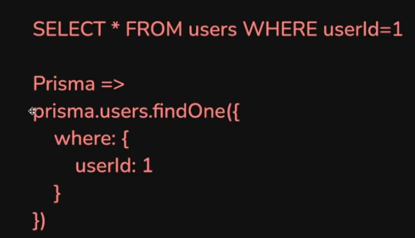

Can you see how easy we have now made, instead of remembering the whole syntax and learning new langauge(SQl), we now have converted into **object - oriented programming** type langauge. [this is one of the benefits of ORM]

**Ex -> `mongoose` was ODM (Object document mapping)**

> :pushpin:**Basically for NoSQL, ODMs are there and for SQL ORMs are there to EASIFY things**


## **Why ORMs ??**

1. **Simpler Syntax (converts objects to SQL Queries under the hood)**
----------


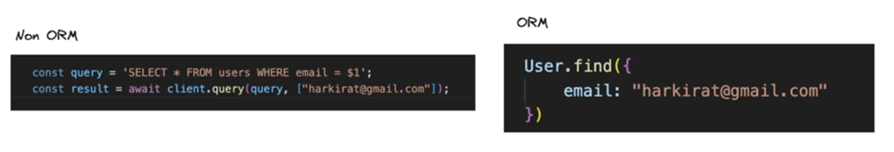

2. **Abstraction that let you flip the database you are using. [Unified API irrespective of the DB]** (very very important point)
----------

    + __Interchangability__ between the database and __Interoperability__ between the database becomes **easier** (means if you are using `mongoDb` and you want to shift to `postgres`, then of course things will become difficult but only for **MIGRATION**, when it comes to `node.js` code, then you have to make very minimal change, maybe you dont have to change at all)
    + BUT Rarely you migrate database so that is not the concern but still this is the advantage of using ORMs

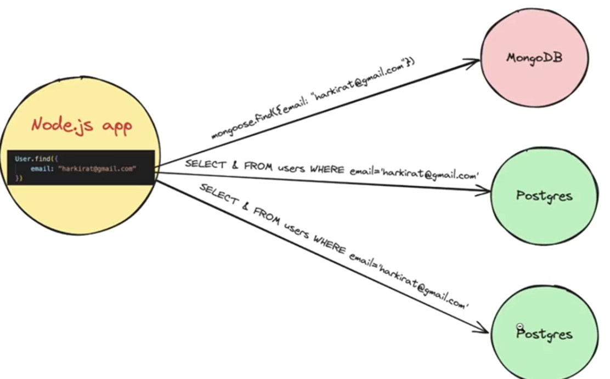


3. **Type Safety / Auto completion**
----------


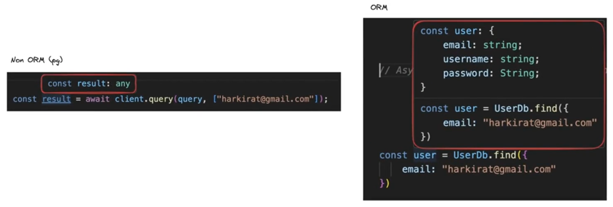

see the type in the **Red box** in the above code. (you can see in the ORM section, vs code is auto suggesting that what all `user` type **requires**) [that is why in left pic Non-ORM one, vs code is not suggesting auto completion as its type is `any`]

4. **Automatic migrations**
----------


But before understanding the automatic migrations, first lets see 

:bulb: **What is Migrations ??**

lets say you want to make a table `users` which consists of some rows so for making it  

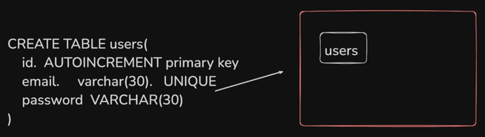

Now let say i have to add another field called as `age` after some time so now you will not run the above command again with `age` addition code, you will use 

```javascript
ALTER TABLE users ADD COLUMN age INTEGER
```

Now again after some more time, you have to add another field called as `dob` so again you will do the below command 

```javascript
ALTER TABLE users ADD COLUMN dob DATE
```

The above is what **Migration** means. You are **Migrating your database** (your database is getting **new columns, your database is getting altered**)

__This is very hard to track off.__ (you have done in your database but when another developer will take use of your database, then you have to send the migrations also so that they can know what change they have to make as per the latest).

-> so for this you must have a folder named `migrations` to store all the migration which has been done so that every one can know about it and use it to get the correct output.

**The above is the reason you should also use `ORMs` as these `migrations` are automatically being handled by the `ORMs` so you need not to worry about this**

As your app grows, you will have a lot of these `CREATE` and `ALTER` commands.

__ORMs (or more specifically Prisma) maintains all of these for you.__

For example -> https://github.com/code100x/cms/tree/main/prisma/migrations

all the `migration` you are seeing by clicking on the above link, you will get to know that all these `migration` has been **automatically generated**(Notice it has TIMESTAMP of creation included consisting of Year(first four no.), Month(next 2 no.), Date(next 2 no.), Time(rest no.))

In case of a simple Postgres app. it's __very hard to keep track of all the commands that were ran that led to the current schema of the table.__

:large_blue_diamond:Similar to `prisma`, `drizzle` is also one such ORM.

## **What is Prisma ??**

If you see to their website they have written something about it which states 4 things (highlighted by red box) basically :-

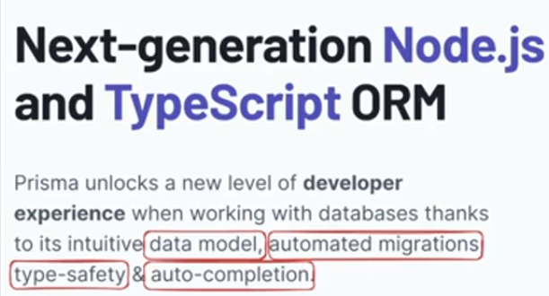

>:pushpin:<span style="color:orange">**Remember ->**</span> **`Prisma` can work with both `SQL` and `NoSQL` as it has its own syntax capable of handling both types of database**

1. **Data Model**
----------
__In a single file, you can define your schema.__ What it looks like, what tables you have, what field each table has, how are rows related to each other.

you can see the example -> https://github.com/code1OOx/cms/blob/main/prisma/schema.prisma

2. **Automated Migrations**
----------
Prisma generates and runs database migrations based on changes to the
Prisma schema.

3. **Type Safety**
----------

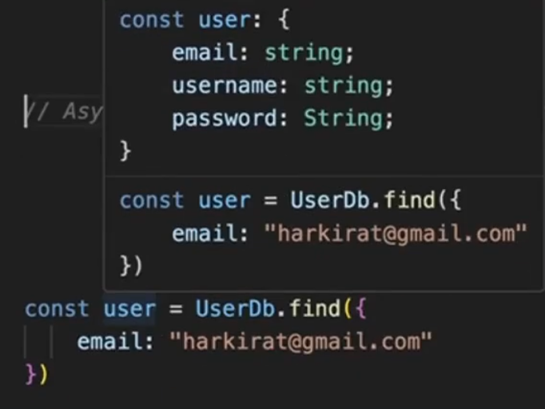

4. **Auto-Completion**
----------
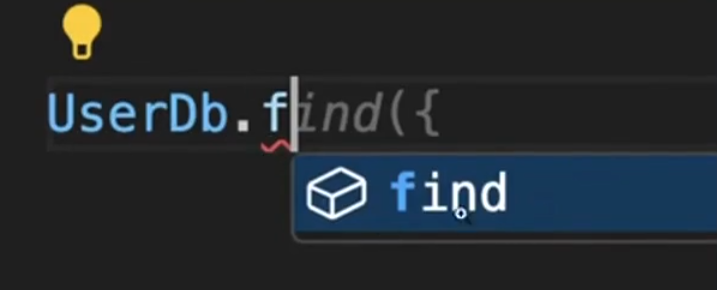

## **Installing Prisma**

Lets create a simple ToDo app

**Step 1 ->** Intialize an empty `node.js` project

```console
npm init -y
```

**Step 2 ->** Add dependencies 

```javascript
npm install 
```

**Step 3 ->** Initialize `typescript`

```javascript
npm install typescript

npx tsc --init 

// change to be made in tsconfig.json
Cange 'rootDir' to './src'
Change 'outDir' to './dist'
```

**Step 4 ->** make a `src` folder and initialise an empty `ts` project which has file called as `index.ts`

**Step 5 ->** Inside the `package.json`, inside the `"scripts"` add a new `"dev"` **key** with value `tsc -b && node ./dist/index.js`

+ now you can run the code now by using `npm run dev`

**Step 6 ->** Now lets install `Prisma` as dependencies 

```javascript
npm install prisma 
```

**Step 7 ->** After you have installed `Prisma`, you need to have some files associated with `prisma`, to get them 

```javascript
npx prisma init
```

It will generate a new folder named `prisma` and inside it you will see `schema.prisma` file being made automatically. It will also create `.env` file inside the `src` folder.

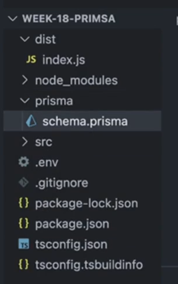

Now inside the `schema.prisma` understanding the default code written inside it and coding up the next step 

**Step 8 ->** Defining your data model

```javascript
generator client{
    provider = "prisma-client-js"
}

datasource db{
    provider = "postgresql" // This means that kiske sath prisma use kr rhe ho (mongoDb ke sath, aur any other db ke sath) [as here we are using it with postgres, so kept it]
    url = env("DATABASE_URL") // Here you will provide the credentials to connect to the database provided above (if it was to be mongoDb, then uska connection url STORE hota inside the variable named as DATABASE_URL
    // as all your SENSITIVE thing should be in your "env" file, so you have put the connection url inside the env file and linked it to the variable named as DATABASE_URL inside the .env file 
    // Now you have just used variable name with env method to pass the variable value form .env to here in this folder
    // You dont commit .env file and push it
}
```

Now comes the coding part and using the `prisma` (**Just write your schema of the app you are trying to build**)

```javascript
generator client{
    provider = "prisma-client-js"
}

datasource db{
    provider = "postgresql" 
    url = env("DATABASE_URL")
}

// KOI V APP banani h USER TABLE TO HAR JAGAH HOGA lets first make that 
model User {
    id   Int  @default(autoincrement()) @id // @id means ye PRIMIARY KEY h and @default(autoincrement()) means apne app iska value increase krte rhega on new entry by default
    username  String  @unique 
    password  String 
    age  Int 
}
```

**`@default()` can also be used when you want to give some default values to any particular entry**

for example -> 

```javascript
openToEveryone  Boolean  @default(false)  // OR 
discordOauthUrl  String  @default("")
```

Now till now you have **NOT yet generated `SQL` from it, you have not yet run `SQL` from it**

After creation of schema, **the first most important step to do is ->**

**Migration of database** -> This means that __generate or add__ the `SQL` in database and then __running that in the database__.

**Step 9 ->** Migrate the database 

to do the above thing use

```javascript
npx prisma migrate dev
```

Now this will take some time and then it will ask for 

```javascript
? Enter a name for the new migration: > initialise // add the name so that you can recognise what you have done in the following migration {should be descriptive}

// as here we are just initialising the new table so added "initialise" as the name  
```
after hitting `enter`, you can see the success message, and you will also notice that inside `prisma` folder a new folder has been added named as `migrations` and inside that a new folder is again created with `migration file name structure` and inside that you can see `migration.sql` file present 

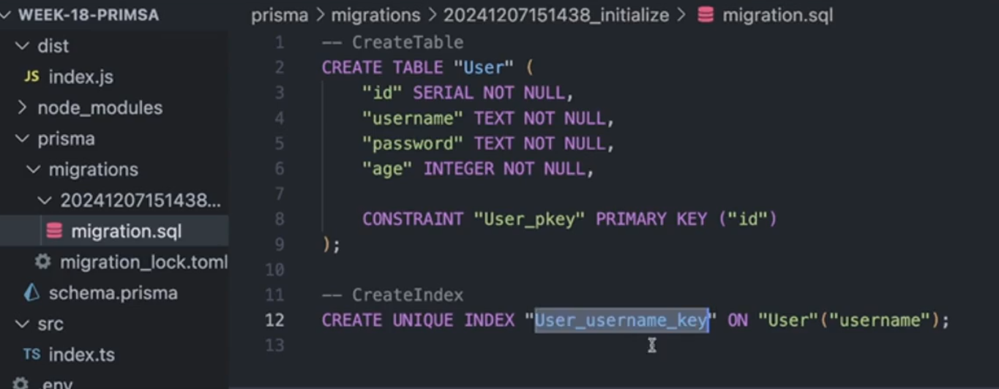

Now if you go to `migration.sql` file you will see the raw `SQL` written there (can be seen in the above pic also)

You will also see that this **will be applied or simply saying RELECTED to the database**

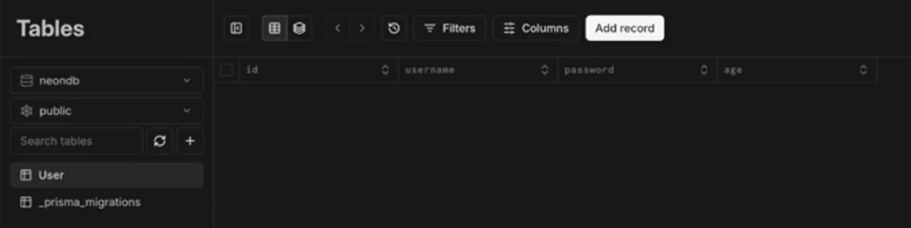

You can see **a new table has been created without creating and writing those heavy SQL compatible syntax**[automatically it get created and automatically it get reflected]

Now if you want to make changes (like adding a new field for example -> city), then just go to the `schema.prisma` file and just add `city` with its type and relaunch the command 

```javascript
npx prisma migrate dev
```

and then again give the new name for this change / migration -> "added users_city" lets say for example and you are good to go now the table will have new column named as `city` inside the `Users` table.

**You can even add the new TABLE by just going to the `schema.prisma` file by using `model` keyword and then name of the table and then defining the columns to be present inside it**

> :pushpin:Now you can **relate why `prisma` offers you single file schema design system as well as comfort to be used that in any of the two database `SQL` or `NoSQL`**


Lets try to create the `Todo` app, and try to create the `Todo` model and its schema (going inside the `schema.prisma` file). 

```javascript
generator client{
    provider = "prisma-client-js"
}

datasource db{
    provider = "postgresql" 
    url = env("DATABASE_URL")
}


model User {
    id   Int  @default(autoincrement()) @id 
    username  String  @unique 
    password  String 
    age  Int 
}

model Todo{
    id  Int  @default(autoincrement()) @id 
    title  String 
    description  String 
    done  Boolean 
    userId  Int  // basically kis user ki to-do h 
}
```

now just do the same thing to **migrate the database as you were doing before**

:bulb:**Lets suppose you want to add new field such as `time` inside the prexistin g database, then how to do this**

-> the above question simply says that lets say phle `id`, `title`, `description`, `done` column was there in the table, and usme phle se kuch users ka data pda tha now with all the entries fully filled now you want to add another column called as `time` inside the table, so what you will do and what will happen to this value for the users jo phle se pde h (as unhone to ye data fill he nhi kiya h at the time when it was created as us time pe `time` column tha he nhi) **SO THIS IS THE PROBLEM now HOW TO FIX IT ??**

-> you can fix it by making the minor change in the code (lets say i want to add `time` in the `Todo` table so)

```javascript
model Todo{
    id  Int  @default(autoincrement()) @id 
    title  String 
    description  String 
    done  Boolean 
    userId  Int
    // METHOD 1 -->
    time   DateTime? // MAKE THIS OPTIONAL by adding "?" in this line of code, "?" -> likhne se OPTIONAL ho jata h field means KI JO PHLE KI FIELD THI USKO IGNORE KRO (they dont need DateTime, purane me khali v ho skta h) 
    // OR -> GIVE IT DEFAULT VALUE 
    // METHOD 2 -->
    time   DateTime   @default(now()) // with this they all will get this default  value unless you explicitly change it
    // now() means av ka jo time and date h wo chli jae
}
```

**To run a particular migration, we were running the below command till now**

```javascript
npx prisma migrate dev
```
<span style="color:orange">**BUT, this takes some time and then it asks you to give the name of migration, Now instead of doing it step by step you can directly merge the two steps and run the below command**</span>

```javascript
npx prisma migrate dev --name <name_of_your_migration>
```
<span style="color:orange">**USE THIS COMMAND ALWAYS (its better)**</span>

**If you have `psql`, try to explore the tables that `prisma` created for you**

```javascript
psql -h localhost -d postgres -U postgres
```
You will see something like the below 

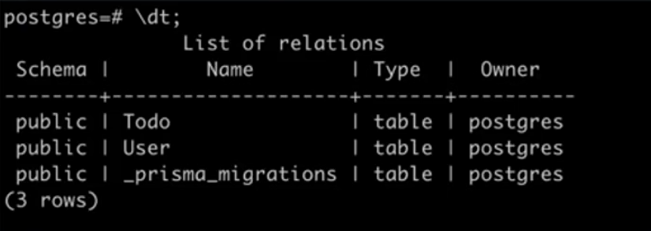

## **Generating the Prisma client**(Important as well as Confusing)

:bulb:**What is a client ??**

A client is a class inside which there are different methods or logic which give it the power to interact with the database (Performing CRUD operations on the database)

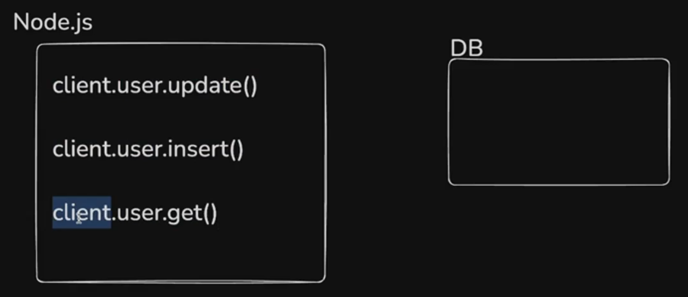

now **to use `client`, you have to GENERATE it first**

This is where the sample code which came written inside the `schema.prisma` file refers to 

```javascript
generator client{ // you have told to generate the prisma client 
    provider = "prisma-client-js"
} 

"prisma-client-js" has the ability to generate the client which will perform CRUD operations on the schema made below (in our case `Users` and `Todo` see the code of them above)
```
**you can have different `client` for different purpose such as one is available for `zod` also**

**To GENERATE THE CLIENT, run the below command**

```javascript
npx prisma generate
```
Two of the most frequently used prisma command are ->

```javascript
npx prisma migrate dev
&& 
npx prisma generate
```

In simple words, 

Client represents all the function that convert 

```javascript
User.create({email : "satyamraj1905@gmail.com"}) // RAW SQL QUERIES
```
Into 
```javascript
INSERT INTO Users VALUES ...... // TO QUERIES
```
Once you've created the `prisma/schema.prisma`, you can generate these clients that you can use in your `Node.js` app

## **Creating your first app**
----------
### **Insert or Create**

:bulb:**Write a function that lets you INSERT the data in the `Users` table.**

inside the `index.ts` file lets solve the above problem 

```javascript
import { PrismaClient } from "@prisma/client"; // you have imported the made client came by running npx prisma generate

const client = new PrismaClient();

async function createUser() { // as Database ka kaam h and Database ki dusre country me h to TIME to lgega na so used async  
    await client.user.create({
        data: {
            username : "harkirat",
            password : "123123",
            age : 21,
            city : "Delhi",
        }
    })
}

createUser( ) ;
```

Now if you will run this `ts` file using `npm run dev`, you will see the table being inserted in the database 

__Output ->__

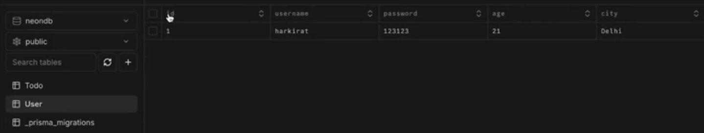

To show the difference `prisma` has made in previous way doing CRUD operation in the database see this -> 


```javascript
// This is what you have to write previously 
client.query("INSERT INTO users (username, password, email, age) VALUES (harkirat, 123123, 21, Delhi)")

// And if you use Prisma (as used above) then you have to write this 
client.user.create({
    data: {
        username : "harkirat",
        password : "123123",
        age : 21,
        city : "Delhi",
    }
})

// Can you see the difference -> clearly prisma one is more readable, understandable, hassle-free way of doing CRUD operation on the database 

// Prisma even gives you the method to write the RAW SQL QUERY by using .$queryRaw you can do this (BUT AVOID IT as phir prisma use krne ka fayda kya hua phir)

client.$queryRaw("INSERT INTO users (username, password, email, age) VALUES (Satyam, 123123, 21, Delhi)")
```

### **Read or Get**

```javascript
mport { PrismaClient } from "@prisma/client"; 
const client = new PrismaClient();

async function findUser() {  
    const user1 = await client.user.findIFirst({  // use .findFirst() if SIRF EK ENTRY chahiye and use .find() if SARI ENTRY CHAHIYE
        where: {
            id : 1
        }
    }) 
    // This will give you ALL the keys value which is linked with user with id 1 and store inside the user1 variable 
}

async function findUser() {  
    const user1 = await client.user.findIFirst({  
        where: {
            id : 1
        },
        select: {
            username : true 
        }
        // This will SELECTIVELY return ONLY the username of the person whose id = 1 
    })
}

findUser();
```

### **Update**

```javascript
import { PrismaClient } from "@prisma/client"; 
const client = new PrismaClient();

async function updateUser() {  
    await client.user.update({
        where: {
            id : 1
        },
        data: {
            username : "harkirat2"
        }
    })
}

updateUser();
```

### **Delete**

```javascript
import { PrismaClient } from "@prisma/client"; 

const client = new PrismaClient();

async function deleteUser() { 
    await client.user.delete({
        where: {
            id : 1
        }
    })
}

deleteUser();
```
## **Relationships in Prisma**
----------


Prisma lets you define `relationships` to relate tables with each other

### **Types of Relationships**

1. **One to One**
2. **One to Many**
3. **Many to One**
4. **Many to Many**

for ex -> for a `todo` app, there is **`One to Many` relationships**

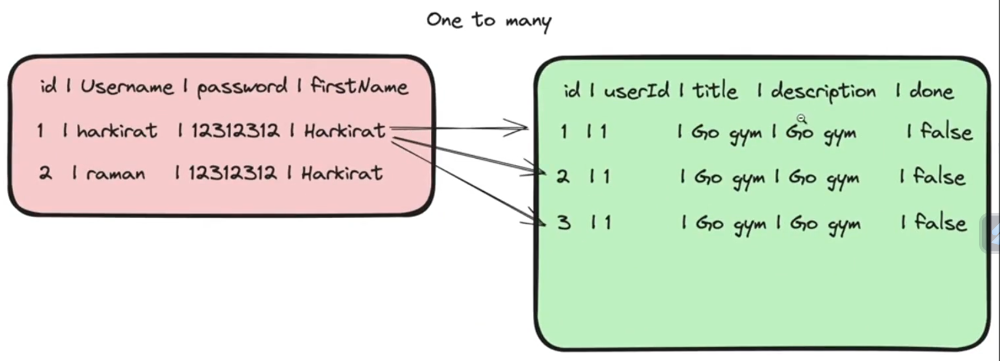

You should always try to define the `relationships` upfront (**means FOREIGN KEY should be defined upfront only**)

### **Updating the Prisma schema / defining relationships in prisma**

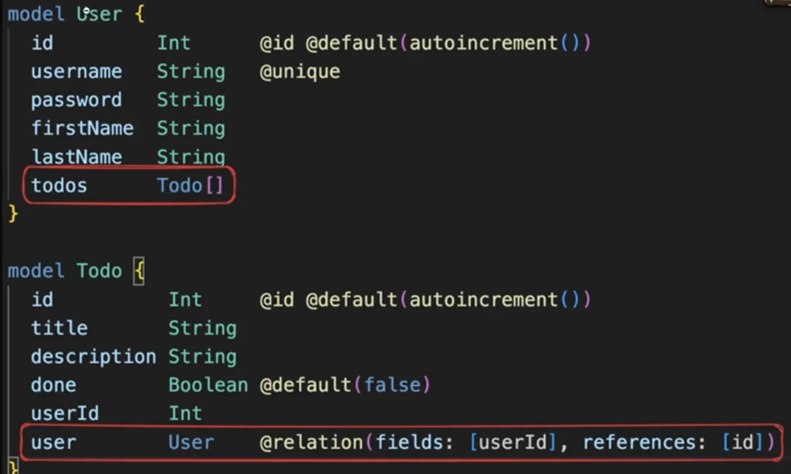

Notice the **red color block** in the above picture (that shows how to define the relationships in Prisma)

Basically dono table ya jitne v table h jinse relate krna h un sb me **define krna pdta h relationship**

```javascript
model User {
    id  Int  @id @default(autoincrement())
    username  String 
    password  String 
    firstName  String 
    lastName  String 
    todos  Todo[]  // Notice here we have said that this "User" table has relationship with "Todo" and it is linked to the array to the entries made inside the "Todo" table 
    // REMEMBER -> ye kbhi v SQL me nhi jayega for Query (means iska alg se column nhi ban jayega inside the "User" table as it is Relationships)
    // Prisma ko kaise pta chlta h ki ye column nhi h relationship h ??
    // Notice the type given to the key (be it "todos" or "user"(present in the "Todo" table)) can you clearly see that the type of them refers to the TABLE name and thats how Prisma comes to know that they are referring to the table not column. Now, we have also used "@relation" keyword with the table we want to establish relationship with 
}

model Todo{
    id  Int  @id @default(autoincrement())
    title  String 
    description  String 
    done  Boolean  @default(false) 
    userId  Int
    user   User  @relation(fields : [userId], references : [id]) // 2 Here we have described the relation with User table 
}
```
**Explanation of `// 2` line of code** [IMPORTANT]

> :pushpin:**`fields` in `// 2` code is FOREIGN KEY only which is being refernced via `references` keyword**

The line simply means that **Every `Todo` table has `user` entry which is of type `User` which goes through the relation that `userId` field jo iss(`Todo`) table me h that is related to `id` field present inside the `User` table**

You can also see **`One to Many` realtionship** (we have defined `Todo[]` ARRAY (**MANY**) inside the `User` table for **SINGLE** user) 

**Benefit of this ->**

Now if you write the below code and then run it
```javascript
import { PrismaClient } from "@prisma/client"; 

const client = new PrismaClient();

async function getUser() { 
    await client.user.findMany({
        where: {
            id : 1
        },
        include: {
            todo : true
        }

    })
    console.log(user)
}

getUser();
```

You will see that now along with all the information present inside the `User` table for `user` with `id = 1`, you can see their corresponding data present inside the `todo` table 

**Output ->**

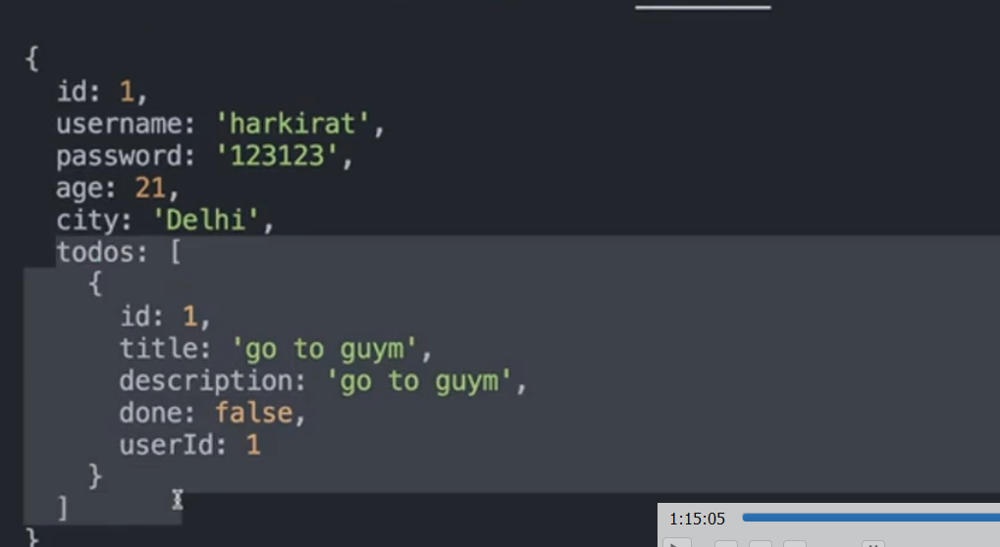

**You get back the users details and at the same time, you get back all the Todos corresponding to it**

## **Expressifying in Prisma**

Lets try to write some endpoint for some functionalities :-

```javascript
import { PrismaClient } from "@prisma/client"; 
import express from "express"

const client = new PrismaClient();
const app = new express()

// WRITING AN END POINT ("/users")TO GET ALL THE USERS PRESENT IN THE DATABASE 
app.get("/users", async(req, res) => {
    const users = await client.user.findMany() // .findMany returns all the users present in the database 
    res.json({
        users
    })

})

// WRITING AN END POINT ("/todos/:id") FOR GETTING ALL THE TODOs OF A PARITCULAR USER WITH GIVEN ID in the URL 
app.get("/todos/:id", async(req, res) => {
    const id = req.params.id // as req.params me jo v input tm dete ho (basically jo v input tm dete ho inside the url, it will be TREATED AS STRING, for example -> if you give 1 then it will be treated as "1")
    const users = await client.user.findOne({
        where: {
            id : parseInt(id) // convert the string into number as url me string me by default aata h input 
        },
        select: {
            todos : true, // will give all the "todos" linked to the particular user with id = id came from url along with this show the below field value from the User table 
            username : true,
            password :true
        }
    })
    res.json({
        users
    })
})
async function getUser() { 
    await client.user.findMany({
        where: {
            id : 1
        },
        include: {
            todo : true
        }

    })
    console.log(user)
}

getUser();
app.listen(3000)
```
**Output ->**

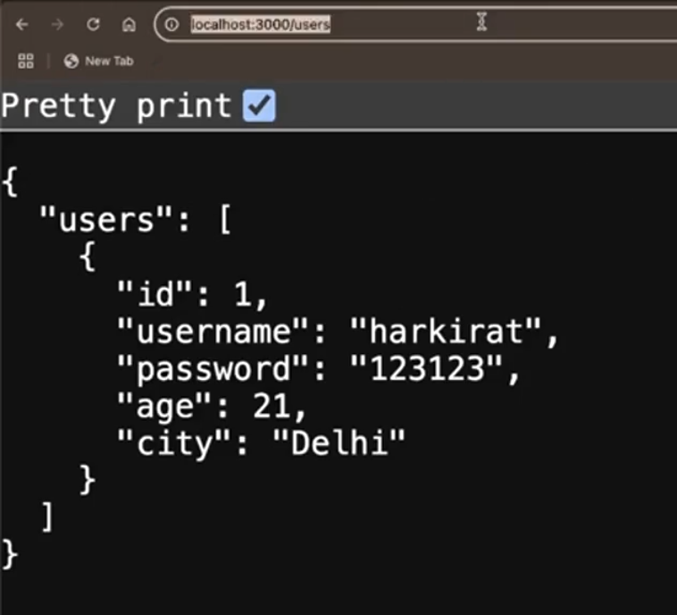 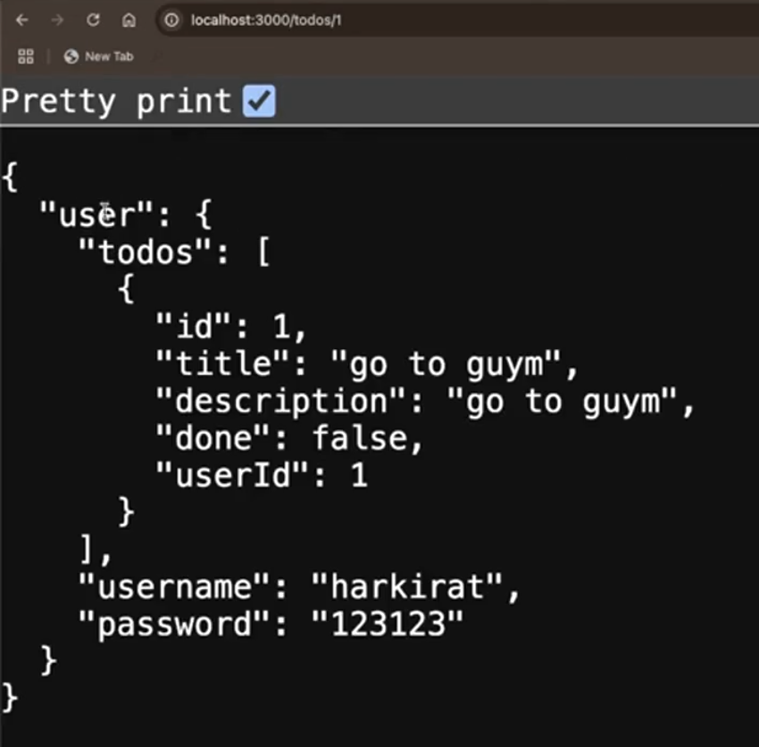

Notice both the endpoint are working correctly

## **Seeding dummy data**

If you see many github repo take this for example -> https://github.com/code100x/cms/blob/main/prisma , you will see `seed.ts` file (the purpose of this file making is that **KUCH INITIAL DATA DAAL DO so that if new developer comes in the team and they will migrate the database (that is fine) but there will be NO INTIAL DATA there, if you setup some management system, you will see some initial or dummy data there to visualise the developer in Better manner through UI**)

The above is what we call **seeding of data (as you have just initialised the database, now it will grow bigger just like that tiny seed grows to a big tree)**

to make it or include this file inside your project 

**Step 1 ->** go to the created `prisma` folder 

**Step 2 ->** and inside that create a new file named as `seed.ts`

**Step 3 ->** inside the `package.json` add below code after `"description"` key 

```javascript
"prisma": {
    "seed": "ts-node prisma/seed.ts"
},
```

**Step 4 ->** now inside the `seed.ts` file, write the logic for it  

```javascript
import {PrismaClient} from "@prisma/client"
const client = new PrismaClient()

function createDummyUsers(){ // just put some dummy data 
    await client.user.create({
        data:{
            username : "harkiratasdadsat",
            age : 21,
            password : "123123",
            city : "Delhi",
            todos : { // You can create "todos" for this user inside the block of code only no need to go to "Todo" table or have refernece to it 
                create : {
                    description : "Go to gym",
                    title : "Gym",
                    done : false
                }
            }
        }
    })

} 
```
**Step 5 ->** to run the above logic written first run the below command 

```javascript
npm i -D ts-node typescript @types/nodes
```
**Step 6 ->** and then running the below command finally to run the code 

```javascript
npx prisma db seed
```
> :warning:**Remember ->** dont put any data which is already present in the database inside the `seed.ts` dummy data logic  as **phir wo dummy data kaise hua**, otherwise it will give you ERROR at the time of running 


## **Assignment**

Try creating a `todo` application that __let's a user signup, put todos and fetch
todos.__

Use ->
l. Typescript as the language
2. Prisma as the ORM
3. Postgres as the database
4. Zod as validation library


