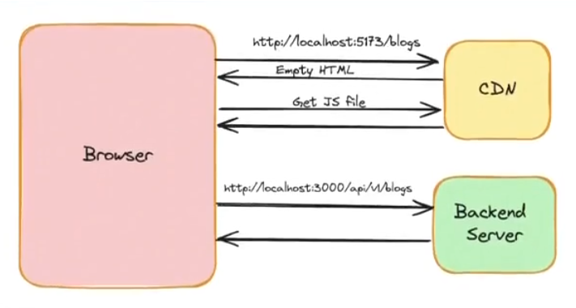
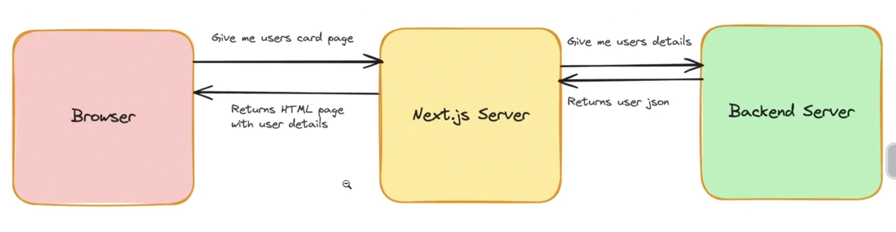
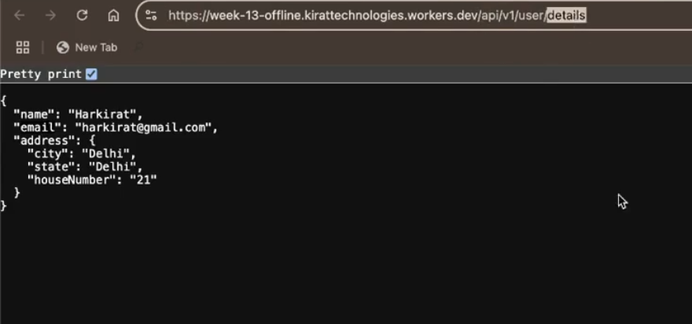
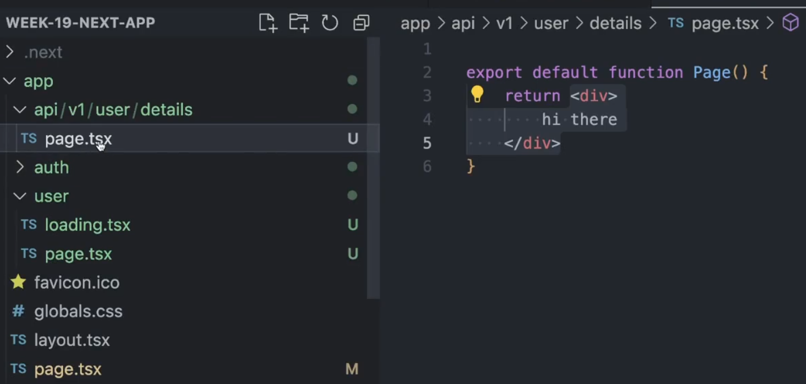
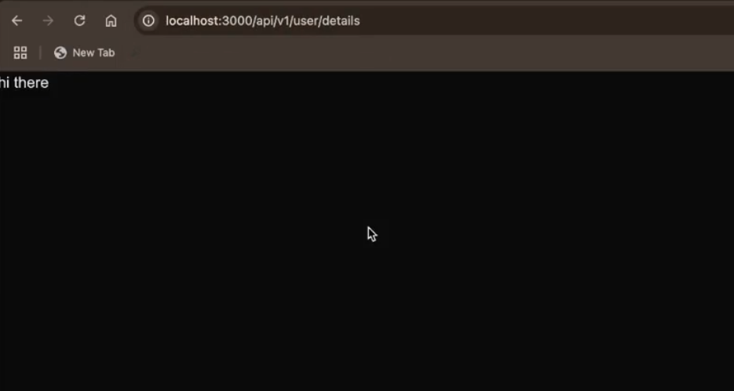
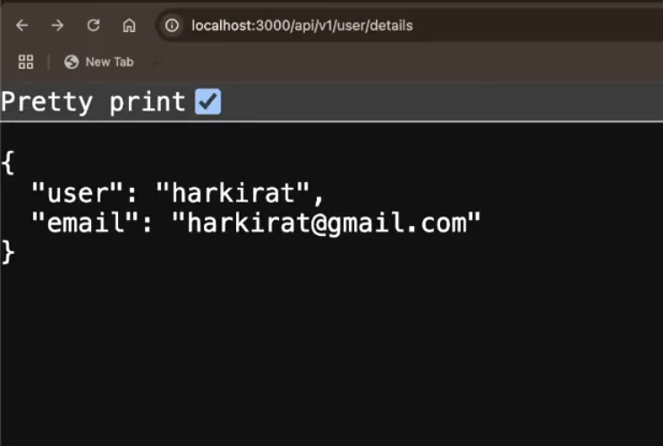
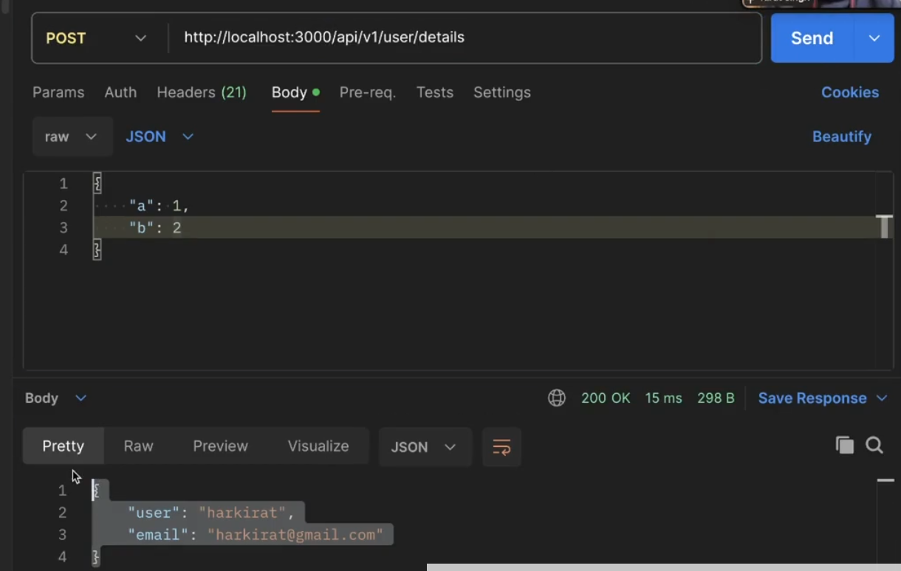
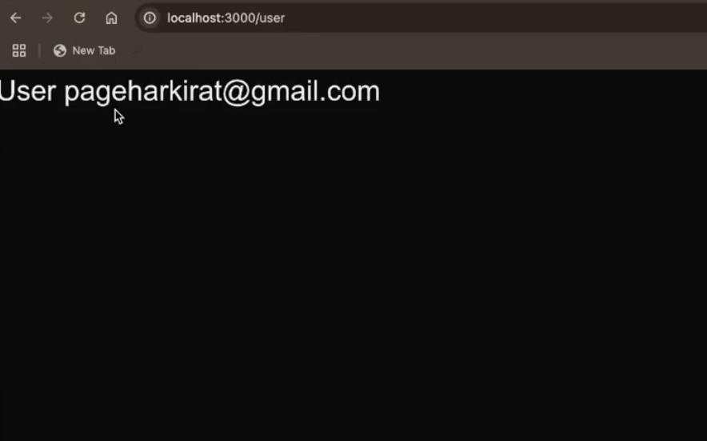
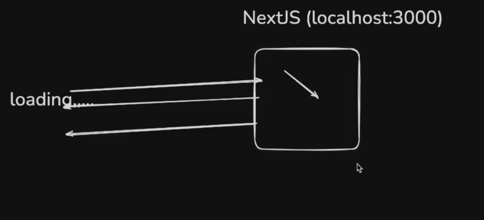
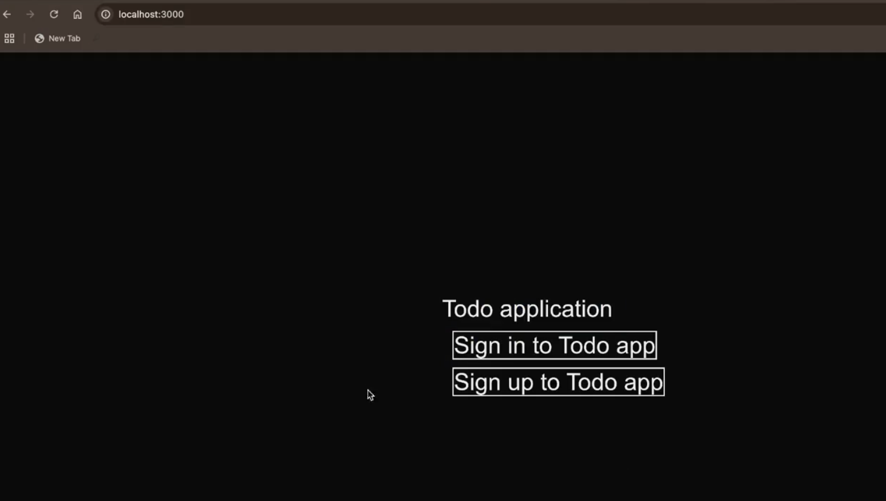

# **Next Js for Backend (Server side code)**

`Next.js` is a full stack framework


This simply means that you dont really need `express` as well as this simply means that same `process` can handle both frontend and backend code.

 

The left pic consists of the `HTML` code being returned so `frontend`

The `json` which you see in the right part of the pic is generally returned by the `backend` server.

**Benefits ->**

+ **Single codebase for all your codebase**
+ **No `CORS` issue, single domain name for your FE and BE**
+ **Ease of deployment, deploy a single codebase** (will see later) [basically your frontend if written in `react`, then will be deployed on `S3`(**Object Store**) and backend if written in `node.js` then it will be deployed on `EC2` but if using `next.js`, then both frontend and backend will be deployed on the same thing]


## **Recap of Data fetching in `React`**
----------
Lets do a quick recap of how data fetching works in `React`.

We're not building backend yet. Assume you already have this backend route -> https://week-13-offline.kirattechnologies.workers.dev/api/v1/user/details


code :- https://github.com/100xdevs-cohort-2/week-14-2.1

Website :- https://week-14-2-1.vercel.app/

**User card website**

Build a website that lets user see their name and email from the given endpoint


The UserCard component made above looks something like this 


**Delving deep into the above written code**

```javascript
export const UserCard = () => {
  const [userData, setUserData] = useState<User>();
  const [loading, setLoading] = useState(true);

  useEffect(() => { // Whenever the UserCard component mounts, we hit the backend and get the data from the backend 
    axios.get("https://week-13-offline.kirattechnologies.workers.dev/api/v1/user/details")
      .then(response => {
        setUserData(response.data); 
        setLoading(false);  // after getting the response, we set the loading to false and the return the user data by using response.data 
      });
  }, []);

  if (loading) {
    return <Spinner />; // basically loading screen dikhana agar data fetch nhi hua h to 
  }

    // and if data fetched then just show the below component
  return <div className="flex flex-col justify-center h-screen"> 
    <div className="flex justify-center"> 
      <div className="border p-8 rounded">
        <div>
          Name: {userData?.name}
        </div>
        {userData?.email}
      </div>
    </div>
  </div>;
}
```
**Workflow of the above code**

Although there are better ways to do the above thing using external library knwon as `ReactQuery`, but if you want to go purely with `REact`, then above is the only code to hit the `backend` from `frontend`.

Summarising the above concepts, **Data fetching happens on the client**



As discussed above, waterfalling problem exist while dealing with `React`.

## **Data fetching in `Next.js`**
----------
**See the documentation ->** [Routing in Next.js](https://nextjs.org/docs/app/building-your-application/data-fetching/fetching-caching-and-revalidating)

You should fetch the user details on the server side and **PRE-RENDER** the page before returning it to the user.

In `Next.js`, data fetching looks like the below :-



you can see the frontend is coming **PRE-RENDERED** from the `next.js` server.

Lets convert the above made `react` project to `next.js` project and build it  

**Step 1 ->** Initialise an empty next project and do whatever option is required to create (you can also see in the previous page.)

```javascript
npx create-next-app@latest
```

**Step 2 ->** for data fetching from the API(so that we can display that on frontend), install `axios` (you can also use `fetch`) 

```javascript
npm install axios 
```

**Step 3 ->** Now go to the `app` folder and inside that make another folder(or route) `user` for showing the `user` data [which is our main goal]

**Step 4 ->** inside the `page.tsx` made inside the `user` folder writing the logic

```javascript
"use client" // REMEMBER -> whenever you use "useState" or "useEffect" then you must add this line on top of your code when working with Next.js
// as these are CLIENT COMPONENT and by default Next.js SERVER COMPONENT maan ke chlta h sbko, so to use them we have to tell Next.js that they are CLIENT COMPONENT 
import axios from "axios"
import {useEffect, useState} from "react"

export default function User(){
    // made 2 state variable as yhi done to screen pe show krna h first one (loading screen jb data nhi aaya ho to) and second one (data screen jb load ho jaye to)
    const [loading, setLoading] = useState(true) 
    const [data, setData] = useState({})

    useEffect(() => {
        axios.get("https://week-13-offline.kirattechnologies.worker.dev/api/v1/user/details")
        .then(response => {
            setData(response.data)
            setLoading(false)
        })
    }, [])

    if(loading){
        return (
            <div>
                Loading....
            </div>
        )
    }

    return (
        <div>
            User Page 
            {data.name}
            {data.email}
        </div>
    )
}
```

**Output ->** Initially loading will come and then the data.


<span style="color:orange">**BUT THE ABOVE THING IS NOT THE RIGHT WAY TO FETCH THE DATA INSIDE THE `Next.js`**</span>

**Reason ->** because the `useEffect` present inside the above code **will run on the `client` (means inside the BROWSER)**

**simply saying, `useEffect` is running on the CLIENT side instead of SERVER and hence although waterfalling problem not exists here but still it is not getting the correct HTML page from the `next.js` server** [Initial page looks like ->]


so `googlebot` will not see **first the data which is rendered on the screen instead it will see the loading page shown above and hence it will not be SEO optimised**

so although we use `next.js` still we were not able to take the benefit of it. 

**How to fix it ??**

-> basically how to achieve `server-side-rendering` as currently it is doing `client-side-rendering`

Let do the changes inside the above code 

```javascript
import axios from "axios"

// STEP 1 -> make the component "async", so added async in the component
export default async function User(){ // 2
    // STEP 2 -> Remove all the logic of react hook written just do this 
    const response = await axios.get("https://week-13-offline.kirattechnologies.worker.dev/api/v1/user/details")

    const data = response.data // 3

    return ( // 4
        <div>
            User Page 
            {data.name}
            {data.email}
        </div>
    )
}
```
**Explanation of `// 2` code**

writing `async` on the component does not means that *frontend pe `async` component is coming,* **it simply means that whatever logic written below till start of `return` codeblock WILL RUN ON THE SERVER, it will not run on the CLIENT**

basically `next.js` server ne `// 3` tk ka code run kiya and then `// 4` `HTML` code ko **Pre-render krke bhej diya**   

Now if you go and see the output -> 


In the first `request` only, `HTML` page is returning the content which is rendered on the screen.**It is PRE-RENDERED on the server and getting loaded up (shuru se he bhara aa rha h backend se)**

**Benefit of the above code ->**

+ **Code is much cleaner now**
+ **`request` is directly going to the backend and page is pre-rendering and coming to the frontend**

>:pushpin:**The above is how data fetching in `next.js` occurs, JUST REMEMBER THIS CODE as it is VERY VERY IMPORTANT**

**Basically your `next.js` is either INSIDE the backend server or your `next.js` server is talking to the database**

**The above was one of the biggest thing `next.js` took an edge over `react` and that is USE OF STATE MANAGEMENT LIBRARY like `recoil` totally came to end, as jarurat he nhi pdta to store the data inside the state variable and then render them, sb bana banaya aata h**

Now the question comes,

:bulb:**Lets say in the above code, the data took 2 or more second to load then how to render the LOADER till the data is loaded as we have not written or done anything about that ??**

## **Loaders in `Next.js`**

so here comes the **requirement of your website ->** if you want your website to be SEO optimised, then **loading page to dikha mt dena as if you will add that then the first `response` coming from the server will be LOADING page only as isse jldi to data load hoga he and due to this `googlebot` will see the LOADING page which will eventually drastically reduce the SEO optimisation**

Now here `googlebot` will never go to the each users (i.e. go to the `user` route), to know about each user, so here its **better to add LOADER** as `googlebot` ko ye sb route se mtlb utna nhi h  

BUT 

**if you are making your landing page of the website then you cant add LOADER page as then it will NOT BE SEO optimised as the website function is mostly shown inside the landing page only and `googlebot` mostly reads this only.**

so if you want to add LOADER then go to the `react` approach of adding the LOADER page written above 

OR 

**A more `next.js` approach is ->**

```javascript
import axios from "axios"

export default async function User(){ 
    const response = await axios.get("https://week-13-offline.kirattechnologies.worker.dev/api/v1/user/details")

    const data = response.data 

    return ( 
        <div>
            User Page 
            {data.name}
            {data.email}
        </div>
    )
}
```

**If you know that there are bunch of `async` task is being happening inside the compenent**, then add another file (or page ) called as `loading.tsx` inside the same folder as that where you have written the above code i.e. -> `app > user > page.tsx`

and inside `loading.tsx`

```javascript
export default function Loading(){
    return (
        <div>
            Loading... // add what ever the loading page you want to add here
        </div>
    )
}
```
see the folder structure :- 

 


Now the `next.js` is clever enough ki **jb tk left pic me highlighted part (`async` code) is fetching the data and is taking time, tb tk as `loading.tsx`(right pic) v usi route me h so run its code (WHY TO SIT EMPTY and wait for the data) and hence it will show LOADER by executing the `loading.tsx` file and you will see the LOADER till the data is being fetched or simply saying till `page.tsx` ki `async` code nhi chal jati**

>:pushpin:**Basically FALLBACK to `loading.tsx` page (if present) if one page is taking too much time to load up. [CONDITION -> all the pages including `loading.tsx` should be in same folder]**
>
>><span style="color:orange">**REMEMBER ->**</span> **Dont change the name of `loading.tsx` (ye `loading.tsx` he hona chahiye)**

**Initial `HTML` me isse v `loading.tsx` ka `HTML` code he aayega but now you have done it in `next.js` way instead of doing it like `react` way**

## **Introducing API routes in `Next.js`**

NextJS lets you write backend routes, just like express does.

This is why Next is considered to be a `full stack` framework.

The benefits of using NextJS for backend includes
1. Code in a single repo
2. All standard things you get in a backend framework like exprbss
3. Server components can directly talk to the backend

Till now we were writing the `page handler`, now we will write `route handler`



See the url, as this url was externally present means it was not inside the `next.js` server means `next.js` server has fetched the data from external backend. Now to make it available inside my `next.js` server, i will create same route ->

so going inside the `app` folder, adding now `route handler` and then inside that make first `api` folder, then inside that `v1` folder, and then inside that `user` folder, and finally inside that `details` folder inside which if you make `page.tsx` file inside which if you write :-

```javascript
export default function Page(){
  return (
    <div>
      hi there
    </div>
  )
}
```

Now if you now go to  "http://localhost:3000/api/v1/user/details"

then you will see "hi there" on the screen but what do i want to see at this -> see the above pic present in `json` format


  

so can i write like this :-

```javascript
export default function Page(){
  return {
    name : "harkirat"  
  }
}
```
**No this will give ERROR if you see it on the `url`** as **it is component and it EXPECTS `JSX` to return**

Now as **I am not returning a page(not returning a `HTML` from here), IT IS A BACKEND route(it might return `text`, `json`, and maybe `HTML`)** so for that 

**Convert the name of the file to `route.tsx` (doesnt even have to `.tsx` as we are currently not returning `HTML` (see the data it is in `JSON` format)) so `.ts` is enough**

as you have already see the frontend part in `next.js`, recaping the steps :-

**For pages , return a component that return some `HTML`, above which data fetching is code is being handled**

Now coming to the `backend` part,

now inside the `route.ts`, write this -> [Here we will learn the syntax for backend]

```javascript
import {NextResponse} from "next/server" // first importing the NextResponse from the next/server 

// THIS IS HOW YOU MAKE "GET" REQUEST
// you have made a "get" request on the 
// as we have MULTIPLE type of handler on the route -> api/v1/user/details so that why not used DEFAULT on the function (see the Default vs Normal export difference)
export function GET(){
  return NextResponse.json({
    user : "harkirat",
    email : "harkirat@gmail.com"
  })
}

// THIS IS HOW YOU WILL HANDLE POST REQUEST 
export function POST(){
  return NextResponse.json({
    user : "harkirat",
    email : "harkirat@gmail.com"
  })
}

// SIMILARLY HANDLING THE PUT REQUEST 
export function POST(){
  return NextResponse.json({
    user : "harkirat",
    email : "harkirat@gmail.com"
  })
}

// IN THE SAME WAY YOU CAN HANDLE ANY TYPE OF REQUEST
```
Output -> `get` request (in left side) and `post` request (in the right side)

 

Now you can use this in your intial code where you were hitting other backend 

```javascript
import axios from "axios"

export default async function User(){ 
    // const response = await axios.get("https://week-13-offline.kirattechnologies.worker.dev/api/v1/user/details") // INSTEAD OF THIS 

    // WRITE THIS 
    const response = await axios.get("http://localhost:3000/api/v1/user/details")

    const data = response.data 

    return ( 
        <div>
            User Page 
            {data.email}
        </div>
    )
}
```
Output ->



what we were doing initially -> (in the left pic) and what we are doing now (in the right pic, basically Nextjs pe he bhej rhe ho request)

 

**so we have MIGRATED the backend to our `next.js`**

## **Project -> End to End To-do application in `next.js`**

Initialising an empty `next.js` project by the same step done previously ->

and then proceeding by `page.tsx` present inside the `app` folder ->

inside the `page.tsx`

```javascript
import Link from "next/Link"

export default function Home(){
  return (
    <div className = "text-lg w-screen h-screen flex items-center justify-center">
      <div>
        TO-DO application
        </br >
        <Link className = "text-md border m-2" href = "/signin">Sign in to TODO app</Link>
        </br >
        <Link className = "text-md border m-2" href = "/singup">Sign up to TODO app</Link>
      </div>
    </div>
  )
}
```
>:pushpin:**`<Link>` tag is present in `next.js` and works the same way as `a` tag in `HTML`**
>
>> **Used to RE-DIRECT to other page (also it is a button, you click on it)**

>:pushpin:<span style="color:orange">**REMEMBER ->**</span> **Using `<Link>` tag is the BEST way to do ROUTING in `next.js` although there exists another way but that will lead to complication only**

Going to the http://localhost:3000 , you see the output as ->



If you click on the sign in then it will redirect to the http://localhost:3000/signin ,(i.e -> `signin` page) and similar with the `signup` page

**Other way of doing routing inside `next.js`**[Complicated way]

```javascript
"use client"
import {useRouter} from "next/navigation"

export default function Home(){
  const Router = useRouter()
  return (
    <div className = "text-lg w-screen h-screen flex items-center justify-center">
      <div>
        TO-DO application

        <button onCLick = {() => {
          Router.push("/sigin")
        }}>Sign in</button>
      </div>
    </div>
  )
}
```

>:pushpin:**using `useRouter` is another way to achieve ROUTING in `next.js` but this BAD way to do as you have to make the code CLIENT SIDE as it is available in CLIENT SIDE which will enforce the code to run on the CLIENT SIDE and `next.js` is known for SERVER side** also **PRE-FETCHING is not available for this way of doing routing as CLIENT SIDE me possible nhi hota, go above, we have discussed it**
>
>> **in the code at the top i have added line `"use client"` as it is CLIENT SIDE component**

The code will still work but you should avoid using this way of doing routing.

Now next step is -> Creating the `signin` and `signup` page so inside the `app`, make a folder named as `signin` and inside that `page.tsx` to write the logic for this page, the code for it ->

```javascript
export default function Signin(){
  return (
    <div className = " >
  )

}
```


