# **Next Auth**

-   [**Next Auth**](#next-auth)
    -   [**Why not use JWT + localstorage in case of `Next.js` ??**](#why-not-use-jwt--localstorage-in-case-of-nextjs-)
    -   [**Next Auth**](#next-auth-1)
    -   [**Catch All route**](#catch-all-route)
    -   [**Coding NextAuth**](#coding-nextauth)
        -   [**Setup**](#setup)
        -   [**Credentials as provider in NextAuth**](#credentials-as-provider-in-nextauth)
        -   [**Google and Github as provider in NextAuth**](#google-and-github-as-provider-in-nextauth)
    -   [**Some important authentication part**](#some-important-authentication-part)
        -   [**Logic to display on the main page fully functional authorization buttons (ex -\> signin, logout)**](#logic-to-display-on-the-main-page-fully-functional-authorization-buttons-ex---signin-logout)
            -   [**using `useSession` hook**](#using-usesession-hook)
            -   [**using `getServerSession` hook**](#using-getserversession-hook)
    -   [**Middlewares in `Next.js`**](#middlewares-in-nextjs)
        -   [**About Middlwares in `Next.js`**](#about-middlwares-in-nextjs)
            -   [**Use cases**](#use-cases)
        -   [**Coding up the middleware in `Next.js`**](#coding-up-the-middleware-in-nextjs)
        -   [**Selectively running middleware**](#selectively-running-middleware)

NextAuth is **a library** that lets you do `Authentication` in `Next.js`

Can you do it without next-auth ?? - Yes

Should you - Probably not!

Popoular choices while doing auth include -

1. **External provider -**
    1. https://authO.com/ (one of the biggest authentication provider)
    2. https://clerk.com/
    3. Firebase auth
2. **In house using cookies**
3. **NextAuth**

## **Why not use JWT + localstorage in case of `Next.js` ??**

---

:bulb:**How did we do `authentication` in `Express.js` or `react` ??**

The below is the control flow of how we used to `authentication`

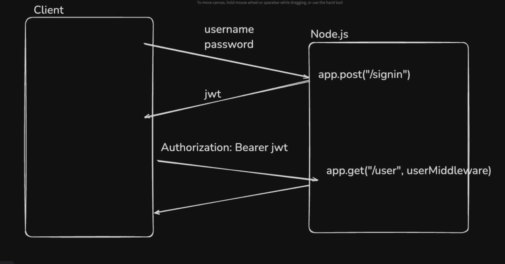

Now can we do the same thing with `Next.js` -> lets say i have my frontend in `Next.js` and backend in `Node.js` server or lets keep it simple, backend is also `Next.js` server and we are following the above control flow :-

In the regular `react`, code flow of loading the website goes something like this -> first the `HTML` code gets load up and then the browser **sends the `request` to backend, and then the `JS` part runs which do whatever is required (like getting profile info., etc..)**

**BUT**

in `Next.js`, you were providing the `request` to the `Next.js` server, **that `request` will itself get first rendered on the `Next.js` server and then it hit the database and then database gives the data and with that it comes back to `Next.js` server and RENDERs again with data and this readymade page rendered on the `Next.js` server gets DISPLAYED on the Browser.**[i.e. -> SERVER SIDE RENDERING]

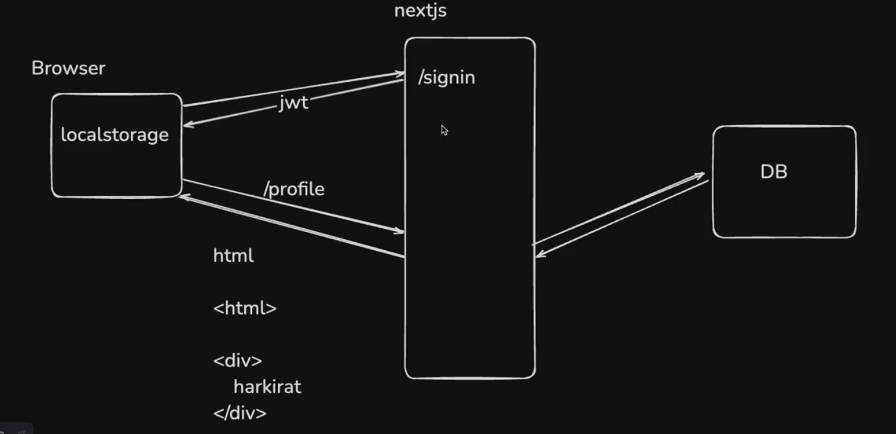

Now here comes the problem with the above approach of using the `JWT` to **authenticate**, **basically you cant send the `JWT` you have stored inside the browser (see above pic) because YOU CANNOT SEND the `jwt` TO THE FIRST PAGE or basically FIRST REQUEST as it cannot do that.**

in short

> :pushpin:<span style="color:orange">**Remember ->**</span>**You cant send header in the FIRST REQUEST in `Next.js`**
>
> > **Reason ->** Unless and until the page loads up, you **do not have access to the browser's localstorage**

`Next.js server` has to somehow get the **Header and authenticate itself and then use the info. present in the database corresponding to it, render it over the `Next.js` server and send it to the client NOW THIS IS NOT POSSIBLE WHEN YOU ARE USING LOCALSTORAGE TO STORE THE TOKEN**<span style="color:orange">**as you cannot send the token along [valid only for FIRST REQUEST] of course after first request, when you got the data in the client then you might be using `useEffect` that can hit the backend with the LOCALSTORAGE TOKEN (but in the first request this is not POSSIBLE)**</span>

The above is not the problem with `react` :-

in `react`, something like this was happening :-

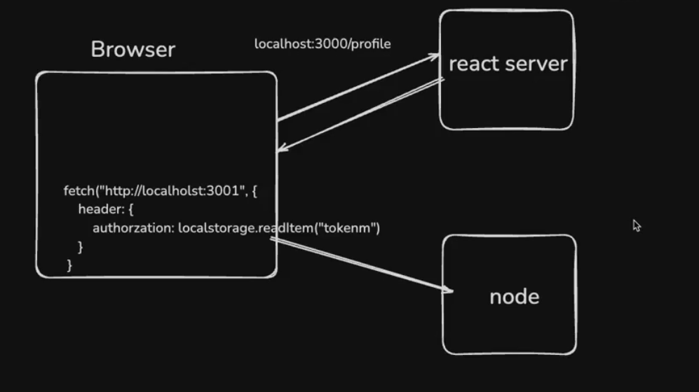

When first time you are sending the `request` to `react server`(phle isi ke pas jata h phir ye convert krta h `react` code to `html, css, and js` code bundle(as browser can only understand the above 3 langauges)) to BROWSER and then from here there are some code which involes **hitting the backend like using of `fetch` or `axios` in the codebase** and hence this **sends the `request` to backend** whose url is above shown as "http://localhost:3001..." and this **also has HEADER which does the authentication and finally display the info. after getting it from database (which in turn passed to backend and finally to frontend)**

In **short, Just remember these points and you will know the difference :-**

**SUMMARY of all the above thing studied above ->**

**Next.js (SSR)**

1. The first request is made by the browser to the Next.js server to get the HTML.
2. The Next.js server tries to render the page before it is sent to the browser.(recall **Premeptive fetching**)
3. At this point, the server does not have access to the browser's localStorage (where your JWT is stored).[**as IT ONLY EXISTS in the browser after the page reloads**]
    - So, you cannot send the JWT in a header for authentication on the very first page load.

**React (CSR)**

1. The browser loads the static HTML/JS bundle.
2. All API requests (e.g., fetching user data) present in the bundle are made from the browser (client-side), after the JS runs.
3. The browser has access to localStorage[**as now the page has loaded once**] and can attach the JWT in headers for these API requests—even on the first API call after the page loads.

**Key Difference**

-   **Next.js SSR:** First request is for `HTML`, made to the server, which can't access localStorage.
-   **React CSR:** First instead of `HTML`, API request is made from the browser (**as `HTML, JS` wala part to `react server` bnake bhej he deta h browser ko to browser `request` kyu krega `HTML` file ka instead now it `requests` for the API present inside it**), which can access localStorage.

**In `React`, you control when and how to send the JWT because all logic runs in the browser. In `Next.js` SSR, the server renders the page first, so it can't access browser-only storage like localStorage.**

:bulb: **What if i forcibly send the `jwt` in the first request in `Next.js` ??**

-> you can do this but then **You will lose all the benefits of using `Next.js`** as if you send the `jwt` in the first request as the page has not loaded up so **you will get an EMPTY BUNDLE of info. from the backend and then you have to use some other way like `useEffect`(as it runs when the page mounts) and then fetch the info or make a `request` again via `useEffect` and hence this will also lead to CLIENT SIDE RENDERING, this is where you will lose all your benefit of using `Next.js`**

Now lets try to understand by code **that if we try to do what we used to do traditionally (i.e. using `express.js` and `react` then what will happen**

after initialising the **EMPTY `Next.js` project**, and now to use `JWT` run the command

```javascript
npm install @types/jsonwebtoken
```

Lets try to create `signin` endpoint so do this -> `app > api > signin` and then inside the `signin` folder, making `route.ts` file and writing :-

:warning:**Remember whatever the code which is being written now does not ensure the correctness (it is wrong mainly) but to make you understand we are trying to do this and see the result practically that why the approach being used for `react` + `node.js` will not work here inside the `next.js`**

```javascript
import jwt from "jsonwebtoken";

export async function POST(req: NextRequest) {
    // Ideally we should check the username and password in the DB and only if it is right we should return the jwt
    const body = await req.json();

    const username = body.username;
    const password = body.password;
    //After this you should check in the db so here will be a backend call (and inside it we will have logic of finding the username with the corresponding password and verify it)

    const userId = 1;
    const token = jwt.sign(
        {
            userId,
        },
        "SECRET"
    );

    return NextResponse.json({
        token,
    });
}
```

while testing the above code from `Postman` and then seeing the result :-

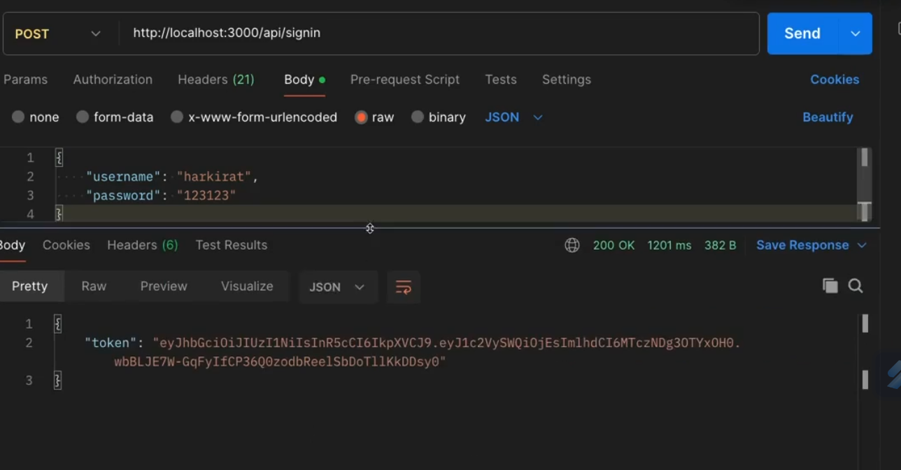

You can see the token has been returned so the code is working fine

Now we store this token inside the frontend (i.e. localstorage) as we used to do while working with `Express.js`

so for this lets make the frontend page for it inside the `app` folder, make another folder `signin` and inside that `page.tsx` which has lets say the following code

```javascript
"use client" // as you are using button handler ("onClick")
export default function (){
    return (
        <div>
            SIGN IN PAGE </br>
            <input> Username </input>
            <input> password </input>
            <button onClick = {async () => { // when clicking on the button it should send the request to the backend so first installing it by using npm install axios in the terminal and then
                const res = await axios.post("http://localhost:3000/api/signin", {
                    username : "asd",
                    password : "asdasd"
                })// as you are going to get the response from the backend so it will take time so made async
                // Now after getting the response from the backend which in our case will be token, you will store inside the browser localstorage
                localStorage.setItem("token", res.data.token)
            }}> Sign in </button>
        </div>
    )
}
```

Now if you go to the http://localhost:3000/signin the you will see something like this :-

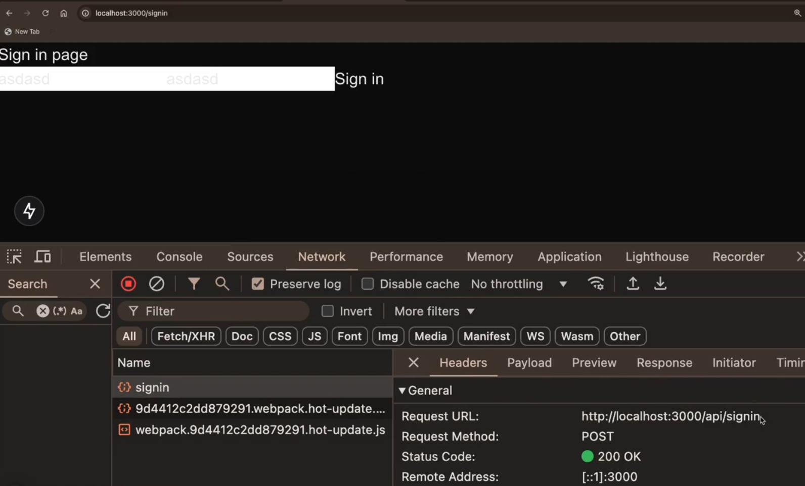

Notice the `request` is going to the same url (when you click on the `signin` button) on which we were sending the `request` from `Postman`, so our frontend is also able to communicate with backend effectively.

you can also see the token which has been returned by the backend and eventually stored inside the localstorage

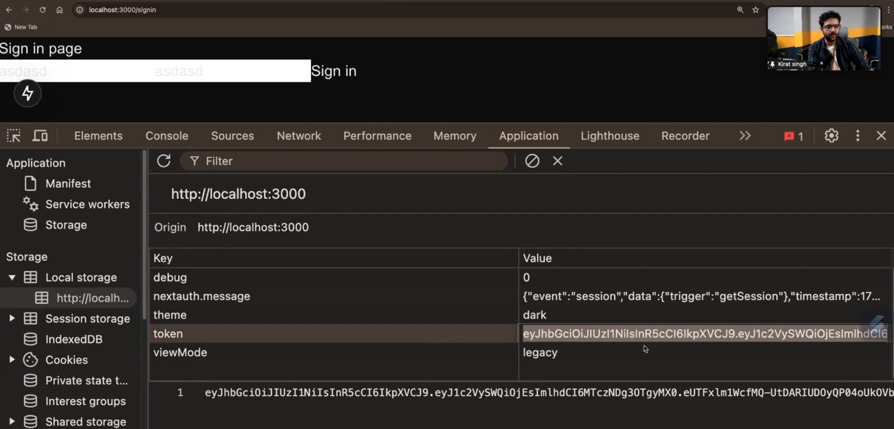

Till now we have used the same approach as that being used in `react` + `express.js`

Now lets try to create a `profile` page which a person wants to see

first making the backend endpoint -> `app > api > profile` and inside the `profile` folder, make a `route.tsx` file which consists of the following code -

```javascript
import { NextRequest, NextResponse } from "next/server";

export function GET(req: NextRequest) {
    // below if the logic to identify who is the user
    const headers = req.headers; // Step 1 -> headers extract as it contains the metadata
    const authorizatonHeader = headers("authorization"); // Step 2 -> metadata me se "authorization" naam ka jo key h uske corresponding value nikala (which is basically token)
    const decoded = jwt.decode(authorizatonHeader, "SECRET"); // Step 3 -> token along with JWT Secret is what you use to fine which user is it belong to
    const userId = decoded.userId; // Step 4 -> you will extract the userId and then using this userId
    // You will hit the database to the get the users profile picture or something else
    // Remember the similar thing we used to do in express.js the logic written above goes into the "userMiddleware" something like this you used to write -> app.get("/profile", userMiddleware, (req, res) => {// some logic to get profile related info.})
    // Just remove the above lines for simplicity, just hardcode it SKIP THE ABOVE PART OF CHECK WHO IS THE USER

    return NextResponse.json({
        avatarUrl: "http://images.google.com/cat.png",
    });
}
```

creating the frontend part now -> inside the `app` folder, made a folder named as `profile` inside which `page.tsx` file which contains the code as follows -

**Now if you have remembered how we used to make profile page, lets first try to make it DUMB way which was `react` way (i.e. Client side rendering)**

```javascript
"use client";
import axios from "axios";
import { useEffect } from "react";

export default function Profile() {
    const [profilePicture, setProfilePicture] = useState(""); // made state variable as we have to show it on the screen

    useEffect(() => {
        axios
            .get("http://localhost:3000/api/profile", {
                headers: {
                    authorization: localStorage.getItem("token"),
                },
            })
            .then((res) => {
                setProfilePicture(res.data.avatarUrl); // as "avatarUrl" he return ho rha h backend se
            }); // just used .then instead of async, await
    }, []);
    // The above code logic is important which means that -> whenever this "useEffect" will run (the whole code inside it) on the client(as it is client component), we send the request to the "profile" endpoint(backend) with the token in the header
    return <div>{profilePicture}</div>;
}
```

If you now go to the http://localhost:3000/profile , then how we are getting back the image url, lets see ->

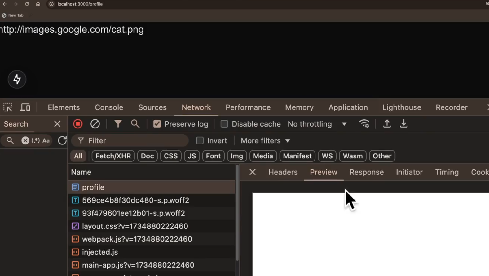 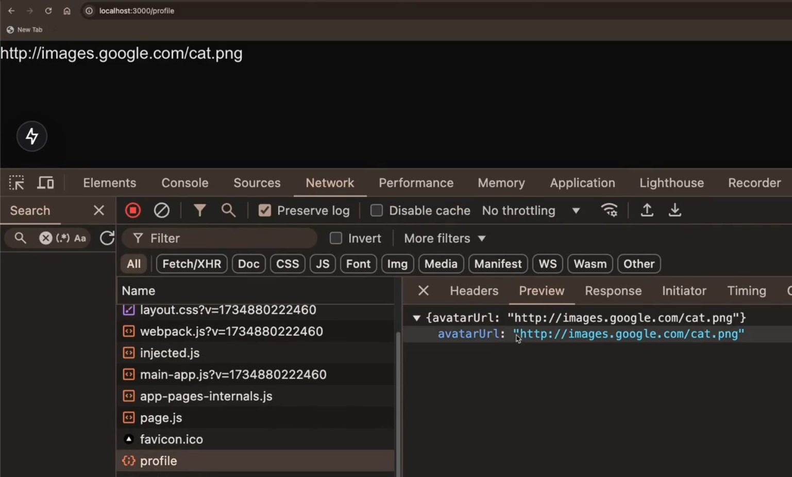

You are initially getting an **EMPTY `HTML` see the `profile` request which goes out, inside `preview` section(left pic above) and after some time, you are sending the `request` to `/profile` which in turn is returning `response` as `avatarurl`**

Ofcourse, you are sending the header (authorization header) which **reads the token from my local storage and that is being sent to the backend which in turn verifies the token and sends back the profile picture which is being propagated to the frontend**

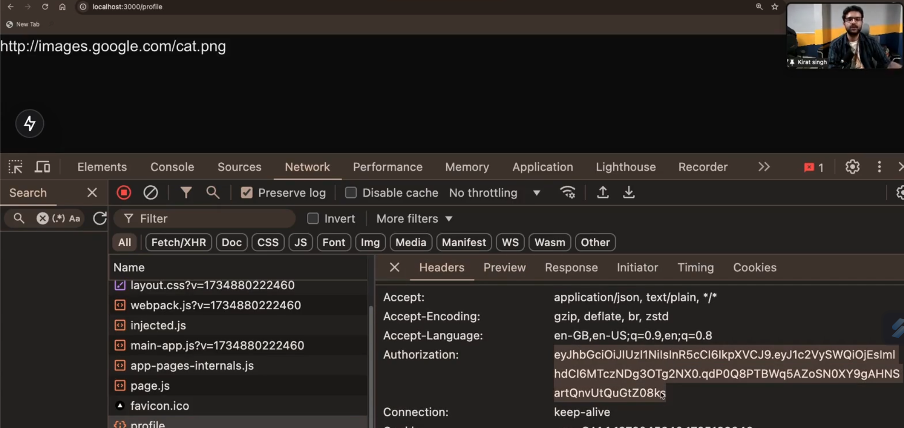

Now this is the classic example of **Client side rendering as you can clearly see the intial `HTML` was totally empty and to intialise the change on the frontend, i have to use `useEffect` and `useState` to propagate that change on the frontend and then after some time, the `js` code which you see gets run after then you sent the `request` to the `/profile` and you got the data which is reflected on the screen**

Basically, although you have achieved authentication using the same approach as that used in `react` + `express.js` but the problem is **when you are hitting the `profile` page, you are not getting the user's profile picture RENDERED from the server, you are not getting the benefit of SERVER SIDE RENDERING and hence this make no sense in using `Next.js` then**

If you want to do client side rendering then use `react` why to go for `Next.js`

Now comes the challenge that

:bulb:**How can i in the first `request` which goes be able to show the user's profile picture ??(this is what will be the real meaning of doing authentication in `Next.js`)**

You have seen above the first way (`react` way) of data fetching which is also the DUMB way. we do not use the above code instead we use this -> (`next.js` way)

```javascript
"use client"
import axios from "axios"
import {useEffect} from "react"

export async default function Profile(){ // making the component "async"

    const res = await axios.get("http://localhost:3000/api/profile", {  // 2
        headers : {
            authorization : localStorage.getItem("token")
        }
    })
    const profilePicture = res.data.avatarUrl

    return (
        <div>
            {profilePicture}
        </div>
    )
}
```

The above is the correct way for the data fetching as **isse in the first request only(first `HTML`) you would expect ki user's profile picture aa jayega BUT if you see the url -> "http://localhost:3000/profile", you will see the below ERROR coming on the screen**

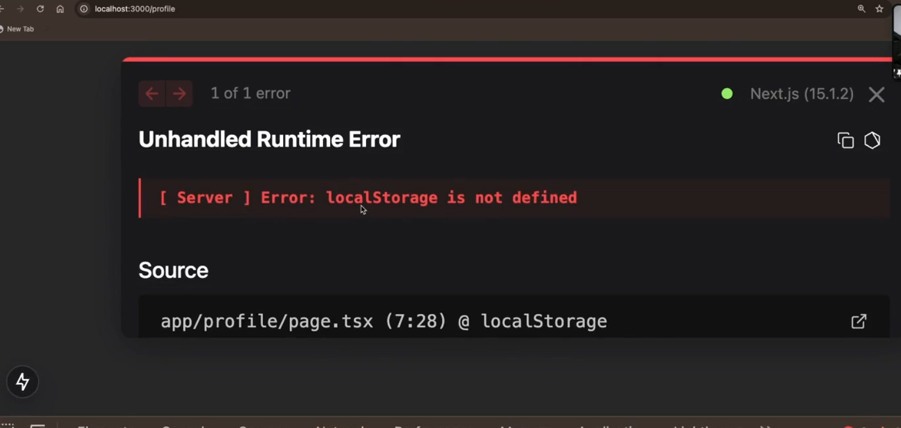

Now the above code is **running on the server (i.e. Server side rendering is taking place) or precisely saying on the `Next.js` server**, Now browser se `request` gya `Next.js` server pe (and **`Next.js` SERVER PE THODE `localstorage` EXIST KRTA H (ye to server h some virtual machine type thing) and hence you are seeing the ERROR as `Next.js` SERVER ko pta he nhi `localstorage` kya hota h**)

**Also as the first `request` is going from the `Next.js` server not from the browser and hence the FIRST `request` CAN NEVER CARRY YOUR AUTHENTICATION TOKENs as `localstorage` naam ka cheez `Next.js` server ko pta he nhi h**

**so `// 2` code block will not be applicable as you dont know who the person is here as they are not authenticating themselves as they are not able to send the token even they want then also not possible**

**Simply saying ->** [VERY VERY IMPORTANT POINT]

<span style="color:orange">**Tm first `request` me bhej to diye token but as that is stored in the `localstorage` and in `Next.js` the `request` comes to `Next.js` server (acts as backend) and `Next.js` ne jb code dekha usme `localstorage` dikha but `Next.js` server ko to ye pta nhi kya hota h hence it will throw error and also as the server dont know who you are so it will not give you SERVER SIDE rendered page**</span>

So to solve the above problem comes **NEXT AUTH**

## **Next Auth**

---

`Next.js` lets you add `Authentication` to your `Next.js` app ->

1. **It supports various `providers` such as ->**
    - Login with email
    - Login with google
    - Login with facebook
    - Login with Apple etc...

But before proceeding to code it lets first try to recall what we have learnt till now about the

## **Catch All route**

---

As discussed earlier,

If you want to add a single route handler for

1. `/api/auth/user`
2. `/api/auth/random`
3. `/api/auth/123`
4. `/api/auth/...`

You can create a `Catch All` route like the one created below to direct all the routes which come up after a particular route to a **common page made to handle them**

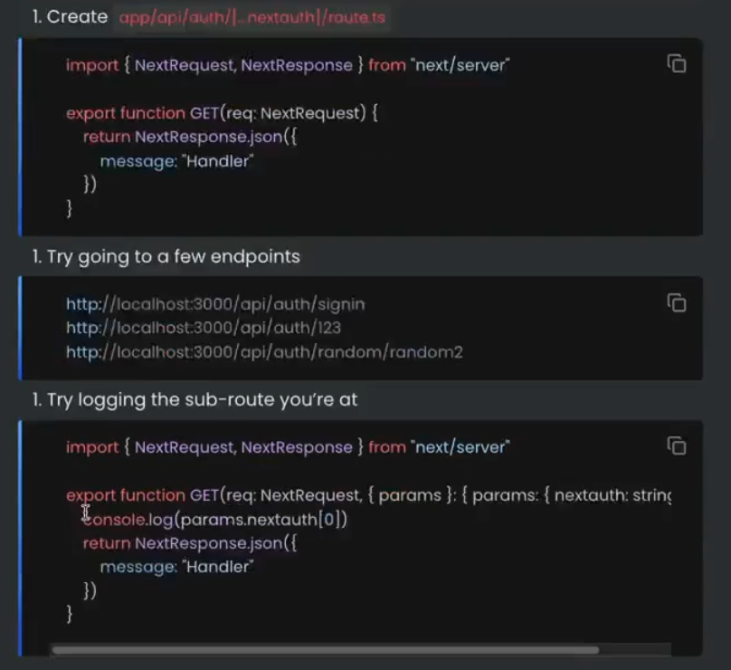

Another example can be the below part

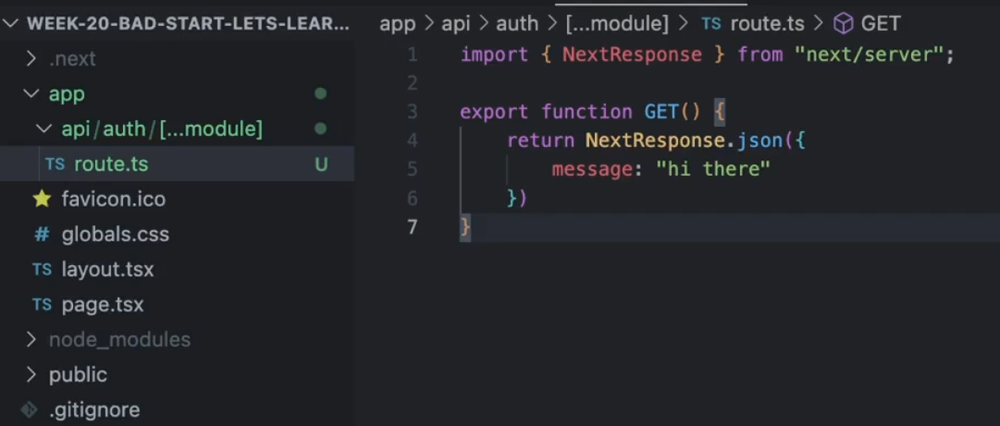

Now you can see the going to different url but you will get the same output ->

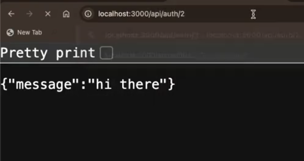 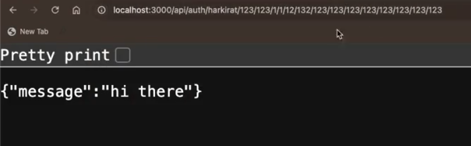

as long as a route is starting with `/api/auth/`, it will be caught by the above made `route`(i.e. catches any routes that starts with `/api/auth`)

**The reason for understanding the above concepts and recalling it is that NextAuth (the library which we are going to use here today) uses this concept only to AUTHENTICATE**

## **Coding NextAuth**

---

For details about this library -> [Next auth](https://next-auth.js.org/configuration/initialization#route-handlers-app)

### **Setup**

**Step 1 ->** Initialise a fresh `Next.js` project by using the command

```javascript
npx create-next-app@latest
```

**Step 2 ->** **Install the NextAuth library in your project**

```javascript
npm install next-auth
```

**Step 3 ->** lets use the Catch all concept to make the route so for this make a folder structure like the below

`app > api > auth > [...nextauth]` and inside the `[...nextauth]`, make a file named as `route.ts` which will have the **DEFAULT CODE present on the website (see the documentation)**

```javascript
import NextAuth from "next-auth";

const handler = NextAuth(); // some thing will be passed inside this function, will be discussed below // 2

export { handler as GET, handler as POST };
```

<span style="color:orange">**Any project which is using the NextAuth will have the same folder structure and similar code**</span>

Giving some of the examples ->

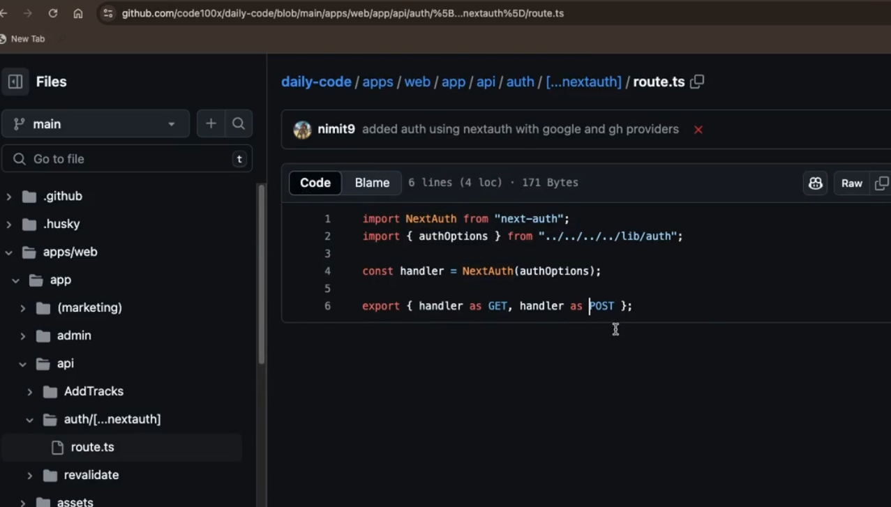

Notice the **fileroute as well the code**

**Explanation `// 2` code**

basically tm **NextAuth() function me who cheez pass krte ho jisse tm chahte ki user will login (ex -> login with google, email, facebook, tweeter, etc..) generally we call it PROVIDERS**

you can see the list of providers NextAuth supports -> [NextAuth Providers](https://next-auth.js.org/providers) but here we are going to use the **`Credentials` as a provider**

link to it -> [Credentials as provider in NextAuth](https://next-auth.js.org/providers/credentials)

**Reason for taking this as providers is simply that THEY ARE HIGHLY CONFIGURABLE (you can login with 10 different fields or just one is enough(just the password), depends on how your app is structured) also it is HARDER among all of the providers such as login with google, facebook, etc..**

### **Credentials as provider in NextAuth**

---

**Overview**

The Credentials provider **allows you to handle signing in with arbitrary credentials,** such as a `username` and `password`, **domain**, or **two factor authentication or hardware device (e.g. YubiKey U2F / FIDO).**

It is intended to support use cases where you have an existing system you need to authenticate users against.

It comes with the **constraint that users authenticated in this manner are not persisted in the database, and consequently that the Credentials provider can only be used if JSON Web Tokens are enabled for sessions.**

so adding the credentials `providers` to the code written above

> :pushpin: <span style="color:orange">**Remember ->**</span>**"providers" key is the ARRAY of all the way of authentication you want to provide to the user for login / authenticating.**

```javascript
import NextAuth from "next-auth";
import CredentialsProvider from "next-auth/providers/credentials"; // FIRST importing the CREDENTIALS provider

const handler = NextAuth({
    providers: [
        CredentialsProvider({
            name: "email", // frontend pe kya dikhna chahiye (this simply means that "Sign in with )
            // The name to display on the sign in form is given inside the "name" key (e.x -> if you give name : "email" then on frontend it will be shown "Sign in with email" if name : "xyz" then on frontend you will see "Sign in with xyz" and so on means "Sign in with" common rhega)
            credentials: {
                // basically what all INPUT FIELD we want from the user ??
                username: {
                    label: "Username",
                    type: "text",
                    placeholder: "Satyam12@",
                },
                password: { label: "Password", type: "password" },
                // "credentials" OBEJECT is used to GENERATE a form on the Sign in page
                // You can specify which fields should be submitted, by adding corresponding keys to the "credentials" object
                // ex -> can be username, password, 2FA token, etc...
                // You can pass any HTML attribute to the <input> tag through the object
            },
            // and lastly it has of course a FUNCTION named here as "authorize" to do authentication
            async authorize(credentials, req) {
                // Add logic here to look up the user from the credentials supplied
                // so Extracting the credentials provided by the user
                const username = credentials?.username;
                const password = credentials?.password;

                // and then doing the db request to check if the username and password are correct
                // writing the logic for it (we are coding the credentials provider page for user)
                // For now lets say the database returned you something like the one written below and you stored it inside the "user" named variable ->
                const user = {
                    name: "harkirat",
                    id: "1",
                    email: "harkirat@gmail.com", // as database me to boht kuch store hota h ek user ke corresponding to sb kuch wo return kr dega
                };

                if (user) {
                    return user; // you returned the details to the user
                } else {
                    return null;
                    // If you return null, then an ERROR will be displayed advising the user to check their details provided

                    // You can also REJECT the callback with an ERROR thus the user will be sent to the ERROR page (default ERROR page provided by the Next.js)
                }
            },
        }),
    ],
});

export { handler as GET, handler as POST };
```

You have just written this much code and now if you go to the http://localhost:3000/api/auth/signin and see the result there -

**Output ->**

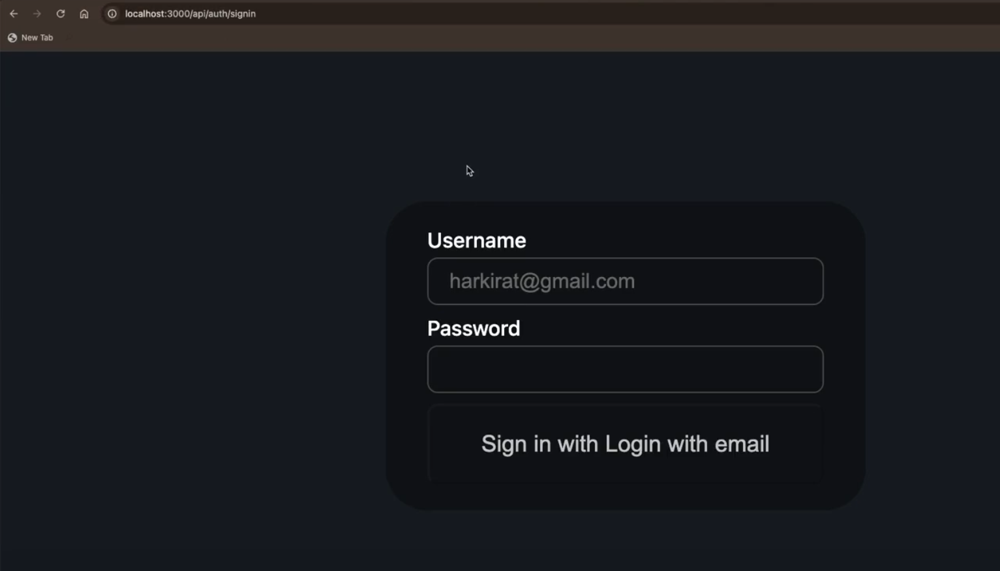

Notice you dont have to make any component or `HTML, CSS` code for this. (**Of course you can make it preetier by overiding it**)

Now you just have to add fields inside the `credentials` key and you will be able to see another field for ex ->

```javascript
adminPassword : {label : "Admin Password", type : "password"}
```

and now if you go the same url as above then you will see something like this ->

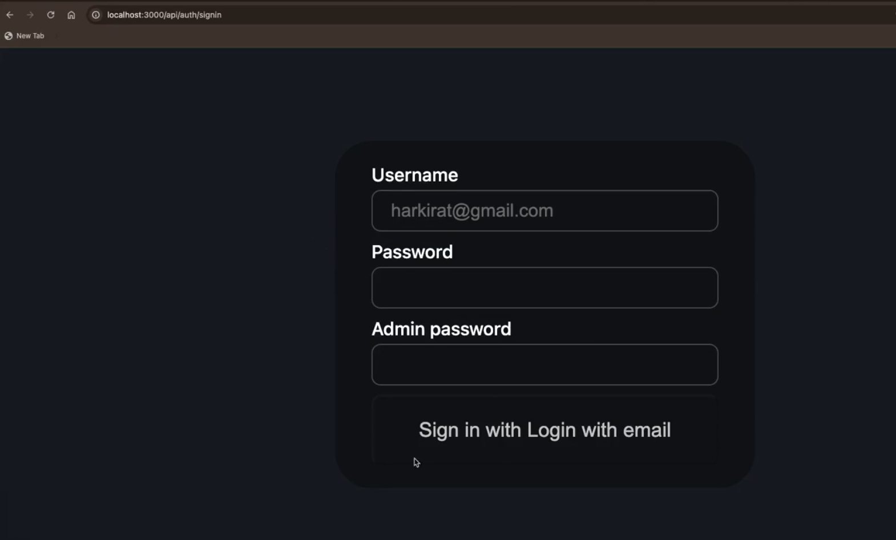

`Admin Password` field has also been loaded or added.

Lets understand the code flow of the above code,

1. user will come to the website, put its `username` and `password`
2. as soon as it clicks on the `Sign in with Login with email`, a **request will go to the backend**
3. the `request` will eventually reach to the line of code where `async authorize` part of code is written and then that codeblock will run
4. you will do the check by doing the **db call to check in the database**
5. and if the user is correct then you will return their details and they will get logged in and if not then they **will not be logged in**

**The best thing about this is once you log in, it will AUTOMATICALLY REDIRECT you to the MAIN PAGE as you see with the normal website you see in practical**

The image of the output if you will `return null`(means user has not provided the correct details) in the above code written (see the `else` part of the code)

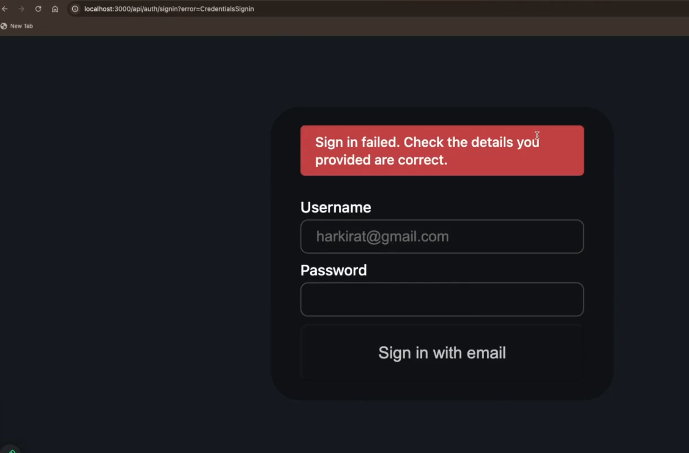

Now lets say **i want to add "Sign in with google" then its quite easy**

### **Google and Github as provider in NextAuth**

---

documentation to do this -> [NextAuth providers(google)](https://next-auth.js.org/providers/google)

Just add the below line of code to add `Sign in with google` in the above code written above

```javascript
import NextAuth from "next-auth";
import CredentialsProvider from "next-auth/providers/credentials";
import GoogleProvider from "next-auth/providers/google"; // FIRST importing the GOOGLE provider
import GithubProvider from "next-auth/providers/github"; // Importing the GITHUB provider also for another option to sign in with Github

const handler = NextAuth({
    providers: [
        CredentialsProvider({
            // same logic as above so no need to add here
        }), // as we are adding another provider -> "google" in the ARRAY of "providers"
        GoogleProvider({
            // we will see below from WHERE you will get these "clientId" and "clientSecret" for google
            clientId: process.env.GOOGLE_ID,
            clientSecret: process.env.GOOGLE_SECRET,
        }), // similar to this you can also add GITHUB sign in also just by first importing and then adding the similar code like the above for google
        GithubProvider({
            clientId: process.env.GITHUB_ID,
            clientSecret: process.env.GITHUB_SECRET,
        }),
    ],
});

export { handler as GET, handler as POST };
```

**The more you want to add options, the more corresponding providers you will have to import and add in the "providers" ARRAY**

**0utput ->**

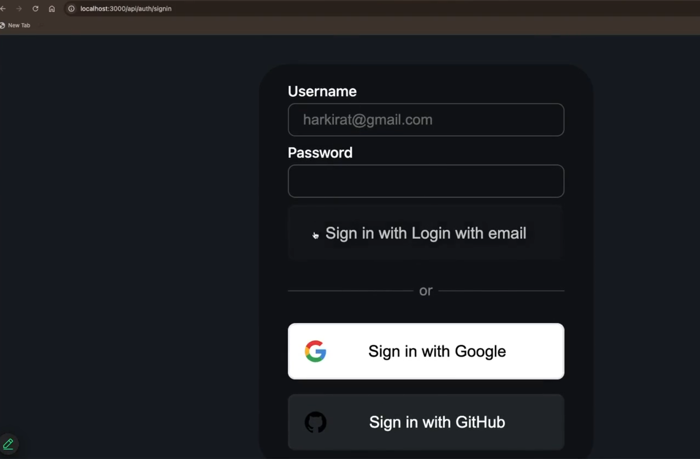

Notice without writing the logic for button for `sign in with Google` and `sign in with Github` it has appeared on the screen

Of course the button will not work now as we have not written the code for it (which we will at later point of time)

## **Some important authentication part**

:bulb:**How to show that the user is Logged in or simply saying how to show them Logout button, if they are not logged in, then how to show them the login button and things like these ??**

-> answering them one by one

### **Logic to display on the main page fully functional authorization buttons (ex -> signin, logout)**

-> as we want to display it on the **Main page** hence we will do this inside the route `/` or indirectly inside `app` folder, `page.tsx` we will write the following code -> (Remove all the things which comes pre-attached while initialising the EMPTY `Next.js` project)

:bulb:**How to know whether the user has signed in or not ??**

-> There are 2 ways to do this -> (depends on which type of component you want to choose ??(CLIENT or SERVER))

#### **using `useSession` hook**

---

**1st Way -> using `useSession` hook [EASIER way]**

inside the `app` folder, `page.tsx`

```javascript
"use client"
import {useSession} from "next-auth/react" // Importing from the next-auth library

export default function Home(){
    const session = useSession() // using the "useSession" hook provided by the Next.js

    return(
        <div>
            {session.status === "authenticated" ? {Logout} : {Sign in}} // simply means that if the user is authenticated then show Logout component otherwise Sign in component(of course you will import these component from some folder where you have made them, which i have not done here to simplify then understanding)
        </div>
    )
}
```

> :pushpin:**`useSession` is a hook provided by the `Next.js` to know whether a user has been logged in or logged out and show the corresponding opposite button/page of that [Basically easiest way to check if someone is signed in or not]**
>
> > **You should use it on the client side i.e. (this is client component) so you have to add `"use client"` at the top of your code**

But the **BIGGEST PROBLEM with using the `useSession` hook is that YOU HAVE TO WRAP IT INSIDE THE SESSION PROVIDER or simply saying YOU HAVE TO PROVIDE THE SESSION PROVIDER for it to work**

:bulb:**What is Session Provider ??**

-> Recall the providers, we have learnt inside the `Recoil` or more precisely `Context API`(there also we have used providers)

:bulb: **How to warp it inside the SESSION PROVIDER ??**

-> **DUMB WAY -> Make another component and wrap the logic inside it and then shift the newly made component to the `Home` component by wrapping inside the `<SessionProvider></SessionProvider>`.**

You will do something like this ->

```javascript
"use client"
import {useSession, SessionProvider} from "next-auth/react"

export default function Home(){
    return (
        <SessionProvider>
            <RealHome /> // Wrapped inside the <SessionProvider> and shifted the made component to main component
        <SessionProvider>
        // You can remove the Top level <div> also as rule to follow ho he rha h(ek he top div to return ho rha h component se)
    )
}
// Make another component
function RealHome(){ // and inside it moved all the logic written in the main component
    const session = useSession()

    return(
        <div>
            {session.status === "authenticated" ? {Logout} : {Sign in}}
        </div>
    )
}
```

<span style="color:orange">**This is similar to `<RecoilProvider>` which you used to do inside the `Recoil`**</span>

> :pushpin:<span style="color:orange">**Remember ->**</span>**MAKE SURE `useSession` hook jahan v use ho rha h tm usko WRAP KRO inside the `<SessionProvider></SessionProvider>`**

Lets make out a working `log out` and `sign in` button which works as expected(jis kisi ko v click kroge wo kaam ho jayega)

```javascript
"use client"
import {useSession, SessionProvider, signOut, signIn} from "next-auth/react"

export default function Home(){
    return (
        <SessionProvider>
            <RealHome />
        <SessionProvider>

    )
}
function RealHome(){ // REMEMBER as "useSession" is CLIENT COMPONENT and hence you cant make this component "async" and hence you cant do any thing which requires the use of "await" keyword (ex-> something related to DATABASE or API CALLs)
    const session = useSession()
    // Taking the above point in mind you cant do something like this
    const profileInformation = await axios.get("https://localhost:3000.profile"),{
        headers : { // headers you want to pass on from session
            session
        }
    }
    // OR SOMETHING LIKE THIS // 2
    const profileInformation = await db.user.findOne({
        where : {
            email : session.email
        }
    })

    return(
        <div>
            {session.status === "authenticated" && <button onClick = {() => signOut()}>Logout</button>} // means if the user is authenticated means he / she should see the Sign out button AND clicking on it should make them sign out from their account
            // "signOut" is a PREDEFINED function present inside the "next-auth/react" that has the functionality to sign out the user which is currently logged in
            {session.status === "unauthenticated" && <button onClick = {() => signIn()}>Sign In</button>}
            // Similar to "signOut", the library provides the "signIn" function logic also
        </div>
    )
}
```

Seeing it in practical ->

by default ->


clicking on `Sign in` button will **redirect you to `sign in` page we made**

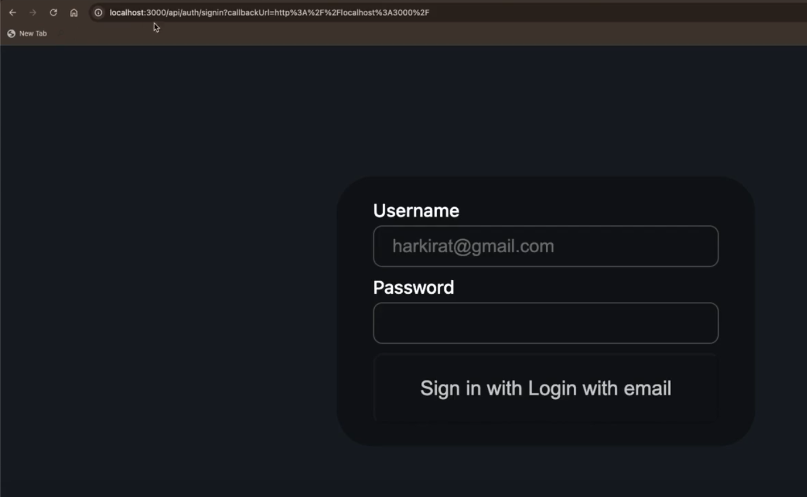

After filling the details, and then clicking on the `Sign in with Login with email` it will redirect you back to the main page where you will now see `Logout` button now instead of `Sign in` button


Now if you click on `Logout` button, then you will again be able to see the `Sign in` button on the main page (as you have now logged out) [**Even if you keep refreshing the page then also the user will remain signed in, unless and until you click on the logout button**]


and **hence the AUTHENTICATION works**

<span style="color:orange">**But what we have did above is CLIENT SIDE AUTHENTICATION(basics of it).**</span>

Lets try to see what the `useSession()` or the variable storing its **returned value has inside it by adding**

```javascript
{
    JSON.stringify(session);
} // just below the return codeblock sigin logic
```

if the page has **Sign in** button then (see left pic) and if **Logout** button present on the main page then (right pic, which consists of `Sign in`)

 

The value you are seeing in the right pic is the HARDCODED value you have given in the `route.tsx` present inside the `app > api > auth > [...nextAuth]` to make the website work for the time being (you can also see above, you have only given these values)

Now you can notice not all the values(some values it has ignored) we have hardcoded and given inside the `route.tsx` is coming inside the right pic attached above (**we will come to this why this is happening and how you can add more fields here**)

Now comes here the **problem here which is INDICATED in `// 2`**

> :pushpin:<span style="color:orange">**REMEMBER ->**</span>**Client component kbhi bhi `async` nhi ho skte h**

taking note of the above point and `// 2` code block, **How to show the profile information (like avatar of the user or other information like this) ??**

To make them show the user profile picture, we will have to **add `useEffect` here and hence you will come back to the same original problem(client side rendering)**

<span style="color:orange">**and this is where another hook comes into the action known as `getServerSession` hook**</span>

#### **using `getServerSession` hook**

---

**2nd way -> using `getServerSession` hook**

**The above hook is similar to `useSession` hook except for the difference that this hook is compatible with SERVER COMPONENTS as it is itself SERVER COMPONENT and hence is able to perform SERVER SIDE RENDERING of what we were doing above**

:bulb:**Why despite being a hook its name does not starts with `use` instead it starts with `get   ` ??**

-> as **SERVER COMPONENT dont RE-RENDER so there is no point of calling it hook even and hence we have not named it as we name it for other used hooks**

:bulb:**What we were doing in the 1st way ??**

-> basically the client was hitting the backend, getting the session and populating the frontend

BUT if we now use the `getServerSession` and try to transform the above code using this ->

```javascript
import {getServerSession} from "next-auth" // Notice "useSession" was imported from "next-auth/react", here "react" also hints that "useSession" will run on the client side but here "getServerSession" is imported from "next-auth" and hence it CLEARLY shows that it is SERVER component

export async default function Home(){
    const session = await getServerSession()

    return (
        <div>
            {JSON.stringify(session)}
        </div>
    )
}
```

In just writing the above logic we were able to **achieve SERVER SIDE RENDERING as if you will now see**, the first `request` which goes out in this case has already some content(**PRE-POPULATED**) inside it instead of what was happening in the 1st way (where the 1st `request`which came has nothing and then after some time wee sent other request (`session` one) and then the frontend got populated)

Now running the above code but before running it first make -> a file `.env` inside the global folder where **add the `NEXTAUTH_SECRET` variable here as**

```javascript
NEXTAUTH_SECRET = 123er45 // (any random for now)
```

and then adding `secret` alos inside the codeblock of `route.tsx`

```javascript
import NextAuth from "next-auth";
import CredentialsProvider from "next-auth/providers/credentials";

const handler = NextAuth({
    providers: [
        CredentialsProvider({
            name: "email",
            credentials: {
                username: {
                    label: "Username",
                    type: "text",
                    placeholder: "Satyam12@",
                },
                password: { label: "Password", type: "password" },
            },
            async authorize(credentials, req) {
                const username = credentials?.username;
                const password = credentials?.password;
                const user = {
                    name: "harkirat",
                    id: "1",
                    email: "harkirat@gmail.com",
                };

                if (user) {
                    return user;
                } else {
                    return null;
                }
            },
        }),
    ],
    secret: process.env.NEXTAUTH_SECRET, // adding the "secret" key here
});

export { handler as GET, handler as POST };
```

> :pushpin:<span style="color:orange">**REMEMBER ->**</span> **`.env` file me jo v variables defined h wo apne app IMPORT ho jate h wherever you will use them BUT IN `Next.js` this happens for others, you know you have to import it and then use it**

Now if you run the project and sign in and then if you see the `request` which goes out and its corresponding `response`

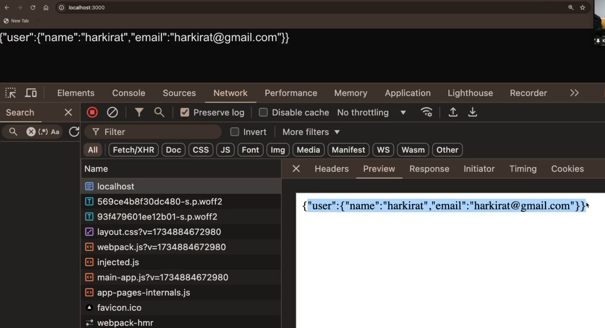

Notice in the first request you were able to populate the frontend

Now if i go to the `page.tsx` or **profile** page

```javascript
import {getServerSession} from "next-auth"

export async default function Home(){
    const session = await getServerSession() // Basically FIRST you are getting the data of the user that KAUN H YE BANDA
    const userProfile = await db.avatars.findOne({ // then rendered all the info. on the server  available in the db for this corresponding BANDA by logic for finding that BANDA
        where : {
            email : session.email  // backend se tm email extract krke frontend pe show kr do
        }
    })

    return ( // and finally from server readymade page client side render ho gya and in this way we have achieved SERVER SIDE AUTHENTICATION
        <div>
            {JSON.stringify(session)}
        </div>
    )
}
```

This helps to **achieve the PRE-RENDERED AUTHENTICATION (or simply saying SERVER SIDE AUTHENTICATION)**

## **Middlewares in `Next.js`**

---

Lets recap what we have learnt about the middlewares till now,

:bulb:**What are Middlewares ??**

-> Middlewares are **code that runs before / after your request handler.**

It's commonly used for things like

1. **Analytics**
2. **Authentication**
3. **Redirecting the user**

> [!NOTE]
> Till now **Middleware in `Next.js` is not so common due to its weird(IMMATURE, may get better over time) way of implementation and as middlewares are mostly used for authentication which in `Next.js`, NEXTAUTH beautifully fulfills the requirement and hence middlewares in `Next.js` is not so common**

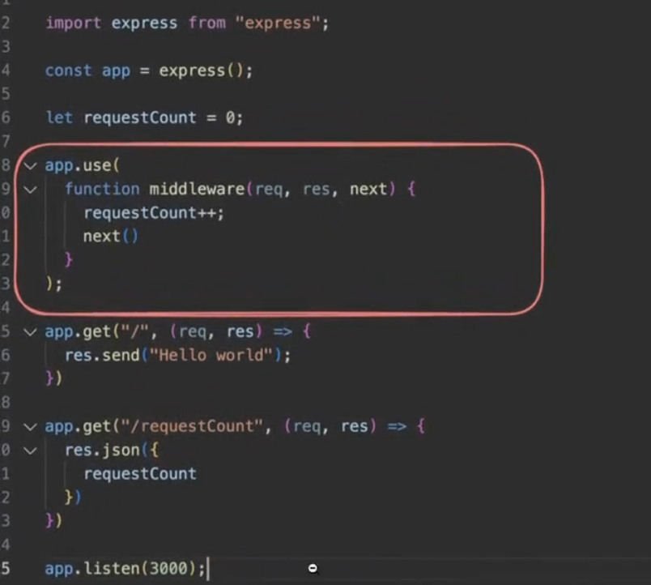

**Above is the example of using the middleware for ANALYTICS PUTPOSE (here you are trying to COUNT the number of request came on `/` or `/requestCount` endpoint)**

`app.use()` makes sure that everytime any of the `request` is going on `/` and `/requestCount`, first the **Middleware logic present inside it will run and then they will go to their respective routes and show the corresponding contend of that route**

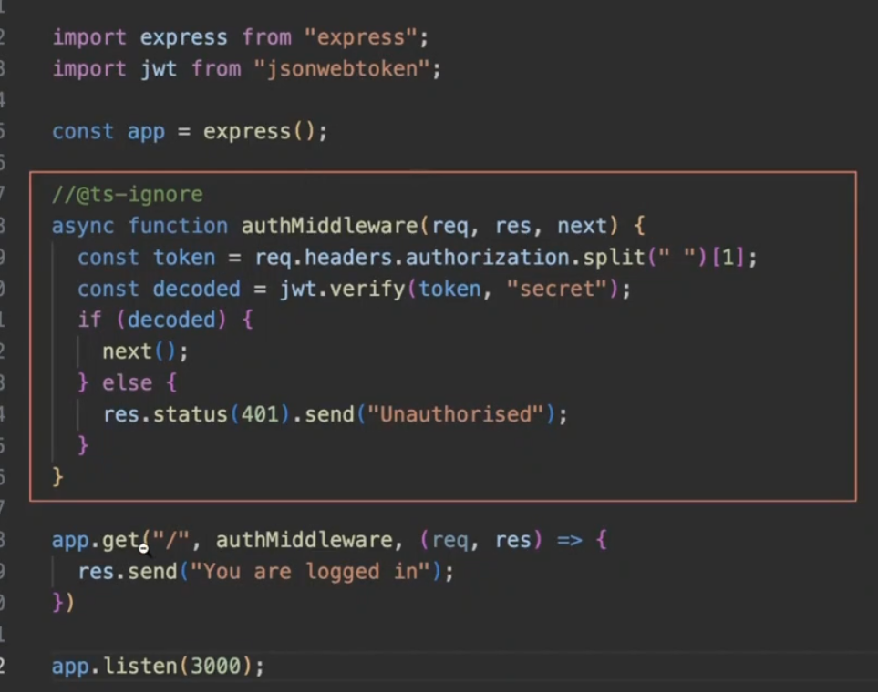

**Above is the example of using the middleware for AUTHENTICATION PURPOSE (here you are giving the user access (or redirecting the user to the page) to a particular route only if through the Middleware, it has successfully passed and authenticated)**

### **About Middlwares in `Next.js`**

---

Documentation -> [Middlewares in `Next.js`](https://nextjs.org/docs/app/api-reference/file-conventions/middleware)

Middleware allows you to run code before a request is completed.

Then, based on the incoming request, you can modify the response by

1. rewriting
2. redirecting
3. modifying the request or response headers
4. or responding directly.

#### **Use cases**

---

-   **Authentication and Authorization:-** Ensure user identity and check session cookies before
    granting access to specific pages or API routes.

-   **Logging and Analytics:-** Capture and analyze request data for insights before processing by
    the page or API.

-   **Server-Side Redirects:-** Redirect users at the server level based on certain
    conditions (e.g.. locale, user role).

-   **Bot Detection:-** Protect your resources by detecting and blocking bot traffic.

### **Coding up the middleware in `Next.js`**

---

**Step 1 ->** Initializing an empty `Next.js` project

```javascript
npx create-next-app
```

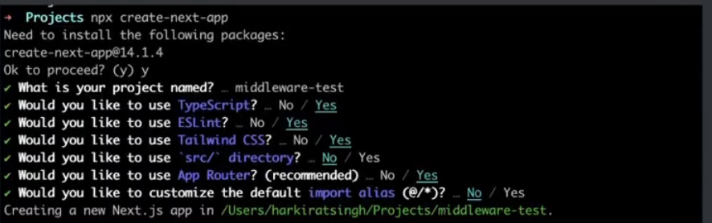

**Step 2 ->** Install the dependencies

```javascript
npm install
```

**Step 3 ->** Creating `middleware.ts` file inside the root folder

> [!IMPORTANT] > **While only one `middleware.ts` file is supported per project**, you can still organize you rmiddleware logic modularly. **Break out middleware functionalities into separate `.ts` or `.js` files and IMPORT them into your main `middleware.ts` file. This allows for cleaner management of route-specific middleware, aggregated in the `middleware.ts` for centralized control. By enforcing a single middleware file. it simplifies configuration, prevents potential conflicts, and optimizes performance by avoiding multiple middleware layers.**

The above is also one of the reason why `middleware` in `Next.js` is weird as most other frameworks or library(like `express` and `react`, etc..) never say you that you should have only one `middleware.ts` file

Now lets see how the ANALYTICS purpose of middleware in `Next.js` is fufilled

Below is the code to track the number of requests

```javascript
import { NextResponse } from "next/server";
import type { NextRequest } from "next/server";

let requestCount = 0;

export function middleware(request: NextRequest) {
    requestCount++;
    console.log("Number of requests is " + requestCount); // You can run some logic before the middleware does its work
    const res = NextResponse.next(); // doing the work of next() function while using middleware in next.js
    return res; // and even after the middleware you can also write the logic
}
```

So **Now before any of your endpoint(frontend or backend) is hit, this piece of code will run**

**Example of implementing the above in Backend route as well**

:bulb:**Create a requestCount middleware to track only requests that start with `/api`**

**Add a dummy API route `api/user/route.ts`**

```javascript
import { NextResponse } from "next/server";

export function GET() {
    return NextResponse.json({
        message: "hi there",
    });
}
```

**Update global `middleware.ts` made**

```javascript
import { NextResponse } from "next/server";
import type { NextRequest } from "next/server";

let requestCount = 0;
export function middleware(request: NextRequest) {
    requestCount++;
    console.log("number of requests is " + requestCount);
    return NextResponse.next();
}
```

**Till now you have figured out the problem with middleware in `Next.js`**

<span style="color:orange">**The biggest problem with the middleware is that it RUNS ON ALL ROUTES so if i want to make work middleware on some of the routes only, then `Next.js` middleware becomes MORE WEIRDER to implement**</span>

:bulb: **Lets see how to restrict the middleware to some specific route in `Next.js` ?**

### **Selectively running middleware**

---

**Simply means how can you run the middleware on the particular route only ??** and this where it gets <span style="color:orange">**COMPLICATED and WEIRD**</span>

**Approach 1 -> using `export config`**
Now you can add the below line of codeblock inside the global `middleware.ts` file to **Restrict the middleware to run only on ONE TYPE OF paths**

```javascript
import { NextResponse } from "next/server";
import type { NextRequest } from "next/server";

let requestCount = 0;
export function middleware(request: NextRequest) {
    requestCount++;
    console.log("number of requests is " + requestCount);
    return NextResponse.next();
}

// Adding this will restrict the above written middleware to run only on specific routes or path (For ex -> here the above code(middleware) will run only for endpoint which have -> "/api/any_thing", basically "api" ya iske baad kuch v route ho ye logic chlega otherwise nhi chlega)
export const config = {
    matcher: "/api/:path*",
};

// BUT AGAIN THE DONWSIDE of this is -> you can only give ONE MATCHER so (it will run only on one type of route) but what if i want this logic to run on both "/api/user" and "page/a.html" (then this thing will not work)
```

**Approach 2 -> perfect filtering by the below approach (little or very weird to be hones)**

```javascript
import { NextResponse } from "next/server";
import type { NextRequest } from "next/server";

export function middleware(request: NextRequest) {
    console.log(request.nextUrl.pathname);
    if (request.nextUrl.pathname.startsWith("/admin")) {
        // Basically you are EXTRACTING the current path name (request.nextUrl.pathname) that STARTS WITH(.startsWith) name "/admin"
        return NextResponse.redirect(new URL("/signin", request.url)); // then write some logic here (be it checking one or as given here -> redirecting the user to "/signin" endpoint), you can also do the check here that those who have not access (i.e. not logged in) and trying to access a particular route, then that user will be redirected to signin page (again wrap it in "if" statement) // 2
    }

    if (request.nextUrl.pathname.startsWith("/dashboard")) {
        // similar to above if the current path consists of the name that starts with "/dashboard" then
        return NextResponse.next(); // do the logic
    }
}
```

**Clearly you can see that there are lots of `if` statements and that makes the implementation of middleware in `Next.js` WEIRD as well as UGLY Looking**

**Extra knowledge about part `// 2`**

-> here in this line of code in `Next.js`, **In the very first request it will get RE-DIRECTED to `/signin` page but if you were using `react` then the very first `request` won't RE-DIRECT the user(as it has some `html`, `css` and `js` code and only when `js` code present will run (as it is the file which have logic of re-directing), then only it will RE-DIRECT the user to `sign in` page)**[ simple CSR v/s SSR stuff ].

Reference -> [Example of Selectively running middleware](https://github.com/code100x/cms/blob/main/src/middleware.ts)

The above `Reference` part is **used to Restrict two or more people logged in with same id at any particular point of time**[newer ones will get the access and the previous ones will log out]

**Basically works on the token timeline (if the newer token has created(i.e. new user has logged in with same credentials) then just log out from the page where the previous token(outdated token) is present and hence redirect them back to the log in page (end the session basically for old user now))**[The above `reference` link has this logic only in coding way]

And the above is one of the usecase of really using middleware in `Next.js`, other than this, things may get complicated and weird when it comes to implementing middleware in `Next.js`
