# **Next.js continued**

## **What we've convered**

1. Next vs React 
2. CSR vs SSR
3. SEO optimisations
4. File based routing (App router)
5. "use client" directive 
6. Backend routes in `next.js`
7. Data fetching in `next.js`
8. `async` components, server components

**What's left**

1. `()` - **Route groups**
2. `[]` - **Dynamic Segment**
3. `[...]` - **Catch-All segment**
4. Middlwares in `next.js`
5. **Static site generation**
6. **Hydration**

## **Route Groups ()**
----------

**`()` is called as PARENTHESES in programming**

+ Parentheses allow you to __create grouped routes that do not affect the URL path.__
+ For example, if you have a folder named `(marketing)` or `(auth)` (Notice the parentheses attached to the name), `Next.js` will not include `(marketing)` or `(auth)` in the URL — it's just an organizational tool to group certain routes or apply layouts without changing the URL structure.[the above example is taken from the below link] 

Ref - https://github.com/code100x/cms/tree/main/src/app/(marketing)

> :pushpin:**Remember -> To whatever the folder you put this barcket with the name, it gets IGNORED by the APP ROUTER present in `next.js`**

**Why would you try to ignore the route (or folder) as isse acha bnao he mt ??**

-> Below are the main reason why you should do this :-

+ **Structuring ->** It helps to structure the project. If you want to put something inside the parent folder and that is not really needed to be a route then you can IGNORE them and in this case then, **The role of this comes into the picture** 
+ **Lower down the number of Routes / Shorten the URL ->** With this your url becomes short as you are trying to ignore some of the routes
+ **Most important Reason is ->** see below and lets try to understand it by doing an Assignment 

**Assignment**

Create a `signup` and `signin` page in a `nextjs` app where both of the pages are wrapped in a layout, but no other pages are.

The website supports three pages

1. `/signup`
2. `/signin`
3. `/user`

taking the main problem statement into the consideration, you basically have to wrap the `signup` and `signin` inside the **layout**, BUT not the `user`

So from the knowledge we have gained till now, we will proceed something like this :-

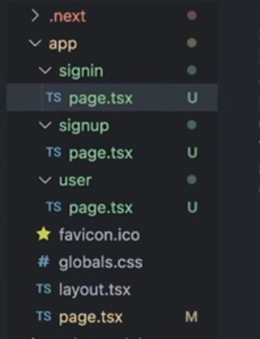

**1st way ->**

Creating three routes(or folders) named as `signup`, `signin` and `user` and as there is already a `layout.tsx` (also called as **Root Layout as it is present inside the `app` folder**) that is ACTING as WRAPPING ALL THE THREE ROUTES inside one `layout` file 

Now inside the `layout.tsx` file, you can apply somthing like the below that 

```javascript
export default function RootLayout({
  children,
}: Readonly<{
  children: React.ReactNode;
}>) {
  const route = useRoute(); // Create a custom hook that knows what the current route is  
  return (
    <html lang="en">
      <body>   // If the current route is "signup" or "signin", then only render the following things, for other routes (here "user"), dont do anything
        {route == "signin" || route == "signup" ? <div>header</div>}
        {children}
        {route == "signin" || route == "signup" ? <div>footer</div>}
      </body>
    </html>
  );
}
```

The above approach is very dumb way of doing the above thing, as you can clearly see that **Rootlayout is CROWDED as at last you will have a bunch of `if-else` statement**


**2nd way ->**

You can do like this -> make a seperate folder (or route) and name it as `(auth)` lets say and then inside that make two folders named as `signup` and `signin` and then inside that make `layout.tsx` (this `layout.tsx` file will apply to only `signup` and `signin` as it is present inside the `(auth)` folder) and then make the `user` folder outside (i.e. -> inside the `app` folder) and you are good to go but this is slightly better way to handle the things

lets try to code the `layout.tsx` file

```javascript
import {ReactNode} from "react"

export default function ({children} : {
  children : ReactNode // "ReactNode" basically means any component in REACT 
}){
  return (
    <div>
      <div>header</div>
      {children}
      <div>footer</div>
    </div>
  )
}
```
Now the above **Layout will only render on `signin` and `signup` page**

This is basically the biggest advantage of the `() Route Groups`, that without changing the **Routes, you can specifically apply the route to particular routes**

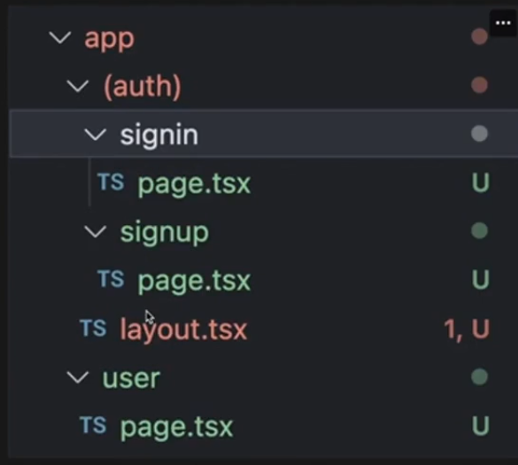

:bulb:**What will happen if two or more different routes groups have the same folder ex -> - (auth)/user and (middleware)/user**

-> means you have done something like this ->

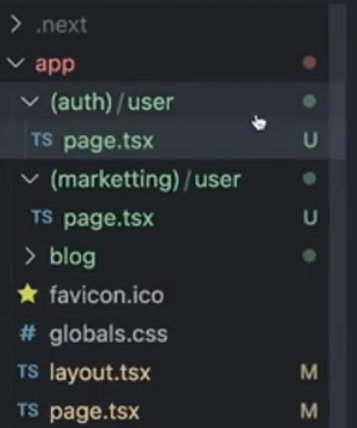

**Means CONFLICTING names have been given inside different folder with Route Groups `()`**

In this case **YOU WILL GET AN ERROR something like this saying that you cant have two same names for the same route**

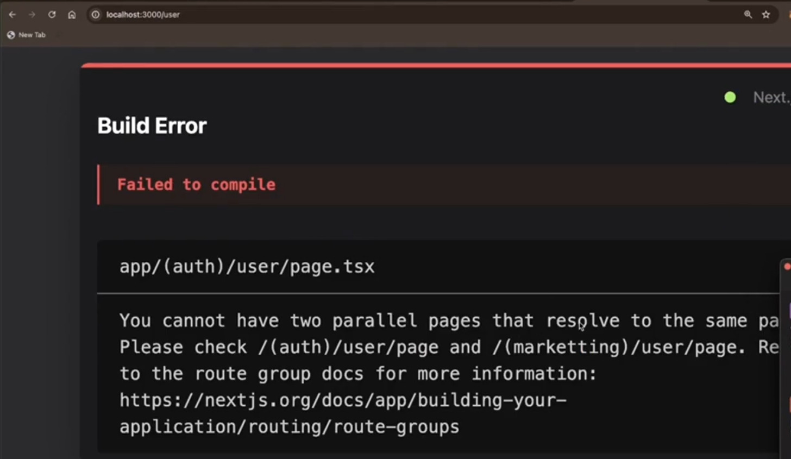

## **Dynamic routes []**
----------
A folder or file in the form `[slug]` defines a __dynamic parameter__ in the route (e.g., `/blog/(slug)` might match `/blog/hello—world` or `/blog/another—post` ).

Inside your components, you can access this parameter via `params.slug`.

:bulb:**What is `slug` ??**[Interview question]

-> A **Short Hand for the `blog` post** For ex -> a video which has a title and your url also contains the title of the video, this will be called as **slug**

**Basically a unique name for that specific page**

**Assignment**

:bulb:__Lets say you have to do something like this ki jb url -> "http://localhost:3000/blog/1" ho to blog 1 aa jaye and so on means jis no. blog ho wo aa jaye, How will you do this ??__

-> you will say that i will do something like this ->

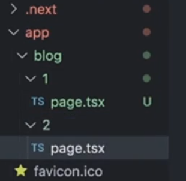

But the above approach is **PROBLEMATIC as what will happen if the `3rd` page comes in and as `blogs` are fairly DYNAMIC, so you cant predict the no. of blogs which can come and hence HOW MANY FOLDERS WILL YOU CREATE HERE**

so basically, the **ROUTES (or folders) are not DYNAMIC**

**Assignment**

:bulb:**Create a frontend for a `todo / posts` application. Backend is at**

"https://jsonplaceholder.typicode.com/posts/1"

When the user comes to `localhost:3000/post/1`, they should see the post rendered from `https://jsonplaceholder.typicode.com/posts/1`. It __should be a server components__, feel free to use `axios`

The above line simply means that when the user goes to `localhost:3000/post/1`,it should send the **backend request to `https://jsonplaceholder.typicode.com/posts/1` and the `post 1` should be renderd through the BACKEND RESPONSE came from the `request`**, basically we know __how to forward the request to the backend server__ and we can made this but you have to make a frontend that is able to **handle the DYNAMIC parameters in the URL** so basically dont create the seperate folder like the above pic instead **Create the DYNAMIC FOLDER like the below**

>:pushpin:<span style="color:orange">**Remember ->**</span> **To create the Dynamic Route, you have to wrap the folder inside the BIG SQUARE BRACKET `[]` and that's it you have made the DYNAMIC ROUTE**

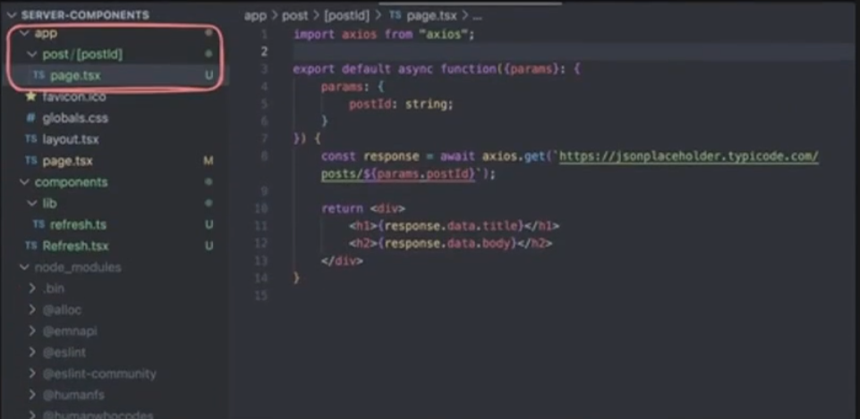

Basically lets understand what does this means, lets understand by taking an example ->

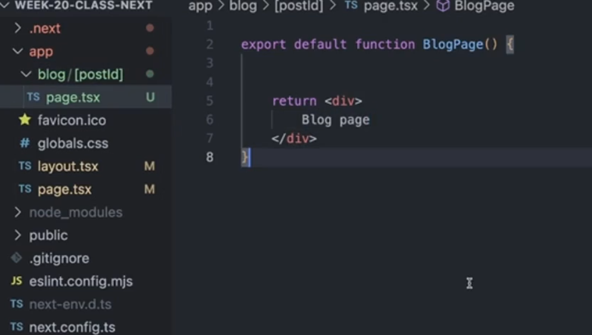

Now doing the above thing will make the **Dynamic route [postId] means jo v `/blog/anything_from_now` will be having this `page.tsx` applies to it, BUT remember `/blog` ke baad bas 1 route he likha hona chahiye as folder strucutre is like this -> `/blog/1` is CORRECT but `/blog/1/satyam` is INCORRECT**

See the output -> just notice the URL and you will notice that whether you go to `/2` or `/5`, they both have same `page.tsx` file and are rendering the same thing 

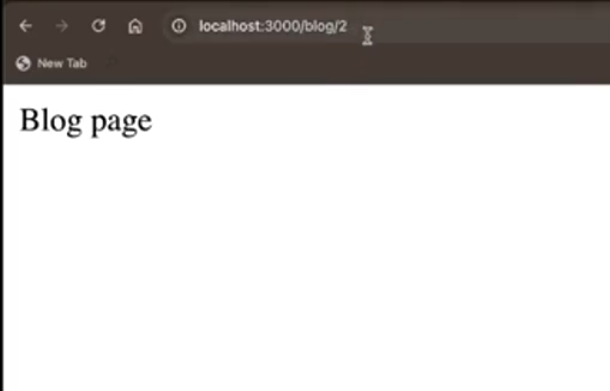 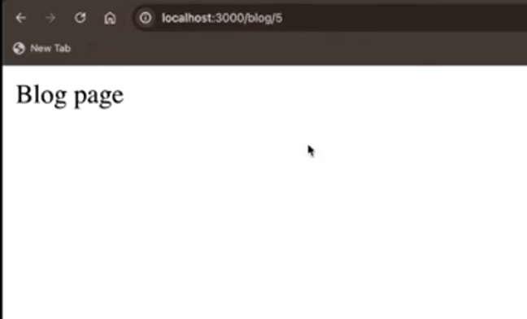

But if you add something after it (i.e. after the dynamic route), then it will __not work__ :-

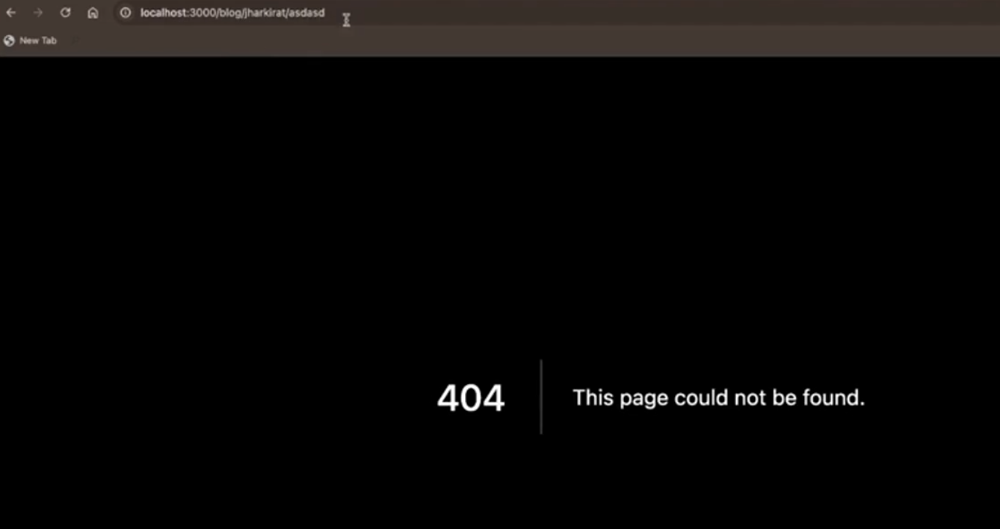

:bulb:**How do i get the dynamic parameter inside the file made above so that i can hit the backend and show the corresponding data on the screen ??**

-> seeing the code 

```javascript
export default function BlogPage({params} : any){ // Give the type to "any" for now but figure out the better type that exists for this 
  const postId = (await params).postId // this is the DYNAMIC PARAMETER made to ensure the DYANMIC nature is maintained (basically jo v url me [postId] field me h uska value extract kiya as url h to "params" lgana pda and as "postId" naam ka variable me store ho rha h so "params.postId" use kiya)
  return (
    <div>
      Blog Page {postId}
    </div>
  )
}
```

> :pushpin:<span style="color:orange">**Remember ->**</span> **`params` is PROMISE SO ALWAYS `await` it**
>
> > **Basically wait kr till `parameters` comes**

If **[blogId] is the name then see the below case ->**

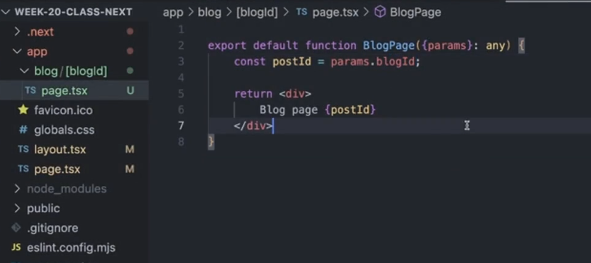

in the above pic, you have __not used `await` with the `params` so the above code will give **ERROR**. 

then you would have used `const postId = (await params).blogId`. 

Now **Lets connect to the backend also that according to the dynamic route, the data should be appearing corresponding to this**

```javascript
import axios from "axios"
import {useEffect} from "react"

export default async function BlogPage({params} : any){
  const postId = (await params).blogId
  const response = await axios.get(`https://jsonplaceholder.typicode.com/posts/${postId}`)
  const data = response.data // once got the data you can do anything you want with this 

  return (
    <div>
      Blog Page {postId}
      <br />
      title - {data.title}
      body - {data.body}
    </div>
  )
}
```

+ You could have also used the other way of hitting the backend or data fetching from the backend which was using `useEffect()`

Seeing the output ->

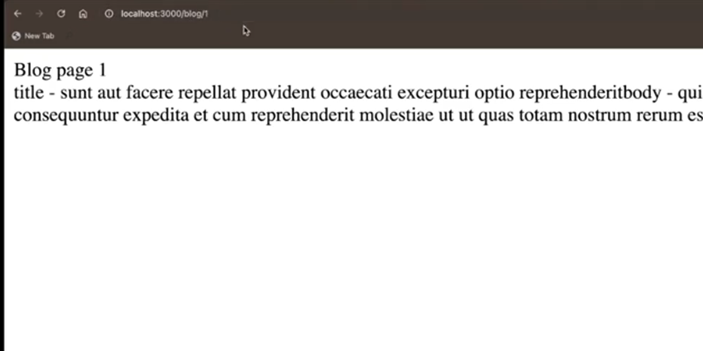 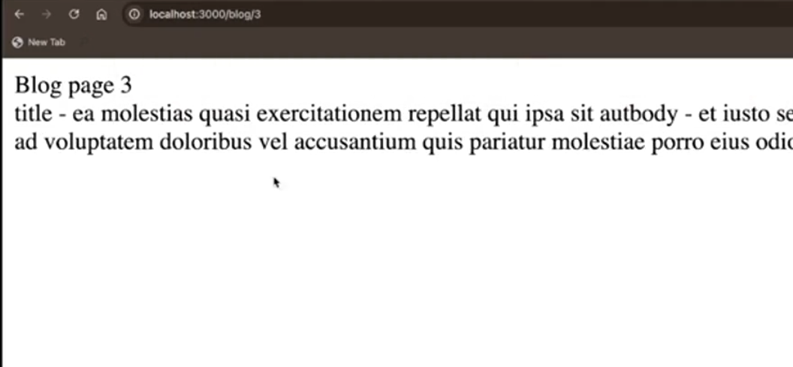

Now you can see the website is changing its content according to the DYNAMIC PARAMETER you are giving in the url and hence this is what the **DYNAMIC ROUTES [] means**

**The above thing is what the content loads on instagram, linkedin and other social media platform**

## **[...] Catch-All Segment**
----------


A folder or file in the form `/docs/[...slug]` will match all segments in that position (e.g., `/docs/anything/here` will be matched by [...slug]).

>:pushpin:<span style="color:orange">**Basically ->**</span> **Iske baad KITNE BHI ROUTES AA JAYE tha all WILL BE HANDLED BY the `page.tsx` file made inside the folder named inside the BIG SQUARE BRACKET with the REST operator inside with the name of the folder**

Create a `app/docs/[...slug]/page.tsx`

```javascript
export default function({ params }: {
  params: {
    slug: string[]
  }
}) {
  return <div>
    {JSON.stringify(params.slug)}
  </div>
}
```

The above thing simply means that `app/docs/ab_kitna_he_route_aa_jaye` sbme `page.tsx`[i.e - the code written above or the component which has been made or written] he lgega 

Now **of course, we have logic to render what should be there inside the component accoring to the route**

For ex -> `/app/docs/1` me jo type ka layout hoga waise sa he `/app/docs/1/34` ka v hoga and waise sa he `/app/docs/3/37/441` and so on (**bas content change rhega**)

**also ONE MORE IMPORTANT THING TO NOTE THAT IT ALSO CONTAINS ALL THE CONTENTS OF THE SUB-ROUTE PRESENT BEFORE AND ON IT (that's what the Rest operator does, clones all the things which has came till now)**

Let's understand by taking the same example as taken above but now the **folder strucuture looks like this ->**

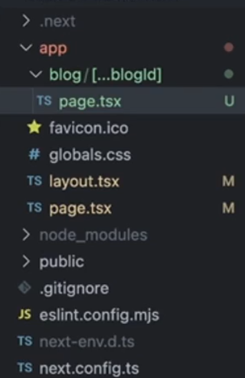

+ `[blogId]` replaced by `[...blogId]`

Now inside the `page.tsx` file 

```javascript
export default async function BlogPage({params} : any){
  const postId = (await params).blogId // NOW THE "blogId" is NO MORE VARIABLE, it has became an ARRAY of all the routes which are attached

  return (
    <div>
      Blog Page {JSON.stringify(postId)} // as there is NO WAY TO DIRECTLY show the ARRAY so we have STRINGIFIED it into JSON to convert into the JSON format 
  )
}
```

Seeing the output ->

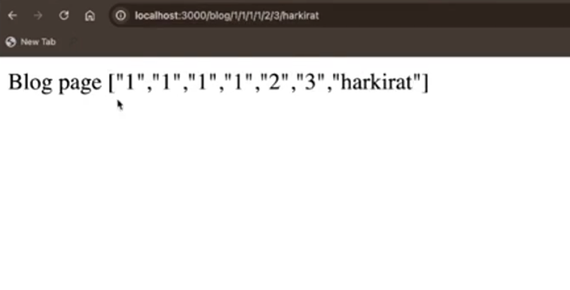

Notice the url (no matter how many routes you have given, they all are following `page.tsx` made inside the `[...blogId]` and also all the routes are being accumulated and shown (exactly what the `REST operator` does ki **CURRENT TO STORE KRTA HE H SATH SATH PURANA BHI DIKHATA H OR SIMPLY SAYING REST JITNE H WO V DIKHAO**))

Now there is one problem in the above thing ->

it will catch all the routes **except the parent route (i.e. -> "http://localhost:3000/blog" pe ERROR de dega ye agar aise kroge to)**

you will see something like the below -> see the url 

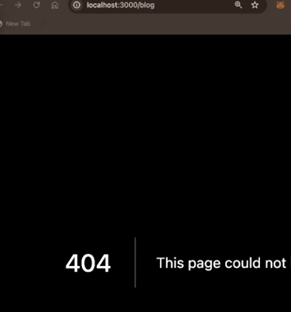

Not catching the `/blog` but will catch `/blog/anything_here` 

**To fix it you can do TWO THINGS ->**

**1st Approach ->**

`blog` folder me v `page.tsx` daal do taki jb `/blog` aaye to ye `page.tsx` render ho and if `/blog/anything`(i.e. `blog` ke aage wale jitne v routes h) to jo `[...blogId]` me jo `page.tsx` h uska component render ho jaye

something like this ->>

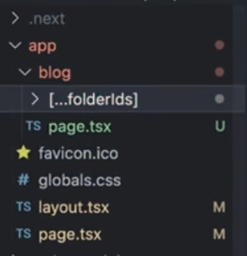

**2nd Approach**

### **Catch-All [[...slug]]**
----------


**WRAP THE Catch-All routes INSIDE NOT ONLY ONE SQUARE BRACKET BUT TWO SQUARE BRACKET**

something like the below ->

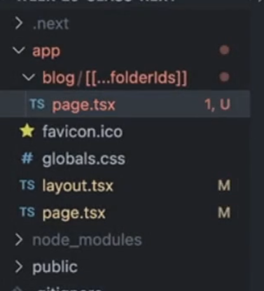

So instead of seperate `page.tsx` for `/blog`, `/blog` will **also be handled by the same `page.tsx` made inside the `[[...folderIds]]`**[Notice i have just added TWO SQUARE BRACKET nothing extra done]

Although this approach is not used much, **BETTER ONE IS 1ST APPROACH only** still you should be known about this 

Coming back to `Catch-All Routes []`,

The `Catch-All Routes []` is very useful ->

+ **When you have very long route url and they all have similar component, only differ in the content**
+ **You have a very NESTED STRUCTURE of your project that you have to go deeper through a chain of routes to find your content**
  + For ex -> if you go to any content management sites -> first go to the topic, then inside the subtopic, then you have the option to get video or study material and finally you get to see the video (so much nesting)


