# **Monorepos and Turborepos**

## **Monorepos**
----------
As the name suggests, a single repository (on github lets say) that __holds all your frontend, backend and devops code.__

**Challenges to it**

+ Cloning the repo will give you access to the **full codebase of the company and hence although you are just devops engineer, you will have to know the other part of code also**
+ **Build time becomes really high**
+ Changes might work on your side but on the others it can fail

**Advantages to it**

+ **If a new developer joins the team, then it is very easier for them to run the project as all the things are present inside the same repo**
+ You can **Control and monitor more efficiently as changes are happening inside the single repo**

Few repos that use monorepos are :-

1. https://github.com/code100x/daily-code 
2. https://github.com/calcom/cal.com 
3. https://github.com/dubinc/dub/tree/main/

**In both of them `apps` and `packages` folder are present, so next time whenever you see that a project contains both `apps` and `packages` folder, you can get a hint that it is MONOREPO**

:bulb:**Do you need to know them very well as full stack engineer ??**

-> Not Exactly. Most of the times they are setup in the project already by the `dev tools` guy and you just need to follow the right pracitses. 

Good to know how to set up one from scratch though 

### **Why Monorepos ??**
----------


:bulb:**Why not simple folders ??**

-> Why cant I just store services (backend, frontend etc) in various top level folders?(like just make three folders for example for `frontend`, `backend` and `devops`(which we usually do) and eventually push the project that has all these 3 and we have made monorepo like thing)

You can, and even you should if your
1. Services are highly decoupled (dont share any code)
2. Services don't depend on each other.

For eg - A codebase which has a Golang service and a JS service

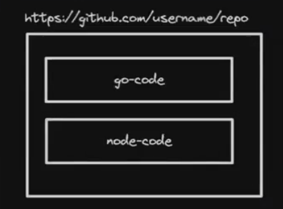

**Basically whenever one top level folder is not dependent on the other top level folder (For ex -> Frontend is in `react` and backend is in `rust`(NO RELATION AT ALL), in this case, you should use the above approach of making the seperate folder for both and eventually pushing their parent folder)**

BUT 

<span style="color:orange">**You need MONOREPO FRAMEWORKs when**</span>

1. **Shared code reuse ->** lets say you have frontend in `react` and backend in `node` and in both, **some function or logic which are present in both the folder so instead of writing them at 2 places seperately , TO AVOID THE CODE DUPLICATION, put them inside the SINGLE MODULE and both `react` and `node` can take the common logic from the module made**

2. **Enhanced collaboration ->** A changes in one department can be seen by the other and other can also change according to the changes made. For example -> `Meta` has the single codebase. (i.e. they use Monorepo framework to some extent)

3. **Optimized Builds and CI/CD[Important point] ->** Tools like Turborepo offer smart coaching and task execution (means using these type of frameworks require you to regularly change the common part of code to their respective langauge or framework code (Ex -> common code jb build ho rha hoga, wo phle `react` me change hoga(lets say) and then build hoga), which can be difficult so to easify these things, these types of frameworks are VERY HELPFUL) strategies that can significantly reduce build and testing times. To achieve the above thing, various strategies are used of which some are 
    + If you are running `npm run build` twice and nothing has changed lets say in the common module, it will not **RE-BUILD the common module, instead IT CACHES these build very well so that regular build gets avoided**
    + **Cloud Builds**(will come to it later)

4. **Centralized Tooling and configuration ->** Managing build tools, linters, formatters, and other configurations is simpler in a monorepo because you can have a single set of tools for the entire project.

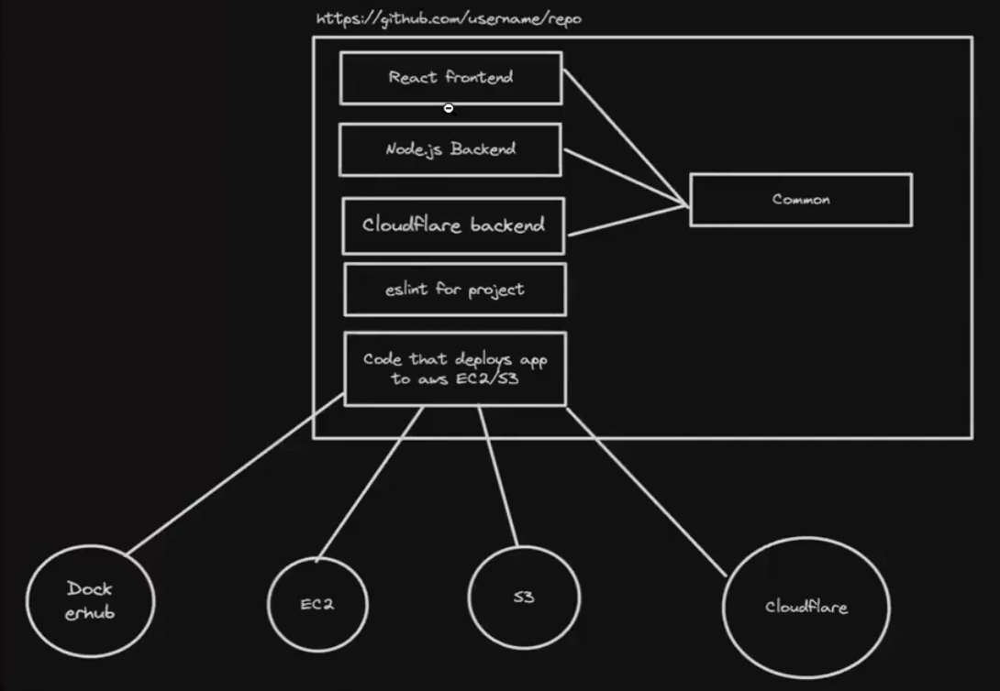

### **Common Monorepo framework in `Node.js`**
----------

1. **Lerna -> https://lerna.js.org/**
2. **nx -> https://github.com/nrwl/nx**
3. **Turborepo -> https://turbo.build/** (<span style="color:orange">**Not exactly a monorepo framework**</span>), can work with `Learna`, `nx`, `Yarn`[**It is built on these**]
4. **Yarn / npm workspaces -> https://classic.yarnpkg.com/lang/en/docs/workspaces/**

We'll be going through __turborepo__ since it's the most relevant one today and __provides more things (like build optimisations) that others don't__

### **Build System V/S Build System Orchestrator V/S Monorepo framework**
----------

#### **Build System**
----------
A build system __automates the process of transforming source code written by developers into binary code that can be executed by a computer.__ For
JavaScript and TypeScript projects, this process can include transpilation
(converting TS to JS), bundling (combining multiple files into fewer files),
minification (reducing file size), and more. A build system __might also handle running tests, linting, and deploying applications.__

For ex -> When you run the `C++` code, the code gets changed to `.exe` file (**the process is called as compiling or BUILDING**) and the thing which changed it (here **compiler also called as BUILD SYSTEM**).

#### **Build System Orchestrator**
----------
__TurboRepo acts more like a build system orchestrator rather than a direct build system itself.__ <span style="color:orange">**VERY VERY IMP.**</span> It doesn't directly perform tasks like transpilation, bundling, minification, or running tests. Instead, TurboRepo allows you to define tasks in your monorepo that call other tools (which are the actual build systerhs) to perform these actions.

These tools can include anything from `tsc`, `vite` etc..

**In short, these acts as a MANAGEMENT TOOL (bas btata h kya krna h, krta to monorepo framework he h)**

#### **Monorepo framework**
----------
A monorepo framework __provides tools and conventions for managing projects that contain multiple packages or applications within a single repository (monorepo).__ This includes dependency management between
packages, workspace configuration.

For ex -> `Lerna`, `Yarn`, `nx` etc..

:bulb:**You must be having the question that at the end we are just making a folder which has common file or code from all the folders, then why not make a global folder and then write there the common code and finally IMPORT them inside all the other global folders ??**

-> something like this you must be thinking (left pic, the one which has folder path written in `../../filepath` one)

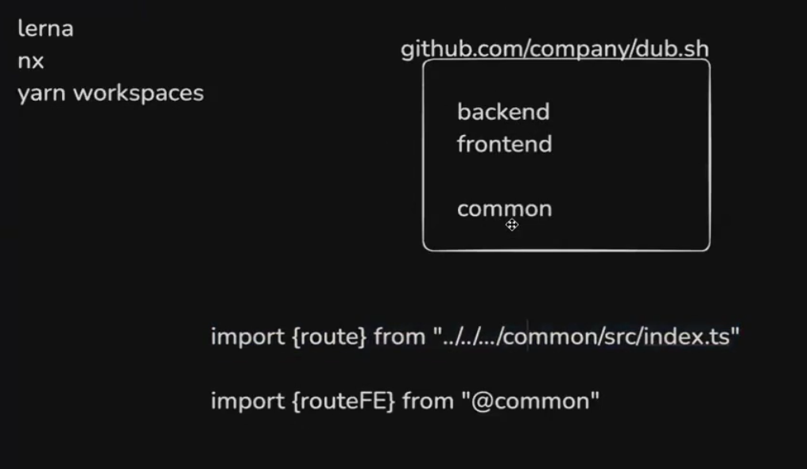 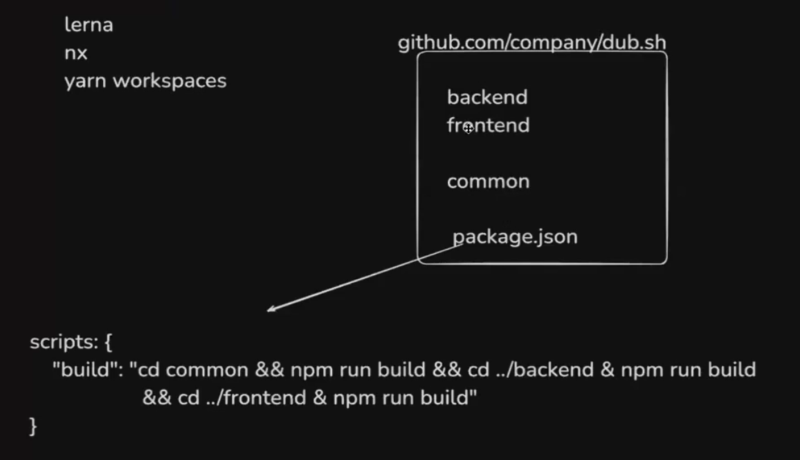

But the problem with the left pic concept is **It seems ugly as you are moving outside and navigating to the place where your codebase is, there must be an easy way to resolve the common module** and hence we use the right pic approach (the way of importing with `@` one [it consists use of monorepo]). In the right pic, we are basically **writing the custom scripts and hence we have the ability to BUILD the folders one after the other so that they are not able to BUILD at the same time(which will lead to increase of BUILD TIME & also RESOURCE-INTENSIVE task), by SERIALIZING the build we are avoiding the above problem and thus the code has now became more optimised** 

Now the writing of the above scripts can be done manually by the developers (but as they are dumb means they cant do the `caching`, `parallelization` and `dependency graph awareness` type of thing(see below explained all these three processes) and hence `monorepo` or `turborepo` **comes into the picture and its work is to HANDLE ALL THE BUILD RELATED PROCESSES**). [you basically dont have to do anything to the `package.json`, `turborepo` will handle all the things].


## **Turborepo as a build system orchestrator**
----------
Turborepo is a __build system orchestrator.__

The key feature of TurboRepo is __its ability to manage and optimize the execution of these tasks across your monorepo.__ It does this through:

1. __Caching:-__ TurboRepo __caches the outputs of tasks,__ so if you run a task and then run it again without changing any of the inputs (source files dependencies, configuration), TurboRepo can skip the actual execution and provide the output from the cache. This can significantly speed up build times, especially in continuous integration environments.

2. __Parallelization:-__ It can __run independent tasks in parallel,__ making efficient use of your machine's resources. This reduces the overall time needed to complete all tasks in your project.(`Lerna` or any other monoframework can also do this)

3. __Dependency Graph Awareness:-__ TurboRepo understands the
__dependency graph__ of your monorepo. This means it knows which
packages depend on each other and can ensure tasks are run in the
correct order.(This is the biggest advantage of TurboRepo as this is not possible with only `Learna` or any other monorepo framework, you need to have TurboRepo). <span style="color:orange">**In short, It SERIALISE the files or folders to be build**</span>

### **Intializing a simple turborepo**
----------
Link to documentation -> [Docs](https://turbo.build/repo/docs)

**Step 1 ->** Initialize the TurboRepo

```javascript
npx create-turbo@latest 
```

**Step 2 ->** Select `pnpm` or `yarn` as the monorepo framework (basically means that from where all the codes should be coming(i.e. from which package ??))

>If it is taking a long time for you,(which it can as it is very heavy operation) you can clone this starter from https://github.com/100xdevs-cohort-2/week-16-1 and `run npm install` inside the root folder

By the end, you will notice a folder structure that look like this ->

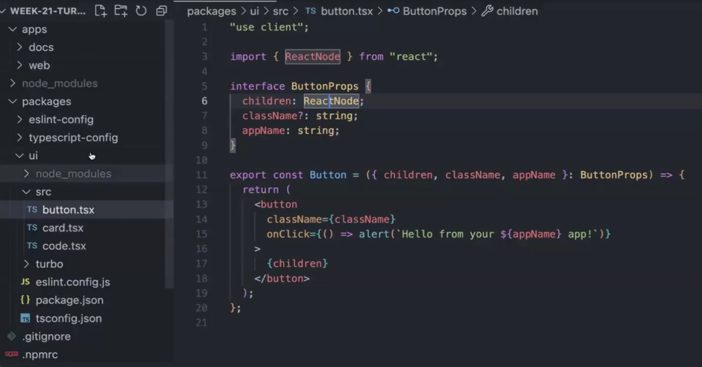

### **Exploring the folder structure**
----------
Basically there are 5 modules inside the project ->

__End user apps (websites/core backend)__

1. `apps/web` - A Next.js website 
2. `apps/docs` - A Docs website that has all the documentation related to your project

__Helper packages__
1. `packages/ui` - UI packages
2. `packages/typescript-config` - Shareable TS configuration
3. `packages/eslint-config` - Shareable ESLint configuration

Below pic shows the relation ->

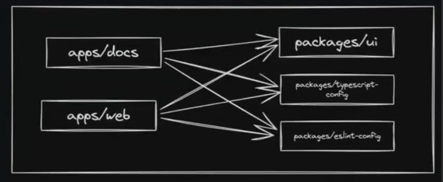

If you notice the `apps` folder you will see two folders -> `docs` and `web` and inside if you will see the code is same as that you see in `Next.js` (**basically these are two frontends that one for the WEBSITE and second for the DOCUMENTATION(`Next.js` backed code but you can also add `react` or other frameworks) in the `web` folder, you will write the logic for frontend and in the `docs` folder the documentation part(you can also delete it)**)

> **`apps` is the main folder where all the logic which cant be seperated out into the common is written (basically isme jitne v helper packages, component h wo bas IMPORT hoke use hote h)**
>
> > **Put the end user applications here (appka user jisse interact krta h ex -> `Next.js` backend or frontend, `react` frontend, `Node.js` backend), they should be put here and**

and now talking about the 2nd global folder -> `packages` 

> **`packages` is the folder which will consist of all the logic that are common from all the other folders present**
>
> > **whatever reusuable code they(the project) need to have should be kept inside the `packages` folder, which is the BIGGEST ADVANTAGE of monorepo as you can share the packages among your different projects ex-> `ui` etc..**

You can see in the `packages` folder, different sub folder are present for most of the important part which is present in the website like (`ui`, `components`, etc..)


Now if you run the **pre-built code given at the time of initializing the project you will see that there are 2 different projects(similar only by appearance) running on the two different urls and are that two are present inside the same repo**

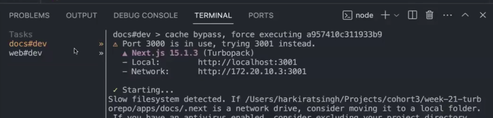

Now if you go https://localhost:3001 then you will see something like the below(left pic) and if you go to https://localhost:3001 (right pic) is the output ->

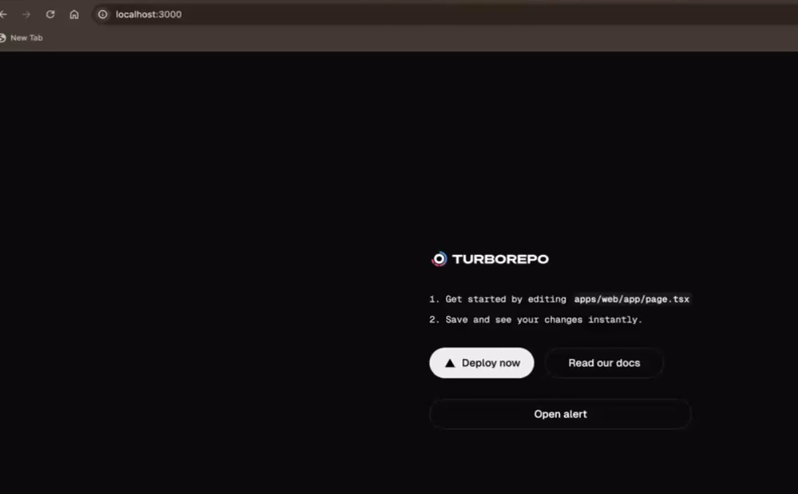 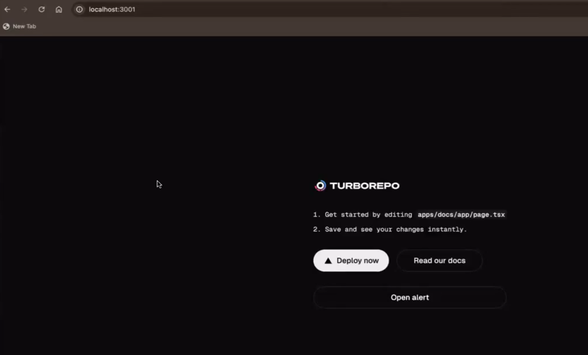

Notice the **output in both the pages same which simply means they are using SIMILAR of SAME components as the one is using**

OR simply saying -> **We have single `repo` which has multiple `projects` which share code from `packages/ui`**

Notice if you go to the `web > app` folder in the below directed pic (left pic) and going inside the `button` component, you will redirected to `ui` components `button.tsx` file(right pic)

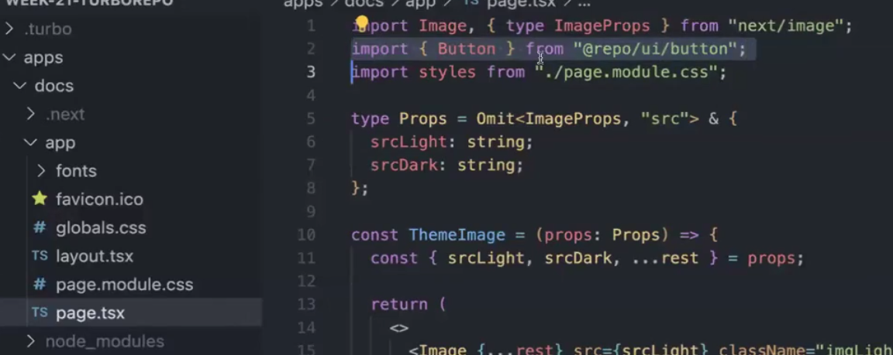 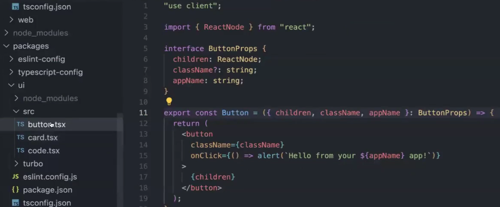 

**One of the practical use case of this is you can build MULTIPLE WEBSITE without writing the logic for many things(such as components, ui, css code, etc.. )  and that too inside the single repo**

For ex -> Zomato and Blinkit have similar looking ui which means that they could have just used the `monorepo` to build both the above website and that too inside the same repo so that they can use the component which are common to each other in both the website. basically in their repo of `web` and `docs` folder they could have `zomato` and `Blinkit` webiste inside their corresponding `app > page.tsx`.

Now you can also see the **Caching feature of turborepo** by **building the project by running `yarn build` on the terminal**. <span style="color:orange">**You will notice that when you run this command first time, then it will take time but after then if you again RE-RUN the COMMAND WITHOUT MAKING A SINGLE CHANGE in the codebase, then the BUILD will be executed very fast (this is what we have learnt in caching that it caches the build so that optmisation can take place)**</span>, also if you now change something inside the codebase, you will see that again it will start to take time to build as **some code has been changed**

<span style="color:orange">**The above feature plays very crucial part in CI/CD pipeline (as their continuous deployment of your code is occuring and your project needs to have very optimised so that it can travel faster in the CI/CD pipeline and updated in your website gets immeditately handled)**</span>

**This was also the selling point of Turborepo that they reduce the BUILD TIME significantly less**

Now <span style="color:orange">**If you want to add more projects then**</span> -> **Just COPY any of the two folders present inside the global `apps` folder (i.e. `web` or `docs`) and then just go inside the newly made copied folder's `package.json` and inside that change the `"name"` to the one which you have kept for the copied project** and THAT's it, you have MADE A SINGLE REPO WHICH HAS 3 DIFFERENT PROJECT.

You can also add the backend like the one which is shown below ->

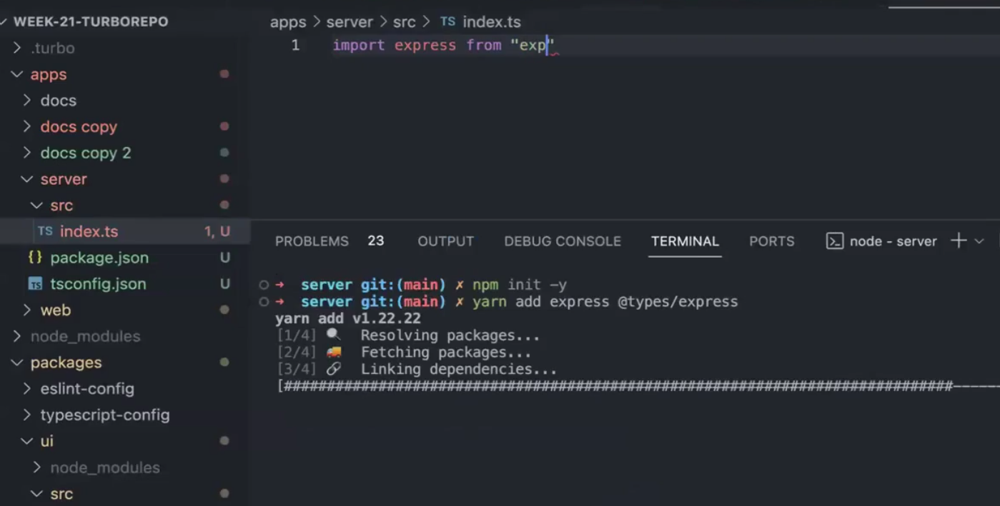

Notice we have just made another folder named `server` and this will signify our backend of different project and inside that now we can write the logic of the backend.
 
### **Exploring root `package.json`**

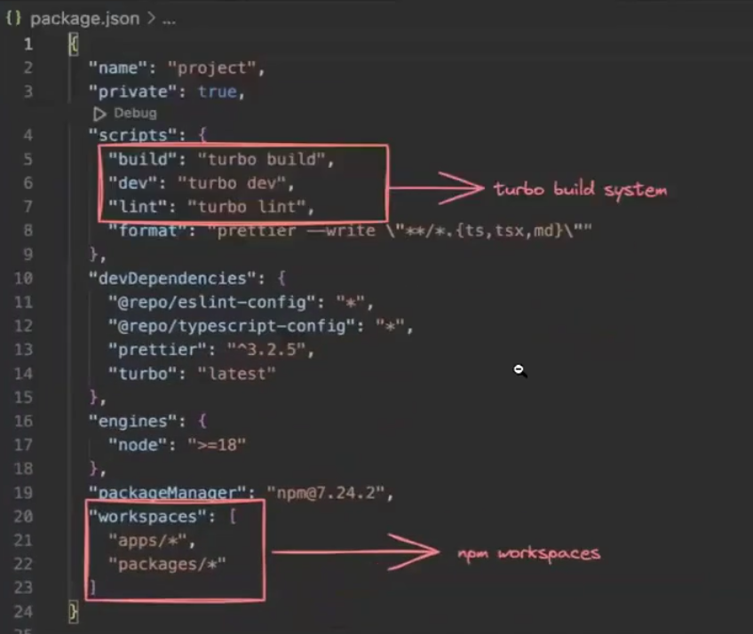

`npm workspaces` is what the `monorepo` has done and `turbo build system` is what `turborepo` has made.

__scripts__

This represents what command runs when you run

1. npm run build
2. npm run dev
3. npm run lint

`turbo build` goes into all packages and apps and runs `npm run build` inside
them (provided they have it)

Same for `dev` and `lint`

Now from now on lets try to build and understand the rest part by doing some assignment.

## **Assignment**

:bulb:**You have to create a simple chat application by using the monorepo and turborepo ??**

so starting to solve ->

**Step 1 ->** Intitializing the empty monorepo project by running the command 

```javascript
npx create-turbo@latest
```

give the name and then `yarn` as package manager (if not then install it)


Now you have created an empty monorepo project 

inside the global `package.json`, you can see the `"workspaces"` key which has its values as `"apps/*"` and `"packages/*"` (which basically means that where the end app takes the code from), when you will reach DEVOPs, you will see another value here named as `"clis/*"`

Now currently our project has two `Next.js` app (or frontend) named as `web` and `docs` present inside the global `apps` folder, but as we are just making a simple chat app, so stick to only one frontend (if it has another role like `admin`, then you have to make or use another frontend)

so delete `docs` (for now)

Now in the global (any of the file or folder present in the global), running the command `yarn dev` will BUILD the project and hence you will get the link to see your project.

Proceeding further and creating an `http` and `websocket` server for our app 

**Step 2 ->** Making `http server` and `ws server` folder inside the `apps` global folder for the backend part 

**Step 3 ->** Lets move forward on making the frontend part for the chat application

:bulb:**What will it consists of ??**

-> an __input box__ (which room you want to join ??) and a __button__(to make the user join to this room)

so making the above 

so going to `web > app > page.tsx` and remove everything which came pre-coded inside it, there are also some **default `css` code present in the `global.css` file so remove that also** 

```javascript
export default function Home(){
    return(
        <div style = {{ // you could use TAILWIND but to keep things easy, lets just use the RAW CSS here
            height : "100vw",
            width : "100vh",
            background : "black",
            display : "flex",
            justifyContent : "center",
            alignItems : "center"
        }}>
        // BUT ARE YOU DOING THINGS THE RIGHT WAY ACCORING TO MONOREPO -> NO, when you are using monorepo, then you must put these design elements at one common place which is in our case apps > packages > ui > src 
        // Lets introduce a new component in the above written path for the below made INPUT BOX so that it can be used at repeatedly instead of only being used at this place
            <input type = "text" placehoder = "Enter the room code"></input>
            <button>Join Room</button>
        </div>
    )
}
```

making the file named as `text-input.tsx` inside the `apps > packages > ui > src` and inside that seperating the `styling` code for the INPUT button made in the project 

```javascript
// When ever you are creating custom component and writing the common code for the components, try to involve the custom interface or basically custom datatype 
interface PropType {
    placeholder : string,
}

export function TextInput({placeholder} : PropType){ // as input box will have some input given by the user and hence it will be passed on as PROPS (or as argument in the function), as we are dealing with TypeScript so its better to give the type of this input which can be given by the user. (see the interface code written above)
    return(
        <input placeholder={placeholder} style = {{
            padding : 10,
            margin : 10,
            borderColor : "Black",
            borderWidth : 1
        }}></input>
    )

}
```
and now using this custom made input button on the main page(`apps > web > app > page.tsx`) ->

```javascript
import {TextInput} from "../../../packages/ui/src/text-input" // you can IMPORT the component like this but then you are losing out bunch of monorepo benefits as (what is the path changes and also we can independently deploy the text-input.tsx file (then what will happen))
// so using the monorepo way of importing (just go to the folder package.json and see the name, for ex -> if you go to the apps > packages > ui > package.json, you will see the name -> "@repo/ui", SO JUST USE THIS FOR IMPORTING INSTEAD OF WHOLE PATH DECLARATION AND THEN THE FILE YOU WANT TO IMPORT FROM, something like the below)
import {TextInput} from "@repo/ui/text-input"
// BUT THIS WILL STILL GIVE YOU ERROR -> REASON -> see // 2 explantion below 
export default function Home(){
    return(
        <div style = {{ // you could use TAILWIND but to keep things easy, lets just use the RAW CSS here
            height : "100vw",
            width : "100vh",
            background : "black",
            display : "flex",
            justifyContent : "center",
            alignItems : "center"
        }}>
            <TextInput placehoder = "Room Name"></TextInput> // as placehoder to chahiye na TextInput component ko as passed as a props from the file where this component is made
            <button>Join Room</button>
        </div>
    )
}
```

**Explanation of `// 2` code**

Although you have made the `TextInput` component and even give it the ability to get **EXPORTED by giving it `export` keyword, still you have not given the access to file in which it is present [AS WE ARE TALKING HERE OF EXPORTING COMPONENT PRESENT INSIDE A REPO TO WHOLE ANOTHER REPO]**

so to achieve the above thing, you have to go to `apps > packages > ui > package,json` **file is present inside the `ui` folder so go to the `package.json` file of this folder as there only you will see the `"exports"` key which will have the file which are going to be exported**

Now if __you are using the new turborepo version,__ then you will see that in the `"exports"` key you will have the value 

```json
"exports": {
  "./button": "./src/button.tsx",
  "./card": "./src/card.tsx",
  "./code": "./src/code.tsx",
  "./input": "./src/text-input.tsx" // so in this you will have to give manually your file name and corresponding key name 
  // REMEMBER -> you have given the key as "input" so you will have to import using this name only 
  // so now to import this you will write 
  import {TextInput} from "@repo/ui/input"
}
```
But **if you are using Newer version of turborepo, then it have pre coded the path by using the regex**

so if you now go to the `apps > packages > ui > package,json` in the newer version of turborepo, you will see 

```json
"exports": {
    "./*": "./src/*.tsx"
},

// Now the above code is the GENERALISED FORM of what we were doing above as this simply means that all the .tsx file present inside the src folder can be EXPORTED using /file_name 
// thus REMOVING THE BURDEN OF MANUALLY ADDING THE FILE NAMEs TO BE EXPORTED 
```

coming back to the `apps > packages > ui`, In the big companies, thats how the ui library is made so that every developer can use it. seeing our `text-input.tsx` file code 

```javascript
// Now you can make the more elaborative version of this input box by adding the variant, theme, size, etc.. for ex ->
interface PropType{
    placeholder : string
    size : "big" | "small" // added a new field and according to it 
}


export function TextInput({placeholder, size} : PropType){// taking "size" as input to use it 
    return(
        <input placeholder={placeholder} style = {{ 
            padding : size == "big" ? 20 : 10, // simply means if the size is big then make this input box padding = 20 otherwise 10
            margin : size == "big"  ? 20 : 10, // same as the above statement
            borderColor : "Black",
            borderWidth : 1
        }}></input>
    )
}
```
so now if you write this instead of `<TextInput placehoder = "Room Name"></TextInput>` inside the `apps > web > app > page.tsx` then

```javascript
<TextInput placehoder = "Room Name" size = "big"></TextInput>
```
then on the ui, you will see the change in the input box, it will have padding == 20 and margin == 20

Like this **You can make your OWN CUSTOM LIBRARY to be used for multiple projects** 

>[!TIP]
> **Always try to use this approach as this will save time for you upcoming project, you might will take more time at first but once you have made one library then you can use it anywhere and in any project**

>[!IMPORTANT]
> **If you really want to see what all are present in the UI Library go to this link -> [Razorpay UI storybook](https://blade.razorpay.com/?path=/docs/guides-intro--docs)**, [<span style="color:orange">**TRY TO EXPLORE IT AND STRUCTURE YOUR PROJECT UI TO MAKE THE FRONTEND PART VERY EASY FOR ALL YOUR PROJECTS**</span>]

Now coming back to the project, now 

**Step 4 ->**i have to write the logic that if the user clicks on the button `join room`, then what will happen, so coming back to the code present inside the `apps > web > app > page.tsx`

and **clicking on the button will lead you to another route**

```javascript
"use client" // as useRouter is React hook and hence it is client component 
import { TextInput } from "@repo/ui/text-input"
import {useRouter} from "next/navigation" // as router Next.js me enable isi se hota h remember the Next.js notes on routing

export default function Home(){
    const router = useRouter()
  return(
    <div style = {{
            height : "100vh",
            width : "100vw",
            background : "black",
            display : "flex",
            justifyContent : "center",
            alignItems : "center"
        }}>
      <TextInput placeholder="Room Name" size = "small"></TextInput>
      // Clicking on the button will lead you to the other route so writing the logic for it 
      <button onClick = {
        router.push("/chat/123") // 2
      }>Join Room</button>
    </div>
  )
}
```
:bulb:**Can you see the problem in the `// 2` code**

-> you have basically **HARDCODED the route as no matter what user will give the room name, you are redirecting them to `/chat/kk`, now this must be DYNAMIC (i.e. -> WHAT THE USER WILL GIVE ON THAT ROUTE ONLY IT SHOULD BE FORWARDED AND THE UI SHOULD CHANGE ACCORDING TO THAT ROUTE ONLY)**

so how to make it DYNAMIC (or dependent on the user)

**As here we need to store the value of the input box(the place where the user will put the input or room name) so that the route can then use this value to re-direct them according to the room name the user has given (as they will be redirected to that route) so `useState` or STATE VARIABLE is going to be used for storing the input from the user**

you can also do this -> **extracting the text user will give in the input box so `useRef` can also be used**, but for now seeing the **state variable making approach**

Basically i have just used the concept which we have learnt in `react` which is **to store anything in `react` only 2 hooks are used `useState` and `useRef`**

Now lets see how you can mould your code and redirect the user to the route it has given as room name ->

inside the `packages > ui > src > text-input.tsx`

```javascript
interface PropType{
    placeholder : string,
    size : "big" | "small",
    onChange : (e : any) => void // the input box will take an onChange event handler whose event "e" is of "any" type (for now give it "any", later we will give its appropriate) and the function returns the type "void" as it has just the work of passing the input string to the STATE VARIABLE so that the value of the STATE VARIABLE can then be passed inside the route and thus it(route) will be dependent on user 
}


export function TextInput({placeholder, size, onChange} : PropType){ // will take the input "onChange" 
    return(  
        <input onChange = {onChange} placeholder={placeholder} style = {{
            padding : size == "big" ? 20 : 10,
            margin : 10,
            borderColor : "Black",
            borderWidth : 1
        }}></input>
    )
}
```

**Explanation of certain part wrote above**

The line `<input onChange = {onChange}` simply means that whenever the native input box value will change, it will call the `onChange` props passed 

i.e. **Whenever the native input box changes, it will call the `onChange` prop passing in it i.e the function you are defining on `// 3` line (see below `onChange` part), that function will run**

as in the below code `// 3` line, you have written the function to **alert user with "hi" message**

so the __output will look like__ -> whenever you will write or remove some text from the input box on the ui(basically **make change on what it was initially**), you will see an **alert on the browser showing message `"hi"`**

making change in the `apps > web > app > page.tsx`

```javascript
"use client" // as you are using onChange event handler in the below code so you have to make this client component to make it work and useRouter is also a client component 
import { TextInput } from "@repo/ui/text-input"
import {useRouter} from "next/navigation"
export default function Home(){
    const router = useRouter()
  return(
    <div style = {{ // CSS part will remain same as above you were writing
        }}>
        // 3
      <TextInput onChange = {() => { // Added onChange event handler 
        // and then using the state variable to store the value given by the user simultaneously as the user is giving the input
      }} placeholder="Room Name" size = "small"></TextInput>
      <button onClick = {
        router.push("/chat/state_variable") // finally using the state variable declared above to store the value given by the user so that the ROUTE BECOMEs USER ORIENTED
      }>Join Room</button>
    </div>
  )
}
```

But as the above approach might feel overwhelming, so just remove the **making of user input route for now and stick to hardcoded routes and removing the `onChange` as props inside the `text-input.tsx`**[basically reverted back to what we have done till before the problem]

**Step 5 ->** Handling the request for going to the room

so for doing the above task, create a file structure like this -> `apps > web > app > chat > [roomid]`

```javascript
import { TextInput } from "@repo/ui/text-input";

export default function Chat() {
  return (
    <div style={{
      width: "100vw",
      height: "100vh",
      display: "flex",
      justifyContent: "space-between",
      flexDirection: "column"
    }}>
      <div>
        Chat room
      </div>
      <div>
        <TextInput size="big" placeholder="Chat here"></TextInput>
      </div>
    </div>
  );
}
```

Now in the middle part, we will **append the chat**

**Step 6 ->** Lets try to write the **Backend part**

so going inside the `apps > http-server`, and then doing the **initial steps inside the said location in the terminal**

```javascript
npm init -y
```
to initialise `package.json` file and then 

```javascript
npx tsc --init
```
to initialise `ts-config.json` file 

**same thing you will do for `ws-server` folder**

Now we will create `src` folder in both the folders

You will also have to change the `rootDir` and `outDir` to `./src` and `./dist` respectively inside the `tsconfig.json` and this step will also be done for both the folders.

**Now comes the CATCH, can you see the repeatitive work being done inside the `tsconfig.json` file for both the folders and hence AGAIN AVOID CODE DUPLICATION**

So for this only, if you go to `apps > packages > typescript-config` folder is given as **you can see that both the folder `ws-server` and `http-server` are using the same `tsconfig` file so its better to put that common file inside one file and then export them to these files**

so making a new file named as `backends.json` inside the  `apps > packages > typescript-config` inside which we will copy paste the code present inside the `tsconfig.json` file of `ws-server` and `http-server` [:no_entry: Remove all the comments part, otherwise this will show error as it is .json file]

so inside the `backends.json` file 

```json
{
  "compilerOptions": {
    "target": "es2016",
    "module": "commonjs",
    "rootDir": "./src", // 2
    "outDir": "./dist", // 3
    "esModuleInterop": true,
    "strict": true,
    "skipLibCheck": true
  }
}
```

But if you put `// 2` and `// 3` in the above, then just write the `// 4` line (see below) then the compiler will think that there is `src` and `dist` folder present inside `apps > packages > typescript-config`

BUT, as our `src` and `dist` folder is present in the `apps > http-server` (`dist` folder will be created after the code is compiled(as it is the folder containing `ts` to `js` conversion)), so **It will give ERROR inside the `tsconfig.json`** and to solve this, **we remove the `// 2` and `// 3` line of code from above and shift it downward (see `// 5` codeblock below)**

and then inside the `tsconfig.json` file in `ws-server` and `http-server`, **Remove all things present and just IMPORT the above file by writing in both the `tsconfig.json` file of both the folders**

```javascript
{
    "extends": "@repo/typescript-config/backends.json", // 4
    "compilerOptions":{ // 5
        "rootDir": "./src", 
        "outDir": "./dist",
    }
}
```
**Step 7 ->** Putting some **dependency in the `ws-server` and `http-server`** by making file named `index.ts` in `apps > http-server > src` 

first putting inside the `http-server`

+ It will require `express` as the 1st dependency 

```javascript
npm install express @types/express 
// as we are using ts so add @types/express
```

and then using putting the dependency inside the `ws-server` 

+ It will require **Websocket or socket.io(depends on what you want to) for now lets stick to Websocket**

```javascript
npm install ws @types/ws 
```

**Step 8 ->** Let's introduce the endpoint inside the `index.ts` file present in `apps > http-server > src` 

```javascript
import express from "express"

const app = express()

app.get("/signup", (req, res) => {
    res.send("Hello world")
})

app.get("/signin", (req, res) => {
    res.send("Hello world")
})

app.get("/chat", (req, res) => {
    res.send("Hello world")
})

app.listen(3001) // as on 3000 our frontend is being hosted which is named as "web" here so if you will not give this, it will give ROUTE CONFLICT ERROR
```

Now comes the **running and building part so for that we have to add the `"scripts"` where we will define what command will run when you run `npm run build` and `npm run dev`**

so going inside the `apps > http-server > package.json` and then adding these two command inside the `"scripts"` key (you know what these commands do if not see the `ts` lecture)

```javascript
"scripts": {
    "build": "tsc -b",
    "dev": "tsc -b && node dist/index.js"
}
```

**Now if you run `npm run dev` in the root folder `chat-app`, you will see two task running (`web` frontend one on `3000` port) and (`http-server` backend one on `3001` port)**

>[!IMPORTANT]
> Now as **our frontend and backend on different urls("http://localhost:3000" and "http://localhost:3001") so `CORS` issue will come and you have to write the logic for it by installing `cors` library**

### **about Global `turbo.json` present in the folder**
----------

```json
{
  "$schema": "https://turborepo.com/schema.json", // This is the schema file of turborepo so if their version will keep changing so their schema will also keeps changing, BASICALLY SCHEMA OF WHAT YOU ARE WRITING 
  "ui": "tui", // This means the ui which you see in terminal when building the project (Terminal UI), you can change to bui if you want to see the browser ui result 
  "tasks": { // THIS IS IMPORTANT (tells WHAT ALL TASKS IT PERFORMS)
    "build": { // BUT if we are pushing the code in production ("build" mode), then you want the turborepo to do bunch of optimisations and that are LISTED BELOW 
      "dependsOn": ["^build"], // This is basically to resolve, if there is DEPENDENCY GRAPH present then first the independent folder will BUILD then the dependent folder (For ex -> if the "web" folder depends on "ui" then "ui" folder will BUILD first completely then the "web" folder)
      "inputs": ["$TURBO_DEFAULT$", ".env*"], // means WHAT ALL FILES ARE CONSIDERED for input (BASICALLY WHAT FILES IF CHANGED SHOULD BE CONSIDERED FOR RE-BUILD)  // 2
      "outputs": [".next/**", "!.next/cache/**"] // This is how TURBOREPO KNOWS WHAT TO CACHE ? (means the folder which has been cached, reflect their output directly) basically the ".next" folder what you see in the folder structure after the build command is executed is what you basically need now is just this folder and even if the rest file and folder you delete it, still this project will run as the progress has been saved. BASICALLY, EVERYTHING WHICH HAS BEEN BUILT, is present in the ".next" folder and hence CACHE THIS FOLDER. (".next/**" means this thing only) and the one which has been already cached (shown by "!.next/cache/**"), IGNORE THESE(.next me pda cache folder) WHILE GIVING OUTPUT 
    },
    "lint": {
      "dependsOn": ["^lint"]
    },
    "check-types": {
      "dependsOn": ["^check-types"]
    },
    "dev": {
      "cache": false, // basically says dont cache anything (if the code changes, let it REFRESH as when you are running locally("dev" mode) you want to develop and compile again and again so that i can see the output of the changes frequently)
      "persistent": true
    }
  }
}
```

**Explanation of `// 2` code**
----------

>[!IMPORTANT]
> <span style="color:orange">**Remember ->**</span> **In case of a `node.js` app, the `.env` file changing should NOT need a rebuild of the project BUT In case of a `next.js` app, the `.env` file changing DOES require a rebuild of the project**
>
> __Just google why this is ??__

and hence if you are using in your project `Node.js` for making some part, then instead of `// 2` code you will put only `"inputs": ["$TURBO_DEFAULT$"]` , as `.env` file me change hone se v **re-build krne ka jarurat nhi h while you are using `node.js` project** but as here we are using `Next.js` so we have added `.env` file as in this **you must have to RE-BUILD the project once it changes**

Now as our backend folder `http-server` has all the code or **logic present inside the `dist` folder made after compilation so to run this, you will have to add `turbo.json` inside this folder and OVERWRITE the global `turbo.json` as inside this the `"inputs" and "outputs"` start building from the `.next` folder present globally but we want to not to start from there instead build the backend seperately also**

so making the `turbo.json` file inside the `apps > http-server` and writing the logic 

```javascript
{
  "extends": ["//"], // basically extend the original one (global turbo.json)
  "tasks": {
    "build": {
      "outputs": ["dist/**"] // But inside it change the value of "output" of "build" to be "dist" folder
    }
  }
}
```


