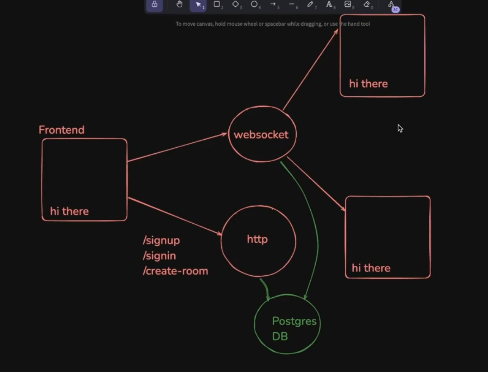

# **Excalidraw Project**


## **Setting up**
----------

First initialising a monorepo project by running the command 

```java
npx create-turbo@latest
```

also for this project, we are using `pnpm` which is slightly better thatn `npm`

Now after initialising the turborepo project, now you have to run the following command to install all the dependencies 

```javascript
pnpm install 

// followed by 

pnpm run dev
```

Now as **here you are running the `pnpm run dev` globally(in the root folder) hence you are seeing all the projects present in the `Apps` folder.**

Running the above command you will be able to see the default project present in the turborepo project (`docs and web one` which are `Next.js` app)

If you want to run a specific project, just go inside that `project` present in the `Apps` folder and then run `pnpm run dev` then **that project will only run and hence you can use it to individually run a project in monorepo project**

Example -> just go to inside the `docs` folder above and then run `pnpm run dev` and then you will see that only `docs` project will run not the `web` one.

As here we are just going to need one frontend for excalidrws hence in the `Apps` folder, just delete the `docs` folder or `web` 


## **Structuring the project**
----------

So as we are making the excalidraw with the enhanced functionality that others can also collaborate inside the project.

Starting off with the `backend` which will have two parts 

+ **`http-backend`** // to get to the routes
+ **`ws-backend`** // websocket backend for the collaboration

so making two folders inside the `apps` folder named as `http-backend` and `ws-backend` and the same time **running the `npm init -y` command**

although you can combine them and make a single folder for the backend, but lets not go there as that will complicate things instead seperate the two backends required.

**Overall structure of the project**



Now we could at this point can jump directly to build the `ws-backend` and `http-backend` as we have done previously **but as we are using monorepo, hence its bettter to also keep in mind that if there is possiblity of code sharing we can do in this, then that should also be taken into the consideration.

A slight example of the above can be as both the `http-backend` and `ws-backend` are using the **database** so where should `prisma.schema` be stored that you can take use of this finding.(basically you should abstract it out in the package instead of creating it in both the folder)

Now moving further, we will now add **`tsconfig.json` file** inside the `http-backend` and `ws-backend` to **intialise the `ts` in both the project**

so either you make it manually `tsconfig.json` or run `npx tsc --init` (this will create `tsconfig.json` file with some pre-installed key-value pair) **but as we are using monorepo, it alsready has `packages > typescript-config` folder** which has **bunch of folders by default** which are -> 

+ `base.json` // something which can be used for __node.js__, __react__ and this is actually what acts as the main file as **it consists of base configuration to use `typescript`**
+ `nextjs.json` // for next.js projects
+ `package.json`
+ `react-library.json`


so `base.json` file needs to shared among the empty `tsconfig.json` file made above in the two folders (`http-backend` and `ws-backend`).

Now you can **copy-paste** the code written inside the `base.json`, inside the `tsconfig.json` file made above in the two folders (**this will result in code repeatition**) OR the best way is to somehow **make this file available to `tsconfig.json` file present in both the folder by IMPORT type thing**, and hence going in the `tsconfig.json` file writing the below line of code 

```javascript
{
    "extends" : "@repo/typescript-config/base.json" // Basically you have EXTENDED the code present in the typescript-config folder, base.json file to this tsconfig.json file present 
}
```
but before using this, you have to first install `@repo/typescript-config` as a **dependency in the `package.json`** file of both the folder as follows

```json
{
  "name": "http-backend", // ws-backend if of that package.json
  "version": "1.0.0",
  "description": "",
  "main": "index.js",
  "scripts": {
    "test": "echo \"Error: no test specified\" && exit 1"
  },
  "dependencies":{
    "@repo/typescript-config":"workspace:*" // if you are using pnpm (which i am using in this project)
    // "@repo/typescript-config":"*" // if you are using npm
  }
  "keywords": [],
  "author": "",
  "license": "ISC",
  "type": "commonjs"
}
```

and now run `pnpm install` in the root folder to install this dependency


