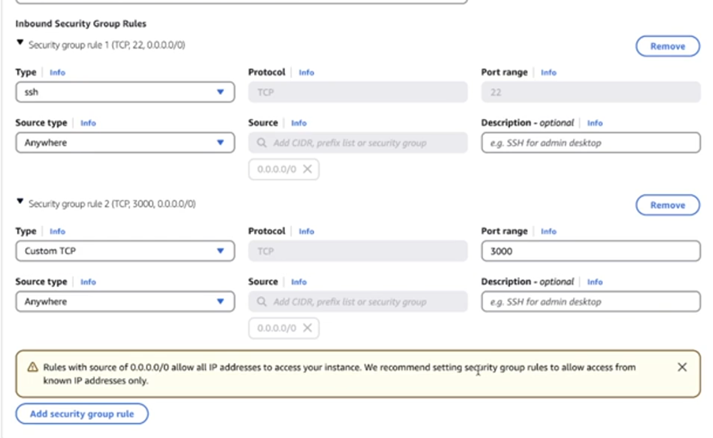
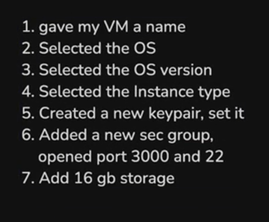
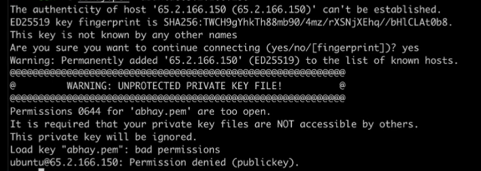
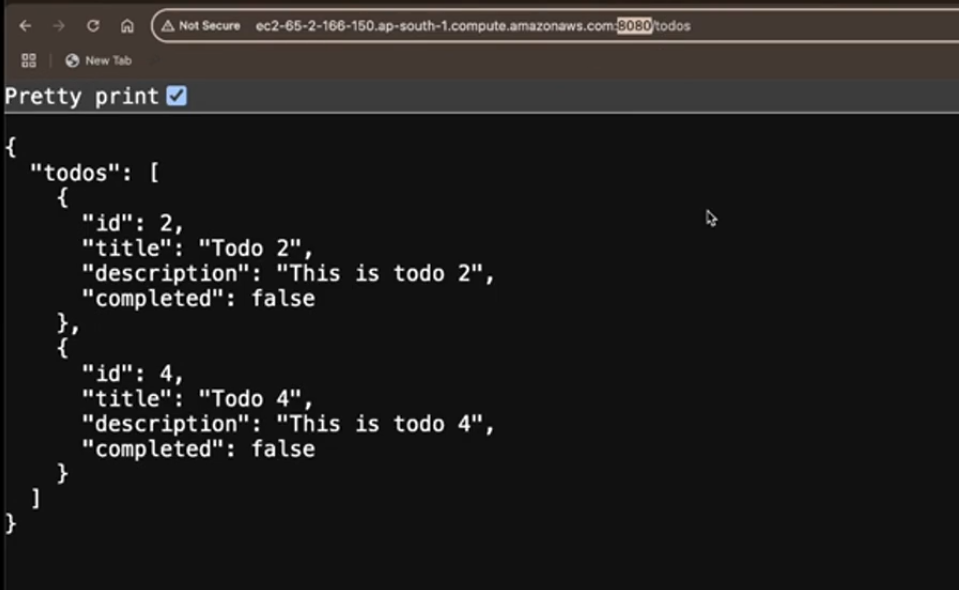
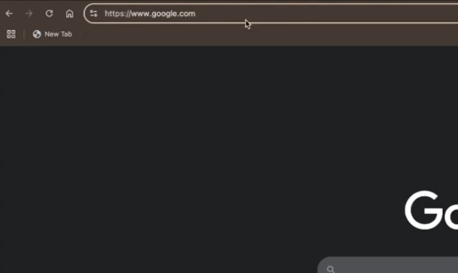
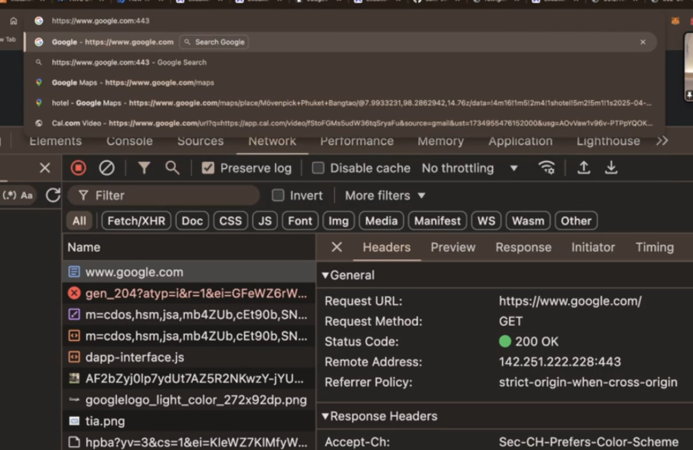
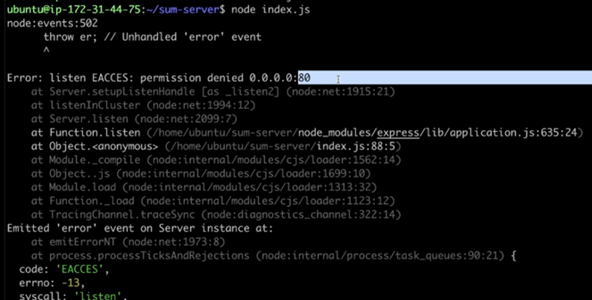

# **Reverse Proxy and deployemnt of the project**


## **AWS**
----------
AWS is Amazon's cloud services

It let's you 

1. Rent servers
2. Manange Domains
3. Upload objects (mp4 files, jpgs, mp3s, etc..)
4. Autoscale servers
5. create k8s clusters (kubernetes clusters)

The offering we will be focussing on today is `Renting servers`


It offers various things out of which **EC2 is the major one** which stands for **Elastic compute version 2**

:bulb:**What is elastic compute ??**

-> Just see the IntrotoDevos notes where we have understood the vm (Hardware -> Hypervisor -> VM concept) 

+ **Elastic ->** means it can change(increase/decrease the size of the machine) according to the need 
+ **Compute ->** Operations being performed on the hardware

and Version 2 is simply the version of this service given by AWS


### **Steps to create your own VM in aws**
----------
VMs on AWS are called as `EC2 Server`

Just go to the AWS dashboard and then in the search bar, write **Ec2** and you will see the option to create `EC2` click on it and then 

+ go to the `launch instances` button in the right side panel

give the name to the instance under the `Name and tags` input (basically name it your project)

+ select your OS (operating system)

most of the time Ubuntu is selected

There are also some cases in which you have to change the version of some os accroding to the need. one of them is 

+ Judge0 -> used by coding platform like leetcode to judge the problem and handle it (it actually has different C groups(**basically you want to ,limit the resource when you are building some thing like leetcode so that code submission does not takes too much time to get judged and these groups help in this**) which run only on Ubuntu version 20) so although Ubuntu has version 24 latest then also you have to shift to a later version to use in your project using Judge0.

+ now the next important option to choose from is the **instance type** which simply means which type of machine you want ?? 

>[!NOTE]
> **t2-micro is free** but keep in mind that if you have a **react or next.js project** then avoid renting the t2-micro machine, as they take a lot of memory so **you can serve react or next.js application but not build it**
>
> **Build the application and then push, dont build on the machine otherwise you will get memory exceeded so convert the tsx files to html, css and js files and then build and push it**

+ Next option is **keypair creation** (same theory as that present in the IntrotoDevops notes) clicking on this will let you give the option of various algorithm through which you can generate keypairs. (basically public key cryptography techniques)[how the keypair will look like]
creating this will download the keypair and now you can give this file to anyone whom you want to give access to the machine.

+ Now comes the **Network settings** which is important 
    + **Security groups** -> By default, when you create a vm machine, you cannot visit it although you have used the public ip of this machine (**as the ports block them and you have to open it in order to visit it**)[Security groups lets you do this]
    + so creating the Security group give its name and desc. according to yourself. Now **you should be opening port 22 atleast for yourself to get into this machine with the help of private key** but if you close it, then you are being too safe (useful in the case when you have given someone else private key)
    + Change -> Source type -> Anywhere (you can even restrict to your ip -> benefit (even if your private key gets leaked, then also this port will be able to open from your ip address only, it is that strict))
    + Now despite the above security groups, you will also have to add other security groups if you want to make some more stricter rules 
    + As you are going to run **Http server** which under the hood uses **TCP** so select `custom TCP`(set it to `All traffic` if you want any protocol to come) and then give the port -> `3000` or you can give the port range `3000-3002` (**given in the case when you have multiple projects running in the same machine**)
    + For port `3000` you want that anyone can visit my website so select Source type -> Anywhere (but here **it should be this option**) not like the above ki port `22` pe v koi v aa jaye(ideally upar wale me `My ip` selected hona chahiye tha so that port `22` sirf tm access kr pao although anyone else have even private key and port `3000` se koi v access kr paye tmhare website ko) [you can also add here `Custom` option if you want ki koi specific ips pe he chle tmhari website then you can add a list of ips here -> Usecase -> you want bas office ke andar chle so put all the possible ip address of your office]



You can also add as many `Security group` as you want by clicking on the `Add Security group rule`. Whatever we have discussed above can be seen in the above pic

:bulb:**Why your vm machine is kept close by default ??**

-> You must be wondering why vm machine is kept close from internet by default and you are given so much options regarding the network security then below is the reason :-

+ **Security ->** Make your vm machine more secure and you know and can control the security
+ **maybe you are running some service providing platform ->** you might be running a video transporting service that might pick a `.mp4` file and convert it to `360p`, `720p` and `1080p` so for this **Transcoding service**, you **dont need to have internet accessible to this machine**. Another example can be is **Model training** (you basically build a heavy gpu inside your house and **no one is going to look at your progress and hence it is not a good way to make it internet accessible hence keep all the port close by default**)

To summarise, below are the steps which we have performed till now in the AWS :-



### **Steps to connect to your created VM instance**

----------

**Step 1 ->** In the terminal, Give ssh key permissions

```javascript
chmod 700 kirat-class.pem   // .pem is the file which will have your key pair
```

**Step 2 ->** Run the ssh into machine

```javascript
ssh -i kirat.pem ubuntu@ip_of_your_machine
```

If You will run the above command without doing the Step 1 you will see an Error something like the below



Every file and folder has some permission (you will see it something in the form `rw---ewwe`)

**Permission 0644 ->** Now the `644` means each bit is in decimal form of binary represntation

**So you have to change the persmission for the pem file to `700`** -> as this will give you only permission to read, write and execute [This change is to be done for the first time only to set this for all future `.pem` file]. so to remove the above error just do 

```javascript
chmod 700 kirat.pem 
```
That's what was the meaning of the Step 1


**Step 3 ->** Clone the repo

```javascript
git clone your_project_link_which_you_want_to_deploy
```

**Step 4 ->** Now if you will see the folder by doing `ls` you will see your project there 

**Step 5 ->** Now go inside the  project by doing `cd project_name` and then as you know to start the project you first have to do

```javascript
npm install
```

But running the above command will give you error 

**Reason _>** 

>[!NOTE]
> `git` does come pre-installed in Ubuntu, thats why you were able to do `git clone` But `npm` does not come by default in Ubuntu and hence gave error

**So to install `node.js` in Ubuntu or basically your vm instance run the command**

```javascript
curl -o- https://raw.githubusercontent.com/nvm-sh/nvm/v0.39.3/install.sh | bash
```
`https://raw.githubusercontent.com/nvm-sh/nvm/v0.39.3/install.sh`, **This is basically the link consisting of all the files for `node.js` if you go and visit it, you will see it**

`| bash` -> redirecting to the bash shell (or command)

doing the above thing will give you a message to close and reopen or run the below to continue without repoening

```javascript
export NVM_DIR="$HOME/.num"

OR 

source ~/.bashrc
```

so just run any of the above command and you are good to go and now you have `node.js` initialized on your vm

**Step 6 ->** Now specify which version of `node` you want to install by giving 

```javascript
nvm list-remote  // will give you list of all the node version you can install 

// to install the latest version just do below
nvm install --lts  // lts are you can say final version of latest BETA so its advisable to install just 1 version less of lts version so that you get the most stable as well as latest from the public release point of view
```

and now if you do `npm -v` and you will see the version of the `node.js` in your vm if not then debug

**Step 7 ->** Now that you have `node` so now install all the dependencies 

```javascript
npm install 
```

`ls` will make you see `node_modules` folder inside your folder

**Step 8 ->** Run the project by doing 

```javascript
node index.js 
```

and that's it you have **deployed your project** -> Go to the ip address 

>[!IMPORTANT]
> Make sure your project code has same or one of the port which is listed in the Network security rules if not, then add the project port in the Network security rules or make changes in the port of the project

Stiļl there are many things to be done ->

1. Domain name -> ip address look very ugly
2. It is `not-secure`, it should be `https-secure`

## **Reverse Proxies**
----------

if you see yours url vs google one 

 

You will notice that `google` does not have **Port no. in its URL** so how they are getting rid of this 

**Reason for it ->**

>[!IMPORTANT]
> If you are using `https`, then **its default port is 443** and if you are using `http`, then **its default port is 80**

so it is not like that if you go to `google.com`, **port is not present there, It is assumed as you are hittijng the `https` protocol so its port is 443** for `http` protocol if you dont want the port to be shown in the url use **PORT 80**



You can see the Remote address has PORT = 443 under the hood, request are going on this ip and hence **if you are using `https` protocol, you dont have to EXPLICITLY address the port as it has by default 443 port**

The same is true for our website (as it does not have `https` protocol) but as discussed above in Important part, for `http` **PORT 80** works the same as that in `https` **PORT 443** so to make your website get rid of **PORT giving**, **One way can be**

1. **Change the port present in your project to 80 value** and that's it you think this will work BUt you will get some thing like the below 




