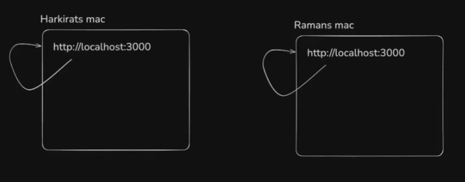
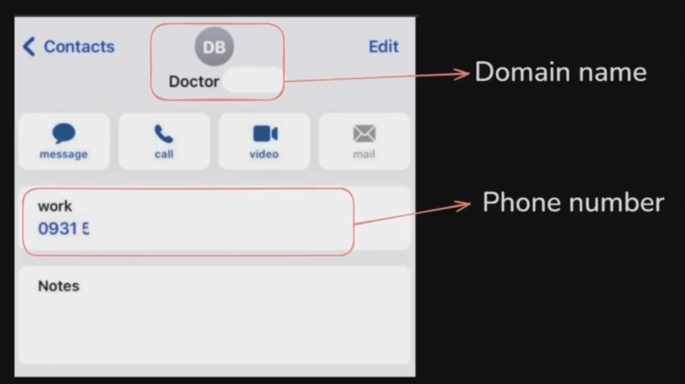
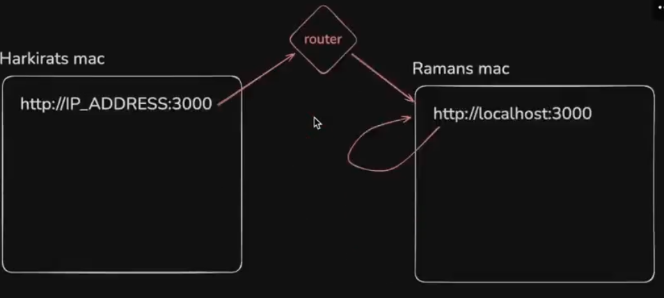
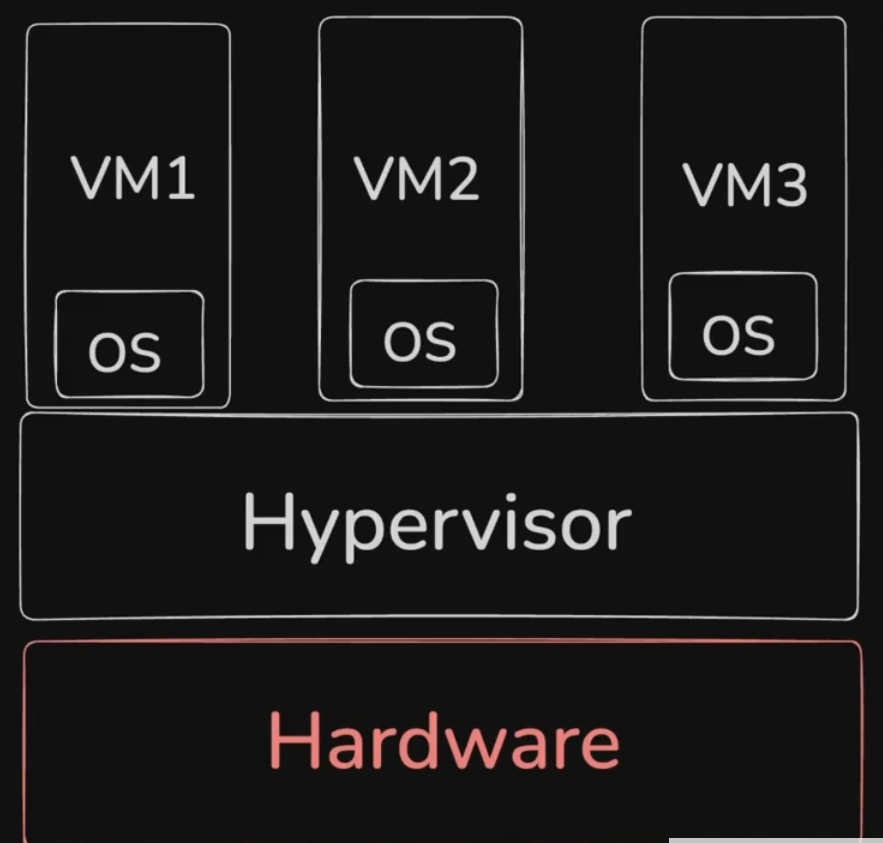

# **VMs and Deploying a MERN app**

## **Why deploying on the internet, isn't localhost enough ?**

---

Have you ever seen the below meme ->


## **Domains V/S IPs**

---

### **Localhost**

---

`Localhost` refers to the computer you're currently working on. **It's essentially a loopback address that points to the machine itself, allowing it to communicate with itself over a network.** In technical terms, the IP address for localhost is usually `127.0.0.1` for IPv4, or `::1` for IPv6



If you send the address(localhost one) of harkirat to raman, then in the raman machine, it will try to find out **its own localhost**

> [!IMPORTANT] > **`localhost` is the DOMAIN and `127.0.0.1` is known as IP**



**IP (Internet Protocol) Address:**

-   An IP address is a unique string of numbers that identifies a device on a network, like the internet. Think of it like a house address: it's how computers (or any devices on the network) know where to send information.
-   For example, `192.168.1.1` is an IP address.
-   An IP address is essential for routing data on the internet, but it's not the most human-friendly system.

**Domain Name**

-   A domain name is the readable, human-friendly address we use to access websites, like `google.com` or `facebook.com`

> [!NOTE] > **IPv4 V/S IPv6**
>
> **IPv4 ->** It can range from `0.0.0.0` to `255.255.255.255` (each is 8 bit(0 to 2^8-1 value)) only, Now this lead to the problem that it will be limited which is 256^4 (**only this much IPv4 addresses can be there in the world**) and hence because of this IPv6 was introduced
>
> **IPv6 ->**

### **Ping command**

---

Try running

```javascript
ping localhost
```

Now try running the below command

```javascript
ping google.com
```

Notice google points to a different IP address

### **Local Network, routing(mild hosting)**

---

If you have multiple laptops on the same wifi router , you can access one machine from another by using their __private IP address.__ This is a mild version of deploying your app on your local network (or __whats called the intranet__)



In the above picture, 2 people are connected to the same network(router) and as **router has a table which is basically storing the ip address so that it can serve it**

and as they both are connected to the same network, so they still be able to see the website on the two device connected without hosting on the internet as you can see above

**Steps to follow**

**Step 1 ->** Start a `node.js` process locally on port 3000

```javascript
const express = require('express')
const app = express()

const port = 3000

app.get("/", (req, res) => {
    res.send("Hello World")
})

app.listen(port, () => {
    console.log(`Server running on the port ${port}`)
})
```
**Step 2 ->** Find the IP of your machine on the local network 

```javascript
ifconfig or ipconfig 
```

>[!IMPORTANT]
> `ifconfig` or `ipconfig` -> **using this will show you all the Network interfaces (different ways to reach to your computer)**
>
> Finding your wi-fi address by running the above command is simple (just see for the human readable ip address and that is the ip address of the wifi)
>
> **You can also use `npx serve` if you are still not able to see the ip address, this gives the ip address of the network your laptop is connected to**
>
> also using the above command __you can see all the device contents of the device from which you have ran `npx serve`__ in any device which is connected to the same network as that of the device in which `npx serve` is done (try to do it in your windows terminal and go to the given site from any device, you will be able to see your pc contents in any device it returns)

**Hosts file**

You can override what your domain name resolves to by overriding the hosts file.

```javascript
vi /etc/hosts
127.0.0.01 harkirat.100xdevs.com
```

### **Homoglyph attack**
----------


Attack in which the hacker makes you a visit a website which looks same like the authentic website(UI is copied end to end) hence **tricking the user to enter the sensitive information to fill in the fake website** and hacking the user.

Now you can do the same above thing in your space also. so basically you can point the `facebook.com` ip address to your machine and then whenever someone tries to login from your machine (i.e. connected to your router), then it will go to your machine instead of `facebook.com` and you will be able to get the **username and password** and rest you know 

For this -> 

**Step 1 ->** 

```javascript
sudo vi /etc/hosts // this has all the list of dns names which you are using or you have made for your convenience
```

**Step 2 ->** 

```javascript
// Add a new your ip address for the facebook.com something like the below (basically made a new entry in the above file)

127.0.0.1 facebook.com 
// this will make sure that anyone who will search facebook.com and is connected to your network will be redirected to 127.0.0.1 (which is your ip address) 
```
>[!CAUTION]
> **Make sure to delete the entry from `sudo vi /etc/hosts` time to time nahi to pta chla facebook nhi chal rha(as it is running on local network) and you are blaming the company**

Even if you do 

```javascript
ping facebook.com 

// Output will be -> 127.0.0.1 
```
**Basically you have just change the pointing of `facebook.com` to your machine ip address instead of facebook machine**

**Step 3 ->** and now you just have to make a **good signin page of facebook.com such that no one is able to distuinguish between the original and yours made** and write the logic to get the contents of the input box of username and password and then re-direct them to original facebook.com so that **unko shak na ho** and also you have not made the page after the login

## **How to deploy apps (actual hosting) ??**

----------

1. Renting servers on a cloud
2. Rending compute yourself in datacenters
3. Self hosting (buying a CPU rack in your house)
4. Serverless providers
5. Cloud native options (k8s)

Great video to look at -> [How to deploy your website](https://www.youtube.com/watch?v=gViEtIJ1DCw)

### **What is VM ?**
----------

**VM stands for Virtual Machine**


VMS run on a physical server (called the host) but are abstracted through a layer of virtualization software called a __hypervisor__ (e.g., VMware, KVM). __This hypervisor divides the host machine's resources (CPU, memory, storage) into separate virtual machines.__(Benefit -> if anyone wants small machine, then it can be provided basically effectively distributing the machine).

Each VM acts like a completely independent machine, even though they share the underlying
hardware. You can run different operating systems and applications in different VMS on the same physical server.

VMS are highly flexible and easy to scale. You can quickly spin up, modify, or delete VMs, and you can consolidate multiple workloads on a single server.

__The virtualization layer introduces a slight overhead in terms of performance because the hypervisor needs to manage resources and ensure each VM operates independently.__ However, with modern hypervisors and powerful hardware, this overhead is minimal.



The performance problem present in the Virtual machine is handled by 

## **Bare metal Servers**
----------


