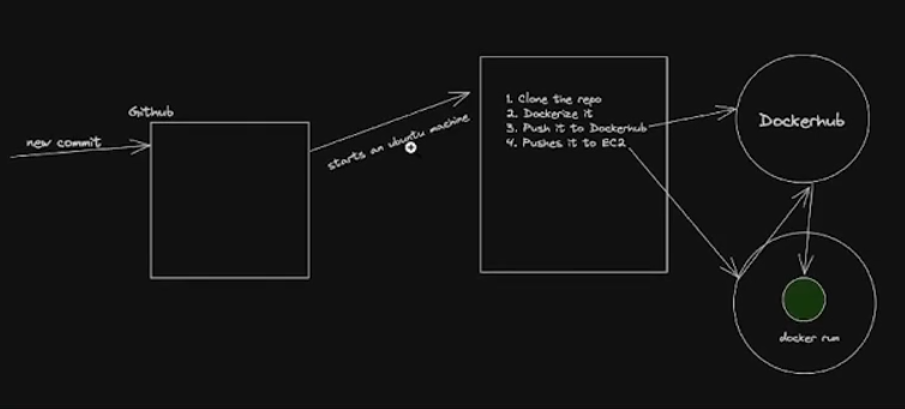
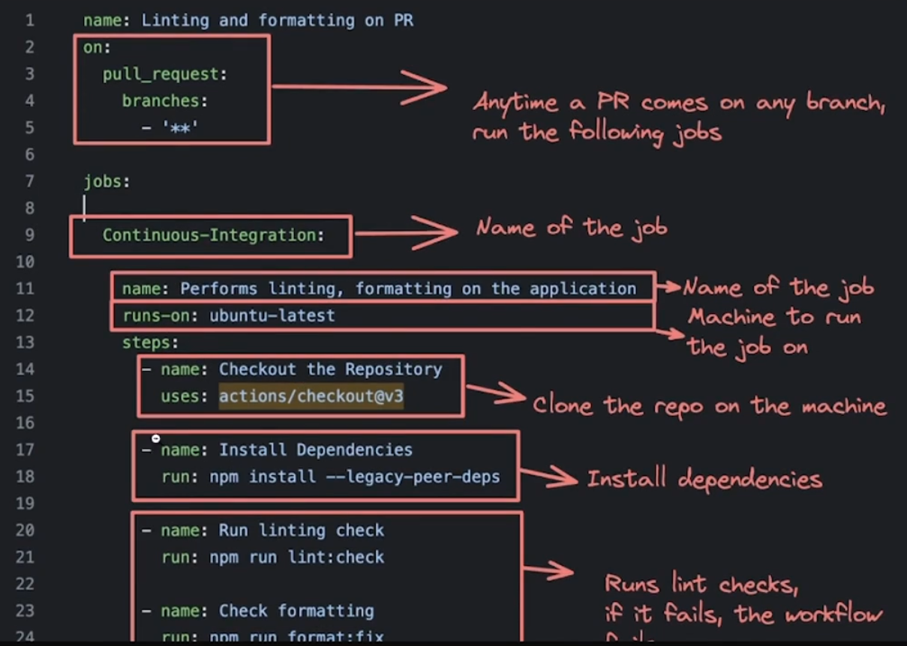
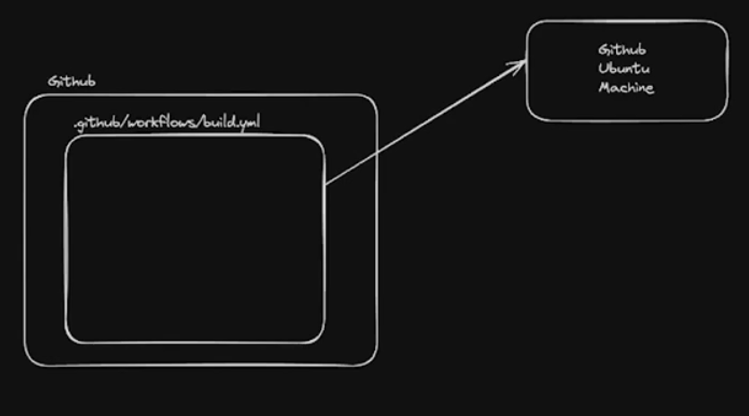
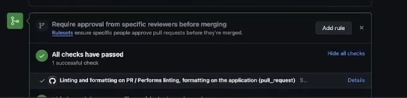

# **CI-CD Pipeline**

## **What is CI/CD ??**
----------

### __Continuous Integration__

Continuous Integration (CI) is a development practice where __developers frequently integrate their code changes into a shared repository,__ preferably several times a day. Each integration is automatically verified by
1. Building the project and
2. __Running automated tests.__

basically continuously running and integrating code into the repo on some version control systems like github

This process allows teams to detect problems early, improve software quality, and reduce the time it takes to validate and release new software updates.

Or inshort, before people push anything the maintainer can **run a workflow and can see is the code they are trying to merge in your repo is correctly LINTED, or FORMATTED**

### **Continuous Deployment**
----------
As the name suggests, deploying your code __continuously and automatically__ to various environments (dev/stage/prod).


## **CD in Github**
----------
We'll be deploying a next.js app to EC2 server via docker

> :bulb: You dont really need Docker here, since its deploying on a simple EC2 server
> If you deploy to 
>
> > 1. GCP App runner
> > 2. ECS
> > 3. Kubernetes
> 
> then it makes more sense to make it `dockerised`

### **Architecture diagram**
----------


basically the above picture says that whenever a new commit will come to the repo, github will make sure to **run some steps (mentioned as numbers)also known as WORKFLOW**, these steps are run on a machine (**you actually bring a small machine for some time to run these steps so that code can be pushed to their correct place**) 

### **Monorepo we're dealing with in this notes**
----------

The projects we are deploying with CI/CD pipeline is [CI-CD Example](https://github.com/100xdevs-cohort-2/week-18-2-ci-cd)

This monorepo has 3 apps inside :-

1. bank-webhook
2. merchant-app
3. user-app

We'll be deploying one (user-app) of these three to the same EC2 instance.[if you learn one then you just have to **copy paste the steps to deploy all of them in the same EC2 instance**]

## **How to create CI/CD Pipeline**
----------
For github, __you can add all your pipelines to `.github/workflows`__[the place where all the steps are defined]

Lets first focus on integrating the code i.e. -> CI (anytime anyone is doing pull request, i should run a workflow that makes sure the code is **building correctly**)


For ex -> [Workflow example](https://github.com/code100x/cms/blob/main/.qithub/workflows/lint.yml)

Explaining the code for a particular pipeline ->



**Create the CI pipeline**
----------

Make sure that whenever someone tries to create PR, we build the project and make sure that it builds as expected.



### **Building a pipeline for the repo**
----------
Anytime a user creates a PR, we need to run `npm run build` and only if it succeeds should the workflow succeed.

+ __Fork__ the main repo -> [Repo](https://github.com/100xdevs-cohort-2/week-18-2-ci-cd)
+ __Add `.github/workflows/build.yml` in the root folder__

+ __Create the workflow__ :- (inside the `build.yml` file)

```javascript
name: Build on PR

on: // When should this run ?? Answer is below 
  pull_request: // whenever a pull request is made on
    branches:
      - master // master branch
      - dev // you can add more branches here 

jobs:
  build: // As we have to do a single job (to build)
    name : Build the project // name given to the job 
    runs-on: ubuntu-latest // machine on which this will run 
    steps: // All the steps which you want to be done 
      - uses: actions/checkout@v3 // Clones the repository
      - name: Use Node.js 
        uses: actions/setup-node@v3 // Install node.js on the machine   
        with:
          node-version: '20'

      - name: Install Dependencies 
        run: npm install // run npm install then 

      - name: Generate Prisma client 
        run: npm run db:generate // if the project is using prisma then you have generate its client also to make the project work // 2

      - name: Run Build
        run: npm run build // and finally run npm run build 


// Also learn about actions/---something-- to know about what they do from the internet
```
make sure to add the `db:generate` required command in the `package.json` file which is 

```json
"scripts":{
    "db:generate": "cd packages/db && npx prisma generate && cd ../.."
}
```


> :pushpin: **Its not important to learn or memorise the steps, you can GOOGLE what are all the steps you require and tweak them according to the need.**
>
> > No need to be ashamed of copying the things and making changes in it

+ **Push this to `master` branch**
+ Create a **new branch** with some minimal changes and create PR from it
+ You should see the workflow run 



Now generally you will see this file being very strict like **adding test so that if a certain pull request does not pass an appropriate number of tests then that pull request will automatically get discarded and ignore the merge request of that**

**That's how you CREATE A CI PIPELINE**

### **Lets add a deploy step**

----------

Now that **CI has been done**, lets understand **CD** 


