# **Starting Docker**

## **Why Docker ??**
----------

Docker/containers are important for a few reasons -

1. Kubernetes/Container orchestration
2. Running processes in isolated environments
3. Starting projects/auxilary services locally
    + you might have seen some people running some service locally like for postgres they use -> `docker run POSTGRES—PASSWORD=mysecretpassword -d -p 5432:5432 postgres`, they dont install postgres they run it inside the docker container. so anytime you want to install any service like mongoDB, redis, postgres you can either **install them in your machine** or you can **run it locally on your machine inside the docker container hence not needing them to install inside your computer locally**
    + Also you can see the **commands are very simple and that too very similar also** like for redis command become -> `docker run -d -p 6739:6739 redis` (you can see `postgres` and `redis` commands looks very similar although they are different sevices)
    + No need to go to official docs and see how to install `redis` or any particular service
    + **Projects ->** Every open source project has __two ways to start,__ one by traditional way (`git clone github url` then `npm install` then `node index.js` then some more step) and the other one is **docker command** which is **just single command -> `docker compose ...something` just by running this you will be able to run your project on your machine**

**Explanation of 2nd point**

There are few steps which you have to go through while running a project like `node index.js` and then some more steps and so on.. and there can be circumstances where your friend send you a project and when you ran `node index.js` then as `index.js` may have some vulnerable code which gets into your computer thus causing some serious databreach.

**so docker lets you run your project in isolated environment basically run it inside what called as DOCKER CONTAINER so if you run it inside this, it will not be able to access the files and folder present in your host machine as docker has its own file system machine which gets runned every time you run the docker container consisting of your project**

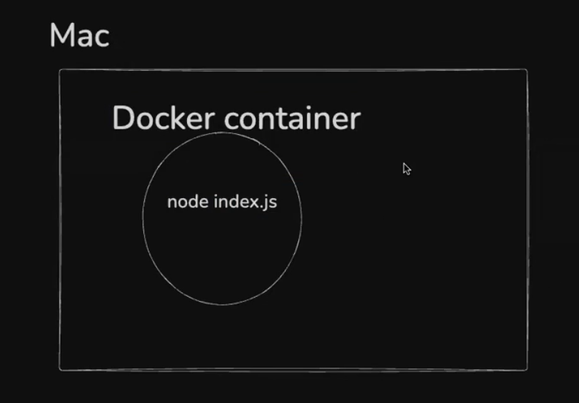

> :pushpin: The machine which runs inside the docker is not Virtual machine (it is similar but not same), docker makes a container for every project and inside this container process runs


## **Containerization**
----------

:bulb: **What are containers ??**

Containers are a __way to package and distribute software applications in a way that makes them easy to deploy and run consistently across different environments.__(commands remain same for all types of environment be it linux, be it macos or be it windows). They allow you to package an application, along with all its dependencies and libraries, into a single unit that can be run on any machine with a container runtime, such as Docker.

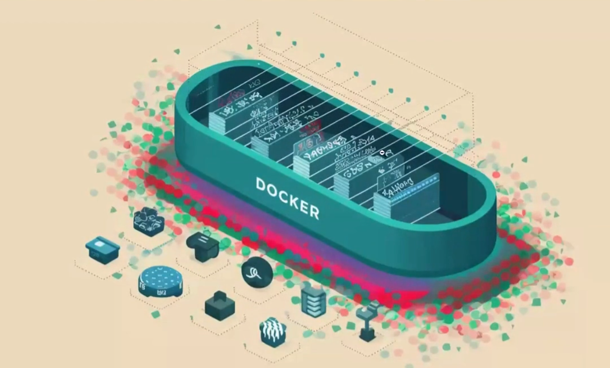

simply saying you can run `node index.js` on your machine but maybe on some other machine you will not be able to run it because he/she has not installed `node.js` in their computer but if you have **containerize your project inside the docker, then even though someone has not installed `node.js` or any other dependency they will still be able to run your project**

<span style="color:orange">**As long as docker is installed in your pc, you dont have to install any of the dependency present in some project**</span>

> :pushpin: <span style="color:orange">**Remember ->**</span> **Koi v service docker me run krne ke baad tmhare machine me nhi aa jata h it comes in the machine present inside the container.**

:bulb: **Why containers ??**

1. Everyone has different Operating systems
2. Steps to run a project can vary based on OS (explanation of the above point)
3. Extremely harder to keep track of dependencies as project grows (basically boht sari cheez use kiya h tmne project me to if a new developer comes, he/she has to **install all these big bundle of different things locally imaging the amount of effort**)

### **Benefit of using container**

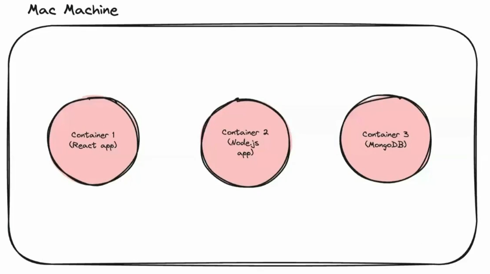

1. Let you describe your `configuration` in a single file
2. Can run in isolated environments
3. Makes Local setup of OS projects a breeze
4. Makes installing auxiliary services/DBs easy

**References**

+ For reference, the following command starts `mongo` in all operating systems -> 

```javascript
docker run -d -p 27017:27017 mongo 
```

+ Docker isnt the only way to create containers. (container eventually become the synonym of docker). **Podman is another something like docker**

## **History of docker**
----------

Docker is a YC backed company, started in -2014

They envisioned a world where containers would become mainstream and
people would deploy their applications using them which is mostly true today

Most projects that you open on Github will/should have docker files in them
(a way to create docker containers)

For detailed journey refer this blog post -> [Idea behind docker](https://www.ycombinator.com/blog/solomon-hykes-docker-dotcloud-interview/)

## **Installing docker**

Go to the site -> [Dcoker install](https://docs.docker.com/desktop/) and then scroll downward and you will see an option to install the docker just install it and that's it you are good to go. after installation, just run the below command to cross verify whether docker has been installed in your pc or not 

```javascript
docker --version
```

If you are able to see the version of docker then you are good to go, docker has been successfully installed in your computer but if you are not getting it then definitely you have ran into some problem and hence try to see the videos on youtube or try reinstalling it.

## **Docker architecture**
----------

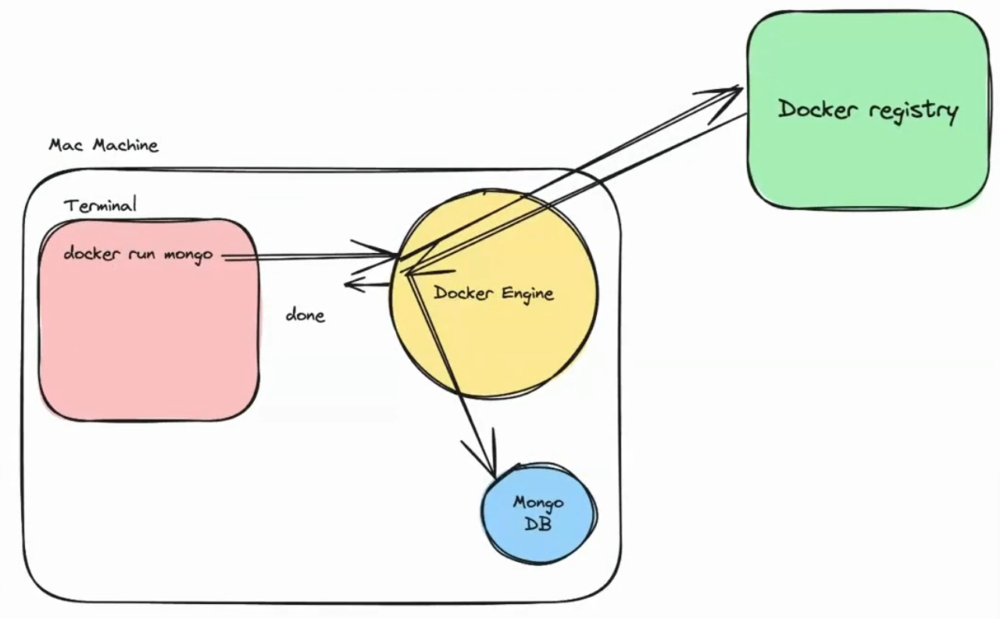

As an application/full stack developer, you need to be comfortable with the
following terminologies -

I. Docker Engine
2. Docker CLI - Command line interface
3. Docker registry

**Understanding the component**
----------

1. **Docker Engine ->** Docker Engine is an open-source `containerization` technology that allows containerization developers to package applications into container.(**basically this is only responsible for making containers**)

Containers are standardized executable components combining application source code with the operating system (OS) libraries and dependencies required to run that code in any environment.

2. **Docker CLI ->** The command line interface lets you talk to the
`docker enginer` and __lets you start/stop/list containers__

```javascript
docker run -d -p 27017:27017 mongo
```

__Docker cli is not the only way to talk to a docker engine. You can hit the docker `REST` API to do the same things__

3. **Docker Registry ->** `docker registry` is __how Docker makes money.__
   
It is similar to `github` but it lets you push images rather than sourcecode

Docker's main registry -> https://www.docker.com/products/docker-hub/

Mongo image on docker registry -> https://hub.docker.com/_/mongo

If you in the future will make the image(understand it as package) then you will also push this in docker registry so that everyone can use it, its very similar to `node package manager`, there also different packages are inside it and you just use them via cli command. There are various places where you can push your images but `hub.docker` one is the official by docker but there are different services that also provide this feature like `AWS ECR` (**It is like container registry**)

Now see the power of container, just run this command while making sure that **your docker desktop is running in background**

```javascript
docker run mongo 
```
and runnning this only **you are able to make run the mongo locally and thus can use it even**

:bulb:**How to verify it ??**

-> go to the mongoDB compass app/GUI for pc and there you will see something like the below interface 

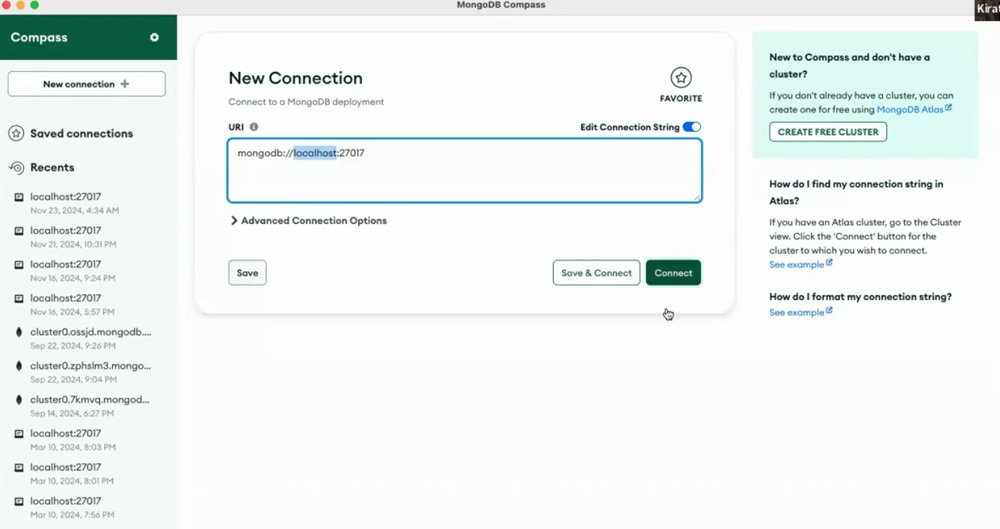

now as you have run `mongo` **locally not on some cloud container** hence you will see the default port(`27017`) for mongo to run locally (**localhost**), and then try to connect to the **default localhost website given (`mongodb://localhost:27017`)** then you will still not be able to connect to although you can think that ideally it should have run as we have given command `docker run mongo`

It **is because of PORT MAPPING (will study in the upcoming section)** but for now just make changes and run the below command

```javascript
docker run -p 27017:27017 mongo 
```

You can and **should delete any service after using it as the services still takes the space in your pc** so to do that 

```javascript
docker rmi mongo --force
```
above we have removed mongo but you can remove any service from docker which you installed previously by running `docker run -p port_no. service_name` by using similar command 

**To see what are the services present in your docker locally run the below command**

```javascript
docker images
```

## **Images V/S Containers**
----------

:round_pushpin: **A good interview question is what is thee difference between docker image and container ??**

### **Docker image**
----------

A Docker image is a __lightweight, standalone, executable package that includes everything needed to run a piece of software, including the code, a runtime, libraries, environment variables, and config files.__

> :pushpin: **A good mental model <span style="color:orange">**way to rememeber is,**</span> for an image is `Your codebase on github`**
>
> It is basically <span style="color:orange">**Everything needed to run that software**</span>

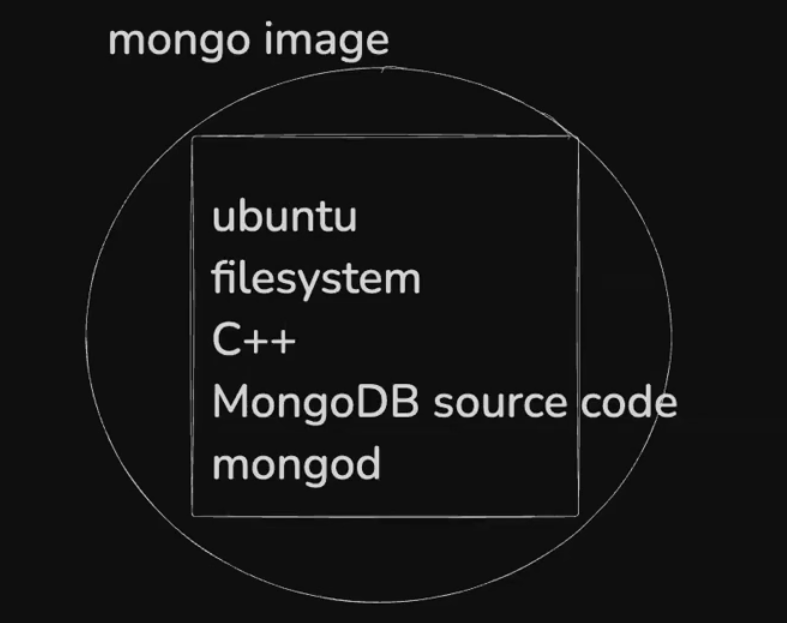


### **Docker container**
----------

A container __is a running instance of an image. It encapsulates the application or service and its dependencies, running in an isolated environment.__


> :pushpin: **A good mental model <span style="color:orange">**way to remember is,**</span> for a container is when you run `node Index ts` on your machine from some source code you got from github**
>
> It is basically **Things which is starting or stopping is called as container**, you basically start or stop the container not the image and this container will be made after you run any service on docker (also for every service a seperate container run)

**To see the number of container running run the below command**

```javascript
docker ps
```

This will show all the container which is running locally with their **process id** to **stop and container run the below command with the container process id**

```javascript
docker kill PROCESS_ID
```
The above command does not mean that **images are not present, its like you have not started them or basically stopped them**

**thats why you say "An image in execution is called as Container"**

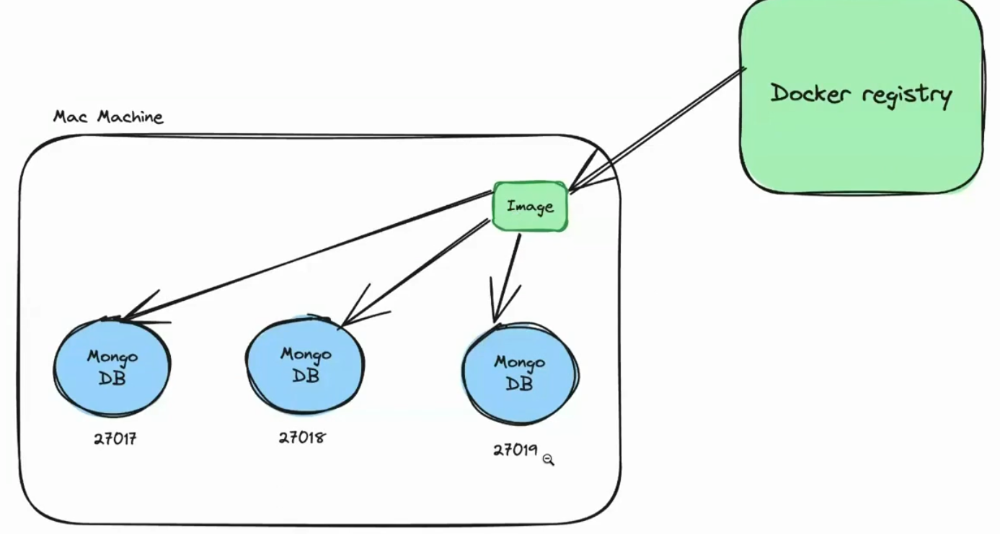

You can also run multiple times any image as shown above

for example -> lets say you want to run 3 mongo container for some reason so for this 

**Just split your terminal into 3 parts and then in each of them just run**

```javascript
docker run mongo
```
and that's it you have ran 3 mongo container locally on your machine.

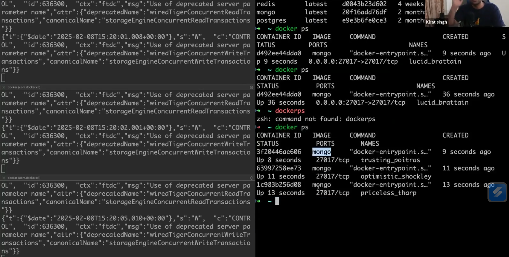

:bulb:**YOu might be having doubt that why port conflict is not happening here, why and how they automatically got different ports ??**

-> which will be answered in the upcoming pages.

but for the port conflict question, as you have not **given the port in all the above command hence you are not getting port conflict but eventually you will get that also and then we will see how it works and how to fix it**

### **Port mapping**
----------

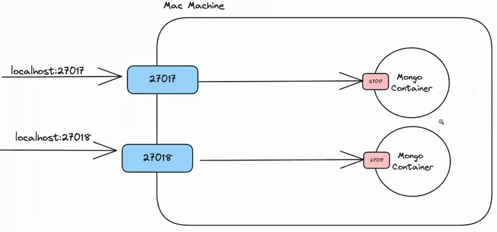

One great thing about docker is that as it seperates out the container from your machine so although you ran `mongo` image and the container started on port `27017` (which is the default port for mongo), still **your machine port `27017` is empty and hence you can run anyother process on this port**

**Basically container ke port `27017` pe `mongo` chal rha h and your pc ke port `27017` pe `node process` or any other service chal rha h AS WE KNOW THAT DOCKER CREATES AN ISOLATED ENVIRONMENT**

Now if you want that your pc ka port get linked to the container ka port, then in that case, you **use PORT MAPPING** so that you can map your two ports to each other and this is what you see while running the docker command 

```javascript
docker run -p 27017:27017 mongo
```
basically you are telling that your machine port `27017` is mapped to the container port `27017` and that's what the above image also says 

YOu can see the benefit in the picture itself, you can run two process at the same time with just changing the port of you machine (obviously same port will result in port conflict)

example is shown in the above picture 

```javascript
docker run -p 27017:27017 mongo
docker run -p 27018:27017 mongo
```

now these both are two independent mongo containers(here in this case both can have different database) running locally on your machine


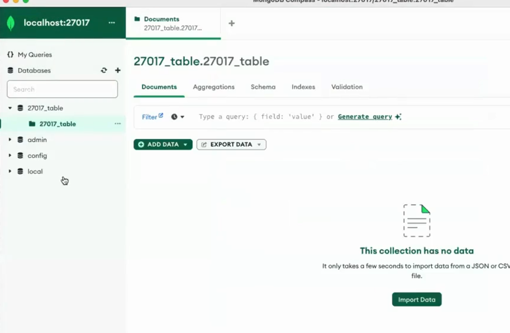 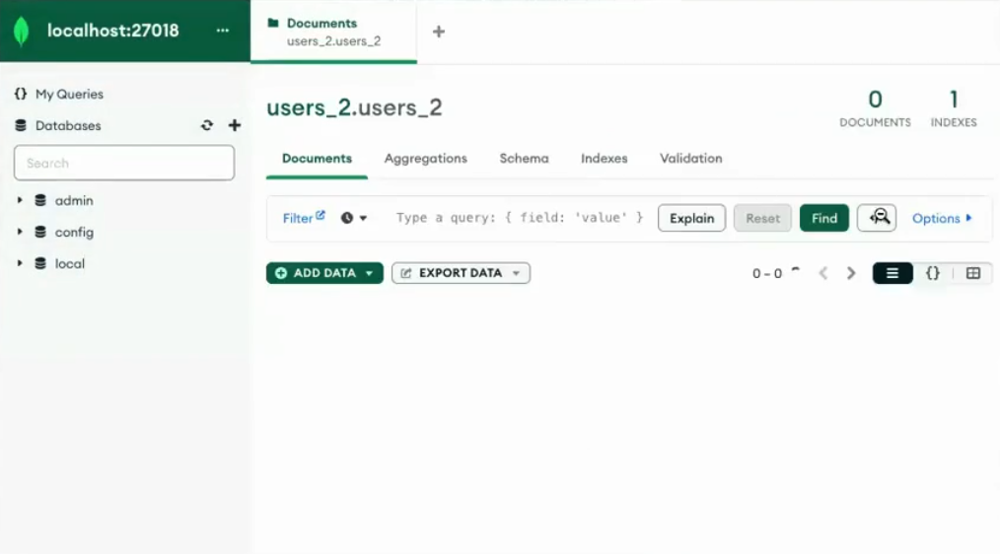

can you see the database present in one is not present in the other


In both the container, you can put different data as they are independent

so till now you have understood why port mapping is required -> without port mapping you will not be able **to start the container locally**

basically **the first port depends on you (which port you want to open) and second thing depends on the by default image in the dockhub registry.**

### **Common docker commands**
----------

#### **docker images**

shows you all the images that you have on your machine

#### **docker ps**

shows you all the containers you are running on your machine 

#### **docker run**

Lets you start a container 

+ **-p** -> lets you create a port mapping
+ **-d** -> lets you run in detached mode


#### **docker kill**

Lets you stop any container if (provide it with container id)

#### **docker build**

Lets you build an image. We will see this after we understand how to create your own `dockerfile`

#### **docker push**

Lets you push your image into registry

#### **docker exec**

Lets you **execute something inside the container**. (lets say you want to run a command or any specific files inside the container then you used this command to execute that inside your container)

see the below image for better understanding

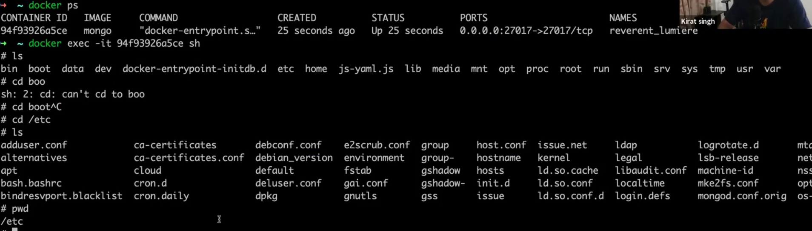

you can see now you are inside the container just by using the comand 

```javascript
docker exec -it container_name_or_id sh 
```

**`it` only in INTERACTIVE mode you will be able to get access to the terminal of the container**

or you can also run any command like 

```javascript
docker exec container_name_or_id ls /path  // gives you the file and folder present inside the /path 
docker exec container_name_or_id mkdir app // makes a new directory app in the current directory
```

**sh ->** means `shell` or terminal, you are getting **shell access**

**it ->** means in `interactive` mode

Using the above command you are inside the container and has got the shell access of this container and hence can **run any terminal command to get information about the files and folder present in this container**

## **Dockerfile**
----------

:bulb:**What is dockerfile ??**

If you want to create an image from your own code, that you can push to `dockerhub` , you need to create a `dockerfile` for your application.

A Dockerfile is a __text document that contains all the commands a user could call on the command line to create an image.__

If you want to make your own image(which eventually you would), then you must have to use this 

Perks of making dockerfile ->

+ If you want to containerise something then you will have to use this 
+ Containerising will let your project available to all over the world.

:bulb:**How to conatinerise some project ??**

-> see for everything you want to containerise, there can be some slight changes if it realted to database, or any node process etc.. (**But concept remain same**)

For now first taking example of how to containerise a `node` process ??

so first making a simple node process project named as `NodejsProject` folder

just make a `index.js` file and then inside it write this code 


```javascript
const express = require("express")

const app = express()

app.get("/", (req, res) => {
  res.send("Hello world")
})

app.listen(3000)
```

also using `npm install express` to install express as it is being used in the project

now running the project by using `node index.js`

**to containerise any project, it is done by Dockerfile**

:bulb:**How to write the dockerfile ??**

A dockerfile has 2 parts ->

1. **Base image**
2. **Bunch of commands that you run on the base image (to install dependencies like Node.js)**

Lets write our own dockerfile

so as you made `NodejsProject` folder for your `node` process, now make another file named as **Dockerfile** inside the root folder (eventually we will see it elsewhere also) but for the time being make it in the root folder.

inside the dockerfile you **describe how your project will be built**(what all dependency are there in your project for ex -> your porject has `express`, `mongoDb`, `environment` variables, exposes 3000 port, `node.js` dependency) so **write all this things inside this file** 

> :pushpin:<span style="color:orange">**This (`Dockerfile`) is like a configuration file describing everything you need to start this project locally**</span>
>
> You have to give **step by step process** to how to run their project locally


Now if you see to your project, to run it locally -> you have to run in this manner ->

1. install `node.js`
2. clone the repo/ copy the `index.js` file and the `package.json` file
3. run npm install
4. run `node index.js`

so basically our task is to **write the above steps in docker understandable format and then write it inside the `Dockerfile`**

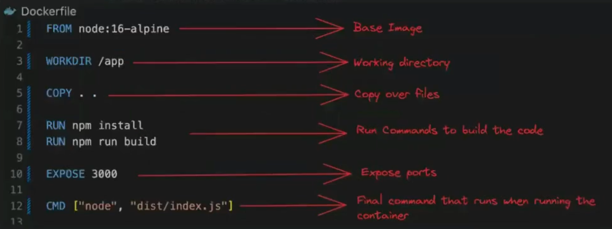

Lets understand all of the above one by one ->

1. **Base image (FROM)->** Basically every Dockerfile starts with some **base or starting point**. you can treat this as the first thing to do while make an image. Now taking the above example -> i have to install `node.js` first so i can do **either build from scratch** in this case base image value will be **`scratch`** or inside the `Dockerfile`

```javascript
FROM scratch 

// and then do npm install
```


OR  

you can also do this **why not take the preinstalled `node` image present on the dockerhub and take it as base image** as eventually in both the approach you are first installing the `node.js` the difference is that in one you are doing all things form **scratch** and in other you have just used the **readymade `node` image** and hence as our project is `node.js` project so directly used it as base image

:bulb:**what if i have `node` and `go` mixed project ??**

-> in this case you can choose any one of them as base image and then install th other one 

> :pushpin: **Usually base image is taken mostly the image which is present on the dockerhub (already built by someone) to avoid complexity but yes you can use `scratch` and then build everything from scratch**
>
> Most of the times you will  see `FROM ubuntu` (`ubuntu` as the base image) when the project contains of different types of langauges, libraries and frameworks

For now if you see the image we have used `FROM node:22-alpine` as we are dealing with just a simple `node` project and also `alpine` is **just the SMALLER VERSION of `node`**(smaller size as compared to traditional `node`) but yes you can use the common `node` also

2. **Working directory (WRKDIR) ->** what is your working directory (**where do you want to store all the code finally ??**)

Common ones are -> `WRKDIR /usr/bin/app`, `WRKDIR /app` but again its up to you and your project that where do you want to write all the code 


3. **Copy command (COPY ..) ->** first `.` represents **copy everything from this folder** and the second `.` represents **to everything in this docker container**

you can also do like this `COPY ./index.js ./index.js` this will take the current folder `index.js` file and put it inside the docker container `index.js` which is inside the `WRKDIR`

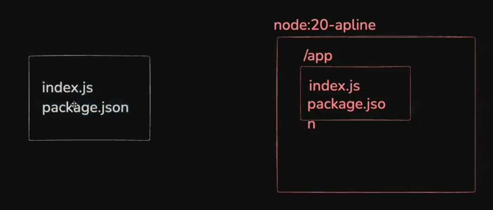

But `COPY..` -> this will **copy everything from your folder and push it to the work directory**, Now is the issue -> **copying everything will let copy `node_modules` folder also which ideally SHOULD NOT BE COPIED** 

:warning: <span style="color:orange">**Hence you should take care of the above point while using `COPY..` command**</span>

To achieve the above aim, you can use **`.dockerignore` file** -> which **works same as `.gitignore` file.**[Ignores all the files and folders included in this file and hence `COPY..` can be used hassle-free], as we want **fresh installment into the new machine as maybe that machine has different way of installing `node.js` on their machine**

4. **Running the command (RUN) ->** Used to run a specific command which will used to **run your project**

ex -> in the above picture ->

```javascript
RUN npm install 
RUN npm run build  // if it was a ts project then you have to run this also
RUN prisma migrate // this and below command if you were using prisma also in your project
RUN prismae generate 
```

5. **Port Number (EXPOSE port_no) ->** Lets you tell the port at which the project will run. You dont need this compulsorly

6. **Final command (CMD) ->** Very slight difference with the `RUN` command you saw above. `RUN` is **used when you are generating/ CREATING the image** but `CMD` is **used when you are RUNNING the image** basically `CMD` says **what to run when the container will start ??**

:warning:<span style="color:orange">**You can only have 1 `CMD` in your `Dcokerfile` BUT you can have multiples `RUN`**</span>

```java
CMD ["node", "index.js"]
```
so when someone will run your project by using the docker command which looks something like this -> `docker run port_no project_name` then only `CMD` will run i.e. -> taking the above case -> `node index.js` will run 

> :pushpin: **All the things which are above `CMD` run when you are <span style="color:orange">**building the image**</span> and `CMD` things run when you are <span style="color:orange">**Running the image**</span>**

### **Passing in `env` variables**
----------

You should ideally dont put any `env` variables inside any files **rather pass it at the time of running the docker container**

and to do the above task ->

```java
docker run -p 3000:3000 -e DATABASE_URL=mongodb@localhost hello-world
```

using `-e` followed by the **environment variable name with value** will make that variable with value **being pushed inside the environment variable**


Now lets delve deep into `docker build` command 

### **docker build in deep**
----------


Once you have made your project (or image), its time to build it so syntax for it is 

```java
docker build -t name_of_your_image location_of_dockerfile_youare_trying_to_build
```

Example -> `docker build -t hello-world .`

**`-t` ->** means **TAG of the project**
**`.` ->** means it is present inside the root folder only or the directory in which the terminal current path is being shown **current folder or root folder**

and after this command gets executed, now if you run `docker images`, then you will be able to **see your image which you just built** still this has not yet been visible to everyone on the world, it is private to yourself

Now you can also run your project(`hello-world`) by just running one command `docker run -p 3000:3000 hello-world` 

### **How to push your made image to dockerhub ??**

-> to make sure that everyone in the world is able to use your image, you have to deploy it to the `dockerhub` and **the steps are very simple with that you used to do to deploy your project on github**


Go to [Dockerhub create repository](https://hub.docker.com/repository/create/) and then you can create your repository for yourself but before that make sure to `singin` or `signup` to dockerhub

**Its very similar to github and even the process is also very similar as that you do to deploy to github**

and now inside you terminal just **login using `docker login`** and then provide your credentials(to be done only for the first time) and then just run the command `docker push` and that's it you will be able to see your image on the dockerhub and **now everyone can use this to run your image and can download**


 


