# **Starting Docker**

## **Why Docker ??**
----------

Docker/containers are important for a few reasons -

1. Kubernetes/Container orchestration
2. Running processes in isolated environments
3. Starting projects/auxilary services locally
    + you might have seen some people running some service locally like for postgres they use -> `docker run POSTGRES—PASSWORD=mysecretpassword -d -p 5432:5432 postgres`, they dont install postgres they run it inside the docker container. so anytime you want to install any service like mongoDB, redis, postgres you can either **install them in your machine** or you can **run it locally on your machine inside the docker container hence not needing them to install inside your computer locally**
    + Also you can see the **commands are very simple and that too very similar also** like for redis command become -> `docker run -d -p 6739:6739 redis` (you can see `postgres` and `redis` commands looks very similar although they are different sevices)
    + No need to go to official docs and see how to install `redis` or any particular service
    + **Projects ->** Every open source project has __two ways to start,__ one by traditional way (`git clone github url` then `npm install` then `node index.js` then some more step) and the other one is **docker command** which is **just single command -> `docker compose ...something` just by running this you will be able to run your project on your machine**

**Explanation of 2nd point**

There are few steps which you have to go through while running a project like `node index.js` and then some more steps and so on.. and there can be circumstances where your friend send you a project and when you ran `node index.js` then as `index.js` may have some vulnerable code which gets into your computer thus causing some serious databreach.

**so docker lets you run your project in isolated environment basically run it inside what called as DOCKER CONTAINER so if you run it inside this, it will not be able to access the files and folder present in your host machine as docker has its own file system machine which gets runned every time you run the docker container consisting of your project**


> :pushpin: The machine which runs inside the docker is not Virtual machine (it is similar but not same), docker makes a container for every project and inside this container process runs


## **Containerization**
----------

:bulb: **What are containers ??**

Containers are a __way to package and distribute software applications in a way that makes them easy to deploy and run consistently across different environments.__(commands remain same for all types of environment be it linux, be it macos or be it windows). They allow you to package an application, along with all its dependencies and libraries, into a single unit that can be run on any machine with a container runtime, such as Docker.


simply saying you can run `node index.js` on your machine but maybe on some other machine you will not be able to run it because he/she has not installed `node.js` in their computer but if you have **containerize your project inside the docker, then even though someone has not installed `node.js` or any other dependency they will still be able to run your project**

<span style="color:orange">**As long as docker is installed in your pc, you dont have to install any of the dependency present in some project**</span>

> :pushpin: <span style="color:orange">**Remember ->**</span> **Koi v service docker me run krne ke baad tmhare machine me nhi aa jata h it comes in the machine present inside the container.**

:bulb: **Why containers ??**

1. Everyone has different Operating systems
2. Steps to run a project can vary based on OS (explanation of the above point)
3. Extremely harder to keep track of dependencies as project grows (basically boht sari cheez use kiya h tmne project me to if a new developer comes, he/she has to **install all these big bundle of different things locally imaging the amount of effort**)

### **Benefit of using container**


1. Let you describe your `configuration` in a single file
2. Can run in isolated environments
3. Makes Local setup of OS projects a breeze
4. Makes installing auxiliary services/DBs easy

**References**

+ For reference, the following command starts `mongo` in all operating systems -> 

```javascript
docker run -d -p 27017:27017 mongo 
```

+ Docker isnt the only way to create containers. (container eventually become the synonym of docker). **Podman is another something like docker**

## **History of docker**
----------

Docker is a YC backed company, started in -2014

They envisioned a world where containers would become mainstream and
people would deploy their applications using them which is mostly true today

Most projects that you open on Github will/should have docker files in them
(a way to create docker containers)

For detailed journey refer this blog post -> [Idea behind docker](https://www.ycombinator.com/blog/solomon-hykes-docker-dotcloud-interview/)

## **Installing docker**

Go to the site -> [Dcoker install](https://docs.docker.com/desktop/) and then scroll downward and you will see an option to install the docker just install it and that's it you are good to go. after installation, just run the below command to cross verify whether docker has been installed in your pc or not 

```javascript
docker --version
```

If you are able to see the version of docker then you are good to go, docker has been successfully installed in your computer but if you are not getting it then definitely you have ran into some problem and hence try to see the videos on youtube or try reinstalling it.

## **Docker architecture**
----------


As an application/full stack developer, you need to be comfortable with the
following terminologies -

I. Docker Engine
2. Docker CLI - Command line interface
3. Docker registry

**Understanding the component**
----------

1. **Docker Engine ->** Docker Engine is an open-source `containerization` technology that allows containerization developers to package applications into container.(**basically this is only responsible for making containers**)

Containers are standardized executable components combining application source code with the operating system (OS) libraries and dependencies required to run that code in any environment.

2. **Docker CLI ->** The command line interface lets you talk to the
`docker enginer` and __lets you start/stop/list containers__

```javascript
docker run -d -p 27017:27017 mongo
```

__Docker cli is not the only way to talk to a docker engine. You can hit the docker `REST` API to do the same things__

3. **Docker Registry ->** `docker registry` is __how Docker makes money.__
   
It is similar to `github` but it lets you push images rather than sourcecode

Docker's main registry -> https://www.docker.com/products/docker-hub/

Mongo image on docker registry -> https://hub.docker.com/_/mongo

If you in the future will make the image(understand it as package) then you will also push this in docker registry so that everyone can use it, its very similar to `node package manager`, there also different packages are inside it and you just use them via cli command. There are various places where you can push your images but `hub.docker` one is the official by docker but there are different services that also provide this feature like `AWS ECR` (**It is like container registry**)

Now see the power of container, just run this command while making sure that **your docker desktop is running in background**

```javascript
docker run mongo 
```
and runnning this only **you are able to make run the mongo locally and thus can use it even**

:bulb:**How to verify it ??**

-> go to the mongoDB compass app/GUI for pc and there you will see something like the below interface 


now as you have run `mongo` **locally not on some cloud container** hence you will see the default port(`27017`) for mongo to run locally (**localhost**), and then try to connect to the **default localhost website given (`mongodb://localhost:27017`)** then you will still not be able to connect to although you can think that ideally it should have run as we have given command `docker run mongo`

It **is because of PORT MAPPING (will study in the upcoming section)** but for now just make changes and run the below command

```javascript
docker run -p 27017:27017 mongo 
```

You can and **should delete any service after using it as the services still takes the space in your pc** so to do that 

```javascript
dcoker rmi name_of_service --force  

// for example as we are here using mongo so we will use the below command
docker rmi mongo --force
```
above we have removed mongo but you can remove any service from docker which you installed previously by running `docker run -p port_no. service_name` by using similar command 

**To see what are the services present in your docker locally run the below command**

```javascript
docker images
```

## **Images V/S Containers**
----------

:round_pushpin: **A good interview question is what is thee difference between docker image and container ??**

### **Docker image**
----------

A Docker image is a __lightweight, standalone, executable package that includes everything needed to run a piece of software, including the code, a runtime, libraries, environment variables, and config files.__

> :pushpin: **A good mental model <span style="color:orange">**way to rememeber is,**</span> for an image is `Your codebase on github`**
>
> It is basically <span style="color:orange">**Everything needed to run that software**</span>


### **Docker container**
----------

A container __is a running instance of an image. It encapsulates the application or service and its dependencies, running in an isolated environment.__


> :pushpin: **A good mental model <span style="color:orange">**way to remember is,**</span> for a container is when you run `node Index ts` on your machine from some source code you got from github**
>
> It is basically **Things which is starting or stopping is called as container**, you basically start or stop the container not the image and this container will be made after you run any service on docker (also for every service a seperate container run)

**To see the number of container running run the below command**

```javascript
docker ps
```

This will show all the container which is running locally with their **process id** to **stop and container run the below command with the container process id**

```javascript
docker kill PROCESS_ID
```
The above command does not mean that **images are not present, its like you have not started them or basically stopped them**

**thats why you say "An image in execution is called as Container"**


You can also run multiple times any image as shown above

for example -> lets say you want to run 3 mongo container for some reason so for this 

**Just split your terminal into 3 parts and then in each of them just run**

```javascript
docker run mongo
```
and that's it you have ran 3 mongo container locally on your machine.


:bulb:**YOu might be having doubt that why port conflict is not happening here, why and how they automatically got different ports ??**

-> which will be answered in the upcoming pages.

but for the port conflict question, as you have not **given the port in all the above command hence you are not getting port conflict but eventually you will get that also and then we will see how it works and how to fix it**

### **Port mapping**
----------


One great thing about docker is that as it seperates out the container from your machine so although you ran `mongo` image and the container started on port `27017` (which is the default port for mongo), still **your machine port `27017` is empty and hence you can run anyother process on this port**

**Basically container ke port `27017` pe `mongo` chal rha h and your pc ke port `27017` pe `node process` or any other service chal rha h AS WE KNOW THAT DOCKER CREATES AN ISOLATED ENVIRONMENT**

Now if you want that your pc ka port get linked to the container ka port, then in that case, you **use PORT MAPPING** so that you can map your two ports to each other and this is what you see while running the docker command 

```javascript
docker run -p 27017:27017 mongo
```
basically you are telling that your machine port `27017` is mapped to the container port `27017` and that's what the above image also says 

YOu can see the benefit in the picture itself, you can run two process at the same time with just changing the port of you machine (obviously same port will result in port conflict)

example is shown in the above picture 

```javascript
docker run -p 27017:27017 mongo
docker run -p 27018:27017 mongo
```

now these both are two independent mongo containers(here in this case both can have different database) running locally on your machine


 

can you see the database present in one is not present in the other


In both the container, you can put different data as they are independent

so till now you have understood why port mapping is required -> without port mapping you will not be able **to start the container locally**

basically **the first port depends on you (which port you want to open) and second thing depends on the by default image in the dockhub registry.**

### **Common docker commands**
----------

#### **docker images**

shows you all the images that you have on your machine

#### **docker ps**

shows you all the containers you are running on your machine 

#### **docker run**

Lets you start a container 

+ **-p** -> lets you create a port mapping
+ **-d** -> lets you run in detached mode


#### **docker kill**

Lets you stop any container if (provide it with container id)

#### **docker build**

Lets you build an image. We will see this after we understand how to create your own `dockerfile`

#### **docker push**

Lets you push your image into registry

#### **docker exec**

Lets you **execute something inside the container**. (lets say you want to run a command or any specific files inside the container then you used this command to execute that inside your container)

see the below image for better understanding


you can see now you are inside the container just by using the comand 

```javascript
docker exec -it container_name_or_id sh 
```

**`it` only in INTERACTIVE mode you will be able to get access to the terminal of the container**

or you can also run any command like 

```javascript
docker exec container_name_or_id ls /path  // gives you the file and folder present inside the /path 
docker exec container_name_or_id mkdir app // makes a new directory app in the current directory
```

**sh ->** means `shell` or terminal, you are getting **shell access**

**it ->** means in `interactive` mode

Using the above command you are inside the container and has got the shell access of this container and hence can **run any terminal command to get information about the files and folder present in this container**

## **Dockerfile**
----------

:bulb:**What is dockerfile ??**

If you want to create an image from your own code, that you can push to `dockerhub` , you need to create a `dockerfile` for your application.

A Dockerfile is a __text document that contains all the commands a user could call on the command line to create an image.__

If you want to make your own image(which eventually you would), then you must have to use this 

Perks of making dockerfile ->

+ If you want to containerise something then you will have to use this 
+ Containerising will let your project available to all over the world.

:bulb:**How to conatinerise some project ??**

-> see for everything you want to containerise, there can be some slight changes if it realted to database, or any node process etc.. (**But concept remain same**)

For now first taking example of how to containerise a `node` process ??

so first making a simple node process project named as `NodejsProject` folder

just make a `index.js` file and then inside it write this code 


```javascript
const express = require("express")

const app = express()

app.get("/", (req, res) => {
  res.send("Hello world")
})

app.listen(3000)
```

also using `npm install express` to install express as it is being used in the project

now running the project by using `node index.js`

**to containerise any project, it is done by Dockerfile**

:bulb:**How to write the dockerfile ??**

A dockerfile has 2 parts ->

1. **Base image**
2. **Bunch of commands that you run on the base image (to install dependencies like Node.js)**

Lets write our own dockerfile

so as you made `NodejsProject` folder for your `node` process, now make another file named as **Dockerfile** inside the root folder (eventually we will see it elsewhere also) but for the time being make it in the root folder.

inside the dockerfile you **describe how your project will be built**(what all dependency are there in your project for ex -> your porject has `express`, `mongoDb`, `environment` variables, exposes 3000 port, `node.js` dependency) so **write all this things inside this file** 

> :pushpin:<span style="color:orange">**This (`Dockerfile`) is like a configuration file describing everything you need to start this project locally**</span>
>
> You have to give **step by step process** to how to run their project locally


Now if you see to your project, to run it locally -> you have to run in this manner ->

1. install `node.js`
2. clone the repo/ copy the `index.js` file and the `package.json` file
3. run npm install
4. run `node index.js`

so basically our task is to **write the above steps in docker understandable format and then write it inside the `Dockerfile`**


Lets understand all of the above one by one ->

1. **Base image (FROM)->** Basically every Dockerfile starts with some **base or starting point**. you can treat this as the first thing to do while make an image. Now taking the above example -> i have to install `node.js` first so i can do **either build from scratch** in this case base image value will be **`scratch`** or inside the `Dockerfile`

```javascript
FROM scratch 

// and then do npm install
```


OR  

you can also do this **why not take the preinstalled `node` image present on the dockerhub and take it as base image** as eventually in both the approach you are first installing the `node.js` the difference is that in one you are doing all things form **scratch** and in other you have just used the **readymade `node` image** and hence as our project is `node.js` project so directly used it as base image

:bulb:**what if i have `node` and `go` mixed project ??**

-> in this case you can choose any one of them as base image and then install th other one 

> :pushpin: **Usually base image is taken mostly the image which is present on the dockerhub (already built by someone) to avoid complexity but yes you can use `scratch` and then build everything from scratch**
>
> Most of the times you will  see `FROM ubuntu` (`ubuntu` as the base image) when the project contains of different types of langauges, libraries and frameworks

For now if you see the image we have used `FROM node:22-alpine` as we are dealing with just a simple `node` project and also `alpine` is **just the SMALLER VERSION of `node`**(smaller size as compared to traditional `node`) but yes you can use the common `node` also

2. **Working directory (WRKDIR) ->** what is your working directory (**where do you want to store all the code finally ??**)

Common ones are -> `WRKDIR /usr/bin/app`, `WRKDIR /app` but again its up to you and your project that where do you want to write all the code 


3. **Copy command (COPY ..) ->** first `.` represents **copy everything from this folder** and the second `.` represents **to everything in this docker container**

you can also do like this `COPY ./index.js ./index.js` this will take the current folder `index.js` file and put it inside the docker container `index.js` which is inside the `WRKDIR`


But `COPY..` -> this will **copy everything from your folder and push it to the work directory**, Now is the issue -> **copying everything will let copy `node_modules` folder also which ideally SHOULD NOT BE COPIED** 

:warning: <span style="color:orange">**Hence you should take care of the above point while using `COPY..` command**</span>

To achieve the above aim, you can use **`.dockerignore` file** -> which **works same as `.gitignore` file.**[Ignores all the files and folders included in this file and hence `COPY..` can be used hassle-free], as we want **fresh installment into the new machine as maybe that machine has different way of installing `node.js` on their machine**

4. **Running the command (RUN) ->** Used to run a specific command which will used to **run your project**

ex -> in the above picture ->

```javascript
RUN npm install 
RUN npm run build  // if it was a ts project then you have to run this also
RUN prisma migrate // this and below command if you were using prisma also in your project
RUN prismae generate 
```

5. **Port Number (EXPOSE port_no) ->** Lets you tell the port at which the project will run. You dont need this compulsorly

6. **Final command (CMD) ->** Very slight difference with the `RUN` command you saw above. `RUN` is **used when you are generating/ CREATING the image** but `CMD` is **used when you are RUNNING the image** basically `CMD` says **what to run when the container will start ??**

:warning:<span style="color:orange">**You can only have 1 `CMD` in your `Dcokerfile` BUT you can have multiples `RUN`**</span>

```java
CMD ["node", "index.js"]
```
so when someone will run your project by using the docker command which looks something like this -> `docker run port_no project_name` then only `CMD` will run i.e. -> taking the above case -> `node index.js` will run 

> :pushpin: **All the things which are above `CMD` run when you are <span style="color:orange">**building the image**</span> and `CMD` things run when you are <span style="color:orange">**Running the image**</span>**

### **Passing in `env` variables**
----------

You should ideally dont put any `env` variables inside any files **rather pass it at the time of running the docker container**

and to do the above task ->

```java
docker run -p 3000:3000 -e DATABASE_URL=mongodb@localhost -e USERNAME=harkirat hello-world
```

using `-e` followed by the **environment variable name with value** will make that variable with value **being pushed inside the environment variable**


Now lets delve deep into `docker build` command 

### **docker build in deep**
----------


Once you have made your project (or image), its time to build it so syntax for it is 

```java
docker build -t name_of_your_image location_of_dockerfile_youare_trying_to_build
```

Example -> `docker build -t hello-world .`

**`-t` ->** means **TAG of the project**
**`.` ->** means it is present inside the root folder only or the directory in which the terminal current path is being shown **current folder or root folder**

and after this command gets executed, now if you run `docker images`, then you will be able to **see your image which you just built** still this has not yet been visible to everyone on the world, it is private to yourself

Now you can also run your project(`hello-world`) by just running one command `docker run -p 3000:3000 hello-world` 

### **How to push your made image to dockerhub ??**

-> to make sure that everyone in the world is able to use your image, you have to deploy it to the `dockerhub` and **the steps are very simple with that you used to do to deploy your project on github**


Go to [Dockerhub create repository](https://hub.docker.com/repository/create/) and then you can create your repository for yourself but before that make sure to `signin` or `signup` to dockerhub

**Its very similar to github and even the process is also very similar as that you do to deploy to github**

and now inside you terminal just **login using `docker login`** and then provide your credentials(to be done only for the first time) and then just run the command __`docker push your_dockerusername/your_reponame:tagname`__ and that's it you will be able to see your image on the dockerhub and **now everyone can use this to run your image and can download**

## **Layers in docker**
----------

In Docker, layers are a __fundamental part of the image architecture that allows Docker to be efficient, fast, and portable.__ __A Docker image is essentially built up from a series of layers, each representing a set of differences from the previous layer.__

> :pushpin: <span style="color:orange">**The most important reason to use Layes is CACHING**</span>

**How Layers are made ->** [<span style="color:orange">**Very important with respect the interview**</span>]

1. __Base Layer :-__ The starting point of an image, typically an operating system (OS) like ``Ubuntu`, `Alpine`, or any other base image specified in a Dockerfile.
  
2. __Instruction Layers :-__ Each command in a Dockerfile creates a new layer in the image. These include instructions like `RUN` , `COPY` , which __modify the filesystem by installing packages, copying files from the host to the container, or making other changes. Each of these modifications creates a new layer on top of the base layer.__

3. __Reusable & Shareable :-__ __Layers are cached and reusable across different images,__ which makes building and sharing images more efficient. __If multiple images are built from the same base image or share common instructions, they can reuse the same layers, reducing storage space and speeding up image downloads and builds.__

4. __Immutable :-__ __Once a layer is created, it cannot be changed.__ If a change is
made, Docker creates a new layer that captures the difference. This immutability is key to Docker's reliability and performance, as unchanged layers can be shared across images and containers.

> :pushpin:<span style="color:orange">**Please read the above points with very detailed focus as it consists of many points which you need to remember and should be knowing about it while dealing with docker**</span>
>
> > Basically `Dockerfile` code is only written in such a way that layers is made from this file only so just see the `Dockerfile` for understanding layers

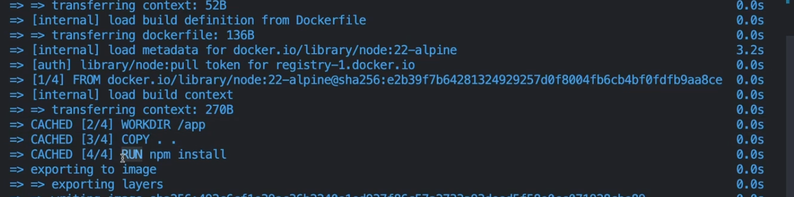

Can you see the `CACHED with some number` basically that only shows the number of **cached things**. basically for the project shown in the above picture, **docker is making 4 layers of caching**

### **Layers practically**
----------

you can also see the distribution of layer in the Dockerfile as shown below ->

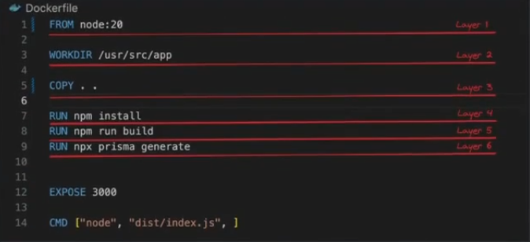

you can also see the corresponding **logs in the terminal**

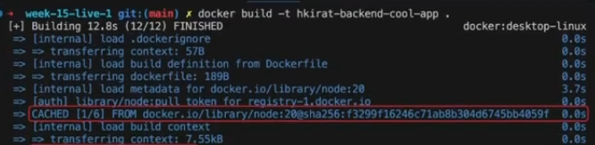

### **Why Layers ??**
----------

If you change your Dockerfile, layers can get re-used based on where the change was made

> :pushpin: __If a layer changes, all subsequent layers also change__
>
> > **If a layer is written CACHED, then all the above layers present above will also be CACHED**
> >
> > Same as ONION Layers


### **Optimising Dockerfile** [<span style="color:orange">**Important w.r.t interview**</span>]
----------

There is one thing which is wrong in the below `Dockerfile`

```javascript
FROM node:22-alpine

WORKDIR /app

COPY . .

RUN npm install

EXPOSE 3000 

CMD ["node", "index.js"]
```

The problem here is that **`npm install` is a very heavy operation and even needs a good internet connection to proceed**

but even if you change a **small thing in your codebase and then BUILD it again, then `node modules` folder is not cached i.e. `npm install` runs again** as `npm install` is a very heavy operation and that too is not being cached by the docker, hence it will **take a lot of time and not efficient**

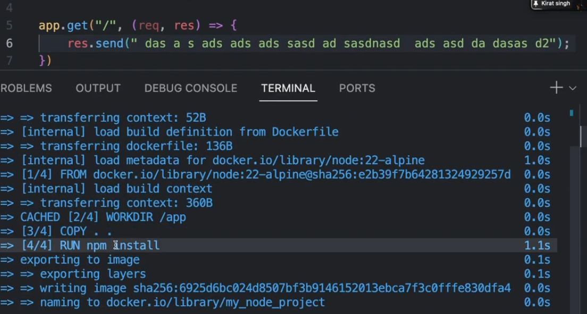

see the above pic, although you have just made a small change (that background code file (`das as a dalffl`) line added) still you can clearly see in the terminal `npm install` is again getting installed (**as `CACHED` is not written in front of this command so it again installing basically**)

Now maybe this small project wont take too long but this becomes issue **when you have many dependency as `npm` will then install all those dependency every time you make some change in any of the file and folder and `BUILD` again**

So :bulb:**How to optimise the `DOCKERFILE` ??**

-> why i am not using **CACHED version of `node_modules` so that even if i change the sourcecode, this folder remain intact**

Lets answer the above question -> 

so the idea of achieving the above thing is by changing something inside the `Dockerfile` so that `node_modules` remains intact even though sourcecode changes.

One thing which must be coming in your mind is move the `RUN npm install` layer above `COPY ..` but then **empty directory me thode npm install hota h**


```javascript
FROM node:22-alpine

WORKDIR /app

RUN npm install

COPY . .


EXPOSE 3000 

CMD ["node", "index.js"]
```

so the **final answer to optimise the above `Dockerfile` is very similar to what you have done above but some more addition**

```javascript
FROM node:22-alpine // 1

WORKDIR /app

COPY ./package.json ./package.json
COPY ./package-lock.json ./package-lock.json
RUN npm install // as npm install empty directory me hoga nhi so first COPY all the dependency and as your project dependency depends on 2 files package.json and package-lock.json hence first you COPY these before running npm install // 2

COPY . .

EXPOSE 3000 

CMD ["node", "index.js"]
```
If you will change the `Dockerfile` according to the above code, then all the **lines of code from `// 1` to `// 2` will not get COPIED as they are above the `COPY..` command which says that copy everything (files and folders) which are present in the current directory**

This will also make sure that **`npm` remains cached unless and until `package` or `package-lock` file changes and if these changes then only it `npm` will again install**

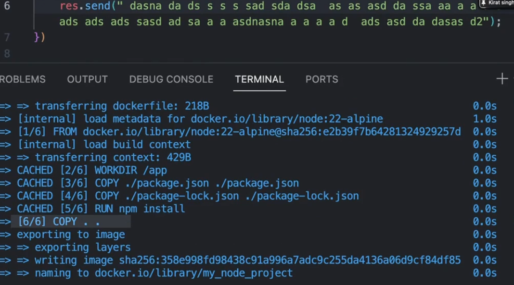

Notice in the above picture, `npm install` has `CACHED` in front of it.

so using the above concept and then documenting it below from the notes 

**Optimising dockerfile**

Changing the `Dockerfile` little bit like the below ->

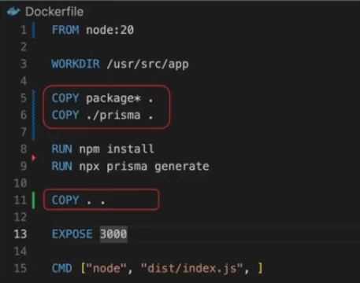

l. We first copy over only the things that `npm install` and `npx prisma generate` need

2. Then we run these scripts
  
3. Then we copy over the rest of the source code
  
## **Networks and Volumes**
----------

Networks and volumes are concepts that become important when you __have multiple containers running__ in which you

1. Need to __persist data__ across docker restarts

2. Need to __allow containers to talk to each other__

simply saying **Whenever you stop a docker container its file system is lost(ex -> if you have stored some data in the `mongoDb` and then stops the container, you data will get lost) so to solve this problem, VOLUMES are used**

AND 

**If you want to allow containers to talk to each other, NETWORKS is used**

:bulb:**Why do you want the two containers to talk to each other ??**

-> We will see it later

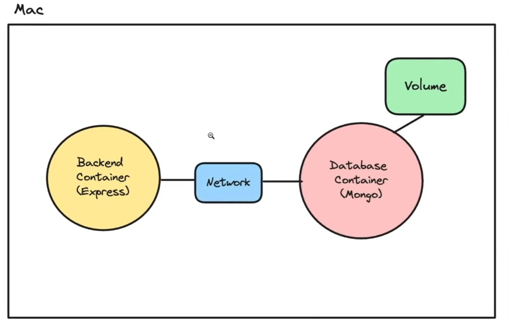

> :pushpin: **we dont need NETWORKs until now because when we started the `mongo` container, it was being accessed by a `Node.js` process running directly on the machine**

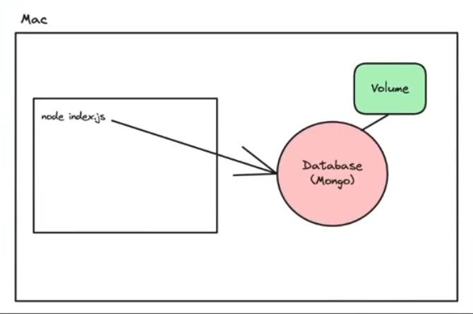

### **Volumes**
----------

If you restart a `mongo` docker container, you will notice that your data goes away. Basically someday, your docker container stopped due to some reason, be it stopping by yourself, or some error. Now you definitely can start the same `mongo` container but the data which you stored earlier **will not get deleted or lost**.

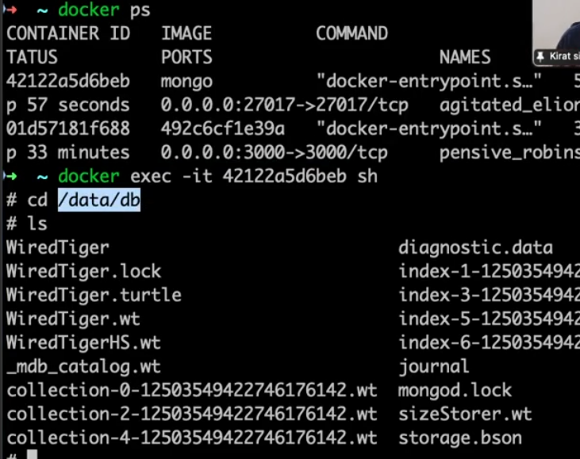

can you see where the data is being stored inside the `mongo` container, it is inside the `/data/db` so we actually want to **secure this folder or make it persist whenever the docker container restarts so that the data inside this folder does not gets lost [basically this whole folder contents get DUPLICATED somewhere so that it does not get lost]**

and the answer to the above question is **yes and that's exactly why VOLUMES are used for**

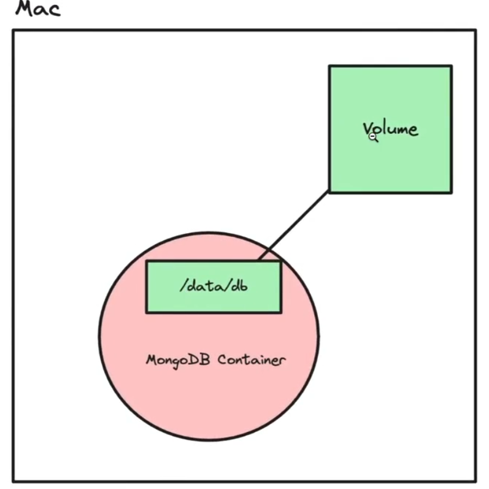

basically you mount the folder `/data/db`  to the **Volume** folder so that data does not gets lost and when the container is again restarted, the this folder agains mounts with the `Volume` and **retrieves the data**

> :pushpin: **Whenever you want to put some data of the container outside the container so that even if the container dies the data lives or not get lost then you USE VOLUMES**


This is because docker containers are `transitory` (__they don't retain data across restarts__)


#### **Creating Volumes and applying it**

1. **Create a volume**
   
```javascript
docker volume create name_of_volume
```

Now if you would have to start the `mongo` locally, then you would have run the below command 

```javascript
docker run -p 27017:27017 mongo 
```

but as now we want that the folder `/data/db` to be mounted with the volume so now we **add volume mount**

```javascript
docker run -p 27017:27017 -v volume_name:/data/db mongo  // so ":" indicates that the volume is connected to /data/db folder and hence this folder is mounted to the volume ("-v" stands for "volume") and the folder contents are now kept at the volume made
```

Now if you will run the command 

```javascript
docker volume ls
```

you will be able to see all the **volumes with the data inside them** even though you stop the `mongo` container.


### **Network**
----------

In Docker, a network is a powerful feature that allows containers to communicate with each other and with the outside world.

Docker containers can't talk to each other by default.

__`localhost` on a docker container means `it's own network` and not the network of the host machine__

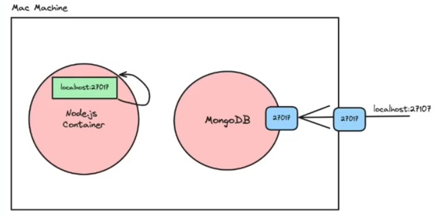

The above picture with its solution is shown in the below picture ->

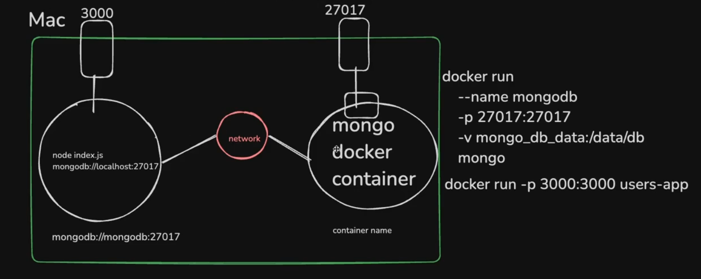

basically you are not able to connect to the other container as it's localhost is now not that of your mac machine, its that of the container and hence it is not able to resolve where that port is and hence `Network` is used to achieve this to interact with the other containers

Now to **make one container interact with the other, you have to give NAME to the container**


:bulb:**How to make containers talk to each other ??**

**Attach them to the same network**

**Step 1 ->** Build the image

```javascript
docker build -t image_tag
```

**Step 2 ->** Create a network

```javascript
docker network create my_custom_network
```

**First made the Network so tha**

**Step 3 ->** Start the `backend process` with the `network` attached to it  

```javascript
docker run -d -p 3000:3000 --name backend --network my_custom_network
```

**Step 4 ->** Start mongo on the same network

```javascript
docker run -d -v volume_database:/data/db --name mongo --network my_custom_network
```

**Basically you have made both the container connected to the same network**

**Step 5 ->** Check the logs to ensure the db connection is successful

```javascript
docker logs<container_id>
```

**Extra points**

1. Try to visit an endpoint and ensure you are able to talk to the database
2. If you want, you can remove the port mapping for mongo since you dont necessarily need it exposed on your machine


**To see the available Network which has been created**

run this command

```java
docker network ls
```

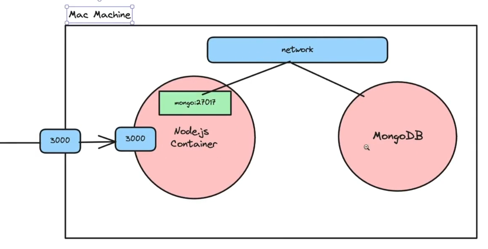

## **docker compose**

----------

Docker Compose is a tool __designed to help you define and run multi-container Docker applications__ With Compose, you use a `YAML` file to configure your application's services, networks, and volumes. __Then with a single command, you can create and start all the services from your configuration.__

Whenever you are working with monorepo and even generally also if you are working with a project, you have atleast 2 folders -> `frontend` and `backend` and even a folder for the `database` so will there be these many commands to run this project if going to run the project :-

```javascript
docker build -t frontend
docker build -t backend
docker run mongo
docker run frontend 
docker run backend
```
*Above commands are just to get the idea of the problem, they are not fully accurate

You can clearly see the number of commands and the amount of mess going by this method is creating also if there is problem in particular container, then you have to restart all the container again (of course you have to also stop it) **Very ugly way**

**So to solve the above problem (i.e -> running multiple containers together) `docker compose` is used**

> :pushpin:**These things are meant for LOCAL developement as in PRODUCTION you are not going to <span style="color:orange">**start the `mongoDB` using docker (not the best idea in the world) as your database is always kept and maintained at other places**</span>** 
>
> so keep in mind that it is mainly for running project at local environment


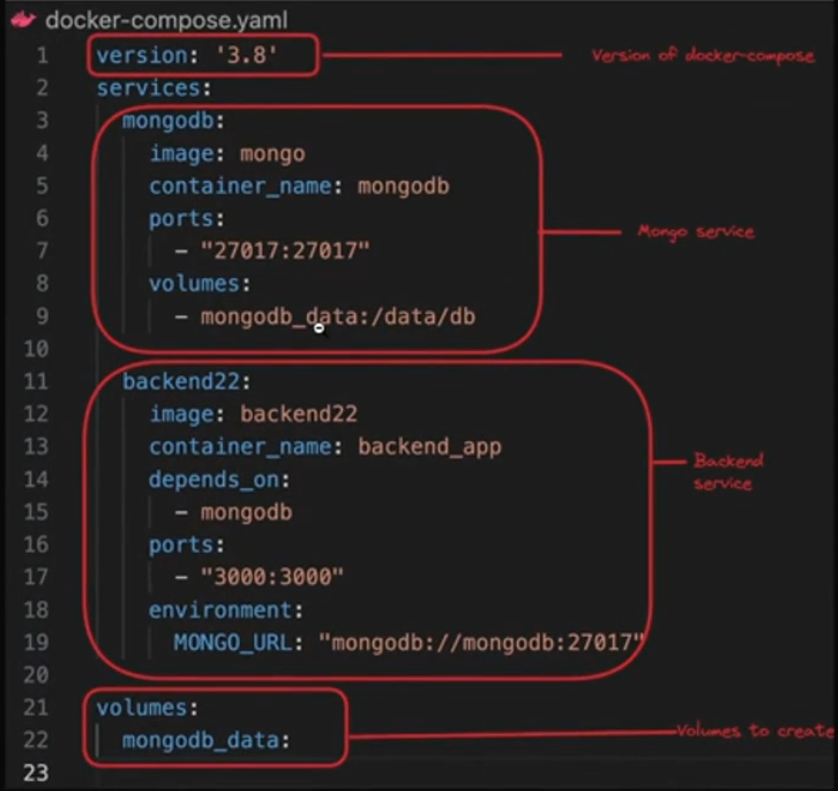

Now explaining the above `docker-compose.yml` file the **whole mongo service represents the below command mainly**

```javascript
docker run mongo --name mongodb -p 27017:27017 -v mongodb_data:/data/db
```

similarly, same for `backend22` image which is already build and present on the dockerhub.

**whole volumes to create is same as running the below command**

```java
docker volume create mongodb_data
```


:bulb:**Benefit of using docker-compose file ->**

-> **You could have run the above command manually or you could have created a DOCKERFILE and then you have to run a single command(`docker-compose up`) which will run the above command also as well as some other commands written below in the docker-compose file** [basically will run all the commands to run this project]

> :pushpin:**Rather than running ten different `docker run` commands you have all the required `run` command in one file and then run this file to run entire project**


> :round_pushpin: **If you are facing difficulty in reading the above `.yml` file convert it to `.json` file(you can google)**

> :pushpin: **The biggest benefit of using `docker-compose` file is it automatically creates NETWORKs for your project and hence you do not need to define the Networks by yourself as you have done above. basically all of the containers are already connected via the Network**. How do they connect to each other you have seen this also in the above lecture 
>
> although it can be seen in the `docker-compose` file also name of `mongodb` service container name (`mongodb`) has been used in the `backend22` service container name `MONGO_URL` value (instead of `localhost` it is written `mongodb` in the URL **as you are trying to connect to `mongodb` not the `localhost`**)

below is the example of a conversion

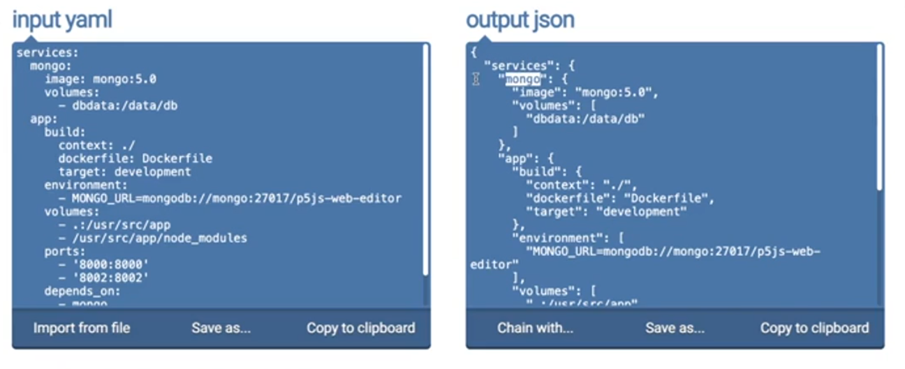

Lets try to understand a `.yml` file of `docker-compose` and **deduce what is written inside it**

Lets try to understand the above file as it is a real **open-source project called as p5 web js editor's `docker-compose` file**

```java
services: // tells about the number of services present in this project
  mongo: // this service is for the database part present in the project
    image: mongo:5.0  // basically means this is using mongo image version 5.0 from the dockerhub, this is same as running docker run mongo:5.0
    volumes: // same concept what you studied earlier, you always need volume when are using database container
      - dbdata:/data/db  // whatever data present in the /data/db mount it on the "dbdata" named volume
  app: // this service is for project part and as this is written by the developer and he wants to run it via his machine not something on the dockerhub so you have to "build" this project
    build: // for the acutal source code, build the image using the below commands
      context: ./  // means build it in this folder
      dockerfile: Dockerfile // dockerfile is called as Dockerfile which is present in root file (if somewhere else then specify the path of it)
      target: development 
    environment: // given the environment variables 
      - MONGO_URL=mongodb://mongo:27017/p5js-web-editor // you know why "mongo" is there instead of "localhost" in the link (if not then see above notes, its related to NETWORKs topic)
    volumes: // explicitly defined the volumes (this is for HOT RELOADING present in Next.js, will study later) 
      - .:/usr/src/app  // known as BIND MOUNTS
      - /usr/src/app/node_modules
    ports:  // the ports these projects are using
      - '8000:8000' // probably for the frontend
      - '8002:8002' // probably for the backend
    depends_on:  // simply means that the entire "app" service is dependent on the 
      - mongo // "mongo" service so dont build this service until "mongo" service has build, if mongo service has not started, you should not start app sevices

volumes: // defines all the volumes that is needed for this project
  dbdata: // as in this project only 1 volume is being used which is "dbdata" defined above so added this
```

### **Creating `docker compose` file for a simple project**
----------

so making an empty `node` project by running the below command simultaneously ->

```javascript
mkdir week-27-docker-compose
npm init -y 

npm install typescript // as we are going to use typescript
npx tsc --init
```

Now inside the `tsconfig.json` file and making changes required 

```javascript
"rootDir": "./src"
"outDir": "./dist"
```

now creaing a seperate folder `src` and then inside it `index.ts` file

**Now lets say this is a simple `express` project that connects to `postgres` via `prisma`**

so running the below command 

```javascript
npm install prisma express @types/express
```

Now inside the `index.ts` file writing the code

```javascript
import express from "express"

const app = express()

app.get("/", (req, res) => {
  res.json({
    "message": "Get endpoint"
  })
})

app.post("/", (req, res) => {
  res.json({
    "message": "Post endpoint"
  })
})

app.listen(3000)
```

Now to use `prisma` running the below command 

```javascript
npx prisma init // will generate "schema.prisma" file inside the prisma folder generated using this command
```

Now defining the `schema.prisma` file 

```javascript
generator client {
  provider = "prisma-client-js"
}

datasource db {
  provider = "postgresql"
  url = env("DATABASE_URL")
}

// From here the real logic starts
model User {
  id       String       @id    @default(uuid())
  username String 
  password String
}
```
lets say for now our project has only one table `User` table which will store the `id`, `username` and `password` of the user and will show it when you will hit `get` request on the endpoint (`/`) defined above and will get the above data of the user when you hit `post` request on the endpoint (`/`)

Now to finally use the `prisma` you have to run the below command

```javascript
npx prisma migrate dev  // to migrate the data to the database
```

but to migrate data to the database, you have to first connect to the database (`postgres` for this project) and to do that inside the `docker` we will run 

```javascript
docker run -e POSTGRES_PASSWORD=mysecretpassword -d -p 5432:5432 postgres
```

you will get the password from the `neon.tech`

**`-e` ->** means **environment variables**

**`-d` ->** simply means **run in the detached mode (i.e -> background)**

*eventually we will write the code to automate this (no need of mannual writing)

and if still this feels complicated just go to the `.env` file present in your project and then inside that paste the **`postgres` url you got from `neon.tech` in the `DATABASE_URL` environment variable**

Now if you run `npx prisma migrate` and then gives the name as per your choice to the migration then you will see a folder named as `some_no.&name_you_gave` inside which `migration.sql` file is present which has code written in `schema.prisma` file changed to the compatible `.sql` langauge.

Now you will run `npx prisma generate` to **generate the client** and then adding the logic to perform **CRUD operation** inside the `index.ts` file

```javascript
import express from "express"
import {PrismaClient} from "@prisma/client"

const app = express()
const prismaClient = new prismaClient()

app.get("/",async (req, res) => {
    const data =  await prismaClient.user.findMany()

    res.json({
      data
    })
})

app.post("/",async (req, res) => {
    await prismaClient.user.create{
      data : {
        username : Math.random.toString(), // for now used the database with some random username and password
        password : Math.random.toString()
      }
    }
  res.json({
    "message": "Post endpoint"
  })
})

app.listen(3000)
```
atlast, doing the change in the `package.json` file to **run as well as start the project by adding some scripts** 

```javascript
"scripts":{
  "build": "tsc -b",
  "start": "node dist/index.js"
}
```

Now either you will give the below instruction to use your above project if someone wants to run your project locally 

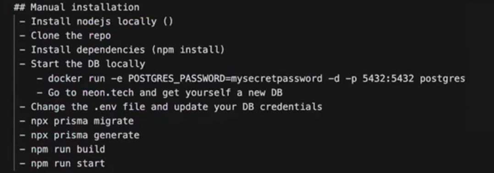

Can you see how lengthy mannual installation is

so we will use `Docker installation`

now here we have 2 options -> 

1. **either use `docker` commands only**
2. **or use `docker-compose` file**


**using `docker` installation steps, the steps will shrink down to just the below ones**[9 steps reduced to 4 steps now]

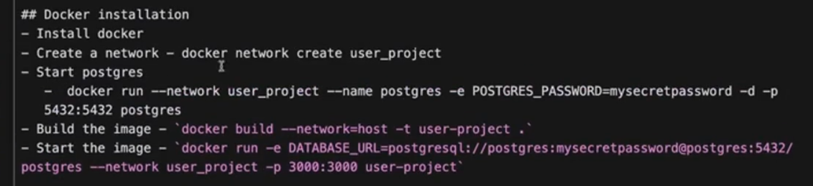

Install docker command means basically run the command -> `docker build --network=host -t user_project` **this is for building your project**

After this all the command is for **running the project** 

> :pushpin: **we have to add a network as we are starting the `postgres` and image seperately**
>
> See the Networks class **if you are starting a backend container seperately and the database container seperately(which we are doing here) they need to be connected via `Network` seperately hence we have to create a network and make both of them connect to the Network**


**Explanation of some of the commands**

-> `docker build --network=host -t user_project` **why you changed the usual `build` command ??**

**without using `--network=host` (left image) and with using `--network=host` (right image) explanation**

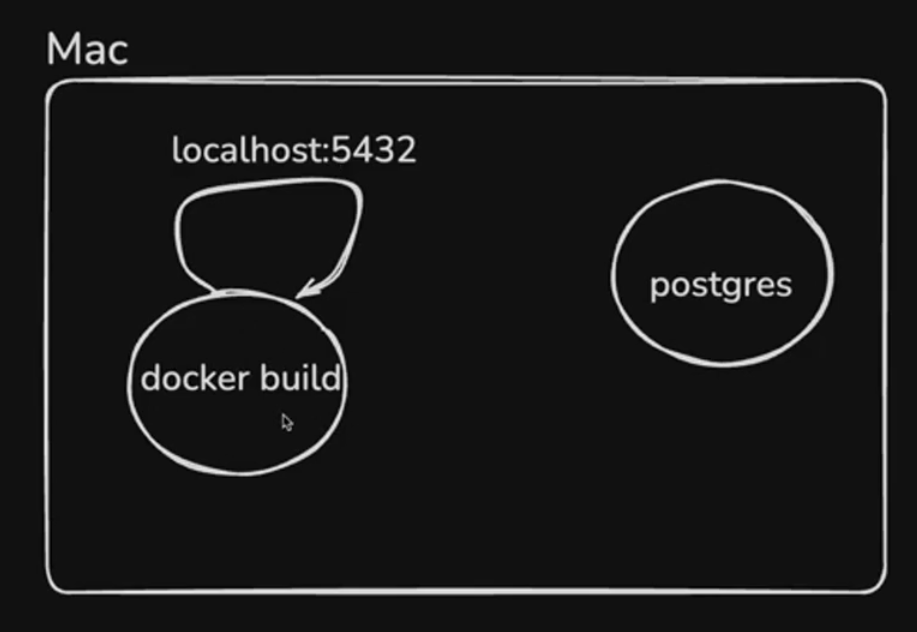 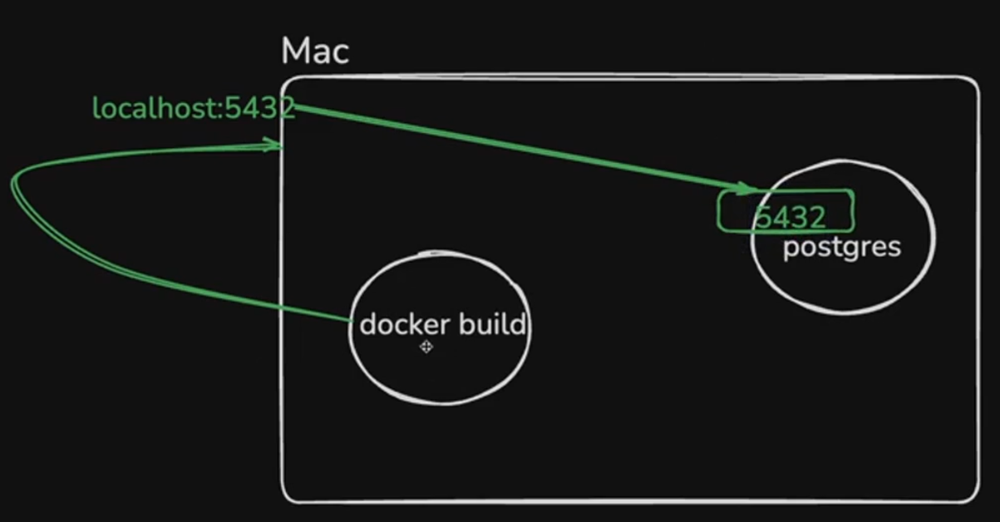

in the left image, already the `postgres` container was runnning now when you were building the project `docker build`, this container was also running at the same time **where it was trying to access `localhost:5432`, now as there is nothing running on this on the new container which is made by the `docker build` as the NETWORK IT HAS ACCESS TO IS NOT THE `host` NETWORK BUT THE `bridge` NETWORK**

<span style="color:orange">**Basically `docker build` is also running inside a seperate container and there `localhost` means NOTHING (it means `docker build` container not the mac machine)**</span>

BUT when you add  `--network=host` flag in the command (**see the right pic**)

then what happens is that -> <span style="color:orange">**basically now when you are building, you are using the NETWORK of the host machine so now `localhost` means `MAC` machine and `5432` means it now points to `postgres` container**</span>

> :pushpin: **To access something on the `host` machine you have to use `--network=host`**


Making the `Dockerfile` for the above case 

```javascript
FROM node:20-alpine

WORKDIR /app

COPY ./package.json ./package.json
COPY ./package-lock.json ./package-lock.json
// the above two command can also be combined into one single command -> 

// COPY ["package.json", "package-lock.json", "./"] "./" is basically telling the file path (which is root folder in this case) for the two file present in the square bracker (package.json and package-lock.json) or you can also write like the below 

// COPY package*.json ./  which means package-anything will be included 

RUN npm install

COPY.. // as user is already copying the prisma.schema file so you dont have to do RUN npx prisma init  

ENV DATABASE_URL=the_value_you_have_given_in_the_environment_file // as you are running it locally so its okay for you to give the real environment variable value but if you will upload to github then you should be urging the user to put here their environment variable so that SECRECY reamins

RUN DATABASE_URL=$DATABASE_URL npx prisma migrate dev // REMEMBER -> as we are using PRISMA which requires connecting to the database during the build step that is what causing it hard to write or you are seeing for the first time in this docker notes [during this build step we are setting the network to host as you can see in the above command]
RUN npx prisma generate
RUN npm run build

EXPOSE 3000 // although in newer verion of docker without this it will also work but this is actually for documentation purpose

CMD ["npm ", "start"]
```

<span style="color:orange">**VERY VERY IMPORTANT POINT to note here is that ->**</span>

:pushpin:**You have made the above task or project run but its complexity increased REASON -> WHEN A CONTAINER IS BUILT IF YOU WANT ANY ALREADY RUNNING CONTAINER TO TALK TO IT is VERY COMPLEX TASK so to avoid this complexity -> REMOVE THE `// 1` and `// 2` line of code** [so that connecting to database logic gets wiped out of the `Dockerfile`] and **whenever the container will start at that time only it will migrate the database**

so inside the `package.json`, `scripts` section instead of 

```javascript
"scripts": {
  "build": "tsc -b",
  "start": "node dist/index.js" // instead of this line "start", we will use the // 2 line
  "dev:docker": "npx prisma migrate dev && node dist/index.js"  // 2 this will make the database migrate at that time only when the container really starts
}
```

**Its benefit can be seen in the `Dockerfile` but the  main advantage is when you are writing the `docker-compose` file (see below in that section)**

```javascript
FROM node:20-alpine

WORKDIR /app

COPY ./package.json ./package.json
COPY ./package-lock.json ./package-lock.json

RUN npm install

COPY.. 

// ENV DATABASE_URL=the_value_you_have_given_in_the_environment_file // 1

// RUN DATABASE_URL=$DATABASE_URL npx prisma migrate dev // 2

RUN npx prisma generate
RUN npm run build

EXPOSE 3000

CMD ["npm ", "run", "dev:docker"] // as "scripts" now has "dev:docker" so used this command
```


**If you were using `mongoDB` you wouldn't have too much complexities**

**To explore your `postgres` database** run the below command  

```javascript
docker exec -it postgres_container_id sh // will give you shell access of the database

psql -U postgres  // will give you command access to your postgres databse and now you can run commands to interact with the database

// For example ->

\dt; // to see all the table you have inside the database
SELECT * FROM "User";  // to see all the data inside the User table 

exit // to go out of the database
```

and finally we will use `docker-compose` for this project**because we have two services we want to start(backend and postgres which might increase in the future)** and reduce the above [4 steps to even 1 single step or command]

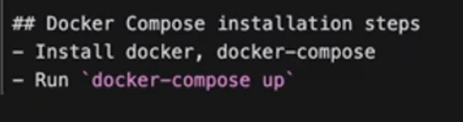

You can clearly see the difference in reduction of steps -> [9 steps -> 4 steps -> 1 steps]

Creating now the `docker-compose` file 

```javascript
version: '3.8' // version of docker compose (you can google for the latest version)
services: // as there are two services we have to run -> postgres and user_app
  postgres: 
    image:postgres
    ports:
      - 5432:5432
    environment:
      - POSTGRES_PASSWORD=password_of_the_postgres

  user_app: // as we are building locally this file so you will not use image istead build it locally 
    build:
      network: host
      context: ./ // where you want to build it
      dockerfile: Dockerfile

    environment:
      - DATABASE_URL=same_value_as_that_in_dockerfile

    ports:
      - 3000:3000

    depends_on:
      - postgres
```
**`-` simply means it is LIST/ARRAY in the `.yml` file**, so as **`ports`, `environment` variables, `depends_on` present in multiple numbers so you keep it inside array while writing them inside the `docker-compose` file**

**The best part of this is now we dont need to explicitly make a network which we have to in the above case and the level of complexity it holds was also high so here NO need to go to that complexity of making the network and then linking both the service to this network, `docker-compose` file will automatically handle it**

Now the magic of `docker-compose` file will be seen ->

**You just have to run the below command to run the entire project NOTHING OTHER THAN THIS in the root folder**

```javascript
docker-compose up
```

**Now here we will see the BENEFIT of making change in the "scripts" in `package.json` which i have told you to dicuss later below**

Now running the `docker-compose up` command will **give error** and reason for this is ->

> :pushpin: <span style="color:orange">**Remember ->**</span> **`docker-compose` firsts BUILDs and then STARTs the services**

**VERY VERY IMPORTANT POINT**

So in the `docker-compose` file above, though you do have written `depends_on -> postgres` service but still as the `docker-compose` builds first so it will still build the `user_app` first and then **run the `postgres` service and then it will finally run itself** (as `depends_on` will ensure that it does not start before `postgres` start but there is no restriction on `build`, it can `build` before `postgres` starts) but here comes the problem **BUILD OF `user_app` SERVICE HAPPENED BEFORE THE DATABASE(`postgres` container) STARTED RUNNING** (thats the reason for getting an error)

Now **what we want that -> First `postgres` service STARTS, then `user_app` BUILDS and finally `user_app` STARTS**

and to achieve this we made the changes in the `scripts` section only in the `package.json` .which said that as soon as the **container starts running, it should migrate to database at the same time thus ahieving our target to  RUN `postgres` service at start only**

so the above changes ensured that **as inside the `docker-compose` file we have written that the `user_app` `depends_on` `postgres` so when the `user_app` will start we can 100% say that `postgres` is surely running and hence you can migrate to the database**


