# __HTTPS Server__

- [__HTTPS Server__](#https-server)
  - [**Request Response Model**](#request-response-model)
  - [__Domain Name / IP__](#domain-name--ip)
    - [__IPs__](#ips)
    - [__DNS Resolution__](#dns-resolution)
  - [__Ports__](#ports)
    - [**Default Ports for different protocols**](#default-ports-for-different-protocols)
  - [__Methods__](#methods)
    - [**4 basic things you do on most website**](#4-basic-things-you-do-on-most-website)
    - [**4 commonly used methods to define a `request`**](#4-commonly-used-methods-to-define-a-request)
  - [**Response**](#response)
      - [__JSON__](#json)
  - [**Status Codes**](#status-codes)
    - [**Some commonly used Status code**](#some-commonly-used-status-code)
      - [__200 series (Success)__](#200-series-success)
      - [__300 series (Redirection)__](#300-series-redirection)
      - [__400 series (Client Error) / You gave some bad data to the server__](#400-series-client-error--you-gave-some-bad-data-to-the-server)
      - [__500 series (Server Error) / Error is from server side__](#500-series-server-error--error-is-from-server-side)
  - [**Body**](#body)
  - [**Routes**](#routes)
    - [**Difference between `Methods` and `Routes`**](#difference-between-methods-and-routes)
    - [__`HTTP` vs `HTTPS`__](#http-vs-https)
  - [__Creating your own `HTTP` server__](#creating-your-own-http-server)


:bulb: **What happens when you type facebook.com ??**

**->** You are actually sending the request via the wires or router to some machine that machine is respoding it with html, css and js scripts and you browser is loading these things and showing you what you actually want to see

> To see it go to `developer tools` in any of the browser
>
> and inside go to `networrk` tab

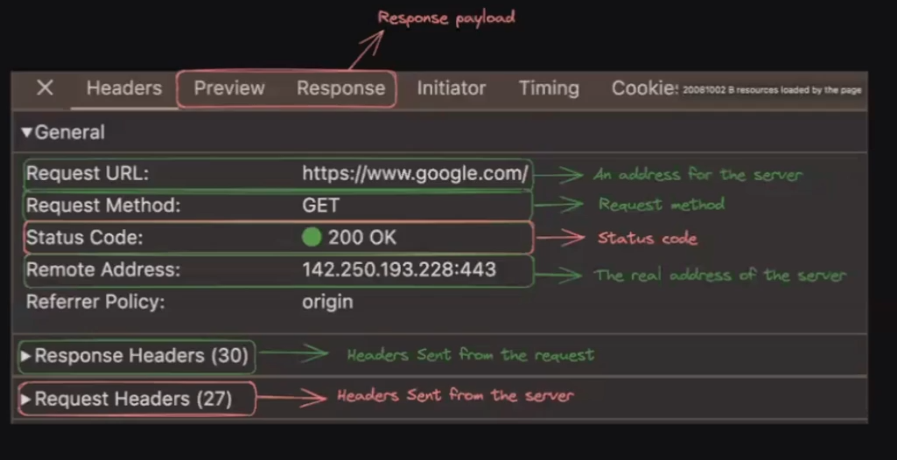

in above picture :-

> :large_orange_diamond: the <span style="color:red">**Red**</span> block is **What the server sends you** and <span style="color:green">**Green**</span> block is **what you send to server**

**Request URL ->** this is where the `request` is being sent

**Remote Address ->** Every website indicates to an IP Address this is the IP Address of Server from where `response` is coming

go to the `Response` tab you can see the `Response` code used to load it (you can encrypt it also) from the server

>:sparkle: `HTTP` server was made to make communication between the server

## **Request Response Model**
----------


It is a fundamental communication pattern

**It describes how data is exchanged betwenn `client` and `server` or between any two systems**


**CLient ->** The machine that is asking for the content is called the client

AND

**Server ->** The machine that is responding with server is called the Server

> There are many others ways/ Protocols in which servers can communicate (Ex -> Websockets, WebRTC, etc..)

Tap on the link [Harkirat Notes](https://petal-estimate-4e9.notion.site/Intro-to-HTTP-26c5803f153b4401aa76e9fac08ac427) 

## __Domain Name / IP__
----------


The way to reach to a server is through `domain name`. For Example ->
- google.com
- x.com


### __IPs__
----------

Every domain that you see, actually has an underlying IP that it `resolves` to.

You can check the ip by running the `ping` command.

```console
ping google.com
```
:large_blue_diamond:  The command is very useful to check whether the problem is from your side or from the company side (is `ping` gives you the IP then no problem from your side) problem is from server side if that website is not loading


> :warning: Use **Gitbash** as terminal when working with **Windows** as this command is supported only for mac and linux


When you try to visit a website, you are actually visiting the `underlying IP address`.

__Real world analogy -__

:large_blue_diamond:**as it is more convenient to write the domain name than IP hence this is the only difference between them**

Domain name - Phone contact

IP - There real phone number

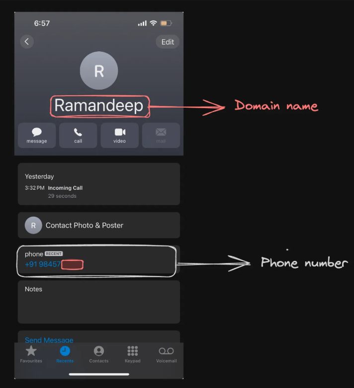

**Trick to play**

### __DNS Resolution__
----------


if you ever want to change the IP address of a particular website **locally** you can do that actually when you run a website it internally stores in **cache** and from there you can change that. that's the working of this trick 


```console
sudo vi /etc/hosts
```

> :warning: again this work on `linux` use `gitbash` in windows to run this

After running, you will see a bunch of domain name with IP add any other to the website you want to open that at that IP Address


Now if you will run `app.100xdevs.com` on your local machine it will **Not** load. as you are not pointing to the correct IP where actually this website is pointed to (**GOT TRICKED**)

**Now this command can be very useful and that's one way the hacker steals your data**

**BUT HOW ??**

just do this thing **Rent your server on AWS or anything** and now you can add your **server IP address** point to the `facebook.com` so whenever they will go to `facebook.com` they will be getting `response` from our server and this way you can get their **mail ID or password** they will enter

:bulb: **How Website are deployed on the internet ??**


you rent a server on aws which in turn gives you the IP address to your site and you also buy a domain name and **finally you point your domain name to IP address of the server and that's how if someone will go to the `imkirat.com` as it is pointing to `22.2.44.55` it will be redirected to this server and its content**

## __Ports__
----------


In networking, ports are `logical` endpoints used by protocols to identify `specific processes`  running on a computer or server. They help direct network traffic to the correct application or service on a system. 

**Purpose ->** **To run multiple processes on a Single Server** so that you dont have to buy multiple server to do another process as it requires both **compute as well as money**

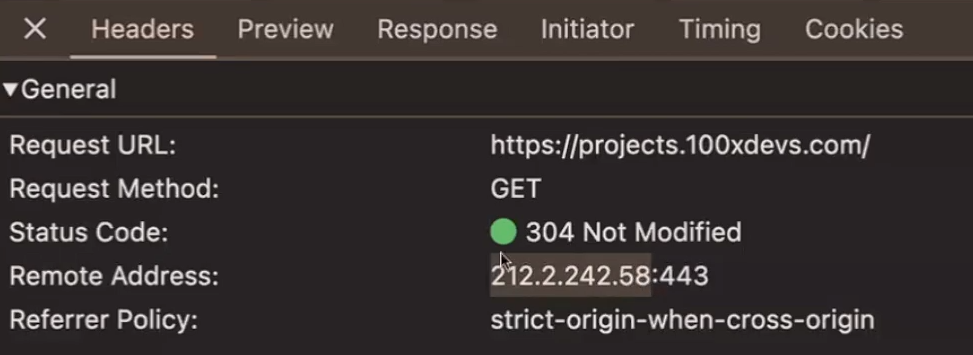

here in the above picture, `443` **after colon  part** is what we call as `ports`

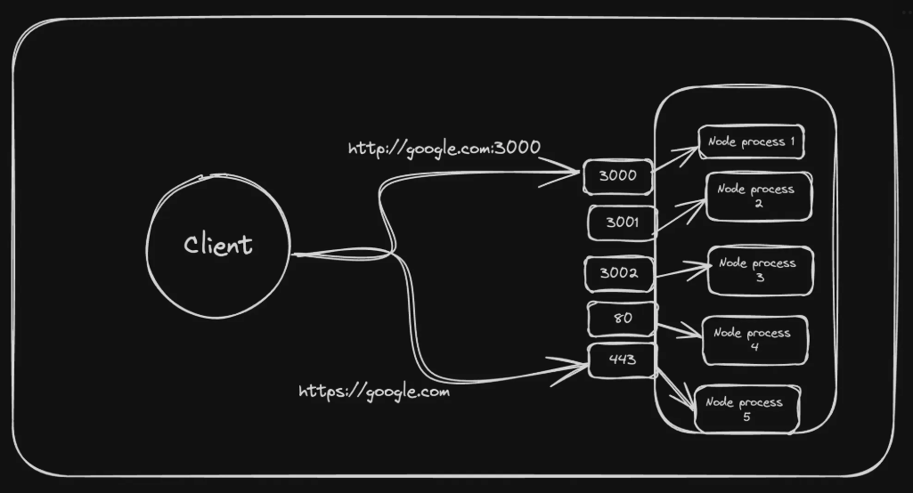

**Summary of port**

:large_blue_diamond: "single machine but multiple processes"

> :large_orange_diamond: most website which you see today runs on `443` port ( any one other than this can be **vulnerable**)
>
> deploy your site on `443` port

### **Default Ports for different protocols**
----------


- **HTTP ->** `80` // if any site is starting with `http` it redirects to `80` port (same with others)
- **HTTPS ->** `443`
- **SSH ->** `22`

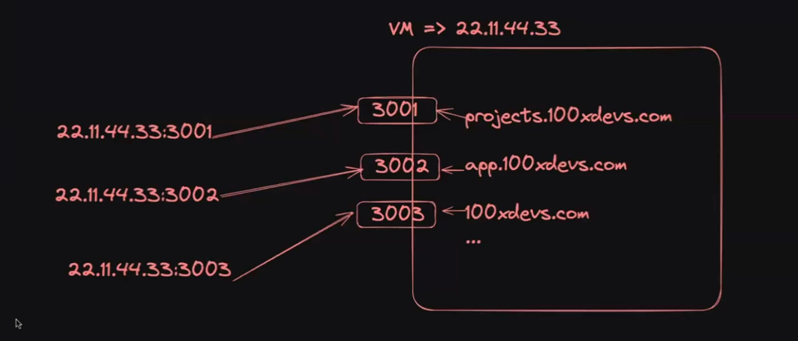

## __Methods__
----------


you use it to **structure** data

HTTP methods are used to specify the <span style="color:orange">**type of action**</span> that the client wants to perform on a resource on the server.

### **4 basic things you do on most website**

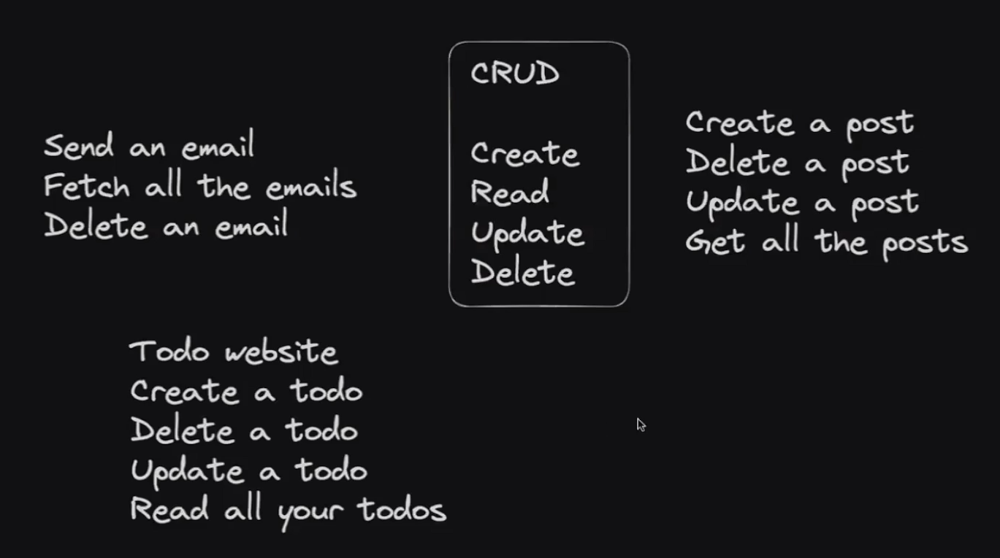 

### **4 commonly used methods to define a `request`**

The below are the four most commonly used methods to **perfrom a task** while sending a request to a server with their functions


1. __GET__ -  Retrieve data from a server. (Get my TODOS)
2. __POST__ - Submit data to be processed by a server. (Create a TODO)
3. __PUT__ - Update or create a resource on the server (Update my todo) **If not present then create one**
4. __DELETE__ - Remove a resource from the server. (Delete my todo)
5. **PATCH** - Update a resource on the server **If not present then not able to update**

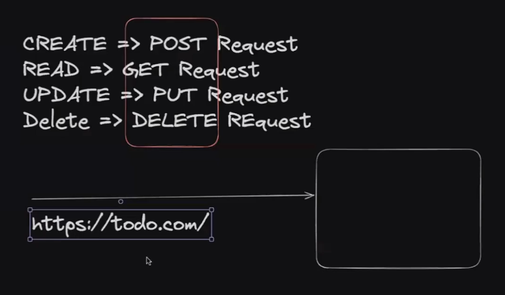

:bulb: **why the very first request is `GET` request when you open any site ??**

-> as you are trying to **GET** the `html`, `css` and `js` file so the above is the reason for the above question

> :large_orange_diamond: you will also see some of the request as `POST` when you load the website for first time
>
> >**POST** request means __kuch na kuch data server ko__ **bhej** or **POST** kr diya gya 

and here comes the role of `POSTMAN`

**About `POSTMAN`**

It is an application that helps you to **send requests** for testing purpose. You can directly send it from here.

## **Response**
----------


The response represents what the server returns you `in response` to the request.

It could be

1. __Plaintext data__ - Not used as often
2. __HTML__ - If it is a website
3. __JSON Data__ - If you want to fetch some data (user details, list of todos…)

#### __JSON__

**JSON** stands for **JavaScript Object Notation**. It is a lightweight, text-based format used for data interchange

```json
{
  "name": "John Doe",
  "age": 30,
  "isEmployed": true,
  "address": {
    "street": "123 Main St",
    "city": "Anytown"
  },
  "phoneNumbers": ["123-456-7890", "987-654-3210"]
}
```
:bulb:**Why most of the server send in `JSON` type ??**

-> It also give in `HTML` but mainly `JSON` due to the fact that they can be **easily accessed (OOPS like) and easily readable**

> :large_blue_diamond: `Response` and `preview` tab in `developer tools` can be used to see the `response` you get from the server
>
> > or you can use **POSTMAN** also for doing this function

## **Status Codes**
----------


HTTP status codes are __three-digit numbers__ returned by a server to indicate the outcome of a client’s request. They provide information about the <span style="color:orange">**status of the request and the server's response.**</span> 

**Purpose ->** The main purpose of this is to give the **Status** of the server so that <span style="color:orange">**Load the data only when you see the status code good or acceptable (dont load when something bad occurs) and hint the problem to the user also**</span>

### **Some commonly used Status code**
----------


#### __200 series (Success)__

- **200 OK**: The request was <span style="color:orange">**successful**</span>, and the server returned the requested resource.
- **204 No Content**: The request was successful, but there is no content to send in the response ( for example -> __you send the `Delete` request server deleted it successfully but no content is there to send__ this is the difference from above one)

#### __300 series (Redirection)__

- **301 Moved Permanently**: The requested resource has been moved to a new URL permanently. The client should use the new URL provided in the response.
- **304 Not Modified**: The resource has not been modified since the last request. The client can use the cached version.

#### __400 series (Client Error) / You gave some bad data to the server__

- **400 Bad Request**: The server could not understand the request due to invalid syntax.
- **401 Unauthorized**: The request requires user authentication. The client must provide credentials.
- **403 Forbidden**: The server understood the request but refuses to authorize it.
- **404 Not Found**: The requested resource could not be found on the server.
- **443 Default Port for HTTPS changed**: when the firewall is blocking port `443` also comes when you have not **explicitely** gave your port (which in your case is not `443`(default port for `https` site)) and as you port is not `443` it gives this error.

#### __500 series (Server Error) / Error is from server side__

- **500 Internal Server Error**: The server encountered an unexpected condition that prevented it from fulfilling the request.
- **502 Bad Gateway**: The server received an invalid response from an upstream server while acting as a gateway or proxy.

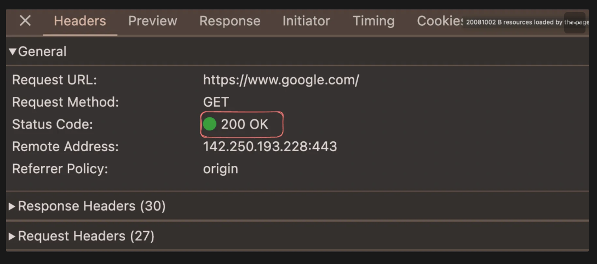

:bulb: **can you send data without them ??**

-> yes of course, see case of **Paytm status code** but ideally you should use them to **easily debug** the problem

## **Body**
----------


In HTTP communications, the __body__ (or __payload__) refers to the part of an HTTP message that <span style="color:orange">**contains the actual data being sent to the server.**</span>

> :large_blue_diamond: It is usually `JSON` data that is transferred to the server.

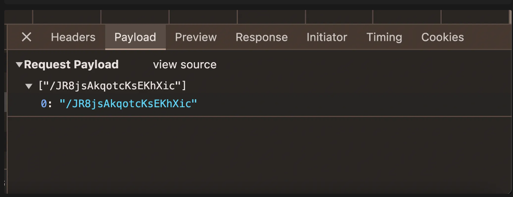

> :warning: **You only see the `payload` tab only when you are sending(POST) or updating(PUT) the data**

## **Routes**
----------


**What you actually want to do on this wensite ??**

n the context of HTTP, __routes are paths or endpoints that define how incoming requests are handled by a server. Routing is a mechanism used to direct incoming HTTP requests to the appropriate handler functions or resources based on the URL path.__

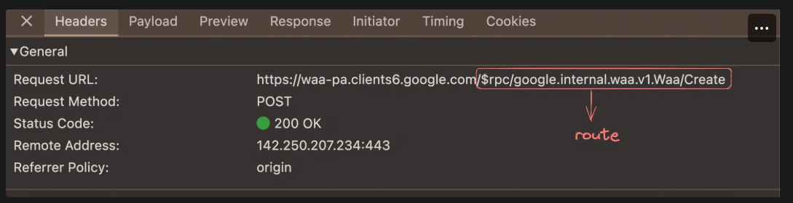

### **Difference between `Methods` and `Routes`**
----------


- **Routes ->** <span style="color:orange">**what you actually are trying to do ??**</span>
- **Methods ->** <span style="color:brown">**The thing you are trying to do is it creating something ?, updating something ?, or deleting something ?**</span>

### __`HTTP` vs `HTTPS`__
----------


`s` in `https` means for **secure**

we all know that you go to server put some data and then you get a response that is where the difference lies


in `http` the data you send to the server it gets in `JSON` format (see above) but it goes as <span style="color:orange">**Plain Text**</span> (the way it is written here so everyone can know your data and use it) but in `https` this is being <span style="color:orange">**encrypted**</span> so it becomes hard to decode the data

Example -> your college websites

## __Creating your own `HTTP` server__
----------


install external dependencies `Express` by running 

```console
npm install express
```
> :large_blue_diamond: `Express` lets you create `http` server

```javascript
const express = require('express')
const app = express()

// route handlers
app.get('/', function(req, res){
    res.send('Hello World') // means jb v GET request aaye on '/' then run the above function agar POST request aaya ya koi aur to ye error throw krega
})

app.listen(3000) // which port you want to listen makes sure that it is INFINITELY times run the http server
```

running it by using `node file_name`

we can see something like this in **Postman** or browser

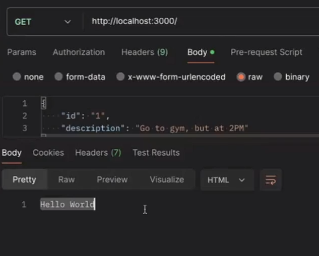

**Dig Dive to the written code**

```javascript
app.get('/', function(req, res){
    res.send('Hello World') // 1
})
```

**Explanation of `// 1 code`**

similar to `fs` module works `express` now the in the above code whenever you get GET Request on route `/` just run the function

NOW

by default only `express` deals with two objects `req` and `res` 

- `req` -> all things related to **Request**
comes in this 
    - Example -> want to extract the body then this comes in action ( body will come in `req` object here)
- `res` -> **used for responding back**
    - Example -> you want to send `HTML` code to the client then 
    - `res.send("<b>Hi there</b>)` added an `html` for **Bold** 

```javascript
app.get('/', function(req, res){
    res.send('Hello World')
    res.send('Hello World') // sending two times will give you an error you cannot send twice
}) 
```

you can send data in `json` also as you have done with `html`

```javascript
app.get('/data', function(req, res){
    res.json({
        data : "Hello"
    })    
})
```


