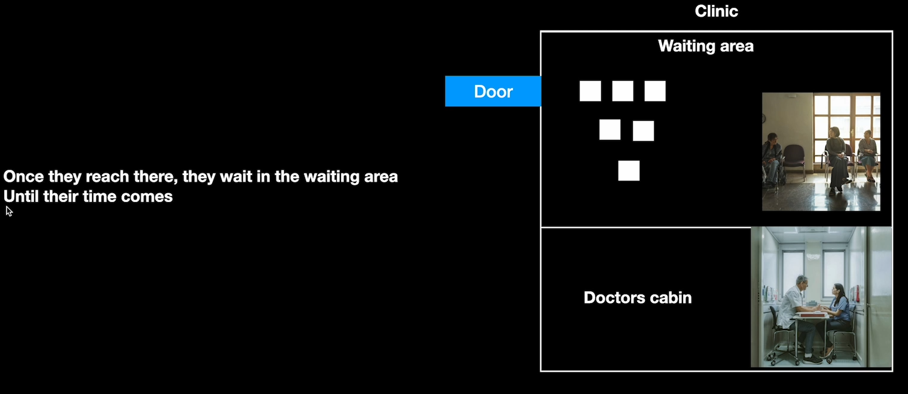
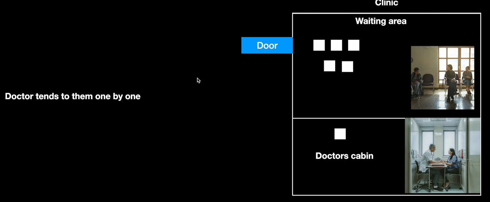
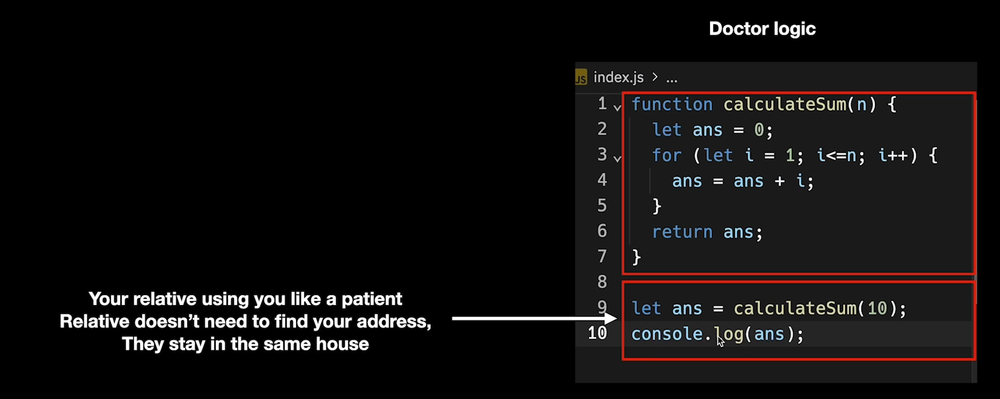
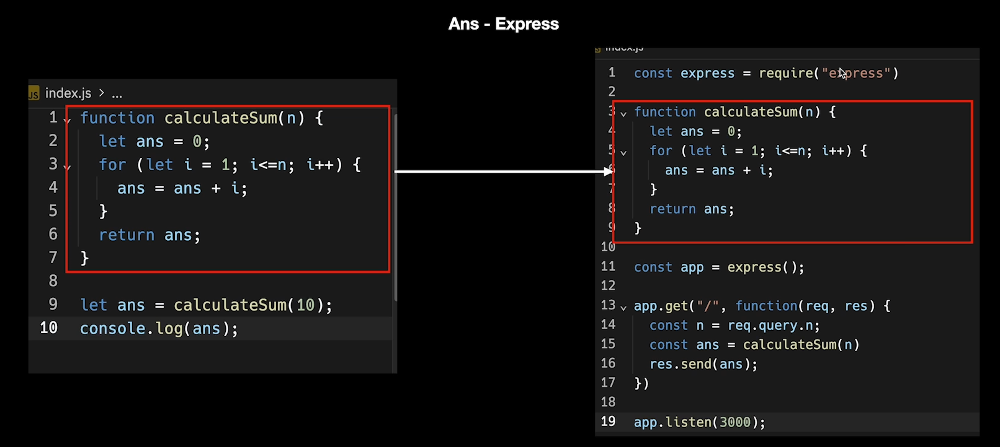
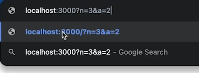
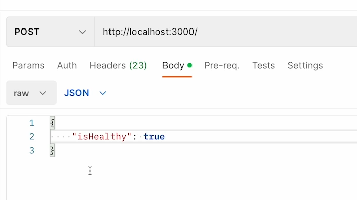

# __Express and HTTP with real world Examples and POSTMAN__

- [__Express and HTTP with real world Examples and POSTMAN__](#express-and-http-with-real-world-examples-and-postman)
  - [**How do i create `HTTP` server ??**](#how-do-i-create-http-server)
    - [**How to give input from the user side to `http` server ??**](#how-to-give-input-from-the-user-side-to-http-server)
    - [**How to recieve the input from user ??**](#how-to-recieve-the-input-from-user)
    - [__Assignment 1__](#assignment-1)
    - [**How to send Input while working with `POST` method**](#how-to-send-input-while-working-with-post-method)
    - [**How to send `POST` request ??**](#how-to-send-post-request)


The real world example we are dealing here is 







The above is similar to `async` task we discussed


> :large_blue_diamond: **Doctors are similar to js thread**
>
> > your logic should be like **Doctor**



**But what if you want to expose this logic(Doctor logic) to the world ??**

here comes the role of `HTTP` (**Hyper Text TRANSFER protocol**) lets you create a **hospital** where people can come and find you (__make access the functionality by anyone__)

:bulb: **How do i expose my functionality to other people ?? How can they find me ??**

-> By creating an `HTTP` server

##  **How do i create `HTTP` server ??**
----------


-> `Express` is one of the framework in `node.js` capable of doing this

similarly

- `spring boot` in `java`
- `Express` in `Node.js`




`app.listen(3000)` is just like the **Deciding the address of the clinic / room when talking about hospital**

> :warning: <span style="color:orange">**whatever the port the `http` server is listening on that must be UNIQUE**</span> Process conflict

now see the code below

```javascript
const express = require('express')

const app = express();


function sum(n){
    let ans = 0;
    for (let i = 1; i < n; i++) {
        ans = ans + i;
    }
    return ans;
}
app.get('/', function(req, res){
    res.send("Hi there");
})

app.listen(3000);
```

you can clearly see to make the function `sum` work you need to have input `n` (**Passed as argument** in function `sum`)

### **How to give input from the user side to `http` server ??**
----------


There are few ways in which user can give the input to you 

**1st way ->**<span style="color:orange">**Through Query Parameter**</span>

when you type the url of any website 

> :sparkle: **anything given after `?` in the url is `input` provided by the user see picture below**



:large_blue_diamond:**After the last route ends give the `?` and then you can give the input to it**

:large_blue_diamond: **Here you have given multiple input (n = 3 and a = 2)(to do this just seperate them by `&`)**

> :warning: **Anything after the `?` is not counted as `route`**


###  **How to recieve the input from user ??**
----------


-> just by using the function 

```javascript
const n = req.query.variable_name(you want to extract the value)
```

so code now becomes

```javascript
const express = require('express')

const app = express();


function sum(n){
    let ans = 0;
    for (let i = 1; i < n; i++) {
        ans = ans + i;
    }
    return ans;
}
app.get('/', function(req, res){
    const n = req.query.n // as we have taken n as variable 
    const result = sum(n);
    res.send(`Hii your sum of all the number till n is ${result}`);
})

app.listen(3000);
```

**Real world analogy of `methods` by taking example of DOCTOR**


**Real world analogy of `status codes` by taking example of DOCTOR**


### __Assignment 1__
----------


**Step 1** -> making the `schema`

```javascript
const express = require('express')

const app = express();

// as there can be many users so made an ARRAY of OBJECTS for users with similar functionality

var users = [{
    name : "John",
    kidneys : [{  // as user can have multiple kidneys with properties so made a SUB ARRAY of OBJECTS for it
        healthy : false,
    }, {
        healthy : true, 
    }]
}]

app.listen(3000);
```

**Step 2** -> now logic part you have to write via `methods`

starting with **GET - User can check how many kidneys they have and their health**

so writing the logic

```javascript
const express = require('express')

const app = express();

var users = [{
    name : "John",
    kidneys : [{ 
        healthy : false,
    }, {
        healthy : true, 
    }]
}]

app.get("/", function(req, res){
    // first accessing the kidneys
    const johnKidneys = users[0].kidneys;
    console.log(johnKidneys);  // {healthy : false}, {healthy : true}

    // finding the number of kidneys
    const noOfKidneys = johnKidneys.length

    // now finding how many of them are healthy
    // Many ways to do this 
    // 1. Filter method
    // 2. for loop

    using for loop
    let numberOfHealthyKidneys = 0;

    for(let i = 0; i < johnKidneys.length; i++){
        if(johnKidneys[i].healthy){
            numberOfHealthyKidneys++;
        }
    }
    const numberOfUnHealthyKidneys = noOfKidneys - numberOfHealthyKidneys;  // Total - healthy

    // sending the response of the logic made

    res.json({
        noOfKidneys,
        numberOfHealthyKidneys,
        numberOfUnHealthyKidneys
    })

})

app.listen(3000);
```

now coming to the 2nd task **POST one**

**POST -> user can add a new kidney**

### **How to send Input while working with `POST` method**
----------


as we have seen in `GET` method we were using `req.query.variable_name` to get the data similary while working with `POST` method <span style="color:orange">**You send the data in `Body` while working with `POST`**</span>

:bulb: **What the hell is `Body` ??**

-> another place where you can specify that this is your input


```javascript
app.post("/", function(req, res){
    const isHealthy = req.body.isHealthy;

    // adding a new kidney (healthy or unhealthy based on what user has given)
    users[0].kidney.push({
        healthy : isHealthy,
    })

    res.json("Done adding the kidney") // whenver user is creating something, they dont really need the data that's why the name is POST, they dont really need to get back something
    // You could have sent an empty object as they dont expect an output
})
```

### **How to send `POST` request ??**
----------


-> we know that from <span style="color:green">**url**</span> only you can send `GET` input / request but how to send the `POST` input / request

**Two ways to send it**

- **Using Browser -** will see later (it occurs through DOM)
- **Using Postman -** Directly you can send the `POST` or any other request here

and do something like this



But this will give error **Reason ->** add this line of code for now ( we will know about this in <span style="color:orange">**Middleware**</span>)

`app.use(express.json());`

**-> To be able to get and parse the `JSON` body on the server you need to write the above line**

```javascript
const express = require('express')

const app = express();

var users = [{
    name : "John",
    kidneys : [{
        healthy : false,
    }, {
        healthy : true, 
    }]
}]

app.use(express.json())

app.get("/", function(req, res){
    const johnKidneys = users[0].kidneys;
    console.log(johnKidneys);  
    const noOfKidneys = johnKidneys.length

    using for loop
    let numberOfHealthyKidneys = 0;

    for(let i = 0; i < johnKidneys.length; i++){
        if(johnKidneys[i].healthy){
            numberOfHealthyKidneys++;
        }
    }
    const numberOfUnHealthyKidneys = noOfKidneys - numberOfHealthyKidneys;

    res.json({
        noOfKidneys,
        numberOfHealthyKidneys,
        numberOfUnHealthyKidneys
    })

})

app.post("/", function(req, res){
    const isHealthy = req.body.isHealthy;
    users[0].kidney.push({
        healthy : isHealthy,
    })

    res.json("Done adding the kidney")
})

app.listen(3000);
```

going to the `POSTMAN` and then sending a `POST` request with body content = 
```json
{
    "isHealthy" : true
}
```
and send this `POST` request **5 times**, then it must be get reflected in the when we will send `GET` request

now if you go the `localhost` with `3000` port (<span style="color:orange">**Going to this url will send `GET` request you can refer above**</span>)

You will see the content there as 

`{"noOfKidneys":7,"numberOfHealthyKidney":6, "numberOfUnhealthyKidneys":1}`

as initially you are having `2` total kidneys(one healthy and one unhealthy) but now user has added `5` **as 5 times you send the POST request** healthy kidneys so number changed when `GET` request hit  

**`GET` is also being changed with change in `POST`**

**3rd part of Assignment**

**`PUT` ->** user can replace a kidney, make it healthy

writing the logic

```javascript
app.put("/", function(req, res){

    // updated every kidney to healthy
    for(let i = 0; i < users[0].kidneys.length; i++){
        users[0].kidneys[i].healthy = true; // if it was already healthy it became healthy again (variable did not change)
    }
    res.json({})  // 2
})
```

**Explanation of `// 2` code**

-> although while using `PUT` request you dont have to send the data to user **user requested just to update the data not to show the data** but the below point is also taken into consideration while sending any type of **request** 

:sparkle: <mark>**.Always remember to send response even if that method does not require(in this case send the empty object({})) but you have to send the `res` if not then it will give ERROR (as browser or postman will never know request has been fulfilled or not).**</mark>

**4th part of assignment**

**DELETE -> user can delete a kidney**

```javascript
app.delete("/", function(req, res){
    // there are many ways to delete a unhealthy kidney
    // 1. segregate all the healthy kidney and put them into a new ARRAY
    // 2. using filter method

    // using 1. way
    const newKidneys = [];  // making a new array to store the healthy kidney
    for(let i = 0; i < users[0].kidneys.length;i++){
        if(users[0].kidneys[i].healthy){
            newKidneys.push({
                healthy:true,
            })
        } // else dont do anything
    }
    users[0].kidneys = newKidneys; // updated the kidneys only with healthy kidneys
    res.json({
        msg : "done"
    })
})
```

:sparkle: <span style="text-decoration: underline; text-decoration-color: orange; text-decoration-thickness: 2px;">**There are lot of checks are done and lot of validation need to be done while designing a website for example ->**</span>

-> while using the `POST` request, user was sending data through `body` in `JSON` format

:bulb: what if instead of giving the `JSON` input it provides any jibrish text

-> In this case we need to have **validation and checks so that our server does not crashes**

**Lets do some of these checks ??**


solving the `1.` problem

**whenver we want to `delete` when total kidney count = 0 you should return some status code that there are no kidney left**

so fixing the `delete` code

```javascript
function toCheckUnHealthyLeft(){
    let atleastOneUnhealthy = false;
    for(let i = 0; i < users[0].kidneys.length;i++){
        if(!users[0].kidneys[i].healthy){
            atleastOneUnhealthy = true;
        }
    }
    return atleastOneUnhealthy; // 3
}

// 2 and 3 are same to same it just two way to implement function (seperate it or write in the same)
app.delete("/", function(req, res){
    
    // handling the case when kidney total = 0 while deleting
    // do the below thing only when there is atleast one unhealthy kidney to delete
    let atleastOneUnhealthy = false;
    for(let i = 0; i < users[0].kidneys.length;i++){
        if(!users[0].kidneys[i].healthy){
            atleastOneUnhealthy = true;
        }
    }  // 2

    if(toCheckUnHealthyLeft){
        const newKidneys = [];  
        for(let i = 0; i < users[0].kidneys.length;i++){
            if(users[0].kidneys[i].healthy){
                newKidneys.push({
                    healthy:true,
                })
            } // else dont do anything
        }
        users[0].kidneys = newKidneys;
        res.json({
            msg : "done",
        })
    }else{
        res.sendStatus(411);  // 411 is for sending the Errorneous data
        // or
        res.status(411).json({
            msg:"You have no bad kidney left",
        })
    }    
})
```

:bulb: **Homework**

**You can do this same thing with `PUT` (whose work is to convert all the Unhealthy kidneys to healthy BUT if there are no Unhealthy kidney left how will you convert it ??)** this is the 2nd part of the validation check assignment


