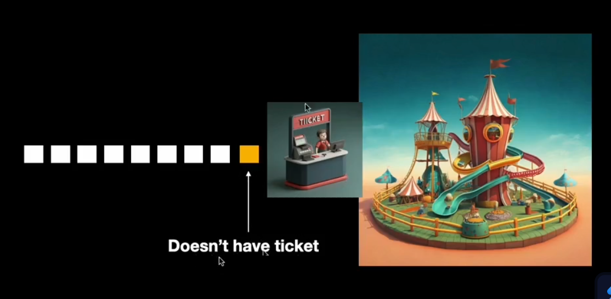
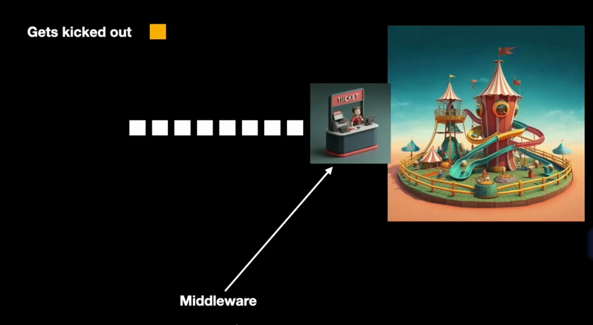
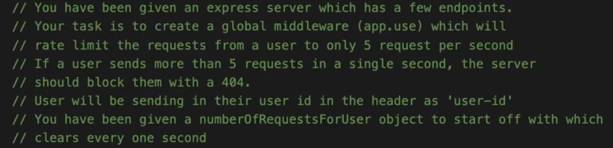
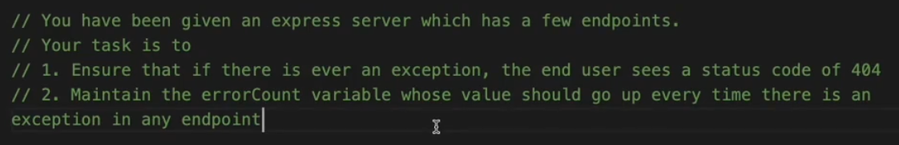
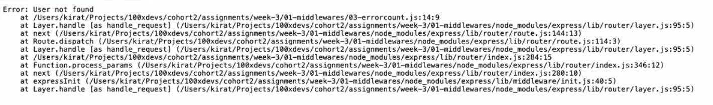

# __Middleware with real world example__

- [__Middleware with real world example__](#middleware-with-real-world-example)
  - [**What is Middleware ??**](#what-is-middleware)
    - [**How to define the `Middleware` ??**](#how-to-define-the-middleware)
    - [**How to Use the Middleware ??**](#how-to-use-the-middleware)
    - [**Another way to use the middleware (`.use` method)**](#another-way-to-use-the-middleware-use-method)
    - [**About `throw new ERROR()`**](#about-throw-new-error)
    - [**Error-handling Middleware**](#error-handling-middleware)
    - [**How to define `error-handling middleware` ??**](#how-to-define-error-handling-middleware)


Take the case of __amusement part__





The ticket checker is the **middleware -> A person sitting between your end client and your final ride that you are trying to access doing certain checks making sure only people that have legitmate things done can only pass through**

## **What is Middleware ??**
----------


-> `Express` is a routing and middleware web framework of its own.

:large_blue_diamond: **An `express` is essentially a series of middleware function calls**

`Middleware` are functions that have access to <span style="color:orange">**request object (req),**</span><span style="color:orange">**response object (res)**</span> and the **Next** `Middleware` function in the application's `request - response` cycle

`Middleware` functions can perform the following tasks ->

- Execute any code 
- Make changes to the __request__ and __response__ objects
- End the **request - response** cycle
- call the next `middleware` function in the stack

An `Express` app is essentially a series of `middleware` calls

:bulb: **Why Middlewares ??**


A single ticket checker can handle multiple amusement park instead of each ticket checker kept for single amusement park

**Lets codify this example**


```javascript
const express = require("express")

const app = express();

app.get("/ride1", function(req, res){
    res.json({
        msg : "You have successfully ridden ride1",
    })
})

app.listen(3000);
```

But the above code has one problem we have never checked whether the person has **Ticket or not ?? or certain age or not ??**

lets introduce them

```javascript
// function that will return a boolean if the age of the person is more than 14

function age14OrMore(age){
    if(age < 14){
        return false;
    }else{
        return true;
    }
}
```

Now implying it in the main code 

```javascript
const express = require("express")

const app = express();


function age14OrMore(age){
    if(age >= 14){
        return true;
    }else{
        return false;
    }
}

app.get("/ride1", function(req, res){
    if(age14OrMore(req.query.age)){
        res.json({
            msg : "You can ride the ride1"
        })
    }else{
        res.status(411).json({
            msg : "You are not eligible due to the age"
        })
    }
})

// similarly you can use the same ticket checker for ride2 as well

app.get("/ride2", function(req, res){
    if(age14OrMore(req.query.age)){
        res.json({
            msg : "You can ride the ride2"
        })
    }else{
        res.status(411).json({
            msg : "You are not eligible due to the age"
        })
    }
})


app.listen(3000);
```

The above is the __one__ way to do that but the **Better way is to do it via `Middleware`**

see the syntax carefully

### **How to define the `Middleware` ??**
----------

```javascript
function age14OrMoreMiddleware(req, res, next){
    if(age >= 14){
        next();
    }else{
        res.json({
            msg:"Not eligible"
        })
    }
}
```

In the above code we know about the `req`, `res` but **What the hack is `next`??**

-> go to the **Definition of `Middleware` written above**

-> `Middleware` are functions that have access to **response object, request object** and the <span style="color:orange">**Next**</span> `Middleware` function in the application's `request - response` cycle

> :warning: Every `Middleware` or functions you write in `express` has actually **3 arguments (req, res, next)**
>
> > we could have passed third argument while defining routes `/ride1` function (**next**) **but as it was not needed so**
> >
> > > Mostly you need only 2 arguments (`req, and res`) so you could have passed `next` in all the route handlers written above

>:warning: **`next()` helps to propagate to the next middleware**
>
> > :warning: <span style="color:orange">**Remember to not  pass anything inside next() as argument as `Express` automatically resolves this**</span>


**The Biggest advantage of using `Middleware` is to make them what they really are supposed to do**

For example -> the current code looks like this BUT...

```javascript
app.get("/ride1", function(req, res){
    if(age14OrMore(req.query.age)){
        res.json({
            msg : "You can ride the ride1"
        })
    }else{
        res.status(411).json({
            msg : "You are not eligible due to the age"
        })
    }
})
```

:sparkle: **Very Very important point**

The role of `/ride1` was to **give the ride whoever comes its duty is NOT to check that whether its age is eligible or not just make him / her ride ?? thats where the role of `middleware` comes**

It (ride1) should look somthing like this

```javascript
app.get("/ride1", function(req, res){
    res.json({
        msg : "successfully done ride1",
    })
})  // check ka kaam kyu kre ye ??
```

as we have already defined the `middleware` above so lets see how to use it ??

### **How to Use the Middleware ??**
----------

```javascript
const express = require("express")

const app = express();

function age14OrMoreMiddleware(req, res, next){
    const age = req.query.age;
    if(age >= 14){
        next();
    }else{
        res.json({
            msg:"Not eligible"
        })
    }
}

// just pass / define the middleware to the request

app.get("/ride1", age14OrMoreMiddleware, function(req, res){
    res.json({
        msg : "successfully ridden ride1",
    })
})

app.get("/ride2", age14OrMoreMiddleware, function(req, res){
    res.json({
        msg : "successfully ridden ride2",
    })
})


app.listen(3000);
```

:sparkle: **Explanation of the below code (Important)**

```javascript
app.get("/ride1", age14OrMoreMiddleware, function(req, res){
    res.json({
        msg : "successfully ridden ride1",
    })
})
```

you have **Defined** the series that before `function (req, res){....}`  is called ,  `age14OrMoreMiddleware` **function should be called and hence series of middleware means.. in `express`**

Now to refine the above code 

### **Another way to use the middleware (`.use` method)**
----------


>:sparkle: **If you know certain `middleware` is going to be used in every `route` then instead of passing it on each `route` one by one <span style="color:orange">**use `app.use()` method**</span>**

for example -> above `age14OrMoreMiddleware` was being used to both the `routes` so instead of passing them on all `routes` one by one just use `app.use()`

```javascript
const express = require("express")

const app = express();

function age14OrMoreMiddleware(req, res, next){
    const age = req.query.age;
    if(age >= 14){
        next();
    }else{
        res.json({
            msg:"Not eligible"
        })
    }
}

// Just use this line of code to make available the middleware to EVERY method

app.use(age14OrMoreMiddleware)

// The above passed middleware will automatically passed to all the method defined below

app.get("/ride1", function(req, res){
    res.json({
        msg : "successfully ridden ride1",
    })
})

app.get("/ride2", function(req, res){
    res.json({
        msg : "successfully ridden ride2",
    })
})


app.listen(3000);
```

> :sparkle: **2nd Most important point -> while using `app.use()` is <span style="color:orange">**yaad rkhna "Jahan par v `app.use()` likha hoga uske baad ke jitne `middleware` h usi me apply hoga ya pass on hoga"**</span>**

```javascript
const express = require("express")

const app = express();

function age14OrMoreMiddleware(req, res, next){
    const age = req.query.age;
    if(age >= 14){
        next();
    }else{
        res.json({
            msg:"Not eligible"
        })
    }
}

app.get("/ride1", function(req, res){
    res.json({
        msg : "successfully ridden ride1",
    })
})

app.use(age14OrMoreMiddleware) // as "/ride1" ke baad use kiya gya and "/ride2" ke upar to bas "/ride2" aur iske neeche jo v hoga sb pe pass on hoga

app.get("/ride2", function(req, res){
    res.json({
        msg : "successfully ridden ride2",
    })
})

app.use(age14OrMoreMiddleware) // If you write at LAST then there is no use of middleware made 


app.listen(3000);
```

Now lets go to the __Assignment section__ 

you can go directly here -> [Middleware Assignment](https://github.com/100xdevs-cohort-2/assignments/tree/master/week-3/01-middlewares)

and then go to the **readme.md** file, where you will get to know about what you have to do

**1st Assignment**

:bulb: **How to make a `Global middleware` which count the number of request coming to the server ??** 

-> `Global Middleware` -> `middleware` which is applicable to all the `routes` written in the code (example is above function `age14OrMoreMiddleware` is `global middleware`)

```javascript
let requestCount = 0

// you can directly pass the function inside .use() instead of declaring it above and then referencing it

app.use(function(req, res, next){
    requestCount = requestCount + 1;
    next();
})
```

**2nd Assignment**



The above thing is very helpful if suppose someone wants to bombard your website with too many request, it will limit it the request

> :sparkle: **for capturing something in the `headers` use `req.headers[""]`**

```javascript
let numberOfRequestForUser = {}

// see the problem and then first divide the problem
// 1. How to count number of request present in the headers ??
// and 2. How to count requests IN A SINGLE SECOND and clears after 1 second ??

// solving the 1. problem
app.use(function(req, res, next){
    numberOfRequestForUser[req.headers["user-id"]]++;
})

// solving the 2. problem
// after 1 second it will again point to EMPTY OBJECT
    
setInterval(() => {
    numberOfRequestForUser = {};
}, 1000);

// making the above code more cleaner and aligned to the question asked
app.use(function(req, res, next){
    const userID = req.headers["user-id"]; // checking who is the user coming ??
    if(numberOfRequestForUser[userID]){
        numberOfRequestForUser[userID] = numberOfRequestForUser[userID] + 1;
        // now checking number of request and then limiting the rate
        if(numberOfRequestForUser > 5){
            res.status(404).send("No Entry further");
        }else{ // do the further things
            next();
        }
    }else{ // agar pehli baar aa rha h userID to usko to register krna he pdega and then initialise it with 1
        numberOfRequestForUser[userID] = 1;
        next();
    }
})
```

**3rd Assignment**



### **About `throw new ERROR()`**
----------


basically when you do something which is **not legal** according to the `javascript` langauge, <span style="color:orange">**it throws error**</span> for example ->

```javascript
let a;

a.length(); // running this line js will THROW AN ERROR
```

To throw this error, `js` gives you a way which is `throw new ERROR` command 

```javascript
const express = require("express")

const app = express();

app.get('/user', function(req, res){
    throw new Error("User not found");
    res.status(200).json({name : "John"});
})

app.post('/user', function(req, res){
    res.status(200).json({msg : "created dummy user"});
})

app.get('/errorCount', function(req, res){
    res.status(200).json({errorCount});
})

app.listen(3000);
```

**Problem with the above code**




although it throws an error in exception it **revealed a lot of info. to the user which is not good** also if you `inspect` this code in **browser** you will see that it is throwing status code `500`

>:sparkle: **By default ->** `js` when throws an expception it throws it on <span style="color:orange">**Status code**</span> `500`

To fix it `express` gives a special type of `middleware`

### **Error-handling Middleware**
----------


:bulb:**What is error-handling middleware ??**

-> __Anytime there is an exception being thrown__ for example ->

```javascript
let a;  // although "a" is undefined
let b = a.length; // you are trying to access "a" this is EXCEPTION 
```
**comes role of `error-handling middleware`**

> :warning: <span style="color:orange">**Always remember to write `error-handling middleware` at the end of the code**</span>

### **How to define `error-handling middleware` ??**
----------

**It looks very similar to normal `middleware` just that it has `4 Arguments`**

:large_blue_diamond: **The biggest advantage of using this is you get to use <span style="color:orange">**Status Code**</span> of your choice**

Which is not in the case of default `js` exception (`status code -> 500`)

```javascript
app.use(function(err, req, res, next){
    res.status(404).send({});
})
```

now finally doing the assignment

```javascript
const express = require("express")

const app = express();

let errorCount = 0;

app.get('/user', function(req, res){
    throw new Error("User not found");
    res.status(200).json({name : "John"});
})

app.post('/user', function(req, res){
    res.status(200).json({msg : "created dummy user"});
})

app.get('/errorCount', function(req, res){
    res.status(200).json({errorCount});
})

// Error - Handling Middleware

app.use(function(err, req, res, next){
    res.status(404).send({});
    errorCount = errorCount + 1; // as the assignment says whenever you hit an error you should increase it
})

app.listen(3000);
```


 