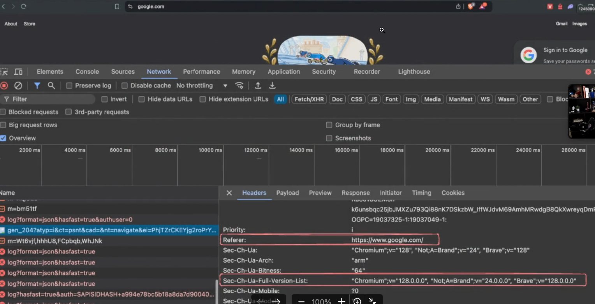
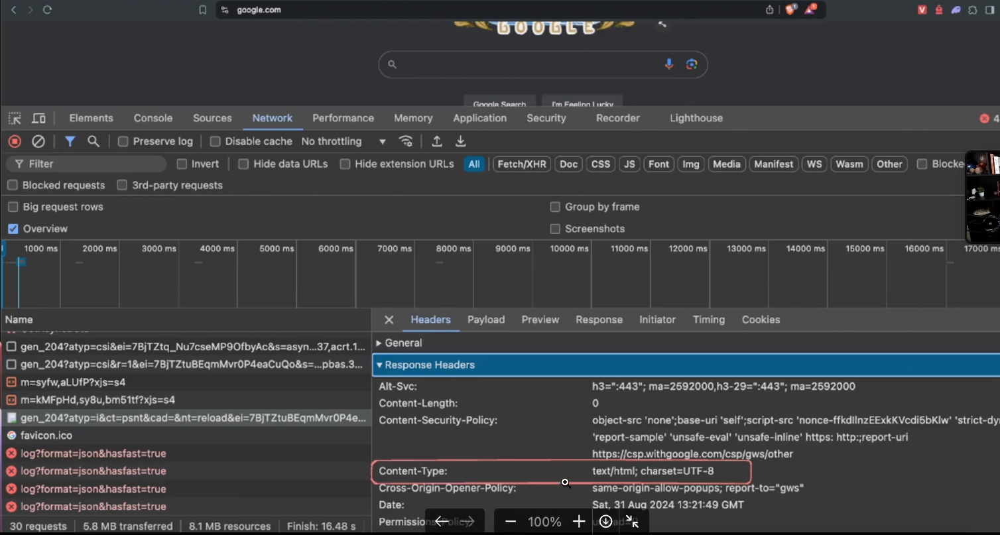
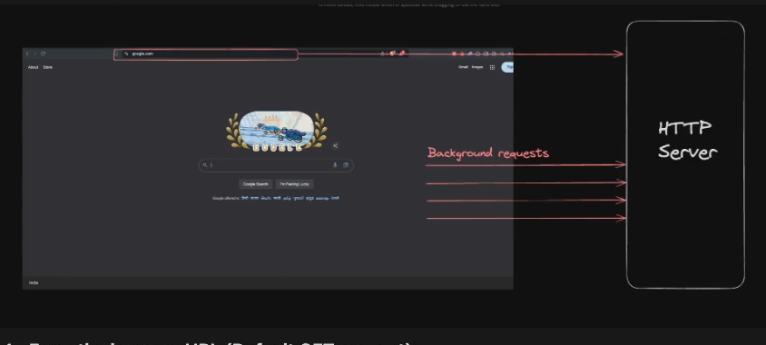
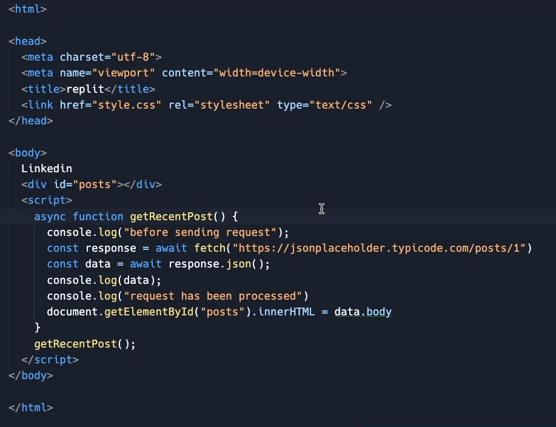
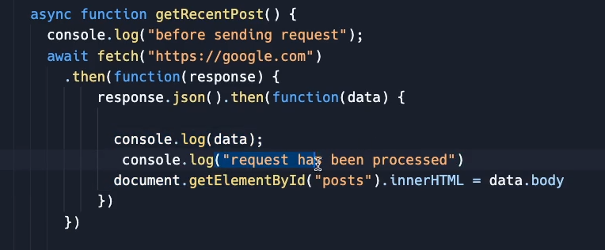
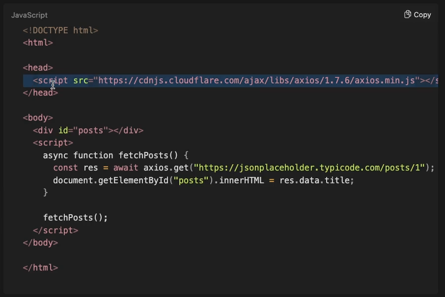
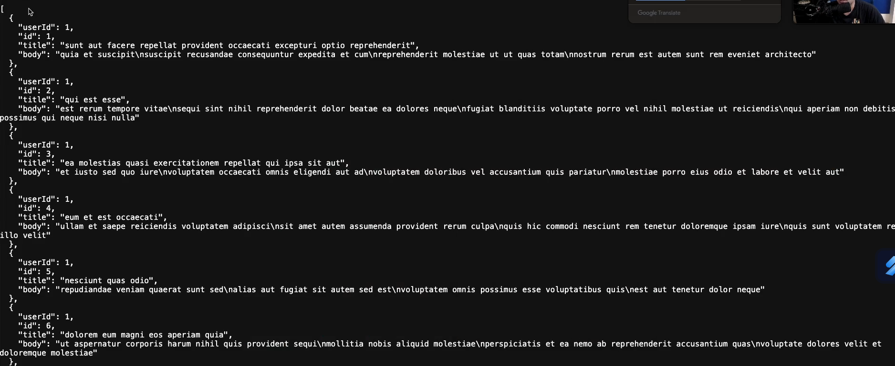
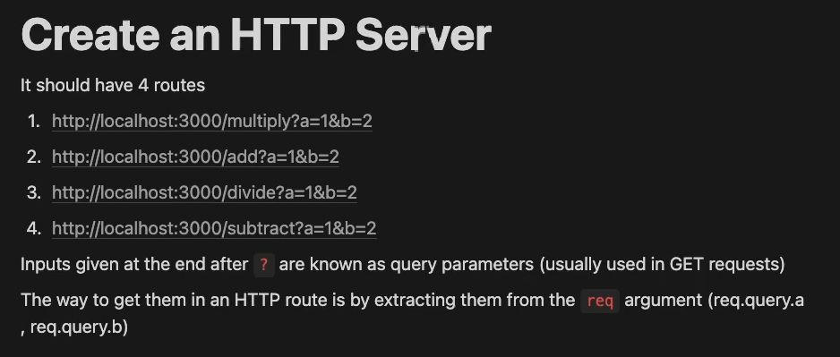
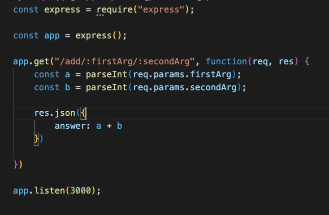

# **Headers, Params, Query and Express**

- [**Headers, Params, Query and Express**](#headers-params-query-and-express)
  - [**Headers**](#headers)
    - [**Request Headers**](#request-headers)
    - [**Response Headers**](#response-headers)
  - [**Fetch API**](#fetch-api)
    - [**How to use the `fetch()` method ??**](#how-to-use-the-fetch-method)
    - [**Difference between `fetch` and `GET`**](#difference-between-fetch-and-get)
    - [**How to use the response came from using `fetch()` ??**](#how-to-use-the-response-came-from-using-fetch-)
    - [**How to reflect the data fetched ??**](#how-to-reflect-the-data-fetched)
      - [**about `axios`**](#about-axios)
    - [**Most common scenario widely used in all the website almost**](#most-common-scenario-widely-used-in-all-the-website-almost)
    - [**Assignment**](#assignment)
    - [**About `req.params.vairable_name`**](#about-reqparamsvairable_name)
    - [**Some Important Conversions**](#some-important-conversions)


## **Headers**
----------


HTTP headers are like **Key - Value pair** sent between a `client`(like a web browser) and a `server` in an HTTP request or response. They convey metadata about the request or response, such as content type, authentication and information, etc..

**Common Headers**

- **Authorization** -> (sends the user auth info.) / cookie type thing
- **Content - type** -> Type of info. client is sending (`json`, `binary`, etc..)
- **Referer** -> Which url is this request coming from ??

### **Request Headers**
----------
The headers the `client` sends out in the request are known as **request headers**



### **Response Headers**
----------

The headers that the `server` responds with are known as **response headers**



:large_blue_diamond: in above picture you can see the **Content - type** is returning some `html` file

:bulb: **Difference between `headers` and `body`**

-> In `Body` -> we send the <span style="color:orange">**actual data**</span>

BUT

In `headers` -> we send the <span style="color:orange">**Metadata**</span> (**Extra information like your id, password or some part of html**)

__For example__ -> when you type `google.com` although you have not given your username and password in the url but then also the browser automatically shows your account (you have seen you profile picture or your account of that google loading up) so **How does this occurs ??** -> reason is <span style="color:orange">**through `Headers`**</span> **It automatically sends my authentication info. to the Headers** <span style="color:orange">**The cookie you see has name and password somehow**</span> 

> :large_orange_diamond: **whenver you want to send some <span style="color:orange">**auxillary data**</span> ( something you want to send with every request or you dont want the developer to explicitely describe that in the url, those are sent in the `Headers` )**
>
> > **both from `client` and `server` the extra data send by them is sent through `Headers`**


## **Fetch API**
----------


There are **High Levels** ways a browser can send requests to an HTTP server



1. **From the browser URL (Default GET Request)**
    - When you type a URL into the address bar of browser and press `enter`, the browser sends and HTTP GET request to the server. This request is used to retrieve resources like HTML pages, images and other content
2. **From an HTML form or Javascript (Various request types)**
    - **HTML Forms ->** When a user submits a form on webpage, the browser sends an HTTP Request based on the form's `method` attribute, which can be `GET` or `POST`. __Forms with method = "POST" typically send data to the server for processing(ex -> form submission)__
    - **Javascript (fetch API) ->** Javascript running in the browser can make HTTP Request to server using APIs the `fetch` API. These requests can be of various types (`GET`, `PUT`, `POST`, `DELETE`, etc..) and are commonly used for asynchronus data retrieval and manipulation (ex -> AJAX requests)


<video controls src="20250525-1356-25.3628150.mp4" title="Example" width=700 height=300></video>

In the above video, you can clearly see more and more scrill you are seeing more and more `request` is going to the HTTP server **in the background**

The way to achieve this is by `Fetch API`

> :large_blue_diamond: Browser by default provides you `fetch()` function which can be used to <span style="color:orange">**fetch something from the HTTP server (to send a request to server and get back the response)**</span>

### **How to use the `fetch()` method ??**
----------

just write this line of code 

```javascript
fetch(url_of_the_link_from_where_you_want_to_fetch_data)

// Example
fetch("https://jsonplaceholder.typicode.com/posts/1")
```

running the above will send a **background request to this server** and from there data will be fetched

### **Difference between `fetch` and `GET`**
----------


about `fetch`->

- this is a __function__ that the browser gives you like `setTimeout`, `alert`, etc..
- **Job ->** sending a request to the **backend**
- it accepts many more things like

```javascript
fetch("https://jsonplaceholder.typicode.com/posts/1", {
    method: "POST",
    headers:{
        Cookie: "asd"
    },
    body: {

    }
    // You can also describe your background request
    // you can in short send everything here
})

// If you dont specify anything BY DEFAULT - it is a GET request
```

Now as this (`fetch`) is function so it will **return** something so 

### **How to use the response came from using `fetch()` ??**
----------

> :warning: `fetch` function returns <span style="color:orange">**Promise**</span> so use <span style="color:orange">**await**</span> to the promise
>
> > :bulb: Why it returns `Promise` ??
> >
> > > **Your browser is sending request to a bunch of router, wire to a distant server from where data will take time to come which will definitely TAKES TIME thats why it sends a `Promise`**


so 
```javascript
const response = await fetch("https://jsonplaceholder.typicode.com/posts/1");
```

going deep dive

```javascript
async function getRecentPost(){
    const response = await fetch("https://jsonplaceholder.typicode.com/posts/1")

    // not this fetch can return you any type of data (you dont know)

    // so convert it in JSON
    const data = await response.json();  // now this also does some "async" task so that why used "await"

    Just Remember the above point as you might think that it is not coming from server so it should not have await but internally it is an "async" task
}
```

### **How to reflect the data fetched ??**
----------
<span style="color:orange">**By using DOM Manipulation**</span>

example ->



You can see with the help of `div "posts"` and then inserted data in this `div` by using the line of code 

```javascript
document.getElementById("posts").innerHTML = data.body  // JSON data aaya h usme body naam ka v key h uska data le ke reflect kr diya div = posts tag pe
```
now as i have used `async` `await` you could have also used `.then()` also 

converting the above code in `.then()` format



Now we know about different library like `express`, `commander`, etc.. similar to them we have a library known as 

#### **about `axios`**
----------


It is an external __library__ which <span style="color:orange">**just make the syntax of sending the request slightly more easier**</span>

To use it in `node.js` install it first then `import` it  

while dealing with plain `javascript` use the `cdn` link of the axios available online on their site



:bulb: How it is easier ??

```javascript
const response = await fetch("https://jsonplaceholder.typicode.com/posts/1", {
    method : "GET",
})
const data = response.json();

// Instead of writing the above two or more line of code by using AXIOS you can directly use a single line

// as fetch is taking GET method so used that with AXIOS

const response = await axios.get("https://jsonplaceholder.typicode.com/posts/1")

// use it you have to make sure it is inside the data 

so use ->  response.data    // 2 very very important

example ->

console.log(response.data)  // will give all the data fetched in JSON format

// axios will automatically convert the data came to JSON and also you have no need to define the method individually you can give here only

```

**Explanation of `// 2` code**

`axios` gives the `Object` as **output** some of the widely used functionality of it are ->
- **response.data ->** Gives all the data(actual) `axios` has fetched via url.
- **response.statusCode ->** Gives the statuscode of the fetched request
- **response.header ->** contains all the information of the header.

so these were the two ways to send a background request to the server 

1. **using Fetch API**
2. **using Axios (external library)**

### **Most common scenario widely used in all the website almost**
----------
Lets say you have to load all the content but it is the format -> **ARRAY OF OBJECTS** looks something like this 



Then how to get all the data from this

```javascript
async function getRecentPosts() {
    const response = await axios.get("https://jsonplaceholder.typicode.com/posts") // as you know yahan se jo aayega wo ek array h so YOU CAN ITERATE OVER IT to get all the JSON and then the desired data present in the JSON file

    const arr = response.data;

    for(let i = 0; i < arr.length; i++){
        document.getElementById("posts").innerHTML += arr[i].title;  // as i want to APPEND in the innerHTML (to show)
    }
}
```
**Practical Usecase**

go to this link -> [Great video](Screen%20Recording%202025-05-26%20003423.mp4) open it in vlc as it does will not have audio if you play it here

### **Assignment**
----------


:bulb: **Can you solve this assignment ??**



See the solution in this folder itself file name -> `index2.js`

### **About `req.params.vairable_name`**
----------

:bulb: **What if i want to give values in the url in `GET` request but not by specifying the variable name and manually giving their values ??**

-> previously you were giving data something like this for which `req.query.variable_name` was being used ->


Now i want to send like this 


**Specify inputs as two DYNAMIC ROUTES**

for this we use `req.params.variable_name`



:bulb:**How to use it ??**

-> jitna v dynamic routes banana h sbko `:` se start kro 

>:large_orange_diamond: `:` simply means <span style="color:orange">**iske baad sb ignore hoga and will be taken as dynamic routes and variable value**</span>

>:large_orange_diamond:As it is called as **Dynamic Routes** that's why you deal it in the `.get("ROUTE")` only

:bulb:**How to extract / get the values from dynamic routes ??**


-> using the `req.params.variable_name_you_defined_in_colon` see the above pic

### **Some Important Conversions**
----------


1. **String to Integer**
    - using `parseInt(`__"string you want to convert"__`)`
2. **Object to String**
    - using `JSON.parse(`__Object ( {..} ) you want to convert__`)`
3. **String to Object**
    - using `JSON.stringify(`__"string you want to convert"__`)`


