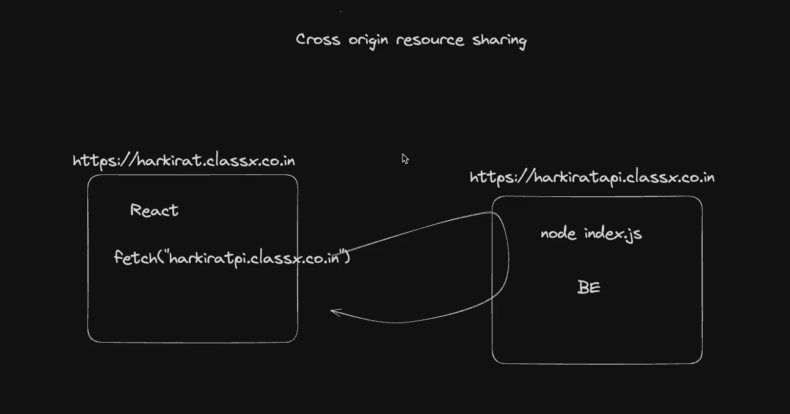
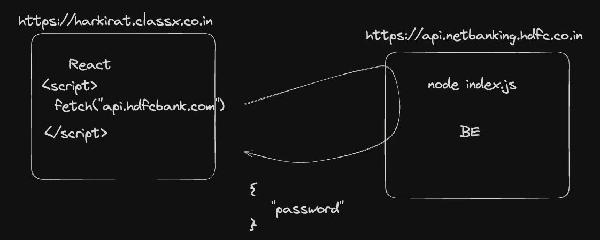
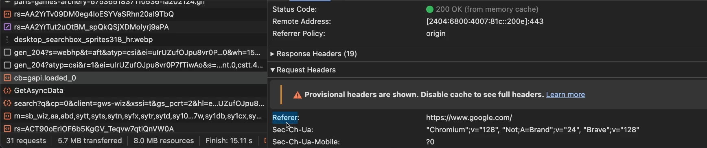
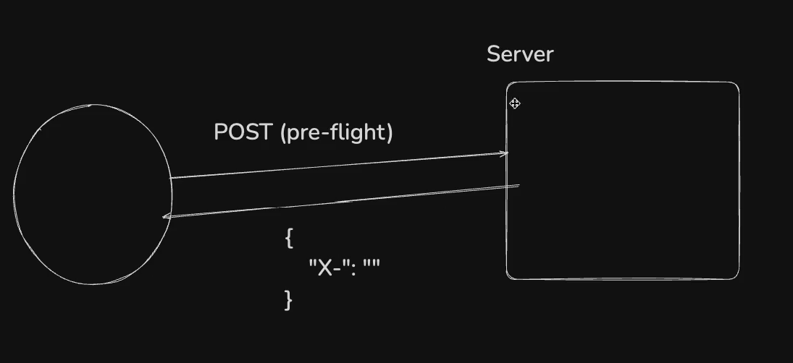
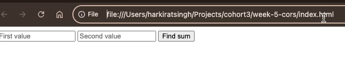
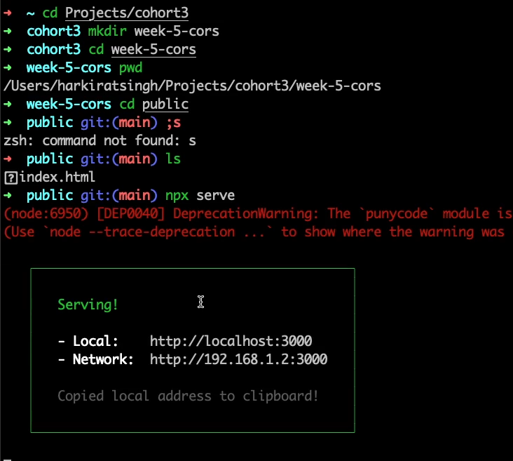
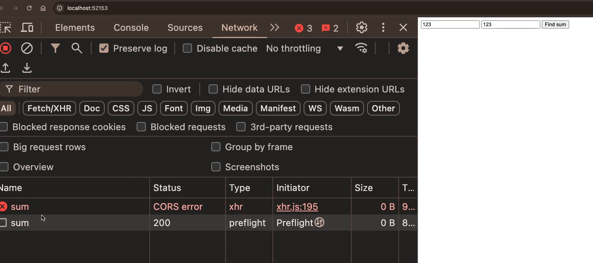
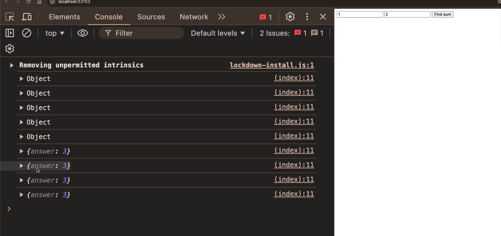
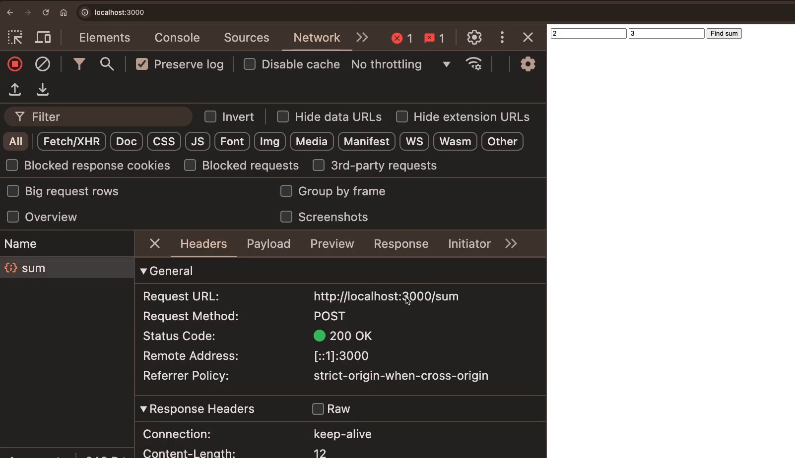

# **Middlewares and CORS**

- [**Middlewares and CORS**](#middlewares-and-cors)
  - [**Middlewares**](#middlewares)
  - [**Assignment**](#assignment)
    - [**Assignment 1**](#assignment-1)
  - [**Some Commonly used Middleware**](#some-commonly-used-middleware)
    - [__1. express.json()__](#1-expressjson)
    - [**2. CORS - Cross Origin Resource Sharing**](#2-cors---cross-origin-resource-sharing)
  - [**How CORS works under the hood ??**](#how-cors-works-under-the-hood)
    - [**Pre-Flight Mechanism**](#pre-flight-mechanism)
  - [**How to implement CORS ??**](#how-to-implement-cors)
    - [**Assignment**](#assignment-1)
    - [**How to Open the linked file of `Frontend` and `Backend`**](#how-to-open-the-linked-file-of-frontend-and-backend)
    - [**Hack using `npx serve`(Side Quest)**](#hack-using-npx-serveside-quest)
    - [**How to make CORS work ??**](#how-to-make-cors-work)
      - [**An Important point**](#an-important-point)
    - [**How to manually set up same domain of both Frontend and Backend ??**](#how-to-manually-set-up-same-domain-of-both-frontend-and-backend)


before moving to the `Middlewares`

:bulb: **Do you need `Middleware` ??**

-> <span style="color:brown">**NO A BIG NO**</span> `middleware` are just a way to <span style="color:orange">**write the code in a more simpler and easier way**</span> without this you can do all the task

## **Middlewares**

In Express.js, **middleware** refers to functions that have access to the request object (`req`), response object (`res`), and the `next` function in the application's request-response cycle. Middleware functions can perform a variety of tasks, such as 

1. __Modifying the request or response objects.__
2. __Ending the request-response cycle.__
3. __Calling the next middleware function in the stack.__

> :pushpin: The main purpose of `middleware` is <span style="color:orange">**mostly for authentication**</span>

:round_pushpin: *Go to the Week 4.4 Middleware notes made by me that is all here discussed in this class*

## **Assignment**
----------


### **Assignment 1**
----------
see the solution of `1` to here -> [Assignment](index.js)


## **Some Commonly used Middleware**

Through your `journey of writing express servers` , you’ll find some commonly available (on npm) middlewares that you might want to use

### __1. express.json()__
----------


The `express.json()` middleware is a built-in middleware function in Express.js __used to parse incoming request bodies that are formatted as JSON__. This middleware is essential for handling JSON payloads sent by clients in POST or PUT requests.

Lets understand what does this mean and does ??

 :bulb: Now i have to instead of `GET` request have to extract data by sending `POST` request, How to do that ??

> :pushpin: you already know that when you have to send data via `POST`, `PUT`, or `DELETE` you **Put it inside the BODY** and when you are sending data via `GET` then you have to put it in the **inside the URL**

solution of the above problem ->

```javascript

const express = require("express")

const app = express()

app.post("/sum", function(req, res){
    const a = parseInt(req.body.a) // using req.body will give you access to BODY
    const b = parseInt(req.body.b)

    res.json({
        ans : a + b
    })
})

app.listen(3000)
```

You might think that the problem is solved as i have sent data in the `BODY` but if you send `POST` request from **Postman** or **Hoppscotch** then it will give somthing like this if you send `a` and `b` in the `BODY`


The error is that `a` is **Not accessible** or indirectly `req.body` is **UNDEFINED** if you do `console.log(req.body)` it will give you `UNDEFINED` so is it something else or there is another way to extract data from `BODY` **Answer is**

**As the client is trying to send the JSON data**

> :pushpin: <span style="color:orange">**In express, if the client is sending data in JSON format, YOU FIRST NEED TO PARSE(convert it into Javascript object) THE JSON DATA and then send**</span>
>
> > **Parsing this will make the `req.body` available**

**Reason for the above ->**
- As the `express` deals with many types of data it **does not give the functionality to automatically detect the type of data** it tells you to **Parse the data according to yor choice** and to parse into `JSON` `express` gives

```javascript
app.use(express.json()); // express.json return another function thats why we are executing it not referencing or calling it like we did with other middlewares

If you are going to work with JSON data then you must have to append this line at the TOP of your code
```

`express.json()` is actually a `middleware` which helps to **parse the data to JSON**

Either use the above or an external library ( although this is previously used ) known as `body parser`

> :pushpin: `body-parser` has the ability to parse **any type of data**

to use it 

```javascript
const express = require("express")
const bodyParser = require("body-parser")

const app = express();

app.use(bodyParser.json())  // to use bodyParser
```

### **2. CORS - Cross Origin Resource Sharing**

----------

cross origin resource sharing is a **Security feature** implemented by web browsers that control how resources on a web server can be requested from another domain Its crucial for managing `cross origin` requests and ensuring secure interactions between `different origins` on the web

In practical life, **a website is hosted on 2 server ->**
- One for **Frontend**
- 2nd for **backend**
Now **CORS** deals with this only that <span style="color:orange">**How the data from `frontend` interacts with that in `backend` and vice versa**</span>

Now you could have said that we can use `fetch` here to `fetch` data from both the server and use it accordingly



BUT 

This will be **SECURITY VULNERABLITY**



although you have gone to `https://harkirat.classx.com` site as this site has **internally fetching the request to go to your `hdfc` account and it will go there now `hdfc` bank will think that this is you and will send money from your account to another which is CRITICAL**

so **Ideally, We should be BLOCKING any request coming from CROSS ORIGIN (see the pic) harkirat se api of hdfc is being fetched**

>:pushpin: <span style="color:orange">**If you are receiving a Request from a different origin, You should `Block` that request**</span>

You can check the origin by 



Its inside `Request Headers` -> `Referer` section

:bulb:**Should CORS be allowed by default ??**

-> **NO, this should not be allowed ideally even if you are allowing then you should have a proper set of all the possible verified by you site that you trust that allowing from them is of no such big issue**

:bulb:**How to write CORS code ??**

-> By default, `Node.js` blocks the **CORS** but you can make it enable by using <span style="color:orange">**CORS middleware**</span>

:bulb:**Why you gonna enable that ??**

-> You will also have **Frontend** and **Backend** in the future. You want ki certain **Frontend** ka url **Backend** ko hit kre

## **How CORS works under the hood ??**

### **Pre-Flight Mechanism**
----------



when you send request for __some__ the methods like (`POST` or `PUT`) You first send a <span style="color:orange">**Pre-Flight request**</span> jisme the server will respond you with <span style="color:orange">**some Headers**</span>(highlighted in {curly braces} in the pic) Now a soecific type of **header send the browser that whether this domain can send request or not ??** and hence browser comes to know about `CORS` and browser sends that request to server that as this is `CORS` it can send. <mark>**.The whole process is known as Pre-Flight Mechanism.**</mark>

> :large_blue_diamond: As the name suggests <span style="color:orange">**Pre-Flight**</span> a **PRE Request** is being sent by the browser to the server and **server responds with a header** (which has the info. whether this domain is allowed or not) and based on this **The browser then sends the MAIN Request to the server**


## **How to implement CORS ??**

Before moving on how to implement the `cors` first see the below assignment

### **Assignment**


**Assignment 1**

see it in -> [Index2](index2.js)

```javascript
const express = require("express")

const app = express()

app.use(express.json())  // without using this req.body will be undefined

app.post("/sum", function(req, res){
    const a = parseInt(req.body.a)
    const b = parseInt(req.body.b)

    res.json({
        sum : a + b,
    })

})

app.listen(3000)
```

**Assignment 2**

It basically says **You have to write a frontend (HTML) file that hits this backend file**

so for that i have to make a `index.html` file

see it here -> [IndexHtml](public/index.html)

```javascript
<head>
    <script src="https://cdnjs.cloudflare.com/ajax/libs/axios/1.9.0/axios.min.js">
    </script>  // Imported the axios
    
    <script>
        function sendRequest(){ 
            const a = document.getElementById("a").value
            const b = document.getElementById("b").value  // 1
            axios.post("https://localhost:3000/sum, {
            a : a,
            b : b
           })
        }
    </script>

</head>
<body>
    <input id = "a" type="text" placeholder="First Value"></input>
    <input id = "b" type="text" placeholder="Second Value"></input> // 2

    <button onclick="sendRequest()">Find Sum</button>
</body>
```

**Explanation of `// 1` and `// 2` code**

actually the code `// 1` will extract the value given in the **input** field of `// 2` code

### **How to Open the linked file of `Frontend` and `Backend`**

You might say just open the `index.html`



Notice this URL it does not seems to be like DOMAIN i want it to look like **Domain**

:bulb:**How to do that ??**

for this we have various ways to do 

1. if you have `python` run this command 

```python
python -m SimpleHTTPServer
```

The above command will <span style="color:orange">**serve all your file over HTTP**</span>

2. make a new folder named as `public`
    - **Transfer the `index.html` file in this**
    - Run `npx serve` command in the terminal

> :pushpin: `npx serve` -> <span style="color:orange">**serves a folder over the http server (host your folder over the internet)**</span>

### **Hack using `npx serve`(Side Quest)**

`npx serve` hosts your folder to `http` and gives you some link where it got hosted but **:no_entry: You can actually use it to get the data from another pc to this pc**

Interesting right -> but **necessary condition**

-> **Both should be connected to same Network** as you are hosting locally so thats why you have this condition if you deploy it then you can see even if you are connected to same network

:bulb:**How to do this ??**

If they have `node.js` installed and connected to same network then just run the command `npx serve` in <span style="color:orange">**any of the directory or folder which you want to get access to (mostly root folder he kr lo as it will contain all the files and folder present in the pc) and thats it just get the `Network` url and you will see their file and folders**</span> as it has now been hosted on the Internet

You will something like this when you run `npx server`



here
- **Local ->** this is the url where __you will be able__ to see the folder on which `npx serve` has been run
- **Network ->** this is the url where __your other member__ can access the folder on which `npx serve` has been run
    - :warning:**Remeber they must be connected to the same network (or wifi) as you are connected to**

You will always see a **Private IP on the Network** thats why this is being **Possible** and thats why some of the Site **was only accessible within the campus only** 

**For Example ->** **LNMIIT Repository** site was only accessible when you connect to their **Networking system**

A classic example of this is **Mi Share** app How it gives you access and transfer to all the file from one to another by joining them on the same network


Coming back to the topic,

:bulb:**Why we have done it**

as we also wanted our `html` **File** to host to `http` server

after running you will see this type of scenario 

- **Backend** is hosted on one domain -> `http://localhost:3000` and 
- **Frontend** is hosted on another domain -> `http://localhost:52153` 

-> **Backend is hosted on a different domain than frontend** -> now if you fill numbers or input in the frontend and then press `find sum` button then you will see in `console` <span style="color:orange">**CORS Error**</span>(as you are sending request from other domain) 



### **How to make CORS work ??**
----------

There is external library known as `cors`

**Step 1 ->** Install the library

```console
npm install cors
```

**Step 2 ->** `require` the library
```javascript
const cors = require("cors")
```

**Step 3 ->** add the middleware 

```javascript
app.use(cors()) // 2

app.use(cors(){
    domains : ["https://google.com", "https://employee.google.com"]
}) // 3
```
**2 Versions of How to use `CORS` ??**

`// 2` code -> use this when you **want ki koi v frontend tmhe request bhej paye**

`// 3` code -> use this when you **want some specific site se he request bhej paye (given in array)**

so adding this line in `index2.js`

```javascript
const express = require("express")
const cors = require("cors")

const app = express()

app.use(express.json()) 
app.use(cors()) // to use cors

app.post("/sum", function(req, res){
    const a = parseInt(req.body.a)
    const b = parseInt(req.body.b)

    res.json({
        sum : a + b,
    })

})

app.listen(3000)
```

now if you go on frontend `https://localhost:53213` and then give two variable and click on `find sum` you will see in the `network` tab inside `inspect` they all will return `sum` with status code `200` and if you click on these `sum` then you will see the Output as



#### **An Important point**

You have done all the above thing just because you dont have **same domain of frontend and backend**

But 

**If you have hosted your frontend and backend on the same Domain then no use of the above gyan**

### **How to manually set up same domain of both Frontend and Backend ??**
----------
instead of using `cors` library you can make both frontend and backend to work on same domain by 

```javascript
const express = require("express")

const app = express()

app.use(express.json()) 

app.get("/", function(req, res){
    res.sendFile(__dirname + "./public/index.html")
})  // 2


app.post("/sum", function(req, res){
    const a = parseInt(req.body.a)
    const b = parseInt(req.body.b)

    res.json({
        sum : a + b,
    })

})

app.listen(3000)
```

**Explanation of `// 2` code**

I am saying that whenever somone comes to the `/` endpoint __send__ them this file -> `./public/index.html` which **basically gave you the ability to Host or Send HTML file to server and that too on the same domain** and thats <span style="color:orange">**how you hosted yor frontend and backend on the same domain**</span>



you can see also the request(**see Request URL**) is going to the same domain as that given in the `URL`

so here no need to use `cors` middleware or `npx serve` to host `HTML` file over the server


