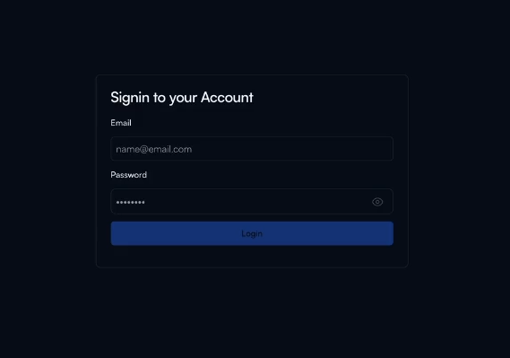
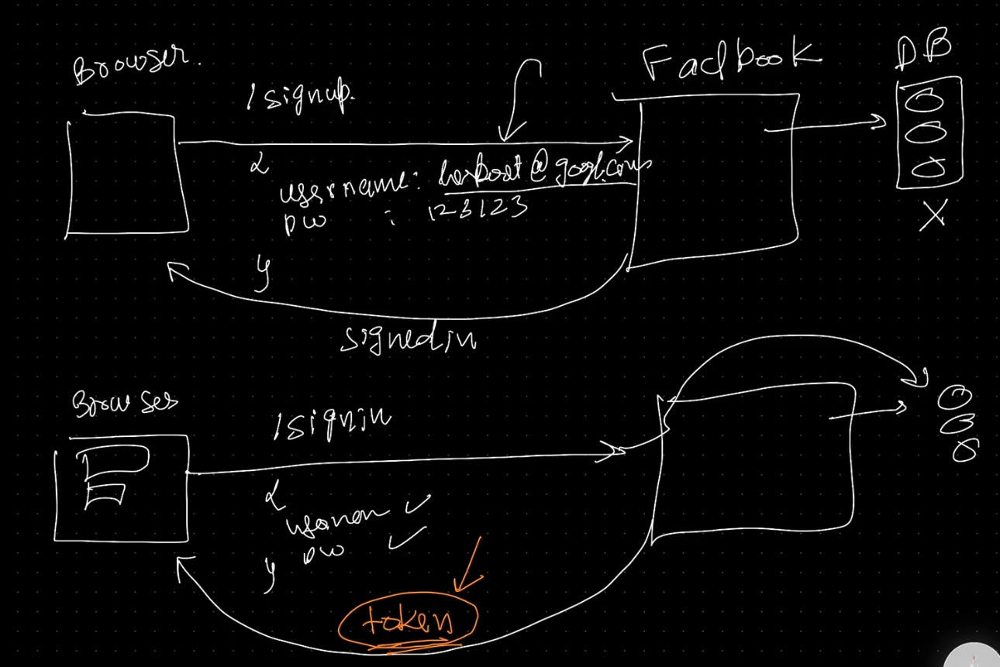
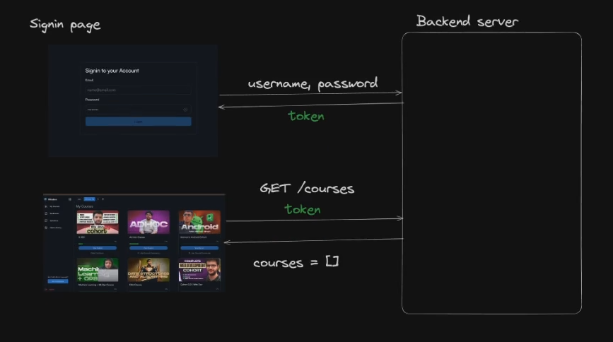
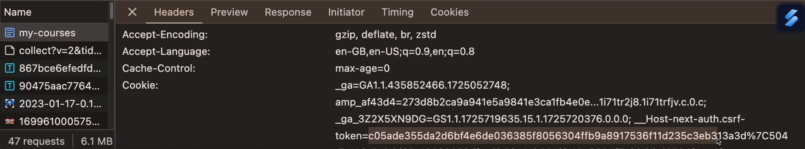
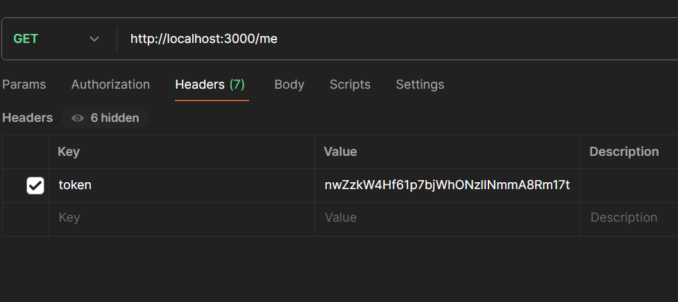
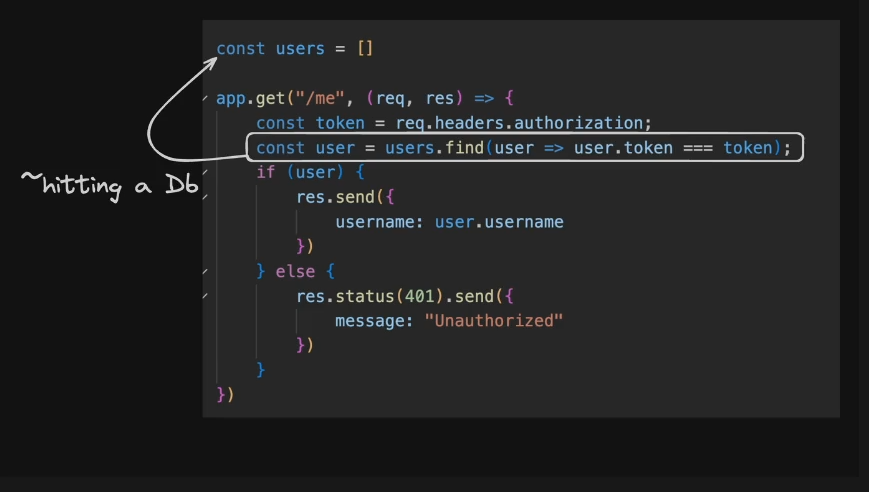
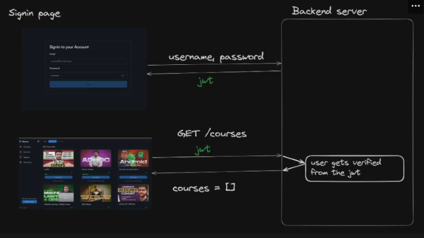
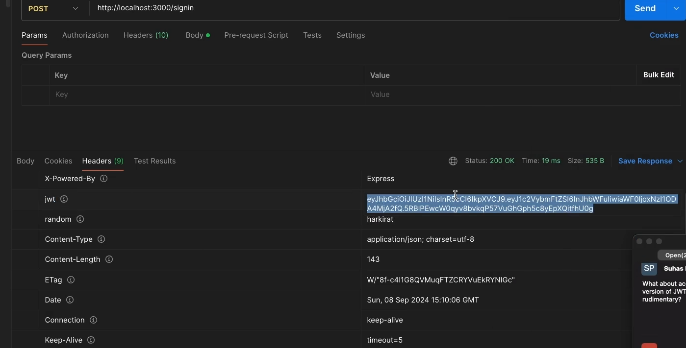
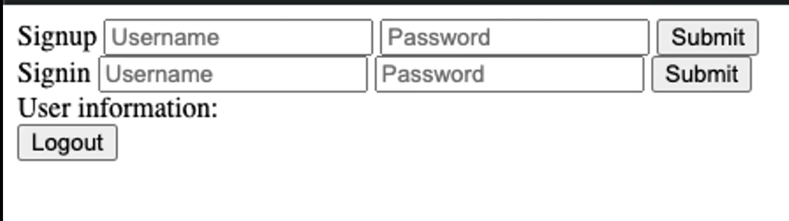
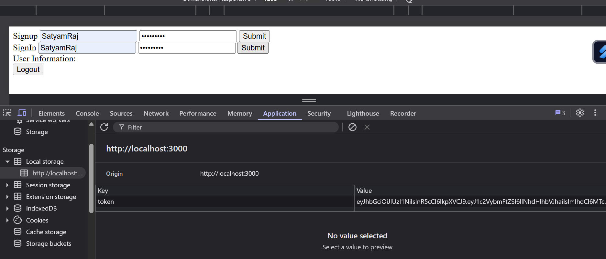

# **Authentication**

- [**Authentication**](#authentication)
  - [**Auth Workflow with real life example**](#auth-workflow-with-real-life-example)
  - [**Auth Workflow**](#auth-workflow)
    - [**Benefits of using Token**](#benefits-of-using-token)
  - [**Creating an Express Auth system**](#creating-an-express-auth-system)
  - [**Creating an Authenticated End Point**](#creating-an-authenticated-end-point)
  - [**How to determine data sould be sent in `Body` or `Header` ??**](#how-to-determine-data-sould-be-sent-in-body-or-header)
    - [**Why giving token in `header` instead of in `body`**](#why-giving-token-in-header-instead-of-in-body)
    - [**Share courses with your friends without being paid (HACK SIDE QUEST)**](#share-courses-with-your-friends-without-being-paid-hack-side-quest)
  - [**Tokens Vs JWTs (JSON Web Tokens)**](#tokens-vs-jwts-json-web-tokens)
    - [**Why using JWTs is better ??**](#why-using-jwts-is-better-)
  - [**JWTs**](#jwts)
    - [**JWT Workflow**](#jwt-workflow)
  - [**Replace Token Logic with JWTs**](#replace-token-logic-with-jwts)
    - [**How to send the data like JWT in Response Header**](#how-to-send-the-data-like-jwt-in-response-header)
      - [**about `res.header()`**](#about-resheader)
    - [**Some commonly used JWT functions**](#some-commonly-used-jwt-functions)
      - [**`jwt.sign()`**](#jwtsign)
      - [**`jwt.verify()`**](#jwtverify)
      - [**`jwt.decode()`**](#jwtdecode)
  - [**Some Good questions with explanation**](#some-good-questions-with-explanation)
  - [**Assignment - Creating an Auth middleware**](#assignment---creating-an-auth-middleware)
    - [**Chaining the Middleware**](#chaining-the-middleware)
      - [about `req.method()`](#about-reqmethod)
  - [**Writing the frontend for the above logic**](#writing-the-frontend-for-the-above-logic)
      - [**about `localStorage.setItem()`**](#about-localstoragesetitem)
      - [**about `localStorage.getItem()`**](#about-localstoragegetitem)
      - [**about `localStorage.removeItem()`**](#about-localstorageremoveitem)
  - [**Assignment -\> ToDo app**](#assignment---todo-app)


:bulb:**What is Authentication ??**

-> The process of letting users `sign in` or `sign out` of your website. Making sure your `routes` are protected and users can only get back their own data and not the data from a different user.



## **Auth Workflow with real life example**
----------


when you go to open a bank account in a bank, you 

1. Go to the bank and give your information
2. They give you back a `cheque book`
3. Every time you want to send money, you write it in the cheque book and send it over to the bank
4. That is the bank identifies you

The above example is very similar to any `sign up` option present on any site 



Once you are signed up using `/signup` route **fb stores it in database (not going to learn in this)** also **we are believing that the email user provided is genuine (means you have seen that fb sends you some otp or mail to verify you email) we are not doing this here**

Now when you signned In using `/signin` route fb from the database verified it and send you a **Token** 

**Now this token is somehow stored in browser and next time when you try to `GET` request to see `All posts` with this request token is also attached** and <span style="color:orange">**thats how fb comes to know that this is you and your data is to being shown**</span>


> :pushpin: Every time you **sign in** a **the same Token is generated which enables you to identify yourself to any website**
>
> > **Remember this token is very important so you have to keep it safe as it contains your sensitive info. like username or password**
> 
Now you can compare the __auth with Bank Example taken above__

## **Auth Workflow**
----------




1. The user comes to your website (course.com)
2. The user sends a request to `/signin` with their `username` and `password`
3. The user gets back a `token`
4. In __every subsequent request__, the user sends that token to identify itself in the backend.

> :pushpin: Think of <span style="color:orange">**Token as a secret that the server gave you**</span>. You send that `secret` hack to the server in every request so that the server knows who you are ??

> :pushpin: Even though we all are getting to the same endpoint the server identifies you because of the token browser saved it inside.



You will find the token here although **Encoded** but if you try it can be **Decoded** and hence you should keep this safe

### **Benefits of using Token**
----------
- **Time Saving**
    + You __dont__ have to send `username` and `password` __every time__
- **Security**
    + Every time your `username` and `password` sending will make you vulnerable to hackers also as they can do whatever they want but if dealing with token it will `deactivate` after some time and you also can request (like to change the password, delete my account etc..) by yourself

## **Creating an Express Auth system**
----------


We are going to make this 

[Auth App](image-3.png)

Lets start coding !!!

**Steps involved in this**

**Step 1 ->**
- Initialise a `node.js` project and setup `express` by installing in the file `index.js`

**Step 2 ->**
- Now add two new `POST` routes, one for **Signup** and another for **SignIn**

```javascript
const express = require("express")

const app = express()

app.use(express.json()) // wrote Step 3 here only

app.post("/signin", function(req, res){
    
})

app.post("/signin", function(req, res){

})

app.listen(3000)
```

**Step 3 ->**
- use `express.json` as a middleware to parse **post body request**

**Step 4 ->**
- **As we dont have database to keep username and password and then verify using that so** create a `inmemory` variable called `users` where you store the `username`, `password` and a `token` (will come at later point of time)
```javascript
const express = require("express")

const app = express()

app.use(express.json())

const users = []   // Any time any users signs up we will store its information in this array as we have not learned about database yet

// This is InMemory Variable

app.post("/signin", function(req, res){
    
})
app.post("/signin", function(req, res){

})
app.listen(3000)
```

**Step 5 ->**
- complete the `signup` endpoint to store user information in the `in memory` variable
```javascript
const express = require("express")

const app = express()

app.use(express.json())

const users = []

app.post("/signup", function(req, res){
    const userName = req.body.username 
    const password = req.body.password

    // YOU CAN ENHANCE THE FUNCTIONALITY BY ADDING SOME SOLID CHECKS (declare it in middleware that will be more good)

    // adding a check that username should be more than 5 characters
    // play with this you can declare that on password also

    if(userName.length < 5){
        res.json({
            msg : "Your username is too small"
        })
        return;
    }

    // Now One more thing is that if one user is present in the array and if again signup then that same user should not go again in array, AS IT WILL CREATE DUPLICATES so check that

    if(users.find( (u) => u.userName === userName)){
        res.json({
            msg : "User already exists",
        })
        return;
    }

    users.push({
        username : userName,
        password : password
    })

    res.json({
        msg : "Hey have signed up successfully Enjoy !!!",
    })
})


app.post("/signin", function(req, res){

})

app.listen(3000)
```

**Step 6 ->**
- create a function called `generateToken` that generates a random string for you 

```javascript
function generateToken() {
  let options = ['a', 'b', 'c', 'd', 'e', 'f', 'g', 'h', 'i',
    'j', 'k', 'l', 'm', 'n', 'o', 'p', 'q', 'r', 's', 't', 'u',
    'v', 'w', 'x', 'y', 'z', 'A', 'B', 'C', 'D', 'E', 'F', 'G',
    'H', 'I', 'J', 'K', 'L', 'M', 'N', 'O', 'P', 'Q', 'R', 'S',
    'T', 'U', 'V', 'W', 'X', 'Y', 'Z', '0', '1', '2', '3', '4',
    '5', '6', '7', '8', '9'];

  let token = "";
  for (let i = 0; i < 32; i++) { // 32 characters long token
    // use a simple function here
    token = token + options[Math.floor(Math.random() * options.length)]; // as Math.random() gives value between 0 to 1
  }

  return token;
}
```

**Step 7 ->**
- Finish the `signin` endpoint, It should generate a token for the user and put it in the `in memory` variable for that user.

```javascript
app.post("/signin", function(req, res){
    const username = req.query.username
    const password = req.query.password
    
    // check whether the user exists or not
    // 1 way -> Iterate over the whole array of users to find out the given username
    // 2 way -> use find function
    const user = users.find( (u) => {
        if(u.username == username && u.password == password){
            return true
        }else{
            return false;
        }
    })

    if(user){ // if user exists, generate the token and then save it in InMemory variable array users
        const token = generateToken();
        user.token = token // as we have to save the token to this user only not to other user so that's why not used users.push({token : token}) isse globally chal jayega
        res.json({
            msg : token,
        })
    }else{
        res.status(403).send({
            msg : " Invalid Username or password "
        })
    }
})
```

see the code -> [index](index.js)

> :round_pushpin: This can be __improved further__ by using
>
> > - Adding **ZOD** for Input Validation
> > - Making sure the same user cant signup twice
> > - Persisting data so it stays even if the process crashes

## **Creating an Authenticated End Point**
----------


**Assignment**

Lets create an endpoint (`/me`) that returns the user their information only if they send their token

basically you have to show the user their infor (ex - show their username and password)

```javascript
app.get("/me", function(req, res){
    const token = req.headers.token 
    // const token = req.query.token will make your token vulnerable as user has to send it via the url(req.query is used when you use url to extract data) which anyone can see so thats why user will send it to the headers which has a key called token where you will paste its token at the time of generating in signin so it will we will verify this token only 
    const user = users.find( (u) => {
        if(u.token = token){
            res.send({
                username: user.username,
                password: user.password
            })
        }else{
            res.status(403).send({
                msg : " Bhai badam kha tujhe yaad nhi h kuch v "
            })
    
    })
})
```

__manually__ enter the token and also do this `body` -> `none`(make this tick) as you are not sending any body as this is `GET` request



## **How to determine data sould be sent in `Body` or `Header` ??**
----------


**1st way ->** **Type of Request method**
- if `GET` to ya to `url` se loge data ya `headers` se
- if other than `GET`(ex -> `POST`, `PUT`, `DELETE`) to tm `body` se loge data

**2nd way -> Major way to differentiate (discussed below)**
### **Why giving token in `header` instead of in `body`**
----------

We could have sent the token (**or any other info. like content-type (those which you see in request header of any site)**) in `Body` but the <span style="color:orange">**main motive to give data in `body` is to work with `Endpoint specific things`**</span> (__`works on ONE endpoints`__) 

Where as

motive of `Headers` is to <span style="color:orange">**send those data which `works on ALL Endpoints`**</span>

as the **token** will be used in every `endpoint or route` so <span style="color:orange">**thats why kept in Headers instead of in body**</span>

the final code is here -> [index2](index2.js)

you can see the code is working

<video width="800" height="400" controls>
  <source src="Auth_Tutorial.mp4" type="video/mp4">
</video>


### **Share courses with your friends without being paid (HACK SIDE QUEST)**
----------


suppose you have purchased a course and now your friend also wants to access it wihtout making you payment so just make use of the above concepts you learned

**Step 1 ->** `sign in` first

**Step 2 ->**  go to the `my courses` section ( or page where your course content is being see)  

**Step 3 ->** now `inspect` and then in `network` tab you can see the `my courses` **request headers** which has `cookie` section

**Step 4 ->** take this `cookie` ans share this with your friend

**Step 5 ->** Now he will also share the **same token** as me and now usko lgega hm dono same he user h as **You have shared them** 
- although you do have **Logger mechanism (if someone login then other will logout automatically)** but as here you are making belief to the user that **you both are one user only** so it will not logout hence <span style="color:orange">**Beat this mechanism**</span>

+ to solve this website also have **Browser Fingerprinting / IP Checks** checks the `IP address` of the user device if multiple `IP` will be seen this means that user has shared his cookies and thus will be caught

## **Tokens Vs JWTs (JSON Web Tokens)**

### **Why using JWTs is better ??**
----------

There is a problem with `stateful` tokens.

**Stateful** -> By stateful here, we mean that we need to __store these tokens in a variable right now (and eventually in a database)__

> :pushpin: **JWT essentially prevents 1 Round trip from the backend server and DB for any user request**

**Problem**

The problem is that **we need to send request to the database** every time the user wants to hit an **authenticated endpoint**

> :pushpin: Indirectly you are hitting the database every time
>
> > **also known as STATEFUL TOKENS**



:bulb:__As we are hitting the database too much so can you suggest some way to avoid this much hitting ??__

-> Can i say instead of **generating some random token** generate a **token which has somehow my username and password ENCODED in it and the server can only DECODE it**. By this method, repeatedly hitting the Database for authentication will become less.

The token generated from above approach is only known as <span style="color:orange">**JSON Web Token**</span>

> :pushpin: `JWT` makes user authentication **STATELESS**

## **JWTs**
----------

JWTs, or JSON Web token, are a compact and self contained way to represent information between two parties. They are commonly used for authentication and information exchange in web applications

**It is a PROTOCOL that someone else has written**

> :warning: JWTs are not doing `encryption` **Both are different things**
>
> > <span style="color:orange">**Its not "Encrypted", Its "Encoded"**</span>

**JWTS are Stateless ->** JWTs contain all the information needed to authenticate a request, so the server doesnt need to store session data. **All the data is stored in the Token itself**



### **JWT Workflow**

----------


**Step 1 ->**
-  `/signup` -> we do __one__ **Database call** over here to store `username` and `password`

**Step 2 ->**
- `/signin` -> this again gives `username` and `password` and now again i do **another Database call** to **check whether the `username` and `password` is valid** if valid, then returns back to the user a <span style="color:orange">**Token (JWT)**</span> 
    - this token <span style="color:orange">**has only their username ENCODED (not password)**</span> and is sent to the user

**Step 3 ->**
- `/me` or any other `request` -> The user now just has to send me the `JWT` with the request and my server will be able to know about me by <span style="color:orange">**Decoding the JWT token (or username which is encoded in it)**</span>
    + and server knows that whoseever has `JWT` has in the past `signned in` **and the server was the only one who gave this JWT** so why to verify with the Database ??
    + Now server might have to hit the database for other stuff (such as accessing the course, or other stuff) but for authentication `JWT` is enough

> :warning: <span style="color:orange">**Remember only `username` is encoded and present in the JWT not the `password`**</span>
>
> > **It adds one more benefit of securing the password because of the above point**

## **Replace Token Logic with JWTs**
----------

see the code here -> [Index3](index3.js)

- Add the `jsonwebtoken` library as dependency 
```javascript
npm install jsonwebtoken
```
and then to use it 
```javascript
const jwt = require("jsonwebtoken")
```
- Get rid of your `generateToken()` function
- create a `JWT_SECRET` variable (a key through which encryption and decryption is done)

- create a JWT for the user instead of generating a token

> :large_blue_diamond: Notice we put the `username` inside the token. The `JWT` holds your state.
>
> > You no longer need to store the token in global `users` variable

- In the `/me` endpoint, use `jwt.verify` to verify the token

```javascript
const express = require("express")
// made a `JWT_SECRET` variable
const JWT_SECRET = "randomsatyamisgood"

const app = express()

app.use(express.json())

const users = []

app.post("/signup", function(req, res){
    const username = req.body.username 
    const password = req.body.password

    if(username.length < 5){
        res.json({
            msg : "Your username is too small"
        })
        return;
    }
    if(users.find( (u) => u.username == username)){
        res.json({
            msg : "User already exists",
        })
        return;
    }
    users.push({
        username : username,
        password : password
    })
    res.json({
        msg : "Hey You have signed up successfully Enjoy !!!",
    })
})

// signin logic will have changes
// as in signin you convert the username to JWT see the JWT Workflow
app.post("/signin", function(req, res){
    const username = req.body.username
    const password = req.body.password  
    const user = users.find( (u) => {
        if(u.username == username && u.password == password){
            return true
        }else{
            return false;
        }
    })

    // Make changes here
    if(user){
        // const token = generateToken();
        // we will now create token using JWT so no need to use this function
        const token = jwt.sign({
            username : username
        }, JWT_SECRET) // 2
        // user.token = token  // no more required as we dont need to store this token due to STATELESS nature of it ( saves its own state )
        res.json({
            token : token,
        })
    }else{
        res.status(403).send({
            msg : " Invalid Username or Password ", 
        })
    }
})

// 2nd logic change in this part of code
// Anyone wants to see my data then it should be verified (means it should have JWT_SECRET)
app.get("/me", function(req, res){
    const token = req.headers.token // user will still send the token but this will be JWT now 
    // How to verify ??
    const decodeInfo = jwt.verify(token, JWT_SECRET) // 3
    // decodeinfo has {username : username}
    const username = decodeInfo.username // as in signin i have written "username" for token variable

    // Now if i have to return only the username then 
    res.json({username}) // But as here we have to return password (or maybe some other things such as My course, etc..) also so FOR THAT WE WILL HAVE TO HIT THE DATABASE (thats why users[](acting as a database only) will be implemented here)

    // The below part of code if to get and send data to user they queried to get from the server
    const user = users.find( (u) => {
        if(u.username === username){ // instead of finding in the token we will find the username 
            return true
        }else{
            return false
        }
    })

    // If username found in the database send their password or other stuff they want to view
    if(user){
        res.send({
            username : user.username,
            password : user.password
        })
    }else{
        res.status(403).send({
            msg : " Bhai badam khaya kr kuch yaad nhi tujhe "
        })
    }
})

app.listen(3000)
```
### **How to send the data like JWT in Response Header**
----------

suppose you want to send any data in `response header` then the way to do that is by using `res.header()`

#### **about `res.header()`**

takes 2 arguments :-
- **Name of the data you want to give(KEY)**
    + here it was **"token" and "random"**
- **Data variable (VALUE)**
    + here it was **token and "harkirat"**

see the below code how to send it

```javascript
app.post("/signin", function(req, res){
    const username = req.body.username
    const password = req.body.password  
    const user = users.find( (u) => {
        if(u.username == username && u.password == password){
            return true
        }else{
            return false;
        }
    })
    if(user){
        const token = jwt.sign({
            useranme : username
        }, JWT_SECRET) 
        res.json({
            token : token,
        })
        // sending the response in BODY as well as sending it in Headers
        res.header("jwt", token)

        res.header("random", "harkirat")
    }else{
        res.status(403).send({
            msg : " Invalid Username or Password ", 
        })
    }
})
```



You can see the `jwt` and `random` present in the `Headers`

### **Some commonly used JWT functions**
----------

#### **`jwt.sign()`**

-> **Used to generate a `JWT` Token**

**Explanation of `// 2` code**

the line has function `jwt.sign()` which takes **Two Arguments (prominently) but can take more also**
1. **What do you want to ENCODE / ENCRYPT ??** (in our case just the `username` `password` should ideally not be present in this process)
2. **What is the SPECIFIC SECRET you are using to ENCODE this token ??** (in our case it is `JWT_SECRET`)
3. **has other parameters such as `expiresIn` attribute** 

```javascript
const token = jwt.sign({
        username : username,
}, JWT_SECRET, {
        expiresIn : "1d", // jwt will expire in 1 day 
})
```
git add 
git commit -m "source code done"
git push add origin https://user.git.satyamraj1905-blackbird


#### **`jwt.verify()`**

-> used to **Decode as well as verify the JWT token (convert the JWT to username back and also verifies that this token was made by you)**

**Explanation of `// 3` code**

`jwt.verify()` has `2 arguments` ->

1. **JWT Token which you have**
2. **SPECIFIC SECRET you are using to DECODE this token ??**

**But in all the things Have you ever wondered what is the use of `JWT_SECRET` variable ??** 

If you go to the site such as [JWT.io](https://jwt.io) you can with the help of JWT token which is generated, if you paste this then you will see your `username` but then how this is **Safe then** actually 

Remember two things about `JWT token` :-

+ <span style="color:orange">**Anyone can decode it and get the hidden thing**</span>
+ But <span style="color:orange">**One can VERIFY only by `JWT_SECRET` variable (basically the person who made it)**</span>

:bulb:**What does Verification mean here ??**

-> In context of the above, verification simply means if you want to make sure that you have only made this `JWT token` then give me `JWT_SECRET` if matches with that stored in me then <span style="color:orange">**It was made by you**</span> **You can see the use in the above code `/me` where you are trying to get inside the personal section, Its only allowed with the help of JWT_SECRET**

:bulb:**If everyone can decode `JWT` then is it secure ??**

**Comparison with CHEQUES**
If you ever sign a cheque, you can show it to everyone and everyone can see that you are transferring Rs 500 to a friend. But only the bank **needs to verify** before debiting the users account.

Doesnt matter if everyone sees the cheque, they cant do anything with this information, But the `bank` can `verify` the signature and do whatever the end users asked to do

#### **`jwt.decode()`**
-> used to **Decode the `JWT` token only**

`jwt.decode()` takes only 1 `arguments` -
1. `token` generated by the `JWT` 

>:pushpin: Remember the __only difference__ between `jwt.verify()` and `jwt.decode()` is <span style="color:orange">**verify() in addition to showing the token content, it also with the help of JWT_SECRET VERIFIES that this token has been made by you and but decode() only shows the content of the token made**</span>


## **Some Good questions with explanation**
----------

:bulb: **If we have to hit the database for `password` then why not to send it inside the JWT.sign() with username ??**

-> Its similar to saying that why not put all the data in JWT only like 

```javascript
const token = jwt.sign({
    username : username,
    password : password,
    firstName : firstName,
    courseBought : courseBought,
    streak : streak, // and so on
})
```
**You can do this its fine**

But there will be problem

1. **JWT will become large**
2. **Security ->** If someone will take this token he / she can actually get access to all the things
3. **Most Important Data SYNCING ->** There is a reason **Why database exists in the architecture ??**
    - suppose you stored all the data in the `JWT` now when the user hits the server he / she with the help of token will get the data **saved in their browser locally (till this is fine)** But what is he wants to **update his course section or other** in this case as all things are there in `JWT` he has to request to change the `JWT` so that new data can be seen in his browser.
        + Thats where the role of Database comes in action -> using the database, now you can easily modify or change the data <span style="color:orange">**leads to dynamically change the data over time**</span>

:bulb: **What should be kept as primary source to convert them in JWT token ??**

Ideally you can use any property which is <span style="color:orange">**UNIQUE**</span> in the field ( we have used `username` as way to convert it in `JWT` here **as it is unique for every user in our case, we have written check code according to that only you can see** )

> :large_blue_diamond: The <span style="color:orange">**best practice is to make `userID` UNIQUE (generating a unique ID to every user is simple and more secure) but making `username` unique is also good**</span>

## **Assignment - Creating an Auth middleware**
----------

:bulb: **Can you create an middleware called `auth` that verified if a user is logged in and ends the request early if the user isnt logged in ??**

see the solution ->  [index4](index4.js)

The advantage of creating this type of middleware is that **You now dont have to always do the verification or write this logic in every end point** 

```javascript
const express = require("express")
const jwt = require("jsonwebtoken")

const app = express();
app.use(express.json())

const JWT_SECRET = "satyamisgood"

const users = []
function auth(req, res, next){
    const token = req.headers.token
    // more stricter check (upto you want to use or not)
    // user has not send the token
    if(!token){
        res.json({
            msg : " Give me the Token first "
        })
    }
    const decodedData = jwt.verify(token, JWT_SECRET)

    // main check is here
    if(decodedData.username){
        next()
    }else{
        res.json({
            msg : " Not able to Log in "
        })
    }
}

app.post("/signup", function(req, res){
    const username = req.body.username 
    const password = req.body.password
    
    if(users.find((u) => u.username == username)){
        res.send({
            msg: "Use other username this is  already taken"
        })
        return
    }

    if(username.length < 5){
        res.json({
            msg : "Your username is too small"
        })
        return;
    }
    if(users.find( (u) => u.username == username)){
        res.json({
            msg : "User already exists",
        })
        return;
    }
    users.push({
        username : username,
        password : password
    })
    res.json({
        msg : "Hey You have signed up successfully Enjoy !!!",
    })
})

app.post("/signin", function(req, res){
    const username = req.body.username
    const password = req.body.password  
    const user = users.find( (u) => {
        if(u.username == username && u.password == password){
            return true
        }else{
            return false;
        }
    })
    if(user){
        const token = jwt.sign({
            username : username,
        }, JWT_SECRET, {
            expiresIn : "1d"
        })
        res.json({
            token : token
        })        
    }else{
        res.status(403).send({
            msg : " Invalid Username or Password ", 
        })
    }
})

app.get("/me", auth, function(req, res){ 
    // auth logic has been moved up only do what you really are made to do
    const user = users.find( (u) => {
        if(u.username === decodeData.username){
            return true
        }else{
            return false
        }
    })

    if(user){
        res.send({
            username : user.username,
            password : user.password
        })
    }else{
        res.status(403).send({
            msg : " Bhai badam khaya kr kuch yaad nhi tujhe "
        })
    }
})

app.listen(3000)
```

BUT :bulb:**One thing is missing is here can you Guess ??**

in the code block 

```javascript
app.get("/me", auth, function(req, res){ 
    const user = users.find( (u) => {
        if(u.username === decodeData.username){ // In this code block how will this function know about the decodeData variable ????
            return true
        }else{
            return false
        }
    })
```

:bulb: **How to Pass Data from middleware to any route ??**

```javascript

function auth(req, res, next){
    const token = req.headers.token
    if(!token){
        res.json({
            msg : " Give me the Token first "
        })
    }
    const decodedData = jwt.verify(token, JWT_SECRET)

    if(decodedData.username){
        // TO SEND THE DATA TO ANOTHER ROUTE FROM middleware we use req
        req.username = decodeData.username // 2
        next()
    }else{
        res.json({
            msg : " Not able to Log in "
        })
    }
}

app.get("/me", auth, function(req, res){ 
    const user = users.find( (u) => {
        if(u.username === req.username){ // 3 // AND TO ACCEPT IT use the variable used to store it
            return true
        }else{
            return false
        }
    })

    if(user){
        res.send({
            username : user.username,
            password : user.password
        })
    }else{
        res.status(403).send({
            msg : " Bhai badam khaya kr kuch yaad nhi tujhe "
        })
    }
})
```

**Explanation of `// 2` and `// 3` code**

Basically the `req` used here is same as that used in `// 3` line of code so you can assume that the **way to pass the middleware variable is by using the `req`**

### **Chaining the Middleware**
----------
You can add multiple middleware inside the request like this

```javascript
const express = require("express")
const jwt = require("jsonwebtoken")

const app = express();
app.use(express.json())

const JWT_SECRET = "satyamisgood"

const users = []

function auth(req, res, next){
    const token = req.headers.token
    // more stricter check (upto you want to use or not)
    // user has not send the token
    if(!token){
        res.json({
            msg : " Give me the Token first ",
        })
        return
    }
    const decodedData = jwt.verify(token, JWT_SECRET)

    // main check
    if(decodedData.username){
        req.username = decodedData.username
        next()
    }else{
        res.json({
            msg : " Not able to Log in "
        })
        return
    }
}

// Made another middleware that log the type of method(POST,PUT or anything else) used to deliver the reqeuest
function logger(req, res, next){
    console.log(`Request used this method ${req.method}`)
    next()
}

app.post("/signup", logger, function(req, res){
    const username = req.body.username 
    const password = req.body.password
    
    if(users.find( (u) => u.username == username)){
        res.json({
            msg : "User already exists with this username take another username",
        })
        return;
    }

    if(username.length < 5){
        res.json({
            msg : "Your username is too small"
        })
        return;
    }
    
    users.push({
        username : username,
        password : password
    })
    res.json({
        msg : "Hey You have signed up successfully Enjoy !!!",
    })
})

app.post("/signin",logger, function(req, res){
    const username = req.body.username
    const password = req.body.password  
    const user = users.find( (u) => {
        if(u.username == username && u.password == password){
            return true
        }else{
            return false;
        }
    })
    if(user){
        const token = jwt.sign({
            username : username,
        }, JWT_SECRET,{
            expiresIn : "1d"
        })
        res.json({
            token : token
        })
        // sending the response in BODY as well as sending it in Headers
        res.header("jwt", token)

        res.header("random", "harkirat")        
    }else{
        res.status(403).send({
            msg : " Invalid Username or Password ", 
        })
    }
})

app.get("/me",logger, auth, function(req, res){  // 3
    const user = users.find( (u) => {
        if(u.username === req.username){
            return true
        }else{
            return false
        }
    })

    if(user){
        res.send({
            username : user.username,
            password : user.password
        })
    }else{
        res.status(403).send({
            msg : " Bhai badam khaya kr kuch yaad nhi tujhe "
        })
        return
    }
})

app.listen(3000)
```

**Explanation of `// 3` code**

classic example of **Middleware chaining** -> the codeflow will look like this

**Step 1 ->**
- first the `logger` middleware will execute and then

**Step 2 ->**
- the `auth` middleware will execute and

**Step 3 ->**
- finally `method own function` will execute

<span style="color:orange">**Thats how `middleware chaining works`**</span>

> :warning: <span style="color:orange">**next() kbhi bhi mt bhulna middlware me**</span>
>
> > **You can chain as many as you want middleware (serial wise it runs)**

#### about `req.method()`

-> `req.method()` **tells you which type of method(POST, PUT, DELETE, GET or any other) is being used in sending the request to the user**


## **Writing the frontend for the above logic**
----------

Untill now we were playing with only POSTMAN(sending everything with this) **But ideally you should send it with frontend** now lets create a full stack application. write a FRONTEND that lets you 

1. **Sign Up**
2. **Sign In**
3. **Get your information**
4. **Log Out**

It should look something like this



**Writing the frontend**

**Step 1** -> Create a new Directory known as `Public`

**Step 2** -> make a file called as `index.html` and inside that Boiler Plate of the `HTML` code

**Step 3 ->** create a `signup` page
```python
<div>
     Signup
    <input type="text" name="username" placeholder="Username">
    <input type="password" name="password" placeholder="Password">
    <button onclick="signup()">Submit</button>
</div>
```

**Step 4 ->** create a `signin` page
```python
<div>
    SignIn
    <input type="text" name="username" placeholder="Username">
    <input type="password" name="password" placeholder="Password">
    <button onclick="signin()">Submit</button>
</div>
```

**Step 5 ->** create a `user information` page
```python
<div>
    User Information
    <div id = "information"></div> // for the content which you will see about the user
</div>
```

**Step 6 ->** create a `submit` button

```python
<button onClick = "submit()">
    Submit
</button>
```

Now comes the **Trickier part -> writing the `onClick` handlers or can be said that what should happen when you click the buttons ??**

**Step 1 ->** You need to SEND the request to the `backend`

- using `fetch` or `axios` **you can do that** 
    + using `axios` use the `script` tag and the `cdn` of the `axios` to include it in the `html` page
```javascript
<script src="https://cdnjs.cloudflare.com/ajax/libs/axios/1.9.0/axios.min.js"></script>
```

**Step 2 ->** write the `signup` function using again `script` tag 

```javascript
<script>
    async function signup(){
        // Step 1 -> input field me user ne jo diya wo extract kro
        const username = document.getElementById("signup-username").value
        const password = document.getElementById("signup-password").value

        // Step 2 -> we have data we need to send the request to the backend (which will take some time so used async)
        // also axios Returns you a PROMISE so you must AWAIT it
        // to send Request to the backend use -> fetch or axios
        // using axios library
        // 1st argument -> where my backend is hosted there only i have to send the request
        // 2nd argument -> what i have to send
        await axios.post("http://localhost:3000/signup",{
            username : username,
            passord : password  
        })
        alert("you are signed up")

    }
</script>
```

**Now Very Very Important Point you missed ->** If you now try to run the current `html` code it will not run 

**REason ->** <span style="color:orange">**CORS (you have studied about it)**</span>

so to compensate this problem in the final version fo `js` file which in our case was [index4](index4.js) add the below line to resolve the issue for now

```javascript
app.get("/", function(req, res){
    res.sendFile(__dirname + "/public/index.html") // simply means that whatever request coming to the "/" endpoint just send them the file written in our self made index.html
})

// I am returning the content on the localhost:3000 so that my frontend and backend are hosted on the same domain

// __dirname -> gives you current Directory 
```

**Step 3 ->** write the `signin()` function using again `script` tag

```javascript
<script>
    async function signin() {

        // Step 1 -> extract the value from the input box
        const username = document.getElementById("signin-username").value;
        const password = document.getElementById("signin-password").value;

        // Step 2 -> we have to send the request to signin endpoint
        // I have to store the reponse of it as this will have the token that the server has returned me
        const token = await axios.post("http://localhost:3000/signin", {
                username: username,
                password: password,
        });

        // For storing the token we will use localStorage
        // HOPE you have not forgot while using axios data comes in response.data 
       localStorage.setItem("token", response.data.token) // 2


        alert("You are signed in");
        getUserInfo()
    }
</script>
```
now if you run this code (sign up then with the same credentials sign in then) you will see this



The `token` will be available in 
**Explanation of `// 2` code**

Till now we were just copying the `token` given by the server and then pasting in the `header` seciton under the key `token` to sign in but the above procedure was in `POSTMAN`

:bulb: **How to do it in the Browser ??**

-> for this first we have to <span style="color:orange">**store the token somewhere in the Browser**</span> The place in the browser where we will store this token is `localStorage` which has a function `.setItem()`

#### **about `localStorage.setItem()`**

`.setItem()` takes 2 arguments

1. **name by which you will store it (KEY)**
    - here taken as `token`
2. **value you want to store (VALUE)**
    - here given as `response.data.token`

> :pushpin: <span style="color:orange">**Every website has some localStorage to store their some thing related to user so that user dont have to do it again**</span>

In the `inspect` mode you can see it here -> `Application` -> `Local Storage` section


The above website stores the user's preferred theme -> `dark` in the browser

:bulb: **Why we are storing the token ??**

-> **so that for every endpoint from now, with the help of token we can verify it and can proceed further**

**Step 4 ->** giving the `userInformation` in the `div` created in `index.html`

```javascript
<script>
    async function getUserInfo() {
        const userInfo = await axios.get("http://localhost:3000/me", { // as axios returns a promise so await to lgana pdega
            headers :{
                token : localStorage.getItem("token") // 2
            }
        }) 
        document.getElementById("information").innerHTML = "Username: " + userInfo.data.username + "Password: " + userInfo.data.password         
    }
    getUserInfo() // ab ye agar yahan call kr diya to jaise he koi sign up krega to v dikh jaega as ye to page load hote ke sath execute ho jaega na But hme kya chahiye jb sign in krle successfully to dikhao so this line will go in signin() function (at last) instead of here
</script>
```
#### **about `localStorage.getItem()`**

-> similar to the `localStorage.setItem()`, `localStorage.getItem()` is <span style="color:orange">**used to RETRIEVE the data from the localStorage present in the browser**</span>

`.getItem()` takes 1 arguments 

1 **Name of the KEY or variable you want to access**
    - here it is `token`

**Step 5** implementing the `Log Out` functionality

#### **about `localStorage.removeItem()`**

-> completely __removes__ the data present in the passed `KEY` inside it from the **localStorage**

Just use the `localStorage.removeItem` functionality to remove the data from the localStorage so when again it tries to `sign in` as the token has **emptied** so <span style="color:orange">**again have to `sign in` to generate the new token**</span>

```javascript
<script>
    // this need not have to be the async function as this is not doing any type of thing which requires some time to do or need the server to look up and proceed
    function Logout(){
        localStorage.removeItem("token")
    }
</script>
```

## **Assignment -> ToDo app**
----------

Try to create a ToDo app where

1. user can `sign up` / `sign in`
2. user can **create, update, delete ToDos**
3. user can see their existing ToDos and mark them as Done


