# **Databases and MongoDB**

- [**Databases and MongoDB**](#databases-and-mongodb)
  - [**Try - Catch**](#try---catch)
  - [**MongoDB and NoSQL databases**](#mongodb-and-nosql-databases)
  - [**MongoDB**](#mongodb)
    - [**Defining Schema in database**](#defining-schema-in-database)
  - [**Sending data in MongoDB**](#sending-data-in-mongodb)
  - [**CRUD Operations**](#crud-operations)
    - [**Create**](#create)
    - [**Read**](#read)
      - [**Difference between `.find()` and `.findOne()`**](#difference-between-find-and-findone)
    - [**Update**](#update)
    - [**Delete**](#delete)
  - [**Creating a backend of a ToDo app**](#creating-a-backend-of-a-todo-app)
    - [**Installing the mongoose**](#installing-the-mongoose)
    - [**connecting to MongoDb**](#connecting-to-mongodb)
    - [**Defining a model**](#defining-a-model)
      - [**about `mongoose.model()`**](#about-mongoosemodel)
      - [__about `Model.create()` (do the CREATE part of the db)__](#about-modelcreate-do-the-create-part-of-the-db)
      - [**about `Model.find()` (do the READ part of db)**](#about-modelfind-do-the-read-part-of-db)
      - [**Very Very Important point**](#very-very-important-point)
      - [**about `Model.update()`(do the UPDATE part of db)**](#about-modelupdatedo-the-update-part-of-db)
    - [**Improvements which can be made in the above project**](#improvements-which-can-be-made-in-the-above-project)
- [**Passwords and ZOD**](#passwords-and-zod)
      - [**Need for Password Hashing**](#need-for-password-hashing)
    - [**Salting**](#salting)
  - [**Hashing Password**](#hashing-password)
  - [**about `bcrypt`**](#about-bcrypt)
      - [**Installing it**](#installing-it)
      - [**Using it**](#using-it)
    - [**about `bcrypt.gensalt()`**](#about-bcryptgensalt)
    - [**about `bcrypt.hash()`**](#about-bcrypthash)
    - [**about `bcrypt.compare()`**](#about-bcryptcompare)
  - [**Error Handling**](#error-handling)
  - [**Input Validation**](#input-validation)
    - [**about `ZOD`**](#about-zod)
      - [**installing it**](#installing-it-1)
      - [**Working with it**](#working-with-it)
    - [**about `.safeParse()`**](#about-safeparse)
    - [**about `.parse()`**](#about-parse)
      - [**Assignment**](#assignment)
      - [**about `.regex()`**](#about-regex)


This is the code we are going to understand in this class -> [Week 7](https://github.com/100xdevs-cohort-3/week-7-mongo)

In a full stack 

there are basically 3 components

**1. Frontend**

**2. a fleet of Backend Server** -> so that if one crashes your website is still be able to operate, 
+ this should be **Stateless**

**3. Database** You do have multiple / fleet of database server but you dont expand them too fast as that cost too much to operate them

:bulb: **Why dont we let the user hit the database directly ??**

:bulb: **What extra does the http server provide exactly ??**

- Databases were are created using __protocols__ that browser dont understand
- Databases dont have granual access as a first class citizen. Very hard to do user specific access in them
    + **Granual access** -> ex. is whosever has access to the password has access to all the things in the database. **Browser has access to the whole thing or Nothing** to **Restrict** the data we use **Backend Server**
- There are some databases (__firebase__)[works both as Server and Database] that let you get rid of http server and try their best to provide the granula access.

## **Try - Catch**
----------


Throwing and Catching errors in JS

:bulb:**What is the necessity of Try - catch block ??**

suppose you write the code like this 

```javascript
function  getLength(name) {
    return name.length;
    
}
const ans = getLength(); // as you have not passed anything so undefined is actually passed which will eventually lead to Error
console.log(ans);

console.log("hi there") // The control will NEVER reach here so you should handle it correctly

// But you might want the program to still continue, That is where TRY CATCH block comes in action
```
**If you know a particular codebase can throw an error then you must wrap it in TRY CATCH**

:bulb: **How to know a particular codebase can throw an error ??**

-> with experience and most important some function you know that they can throw error thats where `try - catch` comes in action 

```javascript
try {
    let a;
    console.log(a.length); // If there is an error in this line then ALL the below line will get IGNORED and the control will directly reach to the error block 
    console.log("from the try block")
} catch (error) {
    console.log("from the error block") // jaise he error aaya control error block ko execute krna start kr dega
}

console.log("hi there") // YE TO CHLEGA HE CHLEGA No matter whatever the error is as you have handled the error using the try - catch block
```

## **MongoDB and NoSQL databases**
----------


__NoSQL database__ are a broad category of database systems that diverge from the traditional model used in SQL databases.

They are designed to handle a variety of data models and workloads that may not fit neatly into the tabular scheme of relational databases.

**Properties / Features of NoSQL database:-**

+ **Schema flexiblity** -> NoSQL databases often allows for a flexible __scheme__(<span style="color:orange">**How does you end data look like in database**</span>),meaning you can store data in formats that dont require a fixed structure.
  + MongoDB is <span style="color:orange">**SchemaLess**</span>

+ **Scaliblity** -> Many NoSQL databases are designed out to scale out horizontally(increase the number of instances), making it easier to distribute data across multiple servers and handle large volumes of traffic.

## **MongoDB**
----------


MongoDb is a NoSQL database that uses a **document-oriented approach**. Data is stored in flexible, JSON like documents, which can have nested structures and varied fields.


:bulb: **What is a cluster ??**

-> A bunch of machines / database that are holding our data is what called as cluster of machine.

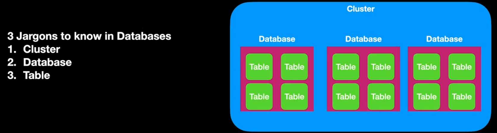

**You can see in the picture that from the users database we have connected one or more app thus saving the space**


> :warning: `mongoDB` is schemaless but `mongoose` makes it schema 

### **Defining Schema in database**
----------


Notice above `ref : course` also knwon as **Relationships in MongoDb** (This is the biggest advantage of NoSQL database, In SQL **there is a very ugly way to do this**) but in mongoDb, you can easily do this

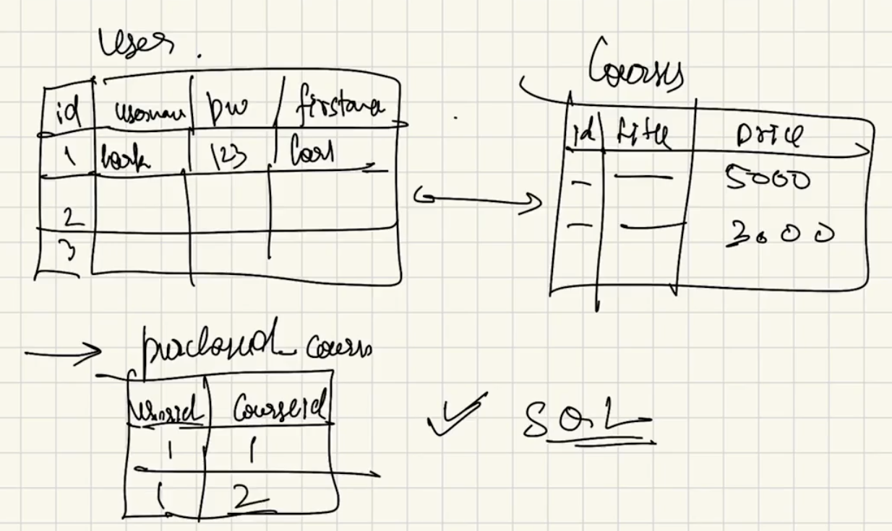

Notice for finding which user has bought which i have to make a whole other table called as `purchased_course` where corresponding to `user_id`, `course_id` exists (only 1 property `id` is enough to get all the info to the user) is stored

## **Sending data in MongoDB**
----------


Lets say you want add these things in MongoDB [Image](image.png)

The way to do that 

**Step 1 ->** Add the New database by clicking on the "+" icon in `compass` and then you will see something like this 

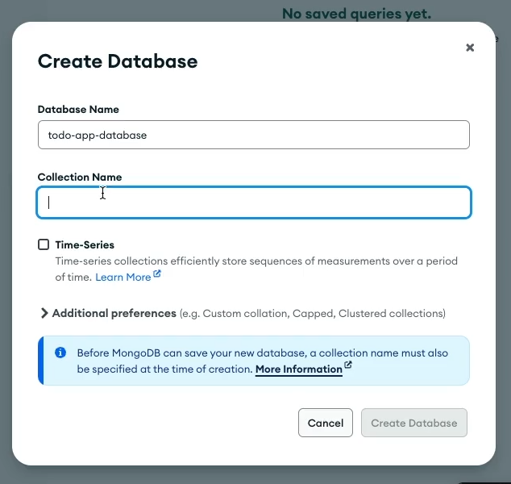

as we are making database for To-Do app so give the `Database name` -> `todo-app-database`

Now looking into the figure, we can clearly see it has two collections -> `users` and `Todo` so write them in in the `collection name` field

now **To add the data ->**

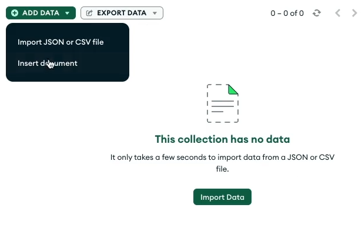

once you press insert document, you will see `id` (**auto - generated by the mongoDB**)

> :pushpin: **whenever you are in mongoDb,and you are creating a document, every document needs to have a UNIQUE ID**

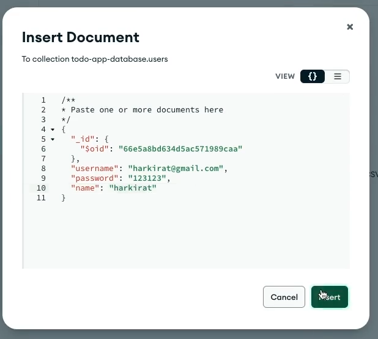

Manually **ADD** the data like the above in `users` collection for **1st user**

similarly for `todos` collection `ADDED` manually the data 

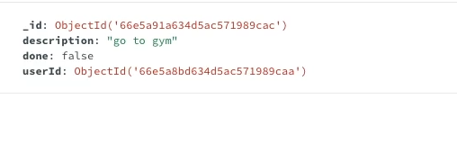

> :warning: Notice the userId it the of the one used in `users` collection for 1st user
>
> > Reason -> **Remember to have relation between the two or more collection you must have a userID UNIQUE which can be used to show relation between the two collection**
> >
> > > <span style="color:orange">**You can assume it a Primary key in MySQL**</span>


But we will not manually add when it comes to the full stack data this is the difference

## **CRUD Operations**
----------


CRUD operations in MongoDB refers to the basic operations you can perform on documents within a MongoDB database. CRUD stands for :-

1. **Create ->** Adding new documents to the collection
2. **Read ->** Retrieving data from the collection
3. **Update ->** Modifying existing documents in a collection
4. **Delete ->** Removing documents from the collection

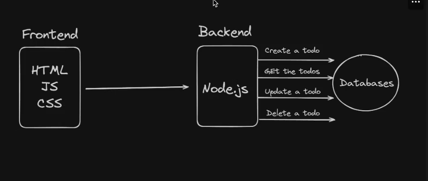

### **Create**

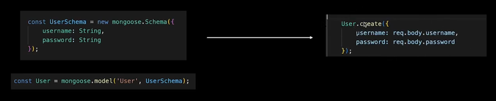

### **Read**

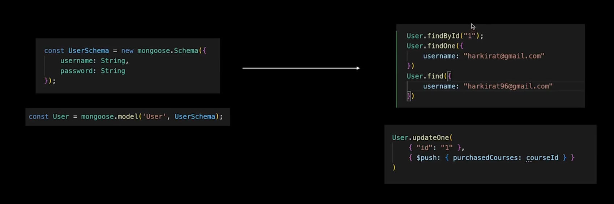

#### **Difference between `.find()` and `.findOne()`**

**`.findOne` ->** finds for <span style="color:orange">**ONE**</span> entry for that property (here `username`)

**`.find` ->** finds for <span style="color:orange">**ALL**</span> the entry for that property in the database (here `username`)

> :warning: **Remember** `.find` will <span style="color:orange">**Return something**</span> **Returns EMPTY ARRAY** if it does not `find` anything with the given thing in the Database, but `.findOne` will give <span style="color:orange">**ERROR**</span> if it does not find that **specific only data** in the database.
>
> > The above point is **Very - Very Important when comes to finding in the password** as while signing in, you will see that **after finding in the database**, You can only return **TOKEN** when the given username and password is valid, now in `.find` you will always recieve token [as response has came althought that is empty array but still response came, even though you have given wrong password] as it will return empty array (if it does not find that particular combination of password and username) and `jwt` considers as a response so it will **Generate token** but `.findOne` will find for that particular combination of password and username and if not present then return **error** which will hint `jwt` to **generate token** in this case and hence will not generate it  
> >
> > > So <span style="color:orange">**Always try to use `.findOne`**</span> especially when returning `jwt` token

There are many functions related to `find`

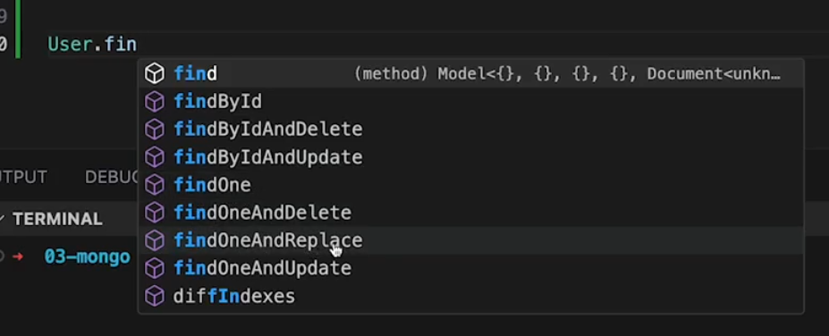

### **Update**

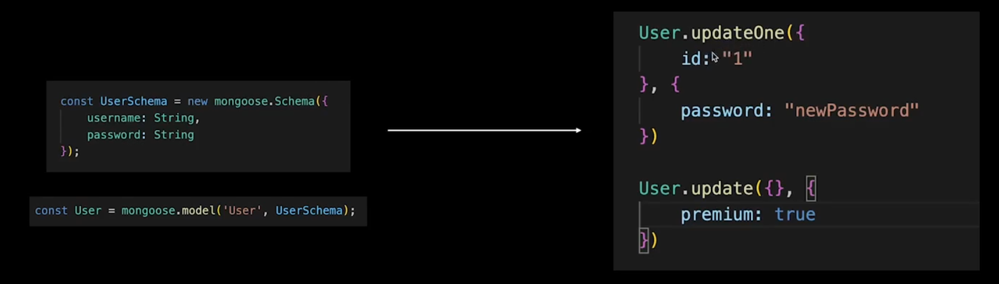

difference between `updateOne` and `update` is same as `find` and `findOne` and that is

see example :-

```javascript
User.update({}, {
    premium : true,
})
```
this will give the **ACCESS to the Premium to EVERY user present in the Database**

### **Delete**

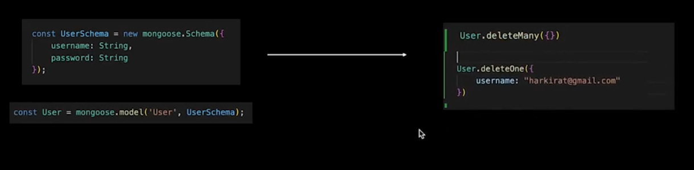

> :warning: `deleteMany({})` **will delete everything in the database SO NEVER USE IT**


## **Creating a backend of a ToDo app**
----------


Lets now create a `todo app` with the data being persisted in the `database`

Before going to actual project implementation first explore about `mongoose`

`mongoose` -> similar to `express.js`(used for creating http server), `mongoose` is a popular library to connect to the `MongoDB`

### **Installing the mongoose**

```javascript
const mongoose = require("mongoose")
OR
import mongoose from 'mongoose'
```

### **connecting to MongoDb**

```javascript
await mongoose.connect('mongoURI/database_name')

mongoURI -> the url mongoDb gave you to connect to the mongoDb
database_name -> which database you want to connect to ??
```
### **Defining a model**

show me how you model / schema looks like

```javascript
const Schema = mongoose.Schema
const ObjectId = mongoose.ObjectId

const BlogPost = new Schema({
    author : ObjectId,
    title : String, 
    body : String,
    date : Date
});

What data are you trying to put in the database ??
```

coming back to the creation of backend of a todo app

**Step 1 ->**

initialise a new node.js project

**Step 2 ->** Install dependencies

```javascript
npm install express mongoose
```

**Step 3 ->** create 4 skeleton for 4 routes in `index.js` made

+ POST / **signup**
+ POST / **Login**
+ POST / **todo (authenticated)**
+ GET / **todos (authenticated)**

```javascript
app.post("/signup", (req, res) => {
    
})

app.post("/login", (req, res) => {

})

app.post("/todo", (req, res) => { // to create the todo

})

app.get("/todos", (req, res) => { // get all the todos of the user 

})
```

**Step 4 ->** Add the database logic in the seperate file (name it as `db.js`)

`Database` has mainly **2 Parts** ->

- **Schema** -> Structure of the table
- **Model** -> where it belongs to ??

-> you could have put all the database logic in `index.js` but to **Structure our file system** it is advised to do like this

now in `db.js`

```javascript
const mongoose = require("mongoose")
```
**Step 5 ->** start creating the **schema** of your table in the file `db.js`

```javascript
const mongoose = require("mongoose")
const Schema = mongoose.Schema; // mongoose exports the CLASS called Schema that defines the schema of the user
const ObjectId = mongoose.ObjectId; // To import ObjectId from mongoose

// defining the user schema (means user table me KYA JAYEGA with their datatype ??)

const User = new Schema({
    email : String, // easy version of the email
    email : {type : String, unique : true}, // hard verion with the check that email should be UNIQUE
    password : String,
    name : String
})

// similarly defining the todo schema (means todo table me KYA JAYEGA)

const Todo = new Schema({
    userId : ObjectId, // userId was not String type it was of ObjectId type
    title : String,
    done : Boolean
})

const UserModel = mongoose.model('users', User); // 2
const TodoModel = mongoose.model("todos", Todo);

module.exports = { // 3
    UserModel,
    TodoModel
}
```
**Explanation of `// 2` code**

Now eventually you want some functions that help me to do `CRUD` operations in the database via the `index.js`

for this we use
#### **about `mongoose.model()`**

-> <span style="color:orange">**helps to insert data in a particular collection with particular schema**</span>

takes **2 arguments**
1. **Where the data is to be stored ??**
    + in our case, it should be in `users` collection
2. **and What schema does the data should follow to be able to save in this ??**
    + in our case, it should follow schema defined in `User` variable

:bulb: **We studied above that mongoDb is Schemaless yet we are defining the schema, Why ??**

**Reason ->** if we have used `mongodb` library then there we may have inserted any type of data but here we are using `mongoose` which pushes you to **give the schema** that's why we are defining the schema. 

**Also  `mongoose` also allow you to put some random data in it but it urges you to put data in Schema form so that its library can be best used**

> :pushpin: `mongoDb` is still schemaless we are <span style="color:orange">**trying to decrease the chance of getting the `node.js` error or other error by defining STRICT schema through `mongoose`**</span>

**Explanation of `// 3` code**

Now as we are working with the **seperate files** so to make them use **Interchangibly** <span style="color:orange">**One must export them**</span> and thats how you use them in another file

**To import it in the `index.js`**

```javascript
const { UserModel, TodoModel } = require("./db")
```

**Step 6 ->** Implement the `sign up` function

```javascript
app.post("/signup", async (req, res) => {
    const email = req.body.email
    const password = req.body.password
    const username = req.body.username

    await UserModel.create({ // 2
        email : email,
        password : password,
        name : username,
    })

    res.json({
        message : " You are signed up "
    })  
})
```

**Explanation of `// 2` code**

#### __about `Model.create()` (do the CREATE part of the db)__

-> <span style="color:orange">**helps to Insert the data into the database in a particular schema**</span>

> :bulb: **Why you used async await ??**
>
> > **Reason ->** <span style="color:orange">**Always Remember Database is in another country it will take some time**</span>
> >
> > > as `await` was used lead to the use of `async`

**Step 7 ->** Implement the `login` function

```javascript
app.post("/login", async (req, res) => {
    const email = req.body.email
    const password = req.body.password

    // previosuly when using the array to store, we were finding whether the user exists or not using the inbuilt find() function or loop 
    const user = await UserModel.find({ // 2
        email : email,
        password : password
    })

    // again the same part as Authentication if the user is found in the database then Generate a TOKEN
    if(user){
        const token = jwt.sign({
            id : user._id // previosuly we were using username as way to create token but now as ID is the most unique thing which exists in the db so used that
            // Notice i have written ._id not .id as if you see in the collection any document (._id) {auto generated by the mongoDb} is the way to identify the user
        }, JWT_SECRET)
        res.status(200).json({
            token : token,
            message : "You are logged In"
        })
        
    }else{
        res.status(403).json({
            message : "Incorrect Credentials",
        })
    }
})
```

**Explanation of `// 2` code**

#### **about `Model.find()` (do the READ part of db)**

Insert as many as you want in `json` format and it will return only if all the fields given in `json` format **matches with any user**

-> also as we are fetching something fromt the database and it is very far so it will take time **hence wrap it in async and await**

> :warning: Dont use `Model.find()` as see in this file only difference between `.find()` and `.findOne()` and **Why you should use always `.findOne()`**

#### **Very Very Important point**

You also have to connect to the database as your code does not know **Where you mongoDb database is ??**

so for that add this in `index.js`

```javascript
mongoose.connect(mongoURI/database_name)
```
here database_name is "todo-app-database" see this pic -> [image 2](image-1.png)

> :pushpin: Even if you give the wrong database name, It will **make a new Database with this name and enter the data there**

#### **about `Model.update()`(do the UPDATE part of db)**

> :warning: again you should use `.updateOne()` instead of using `.update()` **Reason behind it is same as that in `.find()` and `.findOne()`**

`.updateOne()` takes 3 arguments as paramter :-

1. **filter ->** kaun si **ROW** ko change krna chahte ho  or simply saying **Kahan pe jake change krna h ??**
2. **change ->** **Kya kya field change krna h ??**
3. **options ->** **Read it by yourself although not important**

for example :-

```javascript
const uptitle = req.body.title
const updescription = req.body.description
const upprice = req.body.price
const upimageUrl = req.body.imageUrl
const upcourseId = req.body.courseId

const course = await CourseModel.updateOne({
    _id : courseId // jahan par db me _id ka value courseId se match kr jaye
}, {
    title : uptitle // wahan par ke ye sb field me naye jo up se start hote h jo user se liya h wo daal ya naye wale se change kr do
    description : updescription,
    imageUrl : upimageUrl,
    price : upprice
}) // There should be 3rd argument but generally it is not required
```

> :warning: again you should use `.updateOne()` instead of using `.update()` **Reason behind it is same as that in `.find()` and `.findOne()`**

**Step 8 ->** for the next two routes we need to apply **Authentication** as those who have `signup` and `login` they should only have **access to create the todo or read it**

so implementing the **Auth Middleware** for the above case

```javascript
function authMiddleware(req, res, next){
    const token = req.headers.token;

    const decodedData = jwt.verify(token, JWT_SECRET);

    if(decodedData){
        req.userId = decodedData.id; // id present inside the token passed to the other function that this is the id of the user whom something they want to do
        next()
    }else{
        res.status(403).json({
            message : "Incorrect Credentials or Secret Key",
        })
    }
}
```
**Step 9 ->** Implement the `todo` route

```javascript
app.post("/todo", authMiddleware,async(req, res) => {
    const userId = req.userId;
    const title = req.body.title;
    const done = req.body.done;
    await TodoModel.create({
        userId,
        title,
        done
    })

    res.json({
        message : "To Do created"
    })

})
```

**Step 9 ->** Implement the `todos` route

```javascript
app.get("/todos",authMiddleware, async (req, res) => {
    const userId = req.userId;
    const todothing = await TodoModel.find({
        userId
    })

    res.json({
        todothing : todothing,
    })

})
```
The whole code is also present on the Week 7 folder see the link at the TOP of this file 

### **Improvements which can be made in the above project**

1. Password is not hashed
2. A single crash (duplicate email) crashes the whole app
3. Add more endpoints (mark todos as done)
4. Add timestamps at which todo was created / the time it needs to be done by
5. Relationships in mongo
6. Add validations to ensure email and password are correct form

# **Passwords and ZOD**

#### **Need for Password Hashing**

The main reason for password hashing is that if you store the password in plain text in the database 
- **then anyone can relate to the password and can use it to get the user id and password**
- **If database gets leaked then everyone plain text data will get leaked to the whole world**
- some companies database has been hacked -> BigBasket, Paytm, Unacademy


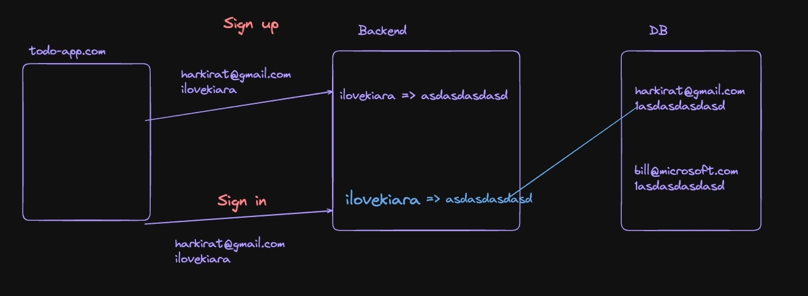

When `sign up` 
- before storing in the database, backend will `HASH` the password and then this `hashed password` gets stored in the database. 

Now :bulb: **How will the password is again matched??**

as you have `hashed` the password but the user does not know, he / she will send you the password in plain text only while `sign in` then **How will you match ??** -> By using the <span style="color:orange">**same algorithm used while hashing again**</span> apply that same algorithm again and then match (as the password will now change to hashed password) [Compare then with that stored in the password]

BUT 

**Again here is Problem can you guess ??**

see the figure above You can see that the `hashed password` of `harkirat@gmail.com` & `bill@microsoft.com` in the **Database** are **SAME** what does this means -> **It simply means that BOTH have kept same password** so if one knows the password of `harkirat@gmail.com` then he / she will also be able to know the other person `bill@microsoft.com` and many other accounts password.

**To solve the above problem**

we do **Salting**

### **Salting**

When you have a very big amount of Sabji being prepared, You add **very small amount of salt at regular interval**

In context of the above, salting in password means

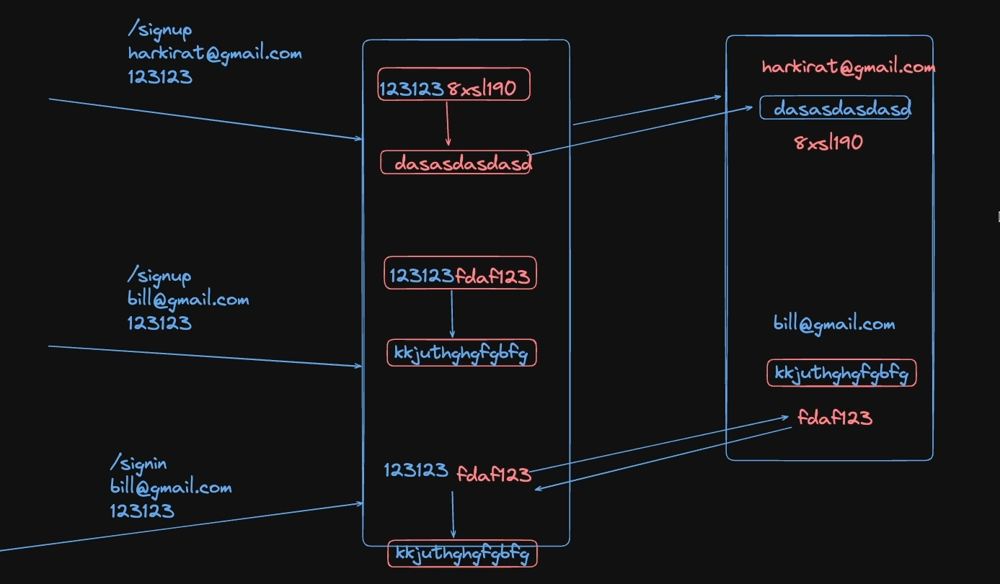

when someone will come up to `sign up` the user (harkirat@gmail.com) will give some password (123123) now <span style="color:orange">**i will add one more thing with it known as SALT**</span>

> :pushpin: `salt` is **basically randomally generated strings**

And the mixture of `password + salt` will be now `HASHED` and in the Database we will now store

- **Hashed password**
- **Salt (but in plane text)**

Now if another user comes like bill@microsoft.com and keeps the same password (123123) due to the **salt** (as randomly generated), the mixture of these when `hashed` will be **different** from those **generated while** harkirat@gmail.com and now when this password will be stored in the database with the salt. 

**Even though if someone sees the password he / she will see two different password for the two users (although they have kept same password)**

:bulb: **How will the `sign in` process work for the above thing ??**

while signing in, the backend will first take out the `salt` from the corresponding the user trying to login and then it willl add with the given password while signing in with `salt` and then again run the **hashing algorithm and match with that present in the database**

You can see the above figure used

:bulb: **How to implement the above logic ??**

You can do it by yourself by

- for `hashing` -> use common algorithms such as `SHA-256` or any other 
- for `salting` -> you know how to generate the random string using `js` (its up to your logic how to generate that)

OR 

use a libraray known as `bcrypt`

## **Hashing Password**
----------


This is the solution to the **1st Improvement** of the ones written in [**Improvements which can be made in the above project**](#improvements-which-can-be-made-in-the-above-project)

:bulb: **Why should you use hash passwords ??**

Password hashing is a technique used to securely store passwords in a way that makes them difficult to recover or misuse. Instead of storing the actual password, you have a hashed version of it 

## **about `bcrypt`**
----------


**Bcrypt ->** It is a `cryptographic hashing algorithm` designed for securely hashing passwords. Developed by Neils Provos and David Mazieres in 1999, `bcrypt` incorporates a `salt` and is designed to be computationally expensive, making brute-force approach **TOUGHER**

#### **Installing it**  

```javascript
npm install bcrypt
```

go to the library of it as it will be helpful -> [Bcrypt](https://www.npmjs.com/package/bcrypt)

#### **Using it**

```javascript
const bcrypt = require("bcrypt")
```

Now to use it, it have some defined functions to generate the string

**Technique 1 ->** (Generate a salt and hash on seperate function calls)

```javascript
bcrypt.genSalt(saltRounds, function(err, salt) {
    bcrypt.hash(myPlaintextPassword, salt, function(err, hash) {
        // Store hash in your password DB.
    });
});
```

### **about `bcrypt.gensalt()`**

**syntax is similar to the `fs.readfile()`**

takes 2 Arguments :-

1. **saltRounds ->** Its actually the variable name (you can take it anything) which has some `number`. **Higher the value of this variable higher times the hashing will occur to generate the salts**
    + `k` saltrounds undergo `2^k` iteration to generate salt
  
> :pushpin: **Ideally take it min - 3 and max - 15**
2. **Callback function ->** again takes 2 parameter as input :-
    + `err` -> what to do if `error` occurs ??
    + `salt` -> `salt` generated by the function to hash password

### **about `bcrypt.hash()`**

-> used to **Hash the password**

takes 3 arguments (its common sense to guess these 3) :-

1. **Password (in plain text)** -> password bhejo plain text me as for `hashing`, you first need password
2. **salt** -> you have to add the salt also with the password and then only `hash` at last
3. **callback function** -> What are you going to do after the password is hashed ??

**Technique 2 ->** auto-gen a salt and then hash (**BETTER ONE**) [ <span style="color:orange">**Promisified version of the above technique**</span>]

```javascript
bcrypt.hash(myPlaintextPassword, saltRounds, function(err, hash) { // 1
    // Store hash in your password DB.
});

OR

const hashedPassword = await bcrypt.hash(myPlaintextPassword, saltRounds) // 2
```
This is more cleaner way of writing the above code as here you dont have to **first generate the `salt` and then add it and then at last `hash` it**

You can all do this in the same function

__difference between__ both the function is that in one of them we have passed `salt` in `.hash()` as parameter and in other as `salt` is being auto-generated so just passed `saltRounds` (number of times the salt will be hashed continuously) as the parameer in `.hash()` function

you can also generate you own or write your own **function** to **generate** `salt`

**Explantion of `// 2` code**

we have just done the same thing as that done in `// 1` just here as `bcrypt.hash()` but instead of storing the output in `hash` and then **returning it** via the **callback function**, we are using a variable to **store the hashed password given as output**

> :warning: `bcrypt.hash()` returns a <span style="color:orange">**Promise**</span> so always use `await` here
>
> > also you are taking a certain number of rounds(`saltRounds`) to generate the `salt` which will **take time** that's also the main reason to put `await` here
> >
> > > If you make the second parameter = 0 (i.e. saltRounds = 0), then **no need to write `await` then**

now including it in the `index.js` made 

adding it in `"/signup"` endpoint

```javascript
const saltRounds = 10; // gave the number, It simply means how much computationally heavy you want your password to be (more is better but then takes a lot of time also then ideally -> 5, 10, 20 (max))

app.post("/signup", async (req, res) => {
    const email = req.body.email
    const password = req.body.password
    const username = req.body.username

    const hashedPassword = bcrypt.hash(password, saltRounds) // called bcrypt.hash() to hash "password" with "saltRounds" number of rounds

    await UserModel.create({
        email : email,
        password : hashedPassword, // Instead of storing directly the plain text password, we stored the hashedPassword we got by using the bcrypt.hash() in the database 
        name : username,
    })

    res.json({
        message : " You are signed up "
    })  
})
```

You will see the output as 

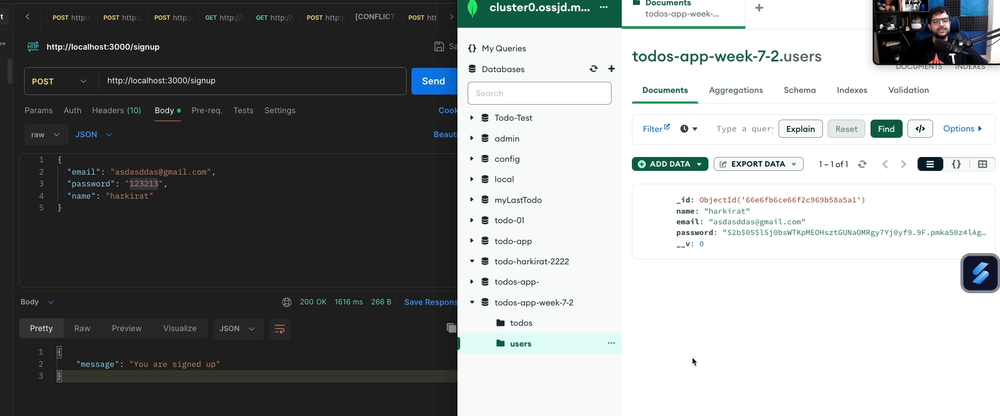

Notice the hashed password it is written in some format

- first _two_ -> `$2b` -> means **version of `bcrypt` you are using**
- next _two_ -> `$05` -> number of **iterations or saltRounds value**
- and then after this next _sixteen_ -> is the `salt`
- and then the _rest_ after this is your `password`.

You could have your `salt` independently stored in the database you can do that

Now making changes in the `"/login"` / `"signin"` endpoint

**here also two things can happen to verify ->**

1. Either you write your **custom logic** to match passwordwhich is like the below
    + **Step 1 ->** __extract__ the `salt` from the database
    + **Step 2 ->** then **Add it** with that(password) given by the user and then at last
    + **Step 3 ->** Implement the **hash** and then **Compare it** with that present in the database

OR

2. use function `bcrypt.compare()`

### **about `bcrypt.compare()`**

takes 2 arguments (its obvious -> jo user ne bhara h (internally isme upar ka process hua and then..)usko compare krega database me jo stored h)

- **value of variable for password in database**
- **value of variable given by the user at the time of sigin**

> :warning: `bcrypt.compare()` returns a **Promise** so you **always have to `await`**


```javascript
app.post("/login", async (req, res) => {
    const email = req.body.email
    const password = req.body.password // 1

    // hit the database to find out user so that .compare() can work as internally tbhi to ye salt extract kr payega
    const user = await UserModel.find({
        email : email,
        // password : password // no need of this line now as we are checking password by below method
    })

    if(!user){
        res.status(403).json({
            message : "User does not exist in the database",
        })
        return
    }

    // used bcrypt.compare() to verify
    const passwordMatch = await bcrypt.compare(password, user.password) 
    // password is what the user have now gave(value in // 1)
    // and
    // user.password is what in the database where our hashed password exists ??

    if(passwordMatch){
        const token = jwt.sign({
            id : user._id
        },JWT_SECRET)
        res.status(200).json({
            token : token,
            message : "You are logged In"
        })
        
    }else{
        res.status(403).json({
            message : "Incorrect Credentials",
        })
    }
})
```

## **Error Handling**
----------


This is the **2nd Improvement** of that written in [**Improvements which can be made in the above project**](#improvements-which-can-be-made-in-the-above-project)

Right now your server will crash if you sign up using duplicate email as you have written this line of code in your file 
```javascript
const User = new Schema({
    email : {type : String, unique : true}, // this line means that email should be unique
    password : String,
    name : String
})
```

:bulb: **How to avoid that ??**

Approach 1 -> **Try - catch**

> :pushpin: **If you know some part of your code is going to throw error, then you should wrap it in `try-catch`**

so using that in `index.js`

```javascript
app.post("/signup", async (req, res) => {
    const email = req.body.email
    const password = req.body.password
    const username = req.body.username
    try{ // put inside the try catch block
        const hashedPassword = bcrypt.hash(password, saltRounds)

        await UserModel.create({
            email : email,
            password : hashedPassword,
            name : username,
        });

    } catch(e) {
        console.log("User already exists")
    }
    res.json({
        message : " You are signed up "
    })  
})
```

But here is the problem now if you will start the server and again `sign up` using already registered email and password then it will although print the "User already exists" in the `console` but the server will show "You are signed up" as that is the `response`

So what if i do like this

```javascript
catch(e) {
        res.json({
            message : "User already exists",
        })
    }
    res.json({
        message : " You are signed up "
    })
```
again this will **crash** the server as 

> :warning: **You can send only <span style="color:orange">**ONE**</span> `res` or `response` per route**

so :bulb: **How to solve this ??**

There are many ways out of one is like this
```javascript
let errorThrown = false; // made a flag that will trigger only when something is satified

app.post("/signup", async (req, res) => {
    const email = req.body.email
    const password = req.body.password
    const username = req.body.username
    try{
        const hashedPassword = bcrypt.hash(password, saltRounds)

        await UserModel.create({
            email : email,
            password : hashedPassword,
            name : username,
        });

    } catch(e) {
        res.json({
            message : "User already exists",
        })
        errorThrown = true
    }
    
    if(!errorThrown){
        res.json({
            message : "You are signed up",
        })
    }
})
```
## **Input Validation** 
----------


This is the solution to 6th improvement in [**Improvements which can be made in the above project**](#improvements-which-can-be-made-in-the-above-project)

In **Typescript**, <span style="color:orange">**ZOD**</span> is a library used for schema validation and parsing. Its designed to help developers define, validate, and manage data structure in a type-safe manner

learn more about this library -> [ZOD](https://zod.dev/)

:bulb: **What is the need for the above part ??**

If you see your code then 

```javascript
app.post("/signup", async (req, res) => {
    const email = req.body.email // string 
    const password = req.body.password // string
    const username = req.body.username // string
```

You are expecting from the user that they will give you all these fields in the `String` format but **Should you trust the user when you are making you website ??**

-> <span style="color:orange">**NO**</span>, You should first check the INPUT FIELD that whether it is **Given according to the required input or not** or simply saying <span style="color:orange">**VALIDATE THE INPUT**</span>

some of the examples are 
- if `email` is being set -> it should be **string, contains "@", more than 5 letters**
- for `password` it should be -> **Minimum 8 characters, one Uppercase, One special character, etc..**

:bulb: **How to do the above ??**

**Approach 1 ->** Either write all thing by yourself (But you have to check a lot of things) like

```javascript
app.post("/signup", async (req, res) => {
    const email = req.body.email
    const password = req.body.password
    const username = req.body.username

    // Input validation (written by yourself)
    if(typeof email !== "string" || email.length < 5 || !email.includes("@")){
        res.json({
            message : "Email not as per the guidelines"
        })
        return
    }
    // similar to this you have to validate PASSWORD

    try{
        const hashedPassword = bcrypt.hash(password, saltRounds)

        await UserModel.create({
            email : email,
            password : hashedPassword,
            name : username,
        });
---------- continued in index.js
```
OR 

**Approach 2 ->** using External library <span style="color:orange">**ZOD**</span>

### **about `ZOD`**

#### **installing it**

```javascript
npm install zod
```
#### **Working with it**

:large_orange_diamond: **Always Remember this ->**

> :pushpin: `zod` is a library that is based on <span style="color:orange">**Schema validation approach**</span>

:bulb: **What is schema validation approach ??**

what we actually want to be look like our input 

something like the below

```javascript
req.body  should look like the below 

{
    email : string,
    password : string,
    name : string
}
```
when you know that `req.body` should look like this or **SCHEMA** like this you should first define it but before that `import` it 

```javascript
const { z } = require("zod");
```
**Step 1 ->** Defining the Schema of what your input field should look like and **what it should actually take as Input ??**

```javascript
app.post("/signup", async (req, res) => {

    // Defining the schema
    const requireBody = z.object({ // 2
        email : z.string().min(3).max(100).email(), 
        password : z.string().min(3).max(45),
        name : z.string()
    })

    const email = req.body.email
    const password = req.body.password
    const username = req.body.username
 
    try{
        const hashedPassword = bcrypt.hash(password, saltRounds)

        await UserModel.create({
            email : email,
            password : hashedPassword,
            name : username,
        });
---------- continued in index.js
```
Explanation of `// 2` code 

as we have to make `zod` be used as <span style="color:orange">**OBJECT**</span> so thats why used `.object` and then inside it we have defined the schema of the input field that what it shold take in the **Input field**

- `.string()` checks for the `string` datatype
- `.min()` checks that this much character **MUST** be there
- `.max()` checks that this is **LIMIT** for inserting the character
- `.email()` checks that if it is **EMAIL** or not (i.e consists of "@" symbol or not )

:large_orange_diamond: **You can similarly add hell lot of other checks**

**Step 2 ->** Parsing the Data or using the above made schema to validate or simply saying **To validate the input**

for this we use two approaches 
- `.parse()`
- `.safeParse()`

:warning: <span style="color:orange">**Remember**</span> Both have Differences ( to be discussed later)

but now using them 

```javascript
app.post("/signup", async (req, res) => {

    // Defining the schema
    const requireBody = z.object({ // 2
        email : z.string().min(3).max(100).email(), 
        password : z.string().min(3).max(45),
        name : z.string()
    })

    // Parsing the schema is Step 2
    // const parsedData = requireBody.parse(req.body); // Ignore this approach for now
    const parsedDataWithSuccess = requireBody.safeParse(req.body);

    if(!parsedDataWithSuccess.success){ // If the success is not true then input is not valid
        res.json({
            message : "Incorrect format",
        })
        return
    }

    // If the above all thing occured correctly then only proceed to store the Input in the different Variables

    const email = req.body.email
    const password = req.body.password
    const username = req.body.username
 
    try{
        const hashedPassword = bcrypt.hash(password, saltRounds)

        await UserModel.create({
            email : email,
            password : hashedPassword,
            name : username,
        });
---------- continued in index.js
```

### **about `.safeParse()`**

takes 1 parameter as Input
- **Input** (kahan se input aayega ya lena h??)

**Returns 3 things inside 1 OBJECTS**
- **success** -> means the validation went correct **No problem**
- **data**  -> the output it recieved after validation
- **error** -> what is the problem because of which it did not worked ??

looks something like this 
```javascript
{
    success : true | false,
    data : {your data},
    error : []
}
```

thats why used `parsedDataWithSuccess`**`.success`** (as to access the `Object` key we use __`.`__)

Now the only thing left is to <span style="color:orange">**make the user see what is the mistake they have made ??**</span> i.e. here we are just sending one type of message and that is -> __"Incorrect foramt"__ even though they are making mistake in any of the three field given (`email, password, name`)

for this we will use **`.error`** **which gets returned by `.safeParse`**
so just add this section

```javascript
app.post("/signup", async (req, res) => {

    const requireBody = z.object({ 
        email : z.string().min(3).max(100).email(), 
        password : z.string().min(3).max(45),
        name : z.string()
    })
    const parsedDataWithSuccess = requireBody.safeParse(req.body);

    if(!parsedDataWithSuccess.success){ // If the success is not true then input is not valid
        res.json({
            message : "Incorrect format",
            error : parsedDataWithSuccess.error, // add this line to make the user know in which input field they made mistake
        })
        return
    }

-------------- continue in index.js
```
This will give something like this 

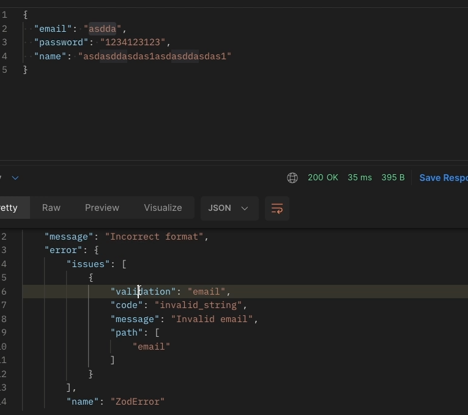

You can see it gave error on the `email` section as you have given wrong `email`(see the email field -> given is "asdaa") and even gave some of the insights to it also similarly if you give password also wrong then **You will get TWO error** and so on

**Just show this on the FRONTEND**

Now coming to other way used to parse the data or validate the data schema using zod

### **about `.parse()`**

The problem with this is 
- **Either it will return the data** if everything is correct
- **Or will throw the error** It will **STOP** the execution
    + so <span style="color:orange">**You must have to put it inside the `TRY-CATCH` block**</span> while using it

Thats why its better to use `.safeParse` as it does not throws `error`, it return the `success` that **Whether it is TRUE or FALSE**

> :pushpin: `.safeParse()` as the name suggest it <span style="color:orange">**SAFELY PARSE IT**</span>

#### **Assignment**

Further improving the validation point 

:bulb: **Lets suppose now in the password you have to fufill this much critera now in the `password` section**
- **at least 2 Uppercase character**
- **at least 1 lowercase character**
- **at least 3 special character**

**Then How will you do this by using `zod` ??**

for this we use `.regex()`. just as we used `.min(min_length)`, `.max(max_length)` and `.email(email_format_check)` we also have `.regex()` 

#### **about `.regex()`**

`.regex()` also known as <span style="color:orange">**REGULAR EXPRESSION**</span>

solving the above problem and then understanding what is  the syntax of `.regex()` and how it works

we need the below thing to be inserted in the password
- **at least 2 Uppercase character**
- **at least 1 lowercase character**
- **at least 3 special character**

so 
```javascript
const requireBody = z.object({ 
        email : z.string().min(3).max(100).email(), 
        password : z.string().min(3).max(45), // instead of this now write this

        password : z.string().min(3).max(45).regex(
  /^(?=(?:.[A-Z]){2,})(?=(?:.[a-z]){1,})(?=(?:.*[^a-zA-Z0-9]){2,})/) // 2


        name : z.string()
})
```

Explanation of `// 2` code  

__`/...../`__ -> known as **Regex Literal** (Everything should be <span style="color:orange">**Inside this**</span>)

__`^`__ -> Anchors the pattern to the **start of string**

__`(?=(?:.*[A-Z]){2,})`__ -> represents condition **at least 2 uppercase letters**
+ further explaining its subpart
    + __`(?=...)`__ -> known as **Positive Lookahead ->** means "What follows should must have this sub-pattern (... one)
    + __`(?:...)`__ -> known as **Non - capturing group ->** means space for group logic
    + __`.*[A-Z]`__ -> Any characters (represented by __`.*`__) between uppercase A-Z
    + __`{2,}`__ -> This entire(the above one) must happen **At least 2 timees** you can also give **At most times** in the space after `2,here you can give max`

**`(?=(?:.*[a-z]){1,})`** -> same as the above just here you are defining that **At least** one should be between lowercase (a-z) this range

similarly

**`(?=(?:.*[^a-zA-Z0-9]){2,})`** -> same as the above but here the part
+ **`^a-zA-Z0-9`** -> means __`^`__ **NOT** means take anything BUT dont take these -> `a-z`(lowercase) or `A-z`(uppercase) or `0-9`(Numbers) Indirectly <span style="color:orange">**Take only special character**</span>


