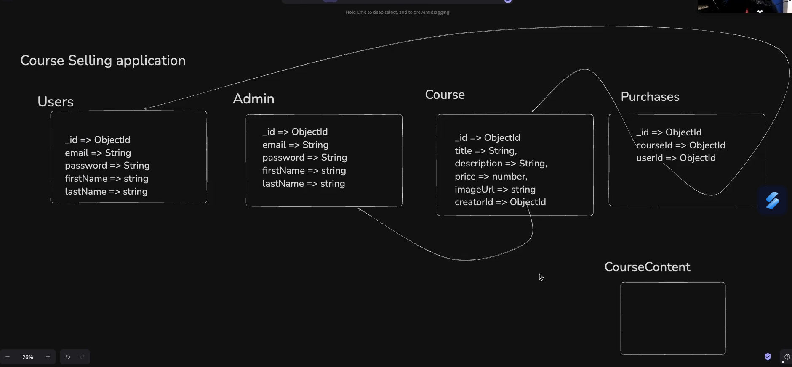
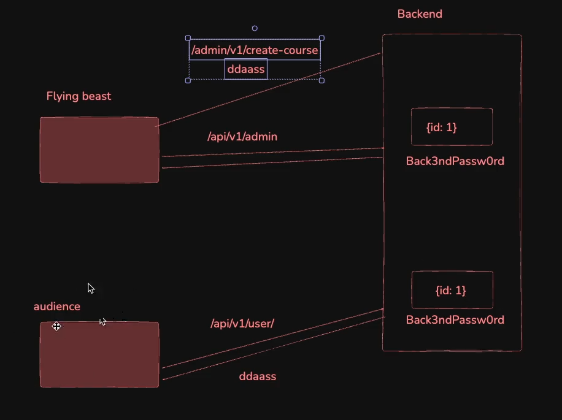
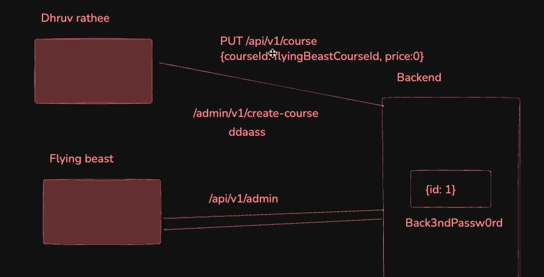

# **Building a course selling app**

- [**Building a course selling app**](#building-a-course-selling-app)
  - [**What are we building and steps to tackle this problem statement**](#what-are-we-building-and-steps-to-tackle-this-problem-statement)
  - [**Project Starts**](#project-starts)
    - [**Step 1 -\>** Add Express, JSON web token as a dependency](#step-1---add-express-json-web-token-as-a-dependency)
    - [**Step 2 -\>** Add route skeleton to user login, signup, purchase a course, see purchased course, see all course](#step-2---add-route-skeleton-to-user-login-signup-purchase-a-course-see-purchased-course-see-all-course)
  - [**Routing in Express**](#routing-in-express)
    - [**about `app.use()`**](#about-appuse)
    - [**Step 3 -\>** Add routes skeleton for admin login, admin signup, create a course, delete a course, add course content](#step-3---add-routes-skeleton-for-admin-login-admin-signup-create-a-course-delete-a-course-add-course-content)
    - [**Step 4 -\>** Define the schema  for user, admin, course, purchase](#step-4---define-the-schema--for-user-admin-course-purchase)
    - [**Example of OPEN SOURCE site which is similar to what we are building**](#example-of-open-source-site-which-is-similar-to-what-we-are-building)
  - [**Logic part implementation starts**](#logic-part-implementation-starts)
    - [**Why `admin` and `user` should have different `JWT_SECRET` ??**](#why-admin-and-user-should-have-different-jwt_secret-)
    - [**Step 5 -\>** Add middleware for user and admin auth](#step-5---add-middleware-for-user-and-admin-auth)
    - [**Circular Dependency**](#circular-dependency)
    - [**about `.env` file**](#about-env-file)
      - [**How to use `.env` variables in the codebase**](#how-to-use-env-variables-in-the-codebase)
      - [**Extra thing while using some package to store the secret as `dotenv`**](#extra-thing-while-using-some-package-to-store-the-secret-as-dotenv)


## **What are we building and steps to tackle this problem statement**

- Initialize a new node.js project
- Add Express, JSON web token as a dependency
- Create index.js
- Add route skeleton for user login, user signup, purchase a course, see course
- Add routes skeleton for admin login, admin signup, create a course, delete a course, add course content
- Define the schema  for user, admin, course, purchase
- Add a database(mongodb), use dotenv to store the database connnection string
- Add middleware for user and admin auth
- Complete the routes for userlogin, signup, purchase a course, see course (Extra points -> use express routing to better structure your routes)
- Create the frontend

## **Project Starts**

### **Step 1 ->** Add Express, JSON web token as a dependency

```javascript
npm install express jsonwebtoken mongoose
```

### **Step 2 ->** Add route skeleton to user login, signup, purchase a course, see purchased course, see all course

```javascript
app.post("/user/signup", (req, res) => {


})

app.post("/user/login", (req, res) => {
    
})

app.get("/user/purchases", (req, res) => {

})

app.post("/course/purchase", (req, res) => {

})

app.get("/course/preview", (req, res) => {

})
```

:bulb: **What is the Ugly thing of the above code ??**

-> The whole file is getting messed up, **in short -> There are too much line of code in a single code file** In short, `index.js` file bahut bda ho jayega

But in Reality we can easify the things by using <span style="color:orange">**Routing in Express**</span>

## **Routing in Express**

Just consider the above example shouldnt it be better if we make a seperate file called as `user.js` for all the `user/` endpoint

similarly

for all the `course/` endpoint make a seperate file named as `course.js`

This is where **Routing in Express** comes in picture

**Although there are ugly ways to do this**

like cut all the `user/` endpoint and paste it in `user.js` file

```javascript
function crateUserRoutes(app) {  // First wrap it in function
    app.post("/user/signup", (req, res) => {

    })

    app.post("/user/login", (req, res) => {
        
    })

    app.get("/user/purchases", (req, res) => {

    })
    
}

module.export = { // Then export it 
    crateUserRoutes : crateUserRoutes
}
```

Now __import__ in `index.js` using the line

```javascript
const { crateUserRoutes } = require("./user");
```

and then **simply call this** using this line in `index.js`

```javascript
crateUserRoutes(app);
```

similarly you can do for other endpoint (`course`) in `course.js`

```javascript
function createCourseRoutes(app){
    app.post("/course/purchase", (req, res) => {

    })

    app.get("/course/preview", (req, res) => {

    })
}

module.exports = {
    createCourseRoutes : createCourseRoutes
}
```

and again in the `index.js` **first import this**

```javascript
const { createCourseRoutes } = require("./course")
```
and then **call this function**

```javascript
createCourseRoutes(app);
```

:large_orange_diamond: of all to further **Manage them** <span style="color:orange">**You should keep all the `routes` in one single folder**</span> named as `routes` 

while doing this 

:warning: **Dont forget to change the path to `"./routes/..` while importing in the `index.js`**, although `vs code` does it itself
 
and that how you can do structuring of routes

But 

There is a better way to do this

**Express gives you some very good stuff to easify things**

### **about `app.use()`**
----------

in `index.js` writing this line

```javascript
app.use("/user", userRouter)
app.use("/course", courseRouter)
```

By just seeing the above code, i can tell at one go that `./user` is <span style="color:orange">**USING**</span> this `userRouter` to handle its routes and similarly for `./course` **It looks much cleaner**

:bulb: **Explanation of the above code**

Anything that will comes at first `./user/ANYTHING` route will go to the `./user` and then searches for `ANYTHING` it will be __forwaded / Routed__ to `userRouter` and here it will see `/ANYTHING` endpoint so **Now you dont have to write `./user/signup` or others like this in the seperate file just write the `/signup` and it will come to this**

Changing the code using the above concept

in `user.js`

now write this

```javascript
const express = require("express")
const Router = express.Router 

OR 

const { Router } = require("express")  // Both do the same thing
```

now as we have used a function (`Router` is a function) so you have to **call it also**

```javascript
const userRouter = Router(); // The variable used in app.use()
```

now as we are not **Exporting app here** so change the request starting point also

and hence **the final code looks like this**

```javascript
const { Router } = require("express")

const userRouter = Router();

userRouter.post("/user/signup", (req, res) => {

})

userRouter.post("/user/login", (req, res) => {
        
})

userRouter.get("/user/purchases", (req, res) => {

})
    
module.export = { // Then export it 
    userRouter : userRouter
}
```

now just **Import it** in `index.js`

```javascript
const { userRouter } = require("./routes/user")
```

and to use it just write in `index.js`

```javascript
app.use("/user", userRouter);
```

similarly handle the `courseRouter` and make changes in `course.js`

**Biggest benefit of the above approach**

```javascript
app.use("/api/v1/user", userRouter)
```
**Any request coming to `/api/v1/user` will FORWARDED to `userRouter`** and so on and now you <span style="color:orange">**dont have to individually change the PREFIX and add `api/v1/user` at every route present in some other file**</span>

**"Tm ek jagah change kro, sb jagah ho jayega"**

:bulb: **what does the `/api/v1/user` means ??**

-> It is used in **Industry** to <span style="color:orange">**deliver the content Smoothly**</span>. This simply means that while `v1` (**Version 1**) is working some other team will make `/api/v2/user` route and you can **Upgrade your feature for user without effecting the main code which is in `/api/v1/user`** and that how the versioning helps.

now just look at the `index.js`  -> How much it is looking cleaner now ??

### **Step 3 ->** Add routes skeleton for admin login, admin signup, create a course, delete a course, add course content

Based on all of the above learning do the same thing for creating another Route for ADMIN

1. introduce a new Route handler

```javascript
app.use("/admin", adminRouter)
```
2. made a new file with name `admin.js` inside **routes** folder
3. add two routes (`signup` and `login`) using `adminRouter` 

Now here comes the **Important Point** i have to make some more routes if you will see the **Step 3**

- create a course
- update the course / add the course content
- see the course he / she has made
- delete the course

Now here you can think that i will make these inside `courseRouter` as they are **related to course** and **YOU CAN DO THIS** its perfectly good but if you really want to give these thing **Access to ONLY ADMINS** then you should make these inside `adminRouter` that will make things more simpler

so using the above concept the final skeleton of `admin.js`

```javascript
const { Router } = require("express")

const adminRouter = Router()

adminRouter.post("/signup", (req, res) => {
    
})

adminRouter.post("/login", (req, res) => {

})

adminRouter.post("/create", (req, res) => {
    
})

adminRouter.put("/course", (req, res) => {

})

adminRouter.get("/course/bulk", (req, res) => { // to see the course admin has created

})

adminRouter.delete("/remove", (req, res) => {

})

module.exports = {
    adminRouter : adminRouter
}
```

now **import it** in `index.js`

```javascript
const { adminRouter } = require("./routes/admin")
```
and then to **use it** you know

```javascript
app.use("/admin", adminRouter)
```

### **Step 4 ->** Define the schema  for user, admin, course, purchase

Now comes the Complex part ( **How your database will look like ??**)

The first thing you should do is understand what each schema is doing (**Very helpful to determine the RELATION**)

- **User ->** to store the users information
- **Admin ->** to store the admin info.
- **Course ->** all the courses that have been created
- **Purchases ->** store all the purchase user has made

Now based on the **characteristics** of every components we can deduce some relation at first

1. **Admin will put entries to the courses table**    
2. **User will put entries in the purchases table**  

Your database should look like this



Improvements which can be made but not making here
- Add `address` of user also in the `user` table but that is generally used in govt. sites
- A **Course Content** Table which has the purpose that if a `user` purchases a course it should see its course in **which format**
    - example -> It must has some set of schema like -> 1st image will load up then it consists of video, then some part for Notes (text format), tests, assignments etc..
- There are endless creativity to make your db look simpler and easier to access its all up to you

Notice the **Arrow** It shows the **Relations** 

if you have made the schema then time to write the schema

make a seperate file `db.js`

```javascript
const mongoose = require("mongoose")
mongoose.connect("") // give mongo URI

const ObjectId = mongoose.ObjectId;
const Schema = mongoose.Schema

const userSchema = new Schema({
    email : {type : String, unique : true},
    password : String,
    firstName : String,
    lastName : String,
});

const courseSchema = new Schema({
    title : String,
    description : String,
    price : Number,
    imageUrl : String,
    creatorId : ObjectId
})

const adminSchema = new Schema({
    email : {type : String, unique : true},
    password : String,
    firstName : String,
    lastName : String,
})

const purchaseSchema = new Schema({
    courseId : ObjectId, // 2
    userId : ObjectId, // 3
})

const UserModel = mongoose.model("user", userSchema)
const AdminModel = mongoose.model("admin", adminSchema)
const CourseModel = mongoose.model("course", courseSchema)
const PurchaseModel = mongoose.model("purchase", purchaseSchema)


module.exports = {
    UserModel,
    AdminModel,
    CourseModel,
    PurchaseModel
}
```

You also have to individually `import` them to **their respective file made for them**
- AdminModel in `admin.js`
- CourseModel in `course.js`
- UserModel in `user.js`

so in `admin.js`

```javascript
const { AdminModel } = require("../db")
```

The above `db` schema made in `db.js` is __not__ the best you can make. You can still **Optimise it** by passing <span style="color:orange">**References**</span> to the database
- for example -> at `// 2` and `// 3`, You should be referencing to `courseId` to `adminSchema` and `userId` to `userSchema`

But before you start to push the data in the database, **You should keep one thing in mind**

:large_blue_diamond: **`mongoose.connect()` will TAKE SOME TIME to connect to the Database (Remember the line -> Database is in other country)** so You have to make it <span style="color:orange">**await**</span>

- as `await` aaya h to `async` function ke andar to wrap krna pdega na

so inside `index.js`

```javascript
const express = require("express")
const jwt = require("jsonwebtoken")
const mongoose = require("mongoose")
const { userRouter } = require("./routes/user")
const { courseRouter } = require("./routes/course")
const { adminRouter } = require("./routes/admin")

const app = express()
const JWT_SECRET = "satyamisgreat"

app.use(express.json)

app.use("/user", userRouter)
app.use("/admin", adminRouter)
app.use("/course", courseRouter)


// Before listening to the port or simply saying app.listen() line to be executed you should await to the mongoose.connect() line

async function main(){
    await mongoose.connect("/// Mongo URI ///")
    app.listen(3000)
}

main()
```

**Advantage of wrapping it in function main()**

-> This is very important as it will provide you these things :
- **If your connection to database has not started, then YOUR BACKEND WILL NOT START ALSO EVEN**
    - connection to database can FAIL due to many reason like -> Incorrect Password in mongoURI, took much time etc..


### **Example of OPEN SOURCE site which is similar to what we are building**

The one which we are building is very similar to this open source project

[P5.js Web editor](http://github.com/processing/p5.js-web-editor)

once you have gone to this now no need to feel overwhelm

just go to `server.js` if you can somewhat understand then also its good (**means your backend logic is going in good direction**)

## **Logic part implementation starts** 

Lets start with writing the logic of `/signup` in `user.js`

as in `db.js` `userSchema` requires 4 things to give ->

1. email
2. password
3. firstName
4. lastName

so firstly require them 

```javascript
userRouter.post("/signup", (req, res) => {
    // Either write this way
    const email = req.body.email
    const password = req.body.password
    const firstName = req.body.firstName 
    const lastName = req.body.lastName 

    OR 

    // Or this way ( Both are correct )
    const { email, password, firstName, lastName } = req.body    
})
```
then using the **ZOD validation point or Input validation** code 

```javascript
const { Router } = require("express")
const { UserModel } = require("../db")
const { z } = require("zod")
const bcrypt = require("bcrypt")

const userRouter = Router();
const saltRounds = 5

userRouter.post("/signup", async (req, res) => {

    
    // Input / ZOD validation
    const requireBody = z.object({
        email : z.string().max(100).min(3).email(),
        password : z.string().max(50).min(6),
        firstName : z.string(),
        lastName : z.string()
    })
    
    const parsedDataWithSuccess = requireBody.safeParse(req.body)
    if(!parsedDataWithSuccess.success){
        res.json({
            message : "Incorrect Format",
            error : parsedDataWithSuccess.error,
        })
        return
    }
    const { email, password, firstName, lastName } = req.body

    // Hashing password
    const hashedPassword = await bcrypt.hash(password, saltRounds)
    try {
        await UserModel.create({
            email : email,
            password : hashedPassword,
            firstName : firstName,
            lastName : lastName
        });
        
    } catch (error) {
        res.json({
            message : " sign up failed "
        })
        return       
    }
    // after hashing the password and then storing it to the database
    res.json({
        message : " You are signed up ",

    });   
});
```

now making the `log in` route you can clearly write the code  

```javascript
userRouter.post("/login", async (req, res) => {

    const {email, password} = req.body
    // first check only email if exists in database
    const findUser = await UserModel.findOne({
        email : email
    })

    if(!findUser){
        res.status(403).json({
            message : "User Not found with this mail"
        })
        return
    }

    // Now checking password exists or not
    const passwordCheck = await bcrypt.compare(password, findUser.password)
    if(passwordCheck){
        const token = jwt.sign({
            id : findUser._id
        }, JWT_SECRET_USER)

        res.status(200).send({
            token : token,
            message : " You are Logged in "
        })
        return      
    }else{
        res.status(403).json({
            message : " Incorrect Credentials "
        })
        return
    }
})
```

Now the logic for `sign up` and `log in` will remain same for `Admin` also so __just copy the stuff__ from here to the `admin.js` file and same code copy for `sign up` and `log in` endpoint

BUT 

**Remember to change the `UserModel` to `AdminModel` and `findUser` to `findAdmin` and MOST IMPOTANT -> `JWT_SECRET` for Admin**

```javascript
const { Router } = require("express");
const { AdminModel } = require("../db");
const { z } = require("zod")
const jwt = require("jsonwebtoken")
const bcrypt = require("bcrypt");

const adminRouter = Router();
const JWT_SECRET_ADMIN = "Adminisgreat"
const saltRounds = 5;

adminRouter.post("/signup", async (req, res) => {
    // Input / ZOD validation
    const requireBody = z.object({
        email: z.string().max(100).min(3).email(),
        password: z.string().max(50).min(6),
        firstName: z.string(),
        lastName: z.string(),
    });

    const parsedDataWithSuccess = requireBody.safeParse(req.body);
    if (!parsedDataWithSuccess.success) {
        res.json({
            message: "Incorrect Format",
            error: parsedDataWithSuccess.error,
        });
        return;
    }
    const { email, password, firstName, lastName } = req.body;

    // Hashing password
    const hashedPassword = await bcrypt.hash(password, saltRounds);
    try {
        await AdminModel.create({
            email: email,
            password: hashedPassword,
            firstName: firstName,
            lastName: lastName,
        });
    } catch (error) {
        console.log(error);
        res.json({
            message: " sign up failed ",
        });
        return;
    }
    // after hashing the password and then storing it to the database
    res.json({
        message: " You are signed up ",
    });
});

adminRouter.post("/login", async (req, res) => {
    const { email, password } = req.body;
    // first check only email if exists in database
    const findAdmin = await AdminModel.findOne({
        email: email,
    });

    if (!findAdmin) {
        res.status(403).json({
            message: "Admin Not found with this mail",
        });
        return;
    }

    // Now checking password exists or not
    const passwordCheck = await bcrypt.compare(password, findAdmin.password);
    if (passwordCheck) {
        const token = jwt.sign(
            {
                id: findAdmin._id,
            },
            JWT_SECRET_ADMIN
        );

        res.status(200).send({
            token: token,
            message: " You are Logged in ",
        });
        return;
    } else {
        res.status(403).json({
            message: " Incorrect Credentials ",
        });
        return;
    }
});
```

### **Why `admin` and `user` should have different `JWT_SECRET` ??**

see the 2 code below

```javascript
if(passwordCheck){
    const token = jwt.sign({
        id : findUser._id // User ka v same JWT_SECRET
    }, JWT_SECRET_USER)

    res.status(200).send({
        token : token,
        message : " You are Logged in "
    })
    return      
}
```

```javascript
if(passwordCheck){
    const token = jwt.sign({
        id : findAdmin._id  
    }, JWT_SECRET_USER) // Admin ka v same JWT_SECRET

    res.status(200).send({
        token : token,
        message : " You are Logged in "
    })
    return      
}
```

or through image something like this



Now the Problem with this is that if `id` in both the above case of `user` and `admin` which in these case is being used for `jwt sign` token generation <span style="color:orange">**SOMEHOW gets same**</span> although **Very less chance as id here is mongodb objectid which is mostly unique but still** then two things for `jwt signing` [**id, and JWT_SECRET**] are __same__ which indirectly means that <span style="color:orange">**BOTH WILL GET BACK THE SAME JWT TOKEN**</span> 

Now comes the problem because of this 

lets suppose from `admin` someone goes to the route something like this 

`/admin/create-course` to go here, it will need `jwt token` BUT now comes the problem, as from the `user` has also same `jwt token` and even `id` as that present in `admin` so, the `user` will also be <span style="color:orange">**to hit the `admin` routes ex -> `/admin/create-course` and you will not be able to figure out that the `user` is doing this**</span>

so, a `user` will be able to hit the `admin` route in the above case

to avoid this, 
<span style="color:orange">**You should keep the admin JWT_SECRET and user JWT_SECRET different**</span>

### **Step 5 ->** Add middleware for user and admin auth

creating the seperate folder `middleware`

and then two seperate files for `user` and `admin`

now writing the middleware for `user` in `userAuth.js`

```javascript
const jwt = require("jsonwebtoken")

function userMiddleware(req, res, next) {
    const token = req.headers.token 
    const decodeData = jwt.verify(token, JWT_SECRET_USER) // 2

    
}

module.exports = {
    userMiddleware : userMiddleware
}
```

Now here is the problem see `// 2` now you have declared `JWT_SECRET_USER` in `./routes/user.js`  but you have to use it here now How to do this :-

**1st Approach ->** **Import it** from `./routes/user.js` by first exporting it from the file using the line at bottom

```javascript
export.modules = {
    userRouter : userRouter,
    JWT_SECRET_USER : JWT_SECRET_USER
}
```

and then **Importing it** in the `./middleware/userAuth.js` by adding this line

```javascript
const JWT_SECRET_USER = require("./routes/user.js")
```

BUT

this will create **Circular Dependency**

### **Circular Dependency**

Its an __error__. to understand it take the above example

You have the `JWT_SECRET_USER` being **imported or dependent on** from the `./routes/user.js` so you will make the code go there in `user.js` present in `routes` folder But it is also <span style="color:orange">**dependent on**</span> `./middleware/userAuth.js` as we will be using the `function userMiddleware` to go to the **Other Routes** so have you found out the problem

**1st file is dependent on other file and other file is again dependent on the 1st file** -> This is called <span style="color:orange">**Circular dependency**</span>

> :warning: <span style="color:orange">**Always avoid Circular Dependency as its very hard to DEBUG or FIND**</span>

so to solve this 

You must __declare__ the `JWT_SECRET_USER` variable in the `./middleware/userAuth.js` and then **Export it with the function userMiddleware or other stuff** and then **Import it in `./routes/user.js`** [In this way, only `user.js` present in `routes` are dependent on `userAuth` present in `middleware`, NO circular dependency present]

OR the best thing you **should always do is -> declare a seperate config file (discussed in 3rd approach)** 

now you must be knowing about the one more method that is

**2nd Approach ->** why not declare them at **Both the places**

> :warning: **Always remember avoid writing two variables with same name and same value at two different places in a project**
>
> > It is a bad practice

**3rd Approach(best one) ->** make a seperate file for these type of variable (knwon as `.env` file or `config.js` file) 

now put here these variable inside `config.js`

```javascript
const JWT_SECRET_USER = "secret made for user"
const JWT_SECRET_ADMIN = "secret made for admin"
```
your `userAuth.js` will look something like this after converting it to authentication middleware

```javascript
const jwt = require("jsonwebtoken")
const { JWT_SECRET_USER } = require("../config")

function userMiddleware(req, res, next) {
    const token = req.headers.token 
    const decodeData = jwt.verify(token, JWT_SECRET_USER)

    if(decodeData){
        req.userId = decodeData.id
        next()
    }else{
        res.status(403).json({
            message : " Token Error ",
        })
    }

    
}

module.exports = {
    userMiddleware : userMiddleware
}
```

now our `adminAuth.js` will be same to same like this, just change the `user` related variable to `admin` related variable

```javascript
const jwt = require("jsonwebtoken")
const { JWT_SECRET_ADMIN } = require("../config")

function adminMiddleware(req, res, next) {
    const token = req.headers.token 
    const decodeData = jwt.verify(token, JWT_SECRET_ADMIN)

    if(decodeData){
        req.userId = decodeData.id
        next()
    }else{
        res.status(403).json({
            message : " Token Error ",
        })
    }
    
}

module.exports = {
    adminMiddleware : adminMiddleware
}
```

Now can you see there is <span style="color:orange">**Only one difference between both the codes and that is JWT_SECRET_ADMIN/USER**</span> so this is basically **Repeating** and that too because of just one variable so You should ideally make a single middleware who can do the work of both `userMiddleware` and `adminMiddleware` by taking a **A top level function `middleware` which takes `password` as parameter to diffentiate between `JWT_SECRET_USER` and `JWT_SECRET_ADMIN`**

instead of making two file `userAuth.js` and `adminAuth.js` make a single file `auth.js` and inside that write this 

```javascript
function middleware(password){
    // as we are sending a function inside a function so it will be anonymous only
    return function (req, res, next) {
        const token = req.headers.token 
        const decodeData = jwt.verify(token, password)

        if(decodeData){
            req.userId = decodeData.id
            next()
        }else{
            res.status(403).json({
                message : " Token Error ",
            })
        }
    
    }
}

module.exports = {
    middleware : middleware
}
```
Now to to use it you can do something like this in `admin.js` file

```javascript
const {middleware} = require("../config") // Importing first in the file

then inside
// passed middleware in post request with its parameter sending as JWT_SECRET_ADMIN
adminRouter.post("/create",middleware(JWT_SECRET_ADMIN), async (req, res) => {

    const adminId = req.userId;

    const { title, description, imageUrl, price} = req.body

    const create = await CourseModel.create({
        title : title,
        description : description,
        price : price,
        imageUrl : imageUrl,
        creatorId : adminId
    })

    res.json({
        message : " Course Created ",
        courseId : create._id
    })

});
```

similarly go to `user.js` and there wherever you are using `userMiddleware` previously pass `middleware(JWT_SECRET_USER)` and this is how <span style="color:orange">**You will not be repeating same piece of code**</span>

### **about `.env` file**

`.env` file or **environment variables** is like a **secret file**

in this file there is one very big mistake going on which is you are pasting the original `mongoDb uri` to the `github` which will make it publicly accessible for all the user present on github

**To hide the sensitive info. we use `.env` file where we write all the SENSITIVE VALUE there**

and finally in `.gitignore` file, add file `.env` by just writing `.env` inside it  **This will ignore all the file present inside it while uploading and hence no one will be able to see it**

so writing the `.env` file

```javascript
MONGO_URI = "paste your mongo uri"
JWT_SECRET_ADMIN = "Adminisgreat" // as these are also confidential
JWT_SECRET_ADMIN = "satyamisgreat"
```

But the user viewing this repo will get confused if they see these variable being used and cant find the value in the whole codebase as the file consisting of their value `.env` has not been pushed. By just imagination, you cant figure out that this is `.env` file variable although there is a **regular trend to write `.env` variables in capital letters but still what if someone write it as just normal variable and that too with bad name(not clarifying from the name also that this is sensitive data) then you and other user will waste their time to find out its value**

so to solve the above problem we introduce another file named as `.env.example` ( The contents of this file is <span style="color:orange">**SAME AS `.env` but here we do not give the actual value of the variables**</span>) so that anyone can by seeing inside this file can clarify that which variable value has not been provided and **they have to use their value in these** in the codebase and **We push this in github**

so `.env.example` looks something like this

```javascript
MONGO_URI =
JWT_SECRET_ADMIN =
JWT_SECRET_ADMIN =  
```

#### **How to use `.env` variables in the codebase**

There are many ways out of which one way is to use **`dotenv` package**

to use it just install it by using

```javascript
npm install dotenv
```
now in `index.js` write this line at top

```javascript
require('dotenv').config()
```

**now wherever you want to use the ENVIRONMENT VARIABLES** just acceess them by just using **`process.env.//variablename//`**

for example -> write this `process.env.JWT_SECRET_USER` where you have used or given directly the value of `JWT_SECRET_USER`

#### **Extra thing while using some package to store the secret as `dotenv`**

you will find while reading the `dotenv` package that it is <span style="color:orange">**ZERO DEPENDENCY MODULE**</span> (which means it is **not dependent on any other package a single has all the logic being written inside**) which is **very important to check** while installing a package that will be **dealing with your secrets** as if it will dependent on some library or package and **if that package has VULNERABILITIES then this package will also have that hence by using that anyone can steal your secrets with the help of VULNERABILITY found**

Just check the **one file and where logic is written and see that whether in that something pissy is not there and you are good to go use this library**

> :warning: __Always remember__ that while installing package dealing with environment variables make sure that it <span style="color:orange">**ZERO DEPENDENCY MODULE/ PACKAGE**</span>

Now coming back to the project 

coding the `update` section code

```javascript
adminRouter.put("/update",adminMiddleware,async (req, res) => {
    const adminId = req.userId // taki middleware se value pass kr paun yahan and then further use kr paun

    const { title, description, imageUrl, price, courseId} = req.body;

    OR write like this 

    const updatedTitle = req.body.title
    const updatedDescription = req.body.description
    const updatedImageUrl = req.body.imageUrl
    const updatedPrice = req.body.price
    const courseId = req.body.courseId // as isse to bas pehchan krenge(id se he to hoga pehchan) ki iss course me change krna h

});
```
Now just add the update logic adding it by using the function `.updateOne()` 

```javascript
adminRouter.put("/update",adminMiddleware,async (req, res) => {
    const adminId = req.userId // taki middleware se value pass kr paun yahan and then further use kr paun

    const updatedTitle = req.body.title
    const updatedDescription = req.body.description
    const updatedImageUrl = req.body.imageUrl
    const updatedPrice = req.body.price
    const courseId = req.body.courseId // as isse to bas pehchan krenge(id se he to hoga pehchan) ki iss course me change krna h

    const update = await CourseModel.updateOne({ // You know updateOne takes three arguments out of which generally third one is not given 
        _id : courseId,  // jo v iss course ka _id courseId h 
    }, {
        title : updatedTitle, // uske ye sb fields me updated wale value daal do
        description : updatedDescription,
        imageUrl : updatedImageUrl,
        price : updatedPrice
    })

    res.json({
        message : " Course Updated ",
        courseId : course._id
    })

});
```

But here is the catch, have you noticed the problem You have given `update` instruction by using just `_id`or `objectId` taken from the user. **Now the user can give the id of any other creator and update his/her course using his `_id` so dont you think you have to place a check here that only the creatorid or here adminId is also required along with the id of the course you want to change**  

The situation i am talking about is similar to this image



Dhruv Rathee can change the content of Flying Beast course using the course id of it  

so **I have to make sure that the courseId which is being sent whether it belong to the adminId or the creator which has made this course or not**

```javascript
adminRouter.put("/update",adminMiddleware,async (req, res) => {
    const adminId = req.userId // taki middleware se value pass kr paun yahan and then further use kr paun

    const updatedTitle = req.body.title
    const updatedDescription = req.body.description
    const updatedImageUrl = req.body.imageUrl
    const updatedPrice = req.body.price
    const courseId = req.body.courseId 

    // 1st way to do the check -> pehle find kro ki courseId and adminId both db me kahin se match krta h ya nhi
    const update = await CourseModel.findOne({
        _id : courseId,
        creatorId : adminId
    })

    if(!course){
        res.json({
            message : "This is not your course"
        })
    }else {
        // do the update stuff
    }
    

    // 2nd way to do the check
    const update = await CourseModel.updateOne({ 
        _id : courseId, // update that course jahan par _id == courseId and creatorId == adminId h
        creatorId : adminId 
    }, {
        title : updatedTitle, 
        description : updatedDescription,
        imageUrl : updatedImageUrl,
        price : updatedPrice
    })

    res.json({
        message : " Course Updated ",
        courseId : update._id
    })

});
```

Now lastly to show what are all the course being used by the user

making the `get` request

```javascript
adminRouter.get("/course/bulk",adminMiddleware, async (req, res) => {
    const adminId = req.userId

    const course = await CourseModel.find({
        creatorId : adminId  // first find the creatorId with this adminId NOT USED findOne as it will give only the one value but the find will give all the value
    })

    res.json({
        message : " Here is the course ",
        course
    })
});
```

We completed all the `admin` related problems and now coming to the coding of `course.js` 

```javascript
const { Router } = require("express")
const { CourseModel } = require("../db")
const { PurchaseModel } = require("../db")
const { userMiddleware } = require("../middleware/userAuth")

const courseRouter = Router()

courseRouter.post("/purchase", userMiddleware, async (req, res) => {
    const userId = req.body.userId
    const courseId = req.body.courseId

    // use the check here that did user has already bought the course if yes then why it is again buying
    await PurchaseModel.create({
        userId : userId,
        courseId : courseId
    })

    res.json({
        message : "You have successfully bought this course",
        courseId : courseId
    })

})

courseRouter.get("/preview", async (req, res) => { // This even dont NEED to be Authenticated as anyone coming to the site should see all the courses available
    const courses = await CourseModel.find({}) // Empty array means all find all the data 

    res.json({
        courses
    })
    return 
})

module.exports = {
    courseRouter : courseRouter
}
```

Now handling the `/purchase` endpoint inside `user.js` where `user` can **see all their courses**

so writing code for it  

```javascript
userRouter.get("/purchases",userMiddleware, async (req, res) => {
    const userId = req.userId 

    const purchases = await PurchaseModel.find({
        userId : userId
    })

    // to get all the data associated with this as // 2 line se bas id's aayega course ka data nhi aayega
    // as we have table which consists of only id's in PurchaseModel but the data related to the courseId is in CourseModel so we have to somehow merge both the Model hence did this thing below
    // 1st way is to manually add it (its similar to JOIN in SQL)
    const courseData = await CourseModel.find({
        _id : { $in : purchases.map(x => x.courseId)} // with the help of _id find / map all the data assciated with courseId
    })

    // But the BEST way is to use RELATIONSHIP in mongoDb here
  
    res.json({ 
        purchases, // 2
        courseData
    })
})
```


