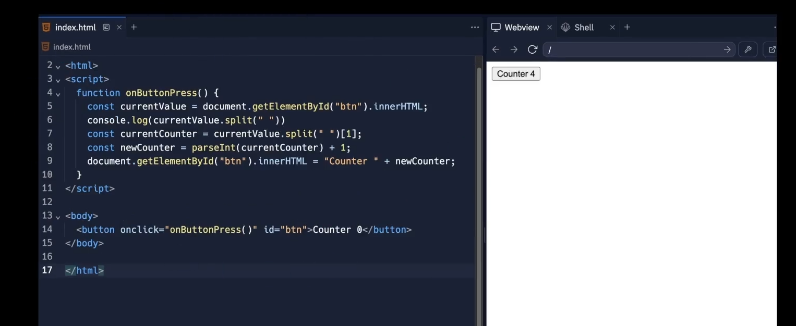
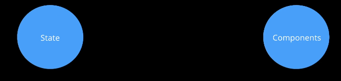
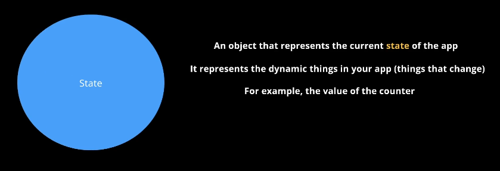
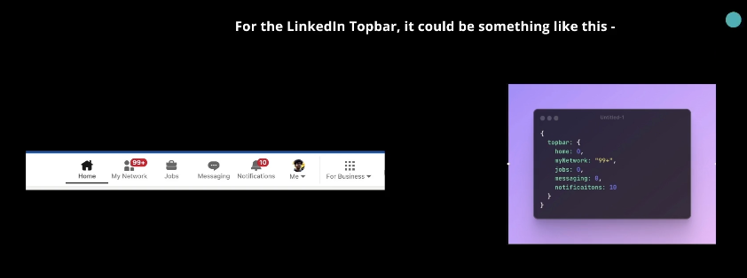
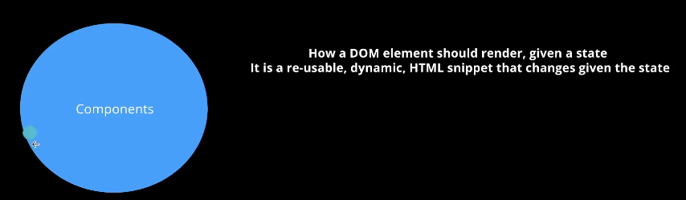
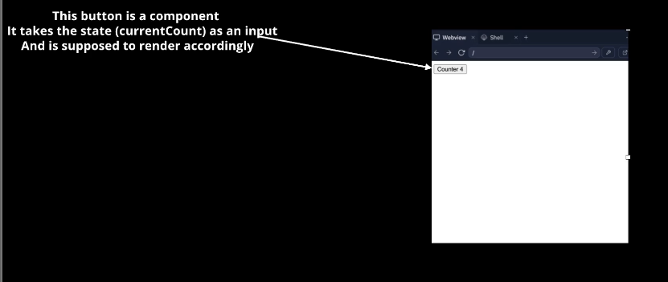
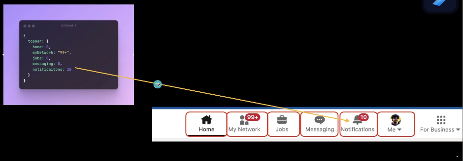
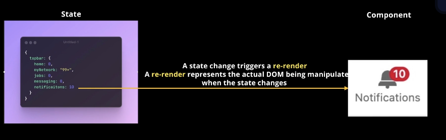
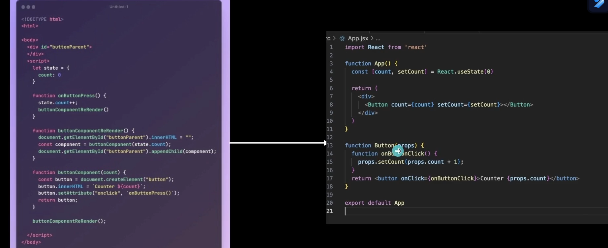

# **React Understanding with example**

- [**React Understanding with example**](#react-understanding-with-example)
  - [**Some React Jargon**](#some-react-jargon)
    - [**State / Components / Re-rendering**](#state--components--re-rendering)
      - [**State**](#state)
      - [**Components**](#components)
      - [**Re - Rendering**](#re---rendering)
    - [**Assignment - Lets create a counter app using state / components**](#assignment---lets-create-a-counter-app-using-state--components)
  - [**Assignment (creating the todo app) by react**](#assignment-creating-the-todo-app-by-react)
    - [**Array Destructuring and Object Destructuring**](#array-destructuring-and-object-destructuring)


:bulb: **Why do you need React ??**

-> To reduce the complexity

-> For static we dont need it but what is **static website ??**

-> __Static website__ -> No content in a website changes as you do some action or some action is performed.


The above pic is static website



The above is the dynamic website. You click on this button and the counter goes up.

```javascript
<!DOCTYPE html>
<html lang="en">
<head>
    <meta charset="UTF-8">
    <meta name="viewport" content="width=device-width, initial-scale=1.0">
    <title>Document</title>
</head>
<head>
    <script>
        function onButtonPress(){
            const currentValue = document.getElementById("btn").innerHTML;  // op -> Counter curr_value_present(suppose 2)
            const currentCounter = currentValue.split(" ")[1]; // as currentValue.split(" ") -> ["Counter", "0"] and i need its first index element so used [1] so op -> 2
            const newCounter = parseInt(currentCounter) + 1; // as first i convert it into integer from string
            document.getElementById("btn").innerHTML = "Counter " + newCounter; 
        }
    </script>
</head>
<body>
    <button onclick="onButtonPress()" id="btn">Counter 0</button>  
</body>
</html>
```

The above code although is **dynamic** but as your codebase will become large and large like facebook, linkedIn, **This will be very tough so that why react was introduced**

:large_orange_diamond: **React is just an easier way to write normal HTML / CSS. Its a new syntax, that under the hood gets converted to HTML / CSS / JS**

Ultimately the React code gets converted to HTML / CSS / JS

:bulb: Why React ??

People realised its harder to do DOM manipulation the conventional way

There were libraries that came into the picture that made it slightly easy, but still for a very big app its very hard (Jquery). Eventually, VueJS / React created a new syntac to do the frontends.

Under the hood, the react compiler convert your code to HTML / CSS / JS.

## **Some React Jargon**
----------


To create a react app, you usually need to worry about two things

Creators of frontend frameworks realised that all websites can effectively be divided into two parts



If anyone wants to create using REACT they have to make **state** and **component** for their application

###  **State / Components / Re-rendering**
----------


#### **State**



> **State is thing that is changing** 
>
> > Ex -> for the counter, the number is changing so that **is state**

 

React is written in such a way that if you write 

```javascript
jobs : 1
```
and you will see the **jobs** notification as `1` 

#### **Components**
----------




> :pushpin: can you see that REACT works on two principle
>
> > <span style="color:orange">**Status ->**</span> **The one thing that is dynamic has been handled by STATUS** and
> > <span style="color:orange">**Components ->**</span> **The one thing that is static has been handled by COMPONENTS**


:round_pushpin: **React is simply the DIFF - CALCULATOR** (it changes the DOM according to the Difference made by the state)

Ex -> 






In the above picture the `Home`, `My Network`, `Jobs`, `Messaging` and other logo are the **COMPONENTS** 

**The only statement to understand REACT**



**Second statement to keep in mind**

:pushpin:<span style="color:orange">**You usually have to define all your components once And then all you have to do is to update the state of your app. React takes care of re-rendering of your app**</span>

#### **Re - Rendering**

Converting the actual DOM Elements is what we call **Re - Rendering**

### **Assignment - Lets create a counter app using state / components**
----------


```javascript
<!DOCTYPE html>
<html lang="en">
<head>
    <meta charset="UTF-8">
    <meta name="viewport" content="width=device-width, initial-scale=1.0">
    <title>Document</title>
<head>
    <body>
        <div id="buttonParent"></div>
    <script>
        // Created a CUSTOM STATE by yourself
        // First defining the State
        let state = { // 1
            count : 0
        }

        function onButtonPress(){ // 2
            state.count++;
            buttonComponentRender(); // when the state is changing, it is RERENDERing the code by using the function 
        }

        // This is what the REACT will Eventually be doing (Re-Rendering the counter)

        function buttonComponenReRender(){ // 3
            document.getElementById("buttonParent").innerHTML = "";
            const button = document.createElement("button");
            button.innerHTML = `Counter ${state.count}`;
            button.setAttribute("onclick", `onButtonPress()`);
            document.getElementById("buttonParent").appendChild(button);
        }

        // Created a CUSTOM COMPONENT by Yourself
        function buttonComponent(count){ // 4
            const button = document.createElement("button");
            button.innerHTML = "Counter " + count;
            button.setAttribute("onclick", `onButtonPress()`);
            return button;   
        }
        // The above code is doing same thing like the below code 
        // <button onClick="onButtonPress">Counter 0</button> // only thing is that the '0' here is DYNAMIC
        buttonComponentReRender();
    </script>
</body>
</html>
```

can you notice that although i have not written `<button></button>` tag still if you will run this code You will see the same thing as you were seeing in the intitial phase.

Explanation of the above code 

+ `// 1` -> is **defining the state**
+ `// 2` && `// 4` -> is for **defining the button component**
+ `// 3` -> is **React Library**

The Equivalent code in React look like this :-



> :warning: <span style="color:orange">**Remember ->**</span> **Never try to use DOM Manipulation while working with React, Only in the very serious case you should use it.**
>
> > **You should always try to use `state` and `components` while working with REACT**

```javascript
import {useState} from "react";


export default function App(){
    // 2
    const [count, setCount] = useState(0); // defining the state

    function onClickHandler(){
        setCount(count+1);
    }

    return(
        <div>
            <button id  = "btn" onClick = {onClickHandler}>
                Counter {count}
            </button>
        </div>
    );
}
```

Explanation of the `// 2` code 

Basically `useState` hook **returns two things in an ARRAY**

Instead of `// 2` code you could have also used this

```javascript
const stateVariable = useState(0);
const count = stateVariable[0];
const setCount = stateVariable[1];
```

Now you can have question that although here `count` is `const` but still you are able to change its value. **The reason is ->** **You can change the value of array Internally**

means

```javascript
const count1 = [2, 3]
count1 = [4,5]  // will give Error as whole array is const and you are trying to directly change its value

BUT 

const count1 = [2,3]
count1[1] = 4 // o/p -> [2,4]  so You can change the value of array interanally

// To avoid the above case also do this
const [elem 1, elem 2] = Object.freeze(['value1','value2']); // Internal element also not possible to change
```

## **Assignment (creating the todo app) by react**
----------


```javascript
import {useState} from "react"

export default function App(){
    const [todos, setTodos] = useState([]) // Initially my todo has no todos (Empty array)
    OR lets just fill up

    const [todos, setTodos] = useState([{
        title : "go to gym",
        description : "You should go to the gym to build your muscle",
        done : false

    }])

    function addTodo(){
        todos.push({
            title : "eat food",
            description : "eat food at 10"
            done : true
        })
        // You should not do the above thing as it will not make this DYNAMIC

        // Instead do this 
        let newArray = [...todos]; // used spread operator 
        // in case you dont want to use spread write this
        let newArray = [];
        for(let i = 0; i < todos.length;i++){
            newArray.push(todos[i]);
        }
        newArray.push({
            title : document.getElementById("title").value // used 1. way
            description : document.getElementById("description").value
            done : true
        })
        setTodos(newArray);
        // if you wrote this 
        setTodos([]) // then it has called setTodos with Empty array

    }

    return (<div> 
        <input id = "title" type = "text" placeholder = "Title"></input> // Now extracting the value from the input box 2 ways -> 1. UGLY way -> using document.getElementById  2. REACT way -> Better one but will later do this
        <input id = "description" type = "text" placeholder = "Description"></input>
        <br/>
        <button onClick = {addTodo}>Add a Todo</button>
        <br/>
        // using the made custom component
          <Todo title = {"Hii how are you"} description ={"introduced my name"} done = {false}> // you have to add Brackets whenever you pass PROPS
        
        // But you have to present all the todo so we should iterate over them so doing that

        {todos.map((todo) => {
            <Todo
                title = {todo.title},
                description = {todo.description},
                done = {todo.done}
            />
        })}
        
    </div>;
    );
}

    // adding the custom component to render it on the screen
function Todo(props){
    return (
        <div>
            <h1>{props.title}</h1>
            <h1>{props.description}</h1>
            <h1>{props.done}</h1>
        </div>
    )
}
```

### **Array Destructuring and Object Destructuring**

----------


```javascript
let arr = [1, 2, 3]

let [a, b, c] = arr // this is Array Destructuring
```

```javascript
let user = {
    name : "Satyam",
    age : 21
}

const {name, age} = user // this is Object Destructuring
```


