# **React (from beginner to advanced)**

- [**React (from beginner to advanced)**](#react-from-beginner-to-advanced)
  - [**Creating a fresh React project**](#creating-a-fresh-react-project)
  - [**Understanding the sample code**](#understanding-the-sample-code)
    - [**`useState` hook**](#usestate-hook)
    - [**Lifecycle Events of React**](#lifecycle-events-of-react)
    - [**`useEffect` hook**](#useeffect-hook)
  - [**Points to remember while writing the React code**](#points-to-remember-while-writing-the-react-code)
  - [**Conditional Rendering**](#conditional-rendering)
    - [**Props**](#props)
    - [**Dependency Array in `useEffect` hook**](#dependency-array-in-useeffect-hook)
  - [**Children**](#children)
  - [**Lists and Keys**](#lists-and-keys)
      - [**Why giving Key to every element is important in Lists (array of objects) and why not giving it will give error ??**](#why-giving-key-to-every-element-is-important-in-lists-array-of-objects-and-why-not-giving-it-will-give-error-)
  - [**Inline Styling**](#inline-styling)
  - [**Class based components V/S functional based components**](#class-based-components-vs-functional-based-components)
    - [**Error Boundary (only thing not possible to do via functional components)**](#error-boundary-only-thing-not-possible-to-do-via-functional-components)
  - [**Fragments in React**](#fragments-in-react)
  - [**Single Page Applications (SPAs) in React**](#single-page-applications-spas-in-react)
  - [**Routing in React**](#routing-in-react)
    - [**Navigating one page from another**](#navigating-one-page-from-another)
      - [**1st Way -\>** **Make Link to all the routes** (Dumb Way)](#1st-way---make-link-to-all-the-routes-dumb-way)
      - [**2nd Way -\>** __using `Link` component present in `react-router-dom`__ (Smart way)](#2nd-way---using-link-component-present-in-react-router-dom-smart-way)
      - [**3rd way -\>** **using `useNavigate` hook**](#3rd-way---using-usenavigate-hook)
    - [**Making a default page**](#making-a-default-page)
  - [**Layouts in React**](#layouts-in-react)
    - [**about  component**](#about--component)
    - [**about `useRef` hook**](#about-useref-hook)
      - [__Key Characteristics of `useRef`:-__](#key-characteristics-of-useref-)
      - [**about `.focus()` property**](#about-focus-property)
      - [**usecase of `useRef` hook**](#usecase-of-useref-hook)
    - [**3 ways to define variable in REACT**](#3-ways-to-define-variable-in-react)
  - [**Rolling up the state, unoptimal re-renders (State Management)**](#rolling-up-the-state-unoptimal-re-renders-state-management)
  - [**Prop Drilling**](#prop-drilling)
  - [**Context API (used to solve Prop Drilling problem)**](#context-api-used-to-solve-prop-drilling-problem)
    - [__Steps used to create context api__](#steps-used-to-create-context-api)
    - [**Testing the Context API**](#testing-the-context-api)
  - [**Creating Custom Hooks**](#creating-custom-hooks)
    - [**`useCounter` hook**](#usecounter-hook)
    - [**`useFetch` hook** (Common Interview Question)](#usefetch-hook-common-interview-question)
    - [**`usePrev` hook** (one of the hardest hook)](#useprev-hook-one-of-the-hardest-hook)
    - [**`useDebounce` hook**](#usedebounce-hook)
    - [**`useIsOnline` hook**](#useisonline-hook)
  - [**Assignment**](#assignment)

## **Creating a fresh React project**
----------


**Step 1 ->** run the command 

```console
npm create vite@latest
```

now do whatever the options you want to keep including giving the **Project Name**

after setting all the things just run this command

```console
npm install
```
and then to run the code use

```console
npm run dev
```
In React, components are the building blocks of the user interface. They allow to split UI into __independent, reusuable pieces__ that can be thought as **custom, self - contained HTML elements**

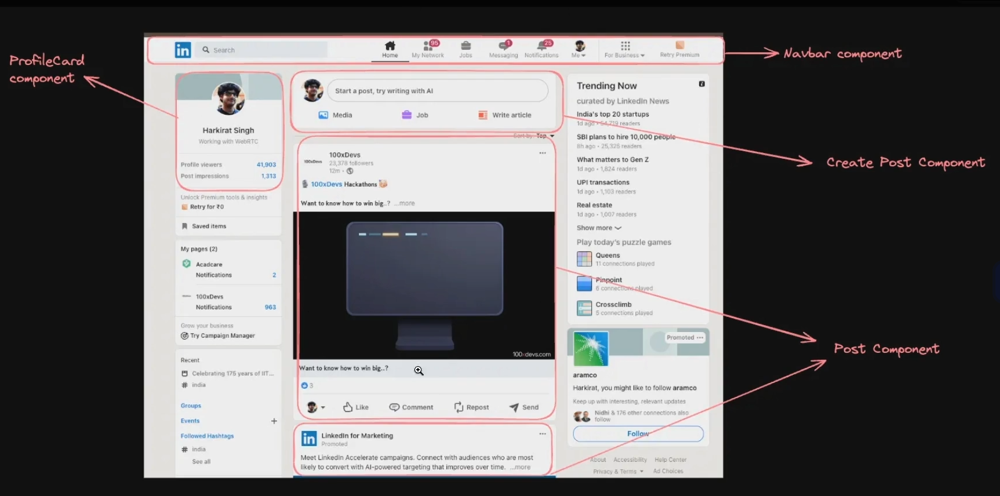

making some of the component from the above image 

inside `App.jsx`

```javascript
function App() {

    return (
        <div style = {{background : "#dfe6e9", height : "100vh"}}>
            <div style = {{display : "flex", justifyContent : "center"}}>
                <div>
                    <postComponent/>
                </div>
                <br/> // to add some space between them 
                <div>
                    <postComponent/>
                </div>
                <br/>
                <div>
                    <postComponent/>
                </div>
            </div>
        </div>
    )   
}

const style = {width : 200, backgroundColor : "white", borderRadius : 10, borderColor : "grey", borderWidth : 1} // 2

function postComponent(){
    return 
    <div style = {style}>
        <div> style = {{display : "flex"}} // either directly give all the value of CSS here or make a seperate variable as above and pass it on here (as we did here)
        
        <div style = {{fontSize : 10, marginLeft : 10}}>
            <b>100xdevs</b>
            <div>23,888 followers</div>
            <div>12m</div>
        </div>
        <div>Want to know how to win big? Check out how these folks won $6000 in bounties</div>
    </div>
}
```

> :warning: **Remember** in JS, you <span style="color:orange">**cannot directly give the `-` contained properties directly**</span>
>
> > **Use either Wrapping inside the " " (double quote) or make camelCase notation of it and remove the `-` from inside**
> >
> >> Ex -> see `// 2` `background-color` is the actual CSS property but to use it in JS either write like this -> `"background-color"` or `backgroundColor`

Running the above code it will appear to look like this :-

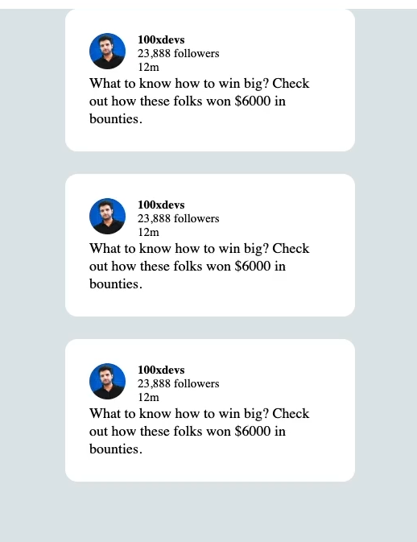

## **Understanding the sample code**
----------


```javascript
function App() {

    return (
            <div> // 1
                <b>Hi there i am Satyam</b>
                <Counter></Counter>
            </div>
    );
}

function Counter() { // 2 if "counter" was written then nhi chlega code 
    return( 
        <>
            <h1>1</h1>
            <button>Increase Count</button>
        </>
    );
}    
export default App;
```

In the above code, i want to make a counter

**Ugly way to do this** -> By using RAW DOM Manipulation (which is not a great way)

```javascript
function increaseCounter(){ // 3 You can put this function outside but declare inside the component it is connected to 

}
function Counter() {
    function increaseCounter(){ // as this is connected to Counter component so defined inside this 
        const num = document.getElementById("number").innerHTML;
        return num+1;

    }
    return( 
        <>
            <h1 id = "number">1</h1>
            <button onClick = {increaseCounter}>Increase Count</button>
        </>
    );
}    
export default App;
```
**Better way to do this** -> using the dynamic variable or React

```javascript
function Counter() {
    let count = 0; // React does not know about the common variable it just know about the STATE variable
    
    // declaring the STATE variable
    const[count, setCount] = useState(0) // 1

    function increaseCounter(){
        setCount(count + 1);
    }

    return( 
        <>
            <h1>{count}</h1> // added a dynamic variable count
            <button onClick ={increaseCounter}>Increase Count</button>
        </>
    );
}    
export default App;
```

**Explanation of `// 1` code**

### **`useState` hook**
----------

basically a function which takes some value as the Input / arguments

as function h and parenthese lgate he **execute** v kr jayega to kuch na kuch to **return** krega he

**State usually is that part of website which is DYNAMIC in nature..**

**Most Important Point**

> :pushpin: When the value of the <span style="color:orange">**state variable changes**</span> **the component that uses the state variable re - renders**

return 2 things in ARRAY (so **destructure kiya h upar**):-
+ **State Variable ->** here `count` is the state variable, **iska default / INITIAL value `useState()` ke argument me pass kiya jata h**
    + This variable is **responsible for Re-Rendering the Component**
+ **function ->** here `setCount` (:warning: parenthese nhi lgaya as i dont want to **execute** nhi krna chahta) jo state variable ko <span style="color:orange">**UPDATE KRNE ka kaam krta h**</span> as isi ki wajah se state variable ka value change hoga
    + some points about this **function**
  
here `setCount` while using it can do multiple things

1st way -> **Directly give the value**

```javascript
function Counter() {
    const[count, setCount] = useState(0)

    function increaseCounter(){
        setCount(1000); // ye likhne se pehle '0' aayega phir turant '1000' aa jayega
    }

    return( 
        <>
            <h1>{count}</h1> // added a dynamic variable count
            <button onClick ={increaseCounter}>Increase Count</button>
        </>
    );
} 
```
2nd Way -> **Do some operation on the variable**

```javascript
function Counter() {
    const[count, setCount] = useState(0)

    function increaseCounter(){
        setCount(count + 1); // used variable 'count' to always increase the value of count by 1 every time re-render occurs
    }

    return( 
        <>
            <h1>{count}</h1> // added a dynamic variable count
            <button onClick ={increaseCounter}>Increase Count</button>
        </>
    );
}
```
3rd Way -> **Define and call a function**

```javascript
function Counter() {
    const[count, setCount] = useState(0)

    function increaseCounter(){
        setCount((currentValue) =>{  // takes another function as argument(means callback function) which takes 'currentValue' as an argument and return its increased value by 1
            return currentValue + 1;
        });
    }

    return( 
        <>
            <h1>{count}</h1> // added a dynamic variable count
            <button onClick ={increaseCounter}>Increase Count</button>
        </>
    );
}
```
**Task ->** lets say when i add to the Add post button it should add the post component (already made) one by one How to do this ??

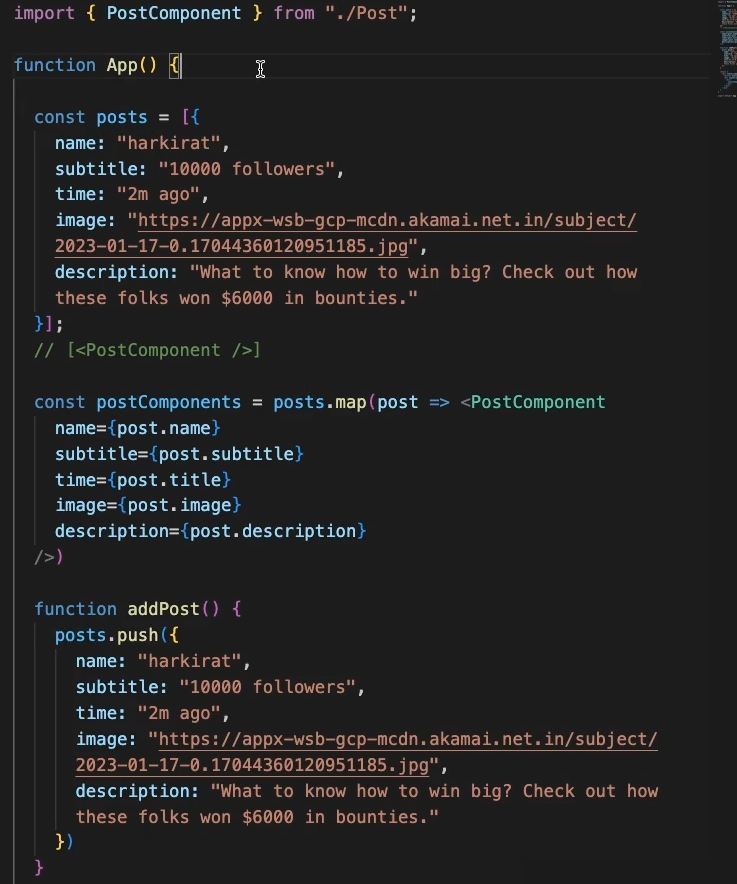 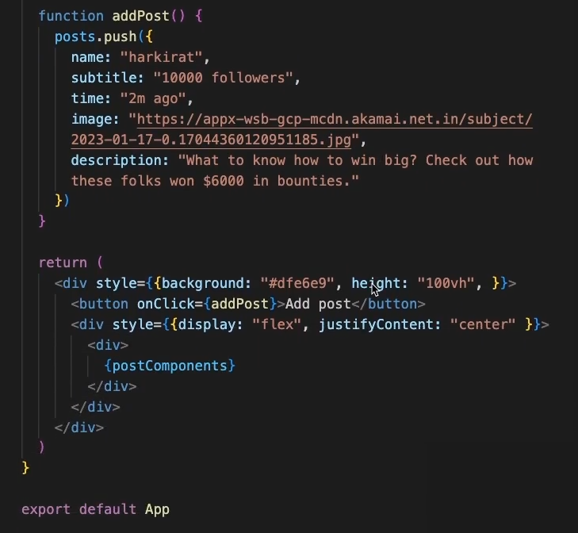

both the above pic are part of the same code so dont get confuse.

Although the above logic seems to be Right but still this will not achieve the **Task**

**Reason ->** **we have not told the React to re-render when the value of `posts` changes for this we have to make it STATE variable**

so the below is the correct code by using the `useState` hook

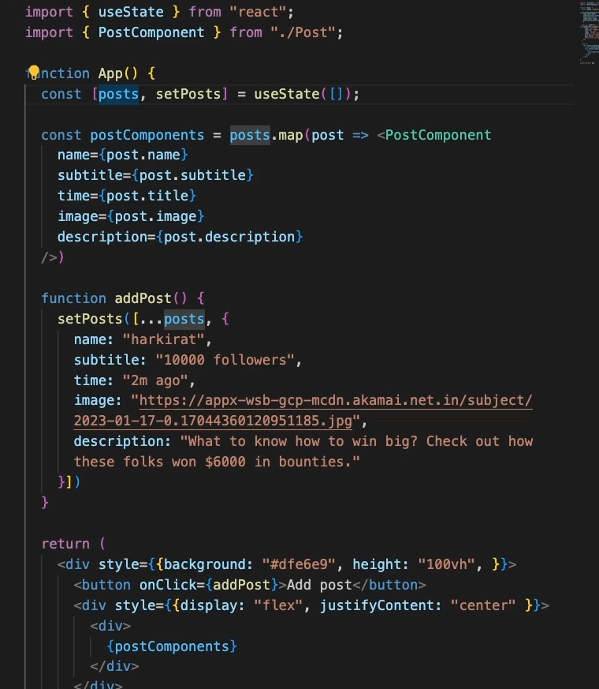

> :round_pushpin: notice the use of  `...` **Spread operator** which is used to **preserve or show** the existing values present inside the array and adding it from right only

__Output__ -> you will see that on pressing the button `Add post`, `postComponent` will get added.

**Notice ->** We have written `const [posts, setPosts]` inside the `App` component which means that if anything changes inside the `posts`, `App` component **will re-render** (as `posts` declared inside the `App` component)

**Task ->** Make a notification counter that increase its notification count when a button is pressed

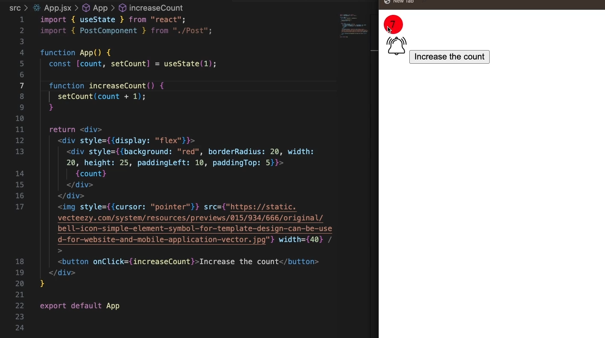

Now coming to next point 

Lets say you have got the task -> make a counter which automatically runs after 1 second and Increases the value by 1 in the counter every 1 second

how to do ??

-> using `setInterval()` you can do that right but lets see

```javascript
import {useState} from "react"

function App() {

    return (
            <div>
                <b>Hi there i am Satyam</b>
                <Counter></Counter>
            </div>
    );
}

function Counter() {
    const [count, setCount] = useState(0);

    console.log("Inside the counter component"); // 1 although this should run one time ( as App component me ek baar he to call hua h ye) only but still it is Running infinite times if you see the console, this will be printing infinite times

    setInterval(() => {
        setCount(count + 1);
    }, 1000);

    return( 
        <>
            <h1>{count}</h1>
        </>
    );
} 
export default App;
```
The above code has some problem -> Initially although it will run as per our expectation but after some time **it will start to do strange thing**

also `// 1` will also hint that something is wrong

**Reason ->** Actually everytime there is change in `count` state variable, `setCount` is being called (i.e. **React RE-RENDERS the component `Counter`**) and as the **Re-Rendering** is occuring so `setInterval` is being called everytime **which ultimately leading to the strange behaviour** 

:bulb: How to solve it ??

-> we have to introduce something which is known as **Hooking into the lifecycle events of react**

means **Jb ye first time render ho, tbhi tm call kro `setInterval` function othewise nhi**

###  **Lifecycle Events of React**
----------


1. **Mounting** -> Jb sbse pehli baar component aayega react me tb us process ko **mounting** kehte h  

2. **Re - Rendering** -> The number of times the component **re-renders or any change in the value occurs** that process is **re-rendering** 

3. **Unmounting** -> when the component is done, it **Exits** the process of exiting is known as **Unmounting**

so basically everything inside the **custom component made** will **Re - Render** again and again when you are working with react as React works this way only

**It continuously re-renders the component to make sure that if there is some difference between the variables, it should update it to the current ui** 
+ Ex -> take the above code jb v `{count}` means `count` me change hoga `Counter` component will be called by React and Re-Render will take place.

:bulb: If the above is true, then it means `count` variable will again set to `0` after every **Re-Render** ??

-> **No**, remember the `count` is a **state variable** not some normal variable so <span style="color:orange">**Once it gets INITIALISED, its value is not going to change,IT WILL UPDATE, NOT CHANGE**</span> as we have used `useState` hook

so what we want -> ki jb bhi `Counter` component **Mount** ho tb `setInterval` chalao, **Re - Rendering** ke samay nhi (<span style="color:orange">**Sirf mount krne ke samay**</span>)

for this we use `useEffect` hook

### **`useEffect` hook**
----------


Before understanding the `useEffect`, lets understand **What are SIDE EFFECTS ??**

**Side Effects**

Side Effects are operation that interact with the outside world or have effects beyond component rendering. Examples include :-
+ **Fetching data from an API**
+ **Modifying the DOM manually**
+ **Subscribing the events**(like Websoket connections, timers, or browser events)
+ **Starting a clock**

These are called **Side Effects** because they dont just compute output based on the intput -> **They affect things outside the components itself**

----------
**Problems in running sideeffects in React components**

If you try to introduce side effects directly in the rendering logic of a component (in the `return` statement or before it), React would run that code every time the component renders. This can lead to :-
+ **Unnecessary or duplicated effects (like multiple API calls)**
+ **Inconsistent behaviour** (side effect might happen before rendering finishes)
+ **Performance Issues** (side effects could block rendering or cause excessive re-rendering)
using it   

__To solve the above problem `useEffect` hook was introduced.__

Problem and solution in one pic -

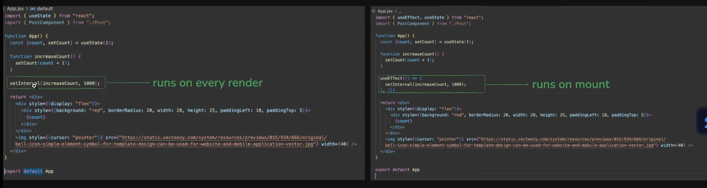

```javascript
import {useEffect} from "react"
```

> :pushpin: <span style="color:orange">**Jo v Logic that i want to run only or being called on mounting that is Wrapped inside a `useEffect` hook**</span>
>
> > :pushpin: **Iske andar jo v code hoga wo Ek baar chlega / call hoga unless something in the dependency array value changes**

`useEffect` takes 2 arguments :-

+ **Callback function ->** as it is passed inside another function (hook is basically a function only) to callback function he bolenge.
    + Ex -> yahan par `setInterval` function `useEffect` me wrap hua
+ **Dependency Array ->**


so now the updated code looks like this

```javascript
import {useState} from "react"

function App() {

    return (
            <div>
                <b>Hi there i am Satyam</b>
                <Counter></Counter>
            </div>
    );
}

function Counter() {
    const [count, setCount] = useState(0);

    console.log("Inside the counter component"); 

    // used a useEffect hook 

    // guard our setInterval from re-renders
    useEffect(() => {
            setInterval(() => {
            setCount(count + 1);
        }, 1000);

    },[]);

    return( 
        <>
            <h1>{count}</h1>
        </>
    );
} 
export default App;
```

Now consider the two cases 

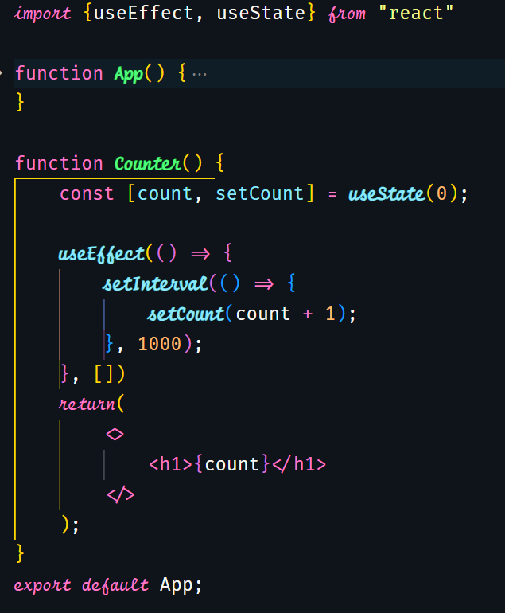 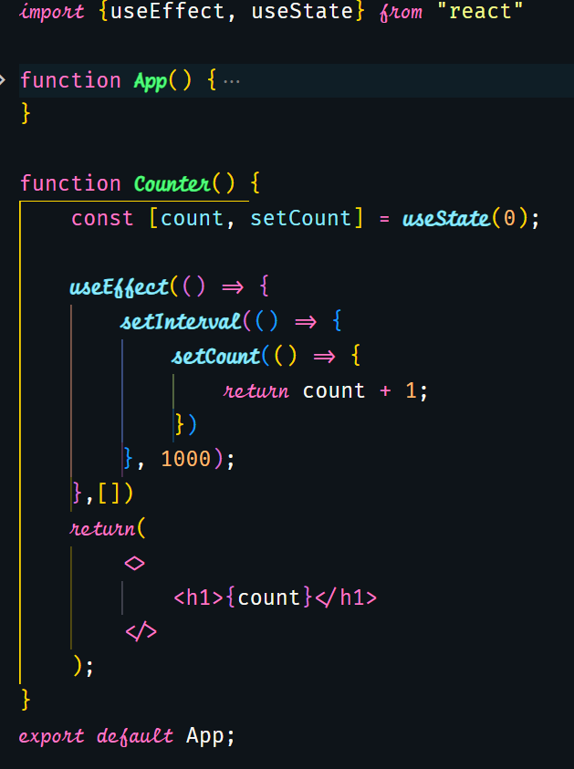

The second code will actually work (Right one) But dont you think they both are doing the same thing.

In the Right pic -> what is the use of making a seperate function to call inside the `setCount` function to update the count per second as 

In the left pic -> `setCount(count + 1)` is doing the same thing (taking the `count` value and then updating it)

**Reason ->** <span style="color:orange">**Dependency Array**</span> In left pic, if you have kept `count` in the dependency array, then left code v chal jata

although both are based on same logic and NO Difference is there between the below two code

```javascript
setCount(count + 1);

OR 

setCount((count) => { // This is better though as it gives clarity
    return count + 1;
})
```


## **Points to remember while writing the React code**
----------


+ **Always the component should be wrapped inside a top level Div** i.e -> <span style="color:orange">**Every component in the React code should return only 1 div (top level div).**</span>
    + Ex -> see `// 1`

> if dont want to give any HTML tag as top level div then just give `<div> </div>` or `<> </>` they can act as top level div


+ when making the custom component, **make sure to start its name with CAPITAL LETTER**
    + Ex -> see `// 2`
    + Reason -> **React internally understands that it is the standard HTML tag if you start its name with small letter**

+ **Always define the function which is related to its corresponding component INSIDE THE COMPONENT ITSELF**(instead of defining it globally or outside)
    + Ex -> see `// 3`
    + Reason -> 

## **Conditional Rendering**
----------


Lets start with simple example and then with the help of Assignment we will move to complex one 

You can render different components or elements based on certain conditions

```javascript
import React, { useState } from 'react'

const ToggleMessage = () => {
    const [isVisible, setIsVisible] = useState(false);

    return (
        <div>
            <button onClick = {() => setIsVisible(!isVisible)}>
                ToggleMessage
            </button> // button pe click krte ke sath "This message is conditionally rendered!" print hoga and then toggle krega (means wapas se dbaya to gayab)
            {isVisible && <p> This message is conditionally rendered!</p>} // due to this line toggling is happening
        </div>
    )
}
```

Now lets take some complex things and try to understand by doing an Assignment

**Assignment -> I want ki 5 second ke interval me Counter render ho and then gayab ho jaye and then keeps on repeating this process of visiblity and non-visiblity, How to do this ??**

The above is what we call **Conditional Rendering**

```javascript
import {useEffect, useState} from "react"

function App() {
    let counterVisible = true; // made for the counter visiblity logic on my choice agar false kr doge to kuch nhi dikhega see // 1 code

    // to do the above task
    letp[counterVisible, setCounterVisible] = useState(true); // Initially counterVisible ka value = true to dikhega
    // Now i have to hide it after 5 second so we will use setInterval with useEffect as ek baar he chlna chahiye setInterval phir to ye apne app chlta h according to the time you give it to this
    return (
            <div>
                <b>Hi there i am Satyam</b>
                
                {counterVisible ? <Counter></Counter> : null} // 1 means agar counterVisible true h to RENDER kro warna mt kro  // 3

                useEffect(() => {
                    setInterval(() => {
                        setCounterVisible((flag) => { // simply says ki true h to false kr do and false h to true kr do
                            return (!flag);
                        })
                        OR you can also write like this
                        setCounterVisible(flag => !flag);
                    }, 5000); // as 5 second ke interval me chahiye
                }, []);

            </div>
    );
}

// BUT THERE Is a Performance Downgrade of this logic Reason // 2
// To stop this -> CLEANUP comes into the picture
// maine MOUNTS jb hoga component uske liye logic likha but what about logic when the component UNMOUNTS (i.e -> yahan pr clock ko stop v to krna pdega)
function Counter() {
    const [count, setCount] = useState(0);

    useEffect(() => {
        // The below logic is running when the component is Mounting (when the clock starts)
        setInterval(() => { 
            setCount((currentValue) => {
                console.log("from inside the interval")// 2 -> although the Counter get UNMOUNTS after interval of 5 second but still this is Running as it will print after 1 second (i.e. ye function to chlega he after 1 second) which is a DOWN point as jb component unmount ho gya h to v run kyu kr rha h baar - baar.
                return currentValue + 1;
            });          
        }, 1000);
        // updated setInterval() code to optimise the Performance
        let clock = setInterval(() => {
            setCount((currentValue) => {
                return countValue + 1;
            })
        }, 1000);

        // The below logic is running when the component is Unmounting (when the clock stops)
        return function(){
            clearInterval(clock); // used clearInterval 
        }
        
    }, []) // ALL THE ABOVE THING ARE TRUE TILL THE Dependency ARRAY IS EMPTY if something will be there inside it then these thing will change
    return( 
        <>
            <h1>{count}</h1>
        </>
    );
} 
export default App;
```
> :pushpin: The way to **STOP THE CLOCK** is by using `clearInterval()` function
>
> > `setInterval` function returns a **value** store it in the variable and then **Pass it in the `clearInterval()`** function.(Both are global function)

**`useEffect` One line SUMMARY (The only thing to REMEMBER)** 

> :pushpin: <span style="color:orange">**The Code we write in `useEffect` is used at the time of mounting and ignored during re-rendering ans the function we RETRUN in `useEffect` is called at the time of unmounting**</span>
>
> > :warning: Remember ye tb tk shi h jbtk Dependency Array khali h ya Empty h


:bulb: What is Happening in the above code ??

-> above code se basically ek counter chalu hoga 0 se (as `count` state variable initialised value) **5 second tk 0,1,2,3,4 dikhega** and then **Gayab ho jayega till 5 second** and then again **5 second tk 0,1,2,3,4 dikhega** and so on.... BUT here comes the point

**I want ki jb wapas se counter aaye to jo value chal rha h whi dikhe** Ex -> 5 second tk 0,1,2,3,4 dikhega phir 5 second gayab phir jb wapas dikhega to 0 se dikhne ke bjaye 10 se dikhe as (5(visible) + 5(invisible))

:bulb: **How to achieve it ??**

-> **1st Way ->** tm `Counter` component ko **Chupa do** clock to chlega magar `Counter` dikhega nhi using **CSS properties**

at `// 3` code write this -> firstly **wrap the Counter component inside a div and then apply CSS on it(as custom component pr CSS :no_entry:)**

```javascript
<div style = {{visiblity : counterVisible ? "hidden" : "visible"}}> <Counter></Counter> </div>
```

-> **2nd Way ->** using the `PROPS`

### **Props**
----------


Props are a way to pass data from one component to another in React

```javascript
import react from "react"

const Greeting = ({ name }) =>{
    return <h1>Hello, {name}!</h1>

}

const App(){
    return <Greeting name = "Alice" />
}
```
### **Dependency Array in `useEffect` hook**
----------


-> we sometimes want ki **State me agar koi change aaye to ek part of code ko RUN kro** this is where **Dependency array** comes into the picture.


```javascript
import {useEffect, useState} from "react"

function App() {
    const [count, setCount] = useState(0);

    function increase(){
        setCount(c => c + 1);
    }

    return (
        <div>
            <Counter count = {count}/>
            <button onClick = {increase}>Increase Count</button>
        </div>
    );
}

// 1 - > Now i want ki jb v count (state variable) change to ho tb koi logic chle to do this we use dependency array
function Counter(props) {


    useEffect(function () {
        console.log("mount");

        return function(){
            console.log("unmount")
        }
    }, [])

    // made another to handle the // 1 problem

    useEffect(function(){
        console.log("mount has changed");

        return function(){ // 2
            console.log("cleanup inside second effect") 
        }
    }, [props.count]) // means jb v count (state varaible change hoga to ye logic chlega)

    return <div>
        Counter {props.count}
    </div>
} 
export default App;
```

so **Above you saw another use of `useEffect` hook that whenver we want ki koi STATE VARIABLE ke change hone se kuch logic chal jaye to at that time we use `useEffect` hook**

**Explanation of `// 2` code**

we all know `useEffect` me **return** ka function **Runs on Cleanup or Unmounting** so here `// 2` is also doing the same thing, whenever any of the state variable in the dependency array will change its value, **First cleanup means unmounting wala logic chlega and then useEffect ka given function ka logic chlega (of course first time jb load / mount hoga tb to useEffect ka he given function logic chlega) but after that the above logic runs**

__Practical Ex__ -> In linkedIn, you are first on HOME page, then to go on JOBS, you first have to Unmount / **Cleanup** all the HOME page, then load the JOBS page and this way it works.

How LinkedIn tab is working

```javascript
const [currentTab, setCurrentTab] = useState("Home") // Initialise it with Home tab

useEffect(() => {
    // then ye wala tab (current Tab) backend server se load hoga 
    return function(){
        // disconnect from the last tab backend server
    }
},[currentTab])  // means if the currentTab changes then phle cleanup logic chlao and then useEffect ka given function chlao  
```

> **The above is how the CLEANUP in React occurs**


## **Children**
----------


The `children` prop allows you to pass elements or components as props to other components

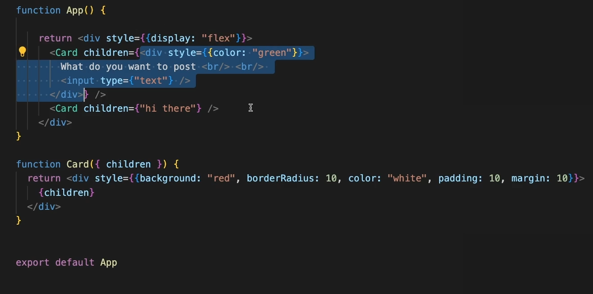 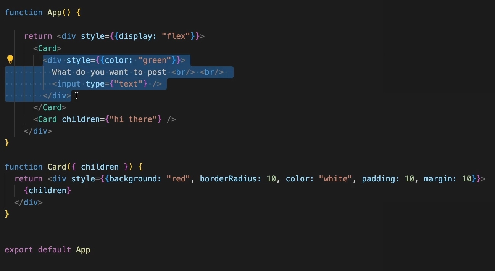

**Notice the hightlighted part -> Both are DOING THE SAME THING** But can you see that <span style="color:orange">**2nd pic (right one is more readable)**</span> (it is giving more clarity)

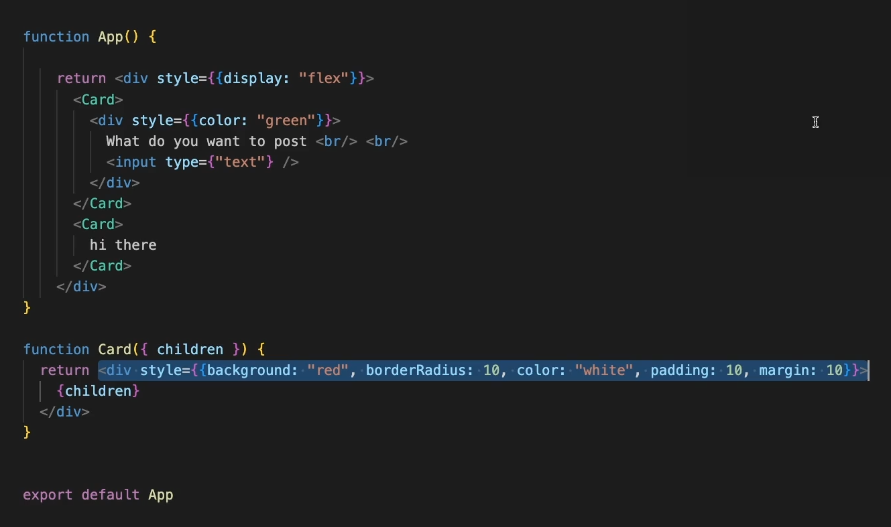

The above picture is saying that `Card` component will pass some `props` collected in `children` variable and then that whole thing is being **WRAPPED** inside the **Highlighted part DIV**

output of the above code :-


**Whatever you are passing inside the `<Card></Card>` Component declared in the `App` component is coming inside the `children` variable**

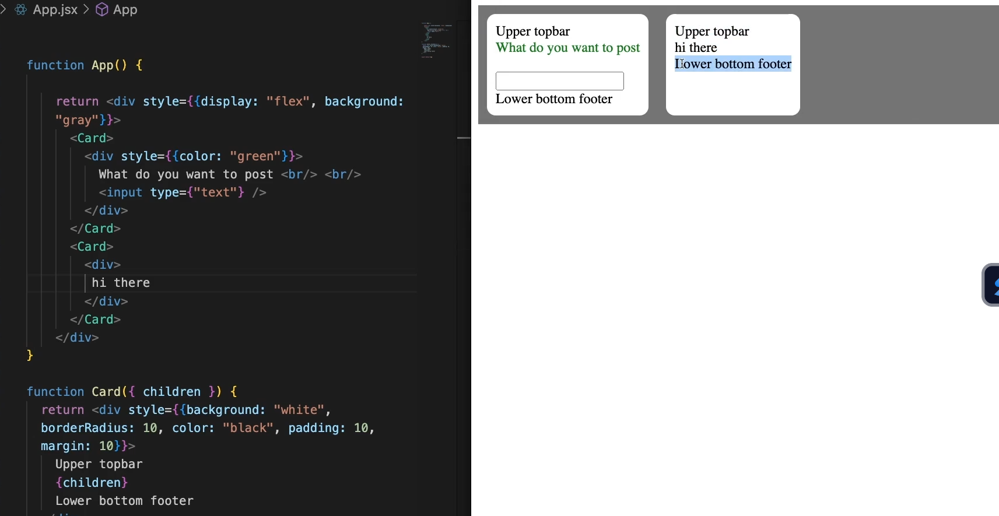

Can you now relate that the above code is looking like **Navbar** of any website and that's how the components are made in the website

## **Lists and Keys**
----------


>:warning: <span style="color:orange">**When rendering lists, each item should have a unique key prop for react to track changes efficiently**</span>

```javascript
import React from 'react';

const ItemList = ({ items }) => {
    return (
        <ul>
            {items.map(item => (
                <li key={item.id}>{item.name}</li>
            ))}
        </ul>
    );
};

const App = () => {
    const items = [
        { id: 1, name: 'Item 1' },
        { id: 2, name: 'Item 2' },
        { id: 3, name: 'Item 3' },
    ];

    return <ItemList items={items} />;
};
```

If you would not give **Unique key** 

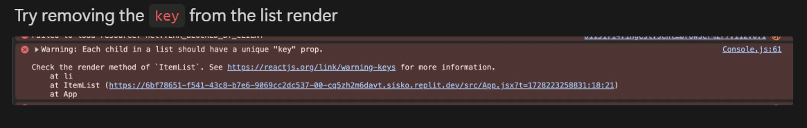

#### **Why giving Key to every element is important in Lists (array of objects) and why not giving it will give error ??**

**Reason ->** 

```javascript
import React from 'react';

const App = () => {
    return (
        <div>
            {[  // 1
                <Todo key = {2} title = {"Eat food"} done = {false} />,
                <Todo key = {1} title = {"Go to Gym"} done = {true} />,

                // 2
                <Todo title = {"Go to Gym"} done = {true} />,
                <Todo  title = {"Go to Gym"} done = {true} />,

            ]}
        </div>
    )
};

const Todo = ({ title, done }) => {
    return (
        <div>
            {title} ====> {done ? "Done !!" : "Not Done !!"}
        </div>
    );
};

export default App
```

Consider the case `// 2` now suppose lets say some of the condition were there which lead to **Flipping of `Go to gym` and `Eat food`** causing them to Interchange their places(one which was above came down and down one came above), Now <span style="color:orange">**How will React be able to distuinguish that they both have interchanged as their places ? (as they both are `Todo` component) only**</span> To avoid this and many similar type conflict (which occurs during re-rendering), We give the elements **Unique Id**

You can see in `// 1` that the above problem has been Resolved, React knows that component with `id == 2` has been moved up so it will be displayed first and then will come the element with `id == 1` (**RE-RENDER Safe**)

## **Inline Styling**
----------


Inline Styling in React allows you to apply CSS styles directly to elements using a Javascript object

**Two ways to give them**

- **Either make a seperate variable and pass it** (LEFT Pic)
- **Or Directly give it** (RIGHT Pic)

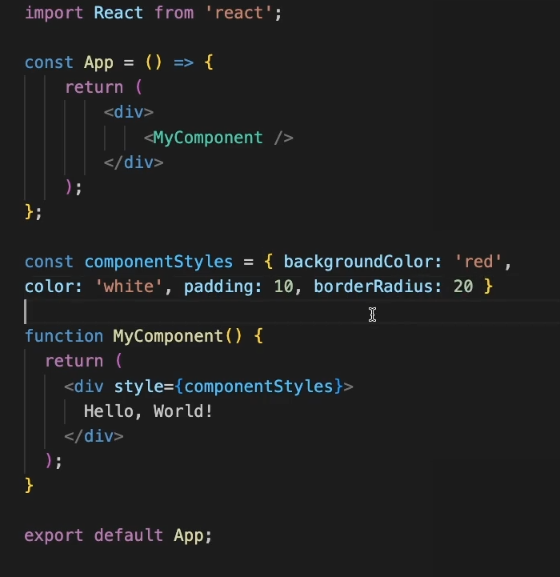 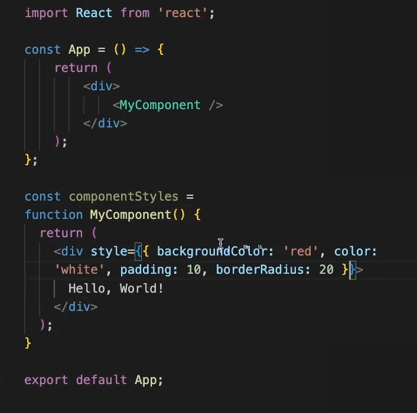

 

till now we have studied that if you want to do some styling then in `JS` you have to put both the `CSS properties` and `value` of it in `" "` (**Double Quotes**) But this is `React` you have to put it in **OBJECTS** (as whenever you are passing props you should first wrap inside the `{}` (curly braces))

## **Class based components V/S functional based components**
----------


Until now we have written **functional based components**

Earlier, React code was written using `Class based` components. Slowly functional components were introduced and today they are the ones you’ll se everywhere.

> :pushpin: Class components are  classes that extend `React.Component`, while functional components are simpler and can use Hooks.

Two ways to write the code 

- **Class based components** (Left pic)
- **Functional components** (Right pic)

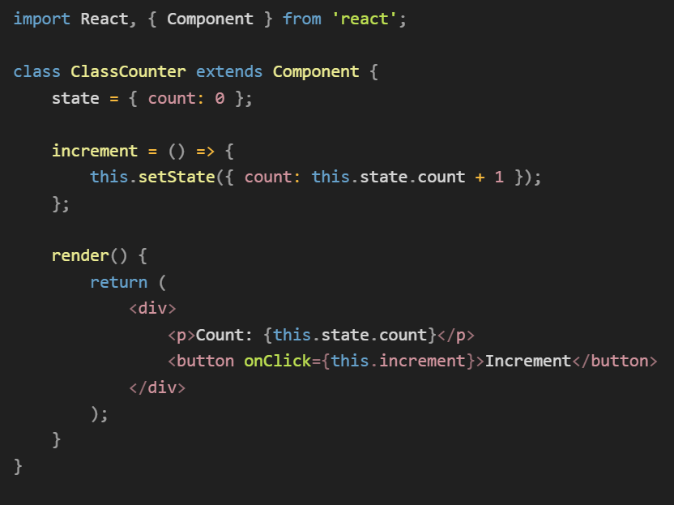 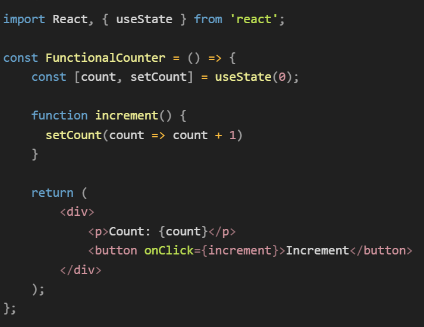

**Comparison**

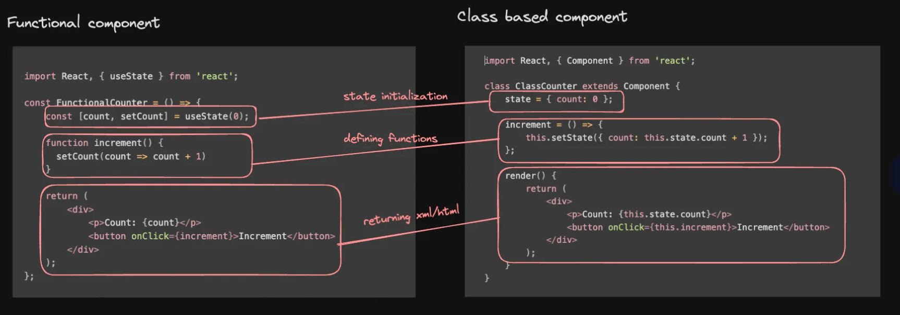

> <span style="color:orange">**No need to use `class based component` as they are NOT used now**</span> 
>
> > **From the Interview perspective just note it down**

### **Error Boundary (only thing not possible to do via functional components)**
----------


You will see this in Industry that in the whole codebase, they are using **class based components** only to handle this

As the name suggests, it is used to **Contain Error within a boundary**

Notice the below pic 


Now suppose there is an error occured at one of the components lets say for above `Important Notification` card somehow got `ERROR` and not able to load the website due to multiple reasons like (error in `fetch` APi, or some server errror..) then in this case, we dont want to **crash the whole page, sirf iss component me ERROR throw kro and REST all thing should work as Normal** to achieve the above target, <span style="color:orange">**`Error Boundary` concept was given**</span>

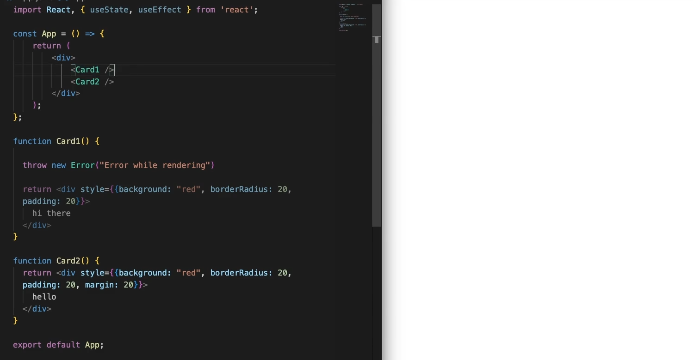 // this is // 2 problem

although you have thrown `ERROR` in the `Card1` component, **Whole Website crashed leading not to load Card2**

:round_pushpin: What we actually want ? -> that if somehow one component gets failed to load up, the other component should take its place and website should work as normal

this is what the `Error handling` do which means ->

Error boundaries are React components that catch JavaScript errors in their child component tree and display a fallback UI (or UI which can load when one component fails to load up)

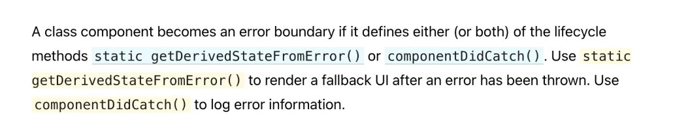

> :pushpin: __Error boundaries only exist in class based components__

to solve the // 2 problem -> write this code (left followed by right)

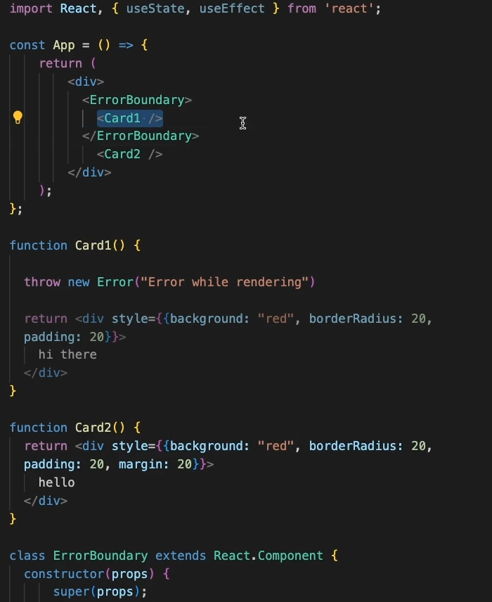 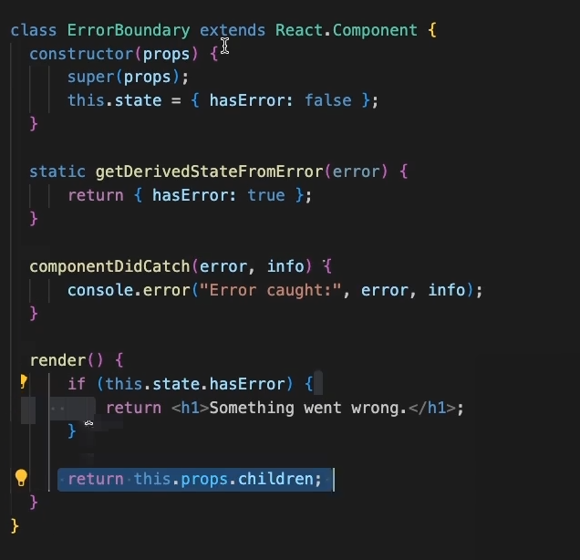

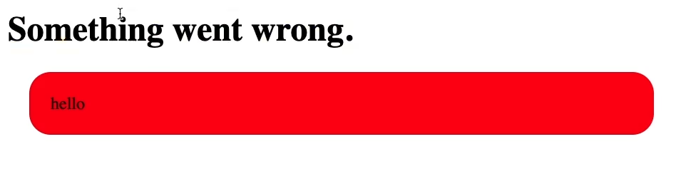

Notice i have wrapped the `Card` component in `ErrorBoundary` and that is how `ErrorBoundary` class is handling. 

**You can see the output if the component `Card1` does not LOAD Up, then also the `Card2` is still loading up and the website is Still in WORK**

> :pushpin: <span style="color:orange">**You can also use this code as Template to avoid ERROR**</span>

**Just use the below Code and copy paste same to same and then wrap the component which has possiblity of getting ERROR inside the `ErrorBoundary` tag (You will see this same code in many different companies)**

```javascript
class ErrorBoundary extends React.Component {
    constructor(props) {
        super(props);
        this.state = { hasError: false };
    }

    static getDerivedStateFromError(error) {
        return { hasError: true };
    }

    componentDidCatch(error, info) {
        console.error("Error caught:", error, info);
    }

    render() {
        if (this.state.hasError) {
            return <h1>Something went wrong.</h1>;
        }
        return this.props.children; 
    }
}
```

> **So its better vulnerable component to wrap it in `ErrorBoundary`**

Sample code is also written below see it :-

```javascript
import React from 'react';

class ErrorBoundary extends React.Component {
    constructor(props) {
        super(props);
        this.state = { hasError: false };
    }

    static getDerivedStateFromError(error) {
        return { hasError: true };
    }

    componentDidCatch(error, info) {
        console.error("Error caught:", error, info);
    }

    render() {
        if (this.state.hasError) {
            return <h1>Something went wrong.</h1>;
        }
        return this.props.children; 
    }
}

const BuggyComponent = () => {
    throw new Error("I crashed!");
};

const App = () => {
    return (
        <ErrorBoundary>
            <BuggyComponent />
        </ErrorBoundary>
    );
};
```
## **Fragments in React**
----------


In React, a component __return a single parent element__, but it can contain multiple children within that single parent

```javascript
const MyComponent = () => {
    return (
        <h1>Hello</h1>
        <p>World</p> // This line will cause an error
    );
};
```

using **Fragments** is simply -> `<></>`  (opening and closing tag)

**Use Case ->** Instead of using a `<div></div>` to **Wrap all the components (which is not good as <div></div> has its own properties and i dont want to execute that properties)**

```javascript
const MyComponent = () => {
    return (
        <>
            <h1>Hello</h1>
            <p>World</p>
        </>
    );
};
```

## **Single Page Applications (SPAs) in React**
----------


Single Page Applications (SPAs) are web applications that __load a single HTML page__ and __dynamically update that page as the user interacts with the app.__ This approach allows for a smoother user experience compared to traditional multi-page applications (MPAs), where each interaction often requires a full page reload.

In mutiple page Applications, **Reloading** takes place as soon as you go from one options(page) to other to update the whole dom according to it to fetch the entire data from the server (**Full Reload Required**)

BUT 

In single page applications, **Reloading** does not take place. When you go from one page to other, Only the necessary part is fetched from the server and then that part is only updated in the DOM.
- Ex - > You have seen in many websites, although you go from one options to another **NavBar** remains the **SAME**.

## **Routing in React**
----------


> its same as __Express Routing__

**Assignment ->** Till now what we are seeing is if we go to `http://localhost:5173` or `http://localhost:5173/courses` Both are loading the same content. I want ki dono routes pe alg-alg content aaye

-> **Two ways to do it ->**

+ **using standard logical way** -> take a `state` variable and track the current tab position and then shift it accordingly (see it on internet)

- **using Library** -> you can use external library known as `react-router-dom`
 
Library to use for routing - "https://reactrouter.com/en/main"

To use it first you have to install it 

**Step 1 ->**

```console
npm install react-router-dom
```

**Step 2 ->** Require these things in the `App.jsx`

```javascript
import {BrowerRouter, Routes, Route} from "react-router-dom"
```

- **BrowserRouter ->** All the **Routes** are wrapped inside this single component. For ex -> if you want to build chrome extension, then this will something like `HashRouter`
- **Routes ->** This is to tell **BrowserRouter** that from here i am going to make **Routes** (<span style="color:orange">**All the Route you want to declare, declare inside this by using `<Route></Route>` tag**</span>)
- **Route ->** This is the tag / component where you **declare all your routes** [Takes 2 things :-]
    + **path ->** basically the **route** at which you want to display the things
    + **element ->** the **component** which you want to display at that route.

**Solution to the assignment**

```javascript
import react from "react"
import {BrowserRouter, Routes, Route} from "react-router-dom"

function App(){
    return(
        <BrowserRouter>
            <Routes>
                <Route path = "/neet/online-coaching-class-11" element = {<class11Program />} />
                <Route path = "/neet/online-coaching-class-12" element = {<class12Program />} />
                <Route path = "/neet" element = {<LandingPage />} />
            </Routes>
        </BrowserRouter>
    )
}

function class11Program(){
    return(
        <div>NEET Programs for class 11</div>
    )
}

function class12Program(){
    return(
        <div>NEET Programs for class 12</div>
    )
}

function LandingPage(){
    return(
        <div>Welcome to Allen</div>
    )
}
```
Now if you go to `http://localhost:5173//neet/online-coaching-class-12` then you will see the tab showing **NEET Programs for class 12th** and so on with other routes

### **Navigating one page from another**
----------


Now i want ki agar me ek Button dbau to kisi aur page pe chla jaye and us page ka content dikhne lge.

#### **1st Way ->** **Make Link to all the routes** (Dumb Way)

```javascript
import react from "react"
import {BrowserRouter, Routes, Route} from "react-router-dom"

function App(){
    return(
        <div>
            // 1st Way 
            // make hyperlinks on which if you will click will redirect to the respective routes(which then will load the custom component due to React Routing) and then style these hyperlinks to make it look like BUTTONs and job done 
            <a href = "/neet">Allen</a> |
            <a href = "/neet/online-coaching-class-11">Class 11</a> |
            <a href = "/neet/online-coaching-class-12">Class 12</a> 

            <BrowserRouter>
                <Routes>
                    <Route path = "/neet/online-coaching-class-11" element = {<class11Program />} />
                    <Route path = "/neet/online-coaching-class-12" element = {<class12Program />} />
                    <Route path = "/neet" element = {<LandingPage />} />
                </Routes>
            </BrowserRouter>
        </div>
        
    )
}

function class11Program()

function class12Program()

function LandingPage()

export default App;
```
But the problem with the above approach -> if you will run this, although it works as expected But **if you see carefully in the url, You will see a LOADER loading up everytime you click on any of these hyperlinks** [It is Re-fetching the whole page] 

-> **Destroyed the principle of SPAs (Single Page Applications)**

#### **2nd Way ->** __using `Link` component present in `react-router-dom`__ (Smart way)

as you have already installed the `react-router-dom` so just **require** the `Link` component from it 

> :pushpin: `Link` component is same as `a` tag just mild changes
>
> > `href` ki jagah `to` and `a` ki `Link` and **finally wrap inside BrowserRouter component**

> :warning: <span style="color:orange">**Remember always use `Link` component inside the `BrowserRouter`, otherwise it will throw ERROR**</span> (will understand why -> in the CONTEXT API section)

```javascript
import react from "react"
import {BrowserRouter, Routes, Route, Link} from "react-router-dom" // requiring Link from the react-router-dom

function App(){
    return(
        <div>
            // 2nd Way 
            // using Link component (Notice it is written inside the BrowserRouter component)
            <BrowserRouter>
                <Link to = "/neet">Allen</a> |
                <Link to = "/neet/online-coaching-class-11">Class 11</Link> |
                <Link to = "/neet/online-coaching-class-12">Class 12</Link> 
                <Routes>
                    <Route path = "/neet/online-coaching-class-11" element = {<class11Program />} />
                    <Route path = "/neet/online-coaching-class-12" element = {<class12Program />} />
                    <Route path = "/neet" element = {<LandingPage />} />
                </Routes>
            </BrowserRouter>
        </div>
        
    )
}

function class11Program()

function class12Program()

function LandingPage()

export default App;
```

> :pushpin: Mostly it is a standard way of declaring the library components that whenver you want to use some of the component present inside some library -> **You always have to wrap inside some upper div**
>
> > For ex -> here `Link` has to be wrapped inside the `BrowserRouter` component

Now if you will run the code, You will **Not see the Loader coming up when going from one page to other** also if you will go to the **Inspect** page you will **see No HTML is coming back from Backend**, this means that now our website has became **Single Page Application (SPAs)**

**Very Very Important Point**

There are two reasons that you want to navigate from one page to other :-

+ **User clicks on something and redirect to other page ->** for this purpose we use `Link`
+ **I want ki user after some time redirect to other page Automatically ->** for this purpose we use `useNavigate` hook 
    + Ex -> You have seen some illegal website where after some time they RE_DIRECT you to something else, this is through `useNavigate` hook in react

#### **3rd way ->** **using `useNavigate` hook**

**Task 3 ->** Now i want ki user after 10 second goes to the landing page if present at some other page. How to achieve this ??

```javascript
import react from "react"
import {BrowserRouter, Routes, Route, Link, useNavigate} from "react-router-dom"  // requiring 1st the useNavigate hook from react-router-dom

function App(){
    return(
        <div>
            <BrowserRouter>
                <Link to = "/neet">Allen</a> |
                <Link to = "/neet/online-coaching-class-11">Class 11</Link> |
                <Link to = "/neet/online-coaching-class-12">Class 12</Link>
                <Routes>
                    <Route path = "/neet/online-coaching-class-11" element = {<class11Program />} />
                    <Route path = "/neet/online-coaching-class-12" element = {<class12Program />} />
                    <Route path = "/neet" element = {<LandingPage />} />
                </Routes>
            </BrowserRouter>
        </div>
        
    )
}

function class11Program()

// lets say i want ki user jb is route pe h to 10 second ke baad LandingPage component pe aa jaye
function class12Program(){
    const navigate = useNavigate()
    return(
        <div>NEET Programs for class 12</div>
        <button>Go to Landing Page</button> // 2
    )
}

function LandingPage()

export default App;
```
Now you can with the help of `useEffect` can achieve the **Task 3**

**Explanation of `// 2` code**

made a button on which if someone will click it will go to the landing page, again two ways to do this either wrapping inside the `Link` component

```javascript
return(
        <div>NEET Programs for class 12</div>
        <Link to = "/"><button>Go to Landing Page</button></Link>        
    )
```

OR as we are using here `useNavigate` component so using it  

```javascript
import react from "react"
import {BrowserRouter, Routes, Route, Link, useNavigate} from "react-router-dom" 
function App(){
    return(
        <div>
            <BrowserRouter>
                <Link to = "/neet">Allen</a> |
                <Link to = "/neet/online-coaching-class-11">Class 11</Link> |
                <Link to = "/neet/online-coaching-class-12">Class 12</Link>
                <Routes>
                    <Route path = "/neet/online-coaching-class-11" element = {<class11Program />} />
                    <Route path = "/neet/online-coaching-class-12" element = {<class12Program />} />
                    <Route path = "/neet" element = {<LandingPage />} />
                </Routes>
            </BrowserRouter>
        </div>
        
    )
}

function class11Program()

function class12Program(){
    const navigate = useNavigate();

    function redirectUser(){
        navigate("/"); // navigate ke andar jahan v le jana chahte the ya jis v route pe le jana chahte the
    }
    return(
        <div>NEET Programs for class 12</div>
        <button onClick = {redirectUser}>Go to Landing Page</button> 
    )
}

function LandingPage()

export default App;
```

**Most of the time `Link` will be used**

### **Making a default page**
----------


if you go to any website say for ex -> https://allen.in and then try to go to **any random route / page inside it, it will show you a default page with (showing page not found or any other thing)** for ex -> if you go to this -> https://allen.in/sdggfoidsfuyereieuhf  (notice i typed random route) so it will show something like this page :-

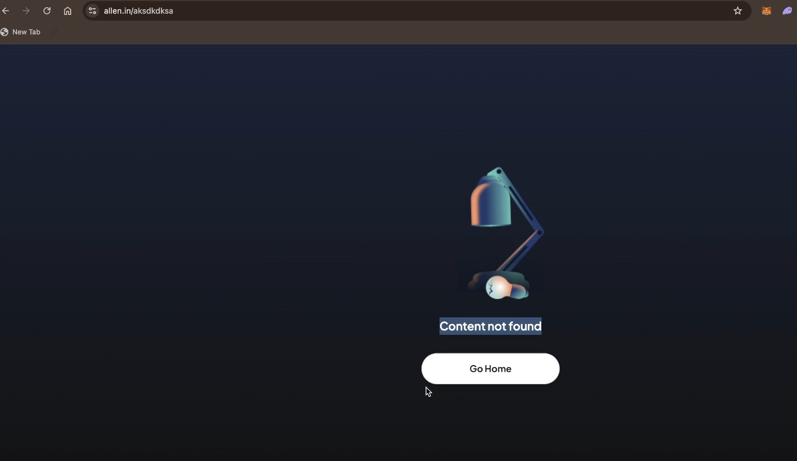

:bulb: **How to achieve this ??**

You have to just add `*` at this place :-

```javascript
import react from "react"
import {BrowserRouter, Routes, Route, Link, useNavigate} from "react-router-dom" 
function App(){
    return(
        <div>
            <BrowserRouter>
                <Link to = "/neet">Allen</a> |
                <Link to = "/neet/online-coaching-class-11">Class 11</Link> |
                <Link to = "/neet/online-coaching-class-12">Class 12</Link>
                <Routes>
                    <Route path = "/neet/online-coaching-class-11" element = {<class11Program />} />
                    <Route path = "/neet/online-coaching-class-12" element = {<class12Program />} />
                    <Route path = "/neet" element = {<LandingPage />} />
                    // Add this Route to make the Error page
                    <Route path = "*" element = {<ErrorPage />} /> // 2
                </Routes>
            </BrowserRouter>
        </div>
        
    )
}

// made an ErrorPage component to show when some random routes has been visited
function ErrorPage(){
    return (
        <div>
            Sorry Page not found
        </div>
    )
}

function class11Program()

function class12Program()

function LandingPage()

export default App;
```

**Explanation of `// 2` code**

It simply means that if none of the above routes (`/`, `/neet/online-coaching-class-11` or `neet/online-coaching-class-12`) are met i.e. -> denoted by **`*`**, then go to the `ErrorPage`

and `ErrorPage` has been now made to show the default content when some random route has been given by user while accessing our website

## **Layouts in React**
----------


**Layouts** lets you wrap every route inside a certain component (think headers and footers)

for ex -> most of the website have constant **navbar (headers)** and **contact us or description page (footers)** like

 

although the middle part always keep changing these remain constant most of the time -> so a better way to do this is to **wrap inside a LAYOUT component**

> :pushpin: Just <span style="color:orange">**Wrap all your `route` inside another parent `route` call it as per your wish (here taken as `Layout`)**</span>

### **about <Outlet /> component**
----------


```javascript
import react from "react"
import {BrowserRouter, Routes, Route, Link, useNavigate} from "react-router-dom" 
function App(){
    return(
        <div>
            <BrowserRouter>
                <Routes>
                    <Route path = "/" element = {<Layout />}> // 1 (wrap all route inside one parent route)
                        <Route path = "/neet/online-coaching-class-11" element = {<class11Program />} />
                        <Route path = "/neet/online-coaching-class-12" element = {<class12Program />} />
                        <Route path = "/neet" element = {<LandingPage />} />
                        <Route path = "*" element = {<ErrorPage />} />
                    </Route>
                </Routes>
            </BrowserRouter>
        </div>
        
    )
}

function Layout(){ // 2

    return (
        <div style = {{height : "100vh", background : "green"}}>
            headers // Header is basically a navbar only and we have made it already
            <Link to = "/neet">Allen</a> |
            <Link to = "/neet/online-coaching-class-11">Class 11</Link> |
            <Link to = "/neet/online-coaching-class-12">Class 12</Link>
            <div style = {{height : "90vh", background : "red" }}>
                <Outlet />
            </div>
            
            footers
        </div>

    )  
}
function ErrorPage()

function class11Program()

function class12Program()

function LandingPage()

export default App;
```
Code Output ->


**Explanation of `// 1` code**

The code simply means that **any route** which starts with `/` will be **Wrapped** inside `Layout` component 

**Explanation of `// 2` code**

This simply is telling the **Layout** that first the **headers** will be there then comes the **DYNAMIC PART** represented by **`<Outlet />`** tag and then comes the **footers** part

**Role of `<Outlet />`**

-> Just remember that all the route present inside the parent route `Layout` (like -> `/neet/online-coaching-class-12` <span style="color:orange">**unme jo v kaam ho rha h wo ab `<outlet/>` me wrap kr diya h (rest all are non-sense things to make point of)**</span>)

**Summary ->** the code is simply saying that any route which will have `/` at the first, it will first load the `Layout` component which indirectly 
+ first renders the `headers`
+ then `<Outlet />` i.e. -> based on the route given the following component will load or render.
    + Ex -> if route given /neet/online-coaching-class-12 then `class12Program` component will load up
+ and finally `footers` will render
  
All of these will render in a single page

> :pushpin: **Layout** as the name suggests used to provide layout to the website **No matter what ever the route is**

> Alhough its not important to use `Layout` but using it will make it easier to **Make changes**
>
> > For ex -> in the above if you want to make the __whole navbar__ color = black just replace the green with black

### **about `useRef` hook**
----------


It has 2 usecase ->

+ reference to a __value__ (slightly hard)
+ reference to __DOM element__

In React, `useRef` is a hook that provides a way to create a __reference to a value or a DOM element__ that persists across renders but does not trigger a re-render when the value changes.

#### __Key Characteristics of `useRef`:-__

1. **Persistent Across Renders**: The value stored in `useRef` persists between component re-renders. This means the value of a `ref` does not get reset when the component re-renders, unlike regular variables.
2. **No Re-Renders on Change**: Changing the value of a `ref` (`ref.current`) does **not** cause a component to re-render. This is different from state (`useState`), which triggers a re-render when updated.

**Task or Problem statement ->**

lets say i have a general form coded as 

```javascript
import react from "react"

function App(){
    return(
        <div>
            Sign up
            <input id = "name" type = {"text"} ></input>
            <input type = {"text"}></input>
            <button>Submit</button>
        </div>
    )
}
```

looks something like this

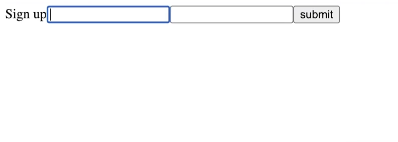

Now i want ki jb bhi `submit` button pr click ho and if **nothing is filled in the input box then the cursor should automatically come to the 1st input box and indicate to fill it**

for this first i have to **know how to select or focus the 1st input box**

to do this we use

#### **about `.focus()` property**

let say you want to **make cursor come at 1st input box whose id is `name`**

to do this just write 

```javascript
document.getElementById("name").focus()

OR to visualise better 

setInterval(() => { // 3 second ke baad cursor aa jayega 'name' id wale input box pe
    document.getElementById("name").focus()
}, 3000)
```

see the video below

<video width="800" height="400" controls>
  <source src="focus_tutorial.mp4" type="video/mp4">
</video>

You can see after 3 second cursor came to the input box automatically

given you know how to focus can you solve the problem statement

```javascript
import react from "react"

function App(){

    function focusOnInput(){
        document.getElementById("name").focus() // jaise he button click hoga ye line chal jayega which will lead to cursor insertion in this element
    }
    return(
        <div>
            Sign up
            <input id = "name" type = {"text"} ></input>
            <input type = {"text"}></input>
            <button onClick = {focusOnInput}>Submit</button>
        </div>
    )
}
```

BUT again __remember the wordings of React -> Avoid using the RAW DOM manipulation try a better way to do it__

so the other thing which does the same thing is 

**useRef hook** -> **create reference for the element you want to work upon**

using it   

first **import it**

```javascript
import {useRef} from "react"
```

now using it   

```javascript
import react from "react"
import {useRef} from "react" // first requiring it

function App(){
    const inputRef = useRef()  // then use it the same way as you use -> useState hook

    function focusOnInput(){
        document.getElementById("name") // 1 
        inputRef.current  // 2

        // after giving reference just do this
        inputRef.current.focus() // 3
    }
    return(
        <div>
            Sign up
            <input ref ={inputRef}  type = {"text"} ></input> // 4 referencing it jahan pr ka reference dena chahte ho
            <input type = {"text"}></input>
            <button onClick = {focusOnInput}>Submit</button>
        </div>
    )
}
```
**Explanation of `// 1` and `// 2` code line**

Both the line **MEANS SAME** `inputRef.current` actually used to focus / select on the current reference which is on the **input box with `name` as id as it has only reference as `inputRef`**. The same thing is done by `document.getElementById`.

now as you have selected the DOM element so to achieve the problem statement just use `inputRef.current.focus()` to make cursor come at the 1st input box and hence the problem is solved.(see `// 3`)

above is the example of **how `useRef` is used to REFERNCE a DOM element (2nd usecase)**

if you have given `id` to any tag -> **You dont need it now as you have already given reference to it** hence removed `name` as `id` in the `// 4` line of code 

to summarize the **usecase**

#### **usecase of `useRef` hook**

1. **Focusing on an Input box** [This is what we have done above]
    + <span style="color:orange">**The above is how to reference to DOM Element**</span>

```javascript
import React, { useRef } from 'react';

function FocusInput() {
  // Step 1: Create a ref to store the input element
  const inputRef = useRef(null);

  // Step 2: Define the function to focus the input
  const handleFocus = () => {
    // Access the DOM node and call the focus method
    inputRef.current.focus();
  };

  return (
    <div>
      {/* Step 3: Attach the ref to the input element */}
      <input ref={inputRef} type="text" placeholder="Click the button to focus me" />
      <button onClick={handleFocus}>Focus the input</button>
    </div>
  );
}

export default FocusInput;
```

Now coming to the 1st usecase which was to give the **reference to Value and change it**

> :pushpin: You can use `useRef` to store the value of something

:bulb: **But why we are doing this using `useRef` hook, to update or store the value we have `useState` hook then whats the difference ??**

-> althoug we can do something like this

```javascript
const [value, setValue] = useState("raman")
```
But the only problem with the `useState` hook is that whenever we use or update the **State variables** <span style="color:orange">**Re-Render of the component in which it is declared happens**</span> **To avoid the component from re-render when the value changes, we use `useRef`**

so to summarise :-

> :pushpin: `useRef` is used to create a reference to a value, such that **when u change the value, the component DOES NOT RE-RENDER**

so you might be thinking that cant i do like this 

```javascript
import react from "react"
import {useRef} from "react" 

function App(){
    const inputRef = useRef() 
    let value = 1 // take a variable 

    function focusOnInput(){
        inputRef.current.focus() 
        value = 2 // and updated it
    }
    return(
        <div>
            Sign up
            <input ref ={inputRef}  type = {"text"} ></input>
            <input type = {"text"}></input>
            <button onClick = {focusOnInput}>Submit</button>
        </div>
    )
}
```
Yes the above logic can also work, component is not going to re-render although you have change the value of variable `value`

BUT

Eventually you will come to know that this logic will make some problem and hard to manage when making dynamic websites

so from all the learning till now 

### **3 ways to define variable in REACT**
----------


1. **define it as STATE variable**
2. **define it as RAW variable** (Rarely used and also not suggested to use it)
3. **define it as REF variable** (see best usecase of it in 3. clock with start and stop functionality)

```javascript
import react from "react"
import {useRef} from "react" 

function App(){

    const [value, setValue] = useState(1); // 1 define as state variable
    let value = 1 // 2 define it as RAW variable
    const valueRef = useRef() // 3 define it as REF variable

    function focusOnInput(){
        inputRef.current.focus()
    }
    return(
        <div>
            Sign up
            <input ref ={inputRef}  type = {"text"} ></input>
            <input type = {"text"}></input>
            <button onClick = {focusOnInput}>Submit</button>
        </div>
    )
}
```
1. **Scoll to Bottom**

```javascript
import React, { useEffect, useRef, useState } from 'react';

function Chat() {
  const [messages, setMessages] = useState(["Hello!", "How are you?"]);
  const chatBoxRef = useRef(null);

  // Function to simulate adding new messages
  const addMessage = () => {
    setMessages((prevMessages) => [...prevMessages, "New message!"]);
  };

  // Scroll to the bottom whenever a new message is added
  useEffect(() => {
    chatBoxRef.current.scrollTop = chatBoxRef.current.scrollHeight;
  }, [messages]);

  return (
    <div>
      <div 
        ref={chatBoxRef} 
        style={{ height: "200px", overflowY: "scroll", border: "1px solid black" }}
      >
        {messages.map((msg, index) => (
          <div key={index}>{msg}</div>
        ))}
      </div>
      <button onClick={addMessage}>Add Message</button>
    </div>
  );
}

export default Chat;
```

3. **Clock with start and stop functionality**

this is the by far the best example to showcase the difference between **`useRef` and `useState`**

**Task ->** you have to build a clock with start and stop functionality. Lets try to build using both the `useRef` and `useState` hook

first **using the `useState` hook**

```javascript
import react from "react"
import {useRef, useState} from "react" 

function App(){
    
    const [currentCount, setCurrentCount] = useState(0)

    function startClock(){
        setInterval(() => { // 1
            setCurrentCount((count) => { // or setCurrentCount(count => count + 1) both will work
                return count + 1;
            });
        }, 1000)
    }

    return(
        <div>
            {currentCount}
            <br />
            <button onClick = {startClock}>Start</button>
            <button onClick = {stopClock}>Stop</button>
        </div>
    )
}
```
**start** krke ek - ek badhana is easy (done by `// 1` logic) but 

:bulb: **How to STOP the clock ?? or in short How and Where will you store the Interval ??** [Main problem]

Its easy -> 

> :pushpin: **Remember `setInterval` returns a value (current value according to the logic), store it in some variable and then just use `clearInterval` to stop the clock**

for ex -> 

```javascript
let timer = setInterval(() => {
    console.log("hi")
}, 5000)

console.log(timer) -> gives the current value of timer(although stored but of no use)
```
Reason ->

```javascript
import react from "react"
import {useRef, useState} from "react" 

function App(){
    
    const [currentCount, setCurrentCount] = useState(0)
    let timer = 0; // 2

    function startClock(){
        timer = setInterval(() => { // 3
                setCurrentCount((count) => { 
                return count + 1;
            });
        }, 1000) // although value of the current value of 'count' is present in timer but i cant pass it or use it to any other function 
    }

    function stopClock(){
        clearInterval(timer) // you cant pass timer here, Its against the function validity zone rules
        // so where to use it so that this becomes valid if you declare timer as RAW variable (see // 2) instead of declaring it for the first time at // 3

        // BUT THIS IS WRONG and will not work as RE-RENDERING is happening everytime the setCurrentCount is called i.e --> timer will reinitialise to 0 on every re-render 
        // That's why you should avoid using RAW variable
        // so what to do -> make timer a state variable (re-render me guarded rhega)
    }

    return(
        <div>
            {currentCount}
            <br />
            <button onClick = {startClock}>Start</button>
            <button onClick = {stopClock}>Stop</button>
        </div>
    )
}
```

using `timer` as state variable 

```javascript
import react from "react"
import {useRef, useState} from "react" 

function App(){
    
    const [currentCount, setCurrentCount] = useState(0)
    const [timer, setTimer] = useState(0) // made the timer state variable

    function startClock(){
        let value = setInterval(() => {
                setCurrentCount((count) => { 
                return count + 1;
            });
        }, 1000)
        setTimer(value)
    }

    function stopClock(){
        clearInterval(timer)
    }

    return(
        <div>
            {currentCount}
            <br />
            <button onClick = {startClock}>Start</button>
            <button onClick = {stopClock}>Stop</button>
        </div>
    )
}
```

__Reason__ that above is NOT the good approach -> see the code **2 baar re-render ho rha h har baar** **ek baar -> currentCount, dusra baar -> timer ke liye** and also as `setTimer` will immediately run whereas `setCurrentCount` will run after 1 second, thus causing the **multiple re-rendering for same case**

The above thing is **Not the Optimal way to do this as multiple re-rendering is happening for the same work**

so to solve this we use `useRef` hook 

using it  

```javascript
import react from "react"
import {useRef, useState} from "react" 

function App(){
    
    const [currentCount, setCurrentCount] = useState(0)
    const timer = useRef() // creating the reference for timer variable 


    function startClock(){
        let value = setInterval(() => {
                setCurrentCount((count) => { 
                return count + 1;
            });
        }, 1000)
        timer.current = value // 2 this will not trigger the timer to re-render instead it will persist the value ('value' me current count ka value store hoga) 
    }

    function stopClock(){
        clearInterval(timer.current) // directly "value" nhi daal skte as against parenthese rule but "timer" to global h to uska use kiya for both STORING(see // 2) and then DISPLAYING
    }

    return(
        <div>
            {currentCount}
            <br />
            <button onClick = {startClock}>Start</button>
            <button onClick = {stopClock}>Stop</button>
        </div>
    )
}
```
> :pushpin: **Basically any value which you dont want to RENDER on the screen (you want to store it) you should make that variable Reference variable**
>
> > You want to persist the value but without re-rendering the component <span style="color:orange">**It is a good middleware between `useState` and `RAW` variable**</span>

The below code shows the same thing as discussed above

Notice the re-renders in both the following codes

```javascript

// UGLY CODE

import React, { useState } from 'react';

function Stopwatch() {
  const [time, setTime] = useState(0);
  const [intervalId, setIntervalId] = useState(null); // Use state to store the interval ID

  const startTimer = () => {
    if (intervalId !== null) return; // Already running, do nothing

    const newIntervalId = setInterval(() => {
      setTime((prevTime) => prevTime + 1);
    }, 1000);
    
    // Store the interval ID in state (triggers re-render)
    setIntervalId(newIntervalId);
  };

  const stopTimer = () => {
    clearInterval(intervalId);

    // Clear the interval ID in state (triggers re-render)
    setIntervalId(null);
  };

  return (
    <div>
      <h1>Timer: {time}</h1>
      <button onClick={startTimer}>Start</button>
      <button onClick={stopTimer}>Stop</button>
    </div>
  );
}

export default Stopwatch;
```

```javascript

// BETTER CODE

import React, { useState, useRef } from 'react';

function Stopwatch() {
  const [time, setTime] = useState(0);
  const intervalRef = useRef(null);

  const startTimer = () => {
    if (intervalRef.current !== null) return; // Already running, do nothing

    intervalRef.current = setInterval(() => {
      setTime((prevTime) => prevTime + 1);
    }, 1000);
  };

  const stopTimer = () => {
    clearInterval(intervalRef.current);
    intervalRef.current = null;
  };

  return (
    <div>
      <h1>Timer: {time}</h1>
      <button onClick={startTimer}>Start</button>
      <button onClick={stopTimer}>Stop</button>
    </div>
  );
}
```

## **Rolling up the state, unoptimal re-renders (State Management)**
----------


As your application grows, you might find that __multiple components need access to the same state variable__ Instead of duplicating state to each component, you can lift the state up to the LCA (**Lowest Common Ancestor**), allowing the common ancestor to manage it

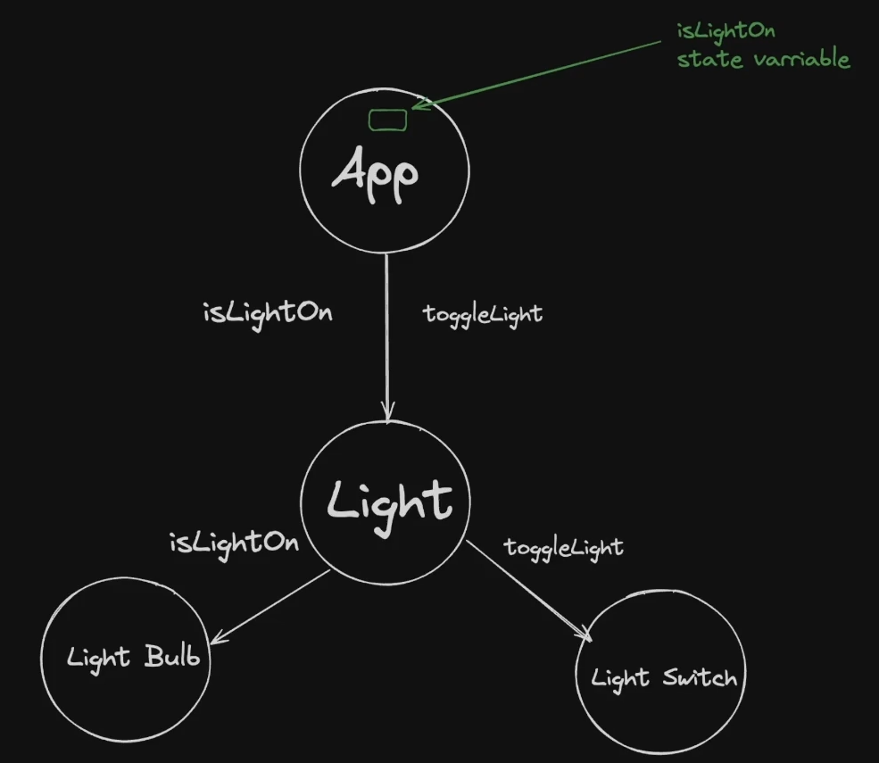

// 1 image

Now lets code the above thing -> 

**Task ->** You have to make a Light Bulb which has a single button (clicking on ti first time will glow the light bulb and if again pressed then it should go off), basically you have to toggle the bulb using that single button

coding up the above task (Notice we are trying to make it same as // 1 image)

```javascript
import React, { useState, useRef } from 'react';

function App(){ // "App" component compares to "App" component in // 1 image
    return (
        <div>
           <LightBulb /> // made a seperate component jahan pr apna logic likhenge
        </div>
    )
}

function LightBulb(){ // we are creating as much component as possible to understand the point // "LightBulb" compare to "Light" in // 1 image
    <BulbState />
    <ToggleBulbState />
}

function BulbState(){ // "BulbState" compare to "LightBulb" in // 1 image
    const [bulbOn, setBulbOn] = useState(true) // 2
    // conditional rendering logic
    return(
        <div>
            (bulbOn ? "Bulb On" : "Bulb Off") 
        </div>
    )
}

function ToggleBulbState(){ // "ToggleBulbState" compare to "LightSwitch" in // 1 image
    return(
        <div>
            <button>Toggle Bulb</button>
        </div>
    )
}
```

But the above code has one problem, **we want ki `setBulbOn` `ToggleBulbState` me v aaye as we toggle krne ka kaam yhi component to kr rha, he needs it** 

Basically, `bulbOn` `BulbState` component ko jarurat h and `setBulbOn` `ToggleBulbState` ko jarurat h. How to solve this in such a way that **state variable copy na ho do jagah and dono me available v ho jaye ??**

so to solve the above problem, <span style="color:orange">**Roll up the state variable**</span> (**means move them ATLEAST one step above to its parent (you can move their state variable More than one step above parent)**) But atleast ek upar wale parent ke pas pahuncha do (**LEAST COMMON ANCESTOR**)

> :pushpin: **Its same as `Inheritance` in OOPS** (If two or more features are common in two or more class then **create another class and with those common features and then make them inherit to the child class**)

Implementing the above concept in the code 

```javascript
import React, { useState, useRef } from 'react';

function App(){
    return (
        <div>
           <LightBulb /> // made a seperate component jahan pr apna logic likhenge
        </div>
    )
}

function LightBulb(){ 
    const [bulbOn, setBulbOn] = useState(true) // ROLLED UP THE POSITION of the state variable
    return(
        <div>
            <BulbState bulbOn = {bulbOn} /> // jisko jo chahiye that wo pass kr diya as PROPS
            <ToggleBulbState setBulbOn = {setBulbOn} />
        </div>
    )
}

function BulbState({bulbOn}){  // and then passed it as PROPS
    return(
        <div>
            (bulbOn ? "Bulb On" : "Bulb Off") 
        </div>
    )
}

function ToggleBulbState({setBulbOn}){ // passed it as PROPS
    // 1st way to do toggle logic 
    function toggle(){
        setBulbOn((currentState) => !currentState)
    }
    // 2nd way to do the above thing 
    function toggle({setBulbOn}){
        setBulbOn((currentState) => {
            if(currentState == true){
                return false;
            }else{
                return true;
            }
        })
    }
    // 3rd way to do the above thing 
    function toggle({setBulbOn, bulbOn}){ // pass "bulbOn" also as props
        setBulbOn(!bulbOn) // calls "setBulbOn" with whatever the value of "bulbOn" is
    }
    return(
        <div>
            <button onClick = {toggle}>Toggle Bulb</button>
        </div>
    )
}
```

**This is what ROLLING UP the state variable is known as**

Now if you want you can roll the state variable `bulbOn` to **App component** also (**Tm upar ke parent me kisi ko v dedo but child me mt rehne dena**) but prefer to use **LCA (Least Common Ancestor)**

You will encounter these situation often jahan pr tumko lgega ki tmko ab ye state ko do jagah use krna h, so you will roll up and then again you will get the same feeling and so you will roll up again and thats how you end up getting so much roll up till finally no roll ups possible and this is it BUT again this is good way to make your projects run BUT BAD WAY TO MAKE IT EFFICIENT 

**This is Bad practice until you learn STATE MANAGEMENT**

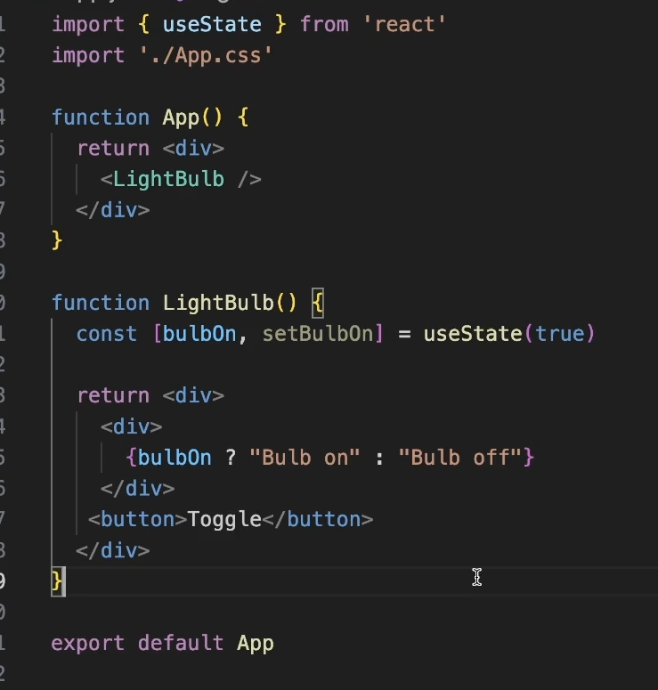

We could have done like the above code, it will work but we actually wanted to learn about the state management and also **In big tech companies, you have to make as much component as possible to make the code cleaner and easier to understand**

The best way to do this -> is using **some State Management Library**

## **Prop Drilling**
----------


**Prop drilling** occurs when __you need to pass data from a higher-level component(Parent) down to a lower-level component that is several layers deep in the component tree (not Immediate Child).__

> :pushpin: as the name suggests, we are indirectly **DRILLING and sending the PROPS till it reach to its specific child**

 This often leads to the following issues:

- **Complexity:** You may have to pass props through many intermediate components that don’t use the props themselves, just to get them to the component that needs them.(<span style="color:orange">**Highly Unreadable**</span>)
- **Maintenance:** It can make the code harder to maintain, as changes in the props structure require updates in multiple components.(<span style="color:orange">**Highly Unusuable**</span>)
    + Ex -> If you want to change the variable name at one place, then you will have to change it at multiple place where that variable is present.

-> As a beginner, you will see that you are facing these issues while dealing with the project 

**Isse hoga kya if your webssite will become large then it will be very hard to pass every props and even those props also which the component does not need (but have to take as prpos as it is needed in lower component)**

Eventually you will see something like this 

```javascript
function Light({bulbOn, setBulbOn, message, setMessages, user, setUser, and many more......}) // too much chaos
```
a sample code of Prop drilling is given below

```javascript
import React, { useState } from 'react';

// App Component
const App = () => {
    const [isLightOn, setIsLightOn] = useState(false);
    
    const toggleLight = () => {
        setIsLightOn((prev) => !prev);
    };
    
    return (
        <div>
          <LightBulb isOn={isLightOn} />
          <LightSwitch toggleLight={toggleLight} />
        </div>
    );
};

// LightBulb Component
const LightBulb = ({ isOn }) => {
    return <div>The light is {isOn ? 'ON' : 'OFF'}</div>;
};

// LightSwitch Component
const LightSwitch = ({ toggleLight }) => {  
  return <button onClick= {toggleLight}>Toggle Light</button>;
};

export default App;
``` 

**How to fix `PROP DRILLING`** -> **CONTEXT API**

## **Context API (used to solve Prop Drilling problem)**
----------


The Context API is a powerful feature in React that enables you to __manage state across your application more effectively, especially when dealing with deeply nested components.__

The Context API provides __a way to share values (state, functions, etc.) between components without having to pass props down manually at every level.__

### __Steps used to create context api__
----------


- **Context**: This is created using `React.createContext()`. It serves as a container for the data you want to share.
    - > :warning: <span style="color:orange">**Always create it outside the component chain means App component ya kisi v component ke andar nhi aana chahiye**</span>
    - Ideally try to **make a seperate file to store all your contexts**
- **Provider**: This component wraps part of your application and provides the context value to all its descendants. Any component that is a child of this Provider can access the context.
- **Consumer**: This component subscribes to context changes. It allows you to access the context value (using `useContext` hook)

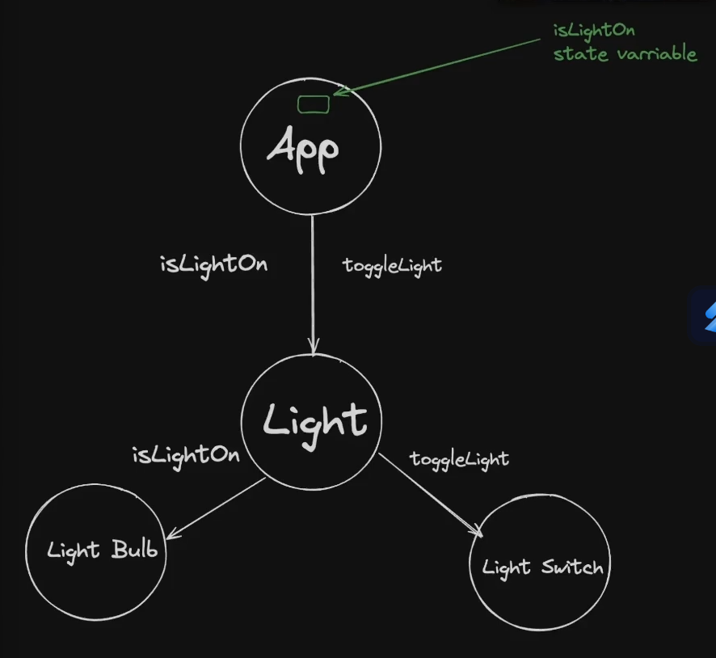

coding up the above picture

```javascript
import React, { useState, useRef } from 'react';

function App(){

    const [bulbOn, setBulbOn] = useState(true) // App has state variable

    return (
        <div>
           <Light bulbOn = {bulbOn} setBulbOn = {setBulbOn} /> // made a seperate component jahan pr apna logic likhenge
        </div>
    )
}

function Light({bulbOn, setBulbOn}){  // iske kuch kaam ka nhi h 'bulbOn' and 'setBulbOn', phir v isko lena pd rha h as iske child ko jarurat h and fot them isko as prop send krna pdega in state variables ko 

// This component is just taking from above and sending it below (IT IS JUST PASSING)

// This is Prop Drilling
    return(
        <div>
            <LightBulb bulbOn = {bulbOn} /> // jisko jo chahiye that wo pass kr diya as PROPS
            <LightSwitch setBulbOn = {setBulbOn} />
        </div>
    )
}

function LightBulb({bulbOn}){ 
    return(
        <div>
            (bulbOn ? "Bulb On" : "Bulb Off") 
        </div>
    )
}

function LightSwitch({setBulbOn}){
    function toggle(){
        setBulbOn((currentState) => !currentState)
    }
    
    return(
        <div>
            <button onClick = {toggle}>Toggle Bulb</button>
        </div>
    )
}
```
If somehow i make the above code look like this :-

```javascript
import React, { useState, useRef } from 'react';

function App(){

    const [bulbOn, setBulbOn] = useState(true)

    return (
        <div>
           <Light /> // No need to send the 'bulbOn' and 'setBulbOn' as props to its child
        </div>
    )
}

function Light({bulbOn, setBulbOn}){ // No need to TAKE the props from parent 
    return(
        <div>
            <LightBulb />  // Nor do i have to PASS it back to the child 
            <LightSwitch />
        </div>
    )
}

function LightBulb({bulbOn}){ 
    return(
        <div>
            (bulbOn ? "Bulb On" : "Bulb Off") 
        </div>
    )
}

function LightSwitch({setBulbOn}){
    function toggle(){
        setBulbOn((currentState) => !currentState)
    }
    
    return(
        <div>
            <button onClick = {toggle}>Toggle Bulb</button>
        </div>
    )
}
```
Dont you think the above code looks more cleaner and better, RIGHT ?? this will be achieved by CONTEXT API

let see how to do it by using CONTEXT API 

following the steps given in [Jump to Context API Steps](#steps-used-to-create-context-api)

```javascript
import React, { useState, useRef } from 'react';

// STEP 1 [CONTEXT] -> make a context outside the component chain

const bulbContext = React.createContext() // either write this way or if you import 'createContext' from 'react' then you can directly use it 

import React, {useState, createContext} from 'react'

const BulbContext = createContext() // 3 directly used it 
// as you have defined GLOBAL CONTEXT VARIABLE to kahin v use kro code will work

function App(){
    const [bulbOn, setBulbOn] = useState(true)

// STEP 2 [Provider] -> Provide all the values which you want to the children of the parent Jo <BulbContext.Provider></BulbContext.Provider> me wrapped h (phle wrap kro then provide the value)

    return (
        <div>
            <BulbContext.Provider value = { // 2 providing the values you want to send it to the child
                bulbOn : bulbOn,
                setBulbOn : setBulbOn
            }> 
                <Light /> // as mujhe 'Light' ke SARE CHILD (here 'LightBulb' and 'LightSwitch' iske child) me context pahunchana h or more precise TELEPORT krwana h (so this component has been WRAPPED inside the <BulbContext.provide> me) 
            </BulbContext.Provider>
        </div>
    )
}

function Light(){
    return(
        <div>
            <LightBulb />
            <LightSwitch />
        </div>
    )
}

// STEP 3 [Consumer / using it] -> jis v component me use krna chahte ho (only those will be used whose value was sent initally), usme use kro with the help of 'useContext' hook

function LightBulb(){ 
    const {bulbOn} = useContext(BulbContext) // as here i want to use 'bulbOn' in LightBulb component so used useContext to directly IMPORT IT
    return(
        <div>
            (bulbOn ? "Bulb On" : "Bulb Off") 
        </div>
    )
}

function LightSwitch(){
    const {setBulbOn} = useContext(BulbContext) // as here 'setBulbOn' need to be used so used useContext to directly IMPORT IT OR
    const {setBulbOn, bulbOn} = useContext(BulbContext) // you can also IMPORT multiple context variable but as yahan pr setBulbOn he use ho rha h to bas whi IMPORT kiya 
    function toggle(){
        setBulbOn((currentState) => !currentState)
    }
    
    return(
        <div>
            <button onClick = {toggle}>Toggle Bulb</button>
        </div>
    )
}
```

Now can you see the above code looks so much cleaner and easier to read
- __No PROPS PASSING as argument__ (Clutter free Argument of function / component)
- __No FORCEFUL PROPS RECIEVING and PASSING__ ( you can see in the above example -> `Light` component me jara koi v props nhi pass hua h as usko jaruart he nhi tha jo props declare hue h)
- solved the problem of __PROP DRILLING__

**Explanation of `// 2` code**

You can provide any other datatypes also for ex -> Array, Strings, Objects (you have seen above only, or any other things which you want ki child ko pass on kre can be given here)

for ex -> 

```javascript
<BulbContext.Provider value = "Satyam"> 
    <LightSwitch /> // isse LightSwitch ke jitne v child h sbke pas access ho jayega "Satyam" string ka 
</BulbContext.Provider>
```

> :pushpin: <span style="color:orange">**Remember ->**</span> **Jisme v WRAP kroge `.Provider` component ko uske SARE CHILD ke pas access ho jayega usme provided VALUE ka through the CONTEXT**

**Explanation of `// 3` code**

`BulbContext` variable me basically jo value tm **provide** kiye ho using `.Provider` wo isme **STORE hoga** 
- For ex -> for the above case `BulbContext` me ye store hoga (as tmne yhi provide kiya h)

```javascript
{
    bulbOn : bulbOn,
    setBulbOn : setBulbOn
}
```

Now making it more READABLE than before -> Instead of writing like this (i mean why i need to show to the user that i am sending or providing these values it should be ENCAPSULATED) to do this -> you should WRAP IT IN ANOTHER COMPONENT simple

```javascript
return (
    <div>
        <BulbContext.Provider value = {
            bulbOn : bulbOn,
            setBulbOn : setBulbOn
        }> 
            <Light /> 
        </BulbContext.Provider>
    </div>
)
```
wrapping it in another parent component

by doing the below thing, you have also now learnt **how to make the custom provider**

```javascript
export function BulbProvider({children}){ // pass the children jisme tmko use krna h (here -> Light compnent me wrap kr diya)
    const [bulbOn, setBulbOn] = useState(true); // define here the state variable as isi me wrap kroge 

    // Wrap kr diya to ENCAPSULATE ho gya
    // REMEMBER TO RETURN THE COMPONENT otherwise work nhi krega
    return <BulbContext.Provider value = {
        bulbOn : bulbOn,
        setBulbOn : setBulbOn
    }> 
       {children}  // as children me ko he to wrap krna h
    </BulbContext.Provider>
}

// now just use BulbProvider and your App component here will look like this -> much more cleaner (and user dont know how its working under the hood)

function App(){ 
    // no need to give state variable as wo already wrap kr diya gya h Parent component BulkProvider me
    return <BulbProvider>
        <Light />
    </BulbProvider>
}
```

But again 

**Context API has some Problems also :-**

<span style="color:orange">**Context API doesnt OPTIMISE the codebase, it does not OPTIMISE the number of RE-RENDERS**</span> and hence for this purpose only we use **STATE MANAGEMENT LIBRARY like -> recoil, redux, zoo standard, mobx, etc..** (they optimise the re-render also)

Lets see the above point through the code 

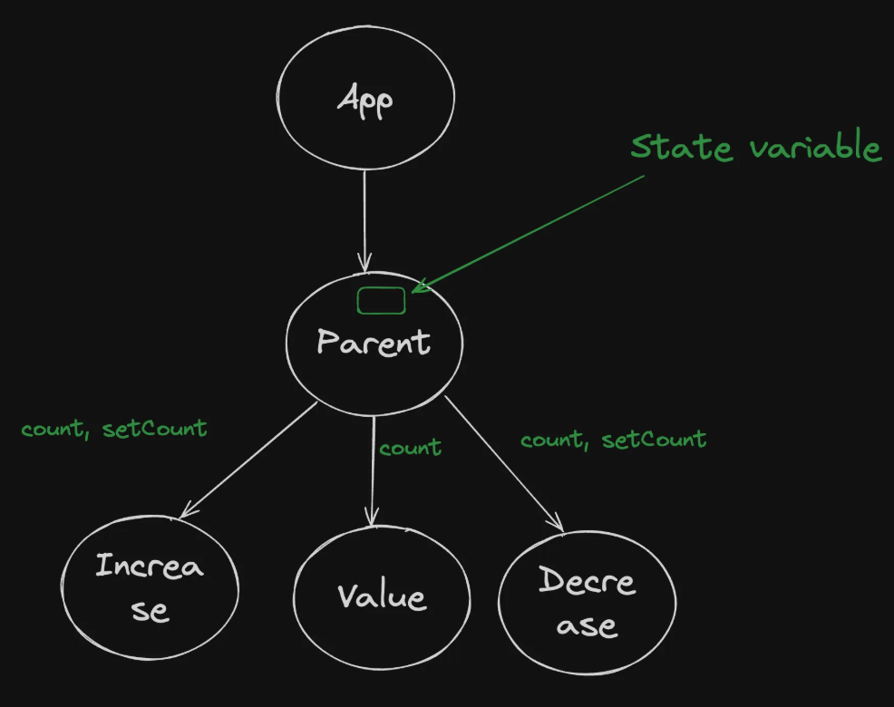

coding the above thing in [Testing the Context API](#testing-the-context-api)

### **Testing the Context API**
----------


```javascript
import React, { createContext, useContext, useState } from 'react';

const CountContext = createContext(); // creating the context variable 'CountContext'

function CountContextProvider({ children }) { // Making a wrapper function 
  const [count, setCount] = useState(0); // Defined the 'countState' variable

  return (
    <CountContext.Provider value={{count, setCount}}>
        {children}
    </CountContext.Provider>
  )
}

// App Component
const App = () => {
    return(
        <div>
            <Parent />
        </div>
    ) 
};

function Parent() {
  return (
    <CountContextProvider> // Wrap it (means iske andar 'Increase', 'Decrease' and 'Value' AND ISKE BHI SARE CHILD(agar hue to) ko state variable 'count' ka access mil jayega)
      <Increase />
      <Decrease />
      <Value />
    </CountContextProvider>
  );
}

function Increase() {
    const {count, setCount} = useContext(CountContext);
    return(
        <button onClick={() => setCount(count + 1)}>Increase</button>;
    ) 
}

function Decrease() {
  const {count, setCount} = useContext(CountContext);
  return(
    <button onClick={() => setCount(count - 1)}>Decrease</button>;
  ) 
}

function Value() {
  const {count} = useContext(CountContext);
  return(
    <p>Count: {count}</p>
  ) 
}

export default App;
```

Now coming to the optimisatio part, although there is no change happening in `Increase` or `Decrease` button still **this is also re-rendering**, dont you think only `Count` is changing so it should **only re-render** so to **SELECTIVELY re-render a particular component you should use STATE MANAGEMENT LIBRARY**

for just the introduction purpose, the below code uses **RECOIL** so (dont get overwhelmed if you dont understand as we will study about it later)

```javascript
import React, { createContext, useContext, useState } from 'react';
import { RecoilRoot, atom, useRecoilValue, useSetRecoilState } from 'recoil';

const count = atom({
  key: 'countState', // unique ID (with respect to other atoms/selectors)
  default: 0, // default value (aka initial value)
});

function Parent() {
  return (
    <RecoilRoot>
      <Incrase />
      <Decrease />
      <Value />
    </RecoilRoot>
  );
}

function Decrease() {
  const setCount = useSetRecoilState(count);
  return <button onClick={() => setCount(count => count - 1)}>Decrease</button>;
}

function Incrase() {
  const setCount = useSetRecoilState(count);
  return <button onClick={() => setCount(count => count + 1)}>Increase</button>;
}

function Value() {
  const countValue = useRecoilValue(count);
  return <p>Count: {countValue}</p>;
}

// App Component
const App = () => {
  return <div>
    <Parent />
  </div>
};

export default App;
```

can you see the similarity between using the `Context API` and using some state management libraray like `Recoil` (the only difference is that they give some function which **Optimise it**)

to see the similarity 

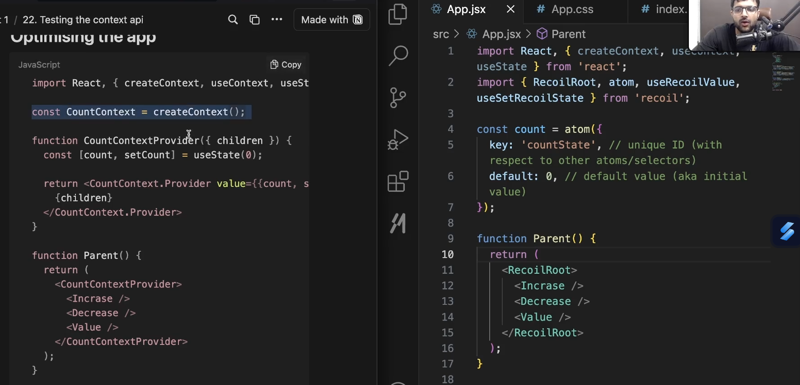

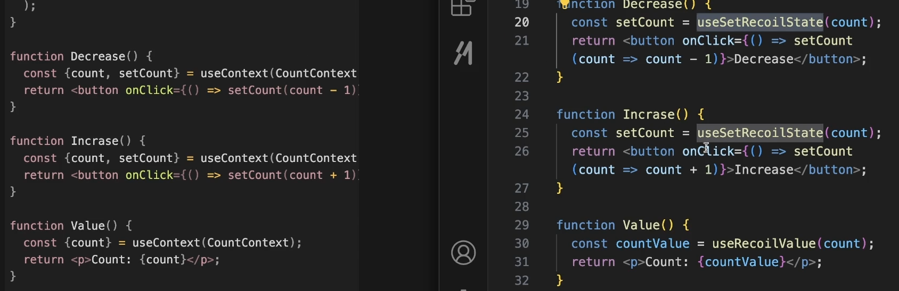

**Left side -> using CONTEXT API** and **Right side -> using RECOIL**

<span style="text-decoration: underline; text-decoration-color: white; text-decoration-thickness: 2px;">**1st similarity**</span>

**in left side ->** you are creating a `CountContext` variable to get all the power of `createContext()` and

**in right side ->** you are creating a `count` variable via the `atom` function defined in `recoil` library to get a power

<span style="text-decoration: underline; text-decoration-color: white; text-decoration-thickness: 2px;">**2nd Similarity**</span>

**in left side ->** here you have created your own wrapper component called as `CountContextProvider`

**in right side ->** here you have wrapped the component inside the `RecoilRoot` component coming from the `recoil` library

<span style="text-decoration: underline; text-decoration-color: white; text-decoration-thickness: 2px;">**3rd Similarity**</span>

**in left side ->** here `Decrease` gets the `count` from `useContext` same thing is for `Increase`

**in right side ->** here `Decrease` gets the `count` from `useSetRecoilState` coming from the `recoil` library same thing is for `Increase`

<span style="text-decoration: underline; text-decoration-color: white; text-decoration-thickness: 2px;">**4th Similarity**</span>

**in left side ->** here `Value` component gets the `count` from `useContext`

**in right side ->** here `Value` component gets the `count` from the `useRecoilValue` coming from the `recoil` library

so both have almost same structure and works almost same under the hook (**Except unnecessary re-renders is avoided by the STATE MANAGEMENT LIBRARY**)

## **Creating Custom Hooks**
----------


Custom hooks in React are a powerful feature that allows you to __encapsulate and reuse stateful logic across different components.__ *They are essentially JavaScript functions that can use React hooks internally.* By creating custom hooks, you can encapsulate away complex logic, making your components cleaner and more manageable.

__Why Use Custom Hooks?__

1. **Reusability**: If you find yourself using the same logic in multiple components, a custom hook can help you avoid code duplication.
2. **Separation of Concerns**: They allow you to separate business logic from UI logic, making your components more focused and easier to understand.

**How to write you custom hooks ??**

hooks are simply **FUNCTION** with some conditions :-

+ Its name should start with `use`
+ It should IDEALLY __use another hook under the hood__ (like `useState`, `useEffect` or any other....)


**Task ->** Lets try to build our own custom hook known as `useCounter` hook

### **`useCounter` hook**
----------


first creating a counter function 

```javascript
import {useState} from 'react'

function App(){
    const [count, setCount] = useState(0);
    function increaseCounter(){
        setCount(count => count + 1);

    }

    return (
        <div>
            <button onClick = {increaseCounter}>Increase {count}</button>
        </div>
    )
}

export default App
```
Now trying to introduce the custom hook here 

```javascript
import {useState} from 'react'

// Introducing the custom hook

function useCounter(){
    // shifted all the logic from App to the custom hook declared here

    const [count, setCount] = useState(0);
    function increaseCounter(){
        setCount(count => count + 1);

    }
    // What should this return ??
    // as App component kya return kr rha tha ya KISPE NIRBHAR THA WHILE GIVING OUTPUT -> {increaseCounter} and {count} pe right (upar jake dekho App component me return kya kr rha tha) ?? to usi ko return krwa do
    return(
        count : count,
        increaseCounter : increaseCounter
    )
}


function App(){
    const {count, increaseCounter} = useCounter() // passed on as props from useCounter hook defined above (see it curly braces h, square bracket nhi)
    // kya pass kiya ?? -> Ek variable count and a function called as increaseCounter

    return(
        <div>
            <button onClick = {increaseCounter}>Increase {count}</button>
        </div>
    )
    
}

export default App
```

can you see the difference between the previous `App` component and the above `App` component (the above one looks **clutterfree and cleaner**), although you can say that still the whole codebase looks complex as code has been just shifted up only BUT remember, **Hooks are made not to show how it works, Its WORKING is generally  ENCAPSULATED, you just have to use it** and hence here `useCounter` code will become encapsulated and hence will not be visible.

**Now you can use `useCounter` hook in any of the component**

Lets see where it is helping 

```javascript
import {useState} from 'react'

function useCounter(){

    const [count, setCount] = useState(0);
    function increaseCounter(){
        setCount(count => count + 1);

    }

    return(
        count : count,
        increaseCounter : increaseCounter
    )
}


function App(){

    return(
        <div>
            <Counter />
            <Counter2 />
        </div>
    )
    
}

function Counter(){ // 1
    const {count, increaseCounter} = useCounter()

    return(
        <div>
            <button onClick = {increaseCounter}>Increase {count}</button>
        </div>
    )
}

function Counter2(){ // 2
    const {count, increaseCounter} = useCounter()

    return(
        <div>
            <button onClick = {increaseCounter}>Increase {count}</button>
        </div>
    )

}

export default App
```
The above is the situation when making **custom hook** is beneficial (alhough tm iske bina v kr skte the)

**Notice** -> `// 1` and `// 2` both the component are using the **SAME LOGIC** so why not to **Wrap all of them in one hook or function that does the same thing (You just have to call it)**, thats exactly what `useCounter` hook is doing here 

simply saying -> **Tmhare pas koi code tha jo dono `Counter` and `Counter1` me common tha and hence tmne usko uthake encapsulate kr diya and put it inside the `useCounter` hook**

### **`useFetch` hook** (Common Interview Question)
----------


In interview, you will be just given the word `useFetch` and you have to only think that how it will work and more importantly **What it will work ??**, you can ask but it will create negative impact generally unless and until its very complicated word 

so lets try to do in that way only 

`useFetch` -> How you **fetch** the data from **backend** ?? -> using `.fetch` right so you have to make that only. you have to make a hook which will **fetch the data from url when using it** 

Now some **key points ->** 
+ as you are getting mostly or dealing mostly with `JSON` data which is generally **OBJECT datatype** so make sure to use it  

now dealing with the problem 

```javascript
import {useState, useEffect} from 'react'


function App(){
    const [post, setPost] = useState({}) // Intitally taken EMPTY OBJECT as data OBJECT format me aayega

    async function getPosts() { // 3
        const response = await fetch(URL)
        const json = response.json() // data kuch v datatype me aaye mujhe to JSON me chahiye 
        setPost(json) // this setPost function will simply store the data came inside the 'json' variable to 'post' state variable  
        
    }

    // when this component gets mounted on the screen i.e. -> when it gets mounted on the screen 
    // hence used useEffect 
    useEffect(() => { // 1
        post = fetch(URL) // 2 Either do this (which will get complicated see reason in the Explanation)
        getPosts() // OR make a function to get the data (which is more practical) go to // 3
            
    },[])

    return (
        <div>
            {post.title} // got the 'title' from the 'post' variable
        </div>
    )

}
```

**Explanation of `// 1` code and WHY USED `useEffect` hook also ??**

-> Use your commonsense, what we want ki **jb ye(here App) component mount ho to data fetch ho and thats exactly what we have written inside the `useEffect` callback function**

:bulb: __Now you may have question in your mind that__ -> websites to continuously data ko update krte rehti h by fetching the data continuously and usko phir render krwana hota h so that user can get the live data for what he needs to do, then how using `useEffect` will help in this `useState` is more better dont you think ??

-> you forgot the basics, you have written `post` inside the `useEffect` hook (although you have not directly put inside, but indirectly through `getPosts` function, `post` is INSIDE the `useEffect` hook only) and we all know that **state variable are capable of rendering the changes themselves on the screen whenever there is some change / update in state variable occurs (RE-RENDERING of COMPONENT) occurs automatically, so here `useEffect` is just for mounting the data on the first time the code gets executed**


:bulb: **Explanation of `// 2` and why decided to make a seperate function (`// 3`) instead of doing like `// 2` ??**

-> Reason for this is whenver you are dealing with **DATA FETCHING or any other process which requires to implement request-response relationship from the server, we should declare it `async` as to do this it takes time and in the meantime you dont want your website to just stuck in this phase and wait for the response from the server (You already know why and how `async` function works)** and the problem with `useEffect` hook is that <span style="color:orange">**you cant make the callback function or indirectly the first argument as `async`, ITS NOT ALLOWED**</span>

> :warning: <span style="color:orange">**Remember ->**</span> **you cant make the callback function or indirectly the first argument as `async`, ITS NOT ALLOWED**
>
> > for ex ->
``` javascript
useEffect(async () => {  // making the first argument async NOT ALLOWED
    post = fetch(URL)
            
},[])
```

so thats why **made a seperate `async` function `getPosts` to fetch the data from the server**

Now as you have **completed writing your logic, so just copy paste and do what you have done while making other custom hook(like `useCounter`)** -> you can do this also or lets **do it in the real 'react' way**

+ create the seperate fplder name it as `Hooks` or anything as per your wish and then **copy paste the logic** in the file named as `useFetch.js`

making the necessary changes and writing the custom hook inside the file `useFetch.js`

```javascript
import {useState, useEffect} from 'react'

export function useFetch(){ // Copy pasted the logic
    const [post, setPost] = useState({}) 
    async function getPosts() { 
        const response = await fetch(URL_given_by_me)
        const json = response.json() 
        setPost(json)  
        
    }
      
    useEffect(() => { 
        getPosts()     
    },[])

    return post  // last me 'post' variable return kr dia as it contains the data 
    return post.title // you can ALSO do this isse sirf 'post' ke andar pda 'title' ka value he return krega (if some json data me 'title' naam ka key nhi hoga to phir error throw krega so make sure that otherwise pura ka pura 'post' he bhej do)
}
```
Now using the made custom hook inside the `app.js`

```javascript
import {useState} from 'react'
import {useFetch} from './Hooks/useFetch' // Notice how we are importing just as the other hook do from react


function App(){
    const postData = useFetch() // either do this or (as useFetch bas 'post' he return kr rha h to postData naam ke variable me tmne store kr liya)
    const {post} = useFetch() // do this (but lets say wo aur v kuch return kr rha hota alongwith 'post' and TMKO BAS 'post' ka he data chahiye hota to ye wala SYNTAX is more good, although above will also be correct but usse to sara data aa jayega then usme se 'post' ka data alag kro and then use kro (complicate kiya tmne))

    // Hope you understood the difference between the two way of using your custom hook written above

    return (
        <div>
            {post.title}
        </div>
    )
}
```

> :pushpin: <span style="color:orange">**Remember ->**</span> **You cannot use any hook inside any normal function, If you are doing so that simply means you are trying to create your CUSTOM HOOK**

Now making a **more GENERIC form of `useFetch`** that will accepts and URL and give **all the data it fetches from the URL it TAKES AS INPUT**

making another file named as `useFetchWithUrl.js` to make the hook -> `useFetchWithUrl`   

```javascript
import {useState, useEffect} from 'react'

export function useFetchWithUrl(URL_from_the_sender){ // Copy pasted the logic
    const [finalData, setFinalData] = useState({}) 
    async function getDetails() { 
        const response = await fetch(URL)
        const json = response.json()  
        setFinalData(json)
        
    }
      
    useEffect(() => { 
        getDetails()     
    },[])

    return {
        finalData : finalData
    }
}
```
Now using our custom hook `useFetchWithUrl` in `App.js`

```javascript
import {useFetchWithUrl} from './Hooks/useFetchWithUrl'

function App(){
    const {finalData} = useFetchWithUrl(URL_GIVEN_BY_USER)

    return (
        <div>
            {JSON.stringfy(finalData)}
        </div>
    )
}
```

**Difference between `useFetch` and `useFetchWithUrl`**

The only difference between the `useFetch` and `useFetchWithUrl` is that in the `useFetch` hook, you are **Hardcoding the URL value (you are giving a specific url link)** but in `useFetchWithUrl` you are not doing the above thing, **you have made it more GENERIC by making it ACCEPT url link from the user only and then fetching its data** (means user can give you ANY url, and data will get fetched without you manually giving the url link as in the case of `useFetch`)

BUT still in the above code there is a **BUG** can you see it ??

:bulb: Lets say i have to make a system which is very common in the website that you have button and if you click on it you go to some other section (now this other section which gets load up is getting its data from the server through API) so as we have made our custom `useFetchWithUrl` hook lets use it to solve this 

```javascript
import {useFetchWithUrl} from './Hooks/useFetchWithUrl'

function App(){
    const [currentPost, setCurrentPost] = useState(1) // by default currentPost = 1 means 1 ka load kr do 
    const {finalData} = useFetchWithUrl("URL_GIVEN_BY_USER/" + currentPost) // 2 now agar currentPost ka value 2 hoga to 2nd tab me '2' ka data fetch hoga and so on with other 
    // basically you made this tab to load its corresponding content when going through it via the url fetching

    return (
        <div>
            <button onClick = {() => setCurrentPost(1)}>1st tab</button> // simply means if you click on this button then 'setCurrentPost', 'currentPost' me value = 1 daal dega and so on with other buttons
            <button onClick = {() => setCurrentPost(2)}>2nd tab</button>
            <button onClick = {() => setCurrentPost(3)}>3rd tab</button>
            {JSON.stringfy(finalData)}
        </div>
    )
}
```
This code should work as we have defined a state variable `currentPost` and as soon as you click on `2nd tab` written button, `currentPost` (state variable) value changes to **2** and as **state variable has changed RE-RENDERING of the component (here App) will occur(means whole code will now run once again) and in this process it will come at line `// 2` where data will be fetched according to the `2nd tab` and will be shown that only**, Looks like the job done and even if you will `console` it then also it will work as expected 

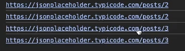

Notice doing `console.log(url)` in `useFetchWithUrl` logic you can see that on clicking the button it is getting called

But Now comes the problem, you will not **see any update on the screen, it will still stick to the `1st tab` although `2nd tab` button has been clicked and is showing the `1st tab` `finalData` only**

**Reason for above is ->** carefully see the logic you made for custom hook `useFetchWithUrl` 

```javascript
import {useState, useEffect} from 'react'

export function useFetchWithUrl(URL_from_the_sender){ 
    const [finalData, setFinalData] = useState({}) 
    async function getDetails() { 
        const response = await fetch(URL)
        const json = response.json()  
        setFinalData(json)
        
    }
      
    useEffect(() => {  // 2 here is the problem
        getDetails()     
    },[])

    // 3 
    useEffect(() => {
        getDetails()
    },[URL])

    return {
        finalData : finalData
    }
}
```
see the `// 2` code -> You have wrapped the `getdetails()` function inside `useEffect` hook and **Dont you know `useEffect` hook bas mount hone ke time pe he chalta h UNLESS AND UNTILL dependency array me kuch nhi ho to** and hence as ye sirf EK BAAR he chla (at the time of mounting so update he nhi ho rha screen pe although internally sb cheez chal rha h)

so **to fix it ->** see `// 3` means just put `URL_FROM_THE_SENDER` inside the dependency array means -> **anytime there is a change in the URL, `getDetails` function should run**, previously we were running `getDetails` function ONLY ONCE, to `fetch(URL)` statement ek baar chlta tha isliye **dusra data load nhi hota tha and hence default tab `1st tab` ka he data dikhta tha** now we are saying that every time the `url` changes, run the `getDetails` function.

:bulb: __Now you can have a question that why not to call `getDetails` always instead of wrapping inside  the `useEffect` hook ??__ (something like the below)

```javascript
import {useState, useEffect} from 'react'

export function useFetchWithUrl(URL_from_the_sender){ 
    const [finalData, setFinalData] = useState({}) 
    async function getDetails() { 
        const response = await fetch(URL)
        const json = response.json()  
        setFinalData(json)
        
    }
      
    getDetails()  // why dont call it always ?    
    return {
        finalData : finalData
    }
}
```
If you know the basics, you can easily figure out the problem with this approach

once `getDetails` function runs it will eventually come at line where it written `setFinalData(json)` which will again **RE-REnders the component** (causing the whole component code to AGAIN RUN) and then again `getDetails` will run and hence **you will get stuck inside an INFINTIE LOOP**

Now lets make it more optimistic. you have seen that while going from one tab to another and loading that tab data on the scrren, website show you a `loader` also (like sandhourglass, cirleloader, etc...) lets **include that also**

making changes inside the `useFetchWithUrl.js` or indirectly `useFetchWithUrl` hook

```javascript
import {useState, useEffect} from 'react'

export function useFetchWithUrl(URL_from_the_sender){ 
    const [finalData, setFinalData] = useState({}) 
    const [loading, setLoading] = useState({false})

    async function getDetails() {
        setLoading(true) // you can also write setLoading(val => true) // same thing
        // just before the URL fetching, give the 'loading' value = true
        // simply saying request jane ke time pe 'true' 
        const response = await fetch(URL)
        const json = response.json()  
        setFinalData(json)
        setLoading(false) // and once everyting came up then its time to show them, so no more loading so set its value again to 'false'
        // response aane ke time pe 'false'
        
    }

    useEffect(() => {
      getDetails()
    }, [URL])
      
    return {
        finalData : finalData
        loading : loading // return not just finalData but also the 'loading' 
    }
}
```

Now just make slight changes in the `App.js`

```javascript
import {useFetchWithUrl} from './Hooks/useFetchWithUrl'

function App(){
    const [currentPost, setCurrentPost] = useState(1) 
    const {finalData, loading} = useFetchWithUrl("URL_GIVEN_BY_USER/" + currentPost) // imported 'loading' also as it is being exported

    // Now be creative with loading variable value i.e. make a custom loading animation or any other thing (here for simplicity used just a div with Loading... written inside it)
    if(loading){
        return (
            <div>
                Loading...
            </div>
        )
    }
    return (
        <div>
            <button onClick = {() => setCurrentPost(1)}>1st tab</button> 
            <button onClick = {() => setCurrentPost(2)}>2nd tab</button>
            <button onClick = {() => setCurrentPost(3)}>3rd tab</button>
            {JSON.stringfy(finalData)}
        </div>
    )
}
```
see the demo here in this video ->

<video width="800" height="400" controls>
  <source src="useFetch_tutorial.mp4" type="video/mp4">
</video>

Now further making one more advancement and the answer to one of your concepts that how the website **re-fetch** the data when the data gets updated

just add the below line of code to make it work like the above in `useFetchWithUrl.js`

```javascript
import {useState, useEffect} from 'react'

export function useFetchWithUrl(URL_from_the_sender){ 
    const [finalData, setFinalData] = useState({}) 
    async function getDetails() { 
        const response = await fetch(URL)
        const json = response.json()  
        setFinalData(json)
        
    }
      
    useEffect(() => {
      getDetails()
    }, [url])

    // Add these line of code to make the website change dynamically when the update occurs in the backend server
    useEffect(() => {
        setInterval(() => {
            getDetails()           
        }, 10 * 1000);  // after every 10 second, it will run the 'getDetails' function and fetch the data from the backend server to update it on the screen
        // it will load automatically
    },[])
      
    return {
        finalData : finalData
    }
}
```

### **`usePrev` hook** (one of the hardest hook)
----------


:bulb: **What does `usePrev` hook do ??**

-> as the name suggests, **It is used to just get the PREVIOUS VALUE of the state variable** it has many usecase like one common usecase is -> 
+ getting the last played song info. (although it can be done with array traversal but it can be done with this also)

can you guess what are the hooks you will use to make this custom hook. Lets try to **analyse the requirements** and based on it, see which hook are doing what and are fitting on that place -> 

> :pushpin: <span style="color:orange">**Ideally you should approach this in this manner only**</span>

+ first of all, we need a **state variable jiska previous value chahiye** so **`useState` hook will be used**
+ now to get the previous value, **we have to store it somewhere** remembered the 3 ways to store something in `react`
    + **using `useState` ->** not possible here as tmne already state variable declare kr diya h and that is responsible for updating the value, if you will make another, to **Re-rendering** will also occur and we generally have to avoid it  
    + **using `RAW variable` ->**  Not suggested to use this as dynamic h hook
    + **using `useRef` ->** This is the perfect hook to store the previous value as **It stores the value without RE_RENDERING the component** 
    + **so `useRef` hook will also be used**
+ Now we will also use `useEffect` hook as we want ki jb v `value` change ho to wo reflect ho 

now coding it up

first `App.js`

```javascript
import {useState} from 'react'
import {usePrev} from './hooks/usePrev'

const [state, setState] = useState(0); // Step 1 -> made a state variable -> 'state' for the current value 
const prev = usePrev(state); // Step 2 -> made a custom hook and passed on 'state' state variable value as ARGUMENT as isko current value to chahiye he tbhi to iska previous value dega 

function App() {
    return (
        <div>
            <p> {state} </p>
            <button onClick = {() => {
                setState((curr) => curr + 1);

            }}>Click Me</button>
            <p>The previous value was {prev}</p> // 'prev' me he to store hoga jo v 'usePrev' hook se aayega output 
        </div>


    )
}
```

Now making the custom hook `usePrev` inside the `usePrev.js`

```javascript
import {useState, useRef, useEffect} from 'react'

export function usePrev(value){
    const ref = useRef() // made a refernce variable to store the current variable 

    useEffect(() => {
        ref.current = value; // 3
    }, [value]) // whenver the value changes, re-rendering will not happen only the mounting will happens through the useEffect hook
    // Why used useEffect hook ? 
    // If you dont wrap it inside the useEffect hook, then seedha ref.current (means jo value 'ref' variable me aayi whi return ho jayegi) to previous value whi current value show krega 
    // also we want ki jb v 'value' change ho to wo return ho and hence put it inside the dependency array
    // Basically jb v 'value' variable ka value change hoga useEffect will make sure that uske andar ka callback chle and hence // 3 line will execute and previous value will go inside the ref.current

    return ref.current
}
```

**CODEFLOW of the above written logic**

steps are __written__ and **numbered in the format `// step_no`** in the below two image 

+ left image -> `App.js` file
+ right image -> `usePrev.js` file

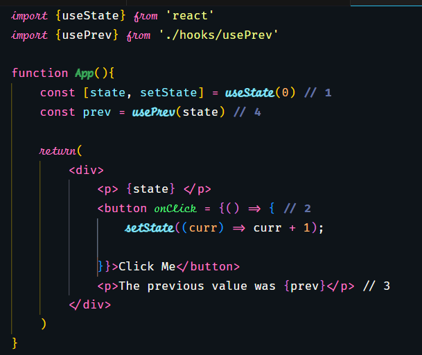 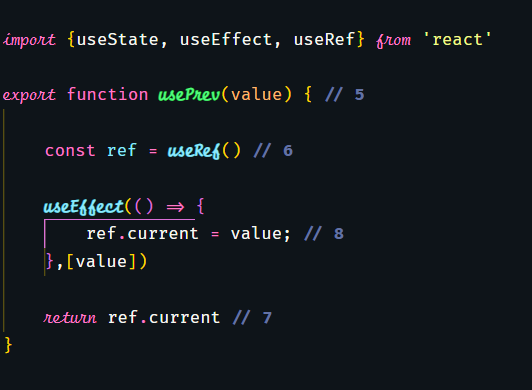

+ **Step 1 or `// 1` ->** initialised the `state` as state variable whose inital value has been set to 0
    + If you will now use `usePrev` hook or the **the first time it shows** then the value will come -> **Undefined** not **0** as we have not defined what the `ref` is going to be 

+ **Step 2 or `// 2` ->** Now once you clicked the button `Click Me`, `setState` will run and set the current value of `state` variable to **increase by 1** **Lets say for simplicity we have taken that 1 was present inside the `state` variable** now after `// 2`, `state` value becomes **2** and then the re-rendering of the component will occur, and the control will reach to step 3

+ **Step 3 or `// 3` ->** after the control reaches here, it will search for `prev` value to show it on the screen dut to which it will go to step 4

+ **Step 4 or `// 4` ->** to get the value of `prev`, it will go inside the `usePrev` hook with value = **2** as argument as see `// 2` explanation above, the current value of `state` variable is **2**

+ **Step 5 or `// 5` ->** `usePrev` will take the value of `state` given from the `App.js` file as Argument and rename it as `value` now has value = **2** Now comes the <span style="color:orange">**Most important part ->**</span> as the value of `value` has changed, so `useEffect` will come in Action and run the **callback function present inside it** which will eventually make the `ref.current = value` line to execute and hence `ref.current` me to = **2** aa jayega now after this line `return ref.current` line will return value = **2** (can you see the error) **2** he value to aaya tha initially, `return` v **2** he kr rhe, then whats the point of writing this much logic, Here comes the real react codeflow

> :warning: <span style="color:orange">**Always Remember ->**</span> **"It `returns` first, `effect` gets called later"**
>
> > the above is the reason that you are seeing `// 7` written in `return` statement and then `// 8` to `useEffect`, coming back to codeflow keeping this in mind

+ **Step 6 or `// 6` ->** just created a refernce variable `ref` for reference

+ **Step 7 or `// 7` ->** as old value = **1** is **present inside the** `ref` variable, It will get **return** first, and then `useEffect` will run and hence **2** nhi **1 (previous value)** **return hoga**
    + This is also the reason that **undefined** return hua(`prev` variable me) when you clicked the button for the first time(i.e. `state` = 0) to as `ref` variable me previous value or old value **Kuch tha he nhi** so `ref.current` me v **kuch nhi gya means UNDEFINED** and according to "return first, effect later" to return phle hua which lead to returning **Undefined** value

+ **Step 8 or `// 8` ->** now the `useEffect` will run and set the `ref.current` value = `value`(which has **2** means new value) and in this way things are working or more precisely `usePrev` is working

:bulb: **Do you think that the above made `usePrev` hook you made is correct ?**

-> check this very good blog post on `usePrev` hook -> [usePrevious hook](https://giacomocerquone.com/blog/life-death-useprevious-hook/)

### **`useDebounce` hook**
----------


before creating this hook, first of all lets understand 

:bulb: **What is Debouncing means ??**

-> lets first understand it by the practical usecase of it. when you go to any e- commerce website or any website, and then try to search by typing **really fast** it stops giving you suggestion of what you are searching or in simple words, **it stops sending the request to backend server** and once you stop typing after 5ms or some time it sends the request to backend server, this is what **Debouncing means**

-> **If a function is being called for too many times in a particular interval of time, then you actually WAIT for the function to actually get called**

what we actually want 

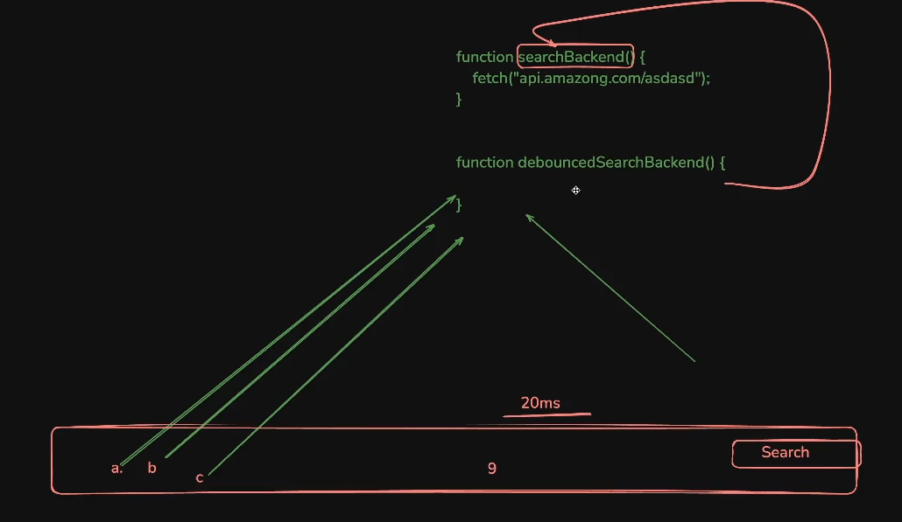

`searchBackend` is the real function that everytime gets called to serach in the backend, but that can be **SPAMMED** so to avoid it, first all the input request will go through the `deboundedSearchBackend` function and its **responsiblity is to limit or debounce the number of input request while searching for a particular keyword very fast** (its main job is to call `searchBackend` only when the input changes and that too after getting stable) 

-> if according to picture above, if the user types something within `20ms` again, then `debouncedSearchBackend` will not send the request via the `searchBackend` function, if the user types something after `20ms` then till this all the request will go to `serachBackend`  via the `debouncedSearchBackend` and then again waits till an interval of `20ms` completes


Lets first try to make the `searchBackend` function first and then we will generate the custom hook

```javascript
function searchBackend(){
    console.log("request sent to backend") // in real life you will send request to backend via the 'fetch' function
}
```

Now lets make `debouncedSearchBackend` function

```javascript
function searchBackend(){
    console.log("request sent to backend")
}

let currentClock 

function debouncedSearchBackend(){ // 2 control reaches here the timer of 30ms started (but before it starts, it need to reset also, as we want ki 30ms ke andar agar wapas se call ho gya debouncedSearchBackend to timer ko wapas se 30ms pe reset kr do) that why clearInterval line likha
    clearInterval(currentClock)
    currentClock = setInterval(searchBackend, 30)  // agar kbhi bhi 30ms se upar time ho gya to 'searchBackend' call kr do and thats warna again reset kro using clearInterval
}

debouncedSearchBackend() // 1 first this function get called 
debouncedSearchBackend()
debouncedSearchBackend()
debouncedSearchBackend() // 3
```

although here `debouncedSearchBackend` 4 times call ho gya (jo generally 30 ms ke andar he charo call ho gya honge), so output will be only be **1 time printing -> "request sent to backend"** as jb contorl `// 3` execute kr rha hoga after then only uske pas `30ms` ka interval mila hoga and hence `searchBackend` gets called then resulting the console print


Now lets make the `useDebounce` hook now

first thinking of the hooks being used here 

+ we have to __store__ the value of current clock so that if it passes the limit, we can do some stuff so again 3 ways to store the value in react. we will **Not use the `useState` hook and make `currentClock` as state variable** (because **we dont want our whole component to re-render just because `currentClock` value is changing**) so its clear that we have to use **`useRef`** hook as that will **store the value without even re-rendering**


```javascript
import {useState, useRef} from 'react'

function useDebounce(originalFn){ // making custom hook useDebounce that will take a function as IMPUT
    // not made a seperate file to make it simple otherwise you can do it just as you did for other hooks above
    const currentClock = useRef() // made a refernce variable 

    const fn = () => {
        clearInterval(currentClock.current) // same logic as discussed above
        currentClock.current = setInterval(originalFn, 200)
    }
    return fn; 
}

function App(){
    function sendDataToBackend(){
        fetch("https://api/amazon/search/")
    }

    const debounceFn = useDebounce(sendDataToBackend) // calling the useDebounce hook by providing 'sendDataToBackend' as input function

    return (
        <div>
            <input type = "text" onChange = {debounceFn}></input>
        </div>
    )
}

export default App
```

and that all now you can see this `useDebounce` hook work. A video of it is also attached below

<video width="800" height="400" controls>
  <source src="useDebounce_tutorial.mp4" type="video/mp4">
</video>

Notice the moment you stopped typing, **request** `/search` went out to backend server in the above video 

Now you must be wandering that why we have made `useDebounce` hook if the same thing can be done by using **simple function (you have did this just before making this hook)**, and which is correct also, **we dont need this hook for atleast doing this**

Now to differentiate the above thing and make really a `useDebounce` hook, we will see and another approach to make this and that is __by using -> state variables__

```javascript
import { useState, useEffect } from 'react';

const useDebounce = (value, delay) => { // useDebounce hook do cheez lega ek to string content and second 'delay' (means kitne ms typing rukne ke baad me string or 'value' ko backend server pe bhejna h)
    const [debouncedValue, setDebouncedValue] = useState(value); // made another seperate state variable to track the change in debouncedValue as yahan pr 'inputVal' ko track thode krna h

    useEffect(() => { // wrote the logic of useDebounce hook simple
        const handler = setTimeout(() => {
            setDebouncedValue(value);
        }, delay);

        return () => { // this is the CLEANUP logic if you have understood the useEffect  hook you will better understand this 
            clearTimeout(handler);
        };
    }, [value, delay]); // agar value ya delay me change aaya to callback phir se run kr do 

    return debouncedValue; //  again here first return will happen then 'effect' will occur (already discussed above) 
};

function App(){
    // made a state variable 'inputVal' to track the changes in the input box or string provided by the user
    const [inputVal, setInputVal] = useState("") // Intitally 'inputVal' set to EMPTY string 
    const debouncedValue = useDebounce(inputVal, 200) // useDebounce hook current string jo inputVal me h usko and delay (here its value taken as 200) ko liya and sent it as it is required for useDebounce hook

    function change(e){
        setInputVal(e.target.value) // onChange me jo event return hoga wo 'e' variable me store hua and taken inside 'change' function now 'e.target.value' jo v input box me type hua h usko refer kr rha h and through setInputVal that value has now been stored to inputVal
    }

    useEffect(() => {
        // expensive operation logic here 
        console.log("expensive operation") // for simplicity just consoled it here
    }, [debouncedValue]) // we used 'debouncedValue' here as agar isme change aaye tbhi expensive operation chlana (not used 'inputVal' as wo to original change hoga na) 
    // consider 'inputVal' as original function and 'debouncedValue' as debouncedSearchBackend function to phle tmhara debouncedValue ke through jayega and it will check ki original ko chnage krna h ya nhi 

    return(
        <>
            <input type = "text" onChange = {change}></input>
        </>
    )
}
```
Now the above code for `useDebounce` will also run the same way as the another code for `useDebounce` was running. SAME TO SAME VIDEO demonstration applies to this hook 

### **`useIsOnline` hook**
----------


## **Assignment**
----------


+ Read about **swr** and **react-query**
+ see the better verison of `usePrev` hook
+ explore [Custom Hook](https://usehooks.com/)

thats all for the custom hook, try to explore all the **above and many like these with their implementation on this website ->** [Custom hooks of React](https://usehooks.com/) [**A library where you can find all these hooks**]


 


 


 


 


